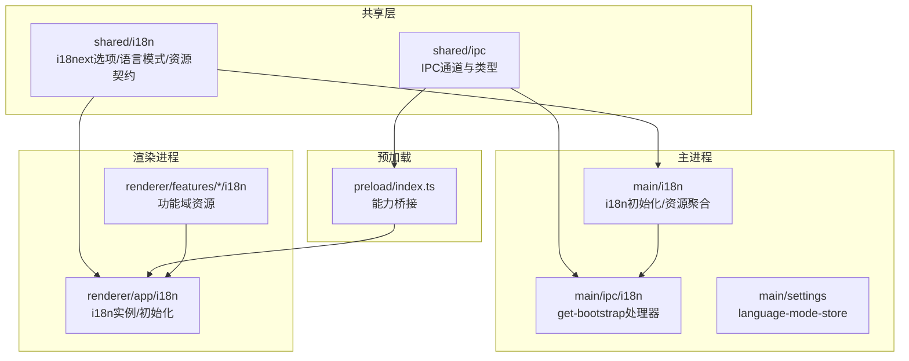
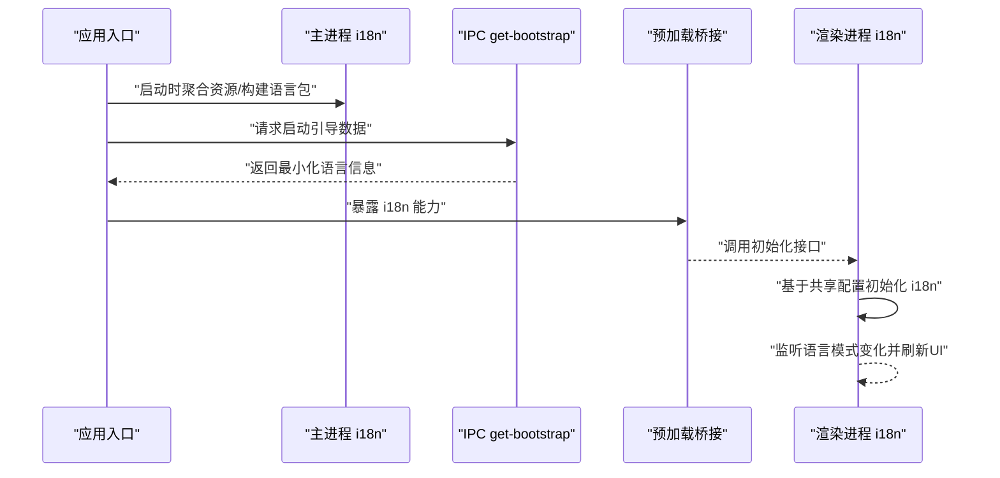
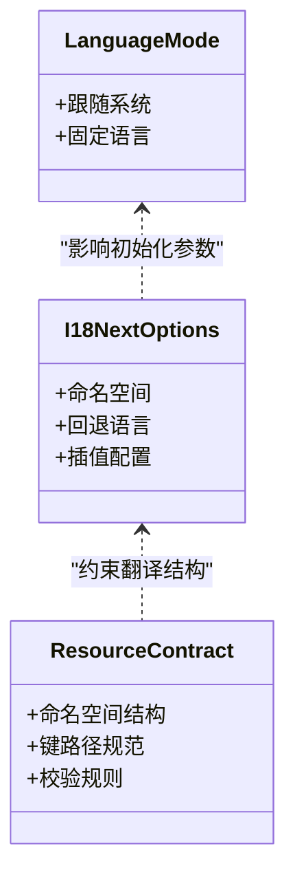
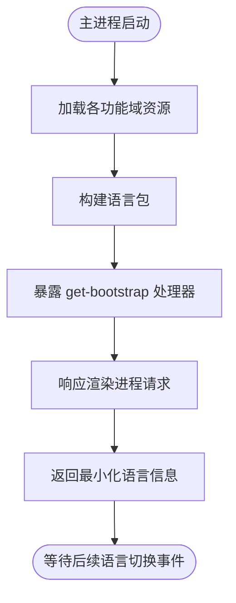
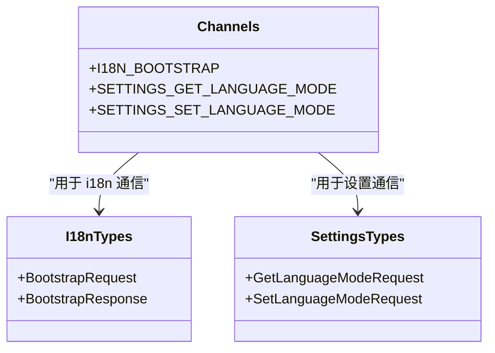
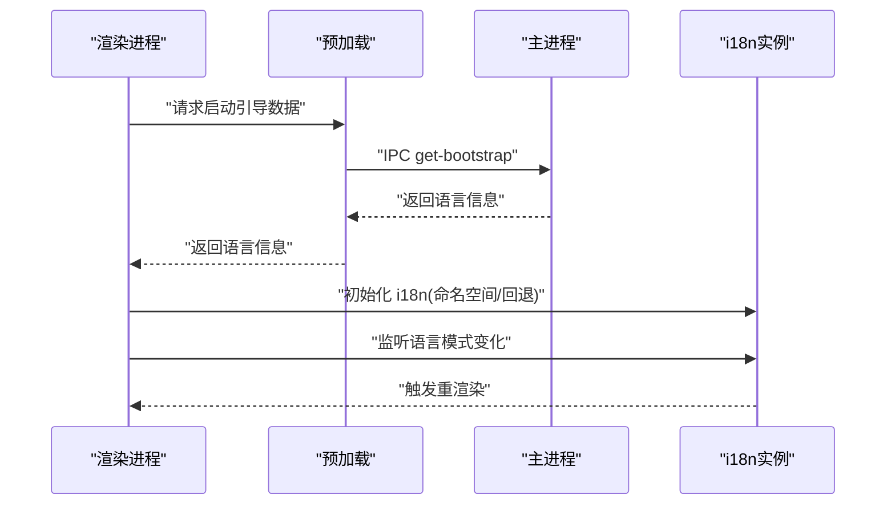

# 国际化支持

<cite>
**本文引用的文件**   
- [apps/desktop/src/main/i18n/index.ts](file://apps/desktop/src/main/i18n/index.ts)
- [apps/desktop/src/main/i18n/resources.ts](file://apps/desktop/src/main/i18n/resources.ts)
- [apps/desktop/src/main/ipc/i18n/handlers/get-bootstrap.ts](file://apps/desktop/src/main/ipc/i18n/handlers/get-bootstrap.ts)
- [apps/desktop/src/main/ipc/i18n/index.ts](file://apps/desktop/src/main/ipc/i18n/index.ts)
- [apps/desktop/src/main/settings/language-mode-store.ts](file://apps/desktop/src/main/settings/language-mode-store.ts)
- [apps/desktop/src/preload/index.ts](file://apps/desktop/src/preload/index.ts)
- [apps/desktop/src/renderer/src/app/i18n/index.ts](file://apps/desktop/src/renderer/src/app/i18n/index.ts)
- [apps/desktop/src/renderer/src/app/i18n/renderer-i18n.ts](file://apps/desktop/src/renderer/src/app/i18n/renderer-i18n.ts)
- [apps/desktop/src/shared/i18n/i18next-options.ts](file://apps/desktop/src/shared/i18n/i18next-options.ts)
- [apps/desktop/src/shared/i18n/language-mode.ts](file://apps/desktop/src/shared/i18n/language-mode.ts)
- [apps/desktop/src/shared/i18n/resource-contract.ts](file://apps/desktop/src/shared/i18n/resource-contract.ts)
- [apps/desktop/src/shared/ipc/channels.ts](file://apps/desktop/src/shared/ipc/channels.ts)
- [apps/desktop/src/shared/ipc/i18n/types.ts](file://apps/desktop/src/shared/ipc/i18n/types.ts)
- [apps/desktop/src/shared/ipc/settings/types.ts](file://apps/desktop/src/shared/ipc/settings/types.ts)
- [apps/desktop/src/renderer/src/features/authentication/i18n/resources.ts](file://apps/desktop/src/renderer/src/features/authentication/i18n/resources.ts)
- [apps/desktop/docs/adr/0001-feature-owned-localization-resources.md](file://apps/desktop/docs/adr/0001-feature-owned-localization-resources.md)
- [apps/desktop/docs/adr/0002-main-process-owns-language-mode.md](file://apps/desktop/docs/adr/0002-main-process-owns-language-mode.md)
</cite>

## 目录
1. [简介](#简介)
2. [项目结构](#项目结构)
3. [核心组件](#核心组件)
4. [架构总览](#架构总览)
5. [详细组件分析](#详细组件分析)
6. [依赖关系分析](#依赖关系分析)
7. [性能考虑](#性能考虑)
8. [故障排查指南](#故障排查指南)
9. [结论](#结论)
10. [附录](#附录)

## 简介
本文件为 nevix-ai 桌面端（Electron）的国际化（i18n）系统提供全面文档。内容涵盖多语言支持的架构设计、资源文件组织、语言切换机制与动态加载策略；记录 i18next 配置选项、翻译文件格式与命名约定；说明主进程与渲染进程间的国际化同步、语言模式设置与用户偏好管理；并提供添加翻译、新增语言、运行时切换、默认语言检测与回退机制的实践步骤与最佳实践，以及常见问题与性能优化建议。

## 项目结构
本项目采用“功能切片 + 分层”的组织方式，国际化相关代码分布在以下位置：
- 共享层 shared/i18n：定义 i18next 通用选项、语言模式枚举与资源契约类型
- 主进程 main/i18n：初始化 i18n、聚合各模块资源、暴露启动引导数据
- IPC 通道 ipc/i18n：主进程侧处理渲染进程的语言引导请求
- 预加载 preload：桥接主进程能力到渲染进程
- 渲染进程 renderer/app/i18n：渲染进程侧 i18n 实例化与使用
- 功能模块 features/*/i18n：按功能域组织翻译资源
- ADR 文档：记录“功能域拥有本地化资源”和“主进程拥有语言模式”的设计决策

图表来源
- [apps/desktop/src/shared/i18n/i18next-options.ts](file://apps/desktop/src/shared/i18n/i18next-options.ts)
- [apps/desktop/src/shared/i18n/language-mode.ts](file://apps/desktop/src/shared/i18n/language-mode.ts)
- [apps/desktop/src/shared/i18n/resource-contract.ts](file://apps/desktop/src/shared/i18n/resource-contract.ts)
- [apps/desktop/src/shared/ipc/channels.ts](file://apps/desktop/src/shared/ipc/channels.ts)
- [apps/desktop/src/main/i18n/index.ts](file://apps/desktop/src/main/i18n/index.ts)
- [apps/desktop/src/main/ipc/i18n/handlers/get-bootstrap.ts](file://apps/desktop/src/main/ipc/i18n/handlers/get-bootstrap.ts)
- [apps/desktop/src/preload/index.ts](file://apps/desktop/src/preload/index.ts)
- [apps/desktop/src/renderer/src/app/i18n/index.ts](file://apps/desktop/src/renderer/src/app/i18n/index.ts)
- [apps/desktop/src/renderer/src/features/authentication/i18n/resources.ts](file://apps/desktop/src/renderer/src/features/authentication/i18n/resources.ts)

章节来源
- [apps/desktop/docs/adr/0001-feature-owned-localization-resources.md](file://apps/desktop/docs/adr/0001-feature-owned-localization-resources.md)
- [apps/desktop/docs/adr/0002-main-process-owns-language-mode.md](file://apps/desktop/docs/adr/0002-main-process-owns-language-mode.md)

## 核心组件
- 共享 i18next 配置：集中定义 i18next 的通用选项，如命名空间、回退语言、插值等，供主进程与渲染进程复用
- 语言模式枚举：统一表示当前语言模式（例如“跟随系统”或“固定语言”），由主进程维护并持久化
- 资源契约类型：定义翻译资源的结构与校验规则，确保各功能域资源一致性
- 主进程 i18n：负责聚合所有功能域资源、构建初始语言包、对外提供启动引导数据
- IPC 通道与处理器：通过 channels 与 types 定义通信协议，get-bootstrap 处理器返回渲染进程所需的最小化语言信息
- 预加载桥接：将主进程的 i18n 能力安全暴露给渲染进程
- 渲染进程 i18n：基于共享配置初始化 i18n 实例，订阅语言变化并刷新 UI

章节来源
- [apps/desktop/src/shared/i18n/i18next-options.ts](file://apps/desktop/src/shared/i18n/i18next-options.ts)
- [apps/desktop/src/shared/i18n/language-mode.ts](file://apps/desktop/src/shared/i18n/language-mode.ts)
- [apps/desktop/src/shared/i18n/resource-contract.ts](file://apps/desktop/src/shared/i18n/resource-contract.ts)
- [apps/desktop/src/main/i18n/index.ts](file://apps/desktop/src/main/i18n/index.ts)
- [apps/desktop/src/main/ipc/i18n/handlers/get-bootstrap.ts](file://apps/desktop/src/main/ipc/i18n/handlers/get-bootstrap.ts)
- [apps/desktop/src/preload/index.ts](file://apps/desktop/src/preload/index.ts)
- [apps/desktop/src/renderer/src/app/i18n/index.ts](file://apps/desktop/src/renderer/src/app/i18n/index.ts)

## 架构总览
下图展示了从应用启动到渲染进程完成 i18n 初始化的关键流程，包括主进程聚合资源、IPC 传递引导数据、渲染进程初始化 i18n 实例与监听语言变化。

图表来源
- [apps/desktop/src/main/i18n/index.ts](file://apps/desktop/src/main/i18n/index.ts)
- [apps/desktop/src/main/ipc/i18n/handlers/get-bootstrap.ts](file://apps/desktop/src/main/ipc/i18n/handlers/get-bootstrap.ts)
- [apps/desktop/src/preload/index.ts](file://apps/desktop/src/preload/index.ts)
- [apps/desktop/src/renderer/src/app/i18n/index.ts](file://apps/desktop/src/renderer/src/app/i18n/index.ts)

## 详细组件分析

### 共享 i18next 配置与语言模式
- i18next 选项：在共享层集中定义，避免重复配置，保证主/渲染进程行为一致
- 语言模式：以枚举形式表达“跟随系统/固定语言”，由主进程存储与更新
- 资源契约：约束翻译键的结构与命名，便于静态检查与自动化校验

图表来源
- [apps/desktop/src/shared/i18n/i18next-options.ts](file://apps/desktop/src/shared/i18n/i18next-options.ts)
- [apps/desktop/src/shared/i18n/language-mode.ts](file://apps/desktop/src/shared/i18n/language-mode.ts)
- [apps/desktop/src/shared/i18n/resource-contract.ts](file://apps/desktop/src/shared/i18n/resource-contract.ts)

章节来源
- [apps/desktop/src/shared/i18n/i18next-options.ts](file://apps/desktop/src/shared/i18n/i18next-options.ts)
- [apps/desktop/src/shared/i18n/language-mode.ts](file://apps/desktop/src/shared/i18n/language-mode.ts)
- [apps/desktop/src/shared/i18n/resource-contract.ts](file://apps/desktop/src/shared/i18n/resource-contract.ts)

### 主进程 i18n 与资源聚合
- 资源聚合：主进程汇总各功能域的翻译资源，形成完整语言包
- 启动引导：通过 IPC 向渲染进程返回最小化语言信息（如当前语言、可用语言列表、命名空间映射）
- 语言模式持久化：主进程维护语言模式，并在需要时更新

图表来源
- [apps/desktop/src/main/i18n/index.ts](file://apps/desktop/src/main/i18n/index.ts)
- [apps/desktop/src/main/ipc/i18n/handlers/get-bootstrap.ts](file://apps/desktop/src/main/ipc/i18n/handlers/get-bootstrap.ts)
- [apps/desktop/src/main/settings/language-mode-store.ts](file://apps/desktop/src/main/settings/language-mode-store.ts)

章节来源
- [apps/desktop/src/main/i18n/index.ts](file://apps/desktop/src/main/i18n/index.ts)
- [apps/desktop/src/main/ipc/i18n/handlers/get-bootstrap.ts](file://apps/desktop/src/main/ipc/i18n/handlers/get-bootstrap.ts)
- [apps/desktop/src/main/settings/language-mode-store.ts](file://apps/desktop/src/main/settings/language-mode-store.ts)

### IPC 通道与类型定义
- 通道名称：在共享层定义统一的 IPC 通道名，避免硬编码
- 类型契约：明确请求与响应的数据结构，保障主/渲染进程间的数据一致性

图表来源
- [apps/desktop/src/shared/ipc/channels.ts](file://apps/desktop/src/shared/ipc/channels.ts)
- [apps/desktop/src/shared/ipc/i18n/types.ts](file://apps/desktop/src/shared/ipc/i18n/types.ts)
- [apps/desktop/src/shared/ipc/settings/types.ts](file://apps/desktop/src/shared/ipc/settings/types.ts)

章节来源
- [apps/desktop/src/shared/ipc/channels.ts](file://apps/desktop/src/shared/ipc/channels.ts)
- [apps/desktop/src/shared/ipc/i18n/types.ts](file://apps/desktop/src/shared/ipc/i18n/types.ts)
- [apps/desktop/src/shared/ipc/settings/types.ts](file://apps/desktop/src/shared/ipc/settings/types.ts)

### 预加载桥接
- 职责：将主进程的 i18n 能力安全暴露给渲染进程，限制直接访问主进程 API
- 实现：封装 IPC 调用，提供初始化与事件监听方法

章节来源
- [apps/desktop/src/preload/index.ts](file://apps/desktop/src/preload/index.ts)

### 渲染进程 i18n 初始化与使用
- 初始化：基于共享配置创建 i18n 实例，加载命名空间与资源
- 语言切换：监听语言模式变化，按需重新加载命名空间并刷新 UI
- 资源组织：按功能域拆分翻译资源，便于独立维护与测试

图表来源
- [apps/desktop/src/renderer/src/app/i18n/index.ts](file://apps/desktop/src/renderer/src/app/i18n/index.ts)
- [apps/desktop/src/renderer/src/app/i18n/renderer-i18n.ts](file://apps/desktop/src/renderer/src/app/i18n/renderer-i18n.ts)
- [apps/desktop/src/preload/index.ts](file://apps/desktop/src/preload/index.ts)

章节来源
- [apps/desktop/src/renderer/src/app/i18n/index.ts](file://apps/desktop/src/renderer/src/app/i18n/index.ts)
- [apps/desktop/src/renderer/src/app/i18n/renderer-i18n.ts](file://apps/desktop/src/renderer/src/app/i18n/renderer-i18n.ts)

### 功能域资源组织（示例：认证模块）
- 资源文件：每个功能域拥有独立的 i18n 资源文件，遵循统一命名约定
- 集成方式：在主进程聚合阶段自动发现并合并，无需手动注册

章节来源
- [apps/desktop/src/renderer/src/features/authentication/i18n/resources.ts](file://apps/desktop/src/renderer/src/features/authentication/i18n/resources.ts)
- [apps/desktop/docs/adr/0001-feature-owned-localization-resources.md](file://apps/desktop/docs/adr/0001-feature-owned-localization-resources.md)

## 依赖关系分析
- 共享层被主进程与渲染进程共同依赖，确保配置与类型一致
- 主进程负责资源聚合与语言模式管理，渲染进程仅消费最小化数据
- IPC 通道与类型作为契约，降低耦合度

图表来源
- [apps/desktop/src/shared/i18n/i18next-options.ts](file://apps/desktop/src/shared/i18n/i18next-options.ts)
- [apps/desktop/src/shared/ipc/channels.ts](file://apps/desktop/src/shared/ipc/channels.ts)
- [apps/desktop/src/main/i18n/index.ts](file://apps/desktop/src/main/i18n/index.ts)
- [apps/desktop/src/main/ipc/i18n/handlers/get-bootstrap.ts](file://apps/desktop/src/main/ipc/i18n/handlers/get-bootstrap.ts)
- [apps/desktop/src/preload/index.ts](file://apps/desktop/src/preload/index.ts)
- [apps/desktop/src/renderer/src/app/i18n/index.ts](file://apps/desktop/src/renderer/src/app/i18n/index.ts)

章节来源
- [apps/desktop/src/shared/i18n/i18next-options.ts](file://apps/desktop/src/shared/i18n/i18next-options.ts)
- [apps/desktop/src/shared/ipc/channels.ts](file://apps/desktop/src/shared/ipc/channels.ts)
- [apps/desktop/src/main/i18n/index.ts](file://apps/desktop/src/main/i18n/index.ts)
- [apps/desktop/src/main/ipc/i18n/handlers/get-bootstrap.ts](file://apps/desktop/src/main/ipc/i18n/handlers/get-bootstrap.ts)
- [apps/desktop/src/preload/index.ts](file://apps/desktop/src/preload/index.ts)
- [apps/desktop/src/renderer/src/app/i18n/index.ts](file://apps/desktop/src/renderer/src/app/i18n/index.ts)

## 性能考虑
- 延迟加载命名空间：仅在页面首次使用时加载对应命名空间，减少首屏体积
- 资源压缩与缓存：对翻译资源进行压缩，并在内存中缓存已加载命名空间
- 避免频繁重渲染：语言切换时批量更新，减少不必要的组件重渲染
- 默认语言与回退：合理设置回退语言，减少缺失键导致的额外查找开销

[本节为通用指导，不直接分析具体文件]

## 故障排查指南
- 问题：渲染进程无法获取语言引导数据
  - 检查 IPC 通道名称是否一致
  - 确认 get-bootstrap 处理器是否正确返回最小化语言信息
- 问题：语言切换后 UI 未刷新
  - 确认渲染进程是否正确监听语言模式变化事件
  - 检查 i18n 实例是否重新加载了命名空间
- 问题：翻译键缺失或格式错误
  - 使用资源契约类型进行静态检查
  - 核对命名空间与键路径是否符合约定

章节来源
- [apps/desktop/src/main/ipc/i18n/handlers/get-bootstrap.ts](file://apps/desktop/src/main/ipc/i18n/handlers/get-bootstrap.ts)
- [apps/desktop/src/renderer/src/app/i18n/index.ts](file://apps/desktop/src/renderer/src/app/i18n/index.ts)
- [apps/desktop/src/shared/i18n/resource-contract.ts](file://apps/desktop/src/shared/i18n/resource-contract.ts)

## 结论
nevix-ai 的国际化系统通过共享配置、主进程资源聚合与 IPC 通信，实现了清晰的分层与低耦合。功能域资源组织与资源契约确保了可维护性与一致性。结合延迟加载、缓存与合理的回退策略，可在保证用户体验的同时提升性能。遵循本文档的最佳实践，可高效扩展新语言与功能域翻译。

[本节为总结性内容，不直接分析具体文件]

## 附录

### 添加翻译的步骤
- 在对应功能域下创建或编辑翻译资源文件
- 遵循资源契约约定的命名空间与键路径
- 确保主进程能自动聚合该资源（通常无需额外配置）
- 在渲染进程中通过 i18n 实例使用该键

章节来源
- [apps/desktop/src/renderer/src/features/authentication/i18n/resources.ts](file://apps/desktop/src/renderer/src/features/authentication/i18n/resources.ts)
- [apps/desktop/src/shared/i18n/resource-contract.ts](file://apps/desktop/src/shared/i18n/resource-contract.ts)

### 新增语言支持
- 在共享层确认语言枚举包含新语言代码
- 在各功能域资源文件中添加新语言的翻译键
- 验证主进程聚合后的语言包包含新语言
- 在渲染进程中测试语言切换与显示

章节来源
- [apps/desktop/src/shared/i18n/language-mode.ts](file://apps/desktop/src/shared/i18n/language-mode.ts)
- [apps/desktop/src/main/i18n/index.ts](file://apps/desktop/src/main/i18n/index.ts)

### 运行时语言切换与默认语言检测
- 默认语言：根据系统语言或用户偏好选择，若缺失则回退到默认语言
- 运行时切换：通过 IPC 更新语言模式，渲染进程监听变化并刷新 UI
- 回退机制：当目标语言缺失键时，按回退链查找直至找到或返回键名

章节来源
- [apps/desktop/src/main/settings/language-mode-store.ts](file://apps/desktop/src/main/settings/language-mode-store.ts)
- [apps/desktop/src/renderer/src/app/i18n/index.ts](file://apps/desktop/src/renderer/src/app/i18n/index.ts)
- [apps/desktop/src/shared/i18n/i18next-options.ts](file://apps/desktop/src/shared/i18n/i18next-options.ts)

### 最佳实践
- 按功能域组织翻译资源，避免单一大文件
- 使用资源契约类型进行静态检查，防止键路径错误
- 优先使用命名空间隔离不同模块的翻译
- 谨慎修改公共命名空间的键，避免破坏兼容性

章节来源
- [apps/desktop/docs/adr/0001-feature-owned-localization-resources.md](file://apps/desktop/docs/adr/0001-feature-owned-localization-resources.md)
- [apps/desktop/src/shared/i18n/resource-contract.ts](file://apps/desktop/src/shared/i18n/resource-contract.ts)