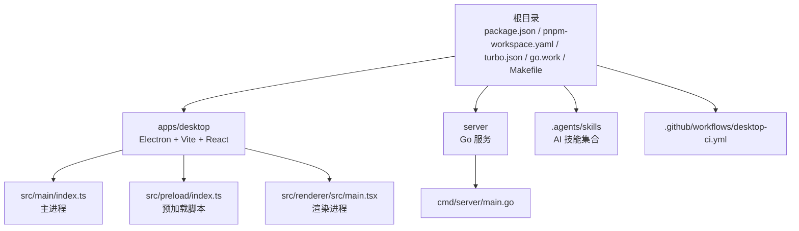
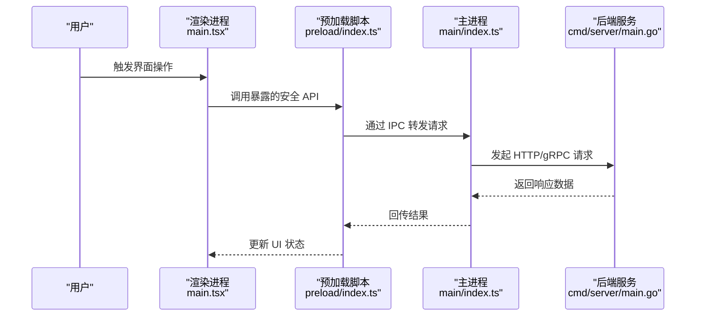
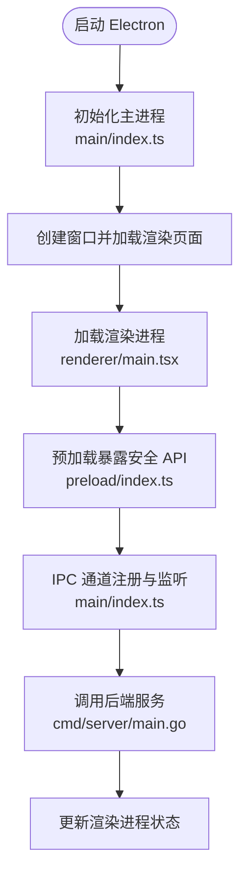
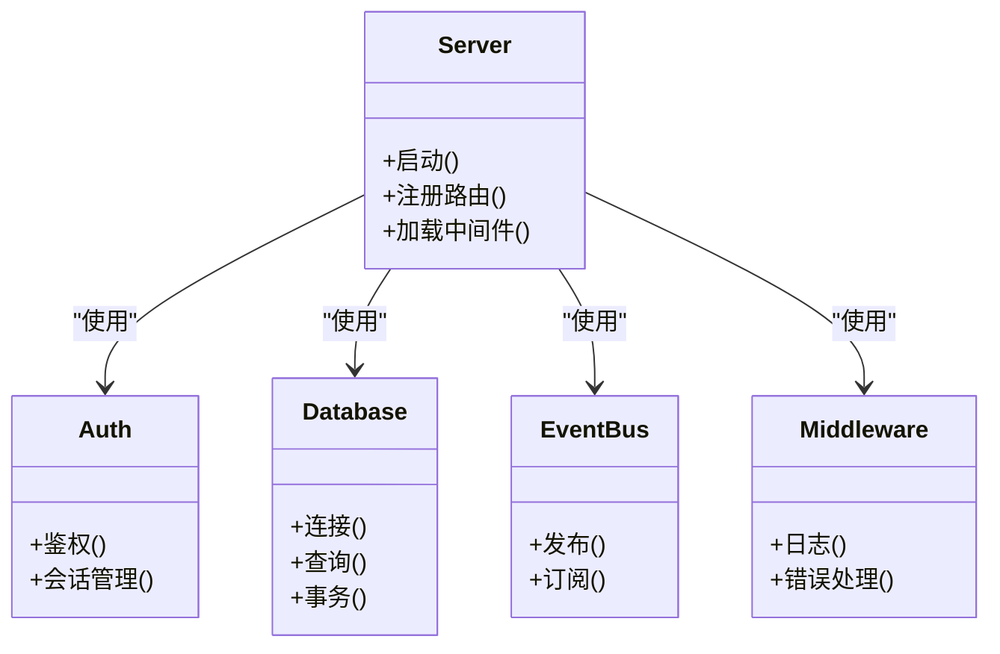
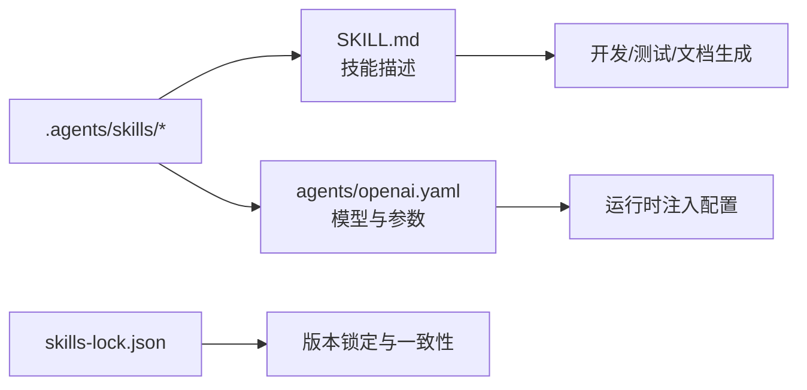
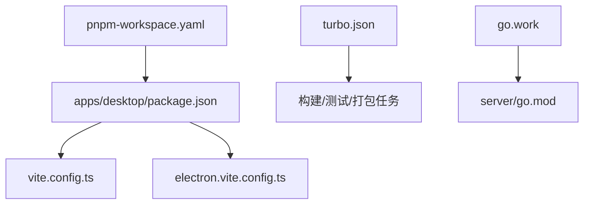

# 开发指南

<cite>
**本文引用的文件**   
- [package.json](file://package.json)
- [pnpm-workspace.yaml](file://pnpm-workspace.yaml)
- [turbo.json](file://turbo.json)
- [go.work](file://go.work)
- [Makefile](file://Makefile)
- [README.md](file://README.md)
- [apps/desktop/package.json](file://apps/desktop/package.json)
- [apps/desktop/electron.vite.config.ts](file://apps/desktop/electron.vite.config.ts)
- [apps/desktop/vite.config.ts](file://apps/desktop/vite.config.ts)
- [apps/desktop/src/main/index.ts](file://apps/desktop/src/main/index.ts)
- [apps/desktop/src/preload/index.ts](file://apps/desktop/src/preload/index.ts)
- [apps/desktop/src/renderer/src/main.tsx](file://apps/desktop/src/renderer/src/main.tsx)
- [server/go.mod](file://server/go.mod)
- [server/cmd/server/main.go](file://server/cmd/server/main.go)
- [.github/workflows/desktop-ci.yml](file://.github/workflows/desktop-ci.yml)
- [skills-lock.json](file://skills-lock.json)
- [.agents/skills/ask-matt/SKILL.md](file://.agents/skills/ask-matt/SKILL.md)
- [.agents/skills/code-review/SKILL.md](file://.agents/skills/code-review/SKILL.md)
</cite>

## 目录
1. [简介](#简介)
2. [项目结构](#项目结构)
3. [核心组件](#核心组件)
4. [架构总览](#架构总览)
5. [详细组件分析](#详细组件分析)
6. [依赖分析](#依赖分析)
7. [性能考虑](#性能考虑)
8. [故障排除指南](#故障排除指南)
9. [结论](#结论)
10. [附录](#附录)

## 简介
本指南面向新加入与资深开发者，系统化说明 nevix-ai 项目的开发环境搭建、Monorepo 结构与包管理、构建与运行、热重载与调试、代码规范与提交约定、Git 工作流与分支策略、代码审查流程，以及 AI 助手技能开发与扩展机制。通过“从入门到进阶”的层次化内容，帮助团队高效协作与交付。

## 项目结构
本项目采用 Monorepo 组织方式，前端桌面应用位于 apps/desktop，后端服务位于 server，根目录通过 pnpm workspace 与 Go workspace 统一管理多语言工程。构建与任务编排由 Makefile 驱动，CI 流水线在 .github/workflows 中定义。AI 技能以 .agents/skills 为统一入口，通过 skills-lock.json 锁定版本。

**图表来源** 
- [package.json](file://package.json)
- [pnpm-workspace.yaml](file://pnpm-workspace.yaml)
- [turbo.json](file://turbo.json)
- [go.work](file://go.work)
- [Makefile](file://Makefile)
- [apps/desktop/package.json](file://apps/desktop/package.json)
- [apps/desktop/src/main/index.ts](file://apps/desktop/src/main/index.ts)
- [apps/desktop/src/preload/index.ts](file://apps/desktop/src/preload/index.ts)
- [apps/desktop/src/renderer/src/main.tsx](file://apps/desktop/src/renderer/src/main.tsx)
- [server/cmd/server/main.go](file://server/cmd/server/main.go)
- [.github/workflows/desktop-ci.yml](file://.github/workflows/desktop-ci.yml)

**章节来源**
- [README.md](file://README.md)
- [package.json](file://package.json)
- [pnpm-workspace.yaml](file://pnpm-workspace.yaml)
- [turbo.json](file://turbo.json)
- [go.work](file://go.work)
- [Makefile](file://Makefile)

## 核心组件
- 桌面应用（Electron + Vite + React）：主进程负责系统级能力与 IPC，预加载桥接安全上下文，渲染进程承载 UI。
- 后端服务（Go）：提供 API 与业务逻辑，遵循 Go 模块与包组织规范。
- 构建与任务编排：Makefile 统一入口，Turbo 加速跨包任务，pnpm workspace 管理 JS/TS 依赖。
- AI 技能：基于 .agents/skills 的技能目录与 SKILL.md 描述，配合 skills-lock.json 进行版本锁定与分发。

**章节来源**
- [apps/desktop/package.json](file://apps/desktop/package.json)
- [apps/desktop/electron.vite.config.ts](file://apps/desktop/electron.vite.config.ts)
- [apps/desktop/vite.config.ts](file://apps/desktop/vite.config.ts)
- [server/go.mod](file://server/go.mod)
- [skills-lock.json](file://skills-lock.json)

## 架构总览
下图展示 Electron 主进程、预加载脚本与渲染进程的交互关系，以及与后端服务的通信边界。

**图表来源**
- [apps/desktop/src/renderer/src/main.tsx](file://apps/desktop/src/renderer/src/main.tsx)
- [apps/desktop/src/preload/index.ts](file://apps/desktop/src/preload/index.ts)
- [apps/desktop/src/main/index.ts](file://apps/desktop/src/main/index.ts)
- [server/cmd/server/main.go](file://server/cmd/server/main.go)

## 详细组件分析

### 桌面应用（Electron + Vite + React）
- 主进程（main/index.ts）：初始化窗口、注册 IPC 通道、处理系统事件。
- 预加载（preload/index.ts）：暴露最小权限 API 给渲染进程，隔离 Node.js 能力。
- 渲染进程（renderer/main.tsx）：React 应用入口，集成 i18n、路由与状态管理。
- 构建配置（electron.vite.config.ts、vite.config.ts）：控制开发服务器、打包产物与资源路径。

**图表来源**
- [apps/desktop/src/main/index.ts](file://apps/desktop/src/main/index.ts)
- [apps/desktop/src/preload/index.ts](file://apps/desktop/src/preload/index.ts)
- [apps/desktop/src/renderer/src/main.tsx](file://apps/desktop/src/renderer/src/main.tsx)
- [apps/desktop/electron.vite.config.ts](file://apps/desktop/electron.vite.config.ts)
- [apps/desktop/vite.config.ts](file://apps/desktop/vite.config.ts)

**章节来源**
- [apps/desktop/package.json](file://apps/desktop/package.json)
- [apps/desktop/electron.vite.config.ts](file://apps/desktop/electron.vite.config.ts)
- [apps/desktop/vite.config.ts](file://apps/desktop/vite.config.ts)
- [apps/desktop/src/main/index.ts](file://apps/desktop/src/main/index.ts)
- [apps/desktop/src/preload/index.ts](file://apps/desktop/src/preload/index.ts)
- [apps/desktop/src/renderer/src/main.tsx](file://apps/desktop/src/renderer/src/main.tsx)

### 后端服务（Go）
- 入口（cmd/server/main.go）：服务启动、路由注册、中间件挂载。
- 模块与包（server/go.mod）：依赖管理与版本约束。
- 内部包（internal/pkg/*）：按功能划分认证、数据库、事件总线、中间件等。

**图表来源**
- [server/cmd/server/main.go](file://server/cmd/server/main.go)
- [server/go.mod](file://server/go.mod)

**章节来源**
- [server/cmd/server/main.go](file://server/cmd/server/main.go)
- [server/go.mod](file://server/go.mod)

### AI 助手与技能体系
- 技能目录（.agents/skills/*）：每个技能包含 SKILL.md 与 agents/openai.yaml 等描述文件。
- 版本锁定（skills-lock.json）：确保技能版本一致性与可重现性。
- 典型技能：如 ask-matt、code-review、tdd、supabase 等，覆盖需求澄清、代码审查、测试驱动、数据库最佳实践等场景。

**图表来源**
- [.agents/skills/ask-matt/SKILL.md](file://.agents/skills/ask-matt/SKILL.md)
- [.agents/skills/code-review/SKILL.md](file://.agents/skills/code-review/SKILL.md)
- [skills-lock.json](file://skills-lock.json)

**章节来源**
- [.agents/skills/ask-matt/SKILL.md](file://.agents/skills/ask-matt/SKILL.md)
- [.agents/skills/code-review/SKILL.md](file://.agents/skills/code-review/SKILL.md)
- [skills-lock.json](file://skills-lock.json)

## 依赖分析
- JavaScript/TypeScript：通过 pnpm workspace 管理 apps/desktop 及其子包依赖，turbo 用于跨包任务编排与缓存。
- Go：通过 go.work 聚合多个 Go 模块，server 使用独立 go.mod 管理依赖。
- 构建工具：Vite 与 Electron 构建管线由 electron.vite.config.ts 与 vite.config.ts 驱动。

**图表来源**
- [pnpm-workspace.yaml](file://pnpm-workspace.yaml)
- [apps/desktop/package.json](file://apps/desktop/package.json)
- [turbo.json](file://turbo.json)
- [go.work](file://go.work)
- [server/go.mod](file://server/go.mod)
- [apps/desktop/vite.config.ts](file://apps/desktop/vite.config.ts)
- [apps/desktop/electron.vite.config.ts](file://apps/desktop/electron.vite.config.ts)

**章节来源**
- [pnpm-workspace.yaml](file://pnpm-workspace.yaml)
- [apps/desktop/package.json](file://apps/desktop/package.json)
- [turbo.json](file://turbo.json)
- [go.work](file://go.work)
- [server/go.mod](file://server/go.mod)

## 性能考虑
- 前端构建优化：启用 Vite 增量构建与按需编译，合理拆分路由与组件，减少首屏体积。
- Electron 内存与启动：避免在主进程执行重计算，将耗时任务下沉至 Worker 或后端服务；精简预加载暴露的 API。
- 后端并发与连接池：根据负载调整数据库连接池大小，合理使用事件总线解耦异步任务。
- 缓存策略：利用 Turbo 的任务缓存与浏览器缓存，减少重复构建与网络请求。

[本节为通用指导，不直接分析具体文件]

## 故障排除指南
- 启动失败：检查端口占用、环境变量与依赖安装完整性；确认 Electron 主进程未抛出异常。
- 构建报错：清理缓存后重试，核对 pnpm/turbo 版本；查看 Vite 与 Electron 配置冲突。
- 后端连接问题：验证服务是否运行、网络可达性与凭据配置；检查中间件与路由注册顺序。
- 技能加载异常：确认 skills-lock.json 与 SKILL.md 一致性；检查 agents/openai.yaml 参数合法性。

**章节来源**
- [.github/workflows/desktop-ci.yml](file://.github/workflows/desktop-ci.yml)
- [apps/desktop/electron.vite.config.ts](file://apps/desktop/electron.vite.config.ts)
- [apps/desktop/vite.config.ts](file://apps/desktop/vite.config.ts)
- [server/cmd/server/main.go](file://server/cmd/server/main.go)

## 结论
本指南从项目结构、核心组件、架构设计到开发工作流与故障排除，提供了完整的新手入门与专家进阶参考。建议团队在本地复现构建与运行流程，结合 CI 流水线与代码审查规范，持续提升交付质量与效率。

[本节为总结性内容，不直接分析具体文件]

## 附录

### 开发命令与环境配置
- 安装依赖：使用 pnpm 安装 workspace 依赖，确保 Node 版本满足要求。
- 启动开发：分别启动前端与后端服务，启用热重载以便快速迭代。
- 构建与打包：通过 Makefile 统一入口，调用 Turbo 与 Vite/Electron 构建管线。
- 运行测试：执行单元测试与端到端测试，确保变更稳定性。

**章节来源**
- [Makefile](file://Makefile)
- [package.json](file://package.json)
- [apps/desktop/package.json](file://apps/desktop/package.json)

### Git 工作流与分支策略
- 分支命名：feature/xxx、bugfix/xxx、release/xxx 等，保持语义清晰。
- 提交约定：使用约定式提交（Conventional Commits），便于自动化生成变更日志。
- 代码审查：Pull Request 需包含变更说明、测试覆盖与影响评估，至少一名 reviewer 批准。
- 合并策略：优先使用 squash merge 保持主干整洁，必要时保留历史。

[本节为通用指导，不直接分析具体文件]

### 代码规范与工具链
- 代码风格：ESLint + Prettier 统一格式，Husky + lint-staged 在提交前校验。
- 类型检查：TypeScript 严格模式，确保接口契约稳定。
- 文档：SKILL.md 与 ADR 文档记录关键决策与实现背景。

**章节来源**
- [apps/desktop/.prettierrc.yaml](file://apps/desktop/.prettierrc.yaml)
- [apps/desktop/eslint.config.mjs](file://apps/desktop/eslint.config.mjs)

### 热重载与调试技巧
- 前端热重载：Vite HMR 与 Electron 自动重启，修改代码即时生效。
- 后端热重载：使用 air 或其他工具实现 Go 代码热更新。
- 调试：Chrome DevTools 调试渲染进程，VS Code 断点调试主进程与后端服务。

**章节来源**
- [apps/desktop/electron.vite.config.ts](file://apps/desktop/electron.vite.config.ts)
- [apps/desktop/vite.config.ts](file://apps/desktop/vite.config.ts)

### AI 技能开发与扩展机制
- 新增技能：在 .agents/skills 下创建目录，编写 SKILL.md 与 agents/openai.yaml。
- 版本锁定：更新 skills-lock.json 以固定版本，保证团队协作一致性。
- 测试与验证：通过示例用例验证技能行为，确保输出符合预期。

**章节来源**
- [.agents/skills/ask-matt/SKILL.md](file://.agents/skills/ask-matt/SKILL.md)
- [.agents/skills/code-review/SKILL.md](file://.agents/skills/code-review/SKILL.md)
- [skills-lock.json](file://skills-lock.json)