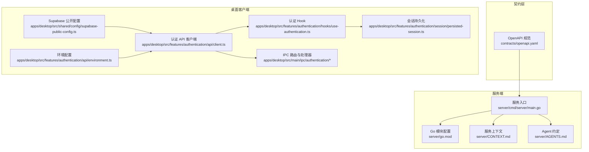
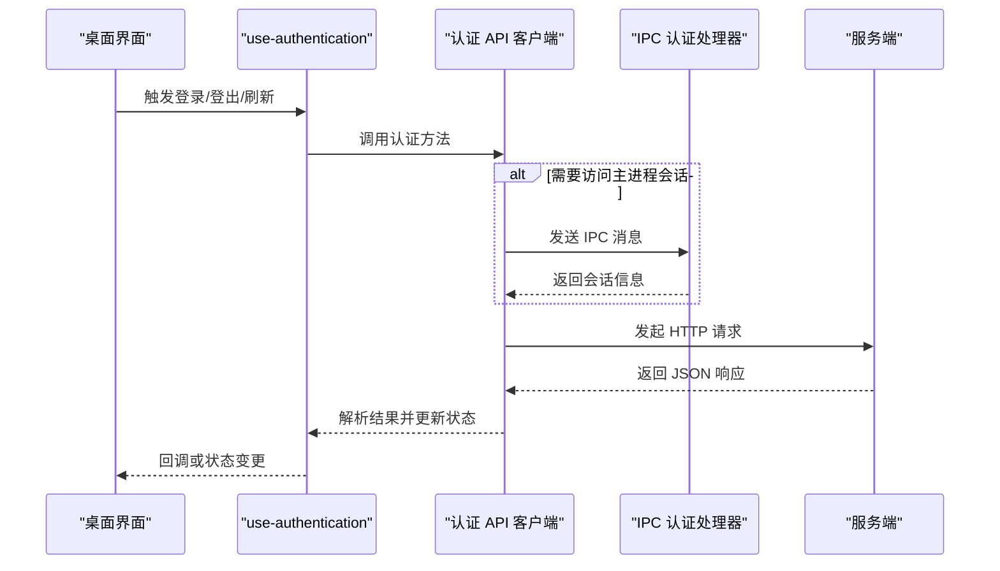
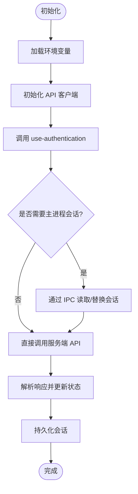
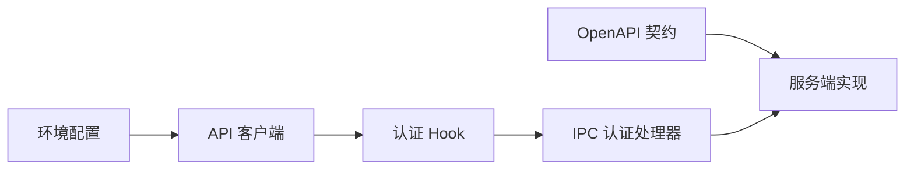

# API接口

<cite>
**本文引用的文件**   
- [contracts/openapi.yaml](file://contracts/openapi.yaml)
- [server/cmd/server/main.go](file://server/cmd/server/main.go)
- [server/go.mod](file://server/go.mod)
- [server/CONTEXT.md](file://server/CONTEXT.md)
- [server/AGENTS.md](file://server/AGENTS.md)
- [apps/desktop/src/shared/config/supabase-public-config.ts](file://apps/desktop/src/shared/config/supabase-public-config.ts)
- [apps/desktop/src/features/authentication/api/client.ts](file://apps/desktop/src/features/authentication/api/client.ts)
- [apps/desktop/src/features/authentication/api/environment.ts](file://apps/desktop/src/features/authentication/api/environment.ts)
- [apps/desktop/src/features/authentication/hooks/use-authentication.ts](file://apps/desktop/src/features/authentication/hooks/use-authentication.ts)
- [apps/desktop/src/features/authentication/session/persisted-session.ts](file://apps/desktop/src/features/authentication/session/persisted-session.ts)
- [apps/desktop/src/main/ipc/authentication/index.ts](file://apps/desktop/src/main/ipc/authentication/index.ts)
- [apps/desktop/src/main/ipc/authentication/clear-session.ts](file://apps/desktop/src/main/ipc/authentication/clear-session.ts)
- [apps/desktop/src/main/ipc/authentication/read-session.ts](file://apps/desktop/src/main/ipc/authentication/read-session.ts)
- [apps/desktop/src/main/ipc/authentication/replace-session.ts](file://apps/desktop/src/main/ipc/authentication/replace-session.ts)
- [apps/desktop/src/main/ipc/authentication/trusted-sender.ts](file://apps/desktop/src/main/ipc/authentication/trusted-sender.ts)
- [apps/desktop/tests/auth/harness/supabase/config.toml](file://apps/desktop/tests/auth/harness/supabase/config.toml)
</cite>

## 目录
1. [简介](#简介)
2. [项目结构](#项目结构)
3. [核心组件](#核心组件)
4. [架构总览](#架构总览)
5. [详细组件分析](#详细组件分析)
6. [依赖关系分析](#依赖关系分析)
7. [性能考虑](#性能考虑)
8. [故障排查指南](#故障排查指南)
9. [结论](#结论)
10. [附录](#附录)

## 简介
本文件为 nevix-ai 的 API 接口文档，目标是以 OpenAPI 规范为依据，系统化记录 RESTful 端点、认证与权限、错误处理策略、请求响应示例、数据验证规则与业务逻辑说明。同时补充中间件处理流程、日志与监控指标建议，以及客户端集成指南、SDK 使用方法和最佳实践，帮助开发者快速集成与调试。

## 项目结构
本项目采用多仓库/多应用结构：
- contracts/openapi.yaml：OpenAPI 规范定义（API 契约）
- server：Go 服务端实现（入口 main.go、模块 go.mod、上下文文档 CONTEXT.md、AGENTS.md）
- apps/desktop：桌面端应用（Electron），包含认证相关的前端调用、IPC 桥接与测试配置

图表来源
- [contracts/openapi.yaml](file://contracts/openapi.yaml)
- [server/cmd/server/main.go](file://server/cmd/server/main.go)
- [server/go.mod](file://server/go.mod)
- [server/CONTEXT.md](file://server/CONTEXT.md)
- [server/AGENTS.md](file://server/AGENTS.md)
- [apps/desktop/src/shared/config/supabase-public-config.ts](file://apps/desktop/src/shared/config/supabase-public-config.ts)
- [apps/desktop/src/features/authentication/api/client.ts](file://apps/desktop/src/features/authentication/api/client.ts)
- [apps/desktop/src/features/authentication/api/environment.ts](file://apps/desktop/src/features/authentication/api/environment.ts)
- [apps/desktop/src/features/authentication/hooks/use-authentication.ts](file://apps/desktop/src/features/authentication/hooks/use-authentication.ts)
- [apps/desktop/src/features/authentication/session/persisted-session.ts](file://apps/desktop/src/features/authentication/session/persisted-session.ts)
- [apps/desktop/src/main/ipc/authentication/index.ts](file://apps/desktop/src/main/ipc/authentication/index.ts)

章节来源
- [contracts/openapi.yaml](file://contracts/openapi.yaml)
- [server/cmd/server/main.go](file://server/cmd/server/main.go)
- [server/go.mod](file://server/go.mod)
- [server/CONTEXT.md](file://server/CONTEXT.md)
- [server/AGENTS.md](file://server/AGENTS.md)
- [apps/desktop/src/shared/config/supabase-public-config.ts](file://apps/desktop/src/shared/config/supabase-public-config.ts)
- [apps/desktop/src/features/authentication/api/client.ts](file://apps/desktop/src/features/authentication/api/client.ts)
- [apps/desktop/src/features/authentication/api/environment.ts](file://apps/desktop/src/features/authentication/api/environment.ts)
- [apps/desktop/src/features/authentication/hooks/use-authentication.ts](file://apps/desktop/src/features/authentication/hooks/use-authentication.ts)
- [apps/desktop/src/features/authentication/session/persisted-session.ts](file://apps/desktop/src/features/authentication/session/persisted-session.ts)
- [apps/desktop/src/main/ipc/authentication/index.ts](file://apps/desktop/src/main/ipc/authentication/index.ts)

## 核心组件
- OpenAPI 契约：集中定义所有 RESTful 端点、参数、响应与状态码，作为前后端一致性的唯一事实来源。
- 服务端入口：负责路由注册、中间件挂载、鉴权与错误处理等横切关注点。
- 桌面客户端：封装认证相关的 HTTP 调用、会话管理与 IPC 通信，提供统一 SDK 风格的方法。

章节来源
- [contracts/openapi.yaml](file://contracts/openapi.yaml)
- [server/cmd/server/main.go](file://server/cmd/server/main.go)
- [apps/desktop/src/features/authentication/api/client.ts](file://apps/desktop/src/features/authentication/api/client.ts)

## 架构总览
整体交互链路如下：
- 桌面客户端通过 Supabase 公开配置与环境变量初始化认证客户端。
- 认证 Hook 暴露统一的登录、登出、刷新令牌等方法，内部调用 API 客户端。
- API 客户端根据环境变量构造请求，必要时通过 IPC 通道与主进程交互以安全地读写会话。
- 服务端基于 OpenAPI 契约实现路由与业务逻辑，并返回标准 JSON 响应。

图表来源
- [apps/desktop/src/features/authentication/hooks/use-authentication.ts](file://apps/desktop/src/features/authentication/hooks/use-authentication.ts)
- [apps/desktop/src/features/authentication/api/client.ts](file://apps/desktop/src/features/authentication/api/client.ts)
- [apps/desktop/src/main/ipc/authentication/index.ts](file://apps/desktop/src/main/ipc/authentication/index.ts)
- [server/cmd/server/main.go](file://server/cmd/server/main.go)

## 详细组件分析

### OpenAPI 契约与端点规范
- 端点定义：在 OpenAPI 文件中声明所有 RESTful 路径、HTTP 方法、路径参数、查询参数、请求体与响应体结构。
- 认证方式：建议在 OpenAPI 中声明全局 securitySchemes（如 Bearer Token、Cookie Session），并在各端点引用。
- 状态码：统一使用标准 HTTP 状态码，并在 responses 中描述成功与失败场景。
- 数据模型：通过 components.schemas 定义共享数据结构，确保前后端类型一致。

章节来源
- [contracts/openapi.yaml](file://contracts/openapi.yaml)

### 服务端实现要点
- 路由与中间件：在服务入口中注册路由组与中间件（如鉴权、限流、日志）。
- 错误处理：统一错误响应格式，包含 code、message、details 等字段。
- 日志与监控：结构化日志输出，关键指标（QPS、延迟、错误率）上报至监控系统。

章节来源
- [server/cmd/server/main.go](file://server/cmd/server/main.go)
- [server/CONTEXT.md](file://server/CONTEXT.md)
- [server/AGENTS.md](file://server/AGENTS.md)

### 桌面客户端认证流程
- 环境配置：从 environment.ts 读取基础 URL、超时、重试策略等。
- API 客户端：封装 fetch/axios 调用，自动附加认证头、处理通用错误。
- 会话管理：persisted-session.ts 负责本地持久化与生命周期管理。
- IPC 桥接：通过 main/ipc/authentication/* 与主进程安全交互，避免渲染进程直接访问敏感数据。

图表来源
- [apps/desktop/src/features/authentication/api/environment.ts](file://apps/desktop/src/features/authentication/api/environment.ts)
- [apps/desktop/src/features/authentication/api/client.ts](file://apps/desktop/src/features/authentication/api/client.ts)
- [apps/desktop/src/features/authentication/hooks/use-authentication.ts](file://apps/desktop/src/features/authentication/hooks/use-authentication.ts)
- [apps/desktop/src/features/authentication/session/persisted-session.ts](file://apps/desktop/src/features/authentication/session/persisted-session.ts)
- [apps/desktop/src/main/ipc/authentication/index.ts](file://apps/desktop/src/main/ipc/authentication/index.ts)
- [apps/desktop/src/main/ipc/authentication/read-session.ts](file://apps/desktop/src/main/ipc/authentication/read-session.ts)
- [apps/desktop/src/main/ipc/authentication/replace-session.ts](file://apps/desktop/src/main/ipc/authentication/replace-session.ts)
- [apps/desktop/src/main/ipc/authentication/clear-session.ts](file://apps/desktop/src/main/ipc/authentication/clear-session.ts)
- [apps/desktop/src/main/ipc/authentication/trusted-sender.ts](file://apps/desktop/src/main/ipc/authentication/trusted-sender.ts)

章节来源
- [apps/desktop/src/features/authentication/api/environment.ts](file://apps/desktop/src/features/authentication/api/environment.ts)
- [apps/desktop/src/features/authentication/api/client.ts](file://apps/desktop/src/features/authentication/api/client.ts)
- [apps/desktop/src/features/authentication/hooks/use-authentication.ts](file://apps/desktop/src/features/authentication/hooks/use-authentication.ts)
- [apps/desktop/src/features/authentication/session/persisted-session.ts](file://apps/desktop/src/features/authentication/session/persisted-session.ts)
- [apps/desktop/src/main/ipc/authentication/index.ts](file://apps/desktop/src/main/ipc/authentication/index.ts)
- [apps/desktop/src/main/ipc/authentication/read-session.ts](file://apps/desktop/src/main/ipc/authentication/read-session.ts)
- [apps/desktop/src/main/ipc/authentication/replace-session.ts](file://apps/desktop/src/main/ipc/authentication/replace-session.ts)
- [apps/desktop/src/main/ipc/authentication/clear-session.ts](file://apps/desktop/src/main/ipc/authentication/clear-session.ts)
- [apps/desktop/src/main/ipc/authentication/trusted-sender.ts](file://apps/desktop/src/main/ipc/authentication/trusted-sender.ts)

### 认证机制与权限控制
- 认证方案：建议使用 JWT Bearer Token 或基于 Cookie 的会话；在 OpenAPI 中声明 securitySchemes。
- 权限模型：基于角色或资源的访问控制（RBAC/ABAC），在服务端中间件校验。
- 前端安全：避免在渲染进程直接持有敏感凭据，优先通过 IPC 与主进程交互。

章节来源
- [contracts/openapi.yaml](file://contracts/openapi.yaml)
- [apps/desktop/src/main/ipc/authentication/trusted-sender.ts](file://apps/desktop/src/main/ipc/authentication/trusted-sender.ts)

### 错误处理策略
- 统一错误响应：包含 code、message、details，便于前端展示与埋点。
- 网络错误：区分超时、DNS 解析失败、SSL 错误等，进行重试或降级。
- 业务错误：按领域划分错误码，保持语义清晰。

章节来源
- [server/cmd/server/main.go](file://server/cmd/server/main.go)
- [apps/desktop/src/features/authentication/api/client.ts](file://apps/desktop/src/features/authentication/api/client.ts)

### 中间件处理流程
- 鉴权中间件：校验 Token/Session，缺失则返回 401。
- 日志中间件：记录请求 ID、方法、路径、耗时、状态码。
- 限流中间件：基于 IP/用户维度限制频率，防止滥用。

章节来源
- [server/cmd/server/main.go](file://server/cmd/server/main.go)

### 日志记录与监控指标
- 结构化日志：JSON 格式，包含 traceId、userId、method、path、status、latency。
- 监控指标：QPS、P95/P99 延迟、错误率、资源使用率。
- 告警规则：错误率突增、延迟飙升、资源耗尽时触发告警。

章节来源
- [server/CONTEXT.md](file://server/CONTEXT.md)

## 依赖关系分析
- 契约驱动：OpenAPI 作为契约，约束服务端与客户端的实现。
- 客户端依赖：environment.ts 提供运行时配置，client.ts 封装 HTTP 调用，hooks 暴露业务方法。
- IPC 依赖：主进程安全地管理会话，渲染进程通过 IPC 间接访问。

图表来源
- [contracts/openapi.yaml](file://contracts/openapi.yaml)
- [apps/desktop/src/features/authentication/api/environment.ts](file://apps/desktop/src/features/authentication/api/environment.ts)
- [apps/desktop/src/features/authentication/api/client.ts](file://apps/desktop/src/features/authentication/api/client.ts)
- [apps/desktop/src/features/authentication/hooks/use-authentication.ts](file://apps/desktop/src/features/authentication/hooks/use-authentication.ts)
- [apps/desktop/src/main/ipc/authentication/index.ts](file://apps/desktop/src/main/ipc/authentication/index.ts)
- [server/cmd/server/main.go](file://server/cmd/server/main.go)

章节来源
- [server/go.mod](file://server/go.mod)
- [contracts/openapi.yaml](file://contracts/openapi.yaml)

## 性能考虑
- 连接池与超时：合理设置 HTTP 连接池大小与超时时间，避免资源泄露。
- 缓存策略：对只读接口启用浏览器/代理缓存，减少重复请求。
- 分页与过滤：服务端支持分页与过滤，客户端按需拉取数据。
- 批量操作：合并多次小请求为批量接口，降低网络开销。

## 故障排查指南
- 常见问题：
  - 401 未授权：检查 Token 是否过期或缺失，确认安全头是否正确附加。
  - 403 禁止访问：核对权限模型与角色分配。
  - 5xx 服务器错误：查看服务端日志与监控，定位异常堆栈。
- 调试步骤：
  - 启用客户端调试日志，捕获请求与响应。
  - 使用 Postman/Insomnia 复现问题，对比 OpenAPI 契约。
  - 检查 IPC 通道是否正常，确认 trusted sender 配置。

章节来源
- [apps/desktop/tests/auth/harness/supabase/config.toml](file://apps/desktop/tests/auth/harness/supabase/config.toml)
- [apps/desktop/src/main/ipc/authentication/trusted-sender.ts](file://apps/desktop/src/main/ipc/authentication/trusted-sender.ts)

## 结论
本文档以 OpenAPI 契约为核心，结合服务端实现与桌面客户端集成，提供了完整的 API 接口说明、认证与权限、错误处理、中间件流程、日志监控与最佳实践。建议团队严格遵循契约开发，持续完善监控与可观测性，提升系统稳定性与可维护性。

## 附录
- 客户端集成指南：
  - 初始化：从 environment.ts 读取配置，实例化 API 客户端。
  - 调用方法：通过 use-authentication 提供的钩子函数进行认证操作。
  - 会话管理：使用 persisted-session 管理本地会话生命周期。
- SDK 使用方法：
  - 封装统一错误处理与重试逻辑。
  - 提供 TypeScript 类型定义，确保类型安全。
- 最佳实践：
  - 始终使用 HTTPS，禁用明文传输。
  - 最小权限原则，按需授予角色与资源访问。
  - 定期轮换密钥与 Token，缩短有效期。