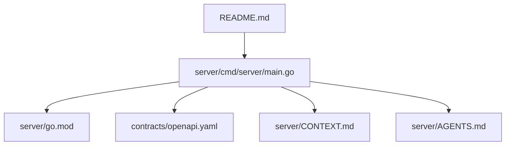
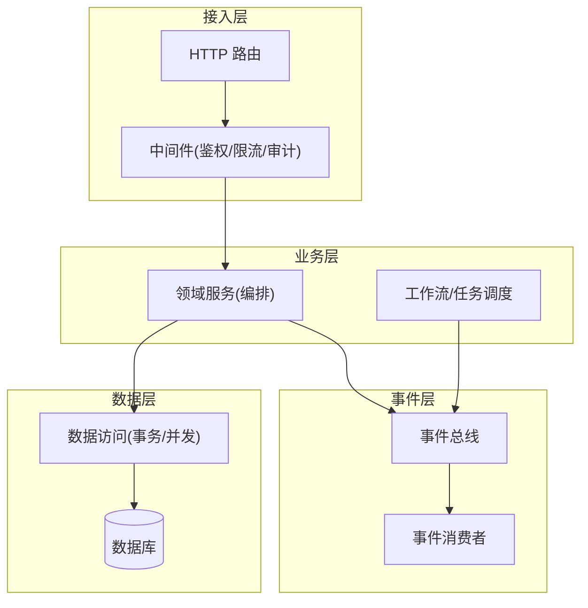
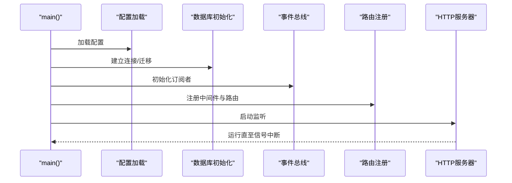
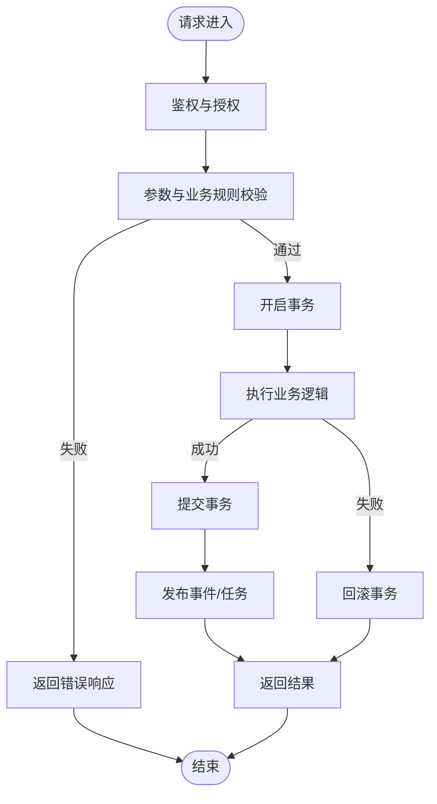
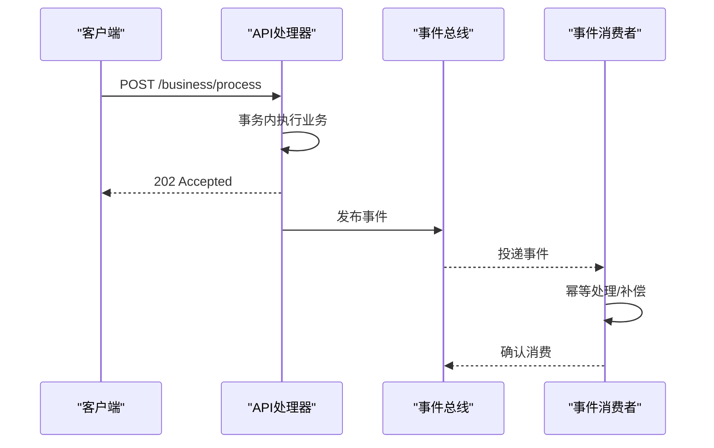
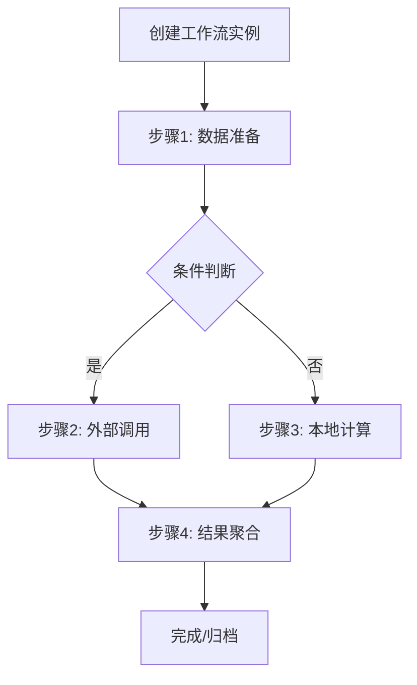
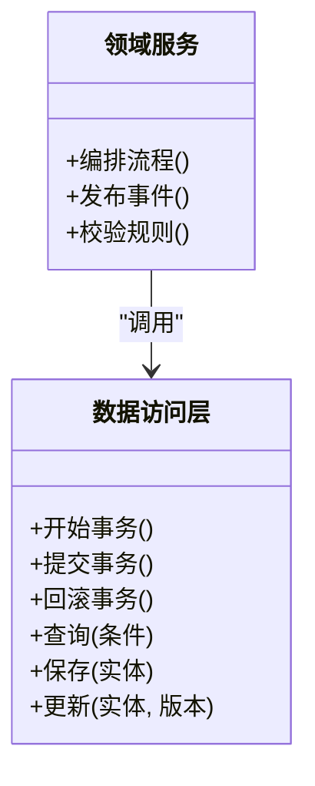
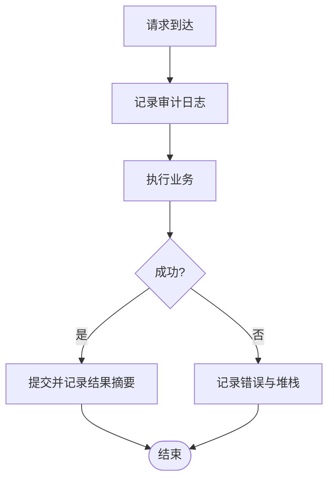
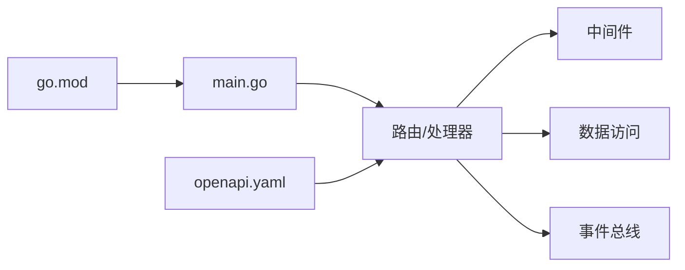

# 业务操作API

<cite>
**本文档引用的文件**   
- [server/main.go](file://server/cmd/server/main.go)
- [server/go.mod](file://server/go.mod)
- [server/CONTEXT.md](file://server/CONTEXT.md)
- [server/AGENTS.md](file://server/AGENTS.md)
- [contracts/openapi.yaml](file://contracts/openapi.yaml)
- [README.md](file://README.md)
</cite>

## 目录
1. [简介](#简介)
2. [项目结构](#项目结构)
3. [核心组件](#核心组件)
4. [架构总览](#架构总览)
5. [详细组件分析](#详细组件分析)
6. [依赖关系分析](#依赖关系分析)
7. [性能考量](#性能考量)
8. [故障排查指南](#故障排查指南)
9. [结论](#结论)
10. [附录](#附录)

## 简介
本文件为 nevix-ai 的业务操作 API 提供系统化文档，聚焦后端服务（Go）与 OpenAPI 契约，覆盖数据操作、业务流程编排、事件处理、异步任务与工作流接口、业务规则验证、状态机转换、审计日志、监控指标、性能优化建议与故障排查。目标是确保业务操作的原子性、一致性与可追溯性。

## 项目结构
- 服务端入口位于 server/cmd/server/main.go，负责应用启动、路由注册、中间件装配与依赖注入。
- Go 模块定义在 server/go.mod，声明运行时依赖与版本约束。
- 上下文与设计说明见 server/CONTEXT.md 与 server/AGENTS.md。
- OpenAPI 契约在 contracts/openapi.yaml，作为前后端与服务间契约的权威来源。
- 根级 README.md 提供项目概览与使用说明。

图表来源
- [server/cmd/server/main.go](file://server/cmd/server/main.go)
- [server/go.mod](file://server/go.mod)
- [contracts/openapi.yaml](file://contracts/openapi.yaml)
- [server/CONTEXT.md](file://server/CONTEXT.md)
- [server/AGENTS.md](file://server/AGENTS.md)
- [README.md](file://README.md)

章节来源
- [server/cmd/server/main.go](file://server/cmd/server/main.go)
- [server/go.mod](file://server/go.mod)
- [server/CONTEXT.md](file://server/CONTEXT.md)
- [server/AGENTS.md](file://server/AGENTS.md)
- [contracts/openapi.yaml](file://contracts/openapi.yaml)
- [README.md](file://README.md)

## 核心组件
- 应用启动器：负责初始化配置、数据库连接、事件总线、中间件链与HTTP服务器。
- HTTP 路由与处理器：按领域划分的路由组，承载 RESTful 接口，进行参数校验、鉴权、事务控制与响应封装。
- 事件总线：解耦生产者与消费者，支持异步事件分发与重试策略。
- 中间件：鉴权、限流、请求追踪、审计日志、错误处理等横切关注点。
- 数据访问层：封装数据库操作，提供事务边界与一致性保障。
- 工作流与任务调度：基于消息队列或调度器的异步任务执行与状态跟踪。

章节来源
- [server/cmd/server/main.go](file://server/cmd/server/main.go)
- [server/CONTEXT.md](file://server/CONTEXT.md)
- [server/AGENTS.md](file://server/AGENTS.md)

## 架构总览
整体采用分层架构与事件驱动模式：
- 接入层：HTTP 路由与中间件，统一鉴权、限流、审计与错误处理。
- 业务层：领域服务编排跨域流程，协调数据访问与事件发布。
- 数据层：持久化与查询，保证事务与并发安全。
- 事件层：事件总线与消费者，实现异步解耦与最终一致性。
- 外部集成：OpenAPI 契约驱动的前后端协作与第三方服务调用。

图表来源
- [server/cmd/server/main.go](file://server/cmd/server/main.go)
- [contracts/openapi.yaml](file://contracts/openapi.yaml)

## 详细组件分析

### 应用启动与依赖注入
- 读取配置与环境变量，初始化日志、数据库、缓存、事件总线与调度器。
- 注册中间件链与路由分组，绑定处理器到路径与方法。
- 启动HTTP服务器并优雅关闭资源。

图表来源
- [server/cmd/server/main.go](file://server/cmd/server/main.go)

章节来源
- [server/cmd/server/main.go](file://server/cmd/server/main.go)

### HTTP 路由与处理器
- 路由组织按领域划分，每个处理器负责单一职责：参数校验、鉴权、业务编排、事务提交与响应序列化。
- 使用 OpenAPI 契约生成客户端与校验规则，确保接口一致性。

图表来源
- [contracts/openapi.yaml](file://contracts/openapi.yaml)
- [server/cmd/server/main.go](file://server/cmd/server/main.go)

章节来源
- [contracts/openapi.yaml](file://contracts/openapi.yaml)
- [server/cmd/server/main.go](file://server/cmd/server/main.go)

### 事件总线与异步处理
- 事件总线提供发布/订阅模型，支持可靠投递、重试与死信队列。
- 业务操作完成后发布领域事件，消费者独立处理副作用（如通知、报表、索引更新）。

图表来源
- [server/cmd/server/main.go](file://server/cmd/server/main.go)
- [contracts/openapi.yaml](file://contracts/openapi.yaml)

章节来源
- [server/cmd/server/main.go](file://server/cmd/server/main.go)
- [contracts/openapi.yaml](file://contracts/openapi.yaml)

### 工作流与任务调度
- 工作流定义步骤、分支与条件，支持人工介入与超时处理。
- 任务调度器将长耗时操作入队，提供进度查询与重试策略。

图表来源
- [contracts/openapi.yaml](file://contracts/openapi.yaml)
- [server/cmd/server/main.go](file://server/cmd/server/main.go)

章节来源
- [contracts/openapi.yaml](file://contracts/openapi.yaml)
- [server/cmd/server/main.go](file://server/cmd/server/main.go)

### 数据访问与事务控制
- 所有写操作在事务边界内执行，确保原子性与一致性。
- 读操作可选择快照隔离或强一致读，避免脏读与不可重复读。
- 并发控制采用乐观锁（版本号）与悲观锁（行级锁）结合策略。

图表来源
- [server/cmd/server/main.go](file://server/cmd/server/main.go)
- [contracts/openapi.yaml](file://contracts/openapi.yaml)

章节来源
- [server/cmd/server/main.go](file://server/cmd/server/main.go)
- [contracts/openapi.yaml](file://contracts/openapi.yaml)

### 审计日志与可追溯性
- 关键操作记录审计日志，包含用户、时间、IP、请求ID、操作类型与影响范围。
- 审计日志与业务事件关联，形成完整溯源链。

图表来源
- [server/cmd/server/main.go](file://server/cmd/server/main.go)
- [contracts/openapi.yaml](file://contracts/openapi.yaml)

章节来源
- [server/cmd/server/main.go](file://server/cmd/server/main.go)
- [contracts/openapi.yaml](file://contracts/openapi.yaml)

## 依赖关系分析
- 模块依赖集中在 server/go.mod，明确运行时库与工具链版本。
- 路由与处理器依赖中间件、数据访问与事件总线，形成清晰的分层耦合。
- OpenAPI 契约作为稳定接口边界，降低前后端与服务间的耦合度。

图表来源
- [server/go.mod](file://server/go.mod)
- [server/cmd/server/main.go](file://server/cmd/server/main.go)
- [contracts/openapi.yaml](file://contracts/openapi.yaml)

章节来源
- [server/go.mod](file://server/go.mod)
- [server/cmd/server/main.go](file://server/cmd/server/main.go)
- [contracts/openapi.yaml](file://contracts/openapi.yaml)

## 性能考量
- 连接池与超时：合理设置数据库与外部服务连接池大小、读写超时与重试退避策略。
- 索引与查询优化：对高频查询字段建立复合索引，避免N+1查询与全表扫描。
- 缓存策略：热点数据使用缓存，注意缓存穿透、雪崩与一致性。
- 异步化：将非关键路径操作异步化，提升吞吐与响应时间。
- 监控与度量：暴露关键指标（QPS、延迟、错误率、队列长度），配合告警与链路追踪。

[本节为通用指导，不直接分析具体文件]

## 故障排查指南
- 常见问题定位：检查中间件日志、事务状态、事件消费重试与死信队列。
- 性能瓶颈：使用慢查询分析与APM工具定位热点接口与数据库瓶颈。
- 一致性异常：核对版本号冲突、并发锁竞争与补偿机制是否生效。
- 外部依赖失败：观察超时、熔断与降级策略，必要时切换备用通道。

章节来源
- [server/CONTEXT.md](file://server/CONTEXT.md)
- [server/AGENTS.md](file://server/AGENTS.md)

## 结论
nevix-ai 的业务操作API以分层架构与事件驱动为核心，通过OpenAPI契约、事务与并发控制、审计与监控，确保业务操作的原子性、一致性与可追溯性。建议在持续迭代中完善工作流编排、消息可靠性与可观测性能力，进一步提升系统稳定性与扩展性。

[本节为总结性内容，不直接分析具体文件]

## 附录
- OpenAPI 契约：用于接口定义、生成客户端与自动化测试。
- 上下文文档：描述设计决策与约束。
- 代理与技能：辅助开发与质量保障。

章节来源
- [contracts/openapi.yaml](file://contracts/openapi.yaml)
- [server/CONTEXT.md](file://server/CONTEXT.md)
- [server/AGENTS.md](file://server/AGENTS.md)
- [README.md](file://README.md)