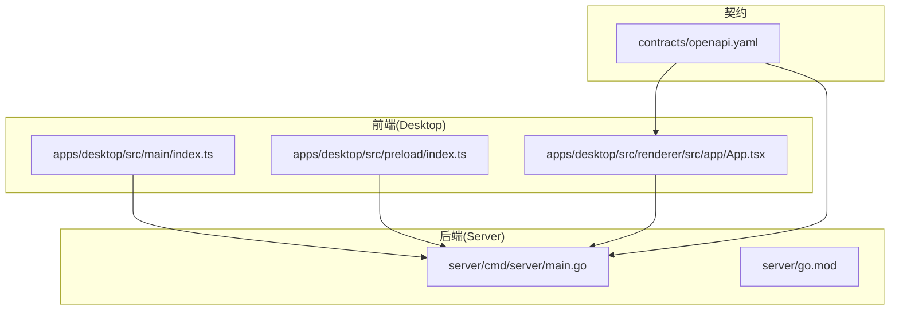
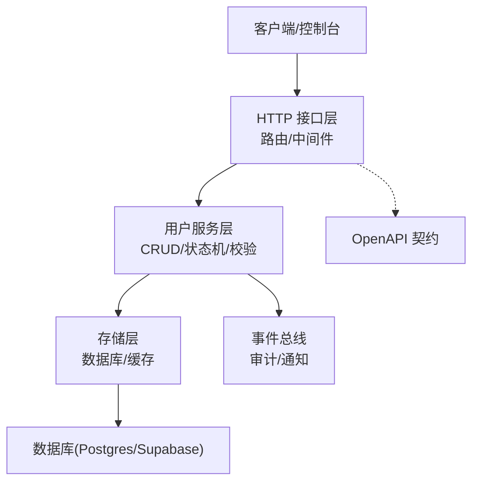
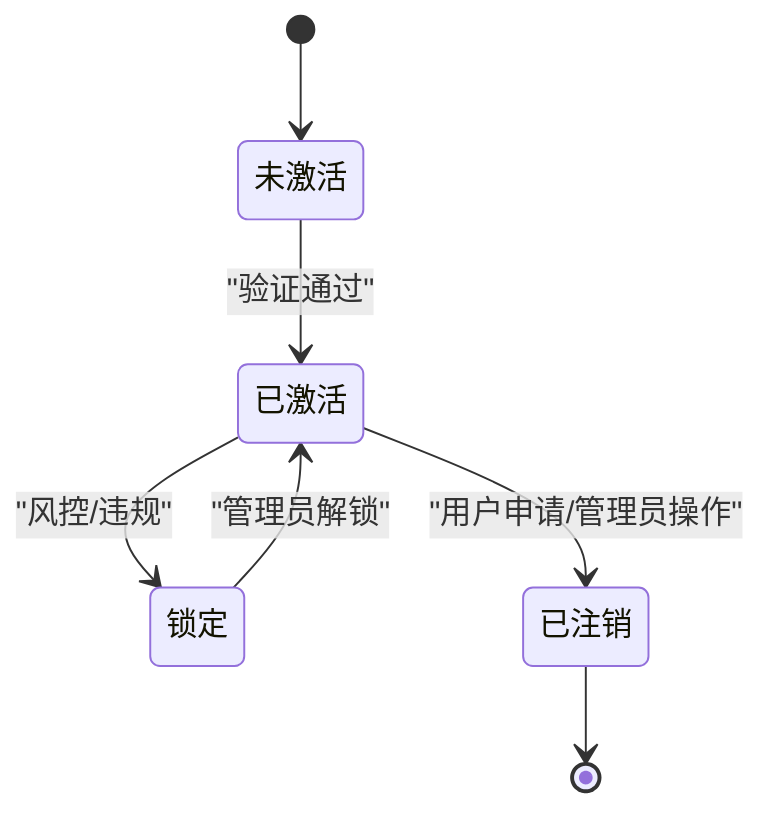
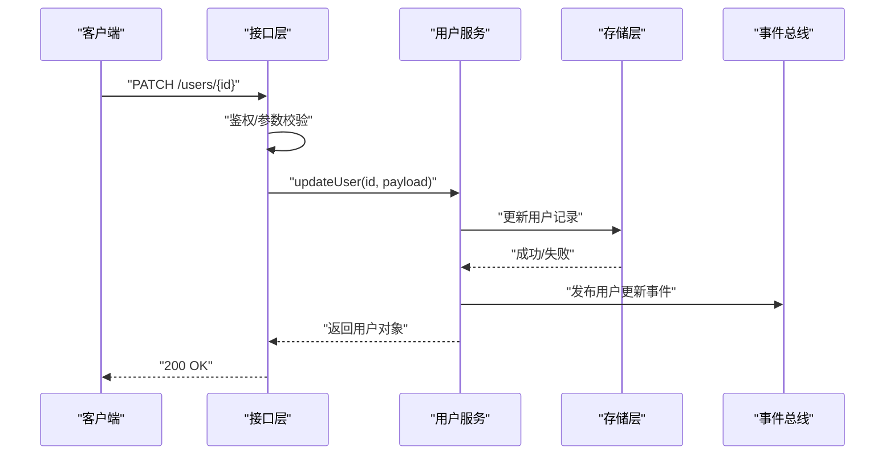
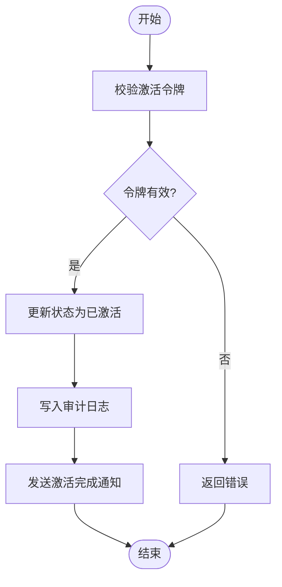
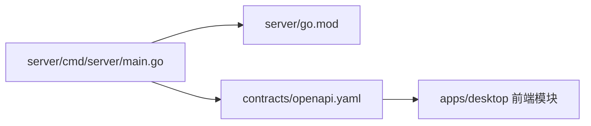

# 用户管理API

<cite>
**本文引用的文件**   
- [README.md](file://README.md)
- [CONTEXT-MAP.md](file://CONTEXT-MAP.md)
- [AGENTS.md](file://AGENTS.md)
- [CLAUDE.md](file://CLAUDE.md)
- [Makefile](file://Makefile)
- [go.work](file://go.work)
- [server/cmd/server/main.go](file://server/cmd/server/main.go)
- [server/CONTEXT.md](file://server/CONTEXT.md)
- [server/AGENTS.md](file://server/AGENTS.md)
- [server/go.mod](file://server/go.mod)
- [contracts/openapi.yaml](file://contracts/openapi.yaml)
</cite>

## 目录
1. [简介](#简介)
2. [项目结构](#项目结构)
3. [核心组件](#核心组件)
4. [架构总览](#架构总览)
5. [详细组件分析](#详细组件分析)
6. [依赖关系分析](#依赖关系分析)
7. [性能考虑](#性能考虑)
8. [故障排查指南](#故障排查指南)
9. [结论](#结论)
10. [附录](#附录)

## 简介
本文件为 nevix-ai 的用户管理 API 提供系统化、可操作的文档，覆盖用户信息 CRUD、个人资料更新、账户设置管理、状态与激活/注销流程、批量操作、搜索过滤与分页、数据导入导出、迁移与备份恢复，以及隐私保护、数据安全与合规性实现要点。由于当前仓库尚未包含用户管理的具体服务端实现代码，本文以“待实现”的方式给出接口契约、数据模型、处理流程与安全策略建议，并明确后续落地所需的文件位置与集成点。

## 项目结构
- 前端桌面应用位于 apps/desktop，负责认证会话、国际化与本地设置等能力。
- 后端服务位于 server，Go 语言工程，入口为 server/cmd/server/main.go，模块定义在 server/go.mod。
- OpenAPI 契约位于 contracts/openapi.yaml，用于统一前后端接口规范。
- 顶层 README、上下文与代理说明文件（如 CONTEXT-MAP.md、AGENTS.md、CLAUDE.md）提供项目背景与协作约定。
- Makefile 提供常用构建与运行命令。

**图表来源** 
- [server/cmd/server/main.go](file://server/cmd/server/main.go)
- [contracts/openapi.yaml](file://contracts/openapi.yaml)

**章节来源**
- [README.md](file://README.md)
- [CONTEXT-MAP.md](file://CONTEXT-MAP.md)
- [AGENTS.md](file://AGENTS.md)
- [CLAUDE.md](file://CLAUDE.md)
- [Makefile](file://Makefile)
- [go.work](file://go.work)
- [server/cmd/server/main.go](file://server/cmd/server/main.go)
- [server/CONTEXT.md](file://server/CONTEXT.md)
- [server/AGENTS.md](file://server/AGENTS.md)
- [server/go.mod](file://server/go.mod)
- [contracts/openapi.yaml](file://contracts/openapi.yaml)

## 核心组件
- 用户实体与领域模型：用户基本信息、身份标识、角色与权限、状态机（未激活、已激活、锁定、已注销）、审计字段。
- 用户服务层：负责用户生命周期管理、资料更新、账户设置、状态流转、安全校验与事件发布。
- 存储层：用户数据持久化（PostgreSQL/Supabase），支持事务、索引与约束。
- 接口层：RESTful API，遵循 OpenAPI 契约，提供查询、创建、更新、删除、批量操作、搜索与分页。
- 安全与合规：鉴权、授权、输入校验、敏感数据加密、审计日志、数据最小化与可删除性。
- 运维与工具：导入导出、迁移脚本、备份恢复、监控与告警。

**章节来源**
- [server/CONTEXT.md](file://server/CONTEXT.md)
- [server/AGENTS.md](file://server/AGENTS.md)

## 架构总览
用户管理 API 采用分层架构：接口层接收请求，服务层编排业务逻辑，存储层负责数据访问；通过事件总线解耦副作用（如通知、审计）。OpenAPI 契约驱动前后端协同开发。

**图表来源** 
- [server/cmd/server/main.go](file://server/cmd/server/main.go)
- [contracts/openapi.yaml](file://contracts/openapi.yaml)

## 详细组件分析

### 用户数据模型与字段约束
- 用户主表字段建议：
  - id: 唯一标识（UUID）
  - email: 邮箱（唯一、非空、格式校验）
  - phone: 手机号（可选、格式校验）
  - name: 显示名（长度限制、字符集限制）
  - avatar_url: 头像URL（URL格式校验）
  - status: 状态枚举（未激活、已激活、锁定、已注销）
  - role: 角色（默认用户，管理员等）
  - settings: JSONB 配置（语言、主题、通知偏好）
  - metadata: JSONB 扩展元数据
  - created_at/updated_at/deleted_at: 时间戳与软删除
- 约束与验证规则：
  - 必填字段：id、email、status、created_at
  - 唯一性：email、phone（若启用）
  - 长度与字符集：name、avatar_url
  - 枚举值：status、role
  - 时区与精度：时间戳使用 UTC，毫秒精度
- 隐私与合规：
  - 敏感字段（如 phone）需加密存储或脱敏展示
  - 支持数据删除与导出（GDPR/PIPL）
  - 最小化采集原则，仅保留必要字段

**章节来源**
- [contracts/openapi.yaml](file://contracts/openapi.yaml)

### 用户状态管理与生命周期
- 状态机：
  - 未激活 -> 已激活（邮箱/手机验证通过后）
  - 已激活 -> 锁定（违规或安全策略触发）
  - 已激活 -> 已注销（用户主动或管理员操作）
  - 已注销 -> 不可逆（或按策略保留一段时间）
- 关键动作：
  - 注册与发送验证邮件
  - 激活确认（令牌校验、过期策略）
  - 锁定/解锁（基于风控或管理员操作）
  - 注销（软删除、清理会话、异步清理资源）

**图表来源** 
- [contracts/openapi.yaml](file://contracts/openapi.yaml)

### 用户信息 CRUD 与个人资料更新
- 创建用户：POST /users
  - 输入：email、password（或第三方登录）、name、settings（可选）
  - 输出：用户对象（隐藏敏感字段）
  - 校验：邮箱唯一、密码强度、格式校验
- 获取用户：GET /users/{id}
  - 鉴权：仅本人或管理员
  - 输出：用户基本信息与设置
- 更新用户：PATCH /users/{id}
  - 支持：name、avatar_url、settings、phone（可选）
  - 校验：字段合法性、权限控制
- 删除用户：DELETE /users/{id}
  - 行为：软删除，记录审计日志
  - 影响：会话失效、资源回收（异步）

**图表来源** 
- [contracts/openapi.yaml](file://contracts/openapi.yaml)

**章节来源**
- [contracts/openapi.yaml](file://contracts/openapi.yaml)

### 账户设置管理
- 读取设置：GET /users/{id}/settings
- 更新设置：PATCH /users/{id}/settings
  - 支持：语言、主题、通知开关、隐私选项
  - 校验：白名单字段、类型与范围
- 重置设置：POST /users/{id}/settings/reset
  - 行为：回滚到默认值，记录审计

**章节来源**
- [contracts/openapi.yaml](file://contracts/openapi.yaml)

### 账户激活与注销
- 激活账户：POST /auth/activate
  - 输入：token、new_password（可选）
  - 校验：令牌有效性、过期时间
  - 输出：激活成功提示
- 注销账户：POST /users/{id}/deactivate
  - 输入：reason（可选）
  - 行为：软删除、清理会话、通知相关系统
  - 输出：注销结果

**图表来源** 
- [contracts/openapi.yaml](file://contracts/openapi.yaml)

**章节来源**
- [contracts/openapi.yaml](file://contracts/openapi.yaml)

### 批量操作、搜索过滤与分页
- 批量操作：POST /users/batch
  - 支持：批量创建、更新、删除
  - 限制：单次最大数量、幂等键、部分失败处理
- 搜索与过滤：GET /users?query=&filters=...
  - 支持：邮箱模糊、名称匹配、状态筛选、角色筛选
  - 排序：按创建时间、更新时间等
- 分页查询：GET /users?page=&size=&sort=...
  - 参数：页码、每页大小、排序字段
  - 输出：数据列表、总数、下一页指针

**章节来源**
- [contracts/openapi.yaml](file://contracts/openapi.yaml)

### 数据导入导出、迁移与备份恢复
- 导入用户：POST /users/import
  - 格式：CSV/JSON，字段映射与校验
  - 处理：去重、冲突策略、批量事务
- 导出用户：GET /users/export?format=csv|json
  - 过滤：按条件导出，脱敏敏感字段
- 迁移：POST /admin/migrate/users
  - 版本控制、回滚策略、增量同步
- 备份恢复：POST /admin/backup/users | POST /admin/restore/users
  - 压缩、加密、完整性校验

**章节来源**
- [contracts/openapi.yaml](file://contracts/openapi.yaml)

### 隐私保护、数据安全与合规性
- 鉴权与授权：
  - JWT/OAuth2，细粒度权限（RBAC/ABAC）
  - 接口级鉴权与数据级隔离
- 输入校验与输出脱敏：
  - 严格模式、白名单字段、长度与格式限制
  - 响应中移除敏感字段（如 password_hash）
- 数据存储安全：
  - 传输加密（TLS）、存储加密（AES-256）
  - 密钥管理（KMS/HSM）
- 审计与合规：
  - 全量审计日志（谁、何时、做了什么）
  - 数据留存策略、可删除性与可携带性
- 最小化与目的限定：
  - 仅收集必要数据，明确用途与期限

**章节来源**
- [contracts/openapi.yaml](file://contracts/openapi.yaml)

## 依赖关系分析
- 后端入口：server/cmd/server/main.go
- 模块依赖：server/go.mod
- 接口契约：contracts/openapi.yaml
- 前端调用：apps/desktop 各模块通过 HTTP/IPC 调用后端

**图表来源** 
- [server/cmd/server/main.go](file://server/cmd/server/main.go)
- [server/go.mod](file://server/go.mod)
- [contracts/openapi.yaml](file://contracts/openapi.yaml)

**章节来源**
- [server/cmd/server/main.go](file://server/cmd/server/main.go)
- [server/go.mod](file://server/go.mod)
- [contracts/openapi.yaml](file://contracts/openapi.yaml)

## 性能考虑
- 数据库优化：
  - 合理索引（email、status、created_at）
  - 分页查询使用游标或 keyset pagination
  - 批量操作使用事务与批量插入
- 缓存策略：
  - 热点用户信息缓存（Redis）
  - 设置变更的短 TTL 与失效策略
- 异步处理：
  - 导入导出、通知、审计日志使用消息队列
- 限流与熔断：
  - 接口限流、重试退避、熔断降级

[本节为通用指导，无需特定文件引用]

## 故障排查指南
- 常见问题：
  - 激活令牌无效或过期：检查令牌生成与存储、时钟同步
  - 邮箱重复：唯一约束冲突，检查导入数据清洗
  - 权限不足：检查 RBAC 配置与会话 token
  - 导入失败：查看批次日志与错误行定位
- 调试建议：
  - 开启详细日志（请求/响应、SQL 执行计划）
  - 使用 OpenAPI 校验器验证契约一致性
  - 监控指标：QPS、延迟、错误率、慢查询

**章节来源**
- [contracts/openapi.yaml](file://contracts/openapi.yaml)

## 结论
本文档为 nevix-ai 用户管理 API 提供了完整的蓝图与实施指引，涵盖数据模型、接口设计、状态管理、批量与分页、导入导出、迁移备份以及隐私安全与合规要求。建议在实现过程中严格遵循 OpenAPI 契约，结合事件总线与审计机制，确保系统的可扩展性、可维护性与安全性。

[本节为总结性内容，无需特定文件引用]

## 附录
- 参考文件：
  - 项目背景与协作约定：README.md、CONTEXT-MAP.md、AGENTS.md、CLAUDE.md
  - 后端入口与模块：server/cmd/server/main.go、server/go.mod
  - 接口契约：contracts/openapi.yaml
  - 构建与运行：Makefile、go.work

**章节来源**
- [README.md](file://README.md)
- [CONTEXT-MAP.md](file://CONTEXT-MAP.md)
- [AGENTS.md](file://AGENTS.md)
- [CLAUDE.md](file://CLAUDE.md)
- [server/cmd/server/main.go](file://server/cmd/server/main.go)
- [server/go.mod](file://server/go.mod)
- [contracts/openapi.yaml](file://contracts/openapi.yaml)
- [Makefile](file://Makefile)
- [go.work](file://go.work)