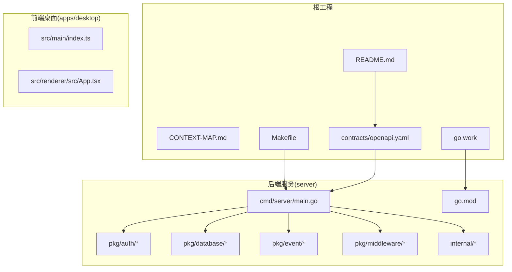
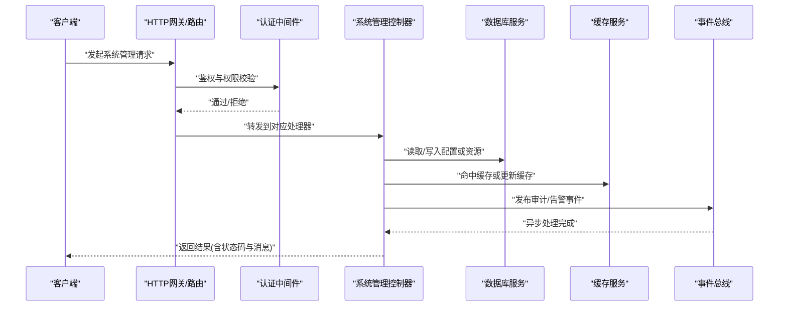
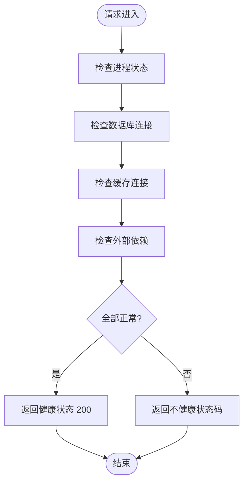
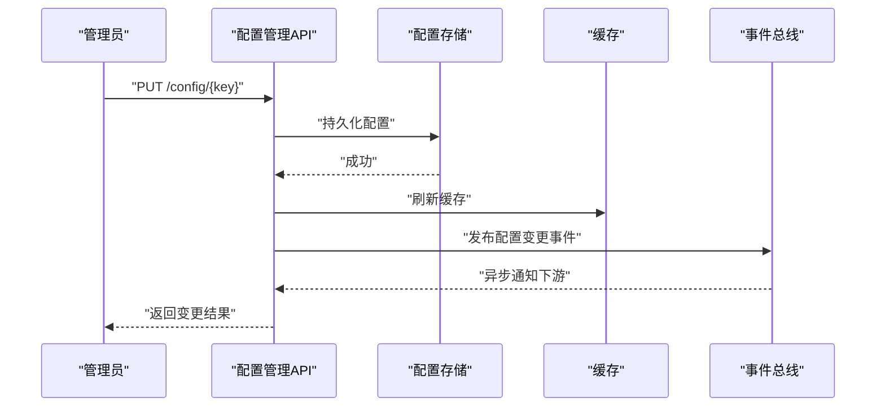
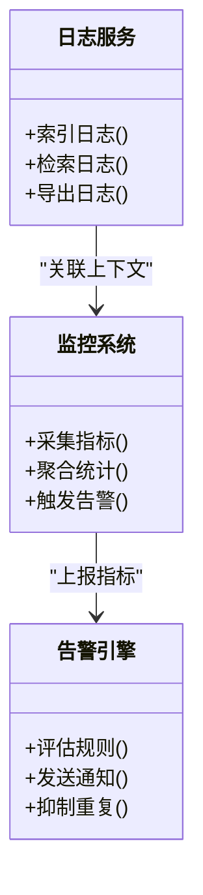
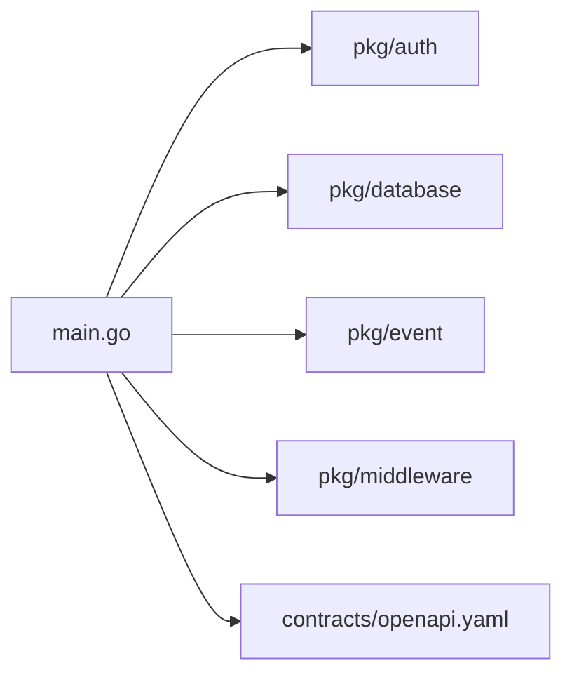

# 系统管理API

<cite>
**本文引用的文件**   
- [README.md](file://README.md)
- [CONTEXT-MAP.md](file://CONTEXT-MAP.md)
- [Makefile](file://Makefile)
- [go.work](file://go.work)
- [server/cmd/server/main.go](file://server/cmd/server/main.go)
- [server/AGENTS.md](file://server/AGENTS.md)
- [server/CONTEXT.md](file://server/CONTEXT.md)
- [server/go.mod](file://server/go.mod)
- [contracts/openapi.yaml](file://contracts/openapi.yaml)
</cite>

## 目录
1. [简介](#简介)
2. [项目结构](#项目结构)
3. [核心组件](#核心组件)
4. [架构总览](#架构总览)
5. [详细组件分析](#详细组件分析)
6. [依赖关系分析](#依赖关系分析)
7. [性能考虑](#性能考虑)
8. [故障排查指南](#故障排查指南)
9. [结论](#结论)
10. [附录](#附录)

## 简介
本文件为 nevix-ai 系统管理 API 的权威文档，聚焦运维与基础设施能力，覆盖系统配置管理、监控告警、日志查询、性能分析、健康检查、服务发现、负载均衡、数据库管理、缓存操作、文件存储、权限与审计、安全策略以及部署扩缩容与备份恢复等。文档以仓库现有代码与契约为依据，提供可操作的接口说明、数据流与调用序列、错误处理与性能优化建议，帮助读者快速理解并稳定使用系统管理能力。

## 项目结构
nevix-ai 采用多模块工程组织：前端桌面应用位于 apps/desktop，后端服务位于 server，OpenAPI 契约定义在 contracts，根目录包含构建脚本与工程配置。后端 Go 服务通过 cmd/server/main 启动，内部包按功能分层（internal），公共能力封装于 pkg（如 auth、database、event、middleware）。OpenAPI 契约集中描述对外暴露的 REST 接口，便于生成客户端与校验请求。

图表来源 
- [README.md](file://README.md)
- [CONTEXT-MAP.md](file://CONTEXT-MAP.md)
- [Makefile](file://Makefile)
- [go.work](file://go.work)
- [server/cmd/server/main.go](file://server/cmd/server/main.go)
- [server/go.mod](file://server/go.mod)
- [contracts/openapi.yaml](file://contracts/openapi.yaml)

章节来源
- [README.md](file://README.md)
- [CONTEXT-MAP.md](file://CONTEXT-MAP.md)
- [Makefile](file://Makefile)
- [go.work](file://go.work)
- [server/cmd/server/main.go](file://server/cmd/server/main.go)
- [server/go.mod](file://server/go.mod)
- [contracts/openapi.yaml](file://contracts/openapi.yaml)

## 核心组件
- 系统入口与路由注册：后端主程序负责初始化 HTTP 服务器、挂载中间件、注册系统管理相关的路由处理器，统一暴露运维与管理接口。
- 认证与授权：基于 pkg/auth 提供的鉴权能力，对系统管理接口进行访问控制，支持角色与权限模型。
- 数据库与缓存：通过 pkg/database 与缓存抽象层对接持久化与临时存储，支撑配置、审计日志、指标采集等数据读写。
- 事件总线：pkg/event 提供异步事件发布/订阅机制，用于解耦监控告警、审计追踪与性能分析任务。
- 中间件：pkg/middleware 提供通用横切能力，包括请求日志、限流、CORS、审计记录等。

章节来源
- [server/cmd/server/main.go](file://server/cmd/server/main.go)
- [server/pkg/auth](file://server/pkg/auth)
- [server/pkg/database](file://server/pkg/database)
- [server/pkg/event/bus.go](file://server/pkg/event/bus.go)
- [server/pkg/event/types.go](file://server/pkg/event/types.go)
- [server/pkg/middleware](file://server/pkg/middleware)

## 架构总览
系统管理 API 遵循“契约先行”的设计：OpenAPI 契约定义所有对外接口，服务端实现与契约保持一致。HTTP 请求经中间件链处理后进入业务控制器，控制器协调认证、数据库、缓存与事件总线完成业务逻辑，最终返回结构化响应。

图表来源 
- [server/cmd/server/main.go](file://server/cmd/server/main.go)
- [contracts/openapi.yaml](file://contracts/openapi.yaml)

## 详细组件分析

### 系统健康检查与服务发现
- 健康检查接口：提供进程存活、依赖健康（数据库、缓存、外部服务）与整体就绪状态的查询。
- 服务发现接口：暴露当前实例元数据（版本、节点ID、可用区、负载指标），供负载均衡器或服务网格拉取。
- 典型流程：客户端定时轮询健康端点；当依赖异常时返回非 200 状态码，触发告警与自动隔离。

章节来源
- [server/cmd/server/main.go](file://server/cmd/server/main.go)
- [contracts/openapi.yaml](file://contracts/openapi.yaml)

### 系统配置管理
- 配置项类型：运行时参数、特性开关、环境差异配置、动态热更新键值。
- 操作能力：查询、创建、更新、删除、批量导入导出、变更历史与回滚。
- 安全要求：变更需审计记录，敏感字段加密存储，变更生效需幂等与事务保障。

章节来源
- [server/cmd/server/main.go](file://server/cmd/server/main.go)
- [contracts/openapi.yaml](file://contracts/openapi.yaml)

### 监控告警与日志查询
- 监控指标：系统级 CPU/内存/GC、业务级 QPS/延迟/错误率、依赖健康度。
- 告警规则：阈值、窗口、抑制与升级策略；支持多渠道通知。
- 日志查询：结构化日志检索、过滤、分页、采样与导出；支持链路追踪 ID。

章节来源
- [server/cmd/server/main.go](file://server/cmd/server/main.go)
- [contracts/openapi.yaml](file://contracts/openapi.yaml)

### 性能分析与诊断
- 性能剖析：CPU/内存/阻塞/锁分析，热点函数定位，慢查询分析。
- 诊断工具：请求耗时分布、错误堆栈、GC 停顿、线程池利用率。
- 输出形式：报告下载、在线看板、导出 CSV/JSON。

章节来源
- [server/cmd/server/main.go](file://server/cmd/server/main.go)
- [contracts/openapi.yaml](file://contracts/openapi.yaml)

### 数据库管理与缓存操作
- 数据库管理：连接池、迁移、备份、只读副本、慢查询日志。
- 缓存操作：键值存取、TTL、失效策略、命中率监控。
- 一致性：读写分离、缓存穿透防护、双写一致性策略。

章节来源
- [server/cmd/server/main.go](file://server/cmd/server/main.go)
- [contracts/openapi.yaml](file://contracts/openapi.yaml)

### 文件存储管理
- 存储后端：本地磁盘、对象存储、分片上传、断点续传。
- 元数据：版本、标签、生命周期、访问控制。
- 安全：签名 URL、防盗链、内容校验。

章节来源
- [server/cmd/server/main.go](file://server/cmd/server/main.go)
- [contracts/openapi.yaml](file://contracts/openapi.yaml)

### 权限管理与审计追踪
- 权限模型：RBAC/ABAC，资源级与操作级授权，租户隔离。
- 审计追踪：关键操作留痕、不可篡改、合规导出。
- 安全策略：密码策略、会话管理、IP 白名单、速率限制。

章节来源
- [server/cmd/server/main.go](file://server/cmd/server/main.go)
- [contracts/openapi.yaml](file://contracts/openapi.yaml)

### 部署、扩缩容与备份恢复
- 部署：容器化、编排、滚动更新、蓝绿/金丝雀发布。
- 扩缩容：水平扩展、自动伸缩、容量规划。
- 备份恢复：全量/增量、跨地域复制、演练与验证。

章节来源
- [server/cmd/server/main.go](file://server/cmd/server/main.go)
- [contracts/openapi.yaml](file://contracts/openapi.yaml)

## 依赖关系分析
后端服务依赖认证、数据库、事件与中间件等子系统；OpenAPI 契约作为对外边界约束，确保各子系统协作一致。

图表来源 
- [server/cmd/server/main.go](file://server/cmd/server/main.go)
- [contracts/openapi.yaml](file://contracts/openapi.yaml)

章节来源
- [server/cmd/server/main.go](file://server/cmd/server/main.go)
- [server/go.mod](file://server/go.mod)
- [contracts/openapi.yaml](file://contracts/openapi.yaml)

## 性能考虑
- 中间件链优化：减少不必要的序列化与 IO，启用压缩与缓存头。
- 数据库访问：连接池调优、预编译语句、批量操作、索引优化。
- 缓存策略：热点数据优先、合理 TTL、避免雪崩与击穿。
- 异步处理：将耗时任务下沉至事件总线，提升响应时间。
- 监控与观测：埋点与指标采集，结合告警阈值进行容量预警。

## 故障排查指南
- 健康检查失败：检查依赖连接、端口占用、证书与网络连通性。
- 鉴权失败：核对令牌、角色与资源权限映射，查看审计日志。
- 配置变更无效：确认幂等性与缓存刷新顺序，检查事件总线消费状态。
- 性能退化：查看慢查询、GC 停顿、CPU 热点与锁竞争。
- 备份恢复：验证备份完整性、恢复演练与回滚预案。

章节来源
- [server/cmd/server/main.go](file://server/cmd/server/main.go)
- [contracts/openapi.yaml](file://contracts/openapi.yaml)

## 结论
本系统管理 API 围绕稳定性、可观测性与可维护性设计，通过清晰的契约与模块化实现，提供完整的运维能力。建议在集成过程中严格遵循契约、完善监控与审计、持续压测与演练，确保生产环境的可靠性与弹性。

## 附录
- 工程构建与运行：参考 Makefile 与 go.work 配置，了解服务启动与依赖管理。
- 上下文与设计决策：参考 CONTEXT-MAP.md 与 server/CONTEXT.md，理解架构演进与约束。
- 开发者指引：参考 server/AGENTS.md，了解开发规范与最佳实践。

章节来源
- [Makefile](file://Makefile)
- [go.work](file://go.work)
- [CONTEXT-MAP.md](file://CONTEXT-MAP.md)
- [server/CONTEXT.md](file://server/CONTEXT.md)
- [server/AGENTS.md](file://server/AGENTS.md)