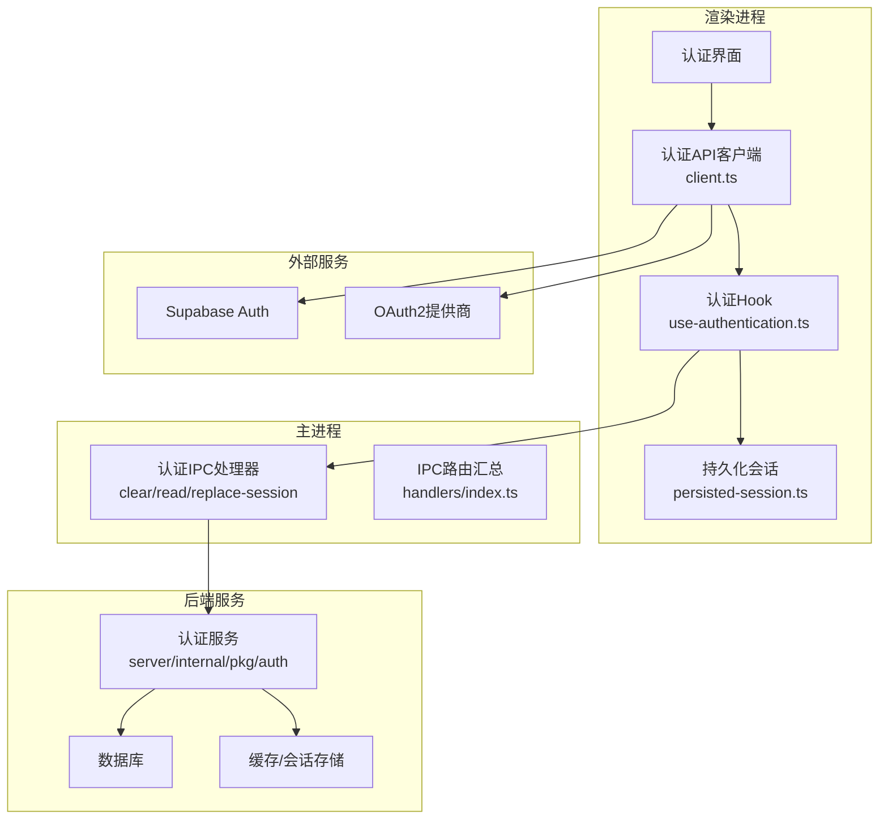
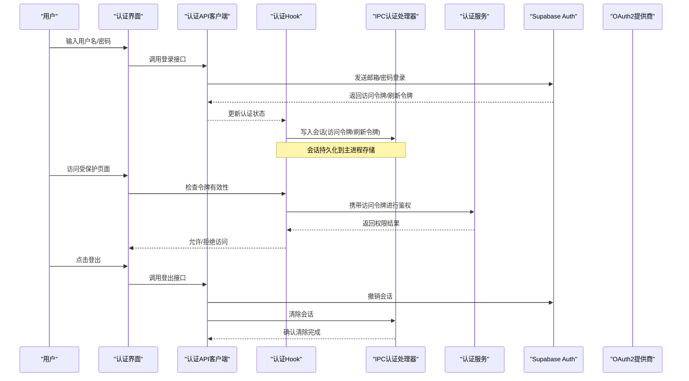
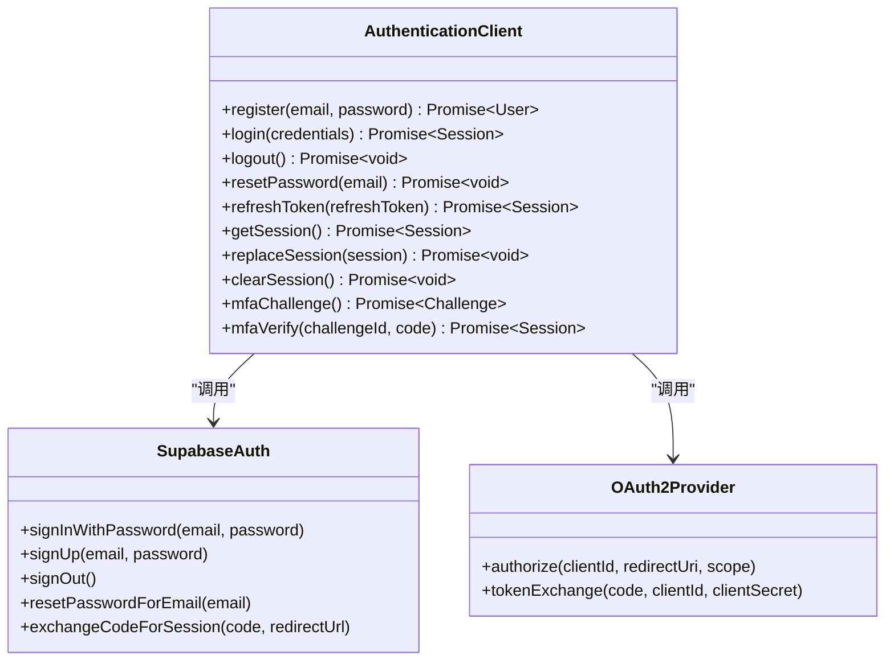
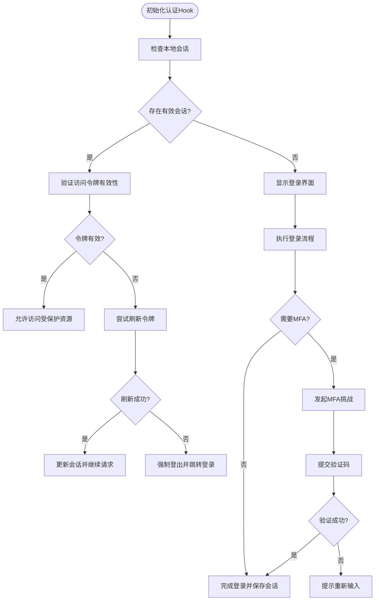
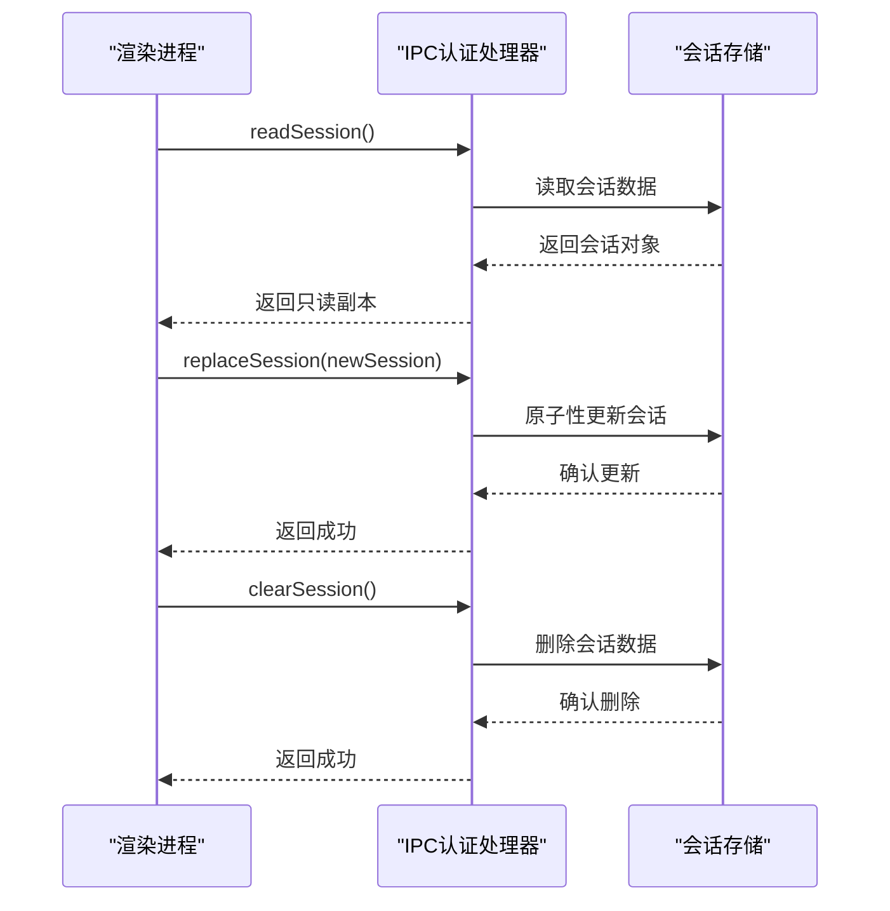
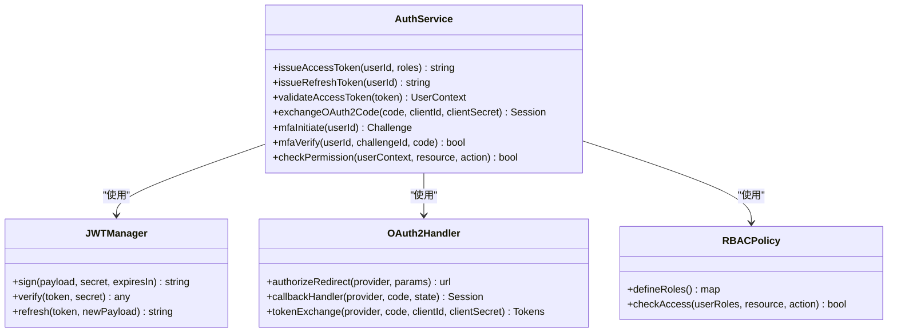
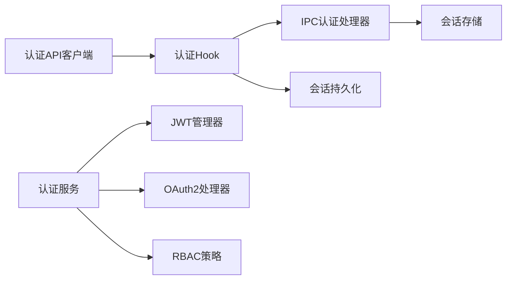

# 认证API

<cite>
**本文引用的文件**   
- [apps/desktop/src/renderer/src/features/authentication/api/client.ts](file://apps/desktop/src/renderer/src/features/authentication/api/client.ts)
- [apps/desktop/src/renderer/src/features/authentication/api/environment.ts](file://apps/desktop/src/renderer/src/features/authentication/api/environment.ts)
- [apps/desktop/src/renderer/src/features/authentication/hooks/use-authentication.ts](file://apps/desktop/src/renderer/src/features/authentication/hooks/use-authentication.ts)
- [apps/desktop/src/renderer/src/features/authentication/session/persisted-session.ts](file://apps/desktop/src/renderer/src/features/authentication/session/persisted-session.ts)
- [apps/desktop/src/main/ipc/authentication/clear-session.ts](file://apps/desktop/src/main/ipc/authentication/clear-session.ts)
- [apps/desktop/src/main/ipc/authentication/read-session.ts](file://apps/desktop/src/main/ipc/authentication/read-session.ts)
- [apps/desktop/src/main/ipc/authentication/replace-session.ts](file://apps/desktop/src/main/ipc/authentication/replace-session.ts)
- [apps/desktop/src/main/ipc/authentication/handlers/index.ts](file://apps/desktop/src/main/ipc/authentication/handlers/index.ts)
- [apps/desktop/src/shared/ipc/authentication/types.ts](file://apps/desktop/src/shared/ipc/authentication/types.ts)
- [apps/desktop/tests/auth/helpers/supabase-auth.ts](file://apps/desktop/tests/auth/helpers/supabase-auth.ts)
- [apps/desktop/tests/auth/login-boundary.spec.ts](file://apps/desktop/tests/auth/login-boundary.spec.ts)
- [apps/desktop/tests/auth/signup-verification.spec.ts](file://apps/desktop/tests/auth/signup-verification.spec.ts)
- [server/internal/pkg/auth](file://server/internal/pkg/auth)
- [contracts/openapi.yaml](file://contracts/openapi.yaml)
</cite>

## 目录
1. [简介](#简介)
2. [项目结构](#项目结构)
3. [核心组件](#核心组件)
4. [架构总览](#架构总览)
5. [详细组件分析](#详细组件分析)
6. [依赖分析](#依赖分析)
7. [性能考虑](#性能考虑)
8. [故障排查指南](#故障排查指南)
9. [结论](#结论)
10. [附录](#附录)

## 简介
本文件为 nevix-ai 项目的认证API文档，聚焦于用户注册、登录、登出、密码重置与会话管理等能力。文档涵盖JWT令牌机制、OAuth2集成、多因素认证（MFA）等安全特性，提供请求与响应示例、错误码定义与状态处理说明，并给出权限验证流程、角色管理与访问控制策略的参考实现。同时包含客户端集成指南、令牌刷新机制与安全最佳实践，确保认证接口的安全性与可靠性。

## 项目结构
本项目采用前后端分离与Electron桌面应用结合的方式：
- 前端渲染进程通过认证API客户端调用后端服务或Supabase Auth服务。
- Electron主进程通过IPC通道暴露会话管理接口，供渲染进程使用。
- 服务端提供认证相关能力（如JWT签发、OAuth2回调、MFA校验等）。
- OpenAPI契约定义了认证相关的REST端点规范。

**图表来源** 
- [apps/desktop/src/renderer/src/features/authentication/api/client.ts](file://apps/desktop/src/renderer/src/features/authentication/api/client.ts)
- [apps/desktop/src/renderer/src/features/authentication/hooks/use-authentication.ts](file://apps/desktop/src/renderer/src/features/authentication/hooks/use-authentication.ts)
- [apps/desktop/src/renderer/src/features/authentication/session/persisted-session.ts](file://apps/desktop/src/renderer/src/features/authentication/session/persisted-session.ts)
- [apps/desktop/src/main/ipc/authentication/clear-session.ts](file://apps/desktop/src/main/ipc/authentication/clear-session.ts)
- [apps/desktop/src/main/ipc/authentication/read-session.ts](file://apps/desktop/src/main/ipc/authentication/read-session.ts)
- [apps/desktop/src/main/ipc/authentication/replace-session.ts](file://apps/desktop/src/main/ipc/authentication/replace-session.ts)
- [apps/desktop/src/main/ipc/authentication/handlers/index.ts](file://apps/desktop/src/main/ipc/authentication/handlers/index.ts)
- [server/internal/pkg/auth](file://server/internal/pkg/auth)

**章节来源**
- [apps/desktop/src/renderer/src/features/authentication/api/client.ts](file://apps/desktop/src/renderer/src/features/authentication/api/client.ts)
- [apps/desktop/src/renderer/src/features/authentication/hooks/use-authentication.ts](file://apps/desktop/src/renderer/src/features/authentication/hooks/use-authentication.ts)
- [apps/desktop/src/main/ipc/authentication/handlers/index.ts](file://apps/desktop/src/main/ipc/authentication/handlers/index.ts)
- [contracts/openapi.yaml](file://contracts/openapi.yaml)

## 核心组件
- 认证API客户端：封装对Supabase Auth与后端认证服务的HTTP调用，统一错误处理与重试逻辑。
- 认证Hook：在渲染进程中维护认证状态、触发登录/登出、处理令牌刷新与MFA流程。
- 会话持久化：将访问令牌、刷新令牌与用户信息安全地持久化到本地存储。
- IPC认证处理器：在主进程暴露会话读取、替换与清除接口，保证跨进程安全通信。
- 服务端认证模块：负责JWT签发与校验、OAuth2回调处理、MFA校验与权限控制。

**章节来源**
- [apps/desktop/src/renderer/src/features/authentication/api/client.ts](file://apps/desktop/src/renderer/src/features/authentication/api/client.ts)
- [apps/desktop/src/renderer/src/features/authentication/hooks/use-authentication.ts](file://apps/desktop/src/renderer/src/features/authentication/hooks/use-authentication.ts)
- [apps/desktop/src/renderer/src/features/authentication/session/persisted-session.ts](file://apps/desktop/src/renderer/src/features/authentication/session/persisted-session.ts)
- [apps/desktop/src/main/ipc/authentication/clear-session.ts](file://apps/desktop/src/main/ipc/authentication/clear-session.ts)
- [apps/desktop/src/main/ipc/authentication/read-session.ts](file://apps/desktop/src/main/ipc/authentication/read-session.ts)
- [apps/desktop/src/main/ipc/authentication/replace-session.ts](file://apps/desktop/src/main/ipc/authentication/replace-session.ts)
- [server/internal/pkg/auth](file://server/internal/pkg/auth)

## 架构总览
认证系统遵循“前端轻量、后端集中”的原则：
- 前端仅持有短期有效的访问令牌与必要的用户信息，敏感操作通过后端鉴权。
- 主进程作为安全边界，隔离渲染进程与系统资源，所有会话操作必须经过IPC。
- 后端集中管理JWT生命周期、OAuth2授权码流、MFA挑战与响应、RBAC权限校验。

**图表来源** 
- [apps/desktop/src/renderer/src/features/authentication/api/client.ts](file://apps/desktop/src/renderer/src/features/authentication/api/client.ts)
- [apps/desktop/src/renderer/src/features/authentication/hooks/use-authentication.ts](file://apps/desktop/src/renderer/src/features/authentication/hooks/use-authentication.ts)
- [apps/desktop/src/main/ipc/authentication/clear-session.ts](file://apps/desktop/src/main/ipc/authentication/clear-session.ts)
- [apps/desktop/src/main/ipc/authentication/read-session.ts](file://apps/desktop/src/main/ipc/authentication/read-session.ts)
- [apps/desktop/src/main/ipc/authentication/replace-session.ts](file://apps/desktop/src/main/ipc/authentication/replace-session.ts)
- [apps/desktop/tests/auth/helpers/supabase-auth.ts](file://apps/desktop/tests/auth/helpers/supabase-auth.ts)

## 详细组件分析

### 认证API客户端
- 职责：封装对Supabase Auth与后端认证服务的HTTP调用，统一错误处理、重试与超时配置。
- 关键能力：
  - 用户注册：提交邮箱与密码，触发邮箱验证流程。
  - 用户登录：支持邮箱/密码与OAuth2授权码流。
  - 登出：撤销当前会话并清理本地令牌。
  - 密码重置：发送重置邮件，支持链接回调更新密码。
  - 会话管理：获取、替换与清除会话令牌。
  - MFA：发起挑战、提交验证码、查询已绑定的MFA设备。

**图表来源** 
- [apps/desktop/src/renderer/src/features/authentication/api/client.ts](file://apps/desktop/src/renderer/src/features/authentication/api/client.ts)
- [apps/desktop/tests/auth/helpers/supabase-auth.ts](file://apps/desktop/tests/auth/helpers/supabase-auth.ts)

**章节来源**
- [apps/desktop/src/renderer/src/features/authentication/api/client.ts](file://apps/desktop/src/renderer/src/features/authentication/api/client.ts)
- [apps/desktop/src/renderer/src/features/authentication/api/environment.ts](file://apps/desktop/src/renderer/src/features/authentication/api/environment.ts)

### 认证Hook与会话管理
- 职责：在渲染进程中维护认证状态，协调登录/登出、令牌刷新与MFA流程，并与IPC会话管理器交互。
- 关键能力：
  - 监听认证状态变化，自动刷新过期令牌。
  - 处理MFA挑战与验证，引导用户完成二次验证。
  - 与主进程IPC同步会话数据，确保跨进程一致性。

**图表来源** 
- [apps/desktop/src/renderer/src/features/authentication/hooks/use-authentication.ts](file://apps/desktop/src/renderer/src/features/authentication/hooks/use-authentication.ts)
- [apps/desktop/src/renderer/src/features/authentication/session/persisted-session.ts](file://apps/desktop/src/renderer/src/features/authentication/session/persisted-session.ts)

**章节来源**
- [apps/desktop/src/renderer/src/features/authentication/hooks/use-authentication.ts](file://apps/desktop/src/renderer/src/features/authentication/hooks/use-authentication.ts)
- [apps/desktop/src/renderer/src/features/authentication/session/persisted-session.ts](file://apps/desktop/src/renderer/src/features/authentication/session/persisted-session.ts)

### IPC认证处理器
- 职责：在主进程暴露安全的会话管理接口，限制渲染进程直接访问敏感数据。
- 关键接口：
  - 读取会话：返回当前会话的只读副本。
  - 替换会话：原子性更新访问令牌与刷新令牌。
  - 清除会话：彻底删除本地存储的认证数据。

**图表来源** 
- [apps/desktop/src/main/ipc/authentication/clear-session.ts](file://apps/desktop/src/main/ipc/authentication/clear-session.ts)
- [apps/desktop/src/main/ipc/authentication/read-session.ts](file://apps/desktop/src/main/ipc/authentication/read-session.ts)
- [apps/desktop/src/main/ipc/authentication/replace-session.ts](file://apps/desktop/src/main/ipc/authentication/replace-session.ts)
- [apps/desktop/src/main/ipc/authentication/handlers/index.ts](file://apps/desktop/src/main/ipc/authentication/handlers/index.ts)
- [apps/desktop/src/shared/ipc/authentication/types.ts](file://apps/desktop/src/shared/ipc/authentication/types.ts)

**章节来源**
- [apps/desktop/src/main/ipc/authentication/clear-session.ts](file://apps/desktop/src/main/ipc/authentication/clear-session.ts)
- [apps/desktop/src/main/ipc/authentication/read-session.ts](file://apps/desktop/src/main/ipc/authentication/read-session.ts)
- [apps/desktop/src/main/ipc/authentication/replace-session.ts](file://apps/desktop/src/main/ipc/authentication/replace-session.ts)
- [apps/desktop/src/main/ipc/authentication/handlers/index.ts](file://apps/desktop/src/main/ipc/authentication/handlers/index.ts)
- [apps/desktop/src/shared/ipc/authentication/types.ts](file://apps/desktop/src/shared/ipc/authentication/types.ts)

### 服务端认证模块
- 职责：集中处理JWT签发与校验、OAuth2授权码交换、MFA挑战与验证、RBAC权限控制。
- 关键能力：
  - JWT签发：生成短期访问令牌与长期刷新令牌，绑定用户ID与角色。
  - OAuth2集成：支持授权码流，安全交换第三方令牌。
  - MFA支持：TOTP或短信验证码，支持设备绑定与恢复码管理。
  - 权限控制：基于角色的访问控制（RBAC），细粒度资源权限校验。

**图表来源** 
- [server/internal/pkg/auth](file://server/internal/pkg/auth)

**章节来源**
- [server/internal/pkg/auth](file://server/internal/pkg/auth)

## 依赖分析
认证系统的依赖关系如下：
- 渲染进程依赖认证Hook与API客户端。
- 认证Hook依赖IPC认证处理器与会话持久化。
- IPC认证处理器依赖主进程会话存储。
- 服务端认证模块依赖JWT管理器、OAuth2处理器与RBAC策略。

**图表来源** 
- [apps/desktop/src/renderer/src/features/authentication/api/client.ts](file://apps/desktop/src/renderer/src/features/authentication/api/client.ts)
- [apps/desktop/src/renderer/src/features/authentication/hooks/use-authentication.ts](file://apps/desktop/src/renderer/src/features/authentication/hooks/use-authentication.ts)
- [apps/desktop/src/main/ipc/authentication/handlers/index.ts](file://apps/desktop/src/main/ipc/authentication/handlers/index.ts)
- [server/internal/pkg/auth](file://server/internal/pkg/auth)

**章节来源**
- [apps/desktop/src/renderer/src/features/authentication/api/client.ts](file://apps/desktop/src/renderer/src/features/authentication/api/client.ts)
- [apps/desktop/src/renderer/src/features/authentication/hooks/use-authentication.ts](file://apps/desktop/src/renderer/src/features/authentication/hooks/use-authentication.ts)
- [apps/desktop/src/main/ipc/authentication/handlers/index.ts](file://apps/desktop/src/main/ipc/authentication/handlers/index.ts)
- [server/internal/pkg/auth](file://server/internal/pkg/auth)

## 性能考虑
- 令牌刷新：仅在访问令牌过期时触发刷新，避免频繁网络请求。
- 会话缓存：在主进程缓存会话数据，减少IPC调用开销。
- 并发控制：限制同一用户的并发认证请求，防止竞态条件。
- 错误重试：对临时性网络错误实施指数退避重试。

[本节为通用指导，无需特定文件引用]

## 故障排查指南
- 登录失败：检查邮箱/密码格式、网络连通性与Supabase服务状态。
- 令牌无效：验证JWT签名、过期时间与刷新令牌有效性。
- MFA失败：确认验证码正确性、时间同步与设备绑定状态。
- 会话不同步：检查IPC调用是否成功，主进程会话存储是否一致。

**章节来源**
- [apps/desktop/tests/auth/login-boundary.spec.ts](file://apps/desktop/tests/auth/login-boundary.spec.ts)
- [apps/desktop/tests/auth/signup-verification.spec.ts](file://apps/desktop/tests/auth/signup-verification.spec.ts)

## 结论
nevix-ai认证系统通过分层架构实现了安全可靠的认证能力。前端专注于用户体验与状态管理，主进程保障会话安全，服务端集中处理复杂逻辑与权限控制。建议在生产环境中启用HTTPS、严格令牌策略与完善的监控告警机制。

[本节为总结性内容，无需特定文件引用]

## 附录

### RESTful端点定义
以下端点基于OpenAPI契约定义，具体实现可能因环境而异：

- 用户注册
  - POST /auth/register
  - 请求体：{ email, password }
  - 响应：{ message, verification_required: boolean }

- 用户登录
  - POST /auth/login
  - 请求体：{ email, password } 或 { provider, code, redirect_uri }
  - 响应：{ access_token, refresh_token, user }

- 用户登出
  - POST /auth/logout
  - 请求头：Authorization: Bearer <access_token>
  - 响应：{ message }

- 密码重置
  - POST /auth/reset-password
  - 请求体：{ email }
  - 响应：{ message }

- 令牌刷新
  - POST /auth/refresh-token
  - 请求体：{ refresh_token }
  - 响应：{ access_token, refresh_token }

- MFA挑战
  - POST /auth/mfa/challenge
  - 请求头：Authorization: Bearer <access_token>
  - 响应：{ challenge_id, method }

- MFA验证
  - POST /auth/mfa/verify
  - 请求体：{ challenge_id, code }
  - 响应：{ session }

**章节来源**
- [contracts/openapi.yaml](file://contracts/openapi.yaml)

### 错误码定义
- 400 请求参数错误
- 401 未认证或令牌无效
- 403 权限不足
- 409 冲突（如邮箱已注册）
- 429 请求频率限制
- 500 服务器内部错误

**章节来源**
- [contracts/openapi.yaml](file://contracts/openapi.yaml)

### 客户端集成指南
- 初始化认证客户端，配置环境变量（API基础URL、Supabase密钥等）。
- 在应用启动时检查本地会话，必要时触发令牌刷新。
- 所有受保护资源访问前，确保携带有效的访问令牌。
- 处理MFA流程，引导用户完成二次验证。

**章节来源**
- [apps/desktop/src/renderer/src/features/authentication/api/client.ts](file://apps/desktop/src/renderer/src/features/authentication/api/client.ts)
- [apps/desktop/src/renderer/src/features/authentication/api/environment.ts](file://apps/desktop/src/renderer/src/features/authentication/api/environment.ts)

### 安全最佳实践
- 使用HTTPS传输所有认证相关请求。
- 设置合理的令牌过期时间，优先使用短效访问令牌。
- 禁止在日志中记录敏感信息（如密码、令牌）。
- 实施速率限制与异常登录检测。
- 定期轮换密钥与证书。

[本节为通用指导，无需特定文件引用]