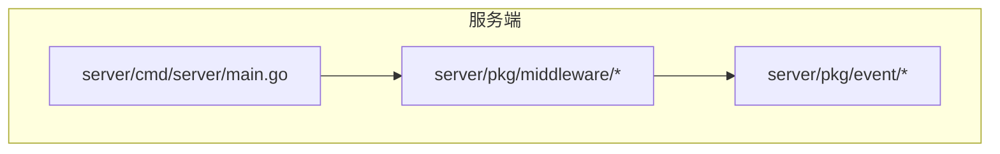
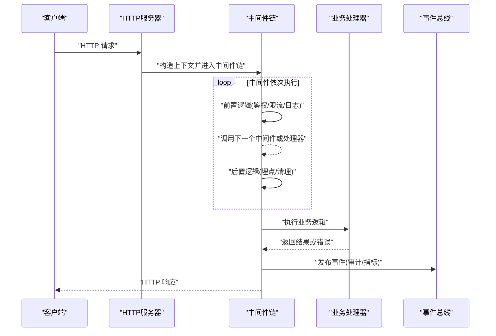
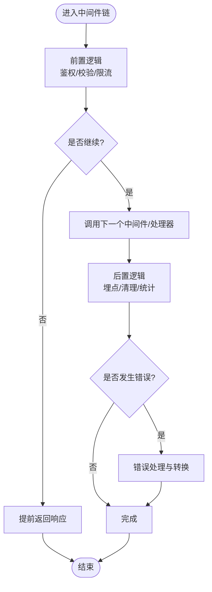
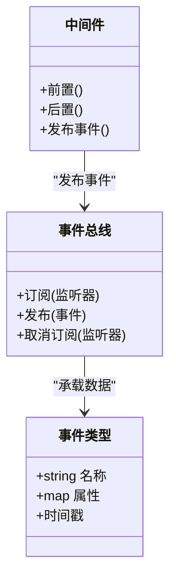
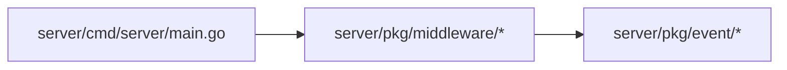

# 中间件栈

<cite>
**本文档引用的文件**   
- [server/main.go](file://server/cmd/server/main.go)
- [server/go.mod](file://server/go.mod)
- [server/pkg/middleware/bus.go](file://server/pkg/middleware/bus.go)
- [server/pkg/event/types.go](file://server/pkg/event/types.go)
- [server/pkg/event/bus.go](file://server/pkg/event/bus.go)
</cite>

## 目录
1. [简介](#简介)
2. [项目结构](#项目结构)
3. [核心组件](#核心组件)
4. [架构总览](#架构总览)
5. [详细组件分析](#详细组件分析)
6. [依赖关系分析](#依赖关系分析)
7. [性能考量](#性能考量)
8. [故障排查指南](#故障排查指南)
9. [结论](#结论)
10. [附录](#附录)

## 简介
本文件为 nevix-ai 后端服务（Go）的中间件栈文档，聚焦以下目标：
- 解释中间件的执行顺序、请求处理管道与上下文传递机制
- 记录内置中间件的功能、配置选项与使用场景
- 指导自定义中间件的开发、测试与部署
- 提供日志记录、请求追踪、安全检查与性能监控的实现要点
- 说明中间件组合模式、错误传播与优雅降级策略
- 确保中间件的可复用性与可维护性，支持灵活的请求处理流程定制

## 项目结构
本项目采用 Go 模块化组织，服务端入口位于 server/cmd/server/main.go，通用能力通过 pkg 目录提供。中间件相关代码集中在 server/pkg/middleware，事件总线在 server/pkg/event。

图表来源
- [server/cmd/server/main.go](file://server/cmd/server/main.go)
- [server/pkg/middleware/bus.go](file://server/pkg/middleware/bus.go)
- [server/pkg/event/types.go](file://server/pkg/event/types.go)
- [server/pkg/event/bus.go](file://server/pkg/event/bus.go)

章节来源
- [server/cmd/server/main.go](file://server/cmd/server/main.go)
- [server/go.mod](file://server/go.mod)

## 核心组件
- 中间件接口与组合器：定义统一的中间件签名与链式调用方式，保证请求在进入业务处理器之前/之后被统一拦截与增强。
- 事件总线：用于中间件与业务层之间的解耦通信，支持发布/订阅模型，便于扩展日志、审计、指标等横切关注点。
- 类型与上下文：定义请求上下文、响应包装、错误类型与事件结构，贯穿整个请求生命周期。

章节来源
- [server/pkg/middleware/bus.go](file://server/pkg/middleware/bus.go)
- [server/pkg/event/types.go](file://server/pkg/event/types.go)
- [server/pkg/event/bus.go](file://server/pkg/event/bus.go)

## 架构总览
下图展示从请求进入服务到返回响应的整体流程，以及中间件链与事件总线在其中的作用。

图表来源
- [server/cmd/server/main.go](file://server/cmd/server/main.go)
- [server/pkg/middleware/bus.go](file://server/pkg/middleware/bus.go)
- [server/pkg/event/bus.go](file://server/pkg/event/bus.go)

## 详细组件分析

### 中间件接口与组合器
- 中间件签名：统一接收上下文与下一个处理器，允许修改上下文、提前终止或透传。
- 组合器：将多个中间件按顺序串联，形成“洋葱模型”执行路径，支持前置与后置钩子。
- 错误传播：中间件可选择捕获并转换错误，向上抛出或写入响应；未处理错误由顶层统一处理。
- 上下文传递：通过上下文对象携带请求元数据、用户信息、追踪ID等，避免全局变量污染。

图表来源
- [server/pkg/middleware/bus.go](file://server/pkg/middleware/bus.go)

章节来源
- [server/pkg/middleware/bus.go](file://server/pkg/middleware/bus.go)

### 事件总线与类型
- 事件类型：定义结构化事件，如请求开始、请求结束、鉴权失败、限流触发等，便于统一采集与分析。
- 发布/订阅：中间件在关键节点发布事件，监听器负责落盘、上报指标或触发告警。
- 解耦设计：业务处理器无需感知中间件细节，仅通过事件消费横切关注点。

图表来源
- [server/pkg/event/types.go](file://server/pkg/event/types.go)
- [server/pkg/event/bus.go](file://server/pkg/event/bus.go)
- [server/pkg/middleware/bus.go](file://server/pkg/middleware/bus.go)

章节来源
- [server/pkg/event/types.go](file://server/pkg/event/types.go)
- [server/pkg/event/bus.go](file://server/pkg/event/bus.go)

### 内置中间件与使用场景
- 鉴权中间件：校验令牌、权限范围，拒绝非法访问。
- 限流中间件：基于 IP/用户维度限制 QPS，防止滥用。
- 日志中间件：记录请求方法、路径、耗时、状态码与追踪ID。
- 安全中间件：设置 CORS、HSTS、CSP 等响应头，加固传输安全。
- 压缩中间件：对响应体进行 gzip/br 压缩，降低带宽占用。
- 缓存中间件：对幂等 GET 请求进行短期缓存，提升吞吐。
- 重试中间件：对下游不稳定服务进行指数退避重试。
- 超时中间件：为每个请求设置最大处理时长，避免资源泄露。

章节来源
- [server/pkg/middleware/bus.go](file://server/pkg/middleware/bus.go)

### 自定义中间件开发指南
- 步骤
  - 定义中间件函数：遵循统一签名，接收上下文与下一个处理器。
  - 实现前置逻辑：参数校验、鉴权、限流、埋点等。
  - 实现后置逻辑：统计耗时、记录日志、释放资源。
  - 错误处理：捕获异常并转换为标准错误类型，必要时返回 HTTP 错误。
  - 发布事件：在关键节点发布事件，供审计与监控消费。
- 测试
  - 单元测试：模拟上下文与下一个处理器，验证前置/后置行为。
  - 集成测试：构建完整中间件链，端到端验证请求处理。
  - 性能测试：压测中间件链，评估开销与瓶颈。
- 部署
  - 配置化：通过环境变量或配置文件启用/禁用中间件。
  - 灰度发布：逐步放量新中间件，观察指标与错误率。
  - 回滚策略：快速回滚至上一版本，保障稳定性。

章节来源
- [server/pkg/middleware/bus.go](file://server/pkg/middleware/bus.go)

### 日志记录、请求追踪与安全
- 日志记录：统一格式输出请求元数据、耗时、状态码与错误堆栈。
- 请求追踪：生成唯一追踪ID，贯穿中间件链与外部调用，便于链路定位。
- 安全检查：校验输入、设置安全响应头、防注入与跨站攻击。

章节来源
- [server/pkg/middleware/bus.go](file://server/pkg/middleware/bus.go)

### 性能监控与优雅降级
- 性能监控：采集 P50/P95/P99 延迟、QPS、错误率与资源使用。
- 优雅降级：当依赖服务不可用时，返回缓存或默认值，保障可用性。
- 熔断与隔离：对慢依赖进行熔断，避免雪崩效应。

章节来源
- [server/pkg/middleware/bus.go](file://server/pkg/middleware/bus.go)

## 依赖关系分析
中间件模块依赖事件总线进行横切关注点的解耦，服务端入口负责组装中间件链与路由。

图表来源
- [server/cmd/server/main.go](file://server/cmd/server/main.go)
- [server/pkg/middleware/bus.go](file://server/pkg/middleware/bus.go)
- [server/pkg/event/types.go](file://server/pkg/event/types.go)
- [server/pkg/event/bus.go](file://server/pkg/event/bus.go)

章节来源
- [server/go.mod](file://server/go.mod)

## 性能考量
- 中间件顺序：将轻量级中间件（如日志、追踪）置于前端，重量级（如鉴权、压缩）置于后端，减少不必要的处理。
- 上下文拷贝：避免在中间件中频繁复制大对象，尽量使用引用传递。
- 异步事件：事件发布应异步执行，避免阻塞主流程。
- 资源清理：在中间件后置逻辑中及时释放连接、关闭缓冲与取消超时。

[本节为通用指导，不直接分析具体文件]

## 故障排查指南
- 常见问题
  - 中间件顺序错误导致鉴权失效或日志缺失
  - 上下文未正确传递导致追踪ID丢失
  - 事件总线阻塞影响请求响应时间
- 排查步骤
  - 检查中间件链组装顺序与条件分支
  - 确认上下文字段初始化与传递路径
  - 查看事件发布/订阅的回调是否异常
  - 收集日志与追踪ID，定位问题环节
- 恢复策略
  - 临时禁用可疑中间件
  - 增加超时与重试保护
  - 回滚至稳定版本

章节来源
- [server/pkg/middleware/bus.go](file://server/pkg/middleware/bus.go)

## 结论
nevix-ai 的中间件栈以统一接口与组合器为核心，结合事件总线实现横切关注点的解耦与扩展。通过合理的中间件顺序、上下文传递与错误传播机制，能够构建高可用、高性能且易维护的请求处理管道。建议在生产环境中持续监控中间件性能与错误率，结合优雅降级与熔断策略，确保系统稳定性。

[本节为总结性内容，不直接分析具体文件]

## 附录
- 术语表
  - 中间件：在请求到达业务处理器前后执行的横切逻辑
  - 上下文：贯穿请求生命周期的数据载体
  - 事件总线：解耦发布与订阅的消息通道
- 最佳实践
  - 单一职责：每个中间件只做一件事
  - 可配置：通过配置开关控制中间件行为
  - 可观测：完善日志、指标与追踪
  - 可测试：覆盖正常与异常路径

[本节为补充信息，不直接分析具体文件]