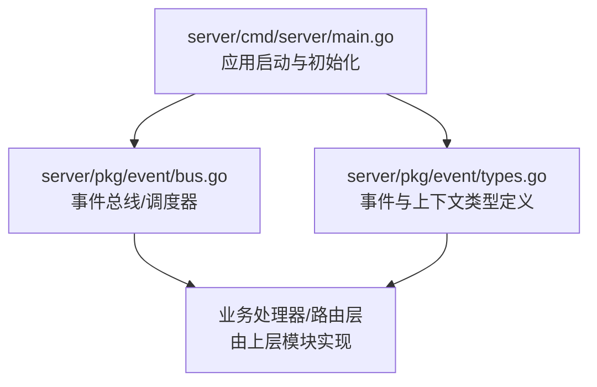
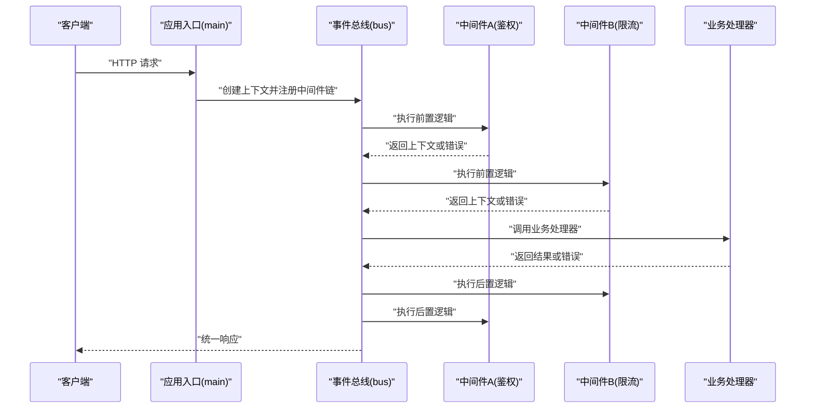
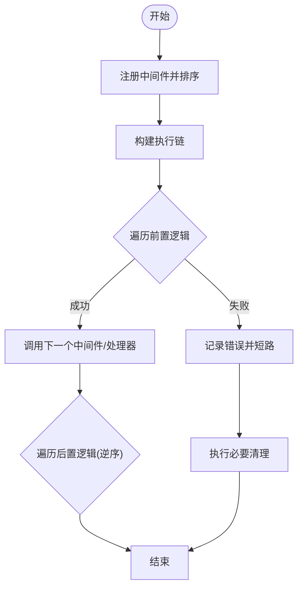
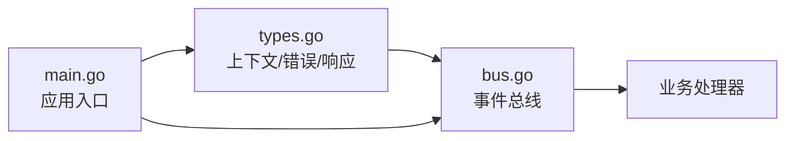

# 中间件核心架构

<cite>
**本文引用的文件**   
- [server/main.go](file://server/cmd/server/main.go)
- [server/pkg/middleware/bus.go](file://server/pkg/event/bus.go)
- [server/pkg/event/types.go](file://server/pkg/event/types.go)
</cite>

## 目录
1. [简介](#简介)
2. [项目结构](#项目结构)
3. [核心组件](#核心组件)
4. [架构总览](#架构总览)
5. [详细组件分析](#详细组件分析)
6. [依赖分析](#依赖分析)
7. [性能考虑](#性能考虑)
8. [故障排查指南](#故障排查指南)
9. [结论](#结论)
10. [附录](#附录)

## 简介
本文件面向 nevix-ai 服务端中间件核心架构，聚焦以下目标：
- 解释中间件的执行顺序、请求处理管道与上下文传递机制
- 明确中间件接口定义、生命周期管理与错误处理策略
- 说明中间件注册机制、配置加载与依赖注入的实现要点
- 提供组合模式、链式调用与并行处理的示例思路
- 指导开发者实现自定义中间件时的性能优化与内存管理最佳实践

## 项目结构
本项目采用 Go 模块化组织，服务端入口位于 server/cmd/server，事件总线与类型定义位于 server/pkg/event。中间件相关能力通过事件总线进行编排与扩展。

图表来源
- [server/cmd/server/main.go](file://server/cmd/server/main.go)
- [server/pkg/event/bus.go](file://server/pkg/event/bus.go)
- [server/pkg/event/types.go](file://server/pkg/event/types.go)

章节来源
- [server/cmd/server/main.go](file://server/cmd/server/main.go)
- [server/pkg/event/bus.go](file://server/pkg/event/bus.go)
- [server/pkg/event/types.go](file://server/pkg/event/types.go)

## 核心组件
- 事件总线（Bus）：负责中间件链的构建、执行顺序控制、上下文传递与错误传播。支持按序执行与并行执行的组合策略。
- 事件与上下文（Types）：定义请求上下文、响应载体、错误模型以及中间件可访问的数据契约，确保跨中间件数据一致性。
- 应用入口（Main）：完成配置加载、依赖注入、中间件注册与启动服务监听。

章节来源
- [server/pkg/event/bus.go](file://server/pkg/event/bus.go)
- [server/pkg/event/types.go](file://server/pkg/event/types.go)
- [server/cmd/server/main.go](file://server/cmd/server/main.go)

## 架构总览
下图展示从请求进入、中间件链执行到最终响应的整体流程。中间件以“前置-后置”模式包裹下游处理器，形成洋葱模型；错误在链路中向上传播，上下文贯穿全链路。

图表来源
- [server/cmd/server/main.go](file://server/cmd/server/main.go)
- [server/pkg/event/bus.go](file://server/pkg/event/bus.go)
- [server/pkg/event/types.go](file://server/pkg/event/types.go)

## 详细组件分析

### 事件总线（Bus）
- 职责
  - 维护中间件注册表与执行顺序
  - 构建并执行中间件链（链式调用）
  - 管理请求上下文的生命周期与作用域
  - 错误收集与传播，支持短路中断
  - 可选的并行执行策略（如只读校验类中间件）
- 关键行为
  - 注册阶段：将中间件按优先级排序，形成单向链表或数组
  - 执行阶段：依次执行前置逻辑，再调用下游处理器，最后执行后置逻辑
  - 上下文：每个中间件读取/写入共享上下文，避免泄露敏感信息
  - 错误处理：遇到错误立即短路，触发后置清理并向上返回
  - 并行处理：对无副作用的中间件可并发执行，聚合结果后继续主链

图表来源
- [server/pkg/event/bus.go](file://server/pkg/event/bus.go)

章节来源
- [server/pkg/event/bus.go](file://server/pkg/event/bus.go)

### 事件与上下文（Types）
- 职责
  - 定义统一的上下文结构体，包含请求元数据、认证信息、追踪ID等
  - 定义错误模型，便于中间件统一抛出与捕获
  - 定义响应载体，供中间件修改或增强响应内容
- 设计要点
  - 上下文不可变字段与可变字段分离，避免并发写冲突
  - 错误类型区分业务错误与系统错误，便于上层分类处理
  - 使用值拷贝与指针权衡，减少不必要的分配与GC压力

章节来源
- [server/pkg/event/types.go](file://server/pkg/event/types.go)

### 应用入口（Main）
- 职责
  - 加载配置（环境变量、配置文件）
  - 初始化依赖（数据库、缓存、日志、指标）
  - 注册中间件与路由处理器
  - 启动服务监听与优雅关闭
- 关键点
  - 配置加载应支持热更新与默认值回退
  - 依赖注入需保证单例与生命周期一致
  - 中间件注册应在路由绑定前完成，确保顺序稳定

章节来源
- [server/cmd/server/main.go](file://server/cmd/server/main.go)

## 依赖分析
- 松耦合：中间件仅依赖上下文与错误类型，不直接依赖具体业务实现
- 高内聚：事件总线封装了中间件编排细节，对外暴露简洁API
- 可扩展：新增中间件只需实现标准接口并注册即可
- 外部依赖：I/O、鉴权、限流等能力通过依赖注入接入，避免硬编码

图表来源
- [server/pkg/event/types.go](file://server/pkg/event/types.go)
- [server/pkg/event/bus.go](file://server/pkg/event/bus.go)
- [server/cmd/server/main.go](file://server/cmd/server/main.go)

章节来源
- [server/pkg/event/types.go](file://server/pkg/event/types.go)
- [server/pkg/event/bus.go](file://server/pkg/event/bus.go)
- [server/cmd/server/main.go](file://server/cmd/server/main.go)

## 性能考虑
- 中间件顺序优化
  - 将快速判断的中间件（如白名单、路径过滤）放在前面，尽早短路
  - 将昂贵操作（如远程鉴权）按需启用，并提供本地缓存
- 上下文与内存
  - 避免在上下文中存放大对象，必要时使用引用并控制作用域
  - 复用缓冲与连接池，减少频繁分配
- 并行处理
  - 对只读且无副作用的中间件可并发执行，注意结果合并与错误聚合
- 错误路径
  - 错误快速返回，避免无效后续计算
  - 统一错误码与消息格式，降低序列化开销

[本节为通用建议，无需代码来源]

## 故障排查指南
- 常见问题定位
  - 中间件未生效：检查注册顺序与条件开关
  - 上下文丢失：确认上下文传递是否被覆盖或提前释放
  - 死锁或阻塞：排查串行等待与资源竞争
  - 内存泄漏：检查大对象引用与 goroutine 生命周期
- 调试技巧
  - 增加链路追踪ID，贯穿请求全程
  - 输出关键节点耗时与状态码
  - 对异常路径打印最小必要上下文，避免泄露敏感信息

[本节为通用建议，无需代码来源]

## 结论
nevix-ai 的中间件核心以事件总线为中心，结合清晰的上下文与错误模型，实现了高内聚、低耦合的可插拔架构。通过合理的执行顺序、错误传播与可选的并行策略，既能满足复杂业务需求，又具备良好的性能与可维护性。开发者遵循本文的最佳实践，可高效实现自定义中间件并融入现有生态。

[本节为总结性内容，无需代码来源]

## 附录
- 自定义中间件实现清单
  - 实现标准接口（前置/后置逻辑）
  - 读写上下文时注意并发安全
  - 正确设置错误类型与状态码
  - 在入口处注册并按优先级排序
- 组合模式与链式调用示例思路
  - 鉴权 -> 限流 -> 审计 -> 业务处理器
  - 前置校验失败则短路，后置仅做清理
- 并行处理示例思路
  - 多源校验（签名、权限、配额）可并发执行，任一失败即短路

[本节为概念性内容，无需代码来源]