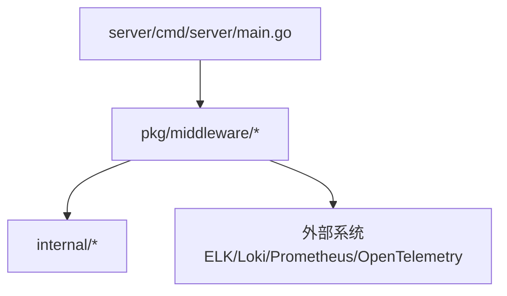
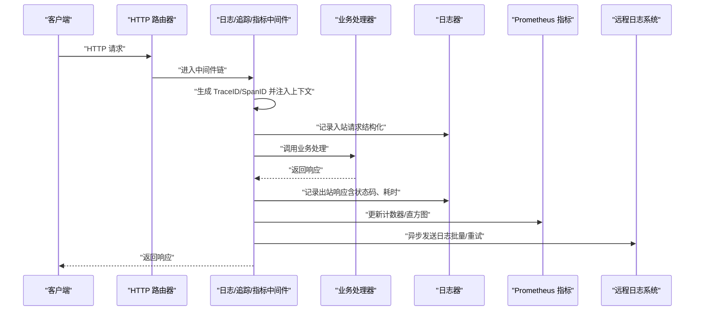
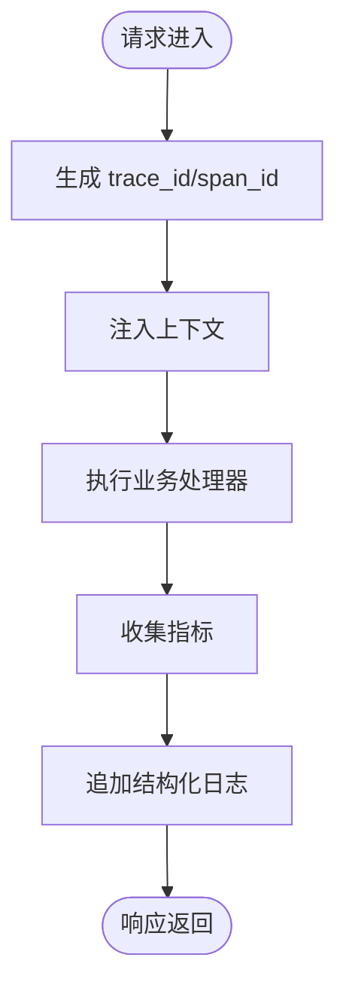
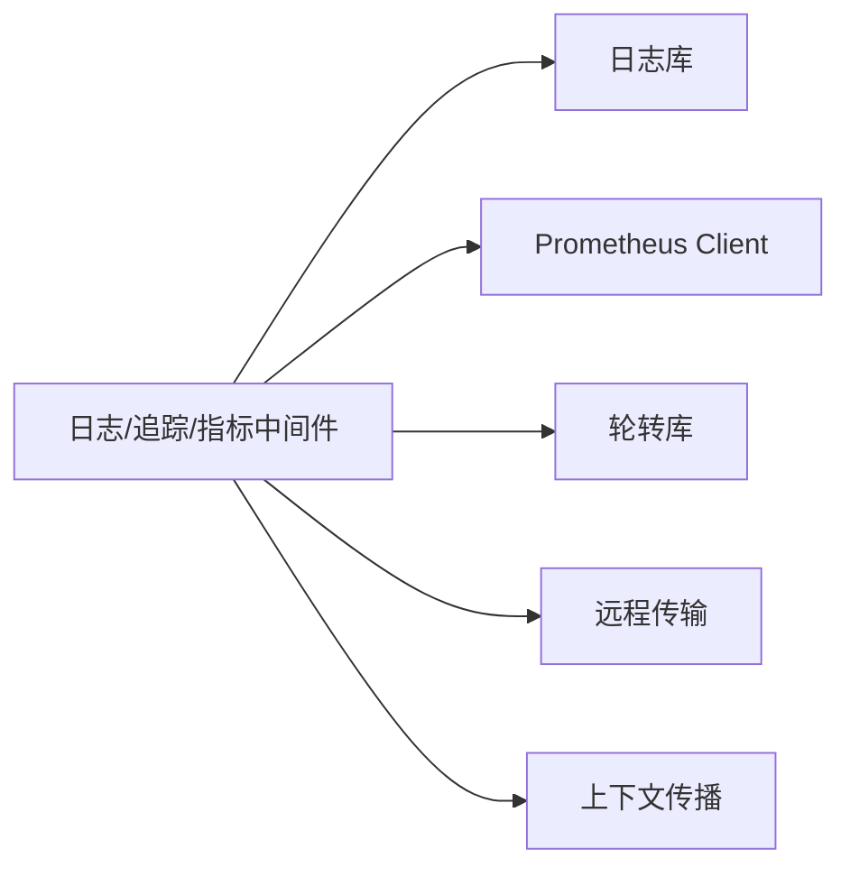

# 日志中间件

<cite>
**本文档引用的文件**   
- [server/main.go](file://server/cmd/server/main.go)
- [server/go.mod](file://server/go.mod)
- [server/internal/](file://server/internal/)
- [server/pkg/middleware/](file://server/pkg/middleware/)
</cite>

## 目录
1. [简介](#简介)
2. [项目结构](#项目结构)
3. [核心组件](#核心组件)
4. [架构总览](#架构总览)
5. [详细组件分析](#详细组件分析)
6. [依赖分析](#依赖分析)
7. [性能考虑](#性能考虑)
8. [故障排查指南](#故障排查指南)
9. [结论](#结论)
10. [附录](#附录)

## 简介
本文件面向 nevix-ai 项目的“日志中间件”能力，聚焦以下目标：
- 结构化日志记录：统一字段、键名与输出格式，便于集中采集与分析。
- 请求响应追踪：为每个 HTTP 请求生成唯一链路标识，贯穿上下游调用链。
- 性能指标收集：统计耗时、错误率、吞吐等关键指标，支持 Prometheus 导出。
- 日志级别配置、输出格式定制与日志轮转策略：满足多环境部署与合规要求。
- 敏感信息过滤：避免泄露密钥、令牌、个人信息等。
- 日志聚合与远程传输：对接 ELK Stack（Elasticsearch、Logstash、Kibana）或 Loki 等系统。
- 监控集成：与 Prometheus 集成暴露指标；可选 OpenTelemetry 实现分布式链路追踪。
- 可观测性与调试效率：提供查询语法、告警规则设置与性能分析工具使用指南。

## 项目结构
本项目采用 Go 语言后端服务组织方式，服务端入口位于 server/cmd/server，内部逻辑与通用包分别位于 internal 与 pkg。日志中间件通常以 pkg/middleware 的形式提供，供路由层装配。

图示来源
- [server/cmd/server/main.go](file://server/cmd/server/main.go)
- [server/pkg/middleware/](file://server/pkg/middleware/)

章节来源
- [server/cmd/server/main.go](file://server/cmd/server/main.go)
- [server/go.mod](file://server/go.mod)

## 核心组件
- 结构化日志器：基于标准库或第三方库（如 slog/zap/logrus）封装，统一 key/value 输出 JSON，包含请求 ID、方法、路径、状态码、耗时、客户端 IP、用户代理等。
- 请求追踪中间件：生成并注入 TraceID/SpanID，写入上下文，透传到下游服务与数据库访问层。
- 指标收集中间件：通过 Prometheus Client Go 暴露 /metrics，统计请求计数、延迟直方图、错误计数等。
- 日志过滤器：对敏感字段进行脱敏或丢弃，确保不输出敏感数据。
- 日志轮转器：按大小或时间滚动输出到本地文件，保留策略可配置。
- 远程传输器：将日志批量异步发送到 Logstash/Fluent Bit/Loki 等，支持重试与背压。

章节来源
- [server/pkg/middleware/](file://server/pkg/middleware/)

## 架构总览
下图展示从 HTTP 请求进入，到日志与指标输出的整体流程，以及与其他系统的集成点。

图示来源
- [server/cmd/server/main.go](file://server/cmd/server/main.go)
- [server/pkg/middleware/](file://server/pkg/middleware/)

## 详细组件分析

### 结构化日志记录
- 设计要点
  - 统一字段命名规范：如 level、ts、msg、trace_id、span_id、method、path、status、latency_ms、client_ip、user_agent 等。
  - 输出格式：JSON 为主，便于 ELK/Loki 解析；控制台模式可切换为人类可读格式。
  - 上下文传播：TraceID/SpanID 自动附加到每条日志。
- 实现建议
  - 使用 slog/zap/logrus 的 JSON 编码器。
  - 在中间件中统一打点，避免业务代码重复拼接字段。
  - 提供 logger.WithFields() 风格的扩展，便于局部上下文增强。
- 示例字段说明
  - trace_id：请求级唯一标识
  - span_id：子操作唯一标识
  - latency_ms：请求耗时毫秒
  - status：HTTP 状态码
  - method/path：请求方法与路径
  - client_ip/user_agent：客户端信息

章节来源
- [server/pkg/middleware/](file://server/pkg/middleware/)

### 请求响应追踪
- 设计要点
  - 为每个请求生成全局唯一的 trace_id，并为关键步骤生成 span_id。
  - 通过上下文传递，确保跨函数、跨协程、跨网络调用保持一致。
  - 在响应阶段汇总耗时与状态码，形成完整的请求生命周期视图。
- 实现建议
  - 中间件在入站时创建 trace_id/span_id，出站时写入响应头（如 X-Request-Id）。
  - 与数据库驱动、HTTP 客户端、消息队列客户端集成，透传 trace_id。
  - 可选 OpenTelemetry SDK 接入，自动埋点常见框架。
- 可视化

图示来源
- [server/pkg/middleware/](file://server/pkg/middleware/)

章节来源
- [server/pkg/middleware/](file://server/pkg/middleware/)

### 性能指标收集
- 设计要点
  - 使用 Prometheus Client Go 暴露 /metrics 端点。
  - 指标类型：Counter（请求数、错误数）、Histogram（延迟分布）、Gauge（活跃连接数）。
  - 标签维度：method、path、status、service、version 等。
- 实现建议
  - 中间件在请求开始与结束分别记录起始时间与结束时间，计算延迟。
  - 避免高基数标签（如用户 ID），防止指标爆炸。
  - 定期清理过期指标，控制内存占用。
- 与监控系统集成
  - Prometheus 抓取 /metrics，Grafana 可视化。
  - 可选 Pushgateway 上报一次性任务指标。

章节来源
- [server/pkg/middleware/](file://server/pkg/middleware/)

### 日志级别配置与输出格式定制
- 日志级别
  - debug：详细调试信息，生产环境默认关闭。
  - info：常规运行信息。
  - warn：潜在问题提示。
  - error：错误事件，需关注。
  - fatal：致命错误，进程退出。
- 输出格式
  - JSON：适合集中式日志系统。
  - Console：人类可读，开发调试使用。
- 配置项建议
  - log_level：字符串枚举
  - log_format：json/console
  - log_output：stdout/file/stdout+file
  - log_file_path：文件路径
  - log_max_size_mb：单文件大小限制
  - log_max_age_days：保留天数
  - log_compress：是否压缩历史文件

章节来源
- [server/pkg/middleware/](file://server/pkg/middleware/)

### 日志轮转策略
- 触发条件
  - 按大小：超过阈值后滚动，保留 N 个历史文件。
  - 按时间：每日/每小时滚动，保留 M 天。
- 实现建议
  - 使用 lru或第三方轮转库（如 lumberjack）。
  - 异步写入，避免阻塞请求。
  - 文件权限与安全：限制读写权限，避免越权访问。

章节来源
- [server/pkg/middleware/](file://server/pkg/middleware/)

### 敏感信息过滤
- 过滤范围
  - 请求体、响应体中的敏感字段（如 password、token、credit_card）。
  - 查询参数、Header 中的敏感值。
  - 数据库 SQL 语句中的明文密码。
- 实现建议
  - 白名单机制：仅允许特定字段输出。
  - 正则替换：将敏感值替换为 ***。
  - 采样策略：仅在 error 级别输出完整上下文。

章节来源
- [server/pkg/middleware/](file://server/pkg/middleware/)

### 日志聚合与远程传输
- 聚合方案
  - 本地文件 + 侧车 Agent（Fluent Bit/Filebeat）上传至 ES/Loki。
  - 直接通过 HTTP/gRPC 发送到 Logstash 或 Loki。
- 传输特性
  - 批量发送、重试、退避、失败落盘。
  - 压缩与加密（TLS）。
  - 断网恢复与幂等性保证。

章节来源
- [server/pkg/middleware/](file://server/pkg/middleware/)

### 与 ELK Stack 集成
- 组件角色
  - Filebeat/Fluent Bit：采集本地日志文件。
  - Logstash：解析、过滤、富化日志。
  - Elasticsearch：存储与索引。
  - Kibana：可视化与查询。
- 集成步骤
  - 配置 Filebeat/Fluent Bit 读取日志文件路径。
  - 定义 Grok/Filter 规则，提取结构化字段。
  - 在 Kibana 中创建索引模式与仪表盘。

章节来源
- [server/pkg/middleware/](file://server/pkg/middleware/)

### 与 Prometheus 集成
- 暴露端点
  - /metrics 由 Prometheus 抓取。
- 指标设计
  - http_requests_total{method,path,status}
  - http_request_duration_seconds_bucket{le}
  - http_errors_total{method,path}
- 告警规则
  - 错误率超过阈值
  - P95/P99 延迟升高
  - 服务不可用

章节来源
- [server/pkg/middleware/](file://server/pkg/middleware/)

### 分布式链路追踪（OpenTelemetry）
- 接入方式
  - 启用 OTel SDK，设置 exporter（OTLP/Zipkin/Jaeger）。
  - 自动埋点 HTTP、数据库、消息队列。
- 链路关联
  - trace_id/span_id 与日志字段对齐。
  - 在 Kibana/Grafana 中通过 trace_id 关联日志与链路。

章节来源
- [server/pkg/middleware/](file://server/pkg/middleware/)

## 依赖分析
- 内部依赖
  - 中间件依赖日志器、指标库、上下文传播工具。
  - 业务处理器通过中间件获取 trace_id 与上下文。
- 外部依赖
  - Prometheus Client Go
  - 日志库（slog/zap/logrus）
  - 轮转库（lumberjack）
  - 远程传输（Logstash/Loki/OTel）

图示来源
- [server/pkg/middleware/](file://server/pkg/middleware/)

章节来源
- [server/pkg/middleware/](file://server/pkg/middleware/)

## 性能考虑
- 异步写入：日志与远程传输使用缓冲队列，避免阻塞主流程。
- 采样策略：高频 debug 日志采样输出，降低 I/O 压力。
- 指标降采样：直方图桶数量合理设置，避免内存膨胀。
- 资源隔离：日志与业务线程分离，减少 GC 抖动。
- 监控自身：对中间件自身耗时与错误率进行监控。

## 故障排查指南
- 常见问题
  - 日志缺失：检查中间件是否注册、输出路径是否正确、权限是否足够。
  - 指标未更新：确认 /metrics 端点可达、Prometheus 抓取配置正确。
  - 链路断裂：检查 trace_id 透传是否在各组件间一致。
  - 敏感信息泄露：审查过滤规则与白名单配置。
- 诊断步骤
  - 查看本地日志文件与 stdout。
  - 使用 Kibana/Grafana 检索 trace_id 与错误堆栈。
  - 对比 Prometheus 指标趋势定位异常时段。
  - 开启 debug 级别日志，复现问题后回滚。

章节来源
- [server/pkg/middleware/](file://server/pkg/middleware/)

## 结论
通过统一的日志中间件，nevix-ai 实现了结构化日志、请求追踪与指标收集的闭环，结合 ELK 与 Prometheus 构建完整的可观测体系。在生产环境中，应严格配置日志级别、轮转策略与敏感信息过滤，确保安全性与性能平衡。借助 OpenTelemetry 与链路追踪，可在分布式环境下快速定位问题，提升调试效率与系统稳定性。

## 附录
- 日志查询语法（Kibana/Loki）
  - 基础查询：level="error" AND path="/api/v1/users"
  - 时间范围：time > now()-1h
  - 链路追踪：trace_id="abc123"
  - 关键字搜索：msg~"timeout" OR msg~"panic"
- 告警规则设置（Prometheus）
  - 错误率：rate(http_errors_total[5m]) / rate(http_requests_total[5m]) > 0.05
  - 延迟：histogram_quantile(0.99, rate(http_request_duration_seconds_bucket[5m])) > 1
  - 可用性：up{job="server"} == 0
- 性能分析工具
  - pprof：CPU/内存/阻塞分析
  - flamegraph：热点函数火焰图
  - otel-collector：链路数据收集与导出