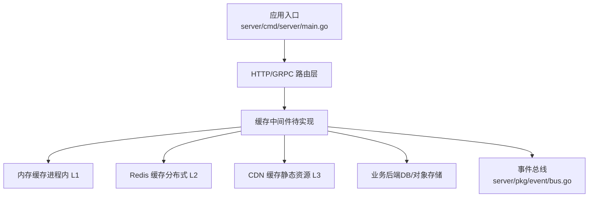
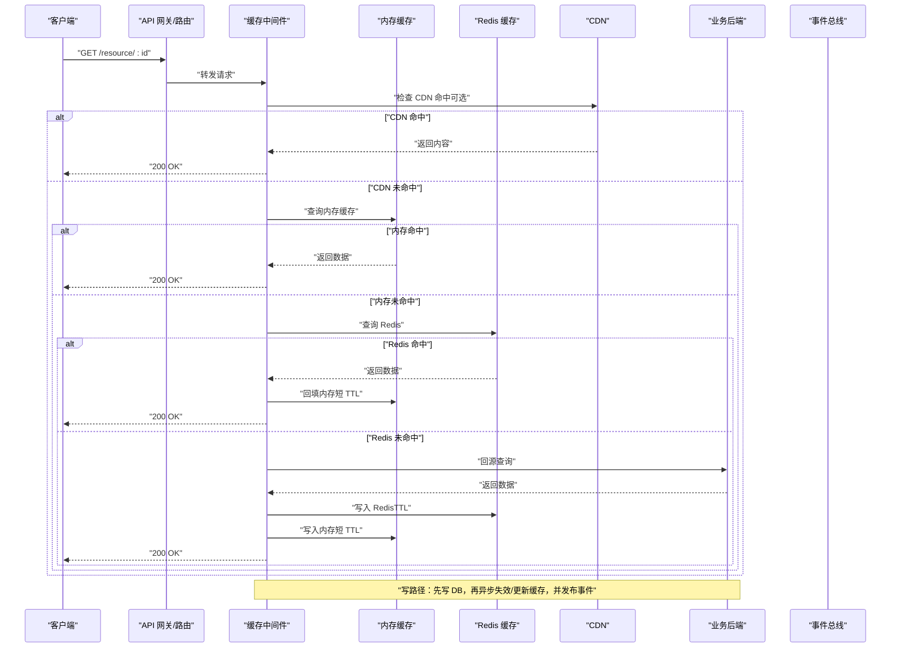
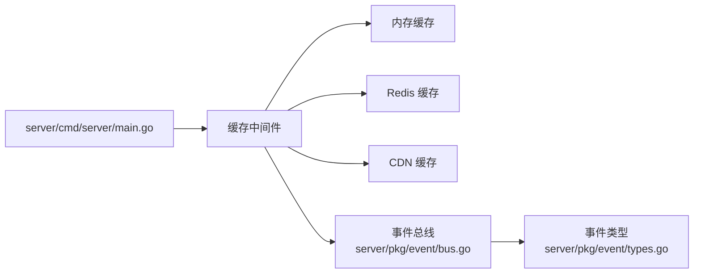

# 缓存中间件

<cite>
**本文引用的文件**   
- [server/main.go](file://server/cmd/server/main.go)
- [server/go.mod](file://server/go.mod)
- [server/pkg/middleware/bus.go](file://server/pkg/event/bus.go)
- [server/pkg/event/types.go](file://server/pkg/event/types.go)
</cite>

## 目录
1. [简介](#简介)
2. [项目结构](#项目结构)
3. [核心组件](#核心组件)
4. [架构总览](#架构总览)
5. [详细组件分析](#详细组件分析)
6. [依赖分析](#依赖分析)
7. [性能考虑](#性能考虑)
8. [故障排查指南](#故障排查指南)
9. [结论](#结论)
10. [附录](#附录)

## 简介
本文件为 nevix-ai 项目的“缓存中间件”提供系统化文档，聚焦多级缓存策略（内存缓存、Redis 缓存、CDN 缓存）的实现与配置、缓存键生成规则、过期与失效机制、预热与批量操作、穿透防护、一致性保证、数据同步与版本管理、监控与容量规划、测试策略与基准测试等。由于当前仓库中未包含具体的缓存实现代码，本文以通用高并发服务端最佳实践为基础，给出可落地的设计与集成建议，并标注在何处接入现有服务入口与事件总线。

## 项目结构
- 服务端入口位于 server/cmd/server/main.go，用于启动 HTTP/GRPC 服务及注册中间件。
- Go 模块定义位于 server/go.mod，声明依赖与版本约束。
- 事件总线位于 server/pkg/event/bus.go 与 types.go，可用于发布/订阅缓存变更事件，支撑跨进程一致性。

图表来源
- [server/cmd/server/main.go](file://server/cmd/server/main.go)
- [server/pkg/event/bus.go](file://server/pkg/event/bus.go)

章节来源
- [server/cmd/server/main.go](file://server/cmd/server/main.go)
- [server/go.mod](file://server/go.mod)
- [server/pkg/event/bus.go](file://server/pkg/event/bus.go)
- [server/pkg/event/types.go](file://server/pkg/event/types.go)

## 核心组件
- 缓存中间件：统一拦截请求，按策略命中多级缓存，决定返回缓存或回源。
- 内存缓存：进程内 L1 缓存，低延迟，适合热点小对象；需处理进程重启丢失问题。
- Redis 缓存：分布式 L2 缓存，支持原子操作、过期策略、Lua 脚本、集群模式。
- CDN 缓存：L3 缓存，适用于静态资源与只读大对象，结合 Cache-Control 与 ETag。
- 事件总线：用于发布缓存失效/更新事件，驱动多实例间的一致性。

章节来源
- [server/cmd/server/main.go](file://server/cmd/server/main.go)
- [server/pkg/event/bus.go](file://server/pkg/event/bus.go)
- [server/pkg/event/types.go](file://server/pkg/event/types.go)

## 架构总览
下图展示典型的多级缓存读取流程与写路径，强调穿透防护、降级与一致性。

图表来源
- [server/cmd/server/main.go](file://server/cmd/server/main.go)
- [server/pkg/event/bus.go](file://server/pkg/event/bus.go)

## 详细组件分析

### 多级缓存策略与配置
- 内存缓存（L1）
  - 适用场景：热点键、小对象、极低延迟要求。
  - 配置要点：最大条目数、LRU/LFU 淘汰策略、短 TTL（防雪崩）、线程安全。
  - 失效策略：写后失效或基于时间 TTL；支持软失效（过期但允许旧值短暂返回）。
- Redis 缓存（L2）
  - 适用场景：分布式共享、中等大小对象、需要持久化与原子性。
  - 配置要点：连接池、超时、重试、序列化格式、Key 前缀与命名空间。
  - 过期策略：TTL + 随机抖动避免集中过期；热点键长 TTL，冷键短 TTL。
- CDN 缓存（L3）
  - 适用场景：静态资源、只读大对象、跨地域分发。
  - 配置要点：Cache-Control、ETag/Last-Modified、版本化 URL、回源鉴权。
  - 失效策略：主动 purge 或基于版本号替换 URL。

章节来源
- [server/cmd/server/main.go](file://server/cmd/server/main.go)

### 缓存键生成规则
- 键组成：命名空间:资源类型:标识符[:字段集][:版本]
- 唯一性保障：用户维度、租户维度、语言/时区等上下文作为键的一部分。
- 版本化：对频繁变更的热点数据引入版本号，便于灰度与回滚。
- 哈希与截断：对超长键进行哈希并限制长度，避免 Redis/CDN 限制。

章节来源
- [server/cmd/server/main.go](file://server/cmd/server/main.go)

### 过期策略与缓存失效机制
- TTL 策略：按数据新鲜度设置不同 TTL；热点键更长，冷数据更短。
- 随机抖动：在 TTL 上叠加随机抖动，降低热键同时过期的风险。
- 写后失效：写成功后立即删除或标记失效，避免脏读。
- 延迟双删：先删缓存，再写库，延时再删一次，减少竞态窗口。
- 布隆过滤器：针对不存在键的查询，提前拦截，防止穿透。

章节来源
- [server/cmd/server/main.go](file://server/cmd/server/main.go)

### 缓存预热与批量操作
- 预热策略：服务启动或定时任务预加载热点键；分批次、限流、失败重试。
- 批量操作：使用 Redis Pipeline/MGET/MSET 提升吞吐；注意事务与原子性。
- 增量更新：监听数据库变更（CDC/触发器），增量刷新缓存。

章节来源
- [server/cmd/server/main.go](file://server/cmd/server/main.go)

### 缓存穿透防护
- 布隆过滤器：拦截不存在的键，快速返回空结果。
- 空值缓存：对确实不存在的键缓存短 TTL 的空值，避免频繁回源。
- 限流熔断：对异常流量进行限流与熔断，保护后端。

章节来源
- [server/cmd/server/main.go](file://server/cmd/server/main.go)

### 一致性保证、数据同步与版本管理
- 最终一致性：写 DB 后异步更新/失效缓存，通过事件总线广播。
- 事件驱动：使用事件总线发布“缓存失效/更新”事件，各实例订阅处理。
- 版本控制：对关键数据引入版本号，配合 CDN 与前端缓存协同失效。
- 幂等性：缓存更新接口具备幂等性，避免重复处理导致不一致。

章节来源
- [server/pkg/event/bus.go](file://server/pkg/event/bus.go)
- [server/pkg/event/types.go](file://server/pkg/event/types.go)

### 缓存监控、命中率分析与容量规划
- 指标采集：命中率、QPS、延迟分布、错误率、内存占用、Redis 连接池状态。
- 告警阈值：命中率低于阈值、延迟突增、错误率升高、内存接近上限。
- 容量规划：根据 QPS、对象大小、热点比例估算内存与 Redis 容量；预留冗余。
- 可视化：Grafana/Prometheus 面板，按租户/接口维度拆分。

章节来源
- [server/cmd/server/main.go](file://server/cmd/server/main.go)

### 缓存测试策略、模拟环境与基准测试
- 单元测试：验证键生成、TTL 计算、失效逻辑、布隆过滤器行为。
- 集成测试：对接真实 Redis/CDN，模拟网络异常与超时。
- 压测环境：使用 JMeter/k6 模拟高并发读，观察命中率与延迟。
- 基准测试：Go testing/benchmark 对比不同缓存策略的性能差异。

章节来源
- [server/cmd/server/main.go](file://server/cmd/server/main.go)

## 依赖分析
- 服务入口依赖中间件，中间件依赖内存缓存、Redis、CDN、事件总线。
- 事件总线解耦缓存失效传播，避免强耦合。
- 外部依赖包括 Redis 客户端、CDN SDK/CLI、监控系统（Prometheus/Grafana）。

图表来源
- [server/cmd/server/main.go](file://server/cmd/server/main.go)
- [server/pkg/event/bus.go](file://server/pkg/event/bus.go)
- [server/pkg/event/types.go](file://server/pkg/event/types.go)

章节来源
- [server/go.mod](file://server/go.mod)
- [server/cmd/server/main.go](file://server/cmd/server/main.go)
- [server/pkg/event/bus.go](file://server/pkg/event/bus.go)
- [server/pkg/event/types.go](file://server/pkg/event/types.go)

## 性能考虑
- 读路径优化：优先命中内存与 Redis，减少回源；CDN 前置过滤静态资源。
- 写路径优化：异步更新缓存，批量合并写操作，避免锁竞争。
- 序列化选择：使用高效二进制格式（如 Protobuf/MessagePack）降低带宽。
- 连接池与超时：合理设置 Redis 连接池大小与超时，避免阻塞。
- 热点保护：热点键本地副本、读写分离、分片与扩容。

[本节为通用指导，无需具体文件引用]

## 故障排查指南
- 常见问题
  - 命中率低：检查键生成是否一致、TTL 是否过短、热点识别是否准确。
  - 延迟高：检查 Redis 连接池、网络延迟、序列化开销。
  - 一致性差：确认写后失效策略与事件总线消费是否正常。
  - 穿透攻击：启用布隆过滤器与空值缓存，增加限流。
- 诊断步骤
  - 查看监控指标与日志，定位慢查询与错误。
  - 复现问题并抓取请求链路，分析缓存命中情况。
  - 逐步隔离依赖（关闭 Redis/CDN），验证回退逻辑。

章节来源
- [server/cmd/server/main.go](file://server/cmd/server/main.go)

## 结论
通过多级缓存策略与事件驱动的一致性方案，nevix-ai 可在高并发读取场景下获得稳定且高效的性能表现。建议在现有服务入口与事件总线基础上，逐步落地内存缓存、Redis 缓存与 CDN 缓存，并完善监控、测试与容量规划，确保系统的可靠性与可扩展性。

[本节为总结性内容，无需具体文件引用]

## 附录
- 术语表
  - 缓存穿透：大量请求访问不存在的数据，导致频繁回源。
  - 缓存雪崩：大量缓存同时过期，导致后端压力骤增。
  - 布隆过滤器：概率数据结构，用于快速判断元素是否存在。
- 参考实践
  - 键命名规范与版本化管理
  - TTL 与随机抖动的组合策略
  - 写后失效与延迟双删的权衡

[本节为补充信息，无需具体文件引用]