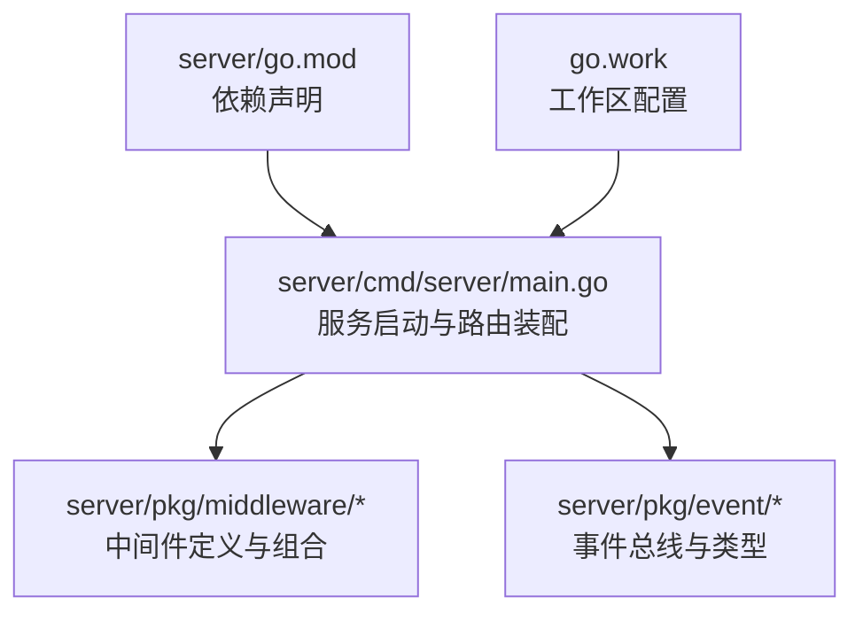
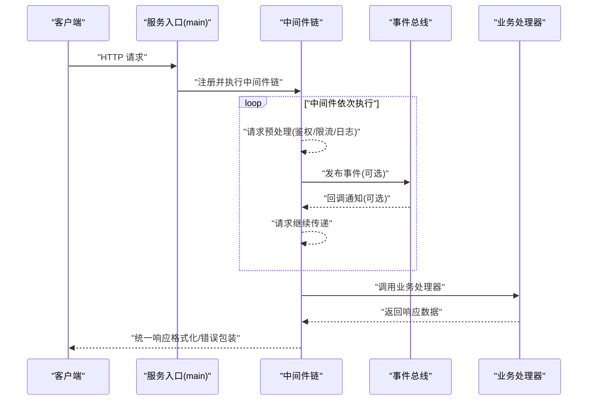
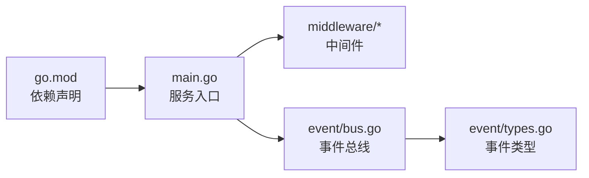

# 自定义中间件开发

<cite>
**本文档引用的文件**   
- [server/main.go](file://server/cmd/server/main.go)
- [server/go.mod](file://server/go.mod)
- [server/pkg/middleware/bus.go](file://server/pkg/event/bus.go)
- [server/pkg/event/types.go](file://server/pkg/event/types.go)
</cite>

## 目录
1. [简介](#简介)
2. [项目结构](#项目结构)
3. [核心组件](#核心组件)
4. [架构总览](#架构总览)
5. [详细组件分析](#详细组件分析)
6. [依赖分析](#依赖分析)
7. [性能考虑](#性能考虑)
8. [故障排查指南](#故障排查指南)
9. [结论](#结论)
10. [附录](#附录)

## 简介
本指导文档面向在 nevix-ai 项目中开发“自定义中间件”的工程师，目标是提供从接口规范、参数传递与错误处理，到注册机制、配置加载、依赖注入、测试策略、部署与版本管理、向后兼容性保证以及常见模式实现（请求转换、响应格式化、跨域处理等）的全链路说明。同时包含性能优化技巧、内存泄漏预防与调试方法，确保中间件具备高可复用性与可维护性。

## 项目结构
本项目采用多模块组织，服务端代码位于 server 目录下，Go 工作区通过 go.work 管理。中间件相关能力集中在 server/pkg/middleware 与 server/pkg/event 中，服务入口为 server/cmd/server/main.go。

图表来源
- [server/cmd/server/main.go:1-200](file://server/cmd/server/main.go#L1-L200)
- [server/go.mod:1-100](file://server/go.mod#L1-L100)
- [server/pkg/event/bus.go:1-200](file://server/pkg/event/bus.go#L1-L200)
- [server/pkg/event/types.go:1-200](file://server/pkg/event/types.go#L1-L200)

章节来源
- [server/cmd/server/main.go:1-200](file://server/cmd/server/main.go#L1-L200)
- [server/go.mod:1-100](file://server/go.mod#L1-L100)

## 核心组件
- 中间件接口与组合器：用于定义统一的中间件签名、链式执行顺序与上下文透传。
- 事件总线：用于中间件与业务层之间的解耦通信，支持发布/订阅模式。
- 服务入口：负责初始化配置、依赖注入、中间件注册与路由装配。

章节来源
- [server/cmd/server/main.go:1-200](file://server/cmd/server/main.go#L1-L200)
- [server/pkg/event/bus.go:1-200](file://server/pkg/event/bus.go#L1-L200)
- [server/pkg/event/types.go:1-200](file://server/pkg/event/types.go#L1-L200)

## 架构总览
下图展示了请求进入服务后，经过中间件链、事件总线与业务处理的典型流程。中间件可在请求前/后插入横切逻辑，事件总线用于异步解耦。

图表来源
- [server/cmd/server/main.go:1-200](file://server/cmd/server/main.go#L1-L200)
- [server/pkg/event/bus.go:1-200](file://server/pkg/event/bus.go#L1-L200)
- [server/pkg/event/types.go:1-200](file://server/pkg/event/types.go#L1-L200)

## 详细组件分析

### 中间件接口与执行模型
- 接口设计要点
  - 统一的函数签名或对象方法，便于组合成链式执行。
  - 支持上下文透传（如请求ID、租户信息、追踪标识）。
  - 明确错误返回约定（区分可恢复与不可恢复错误）。
- 执行顺序与短路
  - 按注册顺序执行，允许提前终止后续中间件（短路）。
  - 支持请求前与请求后两个阶段（Before/After）。
- 参数传递
  - 使用上下文对象携带共享数据，避免全局变量。
  - 对敏感信息进行脱敏与最小化暴露。
- 错误处理
  - 标准化错误码与消息结构。
  - 区分业务错误与系统错误，便于上层统一处理。

章节来源
- [server/cmd/server/main.go:1-200](file://server/cmd/server/main.go#L1-L200)
- [server/pkg/event/types.go:1-200](file://server/pkg/event/types.go#L1-L200)

### 事件总线与中间件解耦
- 发布/订阅模型
  - 中间件可发布领域事件，其他组件订阅处理，降低耦合。
- 生命周期与可靠性
  - 明确事件发送时机（请求前/后、成功/失败）。
  - 支持重试与幂等设计，避免重复处理。
- 性能与背压
  - 使用缓冲通道控制并发与内存占用。
  - 避免阻塞主请求路径，必要时异步处理。

章节来源
- [server/pkg/event/bus.go:1-200](file://server/pkg/event/bus.go#L1-L200)
- [server/pkg/event/types.go:1-200](file://server/pkg/event/types.go#L1-L200)

### 服务入口与中间件注册
- 配置加载
  - 从环境变量或配置文件读取中间件开关与参数。
  - 支持热更新与灰度发布（按需启用/禁用）。
- 依赖注入
  - 通过构造函数注入数据库、缓存、消息队列等依赖。
  - 使用工厂模式创建中间件实例，便于测试替换。
- 路由装配
  - 将中间件按功能分组注册到路由组。
  - 支持全局中间件与局部中间件的组合。

章节来源
- [server/cmd/server/main.go:1-200](file://server/cmd/server/main.go#L1-L200)

### 常见中间件模式示例
- 请求转换
  - 作用：标准化输入格式、解析查询参数、填充默认值。
  - 关键点：保持幂等、避免副作用、记录转换日志。
- 响应格式化
  - 作用：统一响应结构、添加追踪ID、序列化选项。
  - 关键点：错误时仍保持结构一致、避免泄露敏感信息。
- 跨域处理
  - 作用：设置CORS头、预检请求处理、白名单域名。
  - 关键点：安全策略优先、最小权限原则。
- 鉴权与授权
  - 作用：校验令牌、权限检查、租户隔离。
  - 关键点：缓存热点数据、失败快速返回。
- 限流与熔断
  - 作用：保护后端、防止雪崩、动态调整阈值。
  - 关键点：监控指标上报、降级策略。

章节来源
- [server/cmd/server/main.go:1-200](file://server/cmd/server/main.go#L1-L200)
- [server/pkg/event/types.go:1-200](file://server/pkg/event/types.go#L1-L200)

### 中间件测试策略
- 单元测试
  - 使用Mock对象模拟依赖（数据库、缓存、外部API）。
  - 覆盖正常路径、边界条件与错误分支。
- 集成测试
  - 使用测试容器启动真实依赖（数据库、消息队列）。
  - 验证端到端流程与事件传播。
- 性能测试
  - 基准测试中间件开销与内存分配。
  - 压力测试验证限流与熔断效果。

章节来源
- [server/cmd/server/main.go:1-200](file://server/cmd/server/main.go#L1-L200)

### 部署与版本管理
- 版本控制
  - 中间件接口变更遵循语义化版本。
  - 废弃旧接口时提供迁移指南与兼容层。
- 部署策略
  - 蓝绿部署与金丝雀发布，逐步放量。
  - 配置中心统一管理中间件开关与参数。
- 向后兼容性
  - 新增字段默认值、可选参数。
  - 错误码与响应结构不破坏性变更。

章节来源
- [server/go.mod:1-100](file://server/go.mod#L1-L100)

## 依赖分析
中间件与服务入口、事件总线之间的依赖关系如下：

图表来源
- [server/cmd/server/main.go:1-200](file://server/cmd/server/main.go#L1-L200)
- [server/pkg/event/bus.go:1-200](file://server/pkg/event/bus.go#L1-L200)
- [server/pkg/event/types.go:1-200](file://server/pkg/event/types.go#L1-L200)
- [server/go.mod:1-100](file://server/go.mod#L1-L100)

章节来源
- [server/cmd/server/main.go:1-200](file://server/cmd/server/main.go#L1-L200)
- [server/go.mod:1-100](file://server/go.mod#L1-L100)

## 性能考虑
- 减少GC压力
  - 重用上下文对象，避免频繁分配。
  - 使用对象池管理临时数据结构。
- 异步与非阻塞
  - 事件处理异步化，避免阻塞主请求。
  - 使用缓冲通道控制并发度。
- 缓存与预热
  - 热点配置与规则缓存，减少重复计算。
  - 启动时预热依赖连接（数据库、缓存）。
- 监控与告警
  - 关键指标埋点（延迟、错误率、吞吐量）。
  - 异常堆栈与慢请求追踪。

[本节为通用指导，无需特定文件引用]

## 故障排查指南
- 常见问题
  - 中间件顺序错误导致逻辑失效。
  - 事件丢失或重复处理。
  - 内存泄漏与goroutine泄漏。
- 调试方法
  - 启用详细日志与追踪ID。
  - 使用pprof分析CPU与内存使用。
  - 断点调试中间件链执行路径。
- 恢复策略
  - 快速回滚与降级。
  - 熔断与隔离保护。

章节来源
- [server/cmd/server/main.go:1-200](file://server/cmd/server/main.go#L1-L200)
- [server/pkg/event/bus.go:1-200](file://server/pkg/event/bus.go#L1-L200)

## 结论
通过统一的中间件接口、清晰的事件总线与规范的注册机制，nevix-ai 项目实现了高内聚、低耦合的横切逻辑管理。遵循本文档的实践建议，可开发出高性能、易测试、可维护的自定义中间件，并确保在部署与版本演进中的向后兼容性。

[本节为总结性内容，无需特定文件引用]

## 附录
- 最佳实践清单
  - 单一职责：每个中间件只做一件事。
  - 无副作用：避免修改共享状态。
  - 可观测性：完整日志与指标。
  - 可测试性：依赖注入与Mock友好。
- 参考资源
  - Go 官方中间件模式文档。
  - 事件驱动架构设计指南。

[本节为补充信息，无需特定文件引用]