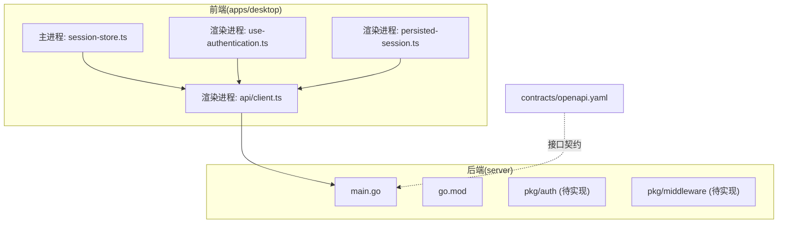
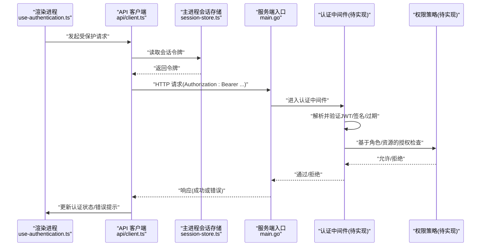
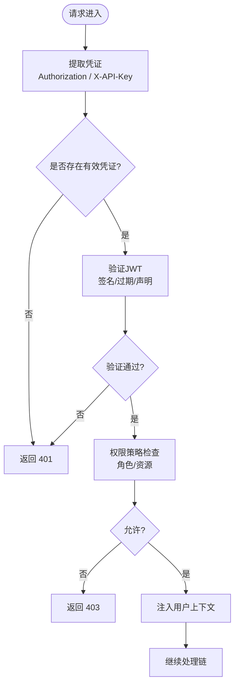
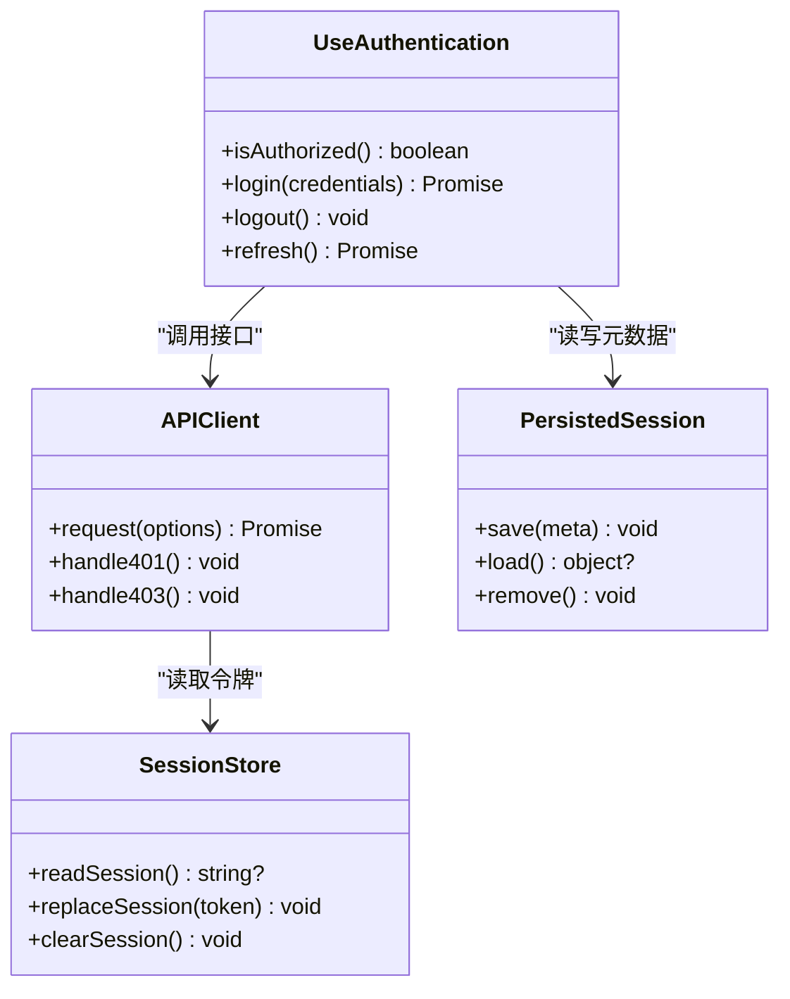
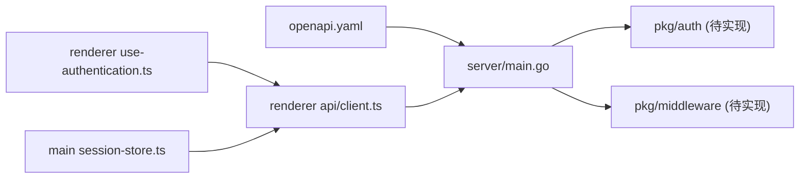

# 认证中间件

<cite>
**本文引用的文件**   
- [server/main.go](file://server/cmd/server/main.go)
- [server/go.mod](file://server/go.mod)
- [contracts/openapi.yaml](file://contracts/openapi.yaml)
- [apps/desktop/src/main/authentication/session-store.ts](file://apps/desktop/src/main/authentication/session-store.ts)
- [apps/desktop/src/renderer/src/features/authentication/api/client.ts](file://apps/desktop/src/renderer/src/features/authentication/api/client.ts)
- [apps/desktop/src/renderer/src/features/authentication/hooks/use-authentication.ts](file://apps/desktop/src/renderer/src/features/authentication/hooks/use-authentication.ts)
- [apps/desktop/src/renderer/src/features/authentication/session/persisted-session.ts](file://apps/desktop/src/renderer/src/features/authentication/session/persisted-session.ts)
- [apps/desktop/tests/auth/harness/supabase/config.toml](file://apps/desktop/tests/auth/harness/supabase/config.toml)
</cite>

## 目录
1. [简介](#简介)
2. [项目结构](#项目结构)
3. [核心组件](#核心组件)
4. [架构总览](#架构总览)
5. [详细组件分析](#详细组件分析)
6. [依赖分析](#依赖分析)
7. [性能考虑](#性能考虑)
8. [故障排查指南](#故障排查指南)
9. [结论](#结论)
10. [附录](#附录)

## 简介
本文件为 nevix-ai 项目的认证中间件提供全面文档，聚焦以下方面：
- JWT 令牌验证、会话管理与权限检查的实现机制
- 支持的认证方式（Bearer Token、API Key 等）、令牌格式与过期策略
- 用户角色与资源访问授权、安全策略配置
- 认证失败错误处理、重试机制与缓存策略
- 与外部认证服务集成与单点登录支持
- 安全最佳实践、防重放攻击与令牌刷新流程

说明：当前仓库中服务端 Go 代码的认证/中间件实现尚未展开（仅存在占位目录），前端 Electron 应用包含完整的认证会话管理、持久化与 API 客户端。因此，本文在描述服务端能力时以“待实现”的方式给出建议与接口契约，并结合现有前端实现说明端到端交互。

## 项目结构
本项目采用多包/多进程组织：
- server：Go 后端服务入口与模块定义（认证中间件目录待实现）
- apps/desktop：Electron 桌面应用，包含主进程会话存储、渲染进程认证 UI 与 API 客户端
- contracts：OpenAPI 契约，用于前后端接口约定

图表来源
- [server/main.go:1-200](file://server/cmd/server/main.go#L1-L200)
- [server/go.mod:1-50](file://server/go.mod#L1-L50)
- [contracts/openapi.yaml:1-200](file://contracts/openapi.yaml#L1-L200)
- [apps/desktop/src/main/authentication/session-store.ts:1-200](file://apps/desktop/src/main/authentication/session-store.ts#L1-L200)
- [apps/desktop/src/renderer/src/features/authentication/api/client.ts:1-200](file://apps/desktop/src/renderer/src/features/authentication/api/client.ts#L1-L200)
- [apps/desktop/src/renderer/src/features/authentication/hooks/use-authentication.ts:1-200](file://apps/desktop/src/renderer/src/features/authentication/hooks/use-authentication.ts#L1-L200)
- [apps/desktop/src/renderer/src/features/authentication/session/persisted-session.ts:1-200](file://apps/desktop/src/renderer/src/features/authentication/session/persisted-session.ts#L1-L200)

章节来源
- [server/main.go:1-200](file://server/cmd/server/main.go#L1-L200)
- [server/go.mod:1-50](file://server/go.mod#L1-L50)
- [contracts/openapi.yaml:1-200](file://contracts/openapi.yaml#L1-L200)
- [apps/desktop/src/main/authentication/session-store.ts:1-200](file://apps/desktop/src/main/authentication/session-store.ts#L1-L200)
- [apps/desktop/src/renderer/src/features/authentication/api/client.ts:1-200](file://apps/desktop/src/renderer/src/features/authentication/api/client.ts#L1-L200)
- [apps/desktop/src/renderer/src/features/authentication/hooks/use-authentication.ts:1-200](file://apps/desktop/src/renderer/src/features/authentication/hooks/use-authentication.ts#L1-L200)
- [apps/desktop/src/renderer/src/features/authentication/session/persisted-session.ts:1-200](file://apps/desktop/src/renderer/src/features/authentication/session/persisted-session.ts#L1-L200)

## 核心组件
- 服务端认证中间件（待实现）
  - 职责：校验请求头中的身份凭证（如 Bearer Token、API Key），解析并验证 JWT，建立上下文用户信息，执行基于角色的访问控制（RBAC）。
  - 关键能力：签名验证、过期校验、黑名单/撤销检查、速率限制、审计日志。
- 前端会话管理
  - 主进程会话存储：安全地持有短期会话令牌，避免渲染进程直接访问敏感数据。
  - 渲染进程 API 客户端：统一注入 Authorization 头，处理 401/403 响应，触发刷新或登出。
  - 钩子与持久化：use-authentication 暴露认证状态与动作；persisted-session 负责本地持久化与清理。
- OpenAPI 契约：定义认证相关端点、请求/响应结构与错误码，确保前后端一致性。

章节来源
- [server/main.go:1-200](file://server/cmd/server/main.go#L1-L200)
- [apps/desktop/src/main/authentication/session-store.ts:1-200](file://apps/desktop/src/main/authentication/session-store.ts#L1-L200)
- [apps/desktop/src/renderer/src/features/authentication/api/client.ts:1-200](file://apps/desktop/src/renderer/src/features/authentication/api/client.ts#L1-L200)
- [apps/desktop/src/renderer/src/features/authentication/hooks/use-authentication.ts:1-200](file://apps/desktop/src/renderer/src/features/authentication/hooks/use-authentication.ts#L1-L200)
- [apps/desktop/src/renderer/src/features/authentication/session/persisted-session.ts:1-200](file://apps/desktop/src/renderer/src/features/authentication/session/persisted-session.ts#L1-L200)
- [contracts/openapi.yaml:1-200](file://contracts/openapi.yaml#L1-L200)

## 架构总览
下图展示从前端到后端的认证流程，包括令牌获取、携带、服务端校验与授权决策。

图表来源
- [apps/desktop/src/renderer/src/features/authentication/hooks/use-authentication.ts:1-200](file://apps/desktop/src/renderer/src/features/authentication/hooks/use-authentication.ts#L1-L200)
- [apps/desktop/src/renderer/src/features/authentication/api/client.ts:1-200](file://apps/desktop/src/renderer/src/features/authentication/api/client.ts#L1-L200)
- [apps/desktop/src/main/authentication/session-store.ts:1-200](file://apps/desktop/src/main/authentication/session-store.ts#L1-L200)
- [server/main.go:1-200](file://server/cmd/server/main.go#L1-L200)

## 详细组件分析

### 服务端认证中间件（待实现）
- 设计目标
  - 统一的鉴权入口，拦截所有受保护路由
  - 支持多种凭证类型：Bearer Token（JWT）、API Key、可选的第三方 OIDC 回调
  - 快速失败：无效签名、过期、吊销立即拒绝
- 关键流程
  - 提取凭证：优先 Authorization: Bearer <token>，其次 X-API-Key
  - 验证 JWT：签名、算法、受众、签发者、过期时间、必要声明
  - 权限检查：基于角色/资源路径的策略匹配（RBAC/ABAC）
  - 上下文注入：将用户标识、角色、租户等信息注入请求上下文
  - 审计与指标：记录认证结果、失败原因、耗时
- 错误处理
  - 401：未认证（缺失或无效凭证）
  - 403：已认证但无权限
  - 429：速率限制
  - 5xx：内部错误（限流、依赖不可用）
- 安全策略配置
  - JWT 白名单签发者、密钥轮换策略
  - 最小权限原则、跨域与 CORS 严格模式
  - 敏感头过滤、请求体大小限制、超时控制

图表来源
- [server/main.go:1-200](file://server/cmd/server/main.go#L1-L200)

章节来源
- [server/main.go:1-200](file://server/cmd/server/main.go#L1-L200)

### 前端会话管理（Electron）
- 主进程会话存储（session-store.ts）
  - 职责：安全持有短期会话令牌，向渲染进程提供受限接口
  - 特性：内存级存储、进程隔离、最小暴露面
- 渲染进程 API 客户端（api/client.ts）
  - 职责：统一封装 HTTP 请求，自动注入 Authorization 头
  - 行为：对 401/403 进行集中处理，触发刷新或登出
- 认证钩子（use-authentication.ts）
  - 职责：暴露 isAuthorized、login、logout、refresh 等方法
  - 行为：根据响应状态更新全局认证状态
- 持久化会话（persisted-session.ts）
  - 职责：本地持久化会话元数据（非敏感），支持过期清理
  - 行为：启动时恢复会话，异常时清理脏数据

图表来源
- [apps/desktop/src/main/authentication/session-store.ts:1-200](file://apps/desktop/src/main/authentication/session-store.ts#L1-L200)
- [apps/desktop/src/renderer/src/features/authentication/api/client.ts:1-200](file://apps/desktop/src/renderer/src/features/authentication/api/client.ts#L1-L200)
- [apps/desktop/src/renderer/src/features/authentication/hooks/use-authentication.ts:1-200](file://apps/desktop/src/renderer/src/features/authentication/hooks/use-authentication.ts#L1-L200)
- [apps/desktop/src/renderer/src/features/authentication/session/persisted-session.ts:1-200](file://apps/desktop/src/renderer/src/features/authentication/session/persisted-session.ts#L1-L200)

章节来源
- [apps/desktop/src/main/authentication/session-store.ts:1-200](file://apps/desktop/src/main/authentication/session-store.ts#L1-L200)
- [apps/desktop/src/renderer/src/features/authentication/api/client.ts:1-200](file://apps/desktop/src/renderer/src/features/authentication/api/client.ts#L1-L200)
- [apps/desktop/src/renderer/src/features/authentication/hooks/use-authentication.ts:1-200](file://apps/desktop/src/renderer/src/features/authentication/hooks/use-authentication.ts#L1-L200)
- [apps/desktop/src/renderer/src/features/authentication/session/persisted-session.ts:1-200](file://apps/desktop/src/renderer/src/features/authentication/session/persisted-session.ts#L1-L200)

### 认证失败、重试与缓存策略
- 失败分类
  - 网络错误：指数退避重试（最多 N 次）
  - 401 未认证：尝试刷新令牌；若失败则登出并跳转登录页
  - 403 无权限：提示用户或降级功能
  - 429 限流：等待并重试
- 缓存策略
  - 只读数据可短缓存（带 ETag/Last-Modified）
  - 写操作禁用缓存，强制走服务端校验
  - 令牌缓存仅在内存，避免落盘泄露

章节来源
- [apps/desktop/src/renderer/src/features/authentication/api/client.ts:1-200](file://apps/desktop/src/renderer/src/features/authentication/api/client.ts#L1-L200)
- [apps/desktop/src/renderer/src/features/authentication/hooks/use-authentication.ts:1-200](file://apps/desktop/src/renderer/src/features/authentication/hooks/use-authentication.ts#L1-L200)

### 与外部认证服务集成与单点登录
- 集成方式
  - OIDC/OAuth2：通过授权码流程获取 ID Token/Access Token
  - Supabase：使用测试配置作为示例（见测试 harness）
- 单点登录（SSO）
  - 服务端维护会话映射与设备指纹
  - 前端通过主进程会话存储共享登录态
  - 支持多设备互踢策略（可选）

章节来源
- [apps/desktop/tests/auth/harness/supabase/config.toml:1-200](file://apps/desktop/tests/auth/harness/supabase/config.toml#L1-L200)
- [apps/desktop/src/main/authentication/session-store.ts:1-200](file://apps/desktop/src/main/authentication/session-store.ts#L1-L200)

### 安全最佳实践与防重放攻击
- 传输安全
  - 强制 HTTPS/TLS，启用 HSTS
  - 严格 CORS 白名单，禁止通配符
- 令牌安全
  - 使用短生命周期 Access Token + Refresh Token
  - 服务端校验签发者、受众、签名算法白名单
  - 支持令牌吊销与黑名单
- 防重放攻击
  - 请求唯一 ID + 时间戳 + 签名
  - 服务端去重窗口与幂等键
- 最小权限
  - RBAC/ABAC 细粒度控制
  - 默认拒绝，显式放行

[本节为通用安全建议，不直接分析具体文件]

## 依赖分析
- 模块依赖
  - 服务端 main.go 作为入口，后续接入 pkg/auth 与 pkg/middleware
  - 前端依赖 Electron IPC 与本地存储
  - OpenAPI 契约约束前后端交互
- 潜在循环依赖
  - 当前未见循环引用；建议保持分层清晰（入口→中间件→业务）

图表来源
- [contracts/openapi.yaml:1-200](file://contracts/openapi.yaml#L1-L200)
- [server/main.go:1-200](file://server/cmd/server/main.go#L1-L200)
- [apps/desktop/src/renderer/src/features/authentication/api/client.ts:1-200](file://apps/desktop/src/renderer/src/features/authentication/api/client.ts#L1-L200)
- [apps/desktop/src/renderer/src/features/authentication/hooks/use-authentication.ts:1-200](file://apps/desktop/src/renderer/src/features/authentication/hooks/use-authentication.ts#L1-L200)
- [apps/desktop/src/main/authentication/session-store.ts:1-200](file://apps/desktop/src/main/authentication/session-store.ts#L1-L200)

章节来源
- [server/go.mod:1-50](file://server/go.mod#L1-L50)
- [contracts/openapi.yaml:1-200](file://contracts/openapi.yaml#L1-L200)

## 性能考虑
- 中间件优化
  - 早期短路：无效请求尽早返回
  - 缓存热点：只读接口短缓存，减少重复计算
  - 异步审计：写入日志/指标异步化
- 前端优化
  - 请求合并与去抖
  - 令牌刷新批量处理，避免并发刷新
- 数据库与外部依赖
  - 连接池与超时控制
  - 降级与熔断策略

[本节为通用性能建议，不直接分析具体文件]

## 故障排查指南
- 常见问题
  - 401 未认证：检查 Authorization 头是否正确、令牌是否过期、签名是否匹配
  - 403 无权限：确认用户角色与资源路径策略
  - 429 限流：降低请求频率或申请配额
- 调试步骤
  - 开启详细日志（脱敏）
  - 复现最小用例，定位问题阶段（前端/中间件/业务）
  - 检查证书、CORS、时钟同步
- 工具与脚本
  - 使用 OpenAPI 生成客户端进行联调
  - 使用测试 harness（Supabase）模拟认证环境

章节来源
- [apps/desktop/src/renderer/src/features/authentication/api/client.ts:1-200](file://apps/desktop/src/renderer/src/features/authentication/api/client.ts#L1-L200)
- [apps/desktop/tests/auth/harness/supabase/config.toml:1-200](file://apps/desktop/tests/auth/harness/supabase/config.toml#L1-L200)

## 结论
- 当前前端具备完善的认证会话管理能力，可作为端到端认证体验的基础
- 服务端认证中间件需尽快落地，以实现统一的 JWT 验证、权限控制与安全策略
- 通过 OpenAPI 契约与严格的错误处理，可保障前后端一致性与可观测性
- 建议按本文档的安全最佳实践推进实施，逐步完善令牌刷新、防重放与审计能力

[本节为总结性内容，不直接分析具体文件]

## 附录
- 术语
  - JWT：JSON Web Token，用于承载用户声明的令牌
  - RBAC：基于角色的访问控制
  - ABAC：基于属性的访问控制
  - OIDC：OpenID Connect，扩展 OAuth2 的身份层
- 参考
  - OpenAPI 契约：用于接口规范与客户端生成
  - 测试 harness：用于本地认证环境搭建

[本节为补充信息，不直接分析具体文件]