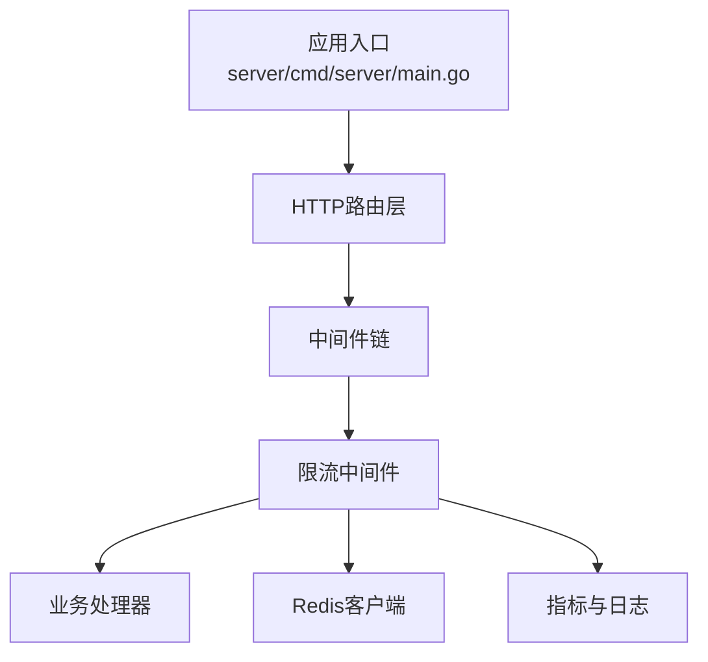
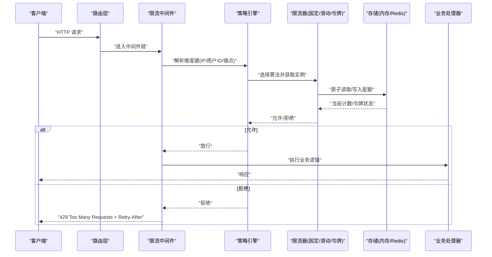
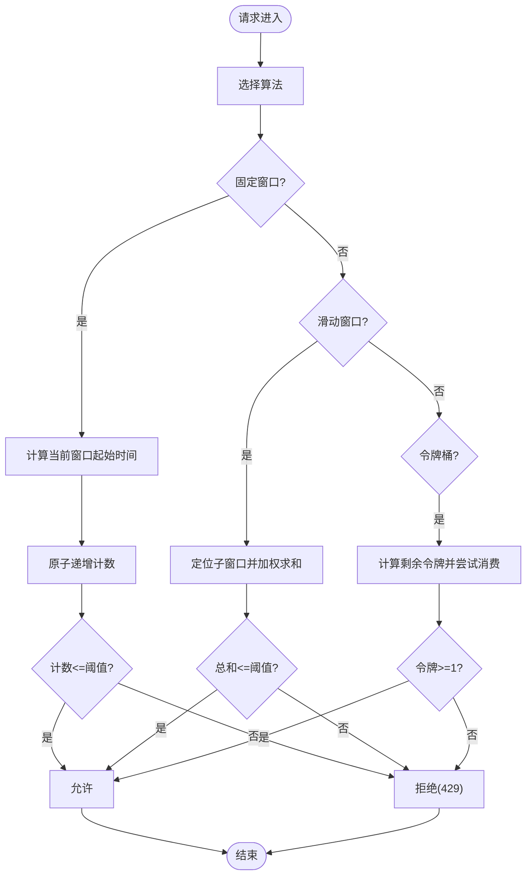
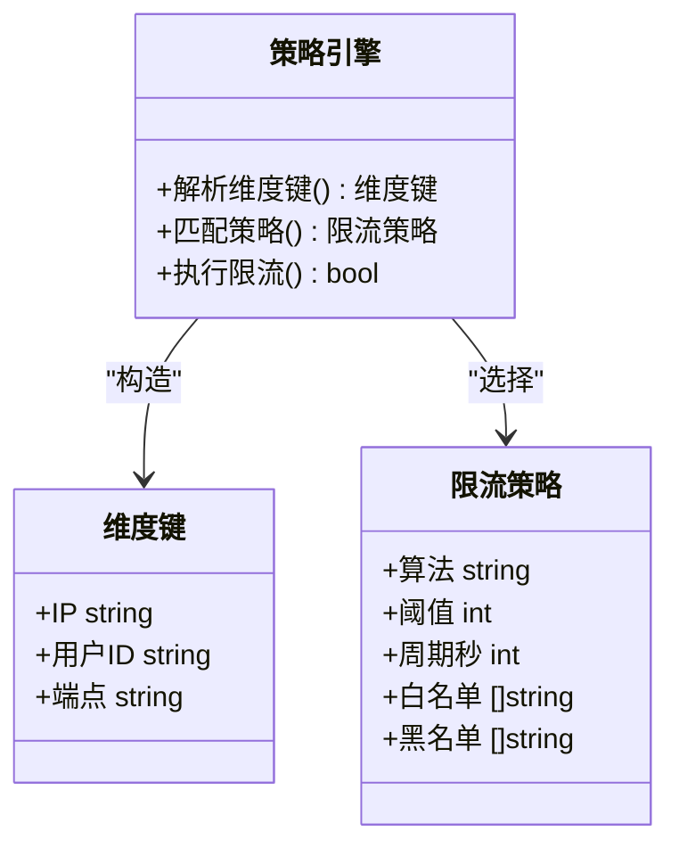
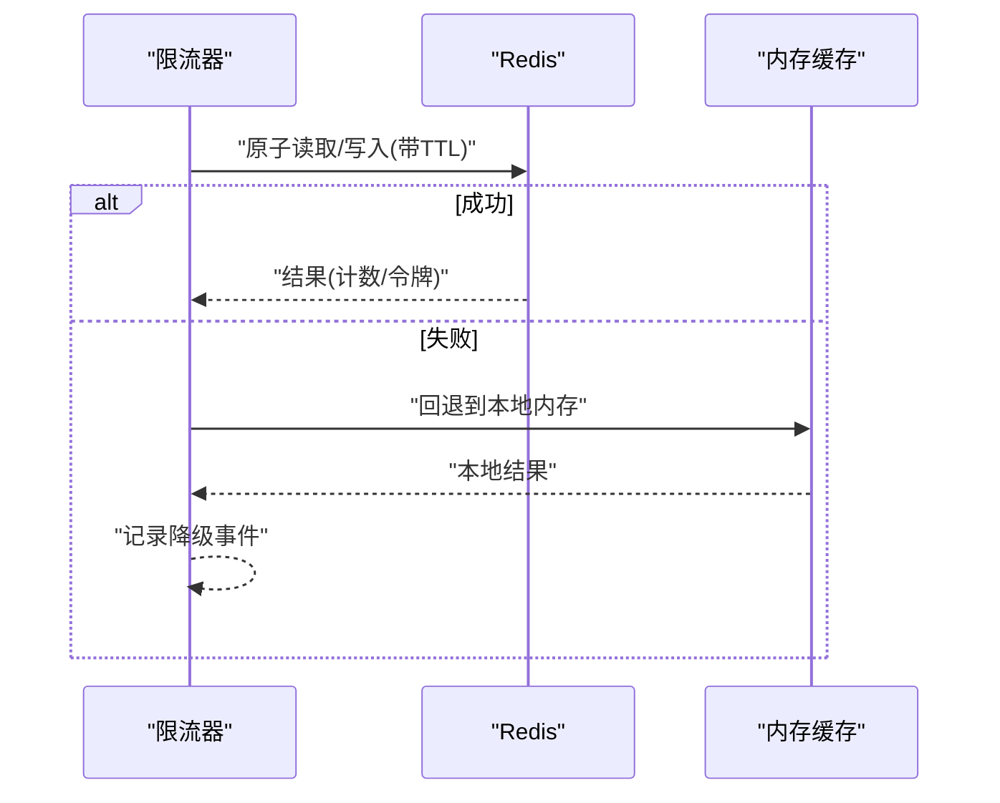
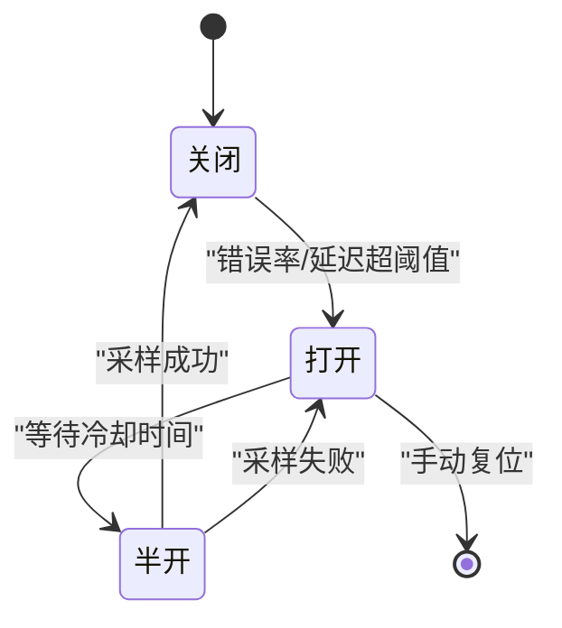
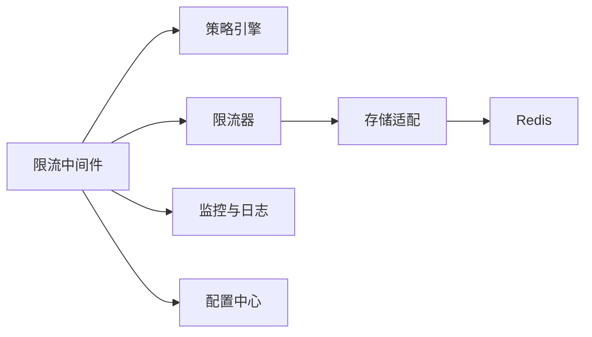

# 限流中间件

<cite>
**本文引用的文件**   
- [server/main.go](file://server/cmd/server/main.go)
- [server/pkg/middleware/README.md](file://server/pkg/middleware/README.md)
</cite>

## 目录
1. [简介](#简介)
2. [项目结构](#项目结构)
3. [核心组件](#核心组件)
4. [架构总览](#架构总览)
5. [详细组件分析](#详细组件分析)
6. [依赖分析](#依赖分析)
7. [性能考虑](#性能考虑)
8. [故障排查指南](#故障排查指南)
9. [结论](#结论)
10. [附录](#附录)

## 简介
本文件为 nevix-ai 项目的限流中间件提供全面的技术文档，覆盖多种限流算法（固定窗口、滑动窗口、令牌桶）、基于 IP/用户ID/API端点的限流策略配置、规则动态调整与配额管理、熔断机制、分布式同步与 Redis 存储一致性保证、统计监控与告警、测试方法、性能调优与故障恢复等。目标是帮助开发者在复杂高并发场景下构建稳定、公平且可观测的限流系统。

## 项目结构
本项目采用 Go 语言服务组织方式，服务端入口位于 server/cmd/server，通用能力通过 pkg 分层暴露，中间件位于 server/pkg/middleware。限流作为通用中间件，应遵循“无侵入式”原则，以插件化方式接入请求处理链路。

图表来源
- [server/main.go:1-200](file://server/cmd/server/main.go#L1-L200)

章节来源
- [server/main.go:1-200](file://server/cmd/server/main.go#L1-L200)

## 核心组件
- 限流器接口：定义统一的限流决策与配额查询能力，便于替换不同算法实现。
- 算法实现：固定窗口、滑动窗口、令牌桶三种算法的具体实现。
- 策略引擎：根据上下文（IP、用户ID、API端点）选择并执行对应限流策略。
- 存储适配：本地内存与 Redis 两种后端，支持单机与分布式部署。
- 监控与告警：采集 QPS、拒绝率、延迟分位、配额使用率等指标，支持阈值告警。
- 配置中心：支持热更新限流规则与配额，保障运行时动态调整。

章节来源
- [server/pkg/middleware/README.md:1-200](file://server/pkg/middleware/README.md#L1-L200)

## 架构总览
限流中间件在 HTTP 请求进入时拦截，依据策略引擎解析维度键（IP/用户ID/端点），调用限流器进行配额判定；允许则放行，拒绝则返回标准错误码与重试建议。分布式环境下通过 Redis 原子操作保证跨节点一致性。

图表来源
- [server/main.go:1-200](file://server/cmd/server/main.go#L1-L200)
- [server/pkg/middleware/README.md:1-200](file://server/pkg/middleware/README.md#L1-L200)

## 详细组件分析

### 限流算法设计与实现
- 固定窗口
  - 原理：将时间划分为固定区间，每个区间内累计请求数不超过阈值。
  - 适用场景：简单高吞吐场景，容忍边界突发。
  - 复杂度：O(1) 读写，空间按窗口数量线性增长。
  - 风险：窗口切换瞬间可能产生双倍峰值。
- 滑动窗口
  - 原理：将大窗口拆分为多个小窗口，按权重累加最近时间段的计数。
  - 适用场景：需要更平滑的限流效果，减少突发抖动。
  - 复杂度：O(n) 窗口数，空间随窗口数增长。
  - 优化：懒清理过期小窗口，避免内存膨胀。
- 令牌桶
  - 原理：以恒定速率向桶中补充令牌，请求消耗令牌，不足即拒绝。
  - 适用场景：允许短时突发但限制长期平均速率。
  - 复杂度：O(1) 每次请求，空间常数级。
  - 注意：需处理时钟回拨与并发竞争。

图表来源
- [server/pkg/middleware/README.md:1-200](file://server/pkg/middleware/README.md#L1-L200)

章节来源
- [server/pkg/middleware/README.md:1-200](file://server/pkg/middleware/README.md#L1-L200)

### 策略引擎与维度键
- 维度键来源
  - IP：从请求头或上游代理透传的真实客户端地址。
  - 用户ID：鉴权后从上下文提取的用户标识。
  - API端点：路由路径或控制器标识。
- 策略优先级
  - 默认顺序：用户ID > API端点 > IP，可按配置调整。
- 策略匹配
  - 精确匹配与正则匹配结合，支持白名单与黑名单。
- 组合策略
  - 多键叠加（如用户ID+端点）形成复合维度，精细化控制。

图表来源
- [server/pkg/middleware/README.md:1-200](file://server/pkg/middleware/README.md#L1-L200)

章节来源
- [server/pkg/middleware/README.md:1-200](file://server/pkg/middleware/README.md#L1-L200)

### 存储适配与分布式一致性
- 本地内存
  - 优点：极低延迟，适合单机或容器短生命周期。
  - 缺点：进程重启丢失，无法跨实例共享。
- Redis 存储
  - 原子操作：INCR/DECR、Lua脚本保证并发安全。
  - 数据模型：key=维度键, value=计数/令牌状态, ttl=窗口周期。
  - 一致性：强一致读/写，确保多节点限流一致。
  - 降级：Redis不可用时回退到本地内存或快速失败。
- 缓存穿透保护
  - 空值短期缓存，防止恶意探测导致雪崩。

图表来源
- [server/pkg/middleware/README.md:1-200](file://server/pkg/middleware/README.md#L1-L200)

章节来源
- [server/pkg/middleware/README.md:1-200](file://server/pkg/middleware/README.md#L1-L200)

### 动态规则调整与配额管理
- 热更新
  - 通过配置中心推送新规则，中间件监听变更并即时生效。
  - 版本化与灰度发布，支持回滚。
- 配额管理
  - 全局配额与租户配额分离，支持配额借用与回收。
  - 配额审计与报表导出。
- 熔断机制
  - 当下游错误或超时比例超过阈值，触发熔断，快速失败并指数退避重试。
  - 熔断状态：关闭→打开→半开，自动恢复。

图表来源
- [server/pkg/middleware/README.md:1-200](file://server/pkg/middleware/README.md#L1-L200)

章节来源
- [server/pkg/middleware/README.md:1-200](file://server/pkg/middleware/README.md#L1-L200)

### 监控指标与告警
- 核心指标
  - 请求总量、拒绝量、拒绝率、QPS、P95/P99延迟、配额使用率。
  - 各维度键的独立指标，支持聚合与下钻。
- 告警规则
  - 拒绝率突增、延迟升高、配额耗尽、Redis异常。
  - 分级告警与降噪策略，避免告警风暴。
- 可视化
  - 仪表盘展示实时趋势与热点维度键。

章节来源
- [server/pkg/middleware/README.md:1-200](file://server/pkg/middleware/README.md#L1-L200)

### 限流测试方法与基准
- 单元测试
  - 模拟维度键与时间推进，验证各算法边界条件。
  - 注入存储适配器，断言原子操作正确性。
- 集成测试
  - 端到端压测，验证中间件对整体延迟的影响。
  - 故障注入（Redis宕机、网络抖动），验证降级与恢复。
- 性能基准
  - 单核/多核压测，对比不同算法与存储后端的吞吐与延迟。
  - 热点键专项测试，评估锁竞争与内存占用。

章节来源
- [server/pkg/middleware/README.md:1-200](file://server/pkg/middleware/README.md#L1-L200)

### 性能调优与公平性
- 参数调优
  - 窗口大小、令牌速率、并发批处理大小。
  - Redis连接池、超时与重试策略。
- 公平性保障
  - 防抖与去重，避免同一请求重复计数。
  - 优先级队列与资源隔离，保障关键业务不受影响。
- 容量规划
  - 预估峰值QPS与内存占用，预留冗余。

章节来源
- [server/pkg/middleware/README.md:1-200](file://server/pkg/middleware/README.md#L1-L200)

## 依赖分析
限流中间件依赖以下模块：
- 策略引擎：解析维度键与匹配策略。
- 限流器：具体算法实现。
- 存储适配：内存/Redis。
- 监控与日志：指标采集与日志输出。
- 配置中心：规则热更新。

图表来源
- [server/pkg/middleware/README.md:1-200](file://server/pkg/middleware/README.md#L1-L200)

章节来源
- [server/pkg/middleware/README.md:1-200](file://server/pkg/middleware/README.md#L1-L200)

## 性能考虑
- 低延迟优先：尽量使用原子操作与无锁数据结构。
- 批量与异步：指标上报与日志落盘异步化，避免阻塞主链路。
- 热点优化：热点键分片与本地缓存，降低远程调用压力。
- 资源隔离：为限流相关任务分配独立线程池与连接池。

## 故障排查指南
- 常见问题
  - 误判拒绝：检查维度键解析是否正确，是否存在代理头篡改。
  - 配额泄漏：确认 TTL 设置与原子操作是否生效。
  - Redis 异常：观察连接池与超时配置，启用降级策略。
- 诊断步骤
  - 查看指标与日志，定位热点维度键与拒绝原因。
  - 回放请求样本，复现问题并验证修复。
  - 逐步回滚配置，定位变更引入的问题。

章节来源
- [server/pkg/middleware/README.md:1-200](file://server/pkg/middleware/README.md#L1-L200)

## 结论
限流中间件通过统一接口与可扩展算法设计，满足多样化限流需求；借助 Redis 与本地回退保障分布式一致性与可用性；配合监控告警与测试体系，确保在高并发场景下的稳定性与公平性。建议在生产环境充分压测与灰度发布，持续优化参数与容量规划。

## 附录
- 术语表
  - 固定窗口：按固定时间区间累计请求数的限流方式。
  - 滑动窗口：将大窗口拆分为多个小窗口并按权重累加的限流方式。
  - 令牌桶：以恒定速率补充令牌，请求消耗令牌的限流方式。
  - 熔断：当错误率或延迟超过阈值时快速失败的自我保护机制。
- 参考链接
  - 项目入口与服务初始化流程参见 server/cmd/server/main.go。
  - 中间件设计与扩展点参见 server/pkg/middleware/README.md。