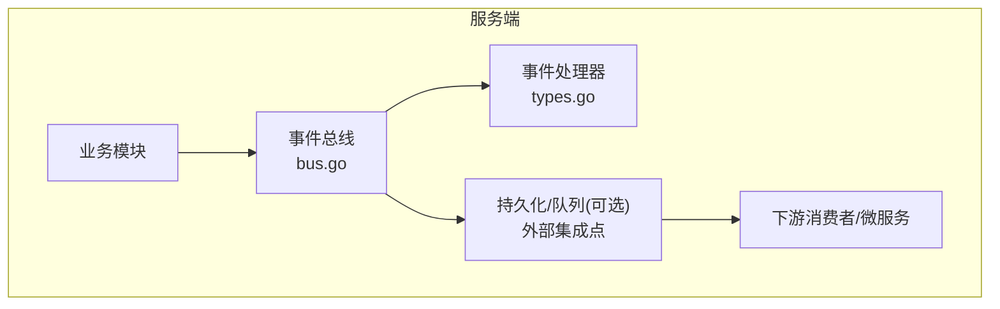
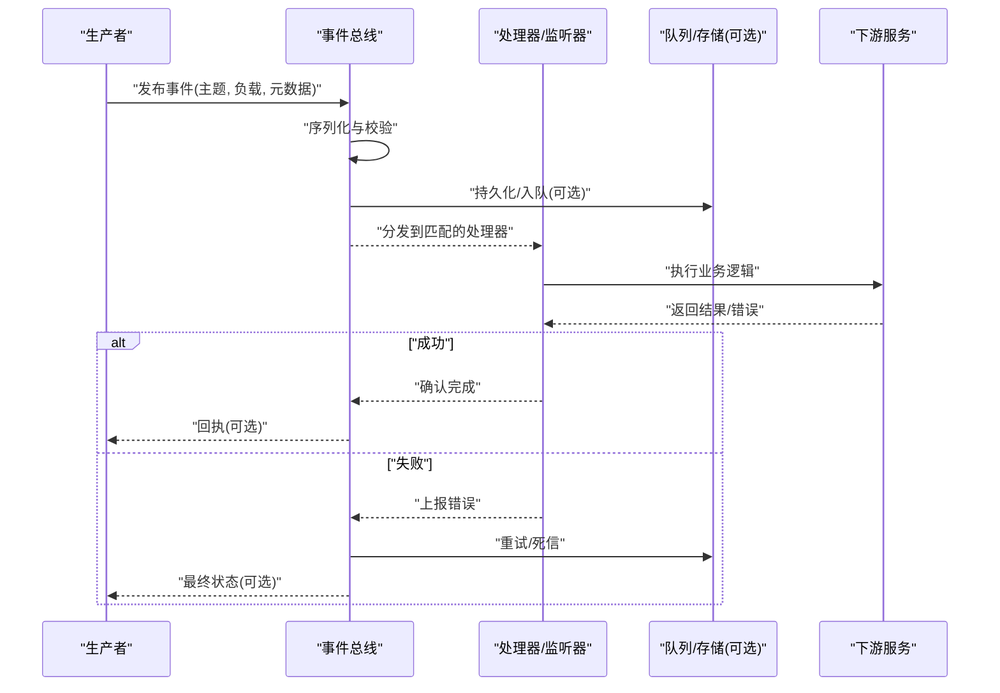
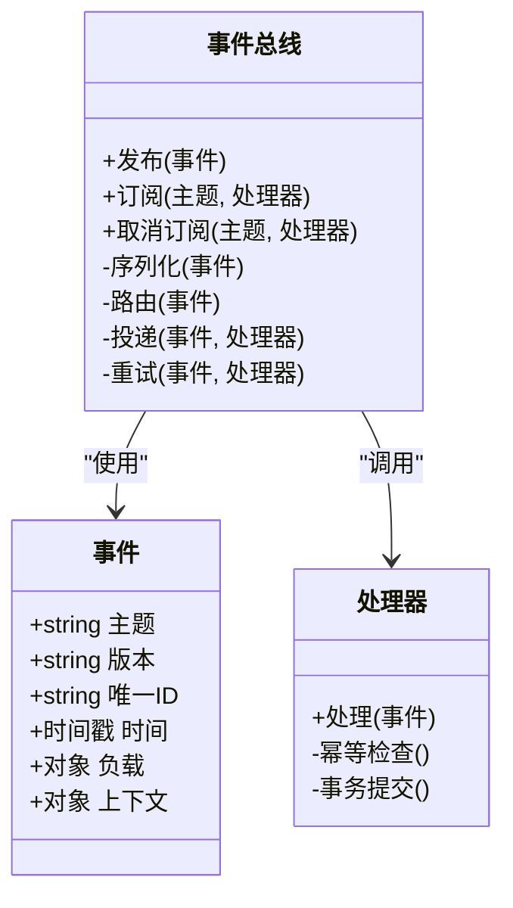
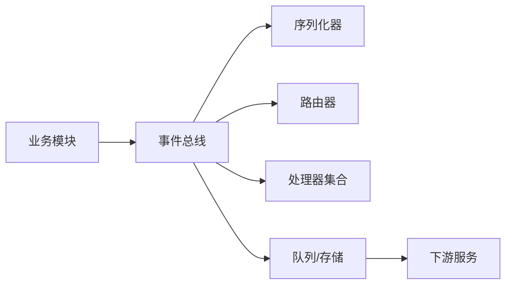

# 事件系统

<cite>
**本文引用的文件**   
- [server/pkg/event/bus.go](file://server/pkg/event/bus.go)
- [server/pkg/event/types.go](file://server/pkg/event/types.go)
</cite>

## 目录
1. [简介](#简介)
2. [项目结构](#项目结构)
3. [核心组件](#核心组件)
4. [架构总览](#架构总览)
5. [详细组件分析](#详细组件分析)
6. [依赖关系分析](#依赖关系分析)
7. [性能考虑](#性能考虑)
8. [故障排查指南](#故障排查指南)
9. [结论](#结论)
10. [附录](#附录)

## 简介
本文件为 nevix-ai 后端服务的事件系统提供系统化文档，聚焦于事件总线的设计模式与消息传递机制。内容涵盖事件类型定义、发布/订阅模型、异步处理流程、序列化策略、错误处理与重试机制、监听器注册与处理器编写、调试技巧，以及面向微服务的解耦通信所需的性能、内存管理与扩展性设计。目标是帮助开发者快速理解并安全扩展事件系统，确保在分布式场景下的可靠性与可观测性。

## 项目结构
事件系统位于 server/pkg/event 目录下，采用“包内职责单一”的组织方式：
- bus.go：实现事件总线（发布/订阅、路由、调度）
- types.go：定义事件类型、元数据、上下文等数据结构

图表来源
- [server/pkg/event/bus.go](file://server/pkg/event/bus.go)
- [server/pkg/event/types.go](file://server/pkg/event/types.go)

章节来源
- [server/pkg/event/bus.go](file://server/pkg/event/bus.go)
- [server/pkg/event/types.go](file://server/pkg/event/types.go)

## 核心组件
- 事件类型与元数据：统一描述事件主题、版本、关联ID、时间戳、负载与上下文，保证跨服务一致性与可追溯性。
- 事件总线：提供发布、订阅、路由与调度能力，支持同步与异步两种投递模式，屏蔽底层传输细节。
- 处理器与监听器：按主题或规则匹配接收事件，执行领域逻辑，支持幂等与重试。
- 序列化与反序列化：对事件负载进行编码/解码，支持多格式与版本兼容。
- 错误处理与重试：捕获异常、分类错误、指数退避重试、死信队列与告警。
- 可观测性：埋点、指标、追踪与日志，便于定位问题与容量规划。

章节来源
- [server/pkg/event/types.go](file://server/pkg/event/types.go)
- [server/pkg/event/bus.go](file://server/pkg/event/bus.go)

## 架构总览
下图展示事件系统在服务内的角色与交互：生产者通过总线发布事件，总线根据订阅关系将事件分发给处理器；处理器可调用外部系统或落库；失败路径进入重试与死信通道。

图表来源
- [server/pkg/event/bus.go](file://server/pkg/event/bus.go)
- [server/pkg/event/types.go](file://server/pkg/event/types.go)

## 详细组件分析

### 事件类型与数据结构
- 事件主体：包含主题、版本、唯一ID、时间戳、负载与上下文字段，用于跨进程/服务传递。
- 元数据：记录来源、租户、环境、追踪ID等，支撑审计与排障。
- 负载：业务数据载体，需遵循序列化契约与版本兼容性策略。
- 上下文：传播调用链信息（如请求ID、用户ID），便于端到端追踪。

复杂度与约束
- 事件大小建议限制，避免阻塞网络与内存抖动。
- 版本号与字段兼容性策略（向前/向后兼容）保障平滑升级。
- 必填字段与校验规则应在发布前完成，减少无效投递。

章节来源
- [server/pkg/event/types.go](file://server/pkg/event/types.go)

### 事件总线（发布/订阅）
职责
- 维护订阅表与路由规则，按主题或表达式匹配处理器。
- 提供发布接口，支持同步等待与异步回传。
- 管理生命周期：启动时加载订阅、运行时动态更新、优雅关闭。
- 协调序列化、错误处理、重试与可观测性。

关键流程
- 发布：校验事件 -> 序列化 -> 路由 -> 投递（同步/异步）-> 回执/错误上报。
- 订阅：注册处理器 -> 绑定主题/规则 -> 启动消费循环。
- 路由：精确匹配、通配符、优先级与去重策略。
- 调度：并发控制、背压、限流与资源隔离。

章节来源
- [server/pkg/event/bus.go](file://server/pkg/event/bus.go)

#### 类图（代码级关系）

图表来源
- [server/pkg/event/types.go](file://server/pkg/event/types.go)
- [server/pkg/event/bus.go](file://server/pkg/event/bus.go)

### 发布/订阅与异步处理
- 同步发布：适用于需要立即反馈的场景，但会阻塞生产者。
- 异步发布：高吞吐场景首选，结合队列与批处理提升稳定性。
- 背压与限流：防止突发流量导致内存膨胀与延迟飙升。
- 顺序与一致性：对有序性有要求的主题，需引入分区键与顺序保证。

章节来源
- [server/pkg/event/bus.go](file://server/pkg/event/bus.go)

### 序列化与反序列化
- 格式选择：JSON/Protobuf/MessagePack 等，权衡可读性与性能。
- 版本兼容：新增字段默认值、弃用字段兼容、迁移脚本。
- 校验：Schema 校验、长度/枚举/范围检查，尽早失败。
- 压缩与分片：大负载压缩、分片上传与合并。

章节来源
- [server/pkg/event/types.go](file://server/pkg/event/types.go)

### 错误处理与重试策略
- 错误分类：可重试（网络抖动、超时）、不可重试（参数错误、权限不足）。
- 重试策略：指数退避、抖动、最大次数、退避上限。
- 死信队列：失败事件归档，人工干预与补偿任务。
- 幂等性：基于唯一ID的去重，避免重复处理造成副作用。
- 熔断与降级：保护下游，快速失败与回退策略。

章节来源
- [server/pkg/event/bus.go](file://server/pkg/event/bus.go)

### 监听器注册与处理器编写
- 注册方式：静态声明、配置驱动、运行时发现。
- 匹配规则：主题名、标签、表达式过滤。
- 处理器要求：无副作用或幂等、短耗时、异常上报、指标埋点。
- 生命周期：初始化、健康检查、优雅关闭。

章节来源
- [server/pkg/event/bus.go](file://server/pkg/event/bus.go)

### 调试与可观测性
- 日志：结构化日志，包含事件ID、主题、处理耗时与错误码。
- 追踪：跨组件链路追踪，端到端延迟与瓶颈定位。
- 指标：发布量、消费速率、失败率、重试次数、堆积量。
- 工具：回放、模拟、灰度与影子流量。

章节来源
- [server/pkg/event/bus.go](file://server/pkg/event/bus.go)

## 依赖关系分析
事件系统对外部依赖的抽象与边界：
- 内部依赖：业务模块通过总线接口发布/订阅，不感知具体传输。
- 外部依赖：队列/存储、序列化库、监控与追踪SDK。
- 耦合点：序列化协议、错误码约定、重试语义与幂等键。

图表来源
- [server/pkg/event/bus.go](file://server/pkg/event/bus.go)
- [server/pkg/event/types.go](file://server/pkg/event/types.go)

章节来源
- [server/pkg/event/bus.go](file://server/pkg/event/bus.go)
- [server/pkg/event/types.go](file://server/pkg/event/types.go)

## 性能考虑
- 吞吐量：批量发送、零拷贝、连接池、线程池隔离。
- 延迟：缩短处理路径、避免阻塞IO、合理分片。
- 内存：对象复用、限制事件大小、及时释放引用。
- 背压：令牌桶/漏桶、消费者限速、丢弃策略。
- 缓存：热点数据本地缓存，注意失效与一致性。
- 水平扩展：无状态处理器、分区键路由、负载均衡。

[本节为通用指导，无需特定文件来源]

## 故障排查指南
常见问题与定位步骤：
- 事件未到达：检查订阅注册、路由规则、主题命名与权限。
- 处理失败：查看错误分类、重试次数、死信队列与堆栈。
- 性能退化：观察指标（吞吐、延迟、堆积）、GC 与锁竞争。
- 数据不一致：核对幂等键、事务边界与补偿任务。
- 序列化问题：版本冲突、字段缺失、Schema 变更。

章节来源
- [server/pkg/event/bus.go](file://server/pkg/event/bus.go)
- [server/pkg/event/types.go](file://server/pkg/event/types.go)

## 结论
nevix-ai 事件系统以清晰的分层与职责划分，实现了高内聚、低耦合的消息传递能力。通过统一的事件类型、灵活的订阅路由、稳健的错误与重试机制，以及完善的可观测性，满足微服务架构下可靠通信的需求。建议在后续迭代中持续完善序列化版本治理、监控告警与自动化测试，进一步提升系统的稳定性与可扩展性。

[本节为总结性内容，无需特定文件来源]

## 附录
- 最佳实践清单
  - 明确事件边界与语义，避免过度拆分或聚合。
  - 强制幂等与去重，保障重复投递安全。
  - 设置合理的超时、重试与熔断参数。
  - 全链路追踪与结构化日志，便于排障。
  - 灰度发布与回滚预案，降低变更风险。
- 扩展方向
  - 引入事件溯源与快照，增强可回溯性。
  - 增加事件编排与工作流引擎，支持复杂业务。
  - 多语言 SDK 与客户端库，提升生态兼容性。

[本节为补充性内容，无需特定文件来源]