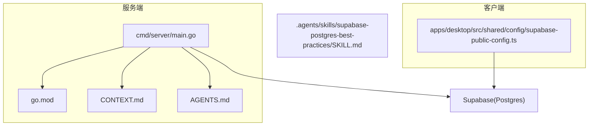
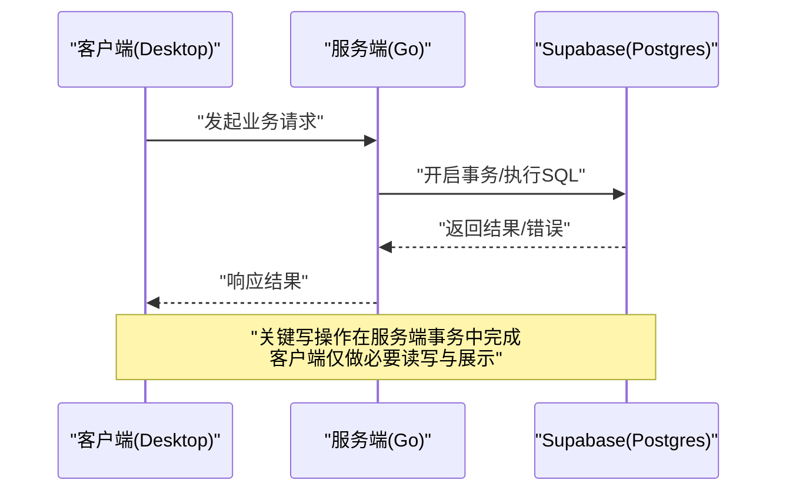
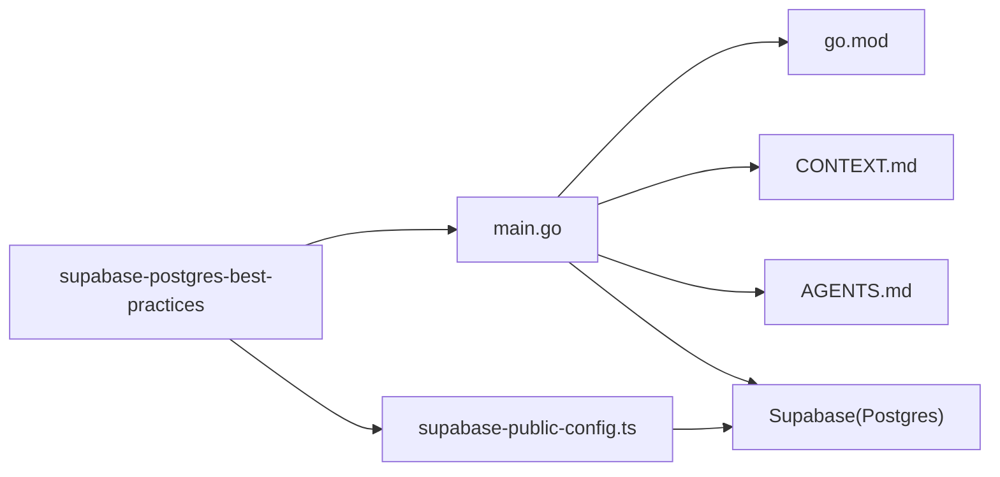

# 数据库层

<cite>
**本文引用的文件**   
- [server/main.go](file://server/cmd/server/main.go)
- [server/go.mod](file://server/go.mod)
- [server/CONTEXT.md](file://server/CONTEXT.md)
- [server/AGENTS.md](file://server/AGENTS.md)
- [apps/desktop/src/shared/config/supabase-public-config.ts](file://apps/desktop/src/shared/config/supabase-public-config.ts)
- [skills/supabase-postgres-best-practices/SKILL.md](file://.agents/skills/supabase-postgres-best-practices/SKILL.md)
</cite>

## 目录
1. [简介](#简介)
2. [项目结构](#项目结构)
3. [核心组件](#核心组件)
4. [架构总览](#架构总览)
5. [详细组件分析](#详细组件分析)
6. [依赖关系分析](#依赖关系分析)
7. [性能考虑](#性能考虑)
8. [故障排查指南](#故障排查指南)
9. [结论](#结论)
10. [附录](#附录)

## 简介
本文件为 nevix-ai 的数据库层文档，聚焦于连接管理、事务处理、查询优化、数据模型与索引策略、ORM 使用模式、迁移与备份恢复、性能调优、连接池配置、慢查询分析、安全与一致性保障以及高并发场景下的稳定性。当前仓库中后端服务以 Go 为主，前端桌面应用通过 Supabase SDK 访问云端 Postgres；同时仓库内包含 Supabase/PostgreSQL 最佳实践技能文档，可作为设计与优化的权威参考。

## 项目结构
- 服务端（Go）：位于 server 目录，入口为 cmd/server/main.go，模块定义在 go.mod，上下文与设计说明在 CONTEXT.md 与 AGENTS.md。
- 客户端（Electron/TypeScript）：位于 apps/desktop，共享配置中包含 Supabase 公开配置，用于前端直连 Supabase 服务。
- 技能文档：.agents/skills/supabase-postgres-best-practices 提供 PostgreSQL/Supabase 的最佳实践参考。

图表来源
- [server/cmd/server/main.go](file://server/cmd/server/main.go)
- [server/go.mod](file://server/go.mod)
- [server/CONTEXT.md](file://server/CONTEXT.md)
- [server/AGENTS.md](file://server/AGENTS.md)
- [apps/desktop/src/shared/config/supabase-public-config.ts](file://apps/desktop/src/shared/config/supabase-public-config.ts)
- [.agents/skills/supabase-postgres-best-practices/SKILL.md](file://.agents/skills/supabase-postgres-best-practices/SKILL.md)

章节来源
- [server/cmd/server/main.go](file://server/cmd/server/main.go)
- [server/go.mod](file://server/go.mod)
- [server/CONTEXT.md](file://server/CONTEXT.md)
- [server/AGENTS.md](file://server/AGENTS.md)
- [apps/desktop/src/shared/config/supabase-public-config.ts](file://apps/desktop/src/shared/config/supabase-public-config.ts)
- [.agents/skills/supabase-postgres-best-practices/SKILL.md](file://.agents/skills/supabase-postgres-best-practices/SKILL.md)

## 核心组件
- 数据库连接管理
  - 服务端应通过连接池管理数据库连接，设置最大连接数、空闲超时、连接生命周期等参数，避免连接泄漏与资源耗尽。
  - 客户端通过 Supabase SDK 建立连接，需合理配置超时与重试策略，确保网络抖动时的鲁棒性。
- 事务处理
  - 所有写操作应在事务边界内执行，保证原子性与一致性；长事务应避免，尽量缩短持有锁的时间。
- 查询优化
  - 基于业务热点构建复合索引与覆盖索引，避免 N+1 查询，使用分页与增量加载降低负载。
- ORM 使用模式
  - 统一封装 CRUD 与复杂查询，避免动态 SQL 注入风险；对批量操作采用批量插入/更新以提升吞吐。
- 数据迁移管理
  - 使用版本化迁移脚本，支持回滚与幂等执行；生产环境迁移前进行预演与灰度验证。
- 备份与恢复
  - 定期全量与增量备份，结合 PITR（按时间点恢复）能力；制定 RTO/RPO 目标并演练恢复流程。

章节来源
- [server/CONTEXT.md](file://server/CONTEXT.md)
- [server/AGENTS.md](file://server/AGENTS.md)
- [.agents/skills/supabase-postgres-best-practices/SKILL.md](file://.agents/skills/supabase-postgres-best-practices/SKILL.md)

## 架构总览
nevix-ai 的数据库访问由两条路径组成：
- 服务端（Go）直接连接 Supabase 托管的 Postgres，负责核心业务逻辑与数据一致性控制。
- 客户端（Electron/TS）通过 Supabase SDK 访问同一数据库，受限于权限策略与行级安全（RLS）。

图表来源
- [server/cmd/server/main.go](file://server/cmd/server/main.go)
- [apps/desktop/src/shared/config/supabase-public-config.ts](file://apps/desktop/src/shared/config/supabase-public-config.ts)

## 详细组件分析

### 连接管理与连接池
- 服务端连接池建议
  - 最大连接数：根据 CPU 核数与 I/O 能力估算，避免超过数据库最大连接限制。
  - 空闲超时：设置合理的 IdleTimeout，释放长期闲置连接。
  - 连接生命周期：设置 MaxLifetime 与 MaxLifetimeJitter，避免同时失效。
  - 健康检查：启用 PingBeforeGet 或等效机制，提前剔除不可用连接。
- 客户端连接策略
  - 超时与重试：为 HTTP/WS 请求设置超时与指数退避重试，避免雪崩。
  - 限流与背压：在高并发下对读多写少的接口实施限流与队列化。

章节来源
- [.agents/skills/supabase-postgres-best-practices/SKILL.md](file://.agents/skills/supabase-postgres-best-practices/SKILL.md)

### 事务与一致性
- 事务边界
  - 将相关写操作包裹在同一事务中，失败时整体回滚。
  - 避免跨服务调用与外部 IO 进入事务，减少锁持有时间。
- 隔离级别
  - 默认 Read Committed 即可满足多数场景；必要时使用 Repeatable Read 或 Serializable，但需谨慎评估死锁风险。
- 冲突处理
  - 使用乐观锁（版本号字段）或悲观锁（FOR UPDATE SKIP LOCKED）解决竞争写入。

章节来源
- [.agents/skills/supabase-postgres-best-practices/SKILL.md](file://.agents/skills/supabase-postgres-best-practices/SKILL.md)

### 查询优化与索引策略
- 索引设计
  - 主键索引：每个表必须定义主键。
  - 外键索引：为外键列建立索引，加速关联查询与约束检查。
  - 复合索引：按查询条件选择性排序，优先高频过滤列在前。
  - 部分索引：针对特定条件子集建立索引，减小体积提升命中率。
  - 覆盖索引：将常用 SELECT 列放入索引，避免回表。
- 查询模式
  - 避免 N+1：使用 JOIN 或批量查询替代循环查询。
  - 分页：使用游标或基于主键的分页，避免深分页。
  - 批量操作：使用批量插入/更新减少往返与锁竞争。
- 监控与分析
  - 启用 pg_stat_statements 收集慢查询，定期 EXPLAIN ANALYZE 分析执行计划。
  - 关注扫描行数、临时文件、锁等待与锁冲突。

章节来源
- [.agents/skills/supabase-postgres-best-practices/SKILL.md](file://.agents/skills/supabase-postgres-best-practices/SKILL.md)

### ORM 使用模式
- 统一抽象
  - 封装 Repository/DAO 层，屏蔽底层 SQL 差异，便于测试与替换实现。
- 安全与可维护性
  - 使用参数化查询，禁止拼接 SQL；对输入进行严格校验。
  - 对复杂查询使用原生 SQL 片段，保持可读性与可审计性。
- 性能
  - 批量操作使用批量接口；避免在循环中频繁提交事务。
  - 合理使用懒加载与预加载，减少不必要的数据传输。

章节来源
- [.agents/skills/supabase-postgres-best-practices/SKILL.md](file://.agents/skills/supabase-postgres-best-practices/SKILL.md)

### 数据迁移管理
- 版本化
  - 每次变更生成唯一编号的迁移脚本，确保顺序执行与幂等。
- 回滚与灰度
  - 提供反向迁移脚本；生产环境先灰度验证再全量发布。
- 自动化
  - 在 CI/CD 中集成迁移执行与校验，失败即阻断部署。

章节来源
- [.agents/skills/supabase-postgres-best-practices/SKILL.md](file://.agents/skills/supabase-postgres-best-practices/SKILL.md)

### 备份与恢复
- 策略
  - 全量备份（每日/每周）+ 增量备份（每小时），结合 WAL 归档实现 PITR。
- 演练
  - 定期演练恢复流程，验证 RTO/RPO 达标。
- 安全
  - 备份加密存储，最小权限访问，审计与告警。

章节来源
- [.agents/skills/supabase-postgres-best-practices/SKILL.md](file://.agents/skills/supabase-postgres-best-practices/SKILL.md)

### 安全与权限
- 最小权限
  - 应用账号仅授予必要权限，避免使用超级用户。
- 行级安全（RLS）
  - 在 Supabase 上启用 RLS，按租户/用户维度限制数据可见性。
- 审计
  - 记录敏感操作日志，追踪数据变更轨迹。

章节来源
- [.agents/skills/supabase-postgres-best-practices/SKILL.md](file://.agents/skills/supabase-postgres-best-practices/SKILL.md)

### 高并发与稳定性
- 连接与线程
  - 合理设置连接池大小与 goroutine 数量，避免过度并发导致抖动。
- 锁与死锁
  - 短事务、固定加锁顺序、避免长时间持有锁。
- 降级与熔断
  - 对非核心功能实施降级；对下游依赖增加熔断与超时保护。

章节来源
- [.agents/skills/supabase-postgres-best-practices/SKILL.md](file://.agents/skills/supabase-postgres-best-practices/SKILL.md)

## 依赖关系分析
- 服务端依赖
  - main.go 作为入口，初始化配置、路由与服务生命周期；数据库连接与事务由内部包管理。
  - go.mod 声明依赖版本，确保可重现构建。
- 客户端依赖
  - supabase-public-config.ts 提供 Supabase 公共配置，影响连接与鉴权行为。
- 最佳实践参考
  - supabase-postgres-best-practices 技能文档为数据库设计与优化提供权威指导。

图表来源
- [server/cmd/server/main.go](file://server/cmd/server/main.go)
- [server/go.mod](file://server/go.mod)
- [server/CONTEXT.md](file://server/CONTEXT.md)
- [server/AGENTS.md](file://server/AGENTS.md)
- [apps/desktop/src/shared/config/supabase-public-config.ts](file://apps/desktop/src/shared/config/supabase-public-config.ts)
- [.agents/skills/supabase-postgres-best-practices/SKILL.md](file://.agents/skills/supabase-postgres-best-practices/SKILL.md)

章节来源
- [server/cmd/server/main.go](file://server/cmd/server/main.go)
- [server/go.mod](file://server/go.mod)
- [apps/desktop/src/shared/config/supabase-public-config.ts](file://apps/desktop/src/shared/config/supabase-public-config.ts)
- [.agents/skills/supabase-postgres-best-practices/SKILL.md](file://.agents/skills/supabase-postgres-best-practices/SKILL.md)

## 性能考虑
- 连接池调优
  - 根据 QPS 与平均响应时间估算连接数；监控连接等待与复用率。
- 查询优化
  - 使用 EXPLAIN ANALYZE 定位瓶颈；添加合适索引，避免全表扫描。
- 批处理与分页
  - 批量写入减少往返；分页使用高效方式避免深分页。
- 缓存与只读副本
  - 热点数据引入缓存；读多写少场景使用只读副本分担压力。
- 监控与告警
  - 采集慢查询、锁等待、连接池指标；设置阈值告警。

章节来源
- [.agents/skills/supabase-postgres-best-practices/SKILL.md](file://.agents/skills/supabase-postgres-best-practices/SKILL.md)

## 故障排查指南
- 常见问题
  - 连接超时/拒绝：检查连接池上限、网络延迟、数据库最大连接数。
  - 慢查询：使用 pg_stat_statements 与 EXPLAIN ANALYZE 分析执行计划。
  - 死锁：缩短事务、固定加锁顺序、避免跨表长事务。
  - 内存溢出：检查大结果集与未关闭游标，限制单次查询规模。
- 诊断步骤
  - 查看数据库日志与监控面板；复现问题并捕获快照。
  - 逐步缩小范围，定位到具体 SQL 与调用链。
- 恢复策略
  - 利用备份与 PITR 快速恢复；必要时回滚迁移与代码版本。

章节来源
- [.agents/skills/supabase-postgres-best-practices/SKILL.md](file://.agents/skills/supabase-postgres-best-practices/SKILL.md)

## 结论
nevix-ai 的数据库层以 Supabase/Postgres 为核心，服务端通过 Go 实现连接与事务管理，客户端通过 Supabase SDK 访问数据。遵循最佳实践文档中的连接池、索引、事务、迁移、备份与安全策略，可在高并发场景下保持稳定与高性能。建议在持续交付中集成监控与演练，确保问题早发现、早恢复。

## 附录
- 术语
  - RTO：恢复时间目标；RPO：恢复点目标；PITR：按时间点恢复。
- 参考
  - Supabase/PostgreSQL 最佳实践技能文档为设计与优化提供权威依据。