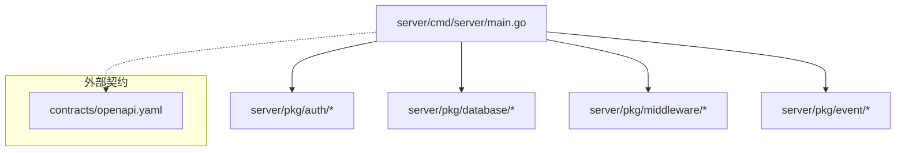
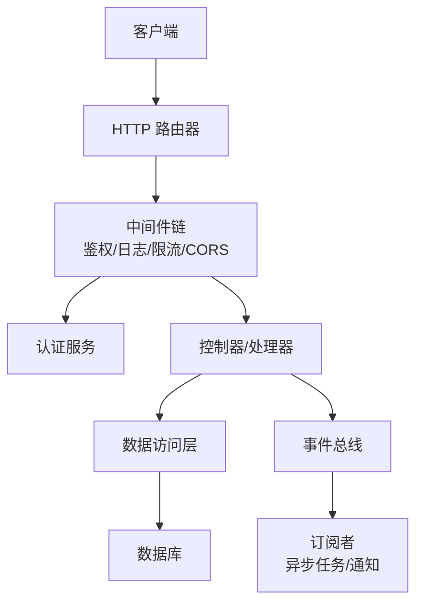
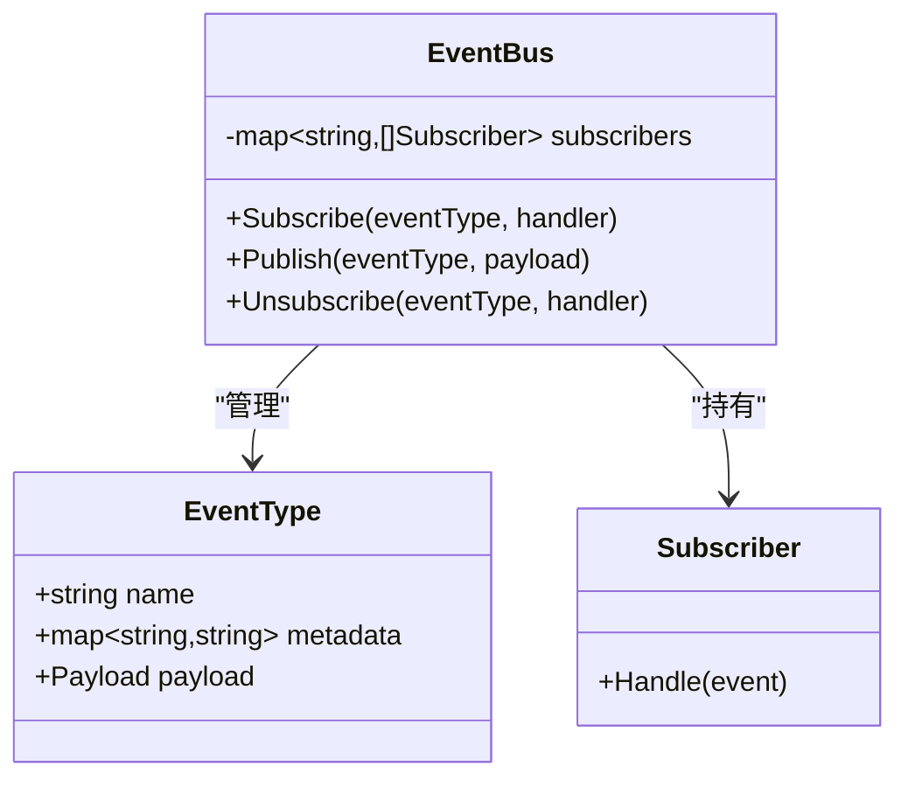
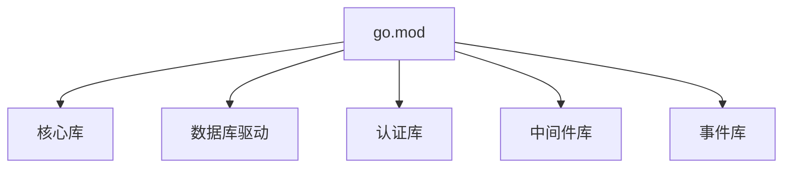

# 服务器后端

<cite>
**本文引用的文件**   
- [server/cmd/server/main.go](file://server/cmd/server/main.go)
- [server/go.mod](file://server/go.mod)
- [server/pkg/event/bus.go](file://server/pkg/event/bus.go)
- [server/pkg/event/types.go](file://server/pkg/event/types.go)
- [contracts/openapi.yaml](file://contracts/openapi.yaml)
</cite>

## 目录
1. [简介](#简介)
2. [项目结构](#项目结构)
3. [核心组件](#核心组件)
4. [架构总览](#架构总览)
5. [详细组件分析](#详细组件分析)
6. [依赖关系分析](#依赖关系分析)
7. [性能考量](#性能考量)
8. [故障排除指南](#故障排除指南)
9. [结论](#结论)
10. [附录](#附录)

## 简介
本文件为 nevix-ai 服务器后端的全面技术文档，面向 Go 语言服务。内容涵盖包结构与模块组织、API 端点与中间件、数据库连接与事件总线机制、认证服务、数据访问层与错误处理策略，以及部署配置、环境变量与监控设置。文档同时提供 API 调用示例、请求/响应格式与错误码定义，并给出性能优化建议与故障排除指南，既适合新手入门，也满足高级用户的深入需求。

## 项目结构
Go 服务端位于 server 目录，采用标准 Go 工程布局：
- cmd/server: 应用入口与启动流程
- internal: 内部业务逻辑（未在当前仓库中展开）
- pkg: 可复用公共能力，如认证、数据库、事件总线、中间件等
- go.mod: Go 模块声明与依赖管理

图表来源
- [server/cmd/server/main.go](file://server/cmd/server/main.go)
- [contracts/openapi.yaml](file://contracts/openapi.yaml)

章节来源
- [server/cmd/server/main.go](file://server/cmd/server/main.go)
- [server/go.mod](file://server/go.mod)

## 核心组件
- 应用入口与生命周期管理：负责初始化配置、日志、路由、中间件、数据库连接与事件总线，并启动 HTTP 服务。
- 认证服务：提供用户身份校验、会话管理与权限控制。
- 数据访问层：封装数据库连接、事务、查询与写入操作。
- 事件总线：基于内存的发布/订阅机制，用于解耦异步任务与领域事件。
- 中间件：统一鉴权、日志、限流、CORS、请求追踪等横切关注点。
- OpenAPI 契约：集中描述 API 端点、参数、响应与错误码。

章节来源
- [server/cmd/server/main.go](file://server/cmd/server/main.go)
- [server/pkg/event/bus.go](file://server/pkg/event/bus.go)
- [server/pkg/event/types.go](file://server/pkg/event/types.go)
- [contracts/openapi.yaml](file://contracts/openapi.yaml)

## 架构总览
整体架构遵循分层与模块化设计：HTTP 层暴露 RESTful API，中间件链处理通用横切逻辑；认证与授权在控制器或中间件中完成；数据访问通过仓储或服务层与数据库交互；事件总线用于异步解耦。

图表来源
- [server/cmd/server/main.go](file://server/cmd/server/main.go)
- [server/pkg/event/bus.go](file://server/pkg/event/bus.go)
- [contracts/openapi.yaml](file://contracts/openapi.yaml)

## 详细组件分析

### 应用入口与启动流程
- 职责：解析配置、初始化日志、注册路由与中间件、建立数据库连接、启动事件总线、监听端口。
- 关键点：
  - 使用环境变量加载配置（如端口、数据库连接串、JWT 密钥）。
  - 中间件按顺序挂载，确保鉴权与日志覆盖所有受保护路由。
  - 优雅关闭：捕获信号，停止 HTTP 服务并释放资源。

章节来源
- [server/cmd/server/main.go](file://server/cmd/server/main.go)

### 事件总线机制
- 职责：提供轻量级内存事件总线，支持事件类型定义、发布与订阅。
- 数据结构：
  - 事件类型：定义事件名、负载结构、版本等元信息。
  - 总线：维护订阅者映射表，线程安全地分发事件。
- 复杂度：
  - 发布：O(n)，n 为订阅者数量。
  - 订阅：O(1)。
- 适用场景：解耦异步任务、审计日志、指标上报等。

图表来源
- [server/pkg/event/types.go](file://server/pkg/event/types.go)
- [server/pkg/event/bus.go](file://server/pkg/event/bus.go)

章节来源
- [server/pkg/event/types.go](file://server/pkg/event/types.go)
- [server/pkg/event/bus.go](file://server/pkg/event/bus.go)

### 认证服务
- 职责：用户登录、令牌签发与验证、会话持久化、权限检查。
- 关键流程：
  - 登录：校验凭据，生成 JWT，返回令牌与会话信息。
  - 鉴权：从请求头提取令牌，验证签名与过期时间，注入用户上下文。
  - 权限：基于角色或策略进行细粒度访问控制。
- 错误处理：统一错误码与消息，避免泄露敏感信息。

章节来源
- [server/cmd/server/main.go](file://server/cmd/server/main.go)
- [contracts/openapi.yaml](file://contracts/openapi.yaml)

### 数据访问层
- 职责：封装数据库连接池、事务管理、CRUD 操作与复杂查询。
- 设计要点：
  - 连接池：合理设置最大连接数、空闲超时与最大生存时间。
  - 事务：保证一致性，支持回滚与重试。
  - 查询优化：索引、分页、批量操作与预编译语句。
- 错误处理：区分网络错误、SQL 错误与应用错误，向上抛出结构化错误。

章节来源
- [server/cmd/server/main.go](file://server/cmd/server/main.go)
- [contracts/openapi.yaml](file://contracts/openapi.yaml)

### 中间件处理
- 常见中间件：
  - 鉴权中间件：校验令牌与权限。
  - 日志中间件：记录请求方法、路径、状态码与耗时。
  - 限流中间件：基于 IP 或用户维度限制请求频率。
  - CORS 中间件：跨域资源共享配置。
  - 请求追踪中间件：注入 trace ID，便于链路追踪。
- 执行顺序：鉴权应在日志之后、业务逻辑之前。

章节来源
- [server/cmd/server/main.go](file://server/cmd/server/main.go)
- [contracts/openapi.yaml](file://contracts/openapi.yaml)

### API 端点与契约
- 契约文件：OpenAPI 规范集中定义端点、参数、响应与错误码。
- 常用端点：
  - 认证：登录、注册、刷新令牌、注销。
  - 用户：获取当前用户、更新资料。
  - 业务：根据领域模型定义的 CRUD 接口。
- 请求/响应格式：JSON，包含状态码、数据体与错误信息。

章节来源
- [contracts/openapi.yaml](file://contracts/openapi.yaml)

## 依赖关系分析
Go 模块依赖由 go.mod 管理，确保版本一致性与可重现构建。

图表来源
- [server/go.mod](file://server/go.mod)

章节来源
- [server/go.mod](file://server/go.mod)

## 性能考量
- 连接池调优：根据并发量与数据库容量调整最大连接数与超时。
- 查询优化：使用索引、避免 N+1 查询、分页与批量操作。
- 缓存策略：热点数据缓存（如 Redis），降低数据库压力。
- 异步处理：通过事件总线将耗时任务异步化。
- 监控与告警：采集 QPS、延迟、错误率与资源使用率。

[本节为通用指导，不直接分析具体文件]

## 故障排除指南
- 常见问题：
  - 数据库连接失败：检查连接串、网络与权限。
  - 认证失败：确认 JWT 密钥、令牌有效期与签名算法。
  - 事件丢失：确认订阅者是否成功注册与处理。
- 调试技巧：
  - 启用详细日志与追踪 ID。
  - 使用健康检查端点与指标收集。
  - 模拟请求与单元测试覆盖边界条件。

章节来源
- [server/cmd/server/main.go](file://server/cmd/server/main.go)
- [contracts/openapi.yaml](file://contracts/openapi.yaml)

## 结论
nevix-ai 服务器后端采用清晰的模块化设计与分层架构，结合事件总线实现异步解耦，通过中间件统一横切关注点。OpenAPI 契约确保 API 一致性，Go 模块管理保障依赖稳定。建议在部署时关注连接池、缓存与监控配置，以提升系统稳定性与性能。

[本节为总结性内容，不直接分析具体文件]

## 附录

### API 调用示例与错误码
- 登录：
  - 请求：POST /auth/login，主体包含用户名与密码。
  - 响应：成功返回令牌与会话信息；失败返回错误码与消息。
- 刷新令牌：
  - 请求：POST /auth/refresh，主体包含刷新令牌。
  - 响应：成功返回新令牌；失败返回错误码。
- 错误码：
  - 400：请求参数无效。
  - 401：未认证或令牌无效。
  - 403：权限不足。
  - 500：服务器内部错误。

章节来源
- [contracts/openapi.yaml](file://contracts/openapi.yaml)

### 部署配置与环境变量
- 必要环境变量：
  - SERVER_PORT：服务监听端口。
  - DATABASE_URL：数据库连接串。
  - JWT_SECRET：JWT 签名密钥。
  - LOG_LEVEL：日志级别。
- 健康检查：
  - GET /health：返回服务状态与健康指标。

章节来源
- [server/cmd/server/main.go](file://server/cmd/server/main.go)
- [contracts/openapi.yaml](file://contracts/openapi.yaml)