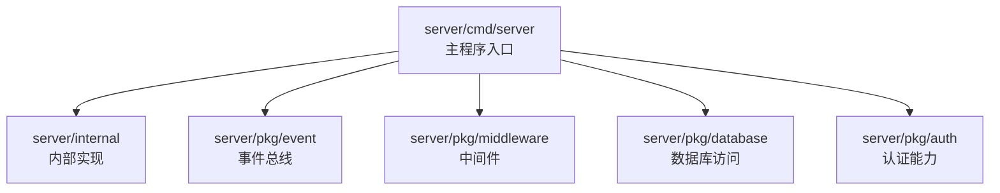
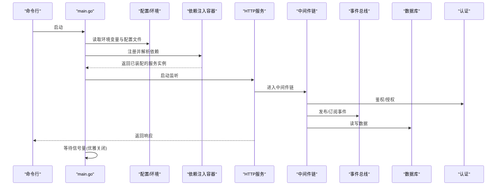
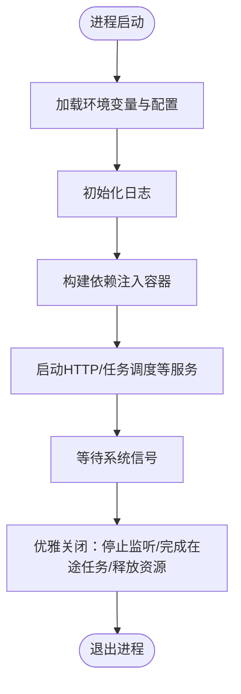
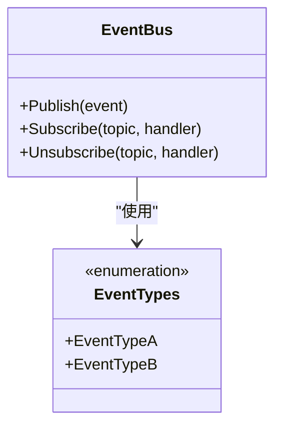
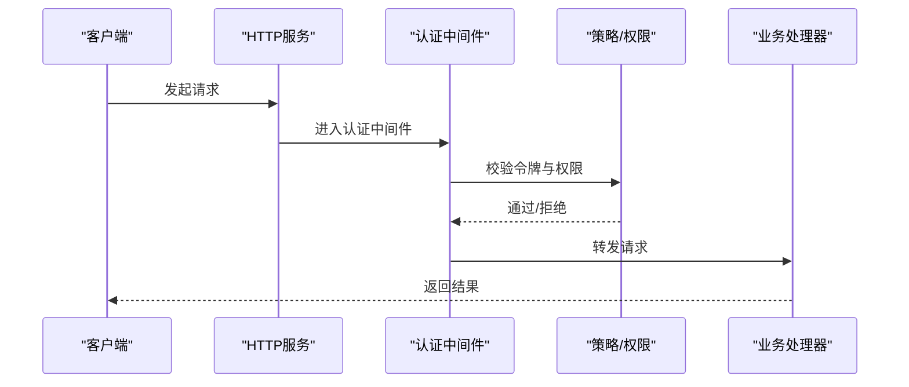
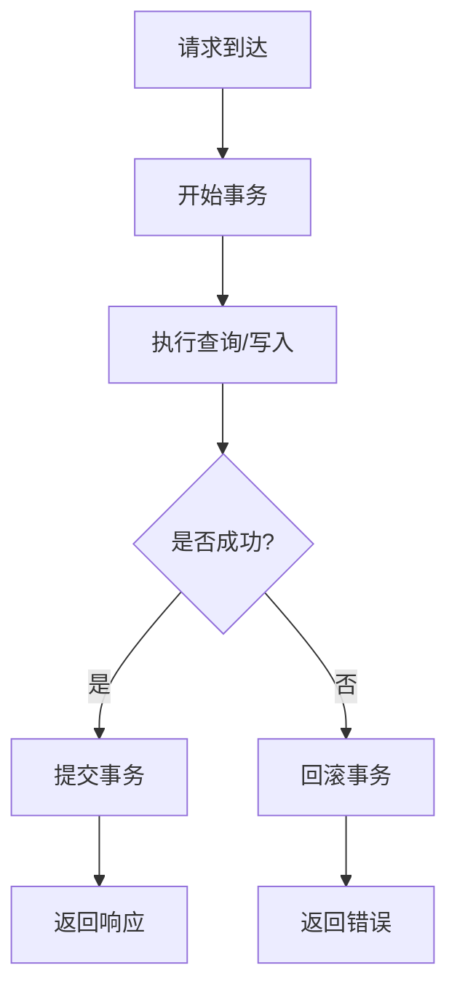
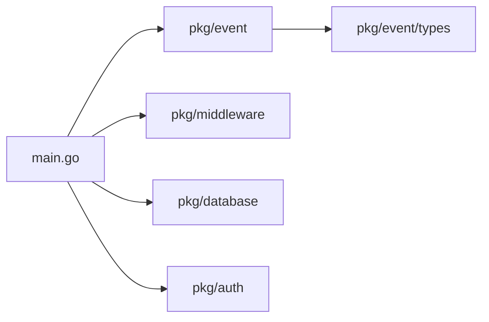

# 服务器架构

<cite>
**本文引用的文件**   
- [server/cmd/server/main.go](file://server/cmd/server/main.go)
- [server/go.mod](file://server/go.mod)
- [server/pkg/event/bus.go](file://server/pkg/event/bus.go)
- [server/pkg/event/types.go](file://server/pkg/event/types.go)
- [Makefile](file://Makefile)
- [go.work](file://go.work)
- [CONTEXT-MAP.md](file://CONTEXT-MAP.md)
</cite>

## 目录
1. [简介](#简介)
2. [项目结构](#项目结构)
3. [核心组件](#核心组件)
4. [架构总览](#架构总览)
5. [详细组件分析](#详细组件分析)
6. [依赖分析](#依赖分析)
7. [性能考虑](#性能考虑)
8. [故障排查指南](#故障排查指南)
9. [结论](#结论)
10. [附录](#附录)

## 简介
本文件为 nevix-ai 的 Go 语言服务端架构文档，面向新手与高级开发者。内容涵盖：
- 主程序入口、模块初始化、依赖注入与生命周期管理
- 包分层策略与代码组织原则
- 技术栈选择、第三方库集成与版本兼容性
- 部署配置、环境变量与服务启动流程
- 架构图表与组件交互说明，帮助理解系统边界与数据流向

## 项目结构
Go 服务位于 server 目录下，采用标准 Go 工程布局：
- cmd/server：可执行程序入口
- internal：内部实现（未展开）
- pkg：对外暴露的可复用能力（事件总线、中间件、数据库、认证等）

图表来源
- [server/cmd/server/main.go:1-200](file://server/cmd/server/main.go#L1-L200)

章节来源
- [server/cmd/server/main.go:1-200](file://server/cmd/server/main.go#L1-L200)

## 核心组件
- 主程序入口：负责解析配置、初始化日志、加载模块、构建依赖图、启动 HTTP/其他服务、优雅关闭。
- 事件总线：提供进程内事件发布/订阅机制，用于解耦模块间通信。
- 中间件层：统一处理请求生命周期（鉴权、限流、日志、追踪）。
- 数据库层：封装连接池、迁移、事务与查询抽象。
- 认证层：提供会话、令牌、权限校验等能力。

章节来源
- [server/cmd/server/main.go:1-200](file://server/cmd/server/main.go#L1-L200)
- [server/pkg/event/bus.go:1-200](file://server/pkg/event/bus.go#L1-L200)
- [server/pkg/event/types.go:1-200](file://server/pkg/event/types.go#L1-L200)

## 架构总览
下图展示服务启动与请求处理的关键路径：从命令行参数与环境变量到依赖注入、HTTP 服务启动、中间件链、业务处理器与事件总线。

图表来源
- [server/cmd/server/main.go:1-200](file://server/cmd/server/main.go#L1-L200)
- [server/pkg/event/bus.go:1-200](file://server/pkg/event/bus.go#L1-L200)

## 详细组件分析

### 主程序入口与生命周期管理
- 职责
  - 解析命令行参数与环境变量
  - 初始化日志、配置、健康检查
  - 构建依赖图（依赖注入）
  - 启动 HTTP/GRPC/任务调度等服务
  - 捕获系统信号，执行优雅关闭
- 关键流程
  - 启动阶段：配置加载 → 依赖装配 → 服务启动
  - 运行阶段：请求处理 → 事件分发 → 资源使用监控
  - 关闭阶段：停止接收新请求 → 完成在途任务 → 释放资源

图表来源
- [server/cmd/server/main.go:1-200](file://server/cmd/server/main.go#L1-L200)

章节来源
- [server/cmd/server/main.go:1-200](file://server/cmd/server/main.go#L1-L200)

### 事件总线（进程内消息通道）
- 设计要点
  - 类型安全的事件定义
  - 发布/订阅接口，支持异步处理
  - 错误隔离与重试策略
- 典型用法
  - 控制器/服务在处理完成后发布领域事件
  - 后台消费者消费事件，触发副作用（通知、索引更新等）

图表来源
- [server/pkg/event/bus.go:1-200](file://server/pkg/event/bus.go#L1-L200)
- [server/pkg/event/types.go:1-200](file://server/pkg/event/types.go#L1-L200)

章节来源
- [server/pkg/event/bus.go:1-200](file://server/pkg/event/bus.go#L1-L200)
- [server/pkg/event/types.go:1-200](file://server/pkg/event/types.go#L1-L200)

### 中间件与认证
- 中间件链
  - 统一日志、追踪、指标上报
  - 鉴权、限流、CORS、请求体大小限制
- 认证流程
  - 校验令牌/会话
  - 基于角色的访问控制（RBAC）
  - 敏感操作二次确认或审计记录

图表来源
- [server/cmd/server/main.go:1-200](file://server/cmd/server/main.go#L1-L200)

章节来源
- [server/cmd/server/main.go:1-200](file://server/cmd/server/main.go#L1-L200)

### 数据库访问与事务
- 连接池与超时
  - 合理设置最大连接数、空闲连接、超时时间
- 事务与一致性
  - 明确事务边界，避免长事务
  - 失败回滚与幂等性保障
- 查询优化
  - 索引设计与覆盖索引
  - 分页与批量写入

图表来源
- [server/cmd/server/main.go:1-200](file://server/cmd/server/main.go#L1-L200)

章节来源
- [server/cmd/server/main.go:1-200](file://server/cmd/server/main.go#L1-L200)

## 依赖分析
- 模块耦合
  - main 作为装配中心，低耦合地组合各子系统
  - 事件总线作为横向解耦手段，降低直接调用
- 外部依赖
  - 通过 go.mod 声明版本约束，确保可重现构建
  - 建议锁定依赖版本，定期安全扫描

图表来源
- [server/cmd/server/main.go:1-200](file://server/cmd/server/main.go#L1-L200)
- [server/go.mod:1-200](file://server/go.mod#L1-L200)

章节来源
- [server/go.mod:1-200](file://server/go.mod#L1-L200)
- [go.work:1-200](file://go.work#L1-L200)

## 性能考虑
- 并发模型
  - 使用 goroutine 池与上下文取消控制并发
  - 避免阻塞 I/O 在热路径上
- 缓存与降级
  - 热点数据本地缓存（注意一致性）
  - 依赖服务不可用时的快速失败与降级
- 资源治理
  - 连接池上限、超时、重试退避
  - 监控与告警：CPU、内存、GC、慢查询

## 故障排查指南
- 常见问题定位
  - 启动失败：检查环境变量、端口占用、证书与密钥
  - 认证失败：核对令牌签发方、过期时间、签名算法
  - 数据库异常：查看连接池、慢查询、锁等待
  - 事件积压：检查消费者吞吐与重试策略
- 诊断手段
  - 结构化日志与链路追踪
  - 健康检查端点与就绪探针
  - 压测与基准测试

## 结论
本架构以清晰的入口与依赖注入为核心，结合事件总线与中间件链，形成高内聚、低耦合的服务体系。通过合理的生命周期管理与资源治理，可在保证稳定性的同时获得良好的扩展性与可观测性。

## 附录

### 部署与环境变量
- 环境变量建议
  - 服务端口、日志级别、数据库连接串、JWT 密钥、外部服务地址
- 构建与运行
  - 使用 Makefile 进行构建、测试与打包
  - 使用 go.work 管理多模块工作区

章节来源
- [Makefile:1-200](file://Makefile#L1-L200)
- [go.work:1-200](file://go.work#L1-L200)

### 技术栈与版本兼容性
- Go 版本与模块管理
  - 通过 go.mod 锁定依赖版本，确保可重现构建
- 运行时与平台
  - 支持 Linux/macOS/Windows 主流发行版
- 第三方库
  - 优先选择活跃维护、社区成熟的库
  - 定期升级与安全扫描

章节来源
- [server/go.mod:1-200](file://server/go.mod#L1-L200)

### 启动流程与命令
- 常用命令
  - 构建、运行、测试、格式化、静态检查
- 启动参数
  - 配置文件路径、端口、调试开关

章节来源
- [Makefile:1-200](file://Makefile#L1-L200)

### 架构与设计参考
- 架构决策与分层
  - 垂直切片与领域驱动的分层思想
  - 复杂度驱动的模块划分

章节来源
- [CONTEXT-MAP.md:1-200](file://CONTEXT-MAP.md#L1-L200)