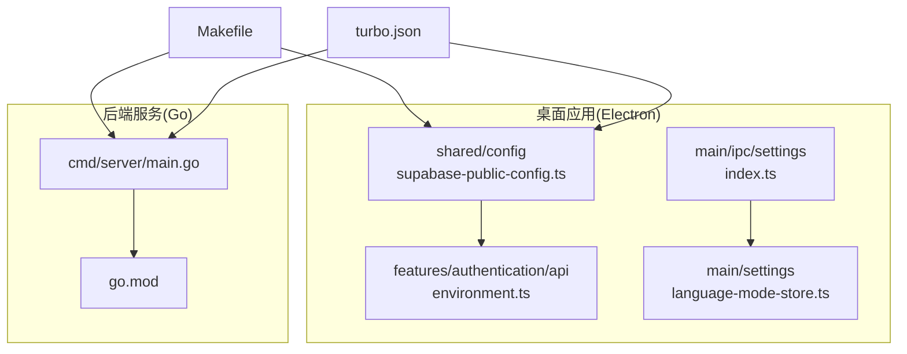
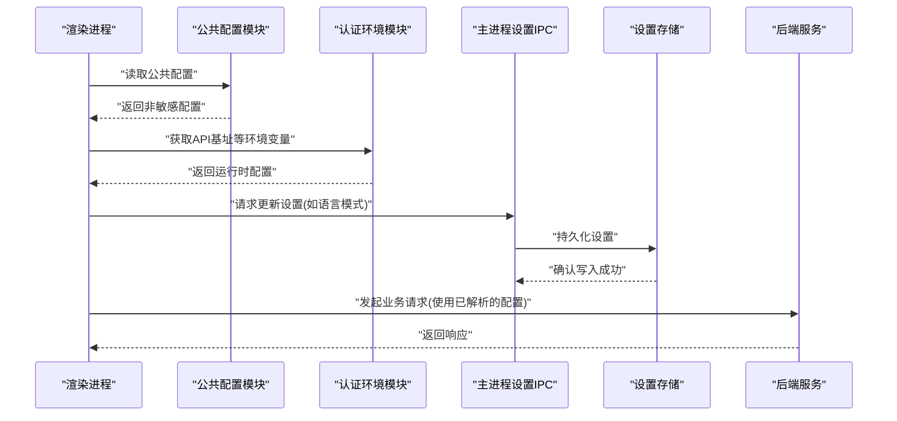
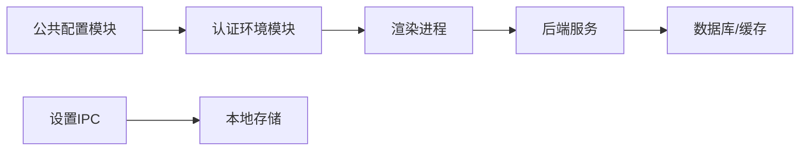

# 配置管理

<cite>
**本文档引用的文件**   
- [apps/desktop/src/shared/config/supabase-public-config.ts](file://apps/desktop/src/shared/config/supabase-public-config.ts)
- [apps/desktop/src/features/authentication/api/environment.ts](file://apps/desktop/src/features/authentication/api/environment.ts)
- [apps/desktop/src/main/ipc/settings/index.ts](file://apps/desktop/src/main/ipc/settings/index.ts)
- [apps/desktop/src/main/settings/language-mode-store.ts](file://apps/desktop/src/main/settings/language-mode-store.ts)
- [apps/desktop/tests/auth/configuration.spec.ts](file://apps/desktop/tests/auth/configuration.spec.ts)
- [server/cmd/server/main.go](file://server/cmd/server/main.go)
- [server/go.mod](file://server/go.mod)
- [Makefile](file://Makefile)
- [turbo.json](file://turbo.json)
</cite>

## 目录
1. [简介](#简介)
2. [项目结构](#项目结构)
3. [核心组件](#核心组件)
4. [架构总览](#架构总览)
5. [详细组件分析](#详细组件分析)
6. [依赖分析](#依赖分析)
7. [性能考虑](#性能考虑)
8. [故障排查指南](#故障排查指南)
9. [结论](#结论)
10. [附录](#附录)

## 简介
本文件面向 nevix-ai 项目的配置管理，聚焦以下目标：
- 解释配置文件组织结构与环境变量映射关系
- 说明默认值设置与不同环境（开发、测试、生产）的差异
- 记录敏感信息管理、密钥轮换与安全存储方案
- 描述配置验证、热重载与故障恢复策略
- 提供最佳实践、版本控制与迁移指南
- 确保配置的灵活性与安全性，支持多租户与多云部署场景

## 项目结构
nevix-ai 采用前后端分离的 monorepo 结构。前端基于 Electron + Vite，后端为 Go 服务。配置相关的关键位置包括：
- 前端共享配置：用于暴露给渲染进程的非敏感公共配置
- 前端认证环境：用于加载 API 基础地址等运行时环境变量
- 主进程 IPC 设置：用于持久化用户偏好（如语言模式）
- 后端入口：Go 服务启动与初始化逻辑
- 构建与任务编排：Makefile 与 turbo 工作区脚本

图表来源
- [apps/desktop/src/shared/config/supabase-public-config.ts](file://apps/desktop/src/shared/config/supabase-public-config.ts)
- [apps/desktop/src/features/authentication/api/environment.ts](file://apps/desktop/src/features/authentication/api/environment.ts)
- [apps/desktop/src/main/ipc/settings/index.ts](file://apps/desktop/src/main/ipc/settings/index.ts)
- [apps/desktop/src/main/settings/language-mode-store.ts](file://apps/desktop/src/main/settings/language-mode-store.ts)
- [server/cmd/server/main.go](file://server/cmd/server/main.go)
- [server/go.mod](file://server/go.mod)
- [Makefile](file://Makefile)
- [turbo.json](file://turbo.json)

章节来源
- [apps/desktop/src/shared/config/supabase-public-config.ts](file://apps/desktop/src/shared/config/supabase-public-config.ts)
- [apps/desktop/src/features/authentication/api/environment.ts](file://apps/desktop/src/features/authentication/api/environment.ts)
- [apps/desktop/src/main/ipc/settings/index.ts](file://apps/desktop/src/main/ipc/settings/index.ts)
- [apps/desktop/src/main/settings/language-mode-store.ts](file://apps/desktop/src/main/settings/language-mode-store.ts)
- [server/cmd/server/main.go](file://server/cmd/server/main.go)
- [server/go.mod](file://server/go.mod)
- [Makefile](file://Makefile)
- [turbo.json](file://turbo.json)

## 核心组件
- 公共配置模块：对外暴露非敏感配置项，供渲染进程安全读取
- 认证环境模块：从运行环境变量中解析 API 基址等必要参数
- 设置持久化模块：通过 IPC 读写用户设置（如语言模式），并持久化到本地
- 后端服务入口：负责加载服务端配置、初始化依赖与启动服务

章节来源
- [apps/desktop/src/shared/config/supabase-public-config.ts](file://apps/desktop/src/shared/config/supabase-public-config.ts)
- [apps/desktop/src/features/authentication/api/environment.ts](file://apps/desktop/src/features/authentication/api/environment.ts)
- [apps/desktop/src/main/ipc/settings/index.ts](file://apps/desktop/src/main/ipc/settings/index.ts)
- [apps/desktop/src/main/settings/language-mode-store.ts](file://apps/desktop/src/main/settings/language-mode-store.ts)
- [server/cmd/server/main.go](file://server/cmd/server/main.go)

## 架构总览
下图展示了配置在 Electron 主进程、渲染进程与后端之间的交互流程。公共配置仅暴露非敏感字段；认证所需的环境变量由构建或运行期注入；设置变更通过 IPC 通道在主进程中持久化。

图表来源
- [apps/desktop/src/shared/config/supabase-public-config.ts](file://apps/desktop/src/shared/config/supabase-public-config.ts)
- [apps/desktop/src/features/authentication/api/environment.ts](file://apps/desktop/src/features/authentication/api/environment.ts)
- [apps/desktop/src/main/ipc/settings/index.ts](file://apps/desktop/src/main/ipc/settings/index.ts)
- [apps/desktop/src/main/settings/language-mode-store.ts](file://apps/desktop/src/main/settings/language-mode-store.ts)
- [server/cmd/server/main.go](file://server/cmd/server/main.go)

## 详细组件分析

### 公共配置模块（Supabase 公共配置）
- 职责：集中定义并导出对渲染进程安全的公共配置项（例如 Supabase 公开端点、功能开关等）
- 设计要点：
  - 仅暴露非敏感信息，避免将密钥泄露至前端
  - 提供明确的类型定义，便于 IDE 提示与静态检查
  - 与构建系统配合，在不同环境下输出不同的默认值
- 建议扩展：
  - 增加配置校验函数，确保关键键存在且格式正确
  - 为每个配置项添加注释说明用途与取值范围

章节来源
- [apps/desktop/src/shared/config/supabase-public-config.ts](file://apps/desktop/src/shared/config/supabase-public-config.ts)

### 认证环境模块（API 环境变量）
- 职责：从运行环境变量中解析认证相关的配置（如 API Base URL、超时、重试策略等）
- 设计要点：
  - 严格区分“构建时”和“运行期”变量，避免硬编码
  - 提供默认值与回退逻辑，保证在缺失变量时的可运行性
  - 对输入进行基本校验（如 URL 合法性）
- 建议扩展：
  - 引入环境变量 schema 校验（如 zod/yup）
  - 支持按环境前缀隔离（如 DEV_/TEST_/PROD_）

章节来源
- [apps/desktop/src/features/authentication/api/environment.ts](file://apps/desktop/src/features/authentication/api/environment.ts)

### 设置持久化模块（IPC 与本地存储）
- 职责：通过 IPC 通道接收渲染进程的设置变更请求，并在主进程中持久化（如语言模式）
- 设计要点：
  - 明确 IPC 通道命名与消息契约
  - 读写操作需具备幂等性与错误处理
  - 存储路径与权限需符合平台安全规范
- 建议扩展：
  - 增加设置版本与迁移逻辑
  - 提供只读接口供渲染进程同步最新设置

章节来源
- [apps/desktop/src/main/ipc/settings/index.ts](file://apps/desktop/src/main/ipc/settings/index.ts)
- [apps/desktop/src/main/settings/language-mode-store.ts](file://apps/desktop/src/main/settings/language-mode-store.ts)

### 后端服务入口（Go 服务）
- 职责：加载服务端配置、初始化数据库/缓存/中间件，并启动 HTTP/gRPC 服务
- 设计要点：
  - 通过环境变量或配置文件加载服务端口、数据库连接串、日志级别等
  - 启动前执行配置校验与健康检查
  - 支持优雅关闭与信号处理
- 建议扩展：
  - 引入配置热重载（监听文件变化或远程配置中心）
  - 实现多租户配置隔离（按租户维度加载配置）

章节来源
- [server/cmd/server/main.go](file://server/cmd/server/main.go)
- [server/go.mod](file://server/go.mod)

### 构建与任务编排（Makefile 与 Turbo）
- 职责：统一构建、测试、打包流程，协调多包依赖
- 设计要点：
  - Makefile 封装常用命令（build/test/lint/pack）
  - turbo.json 定义任务图与缓存策略
- 建议扩展：
  - 在 CI 中注入环境变量，生成不同环境的产物
  - 使用环境变量模板（env.example）约束必需变量

章节来源
- [Makefile](file://Makefile)
- [turbo.json](file://turbo.json)

## 依赖分析
- 前端内部依赖：
  - 公共配置模块被认证环境模块与 UI 层引用
  - IPC 设置模块依赖本地存储实现
- 前后端耦合点：
  - 认证环境模块解析出的 API 基址决定后端调用地址
  - 后端服务通过环境变量或配置中心提供能力边界
- 外部依赖：
  - Supabase SDK（前端）
  - Go 标准库与第三方库（后端）

图表来源
- [apps/desktop/src/shared/config/supabase-public-config.ts](file://apps/desktop/src/shared/config/supabase-public-config.ts)
- [apps/desktop/src/features/authentication/api/environment.ts](file://apps/desktop/src/features/authentication/api/environment.ts)
- [apps/desktop/src/main/ipc/settings/index.ts](file://apps/desktop/src/main/ipc/settings/index.ts)
- [apps/desktop/src/main/settings/language-mode-store.ts](file://apps/desktop/src/main/settings/language-mode-store.ts)
- [server/cmd/server/main.go](file://server/cmd/server/main.go)

章节来源
- [apps/desktop/src/shared/config/supabase-public-config.ts](file://apps/desktop/src/shared/config/supabase-public-config.ts)
- [apps/desktop/src/features/authentication/api/environment.ts](file://apps/desktop/src/features/authentication/api/environment.ts)
- [apps/desktop/src/main/ipc/settings/index.ts](file://apps/desktop/src/main/ipc/settings/index.ts)
- [apps/desktop/src/main/settings/language-mode-store.ts](file://apps/desktop/src/main/settings/language-mode-store.ts)
- [server/cmd/server/main.go](file://server/cmd/server/main.go)

## 性能考虑
- 配置加载：
  - 前端公共配置应在应用启动时一次性加载并缓存
  - 后端配置建议在进程启动时加载，避免重复 I/O
- 网络请求：
  - 认证环境中的 API 基址应复用连接池，减少握手开销
- 存储读写：
  - 设置持久化应批量写入，避免频繁磁盘操作
- 监控与度量：
  - 记录配置加载耗时与失败率，便于定位瓶颈

[本节为通用指导，不直接分析具体文件]

## 故障排查指南
- 常见问题：
  - 环境变量缺失导致认证失败：检查运行环境是否注入必要变量
  - 公共配置未更新：确认构建阶段是否正确替换占位符
  - 设置持久化失败：检查文件权限与磁盘空间
  - 后端启动失败：核对端口占用、数据库连接串与日志级别
- 诊断步骤：
  - 打印配置快照（脱敏后）
  - 启用调试日志与链路追踪
  - 使用健康检查端点验证服务状态
- 恢复策略：
  - 提供回滚机制（配置版本化）
  - 实现降级模式（使用默认配置继续运行）

章节来源
- [apps/desktop/tests/auth/configuration.spec.ts](file://apps/desktop/tests/auth/configuration.spec.ts)

## 结论
nevix-ai 的配置管理遵循“最小暴露、严格校验、分层隔离”的原则。前端通过公共配置与环境变量解耦敏感信息，后端通过启动时加载与校验保障稳定性。结合构建与任务编排，可实现多环境差异化部署。后续建议引入配置中心与热重载机制，进一步提升灵活性与可运维性。

[本节为总结性内容，不直接分析具体文件]

## 附录

### 环境变量映射与默认值
- 前端认证环境：
  - API_BASE_URL：必填，无默认值（构建或运行期注入）
  - TIMEOUT_MS：可选，建议默认值（如 10000）
  - RETRY_COUNT：可选，建议默认值（如 3）
- 后端服务：
  - PORT：必填，默认 8080
  - DB_CONN_STR：必填，无默认值
  - LOG_LEVEL：可选，默认 info
- 注意：所有敏感变量不得提交至代码仓库，应通过 CI/CD 注入

### 敏感信息管理
- 密钥轮换：
  - 支持双密钥并行期，逐步切换旧密钥
  - 记录轮换审计日志
- 安全存储：
  - 前端：避免存储密钥，仅使用令牌与短期凭证
  - 后端：使用加密存储或密钥管理服务（KMS）
- 访问控制：
  - 最小权限原则，按需授权
  - 定期审计与清理过期凭据

### 配置验证、热重载与故障恢复
- 验证：
  - 启动前执行 schema 校验，失败则快速失败
- 热重载：
  - 监听配置文件变化，动态刷新内存配置
  - 对关键配置（如数据库连接）采用滚动更新
- 故障恢复：
  - 配置加载失败时使用安全默认值
  - 提供降级与熔断机制

### 多租户与多云部署
- 多租户：
  - 按租户维度加载配置（租户ID作为键）
  - 支持租户级功能开关与配额限制
- 多云：
  - 抽象云厂商配置（如对象存储、KV 存储）
  - 通过配置中心统一管理区域与端点

### 版本控制与迁移指南
- 版本化：
  - 配置项增加版本号，兼容旧客户端
  - 废弃字段标记 deprecated，保留过渡期
- 迁移：
  - 提供迁移脚本与回滚方案
  - 在 CI 中执行配置兼容性测试