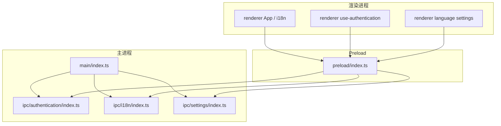
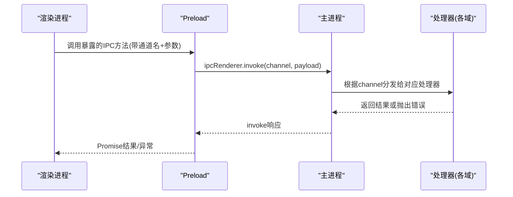
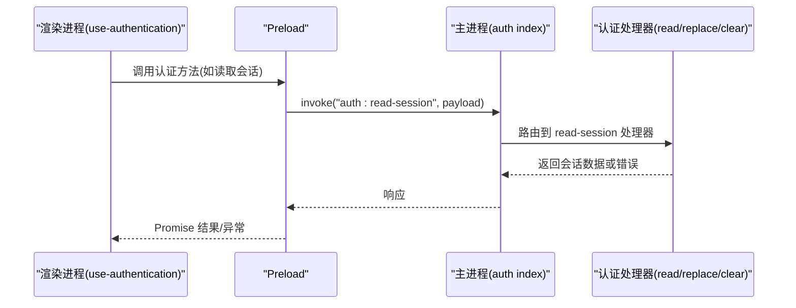
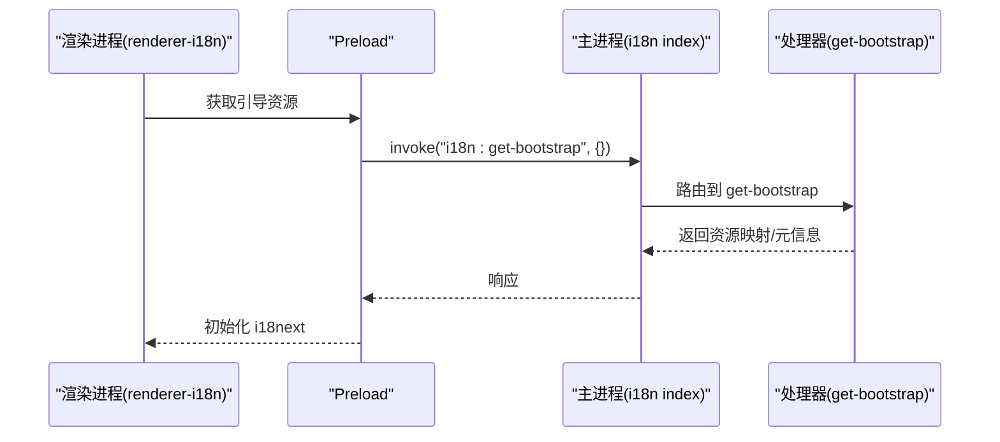
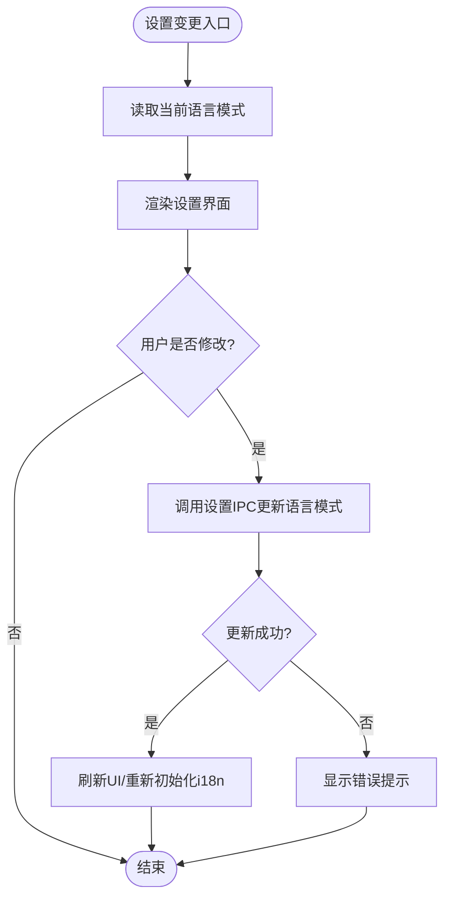
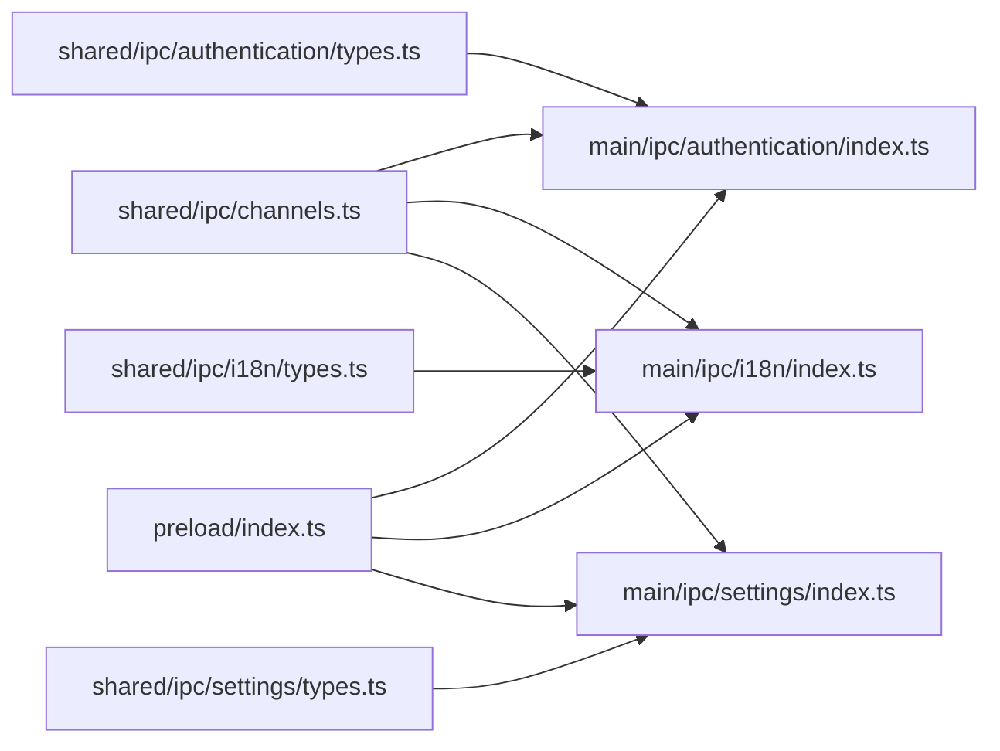

# IPC通信机制

<cite>
**本文引用的文件**   
- [apps/desktop/src/main/index.ts](file://apps/desktop/src/main/index.ts)
- [apps/desktop/src/main/ipc/authentication/index.ts](file://apps/desktop/src/main/ipc/authentication/index.ts)
- [apps/desktop/src/main/ipc/authentication/clear-session.ts](file://apps/desktop/src/main/ipc/authentication/clear-session.ts)
- [apps/desktop/src/main/ipc/authentication/read-session.ts](file://apps/desktop/src/main/ipc/authentication/read-session.ts)
- [apps/desktop/src/main/ipc/authentication/replace-session.ts](file://apps/desktop/src/main/ipc/authentication/replace-session.ts)
- [apps/desktop/src/main/ipc/authentication/handlers/index.ts](file://apps/desktop/src/main/ipc/authentication/handlers/index.ts)
- [apps/desktop/src/main/ipc/authentication/trusted-sender.ts](file://apps/desktop/src/main/ipc/authentication/trusted-sender.ts)
- [apps/desktop/src/main/ipc/i18n/index.ts](file://apps/desktop/src/main/ipc/i18n/index.ts)
- [apps/desktop/src/main/ipc/i18n/handlers/get-bootstrap.ts](file://apps/desktop/src/main/ipc/i18n/handlers/get-bootstrap.ts)
- [apps/desktop/src/main/ipc/settings/index.ts](file://apps/desktop/src/main/ipc/settings/index.ts)
- [apps/desktop/src/main/ipc/settings/handlers/get-language-mode.ts](file://apps/desktop/src/main/ipc/settings/handlers/get-language模式.ts)
- [apps/desktop/src/main/ipc/settings/handlers/set-language-mode.ts](file://apps/desktop/src/main/ipc/settings/handlers/set-language-mode.ts)
- [apps/desktop/src/preload/index.ts](file://apps/desktop/src/preload/index.ts)
- [apps/desktop/src/shared/ipc/channels.ts](file://apps/desktop/src/shared/ipc/channels.ts)
- [apps/desktop/src/shared/ipc/authentication/types.ts](file://apps/desktop/src/shared/ipc/authentication/types.ts)
- [apps/desktop/src/shared/ipc/i18n/types.ts](file://apps/desktop/src/shared/ipc/i18n/types.ts)
- [apps/desktop/src/shared/ipc/settings/types.ts](file://apps/desktop/src/shared/ipc/settings/types.ts)
- [apps/desktop/src/renderer/src/app/i18n/renderer-i18n.ts](file://apps/desktop/src/renderer/src/app/i18n/renderer-i18n.ts)
- [apps/desktop/src/renderer/src/features/authentication/hooks/use-authentication.ts](file://apps/desktop/src/renderer/src/features/authentication/hooks/use-authentication.ts)
- [apps/desktop/src/renderer/src/features/language/settings/index.ts](file://apps/desktop/src/renderer/src/features/language/settings/index.ts)
</cite>

## 目录
1. [简介](#简介)
2. [项目结构](#项目结构)
3. [核心组件](#核心组件)
4. [架构总览](#架构总览)
5. [详细组件分析](#详细组件分析)
6. [依赖关系分析](#依赖关系分析)
7. [性能考虑](#性能考虑)
8. [故障排查指南](#故障排查指南)
9. [结论](#结论)
10. [附录](#附录)

## 简介
本文件为 nevix-ai 桌面应用程序的 IPC（进程间通信）机制提供系统化文档。内容涵盖主进程与渲染进程之间的通信协议、消息类型定义、处理器注册机制，以及认证、国际化、设置三大领域的实现细节。同时给出通道命名规范、错误处理与安全性策略，并提供调用示例路径、异常捕获建议、性能优化与批量操作指导，以及常见问题解决方案。

## 项目结构
IPC 相关代码主要分布在以下位置：
- 主进程入口与模块初始化：apps/desktop/src/main/index.ts
- 各业务域 IPC 路由与处理器：apps/desktop/src/main/ipc/{authentication,i18n,settings}/...
- Preload 桥接暴露给渲染进程的 API：apps/desktop/src/preload/index.ts
- 共享类型与通道名常量：apps/desktop/src/shared/ipc/{channels,authentication,i18n,settings}
- 渲染进程使用侧：renderer 中的 i18n 初始化、认证 Hook、语言设置等

图表来源
- [apps/desktop/src/main/index.ts](file://apps/desktop/src/main/index.ts)
- [apps/desktop/src/main/ipc/authentication/index.ts](file://apps/desktop/src/main/ipc/authentication/index.ts)
- [apps/desktop/src/main/ipc/i18n/index.ts](file://apps/desktop/src/main/ipc/i18n/index.ts)
- [apps/desktop/src/main/ipc/settings/index.ts](file://apps/desktop/src/main/ipc/settings/index.ts)
- [apps/desktop/src/preload/index.ts](file://apps/desktop/src/preload/index.ts)

章节来源
- [apps/desktop/src/main/index.ts](file://apps/desktop/src/main/index.ts)
- [apps/desktop/src/preload/index.ts](file://apps/desktop/src/preload/index.ts)
- [apps/desktop/src/shared/ipc/channels.ts](file://apps/desktop/src/shared/ipc/channels.ts)

## 核心组件
- 通道命名与类型契约
  - 通道名集中定义在 shared/ipc/channels.ts，确保主进程与渲染进程一致。
  - 各域类型定义位于 shared/ipc/{authentication,i18n,settings}/types.ts，用于请求/响应结构约束。
- 主进程处理器注册
  - 各域 index.ts 负责将 handlers 注册到 Electron IPC 总线，统一入口便于权限校验与日志。
- Preload 安全桥
  - preload/index.ts 仅暴露必要方法给渲染进程，避免直接访问 Node/Electron 能力。
- 渲染进程调用
  - renderer 通过 preload 暴露的方法发起 IPC，并处理异步结果与异常。

章节来源
- [apps/desktop/src/shared/ipc/channels.ts](file://apps/desktop/src/shared/ipc/channels.ts)
- [apps/desktop/src/shared/ipc/authentication/types.ts](file://apps/desktop/src/shared/ipc/authentication/types.ts)
- [apps/desktop/src/shared/ipc/i18n/types.ts](file://apps/desktop/src/shared/ipc/i18n/types.ts)
- [apps/desktop/src/shared/ipc/settings/types.ts](file://apps/desktop/src/shared/ipc/settings/types.ts)
- [apps/desktop/src/main/ipc/authentication/index.ts](file://apps/desktop/src/main/ipc/authentication/index.ts)
- [apps/desktop/src/main/ipc/i18n/index.ts](file://apps/desktop/src/main/ipc/i18n/index.ts)
- [apps/desktop/src/main/ipc/settings/index.ts](file://apps/desktop/src/main/ipc/settings/index.ts)
- [apps/desktop/src/preload/index.ts](file://apps/desktop/src/preload/index.ts)

## 架构总览
下图展示从渲染进程到主进程处理器再到返回响应的完整流程，强调 Preload 的安全边界与通道分发。

图表来源
- [apps/desktop/src/preload/index.ts](file://apps/desktop/src/preload/index.ts)
- [apps/desktop/src/main/ipc/authentication/index.ts](file://apps/desktop/src/main/ipc/authentication/index.ts)
- [apps/desktop/src/main/ipc/i18n/index.ts](file://apps/desktop/src/main/ipc/i18n/index.ts)
- [apps/desktop/src/main/ipc/settings/index.ts](file://apps/desktop/src/main/ipc/settings/index.ts)

## 详细组件分析

### 认证 IPC（Authentication）
- 通道与类型
  - 通道名与请求/响应类型集中在 shared 层，保证前后端一致性。
- 处理器职责
  - 读取会话、替换会话、清除会话等操作由独立文件拆分，便于维护与测试。
  - trusted-sender.ts 用于限制发送方来源，增强安全性。
- 典型调用链
  - 渲染进程通过 use-authentication Hook 调用认证相关 IPC，获取会话状态或执行登录/登出。

图表来源
- [apps/desktop/src/renderer/src/features/authentication/hooks/use-authentication.ts](file://apps/desktop/src/renderer/src/features/authentication/hooks/use-authentication.ts)
- [apps/desktop/src/preload/index.ts](file://apps/desktop/src/preload/index.ts)
- [apps/desktop/src/main/ipc/authentication/index.ts](file://apps/desktop/src/main/ipc/authentication/index.ts)
- [apps/desktop/src/main/ipc/authentication/read-session.ts](file://apps/desktop/src/main/ipc/authentication/read-session.ts)
- [apps/desktop/src/main/ipc/authentication/replace-session.ts](file://apps/desktop/src/main/ipc/authentication/replace-session.ts)
- [apps/desktop/src/main/ipc/authentication/clear-session.ts](file://apps/desktop/src/main/ipc/authentication/clear-session.ts)
- [apps/desktop/src/main/ipc/authentication/trusted-sender.ts](file://apps/desktop/src/main/ipc/authentication/trusted-sender.ts)

章节来源
- [apps/desktop/src/shared/ipc/authentication/types.ts](file://apps/desktop/src/shared/ipc/authentication/types.ts)
- [apps/desktop/src/main/ipc/authentication/index.ts](file://apps/desktop/src/main/ipc/authentication/index.ts)
- [apps/desktop/src/main/ipc/authentication/read-session.ts](file://apps/desktop/src/main/ipc/authentication/read-session.ts)
- [apps/desktop/src/main/ipc/authentication/replace-session.ts](file://apps/desktop/src/main/ipc/authentication/replace-session.ts)
- [apps/desktop/src/main/ipc/authentication/clear-session.ts](file://apps/desktop/src/main/ipc/authentication/clear-session.ts)
- [apps/desktop/src/main/ipc/authentication/trusted-sender.ts](file://apps/desktop/src/main/ipc/authentication/trusted-sender.ts)
- [apps/desktop/src/renderer/src/features/authentication/hooks/use-authentication.ts](file://apps/desktop/src/renderer/src/features/authentication/hooks/use-authentication.ts)

### 国际化 IPC（i18n）
- 通道与类型
  - 通道名与类型定义在 shared/ipc/i18n/types.ts，包含引导资源加载所需的数据结构。
- 处理器职责
  - get-bootstrap 处理器负责返回渲染进程启动所需的本地化资源清单。
- 渲染集成
  - renderer 的 i18n 初始化会调用该处理器，按需加载资源并配置 i18next。

图表来源
- [apps/desktop/src/main/ipc/i18n/index.ts](file://apps/desktop/src/main/ipc/i18n/index.ts)
- [apps/desktop/src/main/ipc/i18n/handlers/get-bootstrap.ts](file://apps/desktop/src/main/ipc/i18n/handlers/get-bootstrap.ts)
- [apps/desktop/src/renderer/src/app/i18n/renderer-i18n.ts](file://apps/desktop/src/renderer/src/app/i18n/renderer-i18n.ts)

章节来源
- [apps/desktop/src/shared/ipc/i18n/types.ts](file://apps/desktop/src/shared/ipc/i18n/types.ts)
- [apps/desktop/src/main/ipc/i18n/index.ts](file://apps/desktop/src/main/ipc/i18n/index.ts)
- [apps/desktop/src/main/ipc/i18n/handlers/get-bootstrap.ts](file://apps/desktop/src/main/ipc/i18n/handlers/get-bootstrap.ts)
- [apps/desktop/src/renderer/src/app/i18n/renderer-i18n.ts](file://apps/desktop/src/renderer/src/app/i18n/renderer-i18n.ts)

### 设置 IPC（Settings）
- 通道与类型
  - 通道名与类型定义在 shared/ipc/settings/types.ts，包含语言模式等设置项。
- 处理器职责
  - get-language-mode 与 set-language-mode 分别负责读取与更新语言模式。
- 渲染集成
  - renderer 的语言设置界面通过 IPC 同步/更新设置，并在变更后刷新 UI。

图表来源
- [apps/desktop/src/main/ipc/settings/index.ts](file://apps/desktop/src/main/ipc/settings/index.ts)
- [apps/desktop/src/main/ipc/settings/handlers/get-language-mode.ts](file://apps/desktop/src/main/ipc/settings/handlers/get-language模式.ts)
- [apps/desktop/src/main/ipc/settings/handlers/set-language-mode.ts](file://apps/desktop/src/main/ipc/settings/handlers/set-language-mode.ts)
- [apps/desktop/src/renderer/src/features/language/settings/index.ts](file://apps/desktop/src/renderer/src/features/language/settings/index.ts)

章节来源
- [apps/desktop/src/shared/ipc/settings/types.ts](file://apps/desktop/src/shared/ipc/settings/types.ts)
- [apps/desktop/src/main/ipc/settings/index.ts](file://apps/desktop/src/main/ipc/settings/index.ts)
- [apps/desktop/src/main/ipc/settings/handlers/get-language-mode.ts](file://apps/desktop/src/main/ipc/settings/handlers/get-language模式.ts)
- [apps/desktop/src/main/ipc/settings/handlers/set-language-mode.ts](file://apps/desktop/src/main/ipc/settings/handlers/set-language-mode.ts)
- [apps/desktop/src/renderer/src/features/language/settings/index.ts](file://apps/desktop/src/renderer/src/features/language/settings/index.ts)

## 依赖关系分析
- 通道名与类型解耦
  - shared/ipc/channels.ts 作为唯一事实源，避免硬编码字符串导致的拼写错误。
- 处理器模块化
  - 每个业务域一个 index.ts 聚合处理器，降低耦合度，提升可测试性。
- Preload 最小暴露原则
  - 仅暴露必要的 IPC 方法，减少攻击面。

图表来源
- [apps/desktop/src/shared/ipc/channels.ts](file://apps/desktop/src/shared/ipc/channels.ts)
- [apps/desktop/src/shared/ipc/authentication/types.ts](file://apps/desktop/src/shared/ipc/authentication/types.ts)
- [apps/desktop/src/shared/ipc/i18n/types.ts](file://apps/desktop/src/shared/ipc/i18n/types.ts)
- [apps/desktop/src/shared/ipc/settings/types.ts](file://apps/desktop/src/shared/ipc/settings/types.ts)
- [apps/desktop/src/main/ipc/authentication/index.ts](file://apps/desktop/src/main/ipc/authentication/index.ts)
- [apps/desktop/src/main/ipc/i18n/index.ts](file://apps/desktop/src/main/ipc/i18n/index.ts)
- [apps/desktop/src/main/ipc/settings/index.ts](file://apps/desktop/src/main/ipc/settings/index.ts)
- [apps/desktop/src/preload/index.ts](file://apps/desktop/src/preload/index.ts)

章节来源
- [apps/desktop/src/shared/ipc/channels.ts](file://apps/desktop/src/shared/ipc/channels.ts)
- [apps/desktop/src/preload/index.ts](file://apps/desktop/src/preload/index.ts)

## 性能考虑
- 批量操作
  - 对频繁的小消息合并为批量接口，减少 IPC 往返次数。例如批量读取多个设置项或一次性更新多字段。
- 异步与事件
  - 长耗时任务在主进程异步执行，避免阻塞渲染线程；必要时使用事件通知进度或完成。
- 缓存与懒加载
  - 对 i18n 等资源进行按需加载与缓存，减少启动时开销。
- 序列化成本
  - 控制载荷大小，避免传输大对象；必要时使用 ArrayBuffer 或分块传输。

[本节为通用指导，不直接分析具体文件]

## 故障排查指南
- 常见错误与定位
  - 通道未注册：检查 main/ipc/*/index.ts 是否正确注册处理器。
  - 类型不匹配：核对 shared/ipc/*/types.ts 与处理器入参/出参。
  - 发送方受限：认证相关处理器需验证 trusted sender，确认来源合法。
  - 预加载暴露缺失：确认 preload/index.ts 已暴露所需方法。
- 调试建议
  - 在处理器中记录请求通道与载荷，便于追踪问题链路。
  - 在渲染进程捕获 Promise 异常，打印堆栈与上下文。
- 恢复策略
  - 对幂等操作增加重试与退避；对非幂等操作提供回滚或补偿逻辑。

章节来源
- [apps/desktop/src/main/ipc/authentication/trusted-sender.ts](file://apps/desktop/src/main/ipc/authentication/trusted-sender.ts)
- [apps/desktop/src/preload/index.ts](file://apps/desktop/src/preload/index.ts)
- [apps/desktop/src/main/ipc/authentication/index.ts](file://apps/desktop/src/main/ipc/authentication/index.ts)

## 结论
nevix-ai 的 IPC 机制以“通道名集中管理 + 处理器模块化 + Preload 最小暴露”为核心设计，实现了认证、国际化、设置三大领域的安全、清晰、可扩展通信。通过严格的类型契约与来源校验，结合合理的性能优化与错误处理策略，保障了桌面应用在主进程与渲染进程之间的高效协作。

[本节为总结性内容，不直接分析具体文件]

## 附录
- 通道命名规范建议
  - 采用“域:动作”形式，如 auth:read-session、i18n:get-bootstrap、settings:set-language-mode。
  - 保持小写与短横线分隔，避免歧义。
- 安全最佳实践
  - 始终验证发送方来源，尤其是敏感操作（认证、设置）。
  - 在 Preload 中仅暴露必要方法，禁止直接暴露 Node/Electron API。
  - 对输入进行白名单校验，拒绝非法载荷。
- 示例调用路径（不含代码）
  - 认证读取会话：参考 [apps/desktop/src/renderer/src/features/authentication/hooks/use-authentication.ts](file://apps/desktop/src/renderer/src/features/authentication/hooks/use-authentication.ts) 调用方式。
  - 国际化引导：参考 [apps/desktop/src/renderer/src/app/i18n/renderer-i18n.ts](file://apps/desktop/src/renderer/src/app/i18n/renderer-i18n.ts) 初始化流程。
  - 设置语言模式：参考 [apps/desktop/src/renderer/src/features/language/settings/index.ts](file://apps/desktop/src/renderer/src/features/language/settings/index.ts) 的更新与刷新逻辑。

[本节为补充说明，不直接分析具体文件]