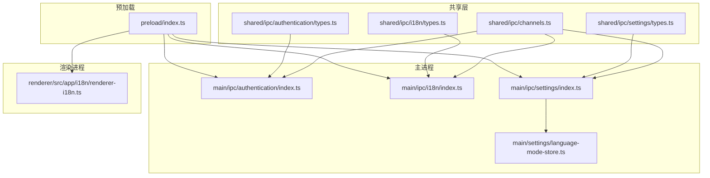
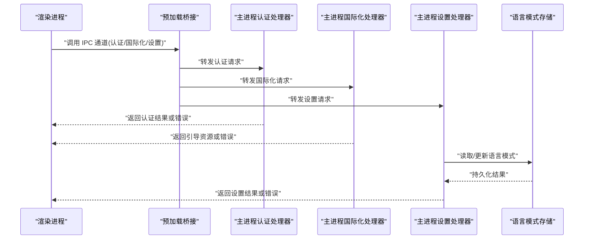
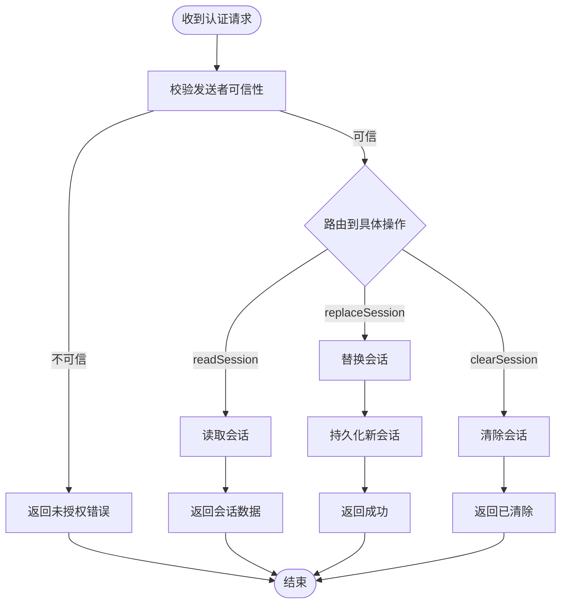
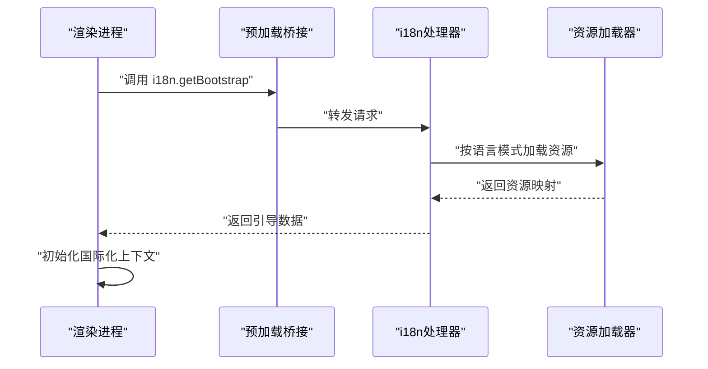
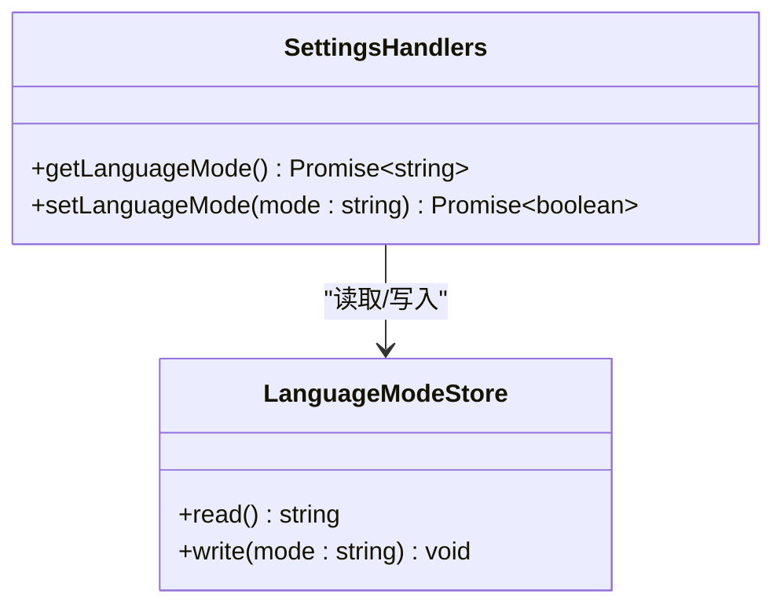
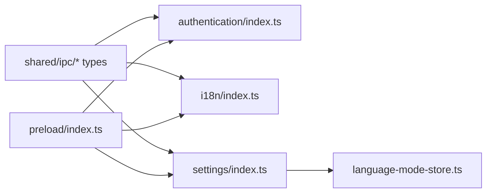

# IPC通道协议规范

<cite>
**本文引用的文件**   
- [apps/desktop/src/main/ipc/channels.ts](file://apps/desktop/src/main/ipc/channels.ts)
- [apps/desktop/src/main/ipc/authentication/index.ts](file://apps/desktop/src/main/ipc/authentication/index.ts)
- [apps/desktop/src/main/ipc/authentication/handlers/clear-session.ts](file://apps/desktop/src/main/ipc/authentication/handlers/clear-session.ts)
- [apps/desktop/src/main/ipc/authentication/handlers/read-session.ts](file://apps/desktop/src/main/ipc/authentication/handlers/read-session.ts)
- [apps/desktop/src/main/ipc/authentication/handlers/replace-session.ts](file://apps/desktop/src/main/ipc/authentication/handlers/replace-session.ts)
- [apps/desktop/src/main/ipc/authentication/handlers/trusted-sender.ts](file://apps/desktop/src/main/ipc/authentication/handlers/trusted-sender.ts)
- [apps/desktop/src/main/ipc/i18n/index.ts](file://apps/desktop/src/main/ipc/i18n/index.ts)
- [apps/desktop/src/main/ipc/i18n/handlers/get-bootstrap.ts](file://apps/desktop/src/main/ipc/i18n/handlers/get-bootstrap.ts)
- [apps/desktop/src/main/ipc/settings/index.ts](file://apps/desktop/src/main/ipc/settings/index.ts)
- [apps/desktop/src/main/ipc/settings/handlers/get-language-mode.ts](file://apps/desktop/src/main/ipc/settings/handlers/get-language模式.ts)
- [apps/desktop/src/main/ipc/settings/handlers/set-language-mode.ts](file://apps/desktop/src/main/ipc/settings/handlers/set-language模式.ts)
- [apps/desktop/src/shared/ipc/channels.ts](file://apps/desktop/src/shared/ipc/channels.ts)
- [apps/desktop/src/shared/ipc/authentication/types.ts](file://apps/desktop/src/shared/ipc/authentication/types.ts)
- [apps/desktop/src/shared/ipc/i18n/types.ts](file://apps/desktop/src/shared/ipc/i18n/types.ts)
- [apps/desktop/src/shared/ipc/settings/types.ts](file://apps/desktop/src/shared/ipc/settings/types.ts)
- [apps/desktop/src/preload/index.ts](file://apps/desktop/src/preload/index.ts)
- [apps/desktop/src/renderer/src/app/i18n/renderer-i18n.ts](file://apps/desktop/src/renderer/src/app/i18n/renderer-i18n.ts)
- [apps/desktop/src/main/settings/language-mode-store.ts](file://apps/desktop/src/main/settings/language-mode-store.ts)
</cite>

## 目录
1. [简介](#简介)
2. [项目结构](#项目结构)
3. [核心组件](#核心组件)
4. [架构总览](#架构总览)
5. [详细组件分析](#详细组件分析)
6. [依赖分析](#依赖分析)
7. [性能考虑](#性能考虑)
8. [故障排查指南](#故障排查指南)
9. [结论](#结论)
10. [附录](#附录)

## 简介
本规范面向 nevix-ai 桌面应用程序的 IPC（进程间通信）通道协议，覆盖通道命名规范、消息格式定义与通信标准。重点说明认证通道、国际化通道与设置通道的实现细节，包括消息类型、参数校验规则与响应格式。文档同时提供通道注册、消息发送与接收处理的示例路径，解释安全性考量、错误处理与调试方法，并给出最佳实践与常见问题解决方案。

## 项目结构
IPC 相关代码主要分布在以下位置：
- 共享类型定义位于 shared/ipc 目录，供主进程与渲染进程共同使用
- 主进程侧通道注册与处理器位于 main/ipc 目录，按功能域划分（authentication、i18n、settings）
- 预加载脚本在 preload/index.ts，负责将安全的 IPC 能力暴露给渲染进程
- 渲染进程侧通过共享类型与预加载 API 调用 IPC 通道

图表来源
- [apps/desktop/src/shared/ipc/channels.ts](file://apps/desktop/src/shared/ipc/channels.ts)
- [apps/desktop/src/main/ipc/authentication/index.ts](file://apps/desktop/src/main/ipc/authentication/index.ts)
- [apps/desktop/src/main/ipc/i18n/index.ts](file://apps/desktop/src/main/ipc/i18n/index.ts)
- [apps/desktop/src/main/ipc/settings/index.ts](file://apps/desktop/src/main/ipc/settings/index.ts)
- [apps/desktop/src/main/settings/language-mode-store.ts](file://apps/desktop/src/main/settings/language-mode-store.ts)
- [apps/desktop/src/preload/index.ts](file://apps/desktop/src/preload/index.ts)
- [apps/desktop/src/renderer/src/app/i18n/renderer-i18n.ts](file://apps/desktop/src/renderer/src/app/i18n/renderer-i18n.ts)

章节来源
- [apps/desktop/src/shared/ipc/channels.ts](file://apps/desktop/src/shared/ipc/channels.ts)
- [apps/desktop/src/main/ipc/authentication/index.ts](file://apps/desktop/src/main/ipc/authentication/index.ts)
- [apps/desktop/src/main/ipc/i18n/index.ts](file://apps/desktop/src/main/ipc/i18n/index.ts)
- [apps/desktop/src/main/ipc/settings/index.ts](file://apps/desktop/src/main/ipc/settings/index.ts)
- [apps/desktop/src/preload/index.ts](file://apps/desktop/src/preload/index.ts)

## 核心组件
- 通道命名规范
  - 采用“领域.操作”的分段式命名，如 authentication.readSession、i18n.getBootstrap、settings.setLanguageMode
  - 所有通道名统一在 shared/ipc/channels.ts 中集中声明，确保主进程与渲染进程一致
- 消息格式定义
  - 请求体包含：通道名、方法名、参数对象；响应体包含：成功标志、数据或错误信息
  - 各领域的类型定义位于 shared/ipc/<domain>/types.ts，严格约束参数与返回结构
- 通信协议标准
  - 渲染进程通过预加载桥接调用主进程 IPC 处理器
  - 主进程处理器执行参数校验、业务逻辑与持久化，返回标准化响应
  - 错误以结构化错误对象返回，便于上层统一处理

章节来源
- [apps/desktop/src/shared/ipc/channels.ts](file://apps/desktop/src/shared/ipc/channels.ts)
- [apps/desktop/src/shared/ipc/authentication/types.ts](file://apps/desktop/src/shared/ipc/authentication/types.ts)
- [apps/desktop/src/shared/ipc/i18n/types.ts](file://apps/desktop/src/shared/ipc/i18n/types.ts)
- [apps/desktop/src/shared/ipc/settings/types.ts](file://apps/desktop/src/shared/ipc/settings/types.ts)

## 架构总览
下图展示从渲染进程发起 IPC 到主进程处理器执行的完整流程，涵盖认证、国际化与设置三个通道域。

图表来源
- [apps/desktop/src/preload/index.ts](file://apps/desktop/src/preload/index.ts)
- [apps/desktop/src/main/ipc/authentication/index.ts](file://apps/desktop/src/main/ipc/authentication/index.ts)
- [apps/desktop/src/main/ipc/i18n/index.ts](file://apps/desktop/src/main/ipc/i18n/index.ts)
- [apps/desktop/src/main/ipc/settings/index.ts](file://apps/desktop/src/main/ipc/settings/index.ts)
- [apps/desktop/src/main/settings/language-mode-store.ts](file://apps/desktop/src/main/settings/language-mode-store.ts)

## 详细组件分析

### 认证通道（authentication）
- 通道命名
  - 典型操作：读取会话、替换会话、清除会话
  - 通道名集中在 shared/ipc/channels.ts 中声明
- 消息类型与参数
  - 读取会话：无参或最小参数，返回会话摘要
  - 替换会话：包含令牌与用户信息的参数对象
  - 清除会话：无参，清空本地会话状态
- 处理器实现
  - read-session.ts：验证发送者可信性，读取会话并返回
  - replace-session.ts：校验新会话参数，更新会话存储
  - clear-session.ts：清理会话数据，返回确认
  - trusted-sender.ts：用于校验调用来源是否受信任
- 安全策略
  - 仅允许来自可信上下文的调用
  - 敏感数据不直接暴露，返回最小必要信息

图表来源
- [apps/desktop/src/main/ipc/authentication/handlers/trusted-sender.ts](file://apps/desktop/src/main/ipc/authentication/handlers/trusted-sender.ts)
- [apps/desktop/src/main/ipc/authentication/handlers/read-session.ts](file://apps/desktop/src/main/ipc/authentication/handlers/read-session.ts)
- [apps/desktop/src/main/ipc/authentication/handlers/replace-session.ts](file://apps/desktop/src/main/ipc/authentication/handlers/replace-session.ts)
- [apps/desktop/src/main/ipc/authentication/handlers/clear-session.ts](file://apps/desktop/src/main/ipc/authentication/handlers/clear-session.ts)

章节来源
- [apps/desktop/src/main/ipc/authentication/index.ts](file://apps/desktop/src/main/ipc/authentication/index.ts)
- [apps/desktop/src/main/ipc/authentication/handlers/read-session.ts](file://apps/desktop/src/main/ipc/authentication/handlers/read-session.ts)
- [apps/desktop/src/main/ipc/authentication/handlers/replace-session.ts](file://apps/desktop/src/main/ipc/authentication/handlers/replace-session.ts)
- [apps/desktop/src/main/ipc/authentication/handlers/clear-session.ts](file://apps/desktop/src/main/ipc/authentication/handlers/clear-session.ts)
- [apps/desktop/src/main/ipc/authentication/handlers/trusted-sender.ts](file://apps/desktop/src/main/ipc/authentication/handlers/trusted-sender.ts)
- [apps/desktop/src/shared/ipc/authentication/types.ts](file://apps/desktop/src/shared/ipc/authentication/types.ts)

### 国际化通道（i18n）
- 通道命名
  - 典型操作：获取引导资源（getBootstrap）
- 消息类型与参数
  - getBootstrap：可选语言标识参数，返回多语言资源映射
- 处理器实现
  - get-bootstrap.ts：根据当前语言模式加载对应资源，返回标准化响应
- 渲染集成
  - renderer-i18n.ts：消费 i18n 通道返回的资源，初始化渲染进程国际化上下文

图表来源
- [apps/desktop/src/main/ipc/i18n/handlers/get-bootstrap.ts](file://apps/desktop/src/main/ipc/i18n/handlers/get-bootstrap.ts)
- [apps/desktop/src/renderer/src/app/i18n/renderer-i18n.ts](file://apps/desktop/src/renderer/src/app/i18n/renderer-i18n.ts)

章节来源
- [apps/desktop/src/main/ipc/i18n/index.ts](file://apps/desktop/src/main/ipc/i18n/index.ts)
- [apps/desktop/src/main/ipc/i18n/handlers/get-bootstrap.ts](file://apps/desktop/src/main/ipc/i18n/handlers/get-bootstrap.ts)
- [apps/desktop/src/shared/ipc/i18n/types.ts](file://apps/desktop/src/shared/ipc/i18n/types.ts)
- [apps/desktop/src/renderer/src/app/i18n/renderer-i18n.ts](file://apps/desktop/src/renderer/src/app/i18n/renderer-i18n.ts)

### 设置通道（settings）
- 通道命名
  - 典型操作：获取语言模式、设置语言模式
- 消息类型与参数
  - getLanguageMode：无参，返回当前语言模式
  - setLanguageMode：包含目标语言模式的参数对象
- 处理器实现
  - get-language-mode.ts：读取当前语言模式并返回
  - set-language-mode.ts：校验输入后更新语言模式存储
- 持久化
  - language-mode-store.ts：负责语言模式的读写与持久化

图表来源
- [apps/desktop/src/main/ipc/settings/handlers/get-language模式.ts](file://apps/desktop/src/main/ipc/settings/handlers/get-language模式.ts)
- [apps/desktop/src/main/ipc/settings/handlers/set-language模式.ts](file://apps/desktop/src/main/ipc/settings/handlers/set-language模式.ts)
- [apps/desktop/src/main/settings/language-mode-store.ts](file://apps/desktop/src/main/settings/language-mode-store.ts)

章节来源
- [apps/desktop/src/main/ipc/settings/index.ts](file://apps/desktop/src/main/ipc/settings/index.ts)
- [apps/desktop/src/main/ipc/settings/handlers/get-language模式.ts](file://apps/desktop/src/main/ipc/settings/handlers/get-language模式.ts)
- [apps/desktop/src/main/ipc/settings/handlers/set-language模式.ts](file://apps/desktop/src/main/ipc/settings/handlers/set-language模式.ts)
- [apps/desktop/src/main/settings/language-mode-store.ts](file://apps/desktop/src/main/settings/language-mode-store.ts)
- [apps/desktop/src/shared/ipc/settings/types.ts](file://apps/desktop/src/shared/ipc/settings/types.ts)

### 通道注册与调用示例（路径指引）
- 通道注册
  - 主进程在各域 index.ts 中注册通道名与处理器映射
  - 参考路径：[apps/desktop/src/main/ipc/authentication/index.ts](file://apps/desktop/src/main/ipc/authentication/index.ts)、[apps/desktop/src/main/ipc/i18n/index.ts](file://apps/desktop/src/main/ipc/i18n/index.ts)、[apps/desktop/src/main/ipc/settings/index.ts](file://apps/desktop/src/main/ipc/settings/index.ts)
- 消息发送
  - 渲染进程通过预加载桥接调用通道，参考路径：[apps/desktop/src/preload/index.ts](file://apps/desktop/src/preload/index.ts)
- 消息接收处理
  - 主进程处理器执行参数校验与业务逻辑，参考路径：
    - 认证：[apps/desktop/src/main/ipc/authentication/handlers/read-session.ts](file://apps/desktop/src/main/ipc/authentication/handlers/read-session.ts)
    - 国际化：[apps/desktop/src/main/ipc/i18n/handlers/get-bootstrap.ts](file://apps/desktop/src/main/ipc/i18n/handlers/get-bootstrap.ts)
    - 设置：[apps/desktop/src/main/ipc/settings/handlers/set-language模式.ts](file://apps/desktop/src/main/ipc/settings/handlers/set-language模式.ts)

章节来源
- [apps/desktop/src/preload/index.ts](file://apps/desktop/src/preload/index.ts)
- [apps/desktop/src/main/ipc/authentication/index.ts](file://apps/desktop/src/main/ipc/authentication/index.ts)
- [apps/desktop/src/main/ipc/i18n/index.ts](file://apps/desktop/src/main/ipc/i18n/index.ts)
- [apps/desktop/src/main/ipc/settings/index.ts](file://apps/desktop/src/main/ipc/settings/index.ts)

## 依赖分析
- 耦合与内聚
  - 各通道域相对独立，处理器职责单一，内聚性强
  - 共享类型定义降低耦合，保证接口一致性
- 外部依赖
  - 预加载桥接作为渲染与主进程的边界
  - 设置通道依赖语言模式存储进行持久化
- 潜在循环依赖
  - 通过 shared 类型解耦，避免主进程与渲染进程直接互相引用

图表来源
- [apps/desktop/src/shared/ipc/authentication/types.ts](file://apps/desktop/src/shared/ipc/authentication/types.ts)
- [apps/desktop/src/shared/ipc/i18n/types.ts](file://apps/desktop/src/shared/ipc/i18n/types.ts)
- [apps/desktop/src/shared/ipc/settings/types.ts](file://apps/desktop/src/shared/ipc/settings/types.ts)
- [apps/desktop/src/main/ipc/authentication/index.ts](file://apps/desktop/src/main/ipc/authentication/index.ts)
- [apps/desktop/src/main/ipc/i18n/index.ts](file://apps/desktop/src/main/ipc/i18n/index.ts)
- [apps/desktop/src/main/ipc/settings/index.ts](file://apps/desktop/src/main/ipc/settings/index.ts)
- [apps/desktop/src/main/settings/language-mode-store.ts](file://apps/desktop/src/main/settings/language-mode-store.ts)
- [apps/desktop/src/preload/index.ts](file://apps/desktop/src/preload/index.ts)

章节来源
- [apps/desktop/src/shared/ipc/channels.ts](file://apps/desktop/src/shared/ipc/channels.ts)
- [apps/desktop/src/preload/index.ts](file://apps/desktop/src/preload/index.ts)

## 性能考虑
- 减少不必要的 IPC 调用：批量操作合并为单次请求
- 避免阻塞主线程：耗时任务异步处理，及时返回中间状态
- 缓存热点数据：如语言资源可在渲染进程缓存，减少重复请求
- 限制传输大小：会话与配置数据尽量精简，避免大对象跨进程传输

## 故障排查指南
- 常见错误
  - 未授权错误：检查 trusted-sender 校验逻辑与调用来源
  - 参数校验失败：核对 shared 类型定义与传入参数结构
  - 持久化失败：检查语言模式存储读写权限与磁盘状态
- 调试方法
  - 在主进程处理器中记录请求与响应日志
  - 在预加载桥接处打印通道名与方法名，确认调用链路
  - 使用浏览器开发者工具查看渲染进程侧的错误堆栈
- 定位步骤
  - 先确认通道名是否正确（shared/ipc/channels.ts）
  - 再检查处理器是否存在且正确注册（各域 index.ts）
  - 最后验证参数与响应是否符合 shared 类型定义

章节来源
- [apps/desktop/src/main/ipc/authentication/handlers/trusted-sender.ts](file://apps/desktop/src/main/ipc/authentication/handlers/trusted-sender.ts)
- [apps/desktop/src/shared/ipc/authentication/types.ts](file://apps/desktop/src/shared/ipc/authentication/types.ts)
- [apps/desktop/src/shared/ipc/i18n/types.ts](file://apps/desktop/src/shared/ipc/i18n/types.ts)
- [apps/desktop/src/shared/ipc/settings/types.ts](file://apps/desktop/src/shared/ipc/settings/types.ts)

## 结论
本规范明确了 nevix-ai 桌面应用的 IPC 通道协议，涵盖命名规范、消息格式、通信标准与安全策略。通过共享类型与模块化处理器设计，确保了各通道的高内聚与低耦合。遵循本文档的最佳实践与故障排查建议，可有效提升系统的稳定性与可维护性。

## 附录
- 最佳实践
  - 始终在 shared 中定义类型，保持主渲染一致性
  - 对敏感操作进行发送者可信性校验
  - 错误信息结构化，便于上层统一处理与展示
- 常见问题
  - 通道未注册：检查各域 index.ts 中的注册逻辑
  - 参数类型不匹配：对照 shared 类型定义修正
  - 国际化资源缺失：确认语言模式与资源映射正确