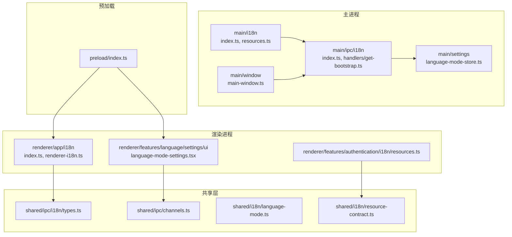
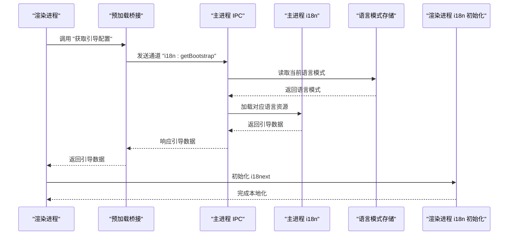
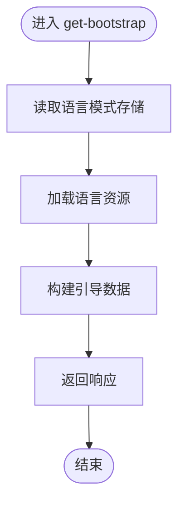
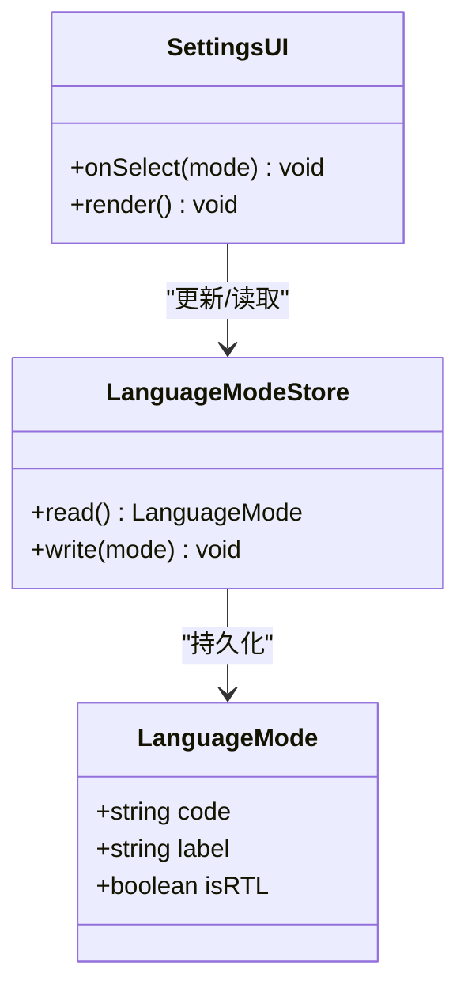
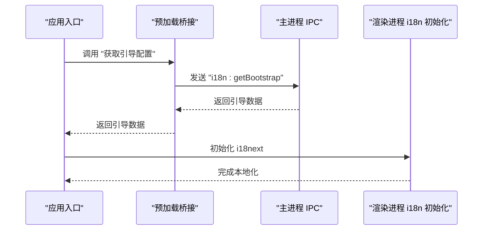
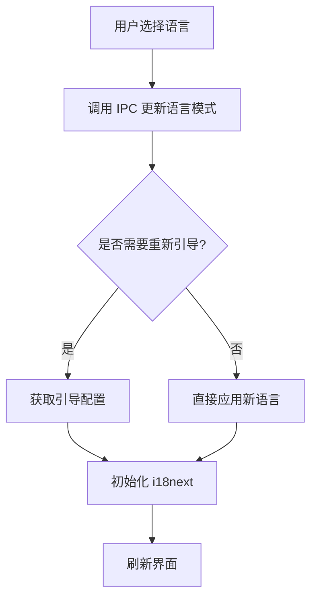
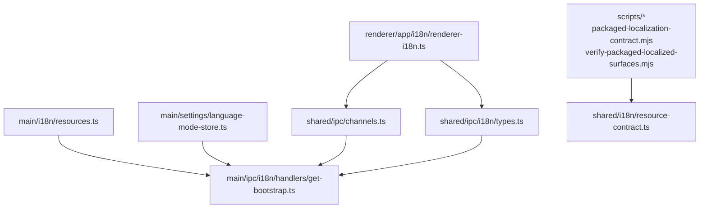

# 国际化IPC通信

<cite>
**本文引用的文件**   
- [apps/desktop/src/main/i18n/index.ts](file://apps/desktop/src/main/i18n/index.ts)
- [apps/desktop/src/main/i18n/resources.ts](file://apps/desktop/src/main/i18n/resources.ts)
- [apps/desktop/src/main/ipc/i18n/index.ts](file://apps/desktop/src/main/ipc/i18n/index.ts)
- [apps/desktop/src/main/ipc/i18n/handlers/get-bootstrap.ts](file://apps/desktop/src/main/ipc/handlers/get-bootstrap.ts)
- [apps/desktop/src/main/settings/language-mode-store.ts](file://apps/desktop/src/main/settings/language-mode-store.ts)
- [apps/desktop/src/shared/i18n/language-mode.ts](file://apps/desktop/src/shared/i18n/language-mode.ts)
- [apps/desktop/src/shared/i18n/resource-contract.ts](file://apps/desktop/src/shared/i18n/resource-contract.ts)
- [apps/desktop/src/shared/ipc/channels.ts](file://apps/desktop/src/shared/ipc/channels.ts)
- [apps/desktop/src/shared/ipc/i18n/types.ts](file://apps/desktop/src/shared/ipc/i18n/types.ts)
- [apps/desktop/src/preload/index.ts](file://apps/desktop/src/preload/index.ts)
- [apps/desktop/src/renderer/src/app/i18n/index.ts](file://apps/desktop/src/renderer/src/app/i18n/index.ts)
- [apps/desktop/src/renderer/src/app/i18n/renderer-i18n.ts](file://apps/desktop/src/renderer/src/app/i18n/renderer-i18n.ts)
- [apps/desktop/src/renderer/src/features/language/settings/ui/language-mode-settings.tsx](file://apps/desktop/src/renderer/src/features/language/settings/ui/language-mode-settings.tsx)
- [apps/desktop/src/renderer/src/features/language/settings/i18n.ts](file://apps/desktop/src/renderer/src/features/language/settings/i18n.ts)
- [apps/desktop/src/renderer/src/features/authentication/i18n/resources.ts](file://apps/desktop/src/renderer/src/features/authentication/i18n/resources.ts)
- [apps/desktop/src/main/window/main-window.ts](file://apps/desktop/src/main/window/main-window.ts)
- [apps/desktop/electron.vite.config.ts](file://apps/desktop/electron.vite.config.ts)
- [apps/desktop/scripts/packaged-localization-contract.mjs](file://apps/desktop/scripts/packaged-localization-contract.mjs)
- [apps/desktop/scripts/verify-packaged-localized-surfaces.mjs](file://apps/desktop/scripts/verify-packaged-localized-surfaces.mjs)
</cite>

## 目录
1. [简介](#简介)
2. [项目结构](#项目结构)
3. [核心组件](#核心组件)
4. [架构总览](#架构总览)
5. [详细组件分析](#详细组件分析)
6. [依赖关系分析](#依赖关系分析)
7. [性能与缓存策略](#性能与缓存策略)
8. [故障排查指南](#故障排查指南)
9. [结论](#结论)
10. [附录：示例与最佳实践](#附录示例与最佳实践)

## 简介
本文件面向 nevix-ai 桌面应用程序的国际化（i18n）IPC 通信机制，重点说明多语言资源加载、语言切换和本地化配置的 IPC 接口。文档围绕 get-bootstrap 处理器函数展开，解释主进程如何初始化 i18n 资源、渲染进程如何通过预加载桥接调用 IPC 获取启动配置，以及语言模式配置在持久化存储与前端 UI 之间的流转。同时涵盖资源文件结构、动态加载机制、缓存策略、性能优化和错误处理，并提供可操作的示例路径与最佳实践。

## 项目结构
本项目采用 Electron 多进程架构，主进程负责 i18n 资源管理与 IPC 服务，预加载脚本暴露安全 API 给渲染进程，渲染进程使用 i18next 进行本地化展示。关键目录与职责如下：
- main/i18n：主进程 i18n 初始化与资源管理
- main/ipc/i18n：i18n 相关 IPC 通道与处理器
- main/settings：语言模式持久化存储
- shared/i18n：跨进程共享的类型与契约
- shared/ipc：IPC 通道名与类型定义
- preload：安全桥接，将主进程能力暴露给渲染进程
- renderer：渲染进程应用逻辑，包含 i18n 初始化与设置界面
- scripts：打包与校验脚本，确保资源完整性

**图表来源** 
- [apps/desktop/src/main/i18n/index.ts](file://apps/desktop/src/main/i18n/index.ts)
- [apps/desktop/src/main/i18n/resources.ts](file://apps/desktop/src/main/i18n/resources.ts)
- [apps/desktop/src/main/ipc/i18n/index.ts](file://apps/desktop/src/main/ipc/i18n/index.ts)
- [apps/desktop/src/main/ipc/i18n/handlers/get-bootstrap.ts](file://apps/desktop/src/main/ipc/handlers/get-bootstrap.ts)
- [apps/desktop/src/main/settings/language-mode-store.ts](file://apps/desktop/src/main/settings/language-mode-store.ts)
- [apps/desktop/src/shared/ipc/i18n/types.ts](file://apps/desktop/src/shared/ipc/i18n/types.ts)
- [apps/desktop/src/shared/ipc/channels.ts](file://apps/desktop/src/shared/ipc/channels.ts)
- [apps/desktop/src/shared/i18n/language-mode.ts](file://apps/desktop/src/shared/i18n/language-mode.ts)
- [apps/desktop/src/shared/i18n/resource-contract.ts](file://apps/desktop/src/shared/i18n/resource-contract.ts)
- [apps/desktop/src/preload/index.ts](file://apps/desktop/src/preload/index.ts)
- [apps/desktop/src/renderer/src/app/i18n/index.ts](file://apps/desktop/src/renderer/src/app/i18n/index.ts)
- [apps/desktop/src/renderer/src/app/i18n/renderer-i18n.ts](file://apps/desktop/src/renderer/src/app/i18n/renderer-i18n.ts)
- [apps/desktop/src/renderer/src/features/language/settings/ui/language-mode-settings.tsx](file://apps/desktop/src/renderer/src/features/language/settings/ui/language-mode-settings.tsx)
- [apps/desktop/src/renderer/src/features/authentication/i18n/resources.ts](file://apps/desktop/src/renderer/src/features/authentication/i18n/resources.ts)
- [apps/desktop/src/main/window/main-window.ts](file://apps/desktop/src/main/window/main-window.ts)

**章节来源**
- [apps/desktop/src/main/i18n/index.ts](file://apps/desktop/src/main/i18n/index.ts)
- [apps/desktop/src/main/ipc/i18n/index.ts](file://apps/desktop/src/main/ipc/i18n/index.ts)
- [apps/desktop/src/shared/ipc/channels.ts](file://apps/desktop/src/shared/ipc/channels.ts)
- [apps/desktop/src/preload/index.ts](file://apps/desktop/src/preload/index.ts)
- [apps/desktop/src/renderer/src/app/i18n/index.ts](file://apps/desktop/src/renderer/src/app/i18n/index.ts)

## 核心组件
- 主进程 i18n 初始化与资源管理：负责加载多语言资源、维护当前语言模式、提供 IPC 查询入口
- IPC 通道与处理器：定义通道名、请求/响应类型，实现 get-bootstrap 等处理器
- 语言模式存储：持久化用户选择的语言模式，供主进程读取与更新
- 预加载桥接：将主进程的 i18n 能力以安全方式暴露给渲染进程
- 渲染进程 i18n 初始化：根据 bootstrap 结果初始化 i18next，并支持动态切换
- 设置界面：提供语言模式选择与更新交互

**章节来源**
- [apps/desktop/src/main/i18n/resources.ts](file://apps/desktop/src/main/i18n/resources.ts)
- [apps/desktop/src/main/ipc/i18n/handlers/get-bootstrap.ts](file://apps/desktop/src/main/ipc/handlers/get-bootstrap.ts)
- [apps/desktop/src/main/settings/language-mode-store.ts](file://apps/desktop/src/main/settings/language-mode-store.ts)
- [apps/desktop/src/preload/index.ts](file://apps/desktop/src/preload/index.ts)
- [apps/desktop/src/renderer/src/app/i18n/renderer-i18n.ts](file://apps/desktop/src/renderer/src/app/i18n/renderer-i18n.ts)
- [apps/desktop/src/renderer/src/features/language/settings/ui/language-mode-settings.tsx](file://apps/desktop/src/renderer/src/features/language/settings/ui/language-mode-settings.tsx)

## 架构总览
下图展示了从渲染进程发起语言切换到主进程返回引导配置的整体流程，包括 IPC 通道、处理器、资源加载与 i18next 初始化。

**图表来源** 
- [apps/desktop/src/shared/ipc/channels.ts](file://apps/desktop/src/shared/ipc/channels.ts)
- [apps/desktop/src/shared/ipc/i18n/types.ts](file://apps/desktop/src/shared/ipc/i18n/types.ts)
- [apps/desktop/src/main/ipc/i18n/handlers/get-bootstrap.ts](file://apps/desktop/src/main/ipc/handlers/get-bootstrap.ts)
- [apps/desktop/src/main/settings/language-mode-store.ts](file://apps/desktop/src/main/settings/language-mode-store.ts)
- [apps/desktop/src/main/i18n/resources.ts](file://apps/desktop/src/main/i18n/resources.ts)
- [apps/desktop/src/renderer/src/app/i18n/renderer-i18n.ts](file://apps/desktop/src/renderer/src/app/i18n/renderer-i18n.ts)

## 详细组件分析

### get-bootstrap 处理器与资源初始化流程
- 功能：响应渲染进程的引导请求，返回当前语言模式及对应的资源快照，供渲染进程初始化 i18next
- 流程要点：
  - 从语言模式存储读取当前语言
  - 加载对应语言的多语言资源
  - 组装引导数据（包含语言键、命名空间、初始文本等）
  - 返回给渲染进程

**图表来源** 
- [apps/desktop/src/main/ipc/i18n/handlers/get-bootstrap.ts](file://apps/desktop/src/main/ipc/handlers/get-bootstrap.ts)
- [apps/desktop/src/main/settings/language-mode-store.ts](file://apps/desktop/src/main/settings/language-mode-store.ts)
- [apps/desktop/src/main/i18n/resources.ts](file://apps/desktop/src/main/i18n/resources.ts)

**章节来源**
- [apps/desktop/src/main/ipc/i18n/handlers/get-bootstrap.ts](file://apps/desktop/src/main/ipc/handlers/get-bootstrap.ts)
- [apps/desktop/src/main/settings/language-mode-store.ts](file://apps/desktop/src/main/settings/language-mode-store.ts)
- [apps/desktop/src/main/i18n/resources.ts](file://apps/desktop/src/main/i18n/resources.ts)

### 语言模式配置与持久化
- 语言模式类型定义位于共享层，确保主进程与渲染进程一致
- 存储模块负责读写用户选择的语言模式，保证重启后仍有效
- 设置界面通过 IPC 更新语言模式，触发重新引导或即时切换

**图表来源** 
- [apps/desktop/src/shared/i18n/language-mode.ts](file://apps/desktop/src/shared/i18n/language-mode.ts)
- [apps/desktop/src/main/settings/language-mode-store.ts](file://apps/desktop/src/main/settings/language-mode-store.ts)
- [apps/desktop/src/renderer/src/features/language/settings/ui/language-mode-settings.tsx](file://apps/desktop/src/renderer/src/features/language/settings/ui/language-mode-settings.tsx)

**章节来源**
- [apps/desktop/src/shared/i18n/language-mode.ts](file://apps/desktop/src/shared/i18n/language-mode.ts)
- [apps/desktop/src/main/settings/language-mode-store.ts](file://apps/desktop/src/main/settings/language-mode-store.ts)
- [apps/desktop/src/renderer/src/features/language/settings/ui/language-mode-settings.tsx](file://apps/desktop/src/renderer/src/features/language/settings/ui/language-mode-settings.tsx)

### 资源文件结构与动态加载机制
- 资源契约定义了命名空间与键的结构，确保打包时资源完整性
- 主进程按语言代码加载资源，渲染进程按需使用 i18next 进行翻译
- 动态加载支持新增语言或扩展命名空间，避免全量加载开销

**图表来源** 
- [apps/desktop/src/shared/i18n/resource-contract.ts](file://apps/desktop/src/shared/i18n/resource-contract.ts)
- [apps/desktop/src/main/i18n/resources.ts](file://apps/desktop/src/main/i18n/resources.ts)
- [apps/desktop/src/main/ipc/i18n/handlers/get-bootstrap.ts](file://apps/desktop/src/main/ipc/handlers/get-bootstrap.ts)
- [apps/desktop/src/renderer/src/app/i18n/renderer-i18n.ts](file://apps/desktop/src/renderer/src/app/i18n/renderer-i18n.ts)

**章节来源**
- [apps/desktop/src/shared/i18n/resource-contract.ts](file://apps/desktop/src/shared/i18n/resource-contract.ts)
- [apps/desktop/src/main/i18n/resources.ts](file://apps/desktop/src/main/i18n/resources.ts)
- [apps/desktop/src/main/ipc/i18n/handlers/get-bootstrap.ts](file://apps/desktop/src/main/ipc/handlers/get-bootstrap.ts)
- [apps/desktop/src/renderer/src/app/i18n/renderer-i18n.ts](file://apps/desktop/src/renderer/src/app/i18n/renderer-i18n.ts)

### 预加载桥接与渲染进程集成
- 预加载脚本将主进程的 i18n 能力封装为安全的 API，供渲染进程调用
- 渲染进程在应用启动时调用引导接口，初始化 i18next，并在设置界面中触发语言切换

**图表来源** 
- [apps/desktop/src/preload/index.ts](file://apps/desktop/src/preload/index.ts)
- [apps/desktop/src/shared/ipc/channels.ts](file://apps/desktop/src/shared/ipc/channels.ts)
- [apps/desktop/src/renderer/src/app/i18n/index.ts](file://apps/desktop/src/renderer/src/app/i18n/index.ts)

**章节来源**
- [apps/desktop/src/preload/index.ts](file://apps/desktop/src/preload/index.ts)
- [apps/desktop/src/shared/ipc/channels.ts](file://apps/desktop/src/shared/ipc/channels.ts)
- [apps/desktop/src/renderer/src/app/i18n/index.ts](file://apps/desktop/src/renderer/src/app/i18n/index.ts)

### 设置界面与语言切换
- 设置界面提供语言模式选择，调用 IPC 更新语言模式
- 更新后触发重新引导或即时切换，确保 UI 立即反映新语言

**图表来源** 
- [apps/desktop/src/renderer/src/features/language/settings/ui/language-mode-settings.tsx](file://apps/desktop/src/renderer/src/features/language/settings/ui/language-mode-settings.tsx)
- [apps/desktop/src/renderer/src/features/language/settings/i18n.ts](file://apps/desktop/src/renderer/src/features/language/settings/i18n.ts)
- [apps/desktop/src/main/ipc/i18n/handlers/get-bootstrap.ts](file://apps/desktop/src/main/ipc/handlers/get-bootstrap.ts)

**章节来源**
- [apps/desktop/src/renderer/src/features/language/settings/ui/language-mode-settings.tsx](file://apps/desktop/src/renderer/src/features/language/settings/ui/language-mode-settings.tsx)
- [apps/desktop/src/renderer/src/features/language/settings/i18n.ts](file://apps/desktop/src/renderer/src/features/language/settings/i18n.ts)
- [apps/desktop/src/main/ipc/i18n/handlers/get-bootstrap.ts](file://apps/desktop/src/main/ipc/handlers/get-bootstrap.ts)

## 依赖关系分析
- 主进程 i18n 模块依赖资源加载器与语言模式存储
- IPC 处理器依赖共享类型与通道定义
- 渲染进程 i18n 初始化依赖引导数据与 i18next 配置
- 打包脚本确保资源完整性与契约一致性

**图表来源** 
- [apps/desktop/src/main/i18n/resources.ts](file://apps/desktop/src/main/i18n/resources.ts)
- [apps/desktop/src/main/ipc/i18n/handlers/get-bootstrap.ts](file://apps/desktop/src/main/ipc/handlers/get-bootstrap.ts)
- [apps/desktop/src/main/settings/language-mode-store.ts](file://apps/desktop/src/main/settings/language-mode-store.ts)
- [apps/desktop/src/shared/ipc/channels.ts](file://apps/desktop/src/shared/ipc/channels.ts)
- [apps/desktop/src/shared/ipc/i18n/types.ts](file://apps/desktop/src/shared/ipc/i18n/types.ts)
- [apps/desktop/src/renderer/src/app/i18n/renderer-i18n.ts](file://apps/desktop/src/renderer/src/app/i18n/renderer-i18n.ts)
- [apps/desktop/scripts/packaged-localization-contract.mjs](file://apps/desktop/scripts/packaged-localization-contract.mjs)
- [apps/desktop/scripts/verify-packaged-localized-surfaces.mjs](file://apps/desktop/scripts/verify-packaged-localized-surfaces.mjs)
- [apps/desktop/src/shared/i18n/resource-contract.ts](file://apps/desktop/src/shared/i18n/resource-contract.ts)

**章节来源**
- [apps/desktop/src/main/i18n/resources.ts](file://apps/desktop/src/main/i18n/resources.ts)
- [apps/desktop/src/main/ipc/i18n/handlers/get-bootstrap.ts](file://apps/desktop/src/main/ipc/handlers/get-bootstrap.ts)
- [apps/desktop/src/main/settings/language-mode-store.ts](file://apps/desktop/src/main/settings/language-mode-store.ts)
- [apps/desktop/src/shared/ipc/channels.ts](file://apps/desktop/src/shared/ipc/channels.ts)
- [apps/desktop/src/shared/ipc/i18n/types.ts](file://apps/desktop/src/shared/ipc/i18n/types.ts)
- [apps/desktop/src/renderer/src/app/i18n/renderer-i18n.ts](file://apps/desktop/src/renderer/src/app/i18n/renderer-i18n.ts)
- [apps/desktop/scripts/packaged-localization-contract.mjs](file://apps/desktop/scripts/packaged-localization-contract.mjs)
- [apps/desktop/scripts/verify-packaged-localized-surfaces.mjs](file://apps/desktop/scripts/verify-packaged-localized-surfaces.mjs)
- [apps/desktop/src/shared/i18n/resource-contract.ts](file://apps/desktop/src/shared/i18n/resource-contract.ts)

## 性能与缓存策略
- 资源缓存：主进程对已加载的语言资源进行内存缓存，避免重复加载
- 按需加载：仅加载当前语言与必要命名空间，减少启动时间
- 增量更新：语言切换时只更新变更的命名空间，避免全量重建
- 打包优化：通过脚本校验资源完整性，防止缺失键导致的运行时错误

[本节为通用指导，不直接分析具体文件]

## 故障排查指南
- 常见问题：
  - 引导数据为空：检查语言模式存储是否可读，确认资源加载路径正确
  - 翻译缺失：核对 resource-contract 与实际资源键是否一致，运行打包校验脚本
  - 切换无效：确认 IPC 通道名与类型定义一致，检查预加载桥接是否正确暴露 API
- 调试建议：
  - 在主进程日志中打印语言模式与资源加载状态
  - 在渲染进程记录 i18next 初始化与切换事件
  - 使用 playwright 测试覆盖语言切换流程

**章节来源**
- [apps/desktop/src/main/ipc/i18n/handlers/get-bootstrap.ts](file://apps/desktop/src/main/ipc/handlers/get-bootstrap.ts)
- [apps/desktop/src/shared/i18n/resource-contract.ts](file://apps/desktop/src/shared/i18n/resource-contract.ts)
- [apps/desktop/scripts/verify-packaged-localized-surfaces.mjs](file://apps/desktop/scripts/verify-packaged-localized-surfaces.mjs)

## 结论
nevix-ai 桌面应用的国际化 IPC 通信通过主进程集中管理资源与配置，预加载桥接确保安全访问，渲染进程按需初始化与切换。该设计实现了高效、可扩展的本地化方案，结合缓存与打包校验，保障了用户体验与开发效率。遵循本文档的最佳实践与故障排查指南，可有效提升国际化功能的稳定性与可维护性。

[本节为总结，不直接分析具体文件]

## 附录：示例与最佳实践
- 语言切换示例：
  - 在设置界面调用 IPC 更新语言模式，随后触发重新引导或直接应用
  - 参考路径：[apps/desktop/src/renderer/src/features/language/settings/ui/language-mode-settings.tsx](file://apps/desktop/src/renderer/src/features/language/settings/ui/language-mode-settings.tsx)
- 资源获取示例：
  - 渲染进程启动时调用引导接口，初始化 i18next
  - 参考路径：[apps/desktop/src/renderer/src/app/i18n/renderer-i18n.ts](file://apps/desktop/src/renderer/src/app/i18n/renderer-i18n.ts)
- 配置更新示例：
  - 主进程语言模式存储写入新值，IPC 处理器读取并返回最新配置
  - 参考路径：[apps/desktop/src/main/settings/language-mode-store.ts](file://apps/desktop/src/main/settings/language-mode-store.ts), [apps/desktop/src/main/ipc/i18n/handlers/get-bootstrap.ts](file://apps/desktop/src/main/ipc/handlers/get-bootstrap.ts)
- 最佳实践：
  - 使用共享类型与契约确保前后端一致性
  - 实施资源缓存与按需加载，优化启动性能
  - 通过脚本校验资源完整性，避免运行时错误
  - 在错误处理中提供清晰的日志与用户提示

[本节为示例与指导，不直接分析具体文件]