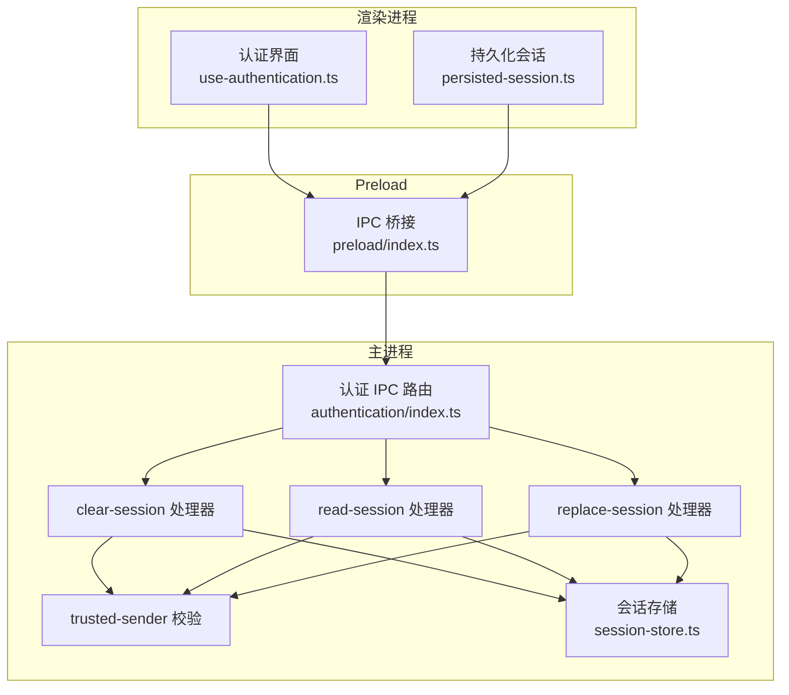
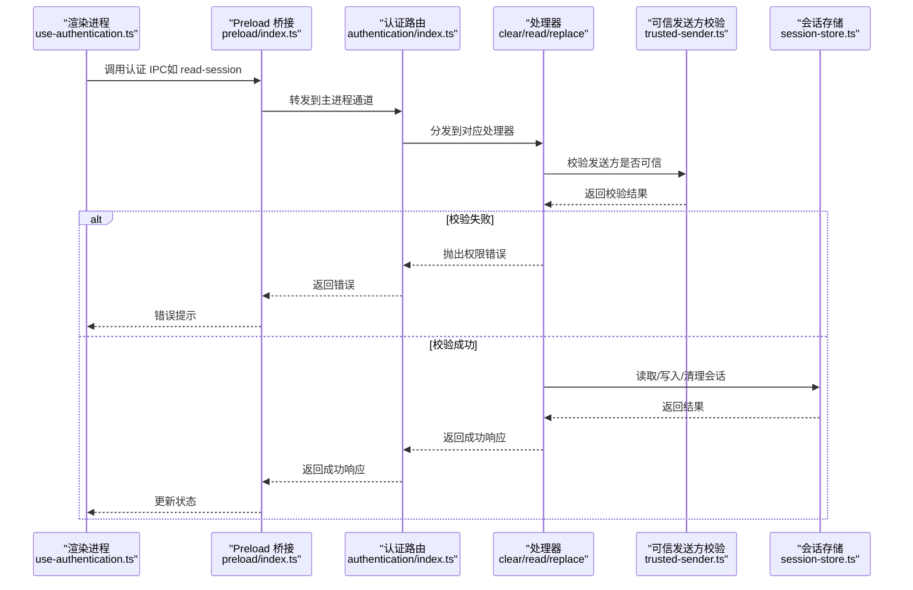
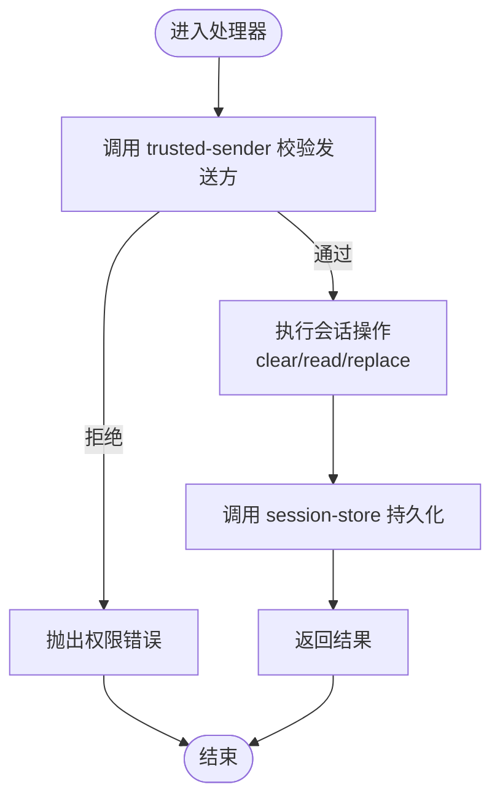
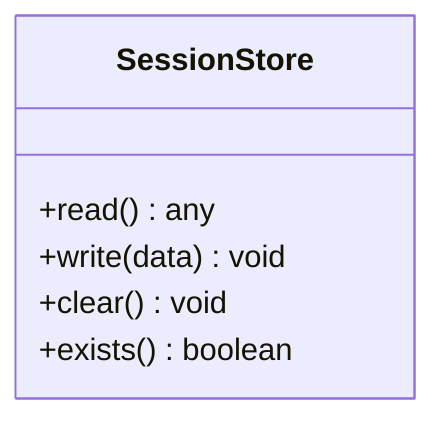
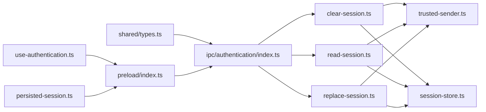

# 认证IPC通信

<cite>
**本文引用的文件**   
- [apps/desktop/src/main/ipc/authentication/index.ts](file://apps/desktop/src/main/ipc/authentication/index.ts)
- [apps/desktop/src/main/ipc/authentication/clear-session.ts](file://apps/desktop/src/main/ipc/authentication/clear-session.ts)
- [apps/desktop/src/main/ipc/authentication/read-session.ts](file://apps/desktop/src/main/ipc/authentication/read-session.ts)
- [apps/desktop/src/main/ipc/authentication/replace-session.ts](file://apps/desktop/src/main/ipc/authentication/replace-session.ts)
- [apps/desktop/src/main/ipc/authentication/trusted-sender.ts](file://apps/desktop/src/main/ipc/authentication/trusted-sender.ts)
- [apps/desktop/src/main/authentication/session-store.ts](file://apps/desktop/src/main/authentication/session-store.ts)
- [apps/desktop/src/shared/ipc/authentication/types.ts](file://apps/desktop/src/shared/ipc/authentication/types.ts)
- [apps/desktop/src/preload/index.ts](file://apps/desktop/src/preload/index.ts)
- [apps/desktop/src/renderer/src/features/authentication/session/persisted-session.ts](file://apps/desktop/src/renderer/src/features/authentication/session/persisted-session.ts)
- [apps/desktop/src/renderer/src/features/authentication/hooks/use-authentication.ts](file://apps/desktop/src/renderer/src/features/authentication/hooks/use-authentication.ts)
</cite>

## 目录
1. [简介](#简介)
2. [项目结构](#项目结构)
3. [核心组件](#核心组件)
4. [架构总览](#架构总览)
5. [详细组件分析](#详细组件分析)
6. [依赖关系分析](#依赖关系分析)
7. [性能考虑](#性能考虑)
8. [故障排查指南](#故障排查指南)
9. [结论](#结论)
10. [附录](#附录)

## 简介
本文件为 nevix-ai 桌面应用程序的认证 IPC 通信提供系统化文档，重点覆盖：
- 会话管理、身份验证与数据持久化的 IPC 接口
- clear-session、read-session、replace-session 等处理器的实现细节
- trusted-sender 安全机制与会话存储策略
- 认证流程、会话操作与安全验证的具体示例（以代码片段路径形式呈现）
- 错误处理、异常捕获与日志记录
- 性能优化建议与调试技巧

## 项目结构
认证相关代码主要分布在以下位置：
- 主进程 IPC 路由与处理器：apps/desktop/src/main/ipc/authentication/*
- 会话存储：apps/desktop/src/main/authentication/session-store.ts
- 共享类型定义：apps/desktop/src/shared/ipc/authentication/types.ts
- Preload 桥接：apps/desktop/src/preload/index.ts
- 渲染进程使用层：apps/desktop/src/renderer/src/features/authentication/*

**图表来源** 
- [apps/desktop/src/main/ipc/authentication/index.ts](file://apps/desktop/src/main/ipc/authentication/index.ts)
- [apps/desktop/src/main/ipc/authentication/clear-session.ts](file://apps/desktop/src/main/ipc/authentication/clear-session.ts)
- [apps/desktop/src/main/ipc/authentication/read-session.ts](file://apps/desktop/src/main/ipc/authentication/read-session.ts)
- [apps/desktop/src/main/ipc/authentication/replace-session.ts](file://apps/desktop/src/main/ipc/authentication/replace-session.ts)
- [apps/desktop/src/main/ipc/authentication/trusted-sender.ts](file://apps/desktop/src/main/ipc/authentication/trusted-sender.ts)
- [apps/desktop/src/main/authentication/session-store.ts](file://apps/desktop/src/main/authentication/session-store.ts)
- [apps/desktop/src/preload/index.ts](file://apps/desktop/src/preload/index.ts)
- [apps/desktop/src/renderer/src/features/authentication/hooks/use-authentication.ts](file://apps/desktop/src/renderer/src/features/authentication/hooks/use-authentication.ts)
- [apps/desktop/src/renderer/src/features/authentication/session/persisted-session.ts](file://apps/desktop/src/renderer/src/features/authentication/session/persisted-session.ts)

**章节来源**
- [apps/desktop/src/main/ipc/authentication/index.ts](file://apps/desktop/src/main/ipc/authentication/index.ts)
- [apps/desktop/src/main/authentication/session-store.ts](file://apps/desktop/src/main/authentication/session-store.ts)
- [apps/desktop/src/shared/ipc/authentication/types.ts](file://apps/desktop/src/shared/ipc/authentication/types.ts)
- [apps/desktop/src/preload/index.ts](file://apps/desktop/src/preload/index.ts)
- [apps/desktop/src/renderer/src/features/authentication/hooks/use-authentication.ts](file://apps/desktop/src/renderer/src/features/authentication/hooks/use-authentication.ts)
- [apps/desktop/src/renderer/src/features/authentication/session/persisted-session.ts](file://apps/desktop/src/renderer/src/features/authentication/session/persisted-session.ts)

## 核心组件
- IPC 路由与注册：集中注册认证相关的 IPC 通道与处理器，统一入口便于扩展与维护。
- 处理器函数：
  - clear-session：清理当前会话，确保敏感信息不残留。
  - read-session：读取当前会话状态或数据。
  - replace-session：替换或更新会话数据，支持幂等与一致性保障。
- 安全校验：trusted-sender 用于限制仅可信发送方调用认证相关 IPC，防止跨上下文滥用。
- 会话存储：session-store 负责会话数据的读写、序列化与持久化策略。
- 共享类型：types.ts 定义 IPC 请求/响应结构与常量，保证前后端契约一致。
- Preload 桥接：将受限的 Node/Electron API 暴露给渲染进程，同时保持安全边界。
- 渲染进程使用：hooks 与 UI 组件通过 use-authentication 和 persisted-session 调用 IPC 并管理本地状态。

**章节来源**
- [apps/desktop/src/main/ipc/authentication/index.ts](file://apps/desktop/src/main/ipc/authentication/index.ts)
- [apps/desktop/src/main/ipc/authentication/clear-session.ts](file://apps/desktop/src/main/ipc/authentication/clear-session.ts)
- [apps/desktop/src/main/ipc/authentication/read-session.ts](file://apps/desktop/src/main/ipc/authentication/read-session.ts)
- [apps/desktop/src/main/ipc/authentication/replace-session.ts](file://apps/desktop/src/main/ipc/authentication/replace-session.ts)
- [apps/desktop/src/main/ipc/authentication/trusted-sender.ts](file://apps/desktop/src/main/ipc/authentication/trusted-sender.ts)
- [apps/desktop/src/main/authentication/session-store.ts](file://apps/desktop/src/main/authentication/session-store.ts)
- [apps/desktop/src/shared/ipc/authentication/types.ts](file://apps/desktop/src/shared/ipc/authentication/types.ts)
- [apps/desktop/src/preload/index.ts](file://apps/desktop/src/preload/index.ts)
- [apps/desktop/src/renderer/src/features/authentication/hooks/use-authentication.ts](file://apps/desktop/src/renderer/src/features/authentication/hooks/use-authentication.ts)
- [apps/desktop/src/renderer/src/features/authentication/session/persisted-session.ts](file://apps/desktop/src/renderer/src/features/authentication/session/persisted-session.ts)

## 架构总览
认证 IPC 通信遵循“渲染进程 -> Preload -> 主进程处理器 -> 会话存储”的分层模型，所有认证相关操作均通过受控通道进行，并由 trusted-sender 进行发送方校验。

**图表来源** 
- [apps/desktop/src/main/ipc/authentication/index.ts](file://apps/desktop/src/main/ipc/authentication/index.ts)
- [apps/desktop/src/main/ipc/authentication/clear-session.ts](file://apps/desktop/src/main/ipc/authentication/clear-session.ts)
- [apps/desktop/src/main/ipc/authentication/read-session.ts](file://apps/desktop/src/main/ipc/authentication/read-session.ts)
- [apps/desktop/src/main/ipc/authentication/replace-session.ts](file://apps/desktop/src/main/ipc/authentication/replace-session.ts)
- [apps/desktop/src/main/ipc/authentication/trusted-sender.ts](file://apps/desktop/src/main/ipc/authentication/trusted-sender.ts)
- [apps/desktop/src/main/authentication/session-store.ts](file://apps/desktop/src/main/authentication/session-store.ts)
- [apps/desktop/src/preload/index.ts](file://apps/desktop/src/preload/index.ts)
- [apps/desktop/src/renderer/src/features/authentication/hooks/use-authentication.ts](file://apps/desktop/src/renderer/src/features/authentication/hooks/use-authentication.ts)

## 详细组件分析

### 认证 IPC 路由与处理器
- 路由职责：集中注册认证通道名称与处理器映射，确保通道命名与类型契约一致。
- 处理器职责：
  - clear-session：清空当前会话，避免敏感数据泄露；需确保幂等与原子性。
  - read-session：读取当前会话数据，返回最小必要字段。
  - replace-session：替换会话数据，支持增量更新与回滚保护。
- 安全校验：每个处理器在执行业务逻辑前调用 trusted-sender 校验发送方来源。

**图表来源** 
- [apps/desktop/src/main/ipc/authentication/index.ts](file://apps/desktop/src/main/ipc/authentication/index.ts)
- [apps/desktop/src/main/ipc/authentication/clear-session.ts](file://apps/desktop/src/main/ipc/authentication/clear-session.ts)
- [apps/desktop/src/main/ipc/authentication/read-session.ts](file://apps/desktop/src/main/ipc/authentication/read-session.ts)
- [apps/desktop/src/main/ipc/authentication/replace-session.ts](file://apps/desktop/src/main/ipc/authentication/replace-session.ts)
- [apps/desktop/src/main/ipc/authentication/trusted-sender.ts](file://apps/desktop/src/main/ipc/authentication/trusted-sender.ts)
- [apps/desktop/src/main/authentication/session-store.ts](file://apps/desktop/src/main/authentication/session-store.ts)

**章节来源**
- [apps/desktop/src/main/ipc/authentication/index.ts](file://apps/desktop/src/main/ipc/authentication/index.ts)
- [apps/desktop/src/main/ipc/authentication/clear-session.ts](file://apps/desktop/src/main/ipc/authentication/clear-session.ts)
- [apps/desktop/src/main/ipc/authentication/read-session.ts](file://apps/desktop/src/main/ipc/authentication/read-session.ts)
- [apps/desktop/src/main/ipc/authentication/replace-session.ts](file://apps/desktop/src/main/ipc/authentication/replace-session.ts)
- [apps/desktop/src/main/ipc/authentication/trusted-sender.ts](file://apps/desktop/src/main/ipc/authentication/trusted-sender.ts)

### 会话存储策略
- 存储目标：持久化会话数据，支持快速读写与一致性保障。
- 策略要点：
  - 序列化与反序列化：确保数据结构稳定与兼容。
  - 原子写入：避免部分写入导致的数据损坏。
  - 最小暴露：仅暴露必要的读取接口，减少越权风险。
  - 清理策略：配合 clear-session 实现彻底清理。

**图表来源** 
- [apps/desktop/src/main/authentication/session-store.ts](file://apps/desktop/src/main/authentication/session-store.ts)

**章节来源**
- [apps/desktop/src/main/authentication/session-store.ts](file://apps/desktop/src/main/authentication/session-store.ts)

### 共享类型与契约
- 类型定义：统一 IPC 请求/响应结构，包括通道名、参数与返回值。
- 作用：确保渲染进程与主进程之间的契约一致，降低集成成本。

**章节来源**
- [apps/desktop/src/shared/ipc/authentication/types.ts](file://apps/desktop/src/shared/ipc/authentication/types.ts)

### Preload 桥接与渲染进程使用
- Preload：暴露受限的 IPC 方法给渲染进程，屏蔽底层 Node/Electron API。
- 渲染进程：
  - use-authentication：封装认证相关状态与副作用，调用 IPC 并更新 UI。
  - persisted-session：管理本地会话缓存与同步。

**章节来源**
- [apps/desktop/src/preload/index.ts](file://apps/desktop/src/preload/index.ts)
- [apps/desktop/src/renderer/src/features/authentication/hooks/use-authentication.ts](file://apps/desktop/src/renderer/src/features/authentication/hooks/use-authentication.ts)
- [apps/desktop/src/renderer/src/features/authentication/session/persisted-session.ts](file://apps/desktop/src/renderer/src/features/authentication/session/persisted-session.ts)

## 依赖关系分析
- 耦合度：
  - 处理器对 trusted-sender 强依赖，确保安全性。
  - 处理器对 session-store 强依赖，负责数据持久化。
  - 路由对处理器弱耦合，便于扩展新通道。
- 外部依赖：
  - Electron IPC 通道与事件机制。
  - 文件系统或加密存储（由 session-store 抽象）。

**图表来源** 
- [apps/desktop/src/shared/ipc/authentication/types.ts](file://apps/desktop/src/shared/ipc/authentication/types.ts)
- [apps/desktop/src/main/ipc/authentication/index.ts](file://apps/desktop/src/main/ipc/authentication/index.ts)
- [apps/desktop/src/main/ipc/authentication/clear-session.ts](file://apps/desktop/src/main/ipc/authentication/clear-session.ts)
- [apps/desktop/src/main/ipc/authentication/read-session.ts](file://apps/desktop/src/main/ipc/authentication/read-session.ts)
- [apps/desktop/src/main/ipc/authentication/replace-session.ts](file://apps/desktop/src/main/ipc/authentication/replace-session.ts)
- [apps/desktop/src/main/ipc/authentication/trusted-sender.ts](file://apps/desktop/src/main/ipc/authentication/trusted-sender.ts)
- [apps/desktop/src/main/authentication/session-store.ts](file://apps/desktop/src/main/authentication/session-store.ts)
- [apps/desktop/src/preload/index.ts](file://apps/desktop/src/preload/index.ts)
- [apps/desktop/src/renderer/src/features/authentication/hooks/use-authentication.ts](file://apps/desktop/src/renderer/src/features/authentication/hooks/use-authentication.ts)
- [apps/desktop/src/renderer/src/features/authentication/session/persisted-session.ts](file://apps/desktop/src/renderer/src/features/authentication/session/persisted-session.ts)

**章节来源**
- [apps/desktop/src/shared/ipc/authentication/types.ts](file://apps/desktop/src/shared/ipc/authentication/types.ts)
- [apps/desktop/src/main/ipc/authentication/index.ts](file://apps/desktop/src/main/ipc/authentication/index.ts)
- [apps/desktop/src/main/ipc/authentication/clear-session.ts](file://apps/desktop/src/main/ipc/authentication/clear-session.ts)
- [apps/desktop/src/main/ipc/authentication/read-session.ts](file://apps/desktop/src/main/ipc/authentication/read-session.ts)
- [apps/desktop/src/main/ipc/authentication/replace-session.ts](file://apps/desktop/src/main/ipc/authentication/replace-session.ts)
- [apps/desktop/src/main/ipc/authentication/trusted-sender.ts](file://apps/desktop/src/main/ipc/authentication/trusted-sender.ts)
- [apps/desktop/src/main/authentication/session-store.ts](file://apps/desktop/src/main/authentication/session-store.ts)
- [apps/desktop/src/preload/index.ts](file://apps/desktop/src/preload/index.ts)
- [apps/desktop/src/renderer/src/features/authentication/hooks/use-authentication.ts](file://apps/desktop/src/renderer/src/features/authentication/hooks/use-authentication.ts)
- [apps/desktop/src/renderer/src/features/authentication/session/persisted-session.ts](file://apps/desktop/src/renderer/src/features/authentication/session/persisted-session.ts)

## 性能考虑
- 减少 IPC 往返：批量操作合并为单次调用，避免频繁网络/进程间通信。
- 懒加载与缓存：在渲染进程缓存会话状态，仅在必要时刷新。
- 原子写入：session-store 应使用临时文件+重命名策略，避免部分写入。
- 最小化数据量：read-session 仅返回必要字段，replace-session 支持增量更新。
- 异步与超时：设置合理的超时与重试策略，避免阻塞 UI。

[本节为通用指导，无需特定文件引用]

## 故障排查指南
- 常见问题：
  - 发送方不可信：检查 trusted-sender 配置与调用来源。
  - 会话数据损坏：检查 session-store 的序列化/反序列化逻辑与原子写入。
  - 权限错误：确认 IPC 通道名称与类型契约一致。
- 调试技巧：
  - 在主进程添加日志输出，记录每次 IPC 调用的参数与结果。
  - 使用 Electron DevTools 查看渲染进程状态与错误堆栈。
  - 单元测试覆盖 clear/read/replace 的正常与异常路径。
- 错误处理：
  - 统一错误码与消息格式，便于前端展示与定位问题。
  - 对关键路径增加 try-catch 与异常上报。

**章节来源**
- [apps/desktop/src/main/ipc/authentication/trusted-sender.ts](file://apps/desktop/src/main/ipc/authentication/trusted-sender.ts)
- [apps/desktop/src/main/authentication/session-store.ts](file://apps/desktop/src/main/authentication/session-store.ts)
- [apps/desktop/src/shared/ipc/authentication/types.ts](file://apps/desktop/src/shared/ipc/authentication/types.ts)

## 结论
本方案通过分层架构与严格的安全校验，实现了安全可靠的认证 IPC 通信。clear-session、read-session、replace-session 处理器与 trusted-sender、session-store 协同工作，确保会话管理的正确性与性能。建议在后续迭代中持续完善错误处理、日志记录与性能监控，以提升系统的可维护性与稳定性。

[本节为总结性内容，无需特定文件引用]

## 附录
- 认证流程示例（代码片段路径）：
  - 登录成功后调用 replace-session 保存会话：[apps/desktop/src/renderer/src/features/authentication/hooks/use-authentication.ts](file://apps/desktop/src/renderer/src/features/authentication/hooks/use-authentication.ts)
  - 读取会话状态：[apps/desktop/src/renderer/src/features/authentication/hooks/use-authentication.ts](file://apps/desktop/src/renderer/src/features/authentication/hooks/use-authentication.ts)
  - 退出时清理会话：[apps/desktop/src/renderer/src/features/authentication/hooks/use-authentication.ts](file://apps/desktop/src/renderer/src/features/authentication/hooks/use-authentication.ts)
- 安全验证示例（代码片段路径）：
  - trusted-sender 校验逻辑：[apps/desktop/src/main/ipc/authentication/trusted-sender.ts](file://apps/desktop/src/main/ipc/authentication/trusted-sender.ts)
- 会话存储示例（代码片段路径）：
  - 会话读写与清理：[apps/desktop/src/main/authentication/session-store.ts](file://apps/desktop/src/main/authentication/session-store.ts)