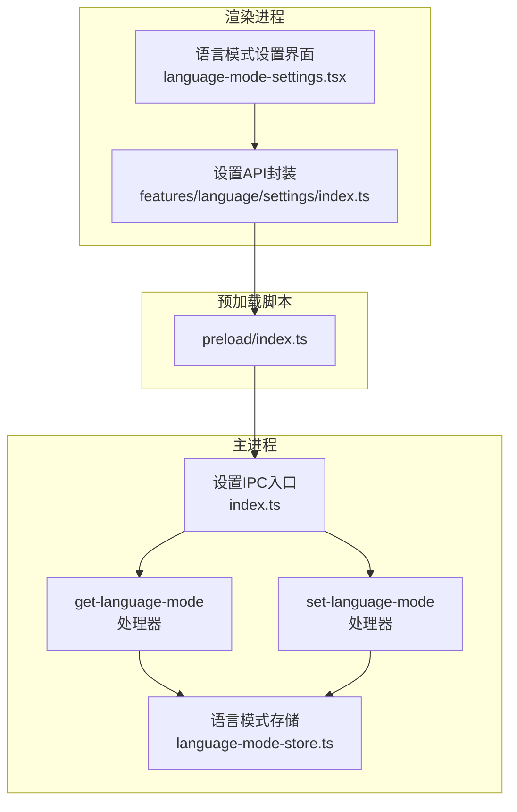
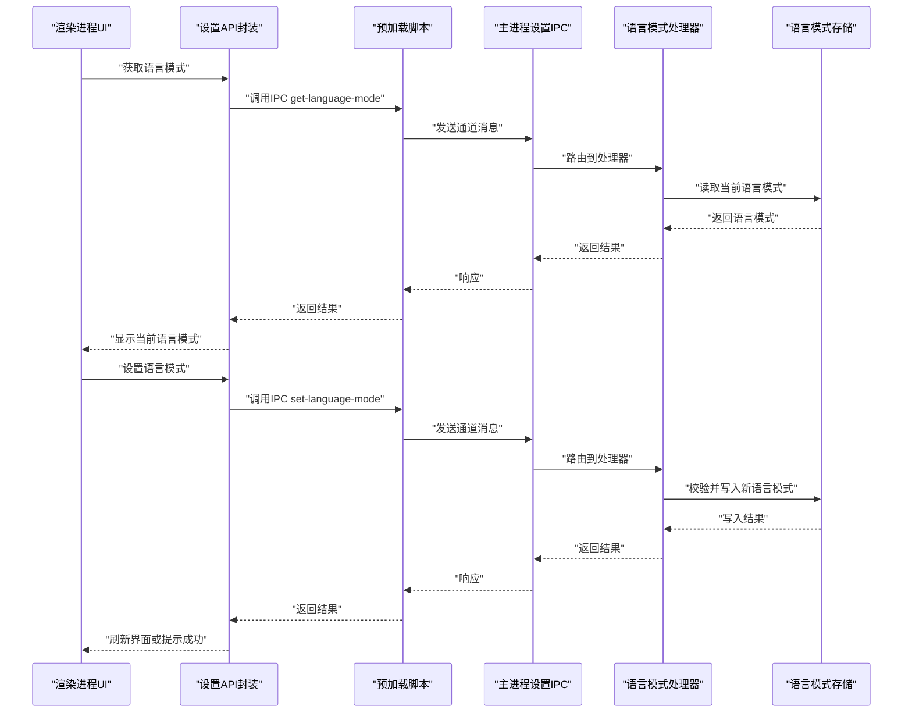
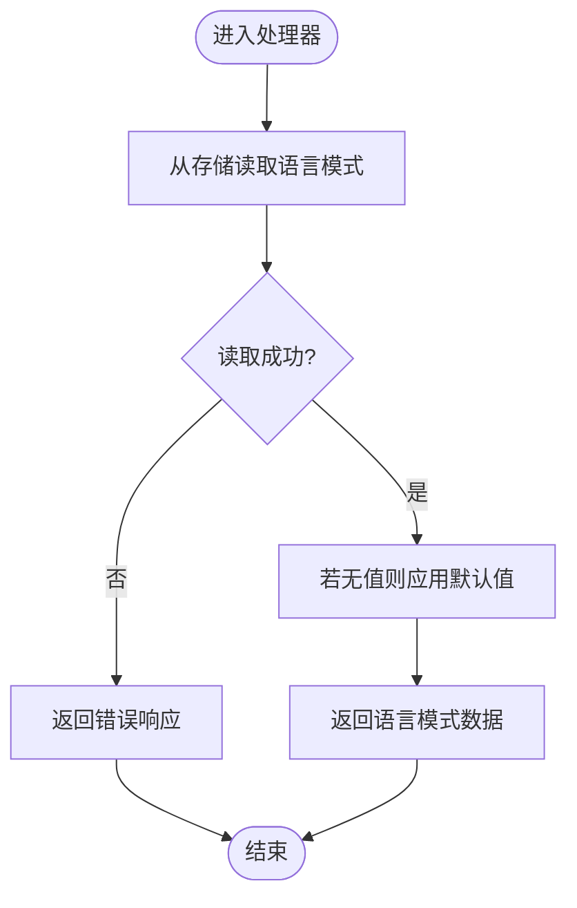
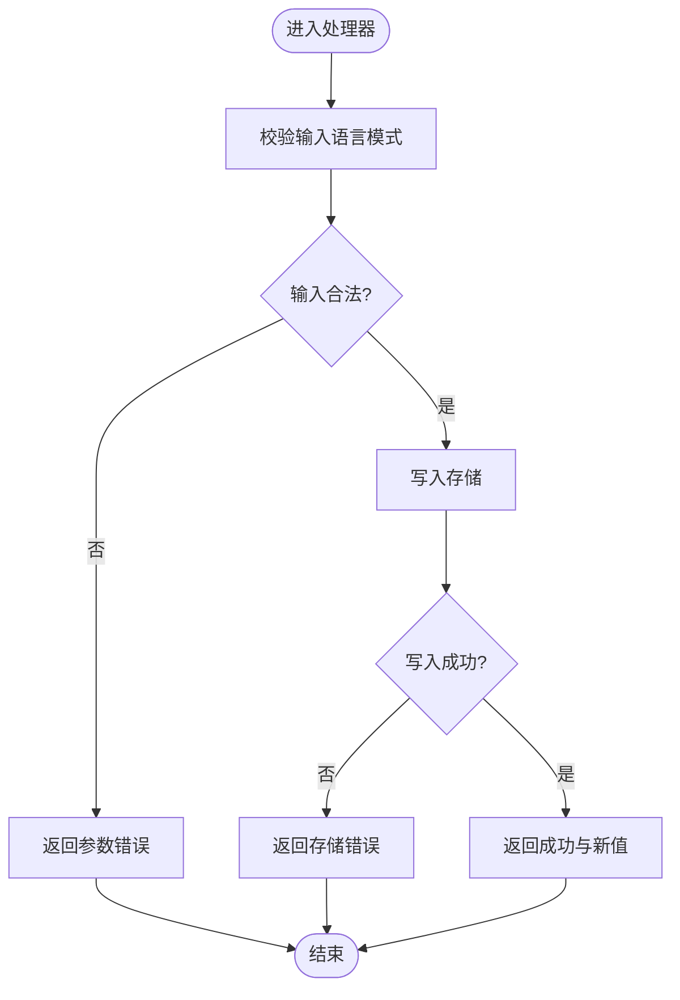
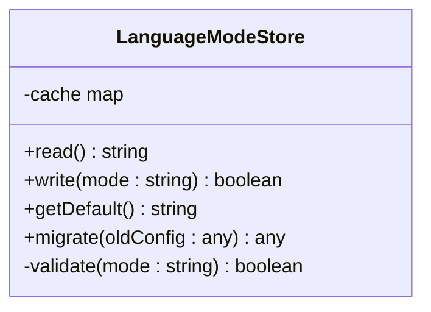

# 设置IPC通信

<cite>
**本文引用的文件**   
- [apps/desktop/src/main/ipc/settings/index.ts](file://apps/desktop/src/main/ipc/settings/index.ts)
- [apps/desktop/src/main/ipc/settings/handlers/get-language-mode.ts](file://apps/desktop/src/main/ipc/settings/handlers/get-language-mode.ts)
- [apps/desktop/src/main/ipc/settings/handlers/set-language-mode.ts](file://apps/desktop/src/main/ipc/settings/handlers/set-language-mode.ts)
- [apps/desktop/src/main/settings/language-mode-store.ts](file://apps/desktop/src/main/settings/language-mode-store.ts)
- [apps/desktop/src/shared/ipc/settings/types.ts](file://apps/desktop/src/shared/ipc/settings/types.ts)
- [apps/desktop/src/shared/i18n/language-mode.ts](file://apps/desktop/src/shared/i18n/language-mode.ts)
- [apps/desktop/src/preload/index.ts](file://apps/desktop/src/preload/index.ts)
- [apps/desktop/src/renderer/src/features/language/settings/index.ts](file://apps/desktop/src/renderer/src/features/language/settings/index.ts)
- [apps/desktop/src/renderer/src/features/language/settings/ui/language-mode-settings.tsx](file://apps/desktop/src/renderer/src/features/language/settings/ui/language-mode-settings.tsx)
</cite>

## 目录
1. [简介](#简介)
2. [项目结构](#项目结构)
3. [核心组件](#核心组件)
4. [架构总览](#架构总览)
5. [详细组件分析](#详细组件分析)
6. [依赖关系分析](#依赖关系分析)
7. [性能考虑](#性能考虑)
8. [故障排除指南](#故障排除指南)
9. [结论](#结论)
10. [附录](#附录)

## 简介
本文件面向nevix-ai桌面应用程序的设置IPC通信，聚焦用户偏好设置与语言模式管理。文档将详细说明：
- get-language-mode 与 set-language-mode 处理器实现细节
- 设置存储机制、数据验证与同步策略
- 配置文件结构与版本兼容性/迁移策略
- 设置读取、写入与状态管理的最佳实践
- 常见问题排查方法

## 项目结构
设置相关代码分布在主进程、预加载脚本与渲染进程三个层面：
- 主进程：IPC通道注册、设置处理器、持久化存储
- 预加载脚本：暴露安全的IPC接口给渲染进程
- 渲染进程：UI与业务逻辑调用IPC获取/更新语言模式

图表来源
- [apps/desktop/src/main/ipc/settings/index.ts](file://apps/desktop/src/main/ipc/settings/index.ts)
- [apps/desktop/src/main/ipc/settings/handlers/get-language-mode.ts](file://apps/desktop/src/main/ipc/settings/handlers/get-language-mode.ts)
- [apps/desktop/src/main/ipc/settings/handlers/set-language-mode.ts](file://apps/desktop/src/main/ipc/settings/handlers/set-language-mode.ts)
- [apps/desktop/src/main/settings/language-mode-store.ts](file://apps/desktop/src/main/settings/language-mode-store.ts)
- [apps/desktop/src/preload/index.ts](file://apps/desktop/src/preload/index.ts)
- [apps/desktop/src/renderer/src/features/language/settings/index.ts](file://apps/desktop/src/renderer/src/features/language/settings/index.ts)
- [apps/desktop/src/renderer/src/features/language/settings/ui/language-mode-settings.tsx](file://apps/desktop/src/renderer/src/features/language/settings/ui/language-mode-settings.tsx)

章节来源
- [apps/desktop/src/main/ipc/settings/index.ts](file://apps/desktop/src/main/ipc/settings/index.ts)
- [apps/desktop/src/main/ipc/settings/handlers/get-language-mode.ts](file://apps/desktop/src/main/ipc/settings/handlers/get-language-mode.ts)
- [apps/desktop/src/main/ipc/settings/handlers/set-language-mode.ts](file://apps/desktop/src/main/ipc/settings/handlers/set-language-mode.ts)
- [apps/desktop/src/main/settings/language-mode-store.ts](file://apps/desktop/src/main/settings/language-mode-store.ts)
- [apps/desktop/src/preload/index.ts](file://apps/desktop/src/preload/index.ts)
- [apps/desktop/src/renderer/src/features/language/settings/index.ts](file://apps/desktop/src/renderer/src/features/language/settings/index.ts)
- [apps/desktop/src/renderer/src/features/language/settings/ui/language-mode-settings.tsx](file://apps/desktop/src/renderer/src/features/language/settings/ui/language-mode-settings.tsx)

## 核心组件
- 设置IPC入口：集中注册设置相关的IPC通道与处理器
- 语言模式处理器：
  - get-language-mode：读取当前语言模式并返回
  - set-language-mode：接收新语言模式，校验后持久化并返回结果
- 语言模式存储：负责配置的读取、写入、默认值与版本兼容
- 共享类型定义：统一IPC请求/响应结构与语言模式枚举
- 预加载脚本：安全暴露IPC方法给渲染进程
- 渲染侧API与UI：封装调用与界面交互

章节来源
- [apps/desktop/src/main/ipc/settings/index.ts](file://apps/desktop/src/main/ipc/settings/index.ts)
- [apps/desktop/src/main/ipc/settings/handlers/get-language-mode.ts](file://apps/desktop/src/main/ipc/settings/handlers/get-language-mode.ts)
- [apps/desktop/src/main/ipc/settings/handlers/set-language-mode.ts](file://apps/desktop/src/main/ipc/settings/handlers/set-language-mode.ts)
- [apps/desktop/src/main/settings/language-mode-store.ts](file://apps/desktop/src/main/settings/language-mode-store.ts)
- [apps/desktop/src/shared/ipc/settings/types.ts](file://apps/desktop/src/shared/ipc/settings/types.ts)
- [apps/desktop/src/shared/i18n/language-mode.ts](file://apps/desktop/src/shared/i18n/language-mode.ts)
- [apps/desktop/src/preload/index.ts](file://apps/desktop/src/preload/index.ts)
- [apps/desktop/src/renderer/src/features/language/settings/index.ts](file://apps/desktop/src/renderer/src/features/language/settings/index.ts)
- [apps/desktop/src/renderer/src/features/language/settings/ui/language-mode-settings.tsx](file://apps/desktop/src/renderer/src/features/language/settings/ui/language-mode-settings.tsx)

## 架构总览
设置IPC采用“主进程持有唯一真实源”的架构：
- 渲染进程通过预加载脚本调用IPC方法
- 主进程处理器对输入进行校验，委托存储层读写配置
- 存储层保证默认值、版本兼容与原子写入
- 成功时返回最新状态，失败时返回错误信息

图表来源
- [apps/desktop/src/main/ipc/settings/index.ts](file://apps/desktop/src/main/ipc/settings/index.ts)
- [apps/desktop/src/main/ipc/settings/handlers/get-language-mode.ts](file://apps/desktop/src/main/ipc/settings/handlers/get-language-mode.ts)
- [apps/desktop/src/main/ipc/settings/handlers/set-language-mode.ts](file://apps/desktop/src/main/ipc/settings/handlers/set-language-mode.ts)
- [apps/desktop/src/main/settings/language-mode-store.ts](file://apps/desktop/src/main/settings/language-mode-store.ts)
- [apps/desktop/src/preload/index.ts](file://apps/desktop/src/preload/index.ts)
- [apps/desktop/src/renderer/src/features/language/settings/index.ts](file://apps/desktop/src/renderer/src/features/language/settings/index.ts)

## 详细组件分析

### 设置IPC入口（通道注册）
- 职责：集中注册设置相关IPC通道，将通道名映射到具体处理器
- 关键点：
  - 使用统一的通道命名空间，避免冲突
  - 处理器按功能拆分，便于维护与测试
  - 错误处理与日志记录在入口处统一兜底

章节来源
- [apps/desktop/src/main/ipc/settings/index.ts](file://apps/desktop/src/main/ipc/settings/index.ts)

### get-language-mode 处理器
- 职责：读取当前语言模式并返回
- 流程要点：
  - 从存储层读取语言模式
  - 若不存在则返回默认值
  - 返回结构化响应，包含状态与数据
- 错误处理：
  - 存储读取异常时返回错误码与消息
  - 保持响应结构一致，便于前端处理

图表来源
- [apps/desktop/src/main/ipc/settings/handlers/get-language-mode.ts](file://apps/desktop/src/main/ipc/settings/handlers/get-language-mode.ts)
- [apps/desktop/src/main/settings/language-mode-store.ts](file://apps/desktop/src/main/settings/language-mode-store.ts)

章节来源
- [apps/desktop/src/main/ipc/settings/handlers/get-language-mode.ts](file://apps/desktop/src/main/ipc/settings/handlers/get-language-mode.ts)
- [apps/desktop/src/main/settings/language-mode-store.ts](file://apps/desktop/src/main/settings/language-mode-store.ts)

### set-language-mode 处理器
- 职责：接收新语言模式，校验后持久化并返回结果
- 流程要点：
  - 参数校验：确保语言模式为合法枚举值
  - 写入存储：原子写入，失败回滚或抛出异常
  - 返回最新状态：包含是否成功及原因
- 错误处理：
  - 非法输入返回明确错误信息
  - 存储写入失败返回可重试的错误码

图表来源
- [apps/desktop/src/main/ipc/settings/handlers/set-language-mode.ts](file://apps/desktop/src/main/ipc/settings/handlers/set-language-mode.ts)
- [apps/desktop/src/main/settings/language-mode-store.ts](file://apps/desktop/src/main/settings/language-mode-store.ts)

章节来源
- [apps/desktop/src/main/ipc/settings/handlers/set-language-mode.ts](file://apps/desktop/src/main/ipc/settings/handlers/set-language-mode.ts)
- [apps/desktop/src/main/settings/language-mode-store.ts](file://apps/desktop/src/main/settings/language-mode-store.ts)

### 语言模式存储（持久化）
- 职责：提供语言模式的读取、写入、默认值与版本兼容
- 关键点：
  - 默认值：当配置缺失时返回默认语言模式
  - 版本兼容：支持旧格式迁移到新格式
  - 原子写入：确保写入一致性，失败不污染数据
  - 缓存：内存中缓存最近一次读取的值，提升性能

图表来源
- [apps/desktop/src/main/settings/language-mode-store.ts](file://apps/desktop/src/main/settings/language-mode-store.ts)

章节来源
- [apps/desktop/src/main/settings/language-mode-store.ts](file://apps/desktop/src/main/settings/language-mode-store.ts)

### 共享类型定义
- 职责：统一IPC请求/响应结构与语言模式枚举
- 关键点：
  - 定义语言模式枚举，确保前后端一致
  - 定义IPC请求/响应结构，便于类型检查
  - 复用类型减少重复定义

章节来源
- [apps/desktop/src/shared/ipc/settings/types.ts](file://apps/desktop/src/shared/ipc/settings/types.ts)
- [apps/desktop/src/shared/i18n/language-mode.ts](file://apps/desktop/src/shared/i18n/language-mode.ts)

### 预加载脚本（安全桥接）
- 职责：暴露安全的IPC方法给渲染进程
- 关键点：
  - 仅暴露必要的IPC方法
  - 屏蔽底层Electron细节
  - 错误透传与类型安全

章节来源
- [apps/desktop/src/preload/index.ts](file://apps/desktop/src/preload/index.ts)

### 渲染侧API与UI
- 职责：封装IPC调用并提供用户界面
- 关键点：
  - API封装：统一调用方式与错误处理
  - UI组件：展示当前语言模式并提供切换选项
  - 状态管理：本地状态与IPC响应同步

章节来源
- [apps/desktop/src/renderer/src/features/language/settings/index.ts](file://apps/desktop/src/renderer/src/features/language/settings/index.ts)
- [apps/desktop/src/renderer/src/features/language/settings/ui/language-mode-settings.tsx](file://apps/desktop/src/renderer/src/features/language/settings/ui/language-mode-settings.tsx)

## 依赖关系分析
设置IPC的依赖关系清晰分层：
- 渲染进程依赖预加载脚本暴露的API
- 预加载脚本依赖主进程IPC通道
- 主进程IPC依赖处理器与存储层
- 存储层依赖文件系统与配置格式

图表来源
- [apps/desktop/src/renderer/src/features/language/settings/index.ts](file://apps/desktop/src/renderer/src/features/language/settings/index.ts)
- [apps/desktop/src/preload/index.ts](file://apps/desktop/src/preload/index.ts)
- [apps/desktop/src/main/ipc/settings/index.ts](file://apps/desktop/src/main/ipc/settings/index.ts)
- [apps/desktop/src/main/ipc/settings/handlers/get-language-mode.ts](file://apps/desktop/src/main/ipc/settings/handlers/get-language-mode.ts)
- [apps/desktop/src/main/ipc/settings/handlers/set-language-mode.ts](file://apps/desktop/src/main/ipc/settings/handlers/set-language-mode.ts)
- [apps/desktop/src/main/settings/language-mode-store.ts](file://apps/desktop/src/main/settings/language-mode-store.ts)

章节来源
- [apps/desktop/src/renderer/src/features/language/settings/index.ts](file://apps/desktop/src/renderer/src/features/language/settings/index.ts)
- [apps/desktop/src/preload/index.ts](file://apps/desktop/src/preload/index.ts)
- [apps/desktop/src/main/ipc/settings/index.ts](file://apps/desktop/src/main/ipc/settings/index.ts)
- [apps/desktop/src/main/ipc/settings/handlers/get-language-mode.ts](file://apps/desktop/src/main/ipc/settings/handlers/get-language-mode.ts)
- [apps/desktop/src/main/ipc/settings/handlers/set-language-mode.ts](file://apps/desktop/src/main/ipc/settings/handlers/set-language-mode.ts)
- [apps/desktop/src/main/settings/language-mode-store.ts](file://apps/desktop/src/main/settings/language-mode-store.ts)

## 性能考虑
- 缓存策略：在存储层缓存最近一次读取的语言模式，减少磁盘IO
- 批量操作：避免频繁的小写操作，必要时合并写入
- 异步处理：IPC调用应异步执行，避免阻塞UI线程
- 错误重试：对网络或磁盘错误实现指数退避重试
- 资源清理：应用退出时释放缓存与文件句柄

## 故障排除指南
- 问题：无法读取语言模式
  - 检查存储文件是否存在且可读
  - 验证默认值逻辑是否正确
  - 查看IPC通道是否正确注册
- 问题：设置语言模式失败
  - 校验输入是否为合法枚举值
  - 检查存储写入权限与磁盘空间
  - 确认原子写入逻辑未抛出异常
- 问题：UI未同步更新
  - 确认IPC响应正确返回
  - 检查前端状态更新逻辑
  - 验证事件监听器是否正确绑定

章节来源
- [apps/desktop/src/main/ipc/settings/handlers/get-language-mode.ts](file://apps/desktop/src/main/ipc/settings/handlers/get-language-mode.ts)
- [apps/desktop/src/main/ipc/settings/handlers/set-language-mode.ts](file://apps/desktop/src/main/ipc/settings/handlers/set-language-mode.ts)
- [apps/desktop/src/main/settings/language-mode-store.ts](file://apps/desktop/src/main/settings/language-mode-store.ts)

## 结论
设置IPC通信通过清晰的层次划分与严格的类型定义，实现了可靠的语言模式管理。处理器负责输入校验与业务逻辑，存储层确保数据一致性与版本兼容，预加载脚本提供安全桥接，渲染进程提供友好界面。遵循本文档的最佳实践可有效提升系统的稳定性与可维护性。

## 附录

### 配置文件结构
- 字段：language_mode（字符串，枚举值）
- 默认值：根据系统语言或应用预设确定
- 版本字段：version（用于迁移判断）

### 版本兼容性与迁移策略
- 检测旧版本配置格式
- 自动迁移到新格式
- 保留用户自定义值
- 记录迁移日志以便调试

### 最佳实践
- 始终验证输入数据
- 使用原子写入确保一致性
- 实现合理的错误处理与重试机制
- 保持前后端类型定义一致
- 提供详细的错误信息便于调试

### 代码示例路径
- 设置读取示例：[apps/desktop/src/main/ipc/settings/handlers/get-language-mode.ts](file://apps/desktop/src/main/ipc/settings/handlers/get-language-mode.ts)
- 设置写入示例：[apps/desktop/src/main/ipc/settings/handlers/set-language-mode.ts](file://apps/desktop/src/main/ipc/settings/handlers/set-language-mode.ts)
- 存储实现示例：[apps/desktop/src/main/settings/language-mode-store.ts](file://apps/desktop/src/main/settings/language-mode-store.ts)
- 类型定义示例：[apps/desktop/src/shared/ipc/settings/types.ts](file://apps/desktop/src/shared/ipc/settings/types.ts)
- 预加载桥接示例：[apps/desktop/src/preload/index.ts](file://apps/desktop/src/preload/index.ts)
- 渲染API示例：[apps/desktop/src/renderer/src/features/language/settings/index.ts](file://apps/desktop/src/renderer/src/features/language/settings/index.ts)
- UI组件示例：[apps/desktop/src/renderer/src/features/language/settings/ui/language-mode-settings.tsx](file://apps/desktop/src/renderer/src/features/language/settings/ui/language-mode-settings.tsx)