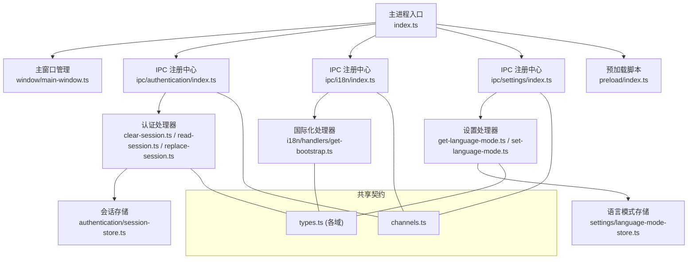
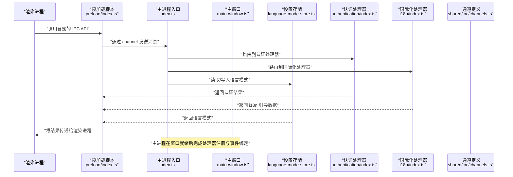
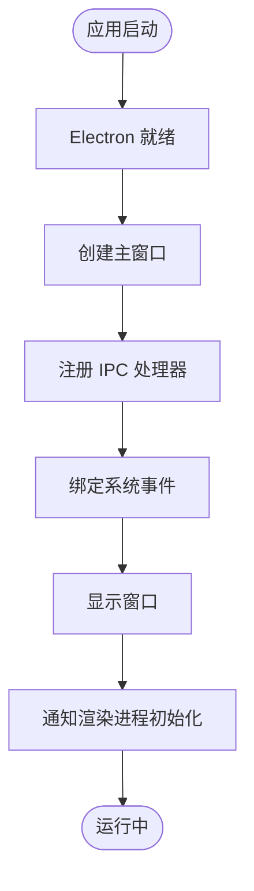
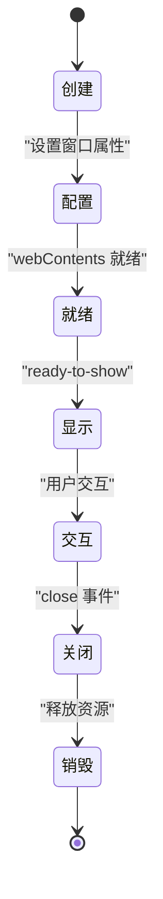
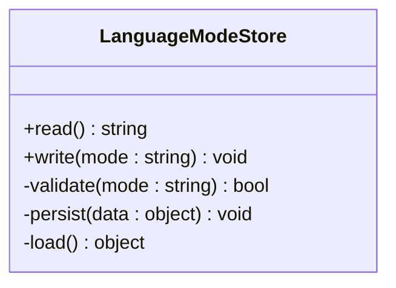
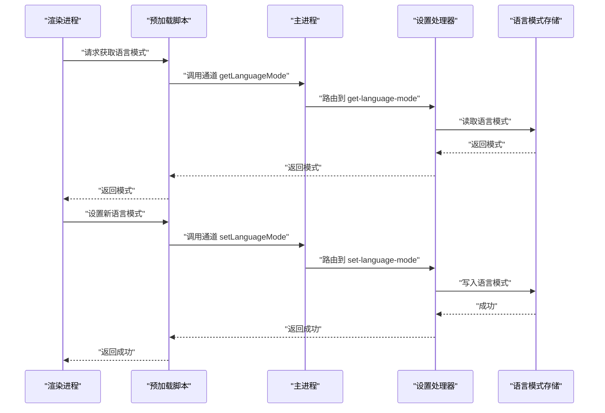
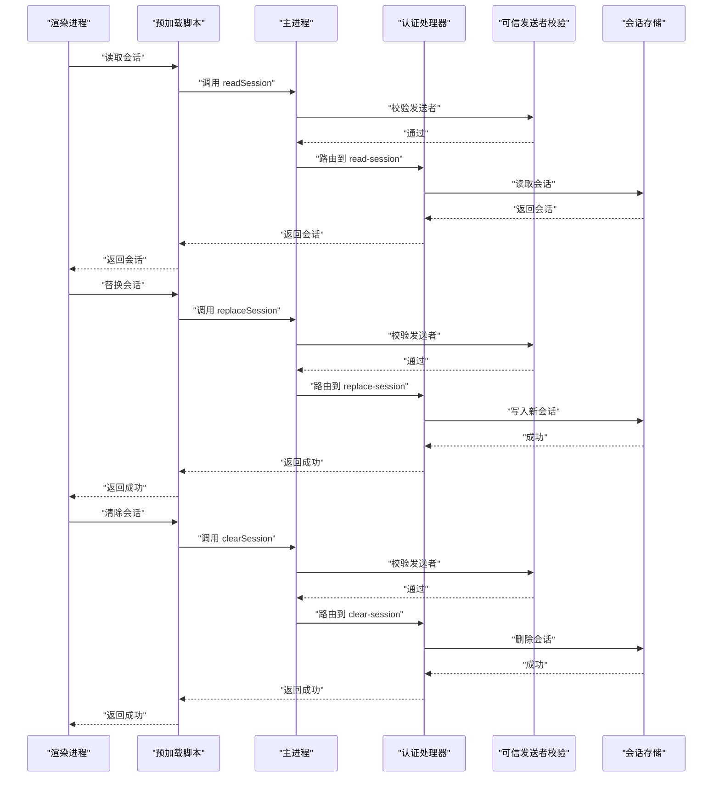
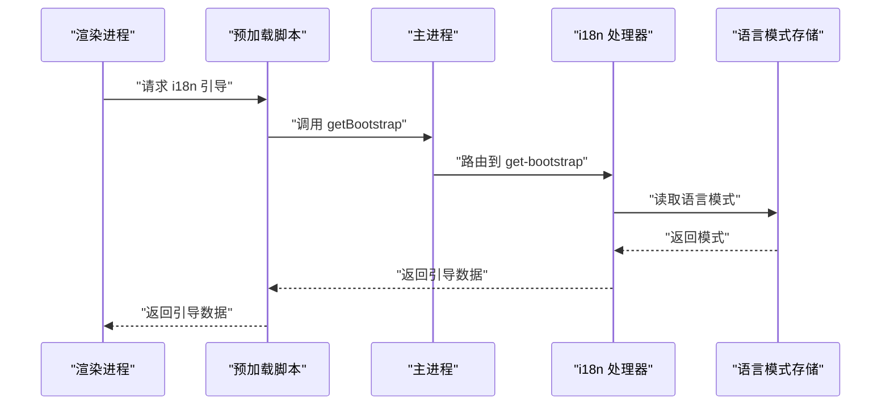
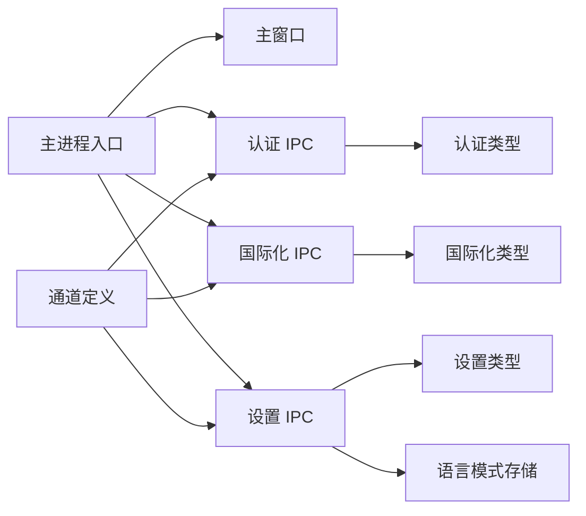

# 主进程管理

<cite>
**本文引用的文件**   
- [apps/desktop/src/main/index.ts](file://apps/desktop/src/main/index.ts)
- [apps/desktop/src/main/window/main-window.ts](file://apps/desktop/src/main/window/main-window.ts)
- [apps/desktop/src/main/settings/language-mode-store.ts](file://apps/desktop/src/main/settings/language-mode-store.ts)
- [apps/desktop/src/main/ipc/authentication/index.ts](file://apps/desktop/src/main/ipc/authentication/index.ts)
- [apps/desktop/src/main/ipc/authentication/clear-session.ts](file://apps/desktop/src/main/ipc/authentication/clear-session.ts)
- [apps/desktop/src/main/ipc/authentication/read-session.ts](file://apps/desktop/src/main/ipc/authentication/read-session.ts)
- [apps/desktop/src/main/ipc/authentication/replace-session.ts](file://apps/desktop/src/main/ipc/authentication/replace-session.ts)
- [apps/desktop/src/main/ipc/authentication/trusted-sender.ts](file://apps/desktop/src/main/ipc/authentication/trusted-sender.ts)
- [apps/desktop/src/main/ipc/i18n/index.ts](file://apps/desktop/src/main/ipc/i18n/index.ts)
- [apps/desktop/src/main/ipc/i18n/handlers/get-bootstrap.ts](file://apps/desktop/src/main/ipc/i18n/handlers/get-bootstrap.ts)
- [apps/desktop/src/main/ipc/settings/index.ts](file://apps/desktop/src/main/ipc/settings/index.ts)
- [apps/desktop/src/main/ipc/settings/handlers/get-language-mode.ts](file://apps/desktop/src/main/ipc/settings/handlers/get-language-mode.ts)
- [apps/desktop/src/main/ipc/settings/handlers/set-language-mode.ts](file://apps/desktop/src/main/ipc/settings/handlers/set-language-mode.ts)
- [apps/desktop/src/shared/ipc/channels.ts](file://apps/desktop/src/shared/ipc/channels.ts)
- [apps/desktop/src/shared/ipc/authentication/types.ts](file://apps/desktop/src/shared/ipc/authentication/types.ts)
- [apps/desktop/src/shared/ipc/i18n/types.ts](file://apps/desktop/src/shared/ipc/i18n/types.ts)
- [apps/desktop/src/shared/ipc/settings/types.ts](file://apps/desktop/src/shared/ipc/settings/types.ts)
- [apps/desktop/src/shared/i18n/language-mode.ts](file://apps/desktop/src/shared/i18n/language-mode.ts)
- [apps/desktop/src/preload/index.ts](file://apps/desktop/src/preload/index.ts)
</cite>

## 目录
1. [简介](#简介)
2. [项目结构](#项目结构)
3. [核心组件](#核心组件)
4. [架构总览](#架构总览)
5. [详细组件分析](#详细组件分析)
6. [依赖分析](#依赖分析)
7. [性能考虑](#性能考虑)
8. [故障排查指南](#故障排查指南)
9. [结论](#结论)
10. [附录](#附录)

## 简介
本文件面向 nevix-ai 桌面应用的主进程模块，系统性阐述主进程的初始化流程、窗口生命周期管理、设置存储机制、语言模式切换、会话管理与系统集成能力。文档同时覆盖 IPC 处理器注册、事件监听与消息路由，给出窗口创建、状态管理与资源清理的具体示例路径，并总结错误处理策略、日志记录与调试技巧，以及常见问题与解决方案。

## 项目结构
主进程代码位于 apps/desktop/src/main，按职责划分为：
- index.ts：主进程入口，负责 Electron 启动、窗口创建、IPC 注册与全局事件监听
- window/main-window.ts：主窗口实例化、显示与生命周期钩子
- settings/language-mode-store.ts：语言模式持久化存储（读写）
- ipc/*：按领域划分的 IPC 通道与处理器（认证、国际化、设置）
- shared/ipc/*：主进程与渲染进程共享的通道名与类型定义
- preload/index.ts：预加载脚本，暴露安全 API 给渲染进程

图表来源
- [apps/desktop/src/main/index.ts](file://apps/desktop/src/main/index.ts)
- [apps/desktop/src/main/window/main-window.ts](file://apps/desktop/src/main/window/main-window.ts)
- [apps/desktop/src/main/ipc/authentication/index.ts](file://apps/desktop/src/main/ipc/authentication/index.ts)
- [apps/desktop/src/main/ipc/i18n/index.ts](file://apps/desktop/src/main/ipc/i18n/index.ts)
- [apps/desktop/src/main/ipc/settings/index.ts](file://apps/desktop/src/main/ipc/settings/index.ts)
- [apps/desktop/src/main/ipc/authentication/clear-session.ts](file://apps/desktop/src/main/ipc/authentication/clear-session.ts)
- [apps/desktop/src/main/ipc/authentication/read-session.ts](file://apps/desktop/src/main/ipc/authentication/read-session.ts)
- [apps/desktop/src/main/ipc/authentication/replace-session.ts](file://apps/desktop/src/main/ipc/authentication/replace-session.ts)
- [apps/desktop/src/main/ipc/i18n/handlers/get-bootstrap.ts](file://apps/desktop/src/main/ipc/i18n/handlers/get-bootstrap.ts)
- [apps/desktop/src/main/ipc/settings/handlers/get-language-mode.ts](file://apps/desktop/src/main/ipc/settings/handlers/get-language-mode.ts)
- [apps/desktop/src/main/ipc/settings/handlers/set-language-mode.ts](file://apps/desktop/src/main/ipc/settings/handlers/set-language-mode.ts)
- [apps/desktop/src/shared/ipc/channels.ts](file://apps/desktop/src/shared/ipc/channels.ts)
- [apps/desktop/src/shared/ipc/authentication/types.ts](file://apps/desktop/src/shared/ipc/authentication/types.ts)
- [apps/desktop/src/shared/ipc/i18n/types.ts](file://apps/desktop/src/shared/ipc/i18n/types.ts)
- [apps/desktop/src/shared/ipc/settings/types.ts](file://apps/desktop/src/shared/ipc/settings/types.ts)

章节来源
- [apps/desktop/src/main/index.ts](file://apps/desktop/src/main/index.ts)
- [apps/desktop/src/main/window/main-window.ts](file://apps/desktop/src/main/window/main-window.ts)
- [apps/desktop/src/main/settings/language-mode-store.ts](file://apps/desktop/src/main/settings/language-mode-store.ts)
- [apps/desktop/src/main/ipc/authentication/index.ts](file://apps/desktop/src/main/ipc/authentication/index.ts)
- [apps/desktop/src/main/ipc/i18n/index.ts](file://apps/desktop/src/main/ipc/i18n/index.ts)
- [apps/desktop/src/main/ipc/settings/index.ts](file://apps/desktop/src/main/ipc/settings/index.ts)
- [apps/desktop/src/shared/ipc/channels.ts](file://apps/desktop/src/shared/ipc/channels.ts)

## 核心组件
- 主进程入口与初始化
  - 负责 Electron 就绪后创建主窗口、注册 IPC 处理器、绑定系统级事件（如退出、隐藏等），确保渲染进程可用后再进行 UI 初始化。
- 主窗口管理
  - 封装 BrowserWindow 的创建、配置、显示与销毁；在合适时机注入预加载脚本与页面内容；处理窗口关闭时的资源释放。
- 设置存储（语言模式）
  - 提供跨进程一致的语言模式读取与写入接口，支持默认值回退与异常保护。
- IPC 处理器（认证、国际化、设置）
  - 通过 channels.ts 定义的通道名与 types.ts 的类型约束，实现安全的请求-响应路由；认证处理器包含可信发送者校验与会话操作。

章节来源
- [apps/desktop/src/main/index.ts](file://apps/desktop/src/main/index.ts)
- [apps/desktop/src/main/window/main-window.ts](file://apps/desktop/src/main/window/main-window.ts)
- [apps/desktop/src/main/settings/language-mode-store.ts](file://apps/desktop/src/main/settings/language-mode-store.ts)
- [apps/desktop/src/main/ipc/authentication/index.ts](file://apps/desktop/src/main/ipc/authentication/index.ts)
- [apps/desktop/src/main/ipc/i18n/index.ts](file://apps/desktop/src/main/ipc/i18n/index.ts)
- [apps/desktop/src/main/ipc/settings/index.ts](file://apps/desktop/src/main/ipc/settings/index.ts)
- [apps/desktop/src/shared/ipc/channels.ts](file://apps/desktop/src/shared/ipc/channels.ts)

## 架构总览
下图展示主进程与渲染进程之间的通信边界、IPC 通道与处理器组织方式，以及关键数据流向。

图表来源
- [apps/desktop/src/preload/index.ts](file://apps/desktop/src/preload/index.ts)
- [apps/desktop/src/main/index.ts](file://apps/desktop/src/main/index.ts)
- [apps/desktop/src/main/window/main-window.ts](file://apps/desktop/src/main/window/main-window.ts)
- [apps/desktop/src/main/ipc/authentication/index.ts](file://apps/desktop/src/main/ipc/authentication/index.ts)
- [apps/desktop/src/main/ipc/i18n/index.ts](file://apps/desktop/src/main/ipc/i18n/index.ts)
- [apps/desktop/src/main/settings/language-mode-store.ts](file://apps/desktop/src/main/settings/language-mode-store.ts)
- [apps/desktop/src/shared/ipc/channels.ts](file://apps/desktop/src/shared/ipc/channels.ts)

## 详细组件分析

### 主进程入口与初始化流程
- 启动阶段
  - 等待 Electron 就绪后创建主窗口，并在窗口 ready-to-show 或 webContents-ready 时触发渲染侧初始化。
- IPC 注册
  - 集中注册认证、国际化、设置三大域的处理器，统一使用 channels.ts 中的通道名进行路由。
- 系统事件
  - 监听应用退出、窗口最小化/隐藏等系统事件，保证用户体验与资源释放。

图表来源
- [apps/desktop/src/main/index.ts](file://apps/desktop/src/main/index.ts)
- [apps/desktop/src/main/window/main-window.ts](file://apps/desktop/src/main/window/main-window.ts)

章节来源
- [apps/desktop/src/main/index.ts](file://apps/desktop/src/main/index.ts)
- [apps/desktop/src/main/window/main-window.ts](file://apps/desktop/src/main/window/main-window.ts)

### 窗口生命周期管理
- 创建与配置
  - 设置窗口尺寸、标题、是否可调整大小、背景透明等属性；注入预加载脚本以暴露安全 API。
- 显示与就绪
  - 在合适的时机显示窗口，避免白屏闪烁；在 webContents 就绪后执行必要的初始化。
- 关闭与销毁
  - 处理 close 事件，清理定时器、断开连接、释放内存；必要时阻止默认关闭行为以实现最小化到托盘。

图表来源
- [apps/desktop/src/main/window/main-window.ts](file://apps/desktop/src/main/window/main-window.ts)

章节来源
- [apps/desktop/src/main/window/main-window.ts](file://apps/desktop/src/main/window/main-window.ts)

### 设置存储机制（语言模式）
- 存储位置
  - 使用本地配置文件或 Electron 的 app.getPath('userData') 下的 JSON 文件进行持久化。
- 读写语义
  - 读取时若不存在则返回默认值；写入时进行基本校验与异常保护，失败不中断主流程。
- 变更传播
  - 设置变更后通过 IPC 向渲染进程广播，驱动界面语言切换。

图表来源
- [apps/desktop/src/main/settings/language-mode-store.ts](file://apps/desktop/src/main/settings/language-mode-store.ts)

章节来源
- [apps/desktop/src/main/settings/language-mode-store.ts](file://apps/desktop/src/main/settings/language-mode-store.ts)

### 语言模式切换（设置域 IPC）
- 通道与类型
  - 通过 shared/ipc/settings/types.ts 定义请求/响应结构，channels.ts 定义通道名。
- 处理器逻辑
  - get-language-mode：从存储读取当前语言模式并返回。
  - set-language-mode：校验输入、更新存储、向渲染进程广播变更。

图表来源
- [apps/desktop/src/main/ipc/settings/index.ts](file://apps/desktop/src/main/ipc/settings/index.ts)
- [apps/desktop/src/main/ipc/settings/handlers/get-language-mode.ts](file://apps/desktop/src/main/ipc/settings/handlers/get-language-mode.ts)
- [apps/desktop/src/main/ipc/settings/handlers/set-language-mode.ts](file://apps/desktop/src/main/ipc/settings/handlers/set-language-mode.ts)
- [apps/desktop/src/main/settings/language-mode-store.ts](file://apps/desktop/src/main/settings/language-mode-store.ts)
- [apps/desktop/src/shared/ipc/channels.ts](file://apps/desktop/src/shared/ipc/channels.ts)
- [apps/desktop/src/shared/ipc/settings/types.ts](file://apps/desktop/src/shared/ipc/settings/types.ts)

章节来源
- [apps/desktop/src/main/ipc/settings/index.ts](file://apps/desktop/src/main/ipc/settings/index.ts)
- [apps/desktop/src/main/ipc/settings/handlers/get-language-mode.ts](file://apps/desktop/src/main/ipc/settings/handlers/get-language-mode.ts)
- [apps/desktop/src/main/ipc/settings/handlers/set-language-mode.ts](file://apps/desktop/src/main/ipc/settings/handlers/set-language-mode.ts)
- [apps/desktop/src/main/settings/language-mode-store.ts](file://apps/desktop/src/main/settings/language-mode-store.ts)
- [apps/desktop/src/shared/ipc/channels.ts](file://apps/desktop/src/shared/ipc/channels.ts)
- [apps/desktop/src/shared/ipc/settings/types.ts](file://apps/desktop/src/shared/ipc/settings/types.ts)

### 会话管理（认证域 IPC）
- 通道与类型
  - 通过 shared/ipc/authentication/types.ts 定义会话数据结构与操作类型，channels.ts 定义通道名。
- 处理器逻辑
  - read-session：读取当前会话信息。
  - replace-session：替换会话（登录/刷新）。
  - clear-session：清除会话（登出）。
  - trusted-sender：校验发送者身份，防止恶意注入。

图表来源
- [apps/desktop/src/main/ipc/authentication/index.ts](file://apps/desktop/src/main/ipc/authentication/index.ts)
- [apps/desktop/src/main/ipc/authentication/read-session.ts](file://apps/desktop/src/main/ipc/authentication/read-session.ts)
- [apps/desktop/src/main/ipc/authentication/replace-session.ts](file://apps/desktop/src/main/ipc/authentication/replace-session.ts)
- [apps/desktop/src/main/ipc/authentication/clear-session.ts](file://apps/desktop/src/main/ipc/authentication/clear-session.ts)
- [apps/desktop/src/main/ipc/authentication/trusted-sender.ts](file://apps/desktop/src/main/ipc/authentication/trusted-sender.ts)
- [apps/desktop/src/shared/ipc/channels.ts](file://apps/desktop/src/shared/ipc/channels.ts)
- [apps/desktop/src/shared/ipc/authentication/types.ts](file://apps/desktop/src/shared/ipc/authentication/types.ts)

章节来源
- [apps/desktop/src/main/ipc/authentication/index.ts](file://apps/desktop/src/main/ipc/authentication/index.ts)
- [apps/desktop/src/main/ipc/authentication/read-session.ts](file://apps/desktop/src/main/ipc/authentication/read-session.ts)
- [apps/desktop/src/main/ipc/authentication/replace-session.ts](file://apps/desktop/src/main/ipc/authentication/replace-session.ts)
- [apps/desktop/src/main/ipc/authentication/clear-session.ts](file://apps/desktop/src/main/ipc/authentication/clear-session.ts)
- [apps/desktop/src/main/ipc/authentication/trusted-sender.ts](file://apps/desktop/src/main/ipc/authentication/trusted-sender.ts)
- [apps/desktop/src/shared/ipc/channels.ts](file://apps/desktop/src/shared/ipc/channels.ts)
- [apps/desktop/src/shared/ipc/authentication/types.ts](file://apps/desktop/src/shared/ipc/authentication/types.ts)

### 国际化引导（i18n 域 IPC）
- 通道与类型
  - 通过 shared/ipc/i18n/types.ts 定义引导数据结构，channels.ts 定义通道名。
- 处理器逻辑
  - get-bootstrap：根据当前语言模式返回所需的翻译资源与初始配置，供渲染进程初始化 i18n。

图表来源
- [apps/desktop/src/main/ipc/i18n/index.ts](file://apps/desktop/src/main/ipc/i18n/index.ts)
- [apps/desktop/src/main/ipc/i18n/handlers/get-bootstrap.ts](file://apps/desktop/src/main/ipc/i18n/handlers/get-bootstrap.ts)
- [apps/desktop/src/main/settings/language-mode-store.ts](file://apps/desktop/src/main/settings/language-mode-store.ts)
- [apps/desktop/src/shared/ipc/channels.ts](file://apps/desktop/src/shared/ipc/channels.ts)
- [apps/desktop/src/shared/ipc/i18n/types.ts](file://apps/desktop/src/shared/ipc/i18n/types.ts)

章节来源
- [apps/desktop/src/main/ipc/i18n/index.ts](file://apps/desktop/src/main/ipc/i18n/index.ts)
- [apps/desktop/src/main/ipc/i18n/handlers/get-bootstrap.ts](file://apps/desktop/src/main/ipc/i18n/handlers/get-bootstrap.ts)
- [apps/desktop/src/main/settings/language-mode-store.ts](file://apps/desktop/src/main/settings/language-mode-store.ts)
- [apps/desktop/src/shared/ipc/channels.ts](file://apps/desktop/src/shared/ipc/channels.ts)
- [apps/desktop/src/shared/ipc/i18n/types.ts](file://apps/desktop/src/shared/ipc/i18n/types.ts)

### 预加载脚本与安全边界
- 作用
  - 在渲染进程中暴露最小化的 IPC API，屏蔽 Node/Electron 内部对象，降低安全风险。
- 设计要点
  - 仅暴露必要方法；对通道名与参数进行严格校验；对敏感操作（如会话替换）增加可信发送者校验。

章节来源
- [apps/desktop/src/preload/index.ts](file://apps/desktop/src/preload/index.ts)
- [apps/desktop/src/shared/ipc/channels.ts](file://apps/desktop/src/shared/ipc/channels.ts)

## 依赖分析
- 模块耦合
  - 主进程入口依赖窗口管理、IPC 注册与各域处理器；IPC 处理器依赖共享通道与类型定义；设置处理器依赖语言模式存储。
- 外部依赖
  - Electron 提供的 BrowserWindow、app、ipcMain 等；文件系统用于持久化设置与会话。
- 潜在循环依赖
  - 通过 channels.ts 与 types.ts 解耦主/渲染端；处理器之间无直接相互调用，降低循环风险。

图表来源
- [apps/desktop/src/main/index.ts](file://apps/desktop/src/main/index.ts)
- [apps/desktop/src/main/window/main-window.ts](file://apps/desktop/src/main/window/main-window.ts)
- [apps/desktop/src/main/ipc/authentication/index.ts](file://apps/desktop/src/main/ipc/authentication/index.ts)
- [apps/desktop/src/main/ipc/i18n/index.ts](file://apps/desktop/src/main/ipc/i18n/index.ts)
- [apps/desktop/src/main/ipc/settings/index.ts](file://apps/desktop/src/main/ipc/settings/index.ts)
- [apps/desktop/src/main/settings/language-mode-store.ts](file://apps/desktop/src/main/settings/language-mode-store.ts)
- [apps/desktop/src/shared/ipc/channels.ts](file://apps/desktop/src/shared/ipc/channels.ts)
- [apps/desktop/src/shared/ipc/authentication/types.ts](file://apps/desktop/src/shared/ipc/authentication/types.ts)
- [apps/desktop/src/shared/ipc/i18n/types.ts](file://apps/desktop/src/shared/ipc/i18n/types.ts)
- [apps/desktop/src/shared/ipc/settings/types.ts](file://apps/desktop/src/shared/ipc/settings/types.ts)

章节来源
- [apps/desktop/src/main/index.ts](file://apps/desktop/src/main/index.ts)
- [apps/desktop/src/shared/ipc/channels.ts](file://apps/desktop/src/shared/ipc/channels.ts)

## 性能考虑
- 窗口创建优化
  - 延迟加载非关键资源；使用 ready-to-show 控制首次绘制时机，减少白屏时间。
- IPC 路由效率
  - 处理器按域拆分，避免单点阻塞；对高频调用（如语言模式读取）可做轻量缓存。
- 存储访问
  - 读写设置与会话时进行异常保护与重试策略；避免在主线程执行耗时 IO。
- 内存管理
  - 窗口关闭时及时释放事件监听器、定时器与大对象引用，防止内存泄漏。

[本节为通用指导，无需特定文件来源]

## 故障排查指南
- 常见问题
  - 语言模式未生效：检查语言模式存储是否存在、默认值回退是否正确；确认 i18n 引导数据已正确返回。
  - 会话读取为空：确认会话存储路径权限、序列化格式；检查替换/清除操作是否成功。
  - IPC 调用失败：核对通道名与类型定义一致性；检查预加载脚本是否暴露对应 API。
  - 窗口无法显示：检查 ready-to-show 与 webContents 就绪顺序；确认预加载脚本加载成功。
- 调试技巧
  - 启用 Electron 调试端口，结合浏览器 DevTools 查看渲染进程日志。
  - 在主进程添加结构化日志，记录 IPC 调用链路、参数与返回值。
  - 使用最小化复现用例，逐步隔离问题域（设置/认证/i18n）。
- 错误处理策略
  - 所有存储与 IPC 调用包裹 try/catch，记录错误上下文；对用户可见错误提供友好提示。
  - 对敏感操作（如会话替换）增加可信发送者校验，失败时拒绝并记录审计日志。

章节来源
- [apps/desktop/src/main/ipc/authentication/trusted-sender.ts](file://apps/desktop/src/main/ipc/authentication/trusted-sender.ts)
- [apps/desktop/src/main/settings/language-mode-store.ts](file://apps/desktop/src/main/settings/language-mode-store.ts)
- [apps/desktop/src/main/ipc/settings/handlers/get-language-mode.ts](file://apps/desktop/src/main/ipc/settings/handlers/get-language-mode.ts)
- [apps/desktop/src/main/ipc/settings/handlers/set-language-mode.ts](file://apps/desktop/src/main/ipc/settings/handlers/set-language-mode.ts)
- [apps/desktop/src/main/ipc/i18n/handlers/get-bootstrap.ts](file://apps/desktop/src/main/ipc/i18n/handlers/get-bootstrap.ts)
- [apps/desktop/src/main/window/main-window.ts](file://apps/desktop/src/main/window/main-window.ts)

## 结论
nevix-ai 主进程模块采用清晰的模块化与分层设计：入口负责启动与装配，窗口管理封装生命周期，IPC 处理器按域划分并通过共享契约解耦。语言模式与会话管理通过持久化存储与 IPC 通道实现跨进程一致性。整体架构具备良好的可扩展性与安全性，适合持续迭代与团队协作。

[本节为总结性内容，无需特定文件来源]

## 附录
- 最佳实践
  - 始终使用 channels.ts 与 types.ts 维护通道与类型契约，避免硬编码。
  - 对敏感操作实施可信发送者校验与最小权限原则。
  - 在窗口关闭时显式释放资源，避免内存泄漏。
- 参考示例路径
  - 窗口创建与显示：见 [apps/desktop/src/main/window/main-window.ts](file://apps/desktop/src/main/window/main-window.ts)
  - 语言模式读取/写入：见 [apps/desktop/src/main/ipc/settings/handlers/get-language-mode.ts](file://apps/desktop/src/main/ipc/settings/handlers/get-language-mode.ts)、[apps/desktop/src/main/ipc/settings/handlers/set-language-mode.ts](file://apps/desktop/src/main/ipc/settings/handlers/set-language-mode.ts)
  - 会话读取/替换/清除：见 [apps/desktop/src/main/ipc/authentication/read-session.ts](file://apps/desktop/src/main/ipc/authentication/read-session.ts)、[apps/desktop/src/main/ipc/authentication/replace-session.ts](file://apps/desktop/src/main/ipc/authentication/replace-session.ts)、[apps/desktop/src/main/ipc/authentication/clear-session.ts](file://apps/desktop/src/main/ipc/authentication/clear-session.ts)
  - i18n 引导：见 [apps/desktop/src/main/ipc/i18n/handlers/get-bootstrap.ts](file://apps/desktop/src/main/ipc/i18n/handlers/get-bootstrap.ts)
  - 预加载脚本：见 [apps/desktop/src/preload/index.ts](file://apps/desktop/src/preload/index.ts)