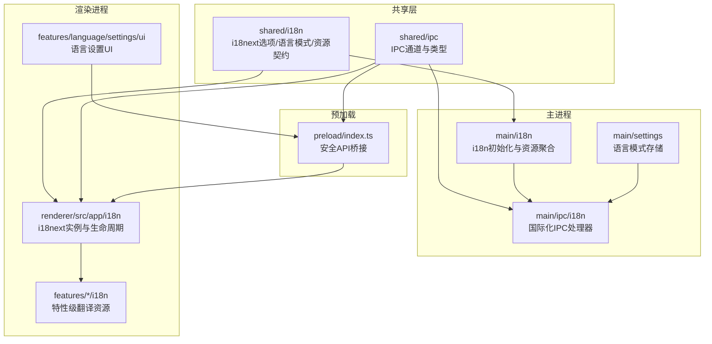
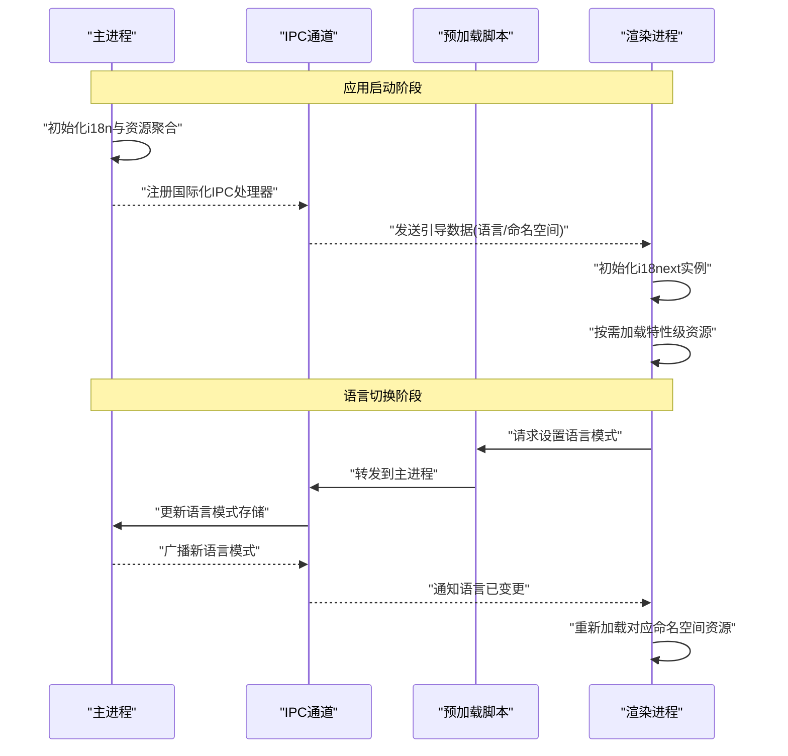
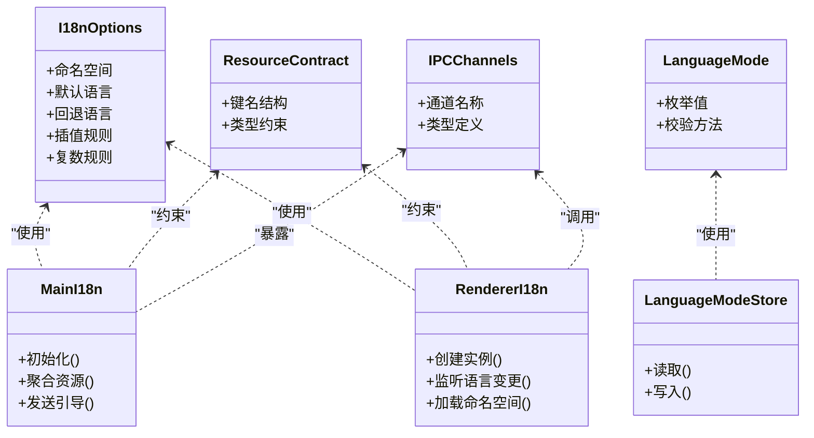
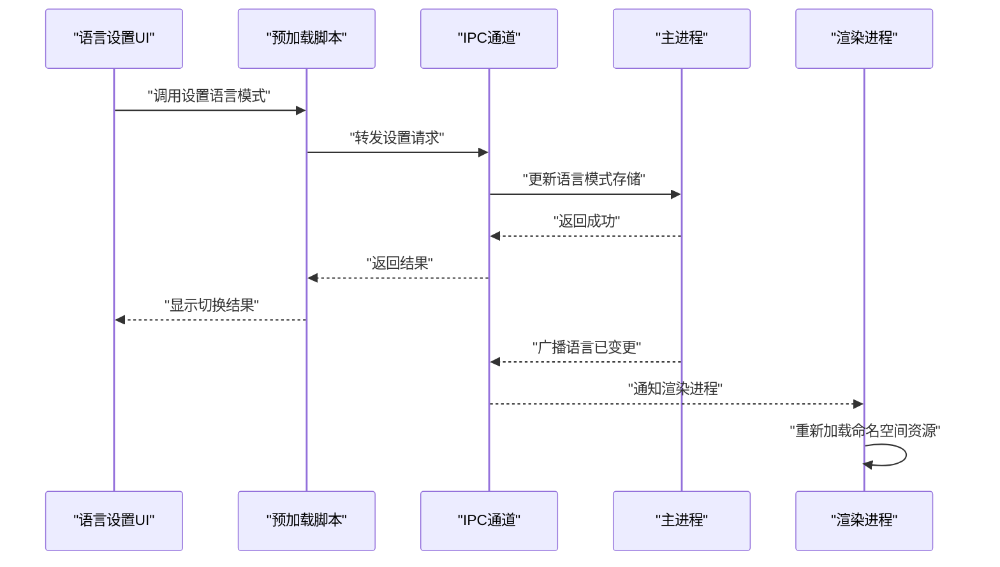
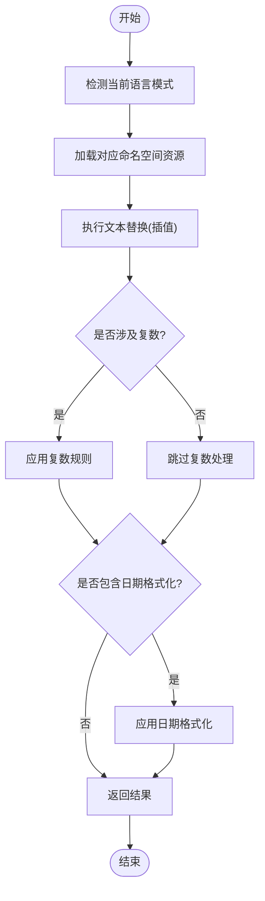
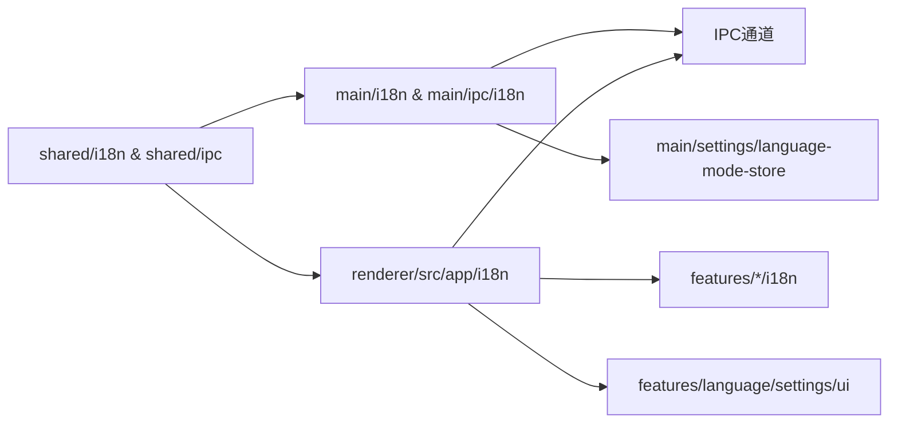

# 国际化支持

<cite>
**本文档引用的文件**   
- [apps/desktop/src/main/i18n/index.ts](file://apps/desktop/src/main/i18n/index.ts)
- [apps/desktop/src/main/i18n/resources.ts](file://apps/desktop/src/main/i18n/resources.ts)
- [apps/desktop/src/main/ipc/i18n/handlers/get-bootstrap.ts](file://apps/desktop/src/main/ipc/i18n/handlers/get-bootstrap.ts)
- [apps/desktop/src/main/ipc/i18n/index.ts](file://apps/desktop/src/main/ipc/i18n/index.ts)
- [apps/desktop/src/main/settings/language-mode-store.ts](file://apps/desktop/src/main/settings/language-mode-store.ts)
- [apps/desktop/src/preload/index.ts](file://apps/desktop/src/preload/index.ts)
- [apps/desktop/src/renderer/src/app/i18n/index.ts](file://apps/desktop/src/renderer/src/app/i18n/index.ts)
- [apps/desktop/src/renderer/src/app/i18n/renderer-i18n.ts](file://apps/desktop/src/renderer/src/app/i18n/renderer-i18n.ts)
- [apps/desktop/src/shared/i18n/i18next-options.ts](file://apps/desktop/src/shared/i18n/i18next-options.ts)
- [apps/desktop/src/shared/i18n/language-mode.ts](file://apps/desktop/src/shared/i18n/language-mode.ts)
- [apps/desktop/src/shared/i18n/resource-contract.ts](file://apps/desktop/src/shared/i18n/resource-contract.ts)
- [apps/desktop/src/shared/ipc/channels.ts](file://apps/desktop/src/shared/ipc/channels.ts)
- [apps/desktop/src/shared/ipc/i18n/types.ts](file://apps/desktop/src/shared/ipc/i18n/types.ts)
- [apps/desktop/src/renderer/src/features/authentication/i18n/resources.ts](file://apps/desktop/src/renderer/src/features/authentication/i18n/resources.ts)
- [apps/desktop/src/renderer/src/features/language/settings/ui/language-mode-settings.tsx](file://apps/desktop/src/renderer/src/features/language/settings/ui/language-mode-settings.tsx)
- [apps/desktop/src/renderer/src/features/language/settings/i18n.ts](file://apps/desktop/src/renderer/src/features/language/settings/i18n.ts)
- [apps/desktop/docs/adr/0001-feature-owned-localization-resources.md](file://apps/desktop/docs/adr/0001-feature-owned-localization-resources.md)
- [apps/desktop/docs/adr/0002-main-process-owns-language-mode.md](file://apps/desktop/docs/adr/0002-main-process-owns-language-mode.md)
</cite>

## 目录
1. [简介](#简介)
2. [项目结构](#项目结构)
3. [核心组件](#核心组件)
4. [架构总览](#架构总览)
5. [详细组件分析](#详细组件分析)
6. [依赖关系分析](#依赖关系分析)
7. [性能考虑](#性能考虑)
8. [故障排查指南](#故障排查指南)
9. [结论](#结论)
10. [附录](#附录)

## 简介
本文件为 nevix-ai 桌面应用程序的国际化（i18n）支持提供系统化文档。内容覆盖 i18next 配置、语言模式切换与多语言资源管理，主进程与渲染进程的国际化同步机制，翻译文件格式、动态加载与缓存策略，以及文本替换、复数处理、日期格式化的实践示例。同时包含语言检测、回退机制、性能优化建议与常见问题解决方案，帮助开发者快速理解并高效扩展应用的国际化能力。

## 项目结构
本项目采用 Electron 架构，将国际化能力拆分为“共享层”、“主进程”、“预加载脚本”和“渲染进程”，并通过 IPC 通道实现跨进程通信。关键目录与职责如下：
- shared/i18n：定义 i18next 通用选项、语言模式类型与资源契约，供主进程与渲染进程复用。
- main/i18n：主进程中的 i18n 初始化与资源聚合，负责启动时引导渲染进程的语言状态。
- main/ipc/i18n：主进程暴露的国际化相关 IPC 处理器，用于响应渲染进程的请求。
- preload/index.ts：安全桥接，向渲染进程暴露受控的国际化 API。
- renderer/src/app/i18n：渲染进程侧的 i18next 实例化与生命周期管理。
- features/*/i18n：按功能域组织翻译资源，遵循“特性拥有资源”的设计原则。
- settings：语言模式设置 UI 与持久化存储，驱动应用级语言切换。

图表来源
- [apps/desktop/src/shared/i18n/i18next-options.ts](file://apps/desktop/src/shared/i18n/i18next-options.ts)
- [apps/desktop/src/shared/i18n/language-mode.ts](file://apps/desktop/src/shared/i18n/language-mode.ts)
- [apps/desktop/src/shared/i18n/resource-contract.ts](file://apps/desktop/src/shared/i18n/resource-contract.ts)
- [apps/desktop/src/shared/ipc/channels.ts](file://apps/desktop/src/shared/ipc/channels.ts)
- [apps/desktop/src/main/i18n/index.ts](file://apps/desktop/src/main/i18n/index.ts)
- [apps/desktop/src/main/ipc/i18n/index.ts](file://apps/desktop/src/main/ipc/i18n/index.ts)
- [apps/desktop/src/main/settings/language-mode-store.ts](file://apps/desktop/src/main/settings/language-mode-store.ts)
- [apps/desktop/src/preload/index.ts](file://apps/desktop/src/preload/index.ts)
- [apps/desktop/src/renderer/src/app/i18n/index.ts](file://apps/desktop/src/renderer/src/app/i18n/index.ts)
- [apps/desktop/src/renderer/src/features/authentication/i18n/resources.ts](file://apps/desktop/src/renderer/src/features/authentication/i18n/resources.ts)
- [apps/desktop/src/renderer/src/features/language/settings/ui/language-mode-settings.tsx](file://apps/desktop/src/renderer/src/features/language/settings/ui/language-mode-settings.tsx)

章节来源
- [apps/desktop/docs/adr/0001-feature-owned-localization-resources.md](file://apps/desktop/docs/adr/0001-feature-owned-localization-resources.md)
- [apps/desktop/docs/adr/0002-main-process-owns-language-mode.md](file://apps/desktop/docs/adr/0002-main-process-owns-language-mode.md)

## 核心组件
- 共享 i18next 选项：集中定义命名空间、默认语言、回退语言、插值与复数规则等，确保主/渲染进程一致行为。
- 语言模式类型与契约：统一语言枚举、资源键名结构与校验，避免键名漂移与类型不一致。
- 主进程 i18n 初始化：在应用启动时加载全局资源，准备 IPC 处理器，向渲染进程下发引导信息。
- 渲染进程 i18n 实例：按需初始化 i18next，订阅语言变更事件，动态加载特性级资源。
- IPC 通道与处理器：定义安全的 IPC 通道与类型，主进程提供获取引导数据的能力，渲染进程通过预加载调用。
- 语言设置与持久化：记录用户选择的语言模式，并在应用重启后恢复。

章节来源
- [apps/desktop/src/shared/i18n/i18next-options.ts](file://apps/desktop/src/shared/i18n/i18next-options.ts)
- [apps/desktop/src/shared/i18n/language-mode.ts](file://apps/desktop/src/shared/i18n/language-mode.ts)
- [apps/desktop/src/shared/i18n/resource-contract.ts](file://apps/desktop/src/shared/i18n/resource-contract.ts)
- [apps/desktop/src/main/i18n/index.ts](file://apps/desktop/src/main/i18n/index.ts)
- [apps/desktop/src/main/ipc/i18n/index.ts](file://apps/desktop/src/main/ipc/i18n/index.ts)
- [apps/desktop/src/preload/index.ts](file://apps/desktop/src/preload/index.ts)
- [apps/desktop/src/renderer/src/app/i18n/index.ts](file://apps/desktop/src/renderer/src/app/i18n/index.ts)
- [apps/desktop/src/main/settings/language-mode-store.ts](file://apps/desktop/src/main/settings/language-mode-store.ts)

## 架构总览
下图展示了主进程与渲染进程之间的国际化同步流程：主进程在启动时完成 i18n 初始化与资源聚合，随后通过 IPC 向渲染进程发送引导数据；渲染进程根据引导数据初始化 i18next，并按需加载特性级资源。语言设置变更由渲染进程发起，经预加载桥接到主进程，主进程更新持久化存储并广播新语言模式，最终触发渲染进程重新加载资源。

图表来源
- [apps/desktop/src/main/i18n/index.ts](file://apps/desktop/src/main/i18n/index.ts)
- [apps/desktop/src/main/ipc/i18n/index.ts](file://apps/desktop/src/main/ipc/i18n/index.ts)
- [apps/desktop/src/preload/index.ts](file://apps/desktop/src/preload/index.ts)
- [apps/desktop/src/renderer/src/app/i18n/index.ts](file://apps/desktop/src/renderer/src/app/i18n/index.ts)
- [apps/desktop/src/shared/ipc/channels.ts](file://apps/desktop/src/shared/ipc/channels.ts)

## 详细组件分析

### 主进程 i18n 初始化与资源聚合
- 职责：在主进程启动时加载全局翻译资源，构建 i18next 实例，准备 IPC 处理器，并向渲染进程下发引导数据。
- 关键点：
  - 使用共享的 i18next 选项确保一致性。
  - 聚合各特性模块的资源，便于后续按需分发。
  - 通过 IPC 暴露“获取引导数据”接口，避免渲染进程直接访问敏感路径。

章节来源
- [apps/desktop/src/main/i18n/index.ts](file://apps/desktop/src/main/i18n/index.ts)
- [apps/desktop/src/main/i18n/resources.ts](file://apps/desktop/src/main/i18n/resources.ts)
- [apps/desktop/src/main/ipc/i18n/handlers/get-bootstrap.ts](file://apps/desktop/src/main/ipc/i18n/handlers/get-bootstrap.ts)
- [apps/desktop/src/main/ipc/i18n/index.ts](file://apps/desktop/src/main/ipc/i18n/index.ts)

### 渲染进程 i18n 实例与生命周期
- 职责：创建并维护 i18next 实例，监听语言变更事件，按需加载特性级资源，保证 UI 即时刷新。
- 关键点：
  - 基于共享选项初始化，避免重复配置。
  - 订阅语言模式变更，触发命名空间重载。
  - 与预加载脚本协作，调用主进程提供的 IPC 接口。

章节来源
- [apps/desktop/src/renderer/src/app/i18n/index.ts](file://apps/desktop/src/renderer/src/app/i18n/index.ts)
- [apps/desktop/src/renderer/src/app/i18n/renderer-i18n.ts](file://apps/desktop/src/renderer/src/app/i18n/renderer-i18n.ts)
- [apps/desktop/src/preload/index.ts](file://apps/desktop/src/preload/index.ts)

### IPC 通道与类型定义
- 职责：定义安全的 IPC 通道名称与数据结构，确保主/渲染进程间通信的类型安全。
- 关键点：
  - 通道名称集中在共享层，避免硬编码。
  - 类型约束引导数据与设置请求，减少运行时错误。

章节来源
- [apps/desktop/src/shared/ipc/channels.ts](file://apps/desktop/src/shared/ipc/channels.ts)
- [apps/desktop/src/shared/ipc/i18n/types.ts](file://apps/desktop/src/shared/ipc/i18n/types.ts)

### 语言模式设置与持久化
- 职责：提供语言设置 UI，读取/写入用户选择的语言模式，并在应用重启后恢复。
- 关键点：
  - 主进程侧存储语言模式，保证跨窗口一致性。
  - 渲染进程通过预加载调用 IPC 接口进行设置与查询。

章节来源
- [apps/desktop/src/main/settings/language-mode-store.ts](file://apps/desktop/src/main/settings/language-mode-store.ts)
- [apps/desktop/src/renderer/src/features/language/settings/ui/language-mode-settings.tsx](file://apps/desktop/src/renderer/src/features/language/settings/ui/language-mode-settings.tsx)
- [apps/desktop/src/renderer/src/features/language/settings/i18n.ts](file://apps/desktop/src/renderer/src/features/language/settings/i18n.ts)

### 特性级翻译资源组织
- 职责：按功能域组织翻译资源，遵循“特性拥有资源”的原则，提升可维护性与可扩展性。
- 关键点：
  - 每个特性模块导出自身资源，主进程或渲染进程按需聚合。
  - 资源键名遵循共享契约，便于静态检查与自动化验证。

章节来源
- [apps/desktop/src/renderer/src/features/authentication/i18n/resources.ts](file://apps/desktop/src/renderer/src/features/authentication/i18n/resources.ts)
- [apps/desktop/docs/adr/0001-feature-owned-localization-resources.md](file://apps/desktop/docs/adr/0001-feature-owned-localization-resources.md)

### 类图：i18n 相关模块关系

图表来源
- [apps/desktop/src/shared/i18n/i18next-options.ts](file://apps/desktop/src/shared/i18n/i18next-options.ts)
- [apps/desktop/src/shared/i18n/language-mode.ts](file://apps/desktop/src/shared/i18n/language-mode.ts)
- [apps/desktop/src/shared/i18n/resource-contract.ts](file://apps/desktop/src/shared/i18n/resource-contract.ts)
- [apps/desktop/src/main/i18n/index.ts](file://apps/desktop/src/main/i18n/index.ts)
- [apps/desktop/src/renderer/src/app/i18n/index.ts](file://apps/desktop/src/renderer/src/app/i18n/index.ts)
- [apps/desktop/src/shared/ipc/channels.ts](file://apps/desktop/src/shared/ipc/channels.ts)
- [apps/desktop/src/main/settings/language-mode-store.ts](file://apps/desktop/src/main/settings/language-mode-store.ts)

### 序列图：语言切换流程

图表来源
- [apps/desktop/src/renderer/src/features/language/settings/ui/language-mode-settings.tsx](file://apps/desktop/src/renderer/src/features/language/settings/ui/language-mode-settings.tsx)
- [apps/desktop/src/preload/index.ts](file://apps/desktop/src/preload/index.ts)
- [apps/desktop/src/shared/ipc/channels.ts](file://apps/desktop/src/shared/ipc/channels.ts)
- [apps/desktop/src/main/settings/language-mode-store.ts](file://apps/desktop/src/main/settings/language-mode-store.ts)

### 流程图：文本替换与复数处理

图表来源
- [apps/desktop/src/shared/i18n/i18next-options.ts](file://apps/desktop/src/shared/i18n/i18next-options.ts)
- [apps/desktop/src/renderer/src/app/i18n/index.ts](file://apps/desktop/src/renderer/src/app/i18n/index.ts)

## 依赖关系分析
- 共享层被主进程与渲染进程共同依赖，确保配置与类型一致。
- 主进程通过 IPC 暴露能力，渲染进程通过预加载安全调用。
- 特性级资源按需加载，降低初始包体与内存占用。
- 语言模式存储在主进程，保证跨窗口一致性。

图表来源
- [apps/desktop/src/shared/i18n/i18next-options.ts](file://apps/desktop/src/shared/i18n/i18next-options.ts)
- [apps/desktop/src/shared/ipc/channels.ts](file://apps/desktop/src/shared/ipc/channels.ts)
- [apps/desktop/src/main/i18n/index.ts](file://apps/desktop/src/main/i18n/index.ts)
- [apps/desktop/src/main/ipc/i18n/index.ts](file://apps/desktop/src/main/ipc/i18n/index.ts)
- [apps/desktop/src/renderer/src/app/i18n/index.ts](file://apps/desktop/src/renderer/src/app/i18n/index.ts)
- [apps/desktop/src/main/settings/language-mode-store.ts](file://apps/desktop/src/main/settings/language-mode-store.ts)
- [apps/desktop/src/renderer/src/features/language/settings/ui/language-mode-settings.tsx](file://apps/desktop/src/renderer/src/features/language/settings/ui/language-mode-settings.tsx)

章节来源
- [apps/desktop/src/shared/i18n/i18next-options.ts](file://apps/desktop/src/shared/i18n/i18next-options.ts)
- [apps/desktop/src/shared/ipc/channels.ts](file://apps/desktop/src/shared/ipc/channels.ts)
- [apps/desktop/src/main/i18n/index.ts](file://apps/desktop/src/main/i18n/index.ts)
- [apps/desktop/src/main/ipc/i18n/index.ts](file://apps/desktop/src/main/ipc/i18n/index.ts)
- [apps/desktop/src/renderer/src/app/i18n/index.ts](file://apps/desktop/src/renderer/src/app/i18n/index.ts)
- [apps/desktop/src/main/settings/language-mode-store.ts](file://apps/desktop/src/main/settings/language-mode-store.ts)
- [apps/desktop/src/renderer/src/features/language/settings/ui/language-mode-settings.tsx](file://apps/desktop/src/renderer/src/features/language/settings/ui/language-mode-settings.tsx)

## 性能考虑
- 按需加载命名空间：仅在需要时加载特性级资源，减少首屏体积与内存占用。
- 资源缓存策略：对已加载的命名空间进行缓存，避免重复解析与网络开销。
- 语言检测优化：优先使用用户设置的语言模式，其次回退到系统语言，减少不必要的检测逻辑。
- 批量更新：语言切换时批量重载命名空间，避免多次重绘。
- 避免阻塞主线程：将资源加载与解析放在异步任务中，保持 UI 流畅。

[本节为通用指导，不直接分析具体文件]

## 故障排查指南
- 现象：切换语言后部分文本未更新
  - 可能原因：命名空间未正确重载或事件未订阅
  - 解决步骤：确认渲染进程订阅了语言变更事件，并在回调中调用重载方法
  - 参考位置：[apps/desktop/src/renderer/src/app/i18n/index.ts](file://apps/desktop/src/renderer/src/app/i18n/index.ts)

- 现象：IPC 调用失败或类型不匹配
  - 可能原因：通道名称错误或类型定义不一致
  - 解决步骤：核对 shared/ipc 中的通道与类型定义，确保主/渲染两侧一致
  - 参考位置：[apps/desktop/src/shared/ipc/channels.ts](file://apps/desktop/src/shared/ipc/channels.ts), [apps/desktop/src/shared/ipc/i18n/types.ts](file://apps/desktop/src/shared/ipc/i18n/types.ts)

- 现象：语言设置未持久化
  - 可能原因：主进程存储未正确写入或读取
  - 解决步骤：检查 language-mode-store 的实现，确保读写路径正确
  - 参考位置：[apps/desktop/src/main/settings/language-mode-store.ts](file://apps/desktop/src/main/settings/language-mode-store.ts)

- 现象：复数或日期格式化异常
  - 可能原因：i18next 选项配置不完整或区域设置缺失
  - 解决步骤：核对共享 i18next 选项，确保复数规则与日期格式化库已正确引入
  - 参考位置：[apps/desktop/src/shared/i18n/i18next-options.ts](file://apps/desktop/src/shared/i18n/i18next-options.ts)

章节来源
- [apps/desktop/src/renderer/src/app/i18n/index.ts](file://apps/desktop/src/renderer/src/app/i18n/index.ts)
- [apps/desktop/src/shared/ipc/channels.ts](file://apps/desktop/src/shared/ipc/channels.ts)
- [apps/desktop/src/shared/ipc/i18n/types.ts](file://apps/desktop/src/shared/ipc/i18n/types.ts)
- [apps/desktop/src/main/settings/language-mode-store.ts](file://apps/desktop/src/main/settings/language-mode-store.ts)
- [apps/desktop/src/shared/i18n/i18next-options.ts](file://apps/desktop/src/shared/i18n/i18next-options.ts)

## 结论
nevix-ai 桌面应用的国际化体系以共享层为核心，主进程负责资源聚合与引导，渲染进程按需加载与更新，IPC 通道保障安全通信。通过“特性拥有资源”的组织方式与严格的类型契约，系统在可维护性与性能之间取得平衡。遵循本文档的实践建议，开发者可以高效扩展新的语言与功能域，并确保用户体验的一致性。

[本节为总结，不直接分析具体文件]

## 附录
- ADR 参考：
  - “特性拥有本地化资源”设计决策，指导资源组织与边界划分
  - “主进程拥有语言模式”设计决策，明确语言状态所有权与同步策略

章节来源
- [apps/desktop/docs/adr/0001-feature-owned-localization-resources.md](file://apps/desktop/docs/adr/0001-feature-owned-localization-resources.md)
- [apps/desktop/docs/adr/0002-main-process-owns-language-mode.md](file://apps/desktop/docs/adr/0002-main-process-owns-language-mode.md)