# 应用架构设计

<cite>
**本文引用的文件**   
- [apps/desktop/src/main/index.ts](file://apps/desktop/src/main/index.ts)
- [apps/desktop/src/main/window/main-window.ts](file://apps/desktop/src/main/window/main-window.ts)
- [apps/desktop/src/preload/index.ts](file://apps/desktop/src/preload/index.ts)
- [apps/desktop/src/renderer/src/main.tsx](file://apps/desktop/src/renderer/src/main.tsx)
- [apps/desktop/src/renderer/src/app/App.tsx](file://apps/desktop/src/renderer/src/app/App.tsx)
- [apps/desktop/electron.vite.config.ts](file://apps/desktop/electron.vite.config.ts)
- [apps/desktop/vite.config.ts](file://apps/desktop/vite.config.ts)
- [apps/desktop/tsconfig.json](file://apps/desktop/tsconfig.json)
- [apps/desktop/tsconfig.node.json](file://apps/desktop/tsconfig.node.json)
- [apps/desktop/tsconfig.web.json](file://apps/desktop/tsconfig.web.json)
- [apps/desktop/package.json](file://apps/desktop/package.json)
- [apps/desktop/src/shared/ipc/channels.ts](file://apps/desktop/src/shared/ipc/channels.ts)
- [apps/desktop/src/main/ipc/authentication/index.ts](file://apps/desktop/src/main/ipc/authentication/index.ts)
- [apps/desktop/src/main/ipc/i18n/index.ts](file://apps/desktop/src/main/ipc/i18n/index.ts)
- [apps/desktop/src/main/ipc/settings/index.ts](file://apps/desktop/src/main/ipc/settings/index.ts)
- [apps/desktop/src/shared/ipc/authentication/types.ts](file://apps/desktop/src/shared/ipc/authentication/types.ts)
- [apps/desktop/src/shared/ipc/i18n/types.ts](file://apps/desktop/src/shared/ipc/i18n/types.ts)
- [apps/desktop/src/shared/ipc/settings/types.ts](file://apps/desktop/src/shared/ipc/settings/types.ts)
- [apps/desktop/src/main/ipc/authentication/clear-session.ts](file://apps/desktop/src/main/ipc/authentication/clear-session.ts)
- [apps/desktop/src/main/ipc/authentication/read-session.ts](file://apps/desktop/src/main/ipc/authentication/read-session.ts)
- [apps/desktop/src/main/ipc/authentication/replace-session.ts](file://apps/desktop/src/main/ipc/authentication/replace-session.ts)
- [apps/desktop/src/main/ipc/authentication/trusted-sender.ts](file://apps/desktop/src/main/ipc/authentication/trusted发送者.ts)
- [apps/desktop/src/main/ipc/i18n/handlers/get-bootstrap.ts](file://apps/desktop/src/main/ipc/i18n/handlers/get-bootstrap.ts)
- [apps/desktop/src/main/ipc/settings/handlers/get-language-mode.ts](file://apps/desktop/src/main/ipc/settings/handlers/get-language-mode.ts)
- [apps/desktop/src/main/ipc/settings/handlers/set-language-mode.ts](file://apps/desktop/src/main/ipc/settings/handlers/set-language-mode.ts)
- [apps/desktop/src/main/settings/language-mode-store.ts](file://apps/desktop/src/main/settings/language-mode-store.ts)
- [apps/desktop/src/main/i18n/index.ts](file://apps/desktop/src/main/i18n/index.ts)
- [apps/desktop/src/main/i18n/resources.ts](file://apps/desktop/src/main/i18n/resources.ts)
- [apps/desktop/src/main/authentication/session-store.ts](file://apps/desktop/src/main/authentication/session-store.ts)
- [apps/desktop/src/shared/config/supabase-public-config.ts](file://apps/desktop/src/shared/config/supabase-public-config.ts)
- [apps/desktop/src/renderer/src/app/providers.tsx](file://apps/desktop/src/renderer/src/app/providers.tsx)
- [apps/desktop/src/renderer/src/features/authentication/api/client.ts](file://apps/desktop/src/renderer/src/features/authentication/api/client.ts)
- [apps/desktop/src/renderer/src/features/authentication/hooks/use-authentication.ts](file://apps/desktop/src/renderer/src/features/authentication/hooks/use-authentication.ts)
- [apps/desktop/src/renderer/src/features/authentication/session/persisted-session.ts](file://apps/desktop/src/renderer/src/features/authentication/session/persisted-session.ts)
- [apps/desktop/src/renderer/src/features/language/settings/index.ts](file://apps/desktop/src/renderer/src/features/language/settings/index.ts)
- [apps/desktop/src/renderer/src/features/language/settings/ui/language-mode-settings.tsx](file://apps/desktop/src/renderer/src/features/language/settings/ui/language-mode-settings.tsx)
- [apps/desktop/src/renderer/src/features/language/settings/i18n.ts](file://apps/desktop/src/renderer/src/features/language/settings/i18n.ts)
- [apps/desktop/src/renderer/src/app/i18n/index.ts](file://apps/desktop/src/renderer/src/app/i18n/index.ts)
- [apps/desktop/src/renderer/src/app/i18n/renderer-i18n.ts](file://apps/desktop/src/renderer/src/app/i18n/renderer-i18n.ts)
- [apps/desktop/src/shared/i18n/i18next-options.ts](file://apps/desktop/src/shared/i18n/i18next-options.ts)
- [apps/desktop/src/shared/i18n/language-mode.ts](file://apps/desktop/src/shared/i18n/language-mode.ts)
- [apps/desktop/src/shared/i18n/resource-contract.ts](file://apps/desktop/src/shared/i18n/resource-contract.ts)
- [apps/desktop/tests/auth/electron-security.spec.ts](file://apps/desktop/tests/auth/electron-security.spec.ts)
- [apps/desktop/tests/helpers/electron-app.ts](file://apps/desktop/tests/helpers/electron-app.ts)
</cite>

## 目录
1. [简介](#简介)
2. [项目结构](#项目结构)
3. [核心组件](#核心组件)
4. [架构总览](#架构总览)
5. [详细组件分析](#详细组件分析)
6. [依赖分析](#依赖分析)
7. [性能考虑](#性能考虑)
8. [故障排查指南](#故障排查指南)
9. [结论](#结论)
10. [附录](#附录)

## 简介
本文件为 nevix-ai 桌面应用程序的架构设计文档，聚焦 Electron 应用的三层架构：主进程、渲染进程与预加载脚本的职责分离。文档涵盖应用启动流程、进程间通信机制（IPC）、窗口管理策略、Vite 构建配置、TypeScript 设置与开发环境搭建；并通过具体代码路径展示进程初始化、配置管理与依赖注入模式。同时给出安全最佳实践、性能优化策略与内存管理建议，并总结常见架构问题及解决方案。

## 项目结构
本项目采用多包工作区，桌面端位于 apps/desktop。其内部以“功能切片 + 分层”组织代码：
- main：Electron 主进程入口、窗口管理、IPC 处理器、设置与 i18n 等系统能力
- preload：安全桥接层，暴露最小 API 给渲染进程
- renderer：基于 Vite + React 的渲染进程应用，按 features 划分业务模块
- shared：主/渲染共享的类型与常量（如 IPC channels、i18n 选项、公共配置）
- tests：端到端与单元测试，包含 Electron 安全测试与辅助工具

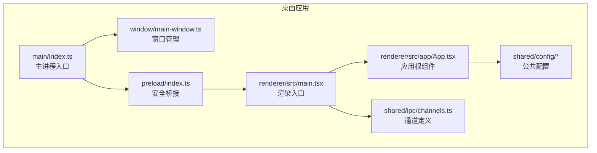

图表来源
- [apps/desktop/src/main/index.ts](file://apps/desktop/src/main/index.ts)
- [apps/desktop/src/main/window/main-window.ts](file://apps/desktop/src/main/window/main-window.ts)
- [apps/desktop/src/preload/index.ts](file://apps/desktop/src/preload/index.ts)
- [apps/desktop/src/renderer/src/main.tsx](file://apps/desktop/src/renderer/src/main.tsx)
- [apps/desktop/src/renderer/src/app/App.tsx](file://apps/desktop/src/renderer/src/app/App.tsx)
- [apps/desktop/src/shared/ipc/channels.ts](file://apps/desktop/src/shared/ipc/channels.ts)
- [apps/desktop/src/shared/config/supabase-public-config.ts](file://apps/desktop/src/shared/config/supabase-public-config.ts)

章节来源
- [apps/desktop/package.json](file://apps/desktop/package.json)
- [apps/desktop/electron.vite.config.ts](file://apps/desktop/electron.vite.config.ts)
- [apps/desktop/vite.config.ts](file://apps/desktop/vite.config.ts)

## 核心组件
- 主进程（Main）
  - 职责：应用生命周期管理、窗口创建与显示、注册 IPC 处理器、访问系统资源、持久化存储（会话、语言模式等）
  - 关键文件：主入口、窗口管理、各功能 IPC 路由、设置与 i18n 子系统
- 预加载（Preload）
  - 职责：通过 contextBridge 暴露最小、受控的 API 给渲染进程，屏蔽 Node/Electron 直接访问
  - 关键文件：预加载入口
- 渲染进程（Renderer）
  - 职责：UI 渲染、用户交互、调用预加载暴露的 API、状态管理与副作用处理
  - 关键文件：渲染入口、应用根组件、功能模块（认证、语言设置等）
- 共享层（Shared）
  - 职责：跨进程类型契约（IPC channels、事件类型、i18n 选项、公共配置）
  - 关键文件：channels、i18n 选项、语言模式、资源契约、Supabase 公开配置

章节来源
- [apps/desktop/src/main/index.ts](file://apps/desktop/src/main/index.ts)
- [apps/desktop/src/main/window/main-window.ts](file://apps/desktop/src/main/window/main-window.ts)
- [apps/desktop/src/preload/index.ts](file://apps/desktop/src/preload/index.ts)
- [apps/desktop/src/renderer/src/main.tsx](file://apps/desktop/src/renderer/src/main.tsx)
- [apps/desktop/src/renderer/src/app/App.tsx](file://apps/desktop/src/renderer/src/app/App.tsx)
- [apps/desktop/src/shared/ipc/channels.ts](file://apps/desktop/src/shared/ipc/channels.ts)
- [apps/desktop/src/shared/config/supabase-public-config.ts](file://apps/desktop/src/shared/config/supabase-public-config.ts)

## 架构总览
下图展示了从应用启动到渲染页面可见的关键流程，以及主/预加载/渲染三层的职责边界与数据流向。

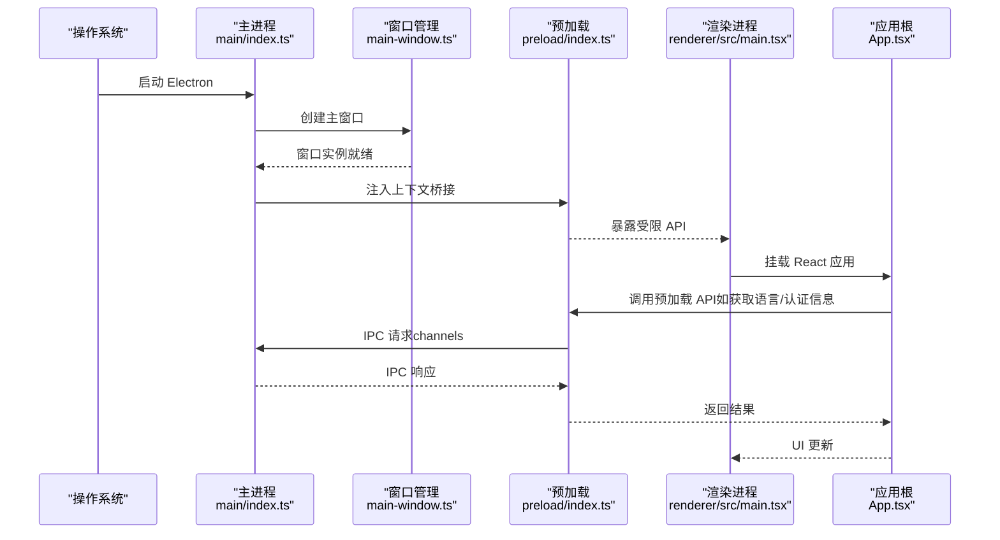

图表来源
- [apps/desktop/src/main/index.ts](file://apps/desktop/src/main/index.ts)
- [apps/desktop/src/main/window/main-window.ts](file://apps/desktop/src/main/window/main-window.ts)
- [apps/desktop/src/preload/index.ts](file://apps/desktop/src/preload/index.ts)
- [apps/desktop/src/renderer/src/main.tsx](file://apps/desktop/src/renderer/src/main.tsx)
- [apps/desktop/src/renderer/src/app/App.tsx](file://apps/desktop/src/renderer/src/app/App.tsx)

章节来源
- [apps/desktop/electron.vite.config.ts](file://apps/desktop/electron.vite.config.ts)
- [apps/desktop/vite.config.ts](file://apps/desktop/vite.config.ts)

## 详细组件分析

### 主进程与窗口管理
- 主进程负责：
  - 初始化 Electron 环境
  - 创建并配置主窗口（尺寸、样式、是否开发者工具等）
  - 监听应用生命周期事件（ready、window-all-closed、activate 等）
  - 注册 IPC 处理器，将渲染进程请求转发至对应业务逻辑
- 窗口管理策略：
  - 单例或按需创建窗口
  - 根据平台差异调整行为（如 macOS 的 quit 行为）
  - 在合适时机销毁或隐藏窗口，避免内存泄漏

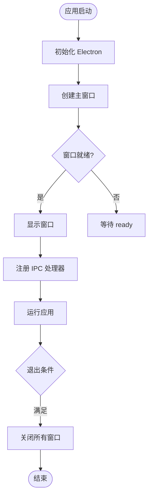

图表来源
- [apps/desktop/src/main/index.ts](file://apps/desktop/src/main/index.ts)
- [apps/desktop/src/main/window/main-window.ts](file://apps/desktop/src/main/window/main-window.ts)

章节来源
- [apps/desktop/src/main/index.ts](file://apps/desktop/src/main/index.ts)
- [apps/desktop/src/main/window/main-window.ts](file://apps/desktop/src/main/window/main-window.ts)

### 预加载脚本与安全桥接
- 职责：
  - 使用 contextBridge.exposeInMainWorld 暴露最小 API 集合
  - 对每个 API 进行参数校验与权限控制
  - 通过 ipcRenderer.invoke/channel 与主进程通信
- 安全要点：
  - 禁止直接暴露 Node/Electron 对象
  - 严格白名单限制可调用方法
  - 对敏感操作（如会话读写）进行可信来源校验

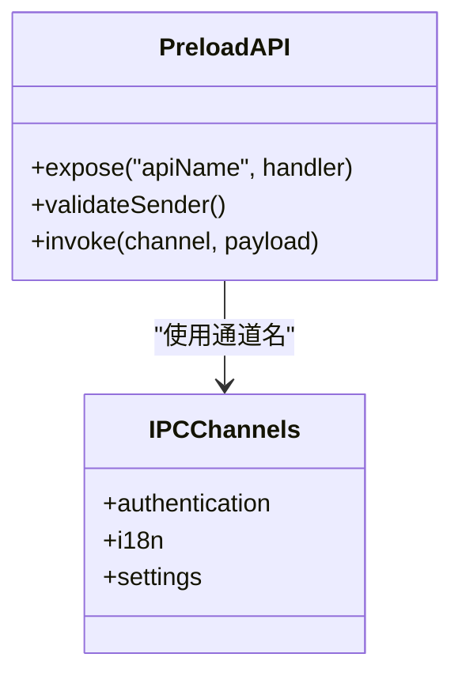

图表来源
- [apps/desktop/src/preload/index.ts](file://apps/desktop/src/preload/index.ts)
- [apps/desktop/src/shared/ipc/channels.ts](file://apps/desktop/src/shared/ipc/channels.ts)

章节来源
- [apps/desktop/src/preload/index.ts](file://apps/desktop/src/preload/index.ts)
- [apps/desktop/src/shared/ipc/channels.ts](file://apps/desktop/src/shared/ipc/channels.ts)

### 渲染进程与应用根
- 渲染进程职责：
  - 初始化 React 应用与路由
  - 通过预加载暴露的 API 获取国际化、认证状态等
  - 管理本地状态与副作用（如网络请求、持久化）
- 应用根组件：
  - 提供全局 Provider（如 i18n、主题、认证上下文）
  - 统一错误边界与日志上报

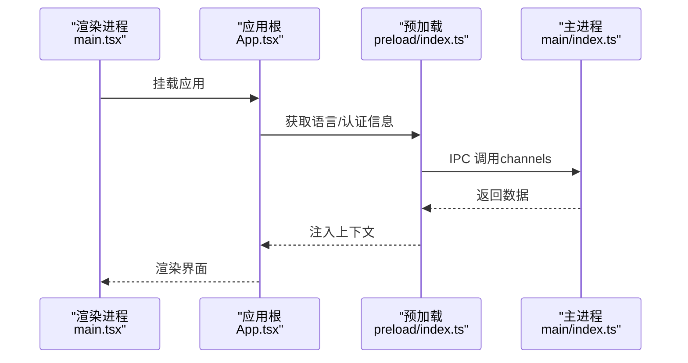

图表来源
- [apps/desktop/src/renderer/src/main.tsx](file://apps/desktop/src/renderer/src/main.tsx)
- [apps/desktop/src/renderer/src/app/App.tsx](file://apps/desktop/src/renderer/src/app/App.tsx)
- [apps/desktop/src/preload/index.ts](file://apps/desktop/src/preload/index.ts)
- [apps/desktop/src/main/index.ts](file://apps/desktop/src/main/index.ts)

章节来源
- [apps/desktop/src/renderer/src/main.tsx](file://apps/desktop/src/renderer/src/main.tsx)
- [apps/desktop/src/renderer/src/app/App.tsx](file://apps/desktop/src/renderer/src/app/App.tsx)

### 进程间通信（IPC）机制
- 通道与类型：
  - 使用共享 channels 定义 IPC 通道名，保证主/渲染一致
  - 使用共享 types 定义请求/响应结构，确保类型安全
- 认证相关：
  - 读取/替换/清除会话
  - 可信发送者校验，防止恶意调用
- 国际化：
  - 获取引导资源（bootstrap），用于初始语言切换
- 设置：
  - 获取/设置语言模式

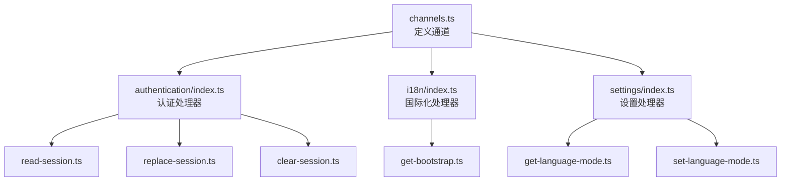

图表来源
- [apps/desktop/src/shared/ipc/channels.ts](file://apps/desktop/src/shared/ipc/channels.ts)
- [apps/desktop/src/main/ipc/authentication/index.ts](file://apps/desktop/src/main/ipc/authentication/index.ts)
- [apps/desktop/src/main/ipc/i18n/index.ts](file://apps/desktop/src/main/ipc/i18n/index.ts)
- [apps/desktop/src/main/ipc/settings/index.ts](file://apps/desktop/src/main/ipc/settings/index.ts)
- [apps/desktop/src/main/ipc/authentication/read-session.ts](file://apps/desktop/src/main/ipc/authentication/read-session.ts)
- [apps/desktop/src/main/ipc/authentication/replace-session.ts](file://apps/desktop/src/main/ipc/authentication/replace-session.ts)
- [apps/desktop/src/main/ipc/authentication/clear-session.ts](file://apps/desktop/src/main/ipc/authentication/clear-session.ts)
- [apps/desktop/src/main/ipc/i18n/handlers/get-bootstrap.ts](file://apps/desktop/src/main/ipc/i18n/handlers/get-bootstrap.ts)
- [apps/desktop/src/main/ipc/settings/handlers/get-language-mode.ts](file://apps/desktop/src/main/ipc/settings/handlers/get-language-mode.ts)
- [apps/desktop/src/main/ipc/settings/handlers/set-language-mode.ts](file://apps/desktop/src/main/ipc/settings/handlers/set-language-mode.ts)

章节来源
- [apps/desktop/src/shared/ipc/channels.ts](file://apps/desktop/src/shared/ipc/channels.ts)
- [apps/desktop/src/shared/ipc/authentication/types.ts](file://apps/desktop/src/shared/ipc/authentication/types.ts)
- [apps/desktop/src/shared/ipc/i18n/types.ts](file://apps/desktop/src/shared/ipc/i18n/types.ts)
- [apps/desktop/src/shared/ipc/settings/types.ts](file://apps/desktop/src/shared/ipc/settings/types.ts)

### 认证与会话管理
- 主进程侧：
  - 会话存储（session-store）负责持久化与读取
  - 处理器封装了读取、替换、清除会话的逻辑
  - trusted-sender 校验调用来源，防止跨上下文滥用
- 渲染进程侧：
  - use-authentication hook 封装认证状态与副作用
  - persisted-session 负责本地持久化与同步
  - api/client 封装对外 API 调用（如 Supabase）

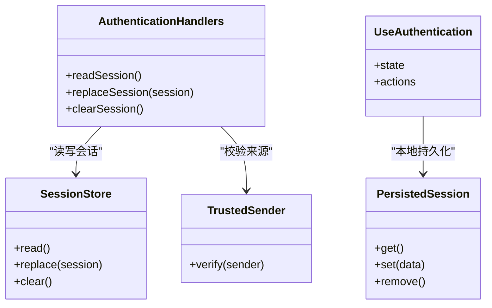

图表来源
- [apps/desktop/src/main/authentication/session-store.ts](file://apps/desktop/src/main/authentication/session-store.ts)
- [apps/desktop/src/main/ipc/authentication/read-session.ts](file://apps/desktop/src/main/ipc/authentication/read-session.ts)
- [apps/desktop/src/main/ipc/authentication/replace-session.ts](file://apps/desktop/src/main/ipc/authentication/replace-session.ts)
- [apps/desktop/src/main/ipc/authentication/clear-session.ts](file://apps/desktop/src/main/ipc/authentication/clear-session.ts)
- [apps/desktop/src/main/ipc/authentication/trusted-sender.ts](file://apps/desktop/src/main/ipc/authentication/trusted-sender.ts)
- [apps/desktop/src/renderer/src/features/authentication/hooks/use-authentication.ts](file://apps/desktop/src/renderer/src/features/authentication/hooks/use-authentication.ts)
- [apps/desktop/src/renderer/src/features/authentication/session/persisted-session.ts](file://apps/desktop/src/renderer/src/features/authentication/session/persisted-session.ts)
- [apps/desktop/src/renderer/src/features/authentication/api/client.ts](file://apps/desktop/src/renderer/src/features/authentication/api/client.ts)

章节来源
- [apps/desktop/src/main/authentication/session-store.ts](file://apps/desktop/src/main/authentication/session-store.ts)
- [apps/desktop/src/main/ipc/authentication/index.ts](file://apps/desktop/src/main/ipc/authentication/index.ts)
- [apps/desktop/src/renderer/src/features/authentication/hooks/use-authentication.ts](file://apps/desktop/src/renderer/src/features/authentication/hooks/use-authentication.ts)
- [apps/desktop/src/renderer/src/features/authentication/session/persisted-session.ts](file://apps/desktop/src/renderer/src/features/authentication/session/persisted-session.ts)
- [apps/desktop/src/renderer/src/features/authentication/api/client.ts](file://apps/desktop/src/renderer/src/features/authentication/api/client.ts)

### 国际化（i18n）与语言模式
- 主进程侧：
  - i18n 初始化与资源加载
  - IPC 处理器提供 bootstrap 数据，供渲染进程初始语言切换
- 渲染进程侧：
  - 初始化 i18n 实例，订阅语言模式变化
  - 语言设置 UI 与 hooks 联动设置语言模式
- 共享层：
  - i18next 选项、语言模式枚举、资源契约

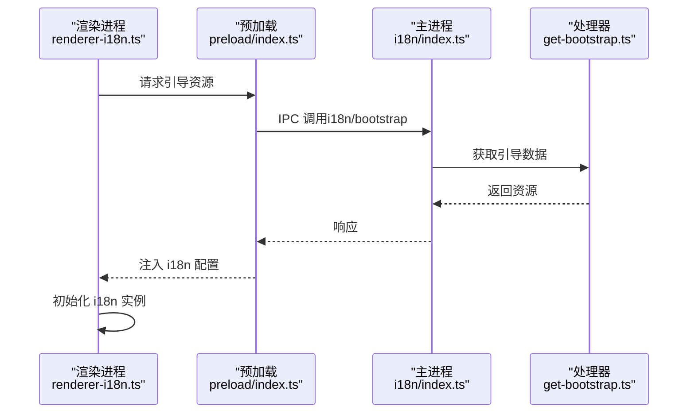

图表来源
- [apps/desktop/src/main/i18n/index.ts](file://apps/desktop/src/main/i18n/index.ts)
- [apps/desktop/src/main/i18n/resources.ts](file://apps/desktop/src/main/i18n/resources.ts)
- [apps/desktop/src/main/ipc/i18n/index.ts](file://apps/desktop/src/main/ipc/i18n/index.ts)
- [apps/desktop/src/main/ipc/i18n/handlers/get-bootstrap.ts](file://apps/desktop/src/main/ipc/i18n/handlers/get-bootstrap.ts)
- [apps/desktop/src/renderer/src/app/i18n/index.ts](file://apps/desktop/src/renderer/src/app/i18n/index.ts)
- [apps/desktop/src/renderer/src/app/i18n/renderer-i18n.ts](file://apps/desktop/src/renderer/src/app/i18n/renderer-i18n.ts)
- [apps/desktop/src/shared/i18n/i18next-options.ts](file://apps/desktop/src/shared/i18n/i18next-options.ts)
- [apps/desktop/src/shared/i18n/language-mode.ts](file://apps/desktop/src/shared/i18n/language-mode.ts)
- [apps/desktop/src/shared/i18n/resource-contract.ts](file://apps/desktop/src/shared/i18n/resource-contract.ts)

章节来源
- [apps/desktop/src/main/i18n/index.ts](file://apps/desktop/src/main/i18n/index.ts)
- [apps/desktop/src/main/i18n/resources.ts](file://apps/desktop/src/main/i18n/resources.ts)
- [apps/desktop/src/main/ipc/i18n/index.ts](file://apps/desktop/src/main/ipc/i18n/index.ts)
- [apps/desktop/src/main/ipc/i18n/handlers/get-bootstrap.ts](file://apps/desktop/src/main/ipc/i18n/handlers/get-bootstrap.ts)
- [apps/desktop/src/renderer/src/app/i18n/index.ts](file://apps/desktop/src/renderer/src/app/i18n/index.ts)
- [apps/desktop/src/renderer/src/app/i18n/renderer-i18n.ts](file://apps/desktop/src/renderer/src/app/i18n/renderer-i18n.ts)
- [apps/desktop/src/shared/i18n/i18next-options.ts](file://apps/desktop/src/shared/i18n/i18next-options.ts)
- [apps/desktop/src/shared/i18n/language-mode.ts](file://apps/desktop/src/shared/i18n/language-mode.ts)
- [apps/desktop/src/shared/i18n/resource-contract.ts](file://apps/desktop/src/shared/i18n/resource-contract.ts)

### 设置与语言模式持久化
- 主进程侧：
  - language-mode-store 负责语言模式的读取与写入
  - IPC 处理器提供 get/set 语言模式接口
- 渲染进程侧：
  - 语言设置 UI 与 hooks 联动，触发 IPC 设置
  - 订阅语言模式变化，刷新 i18n 实例

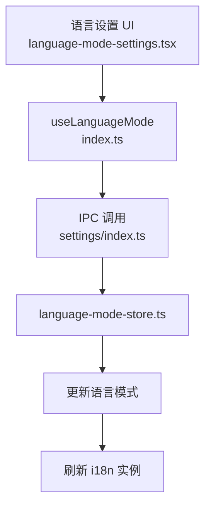

图表来源
- [apps/desktop/src/main/settings/language-mode-store.ts](file://apps/desktop/src/main/settings/language-mode-store.ts)
- [apps/desktop/src/main/ipc/settings/index.ts](file://apps/desktop/src/main/ipc/settings/index.ts)
- [apps/desktop/src/main/ipc/settings/handlers/get-language-mode.ts](file://apps/desktop/src/main/ipc/settings/handlers/get-language-mode.ts)
- [apps/desktop/src/main/ipc/settings/handlers/set-language-mode.ts](file://apps/desktop/src/main/ipc/settings/handlers/set-language-mode.ts)
- [apps/desktop/src/renderer/src/features/language/settings/index.ts](file://apps/desktop/src/renderer/src/features/language/settings/index.ts)
- [apps/desktop/src/renderer/src/features/language/settings/ui/language-mode-settings.tsx](file://apps/desktop/src/renderer/src/features/language/settings/ui/language-mode-settings.tsx)
- [apps/desktop/src/renderer/src/features/language/settings/i18n.ts](file://apps/desktop/src/renderer/src/features/language/settings/i18n.ts)

章节来源
- [apps/desktop/src/main/settings/language-mode-store.ts](file://apps/desktop/src/main/settings/language-mode-store.ts)
- [apps/desktop/src/main/ipc/settings/index.ts](file://apps/desktop/src/main/ipc/settings/index.ts)
- [apps/desktop/src/renderer/src/features/language/settings/index.ts](file://apps/desktop/src/renderer/src/features/language/settings/index.ts)
- [apps/desktop/src/renderer/src/features/language/settings/ui/language-mode-settings.tsx](file://apps/desktop/src/renderer/src/features/language/settings/ui/language-mode-settings.tsx)

### 配置管理与依赖注入
- 公共配置：
  - supabase-public-config 提供客户端可见的配置项
- 依赖注入模式：
  - 在 providers.tsx 中集中注入上下文（如 i18n、认证、主题）
  - 通过 hooks 解耦业务逻辑与底层实现

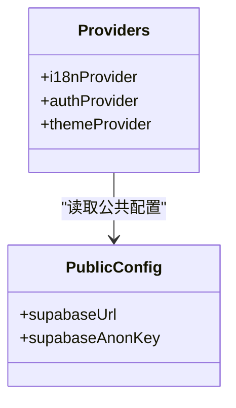

图表来源
- [apps/desktop/src/shared/config/supabase-public-config.ts](file://apps/desktop/src/shared/config/supabase-public-config.ts)
- [apps/desktop/src/renderer/src/app/providers.tsx](file://apps/desktop/src/renderer/src/app/providers.tsx)

章节来源
- [apps/desktop/src/shared/config/supabase-public-config.ts](file://apps/desktop/src/shared/config/supabase-public-config.ts)
- [apps/desktop/src/renderer/src/app/providers.tsx](file://apps/desktop/src/renderer/src/app/providers.tsx)

## 依赖分析
- 构建与打包：
  - electron-vite 作为主/渲染双端构建器
  - vite.config.ts 与 tsconfig.* 分别管理 Web 与 Node 环境
- 运行时依赖：
  - Electron、React、i18next、Supabase 客户端等
- 测试依赖：
  - Playwright、Electron 测试辅助

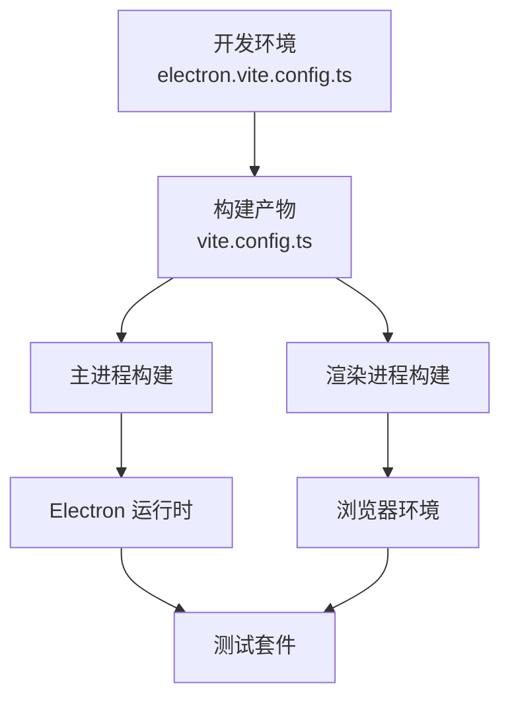

图表来源
- [apps/desktop/electron.vite.config.ts](file://apps/desktop/electron.vite.config.ts)
- [apps/desktop/vite.config.ts](file://apps/desktop/vite.config.ts)
- [apps/desktop/tsconfig.json](file://apps/desktop/tsconfig.json)
- [apps/desktop/tsconfig.node.json](file://apps/desktop/tsconfig.node.json)
- [apps/desktop/tsconfig.web.json](file://apps/desktop/tsconfig.web.json)
- [apps/desktop/package.json](file://apps/desktop/package.json)

章节来源
- [apps/desktop/electron.vite.config.ts](file://apps/desktop/electron.vite.config.ts)
- [apps/desktop/vite.config.ts](file://apps/desktop/vite.config.ts)
- [apps/desktop/tsconfig.json](file://apps/desktop/tsconfig.json)
- [apps/desktop/tsconfig.node.json](file://apps/desktop/tsconfig.node.json)
- [apps/desktop/tsconfig.web.json](file://apps/desktop/tsconfig.web.json)
- [apps/desktop/package.json](file://apps/desktop/package.json)

## 性能考虑
- 启动性能
  - 延迟加载非关键模块与资源
  - 减少主进程初始化开销，避免阻塞 ready
- 渲染性能
  - 合理使用 React.memo、useMemo、useCallback
  - 列表虚拟化与分页加载
- 内存管理
  - 及时释放事件监听与定时器
  - 避免大对象常驻内存，使用流式处理
- IPC 性能
  - 批量消息合并与节流
  - 避免频繁小消息，合理拆分通道

[本节为通用指导，不直接分析具体文件]

## 故障排查指南
- 常见问题
  - IPC 通道未注册：检查 channels 定义与处理器注册顺序
  - 预加载 API 不可用：确认 contextBridge 暴露方法与名称一致
  - 认证失败：检查 trusted-sender 校验与 session-store 读写权限
  - 语言切换无效：确认 i18n 实例重新初始化与资源加载
- 调试技巧
  - 启用主进程日志与渲染进程控制台
  - 使用 Playwright 录制与断点
  - 编写安全与边界用例（如 electron-security.spec.ts）

章节来源
- [apps/desktop/tests/auth/electron-security.spec.ts](file://apps/desktop/tests/auth/electron-security.spec.ts)
- [apps/desktop/tests/helpers/electron-app.ts](file://apps/desktop/tests/helpers/electron-app.ts)

## 结论
nevix-ai 桌面应用通过清晰的三层架构（主进程、预加载、渲染进程）实现了职责分离与安全隔离。借助共享通道与类型契约，IPC 通信具备强类型与高内聚特性。结合 Vite 与 TypeScript 的工程化配置，开发与构建体验良好。遵循安全最佳实践与性能优化策略，可有效提升稳定性与用户体验。

[本节为总结性内容，不直接分析具体文件]

## 附录
- 开发环境搭建
  - 安装依赖并运行开发服务器
  - 配置环境变量与公共配置
- 构建与打包
  - 使用 electron-builder 生成安装包
  - 验证产物与签名

[本节为补充说明，不直接分析具体文件]