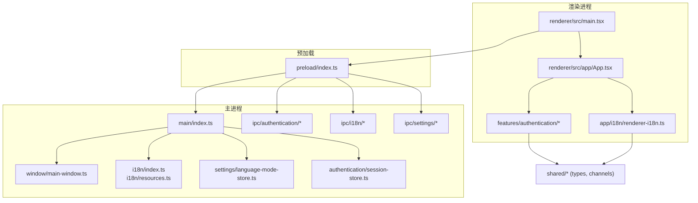
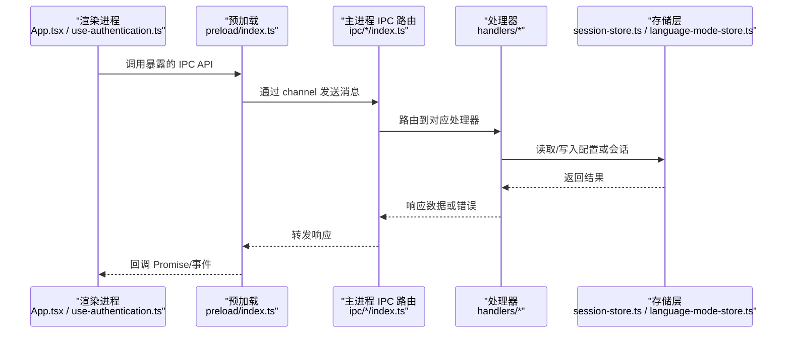
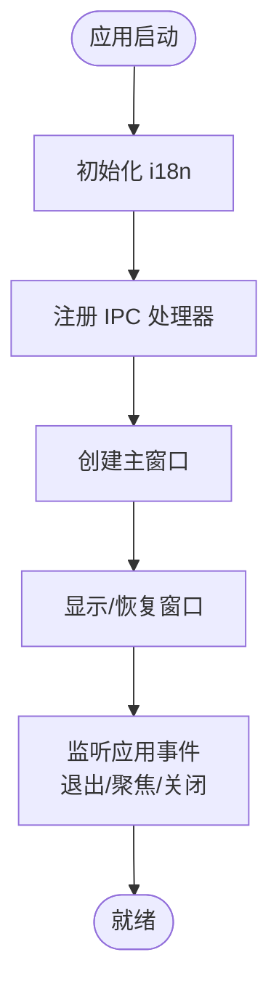
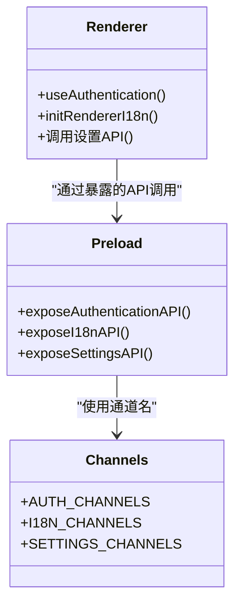
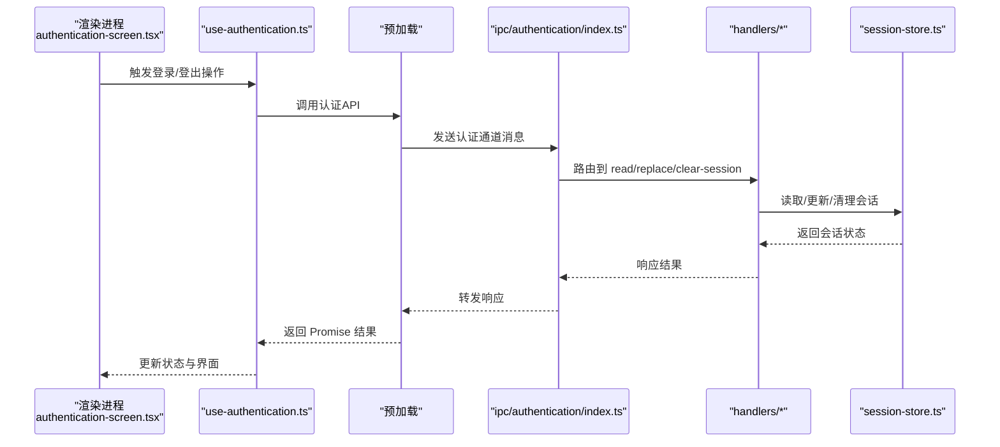
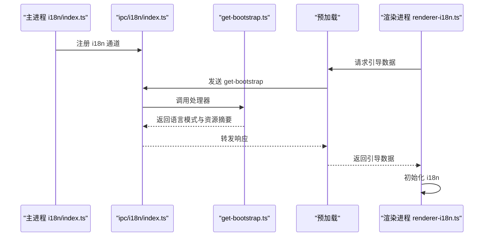
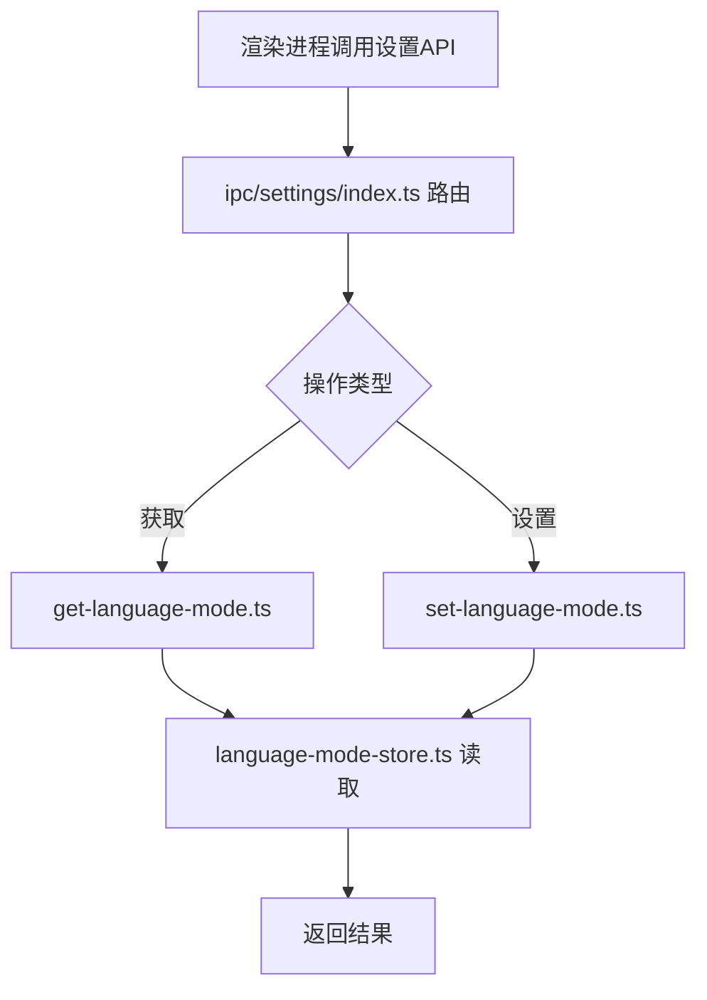
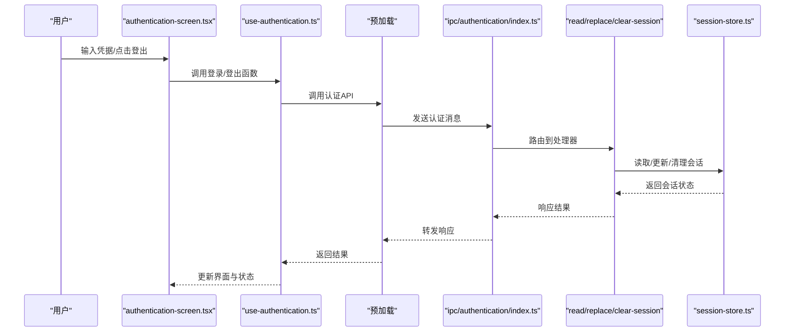
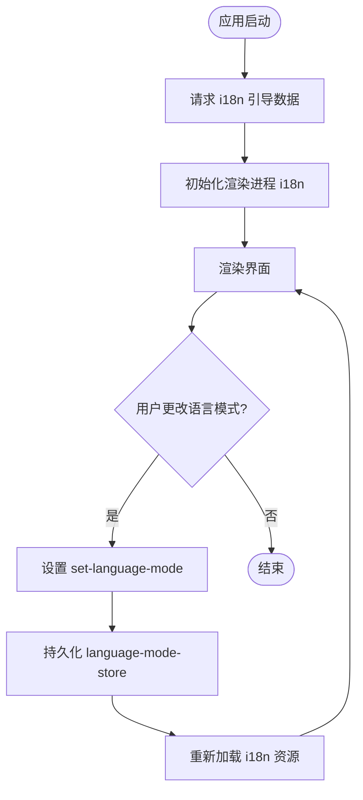
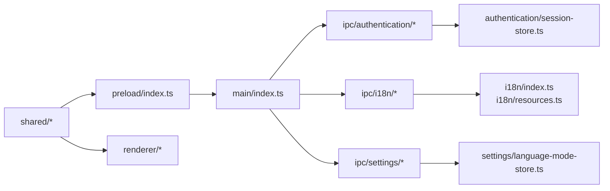

# 桌面应用程序

<cite>
**本文引用的文件**   
- [apps/desktop/src/main/index.ts](file://apps/desktop/src/main/index.ts)
- [apps/desktop/src/main/window/main-window.ts](file://apps/desktop/src/main/window/main-window.ts)
- [apps/desktop/src/preload/index.ts](file://apps/desktop/src/preload/index.ts)
- [apps/desktop/src/renderer/src/main.tsx](file://apps/desktop/src/renderer/src/main.tsx)
- [apps/desktop/src/renderer/src/app/App.tsx](file://apps/desktop/src/renderer/src/app/App.tsx)
- [apps/desktop/src/shared/ipc/channels.ts](file://apps/desktop/src/shared/ipc/channels.ts)
- [apps/desktop/src/main/ipc/authentication/index.ts](file://apps/desktop/src/main/ipc/authentication/index.ts)
- [apps/desktop/src/main/ipc/authentication/handlers/clear-session.ts](file://apps/desktop/src/main/ipc/authentication/handlers/clear-session.ts)
- [apps/desktop/src/main/ipc/authentication/handlers/read-session.ts](file://apps/desktop/src/main/ipc/authentication/handlers/read-session.ts)
- [apps/desktop/src/main/ipc/authentication/handlers/replace-session.ts](file://apps/desktop/src/main/ipc/authentication/handlers/replace-session.ts)
- [apps/desktop/src/main/ipc/authentication/handlers/trusted-sender.ts](file://apps/desktop/src/main/ipc/authentication/handlers/trusted-sender.ts)
- [apps/desktop/src/main/ipc/i18n/index.ts](file://apps/desktop/src/main/ipc/i18n/index.ts)
- [apps/desktop/src/main/ipc/i18n/handlers/get-bootstrap.ts](file://apps/desktop/src/main/ipc/i18n/handlers/get-bootstrap.ts)
- [apps/desktop/src/main/ipc/settings/index.ts](file://apps/desktop/src/main/ipc/settings/index.ts)
- [apps/desktop/src/main/ipc/settings/handlers/get-language-mode.ts](file://apps/desktop/src/main/ipc/settings/handlers/get-language模式.ts)
- [apps/desktop/src/main/ipc/settings/handlers/set-language-mode.ts](file://apps/desktop/src/main/ipc/settings/handlers/set-language-mode.ts)
- [apps/desktop/src/main/i18n/index.ts](file://apps/desktop/src/main/i18n/index.ts)
- [apps/desktop/src/main/i18n/resources.ts](file://apps/desktop/src/main/i18n/resources.ts)
- [apps/desktop/src/main/settings/language-mode-store.ts](file://apps/desktop/src/main/settings/language-mode-store.ts)
- [apps/desktop/src/main/authentication/session-store.ts](file://apps/desktop/src/main/authentication/session-store.ts)
- [apps/desktop/src/renderer/src/features/authentication/hooks/use-authentication.ts](file://apps/desktop/src/renderer/src/features/authentication/hooks/use-authentication.ts)
- [apps/desktop/src/renderer/src/features/authentication/components/authentication-screen.tsx](file://apps/desktop/src/renderer/src/features/authentication/components/authentication-screen.tsx)
- [apps/desktop/src/renderer/src/features/authentication/api/client.ts](file://apps/desktop/src/renderer/src/features/authentication/api/client.ts)
- [apps/desktop/src/renderer/src/features/authentication/session/persisted-session.ts](file://apps/desktop/src/renderer/src/features/authentication/session/persisted-session.ts)
- [apps/desktop/src/renderer/src/app/i18n/renderer-i18n.ts](file://apps/desktop/src/renderer/src/app/i18n/renderer-i18n.ts)
- [apps/desktop/src/shared/i18n/language-mode.ts](file://apps/desktop/src/shared/i18n/language-mode.ts)
- [apps/desktop/src/shared/ipc/authentication/types.ts](file://apps/desktop/src/shared/ipc/authentication/types.ts)
- [apps/desktop/src/shared/ipc/i18n/types.ts](file://apps/desktop/src/shared/ipc/i18n/types.ts)
- [apps/desktop/src/shared/ipc/settings/types.ts](file://apps/desktop/src/shared/ipc/settings/types.ts)
- [apps/desktop/electron.vite.config.ts](file://apps/desktop/electron.vite.config.ts)
- [apps/desktop/package.json](file://apps/desktop/package.json)
- [apps/desktop/electron-builder.yml](file://apps/desktop/electron-builder.yml)
</cite>

## 目录
1. [简介](#简介)
2. [项目结构](#项目结构)
3. [核心组件](#核心组件)
4. [架构总览](#架构总览)
5. [详细组件分析](#详细组件分析)
6. [依赖关系分析](#依赖关系分析)
7. [性能考量](#性能考量)
8. [故障排查指南](#故障排查指南)
9. [结论](#结论)
10. [附录](#附录)

## 简介
本文件为 nevix-ai 桌面应用程序（Electron）的权威技术文档。内容覆盖主进程、渲染进程与预加载脚本的职责划分，IPC 通信机制、窗口管理与应用生命周期；并深入记录认证流程、国际化支持与设置管理功能。文档同时给出配置文件、环境变量与构建过程的说明，以及常见问题与解决方案，既适合初学者入门，也为有经验的开发者提供足够的技术深度。

## 项目结构
本项目采用“多进程 + 模块化”的 Electron 架构：
- 主进程负责系统级能力（窗口、文件系统、安全策略、持久化存储等）。
- 预加载脚本作为受信任桥接，向渲染进程暴露最小化的 IPC API。
- 渲染进程运行 Web UI（React/Vite），通过预加载暴露的 API 与主进程交互。
- 共享类型定义位于 shared 目录，保证主进程与渲染进程的类型一致性。

图表来源
- [apps/desktop/src/main/index.ts](file://apps/desktop/src/main/index.ts)
- [apps/desktop/src/main/window/main-window.ts](file://apps/desktop/src/main/window/main-window.ts)
- [apps/desktop/src/preload/index.ts](file://apps/desktop/src/preload/index.ts)
- [apps/desktop/src/renderer/src/main.tsx](file://apps/desktop/src/renderer/src/main.tsx)
- [apps/desktop/src/renderer/src/app/App.tsx](file://apps/desktop/src/renderer/src/app/App.tsx)
- [apps/desktop/src/shared/ipc/channels.ts](file://apps/desktop/src/shared/ipc/channels.ts)

章节来源
- [apps/desktop/src/main/index.ts](file://apps/desktop/src/main/index.ts)
- [apps/desktop/src/main/window/main-window.ts](file://apps/desktop/src/main/window/main-window.ts)
- [apps/desktop/src/preload/index.ts](file://apps/desktop/src/preload/index.ts)
- [apps/desktop/src/renderer/src/main.tsx](file://apps/desktop/src/renderer/src/main.tsx)
- [apps/desktop/src/renderer/src/app/App.tsx](file://apps/desktop/src/renderer/src/app/App.tsx)
- [apps/desktop/src/shared/ipc/channels.ts](file://apps/desktop/src/shared/ipc/channels.ts)

## 核心组件
- 主进程入口与生命周期：负责初始化 i18n、注册 IPC、创建主窗口、处理应用事件（如退出、聚焦等）。
- 窗口管理：封装主窗口的创建、显示、隐藏、尺寸与状态控制。
- 预加载桥接：仅暴露必要的 IPC 方法给渲染进程，遵循最小权限原则。
- IPC 通道与处理器：按领域划分（认证、国际化、设置），统一注册与路由。
- 认证子系统：会话读写、清理、替换，结合受信任发送者校验。
- 国际化子系统：主进程资源加载与引导数据下发，渲染进程本地化初始化。
- 设置子系统：语言模式读取与持久化。

章节来源
- [apps/desktop/src/main/index.ts](file://apps/desktop/src/main/index.ts)
- [apps/desktop/src/main/window/main-window.ts](file://apps/desktop/src/main/window/main-window.ts)
- [apps/desktop/src/preload/index.ts](file://apps/desktop/src/preload/index.ts)
- [apps/desktop/src/main/ipc/authentication/index.ts](file://apps/desktop/src/main/ipc/authentication/index.ts)
- [apps/desktop/src/main/ipc/i18n/index.ts](file://apps/desktop/src/main/ipc/i18n/index.ts)
- [apps/desktop/src/main/ipc/settings/index.ts](file://apps/desktop/src/main/ipc/settings/index.ts)
- [apps/desktop/src/main/i18n/index.ts](file://apps/desktop/src/main/i18n/index.ts)
- [apps/desktop/src/main/settings/language-mode-store.ts](file://apps/desktop/src/main/settings/language-mode-store.ts)
- [apps/desktop/src/main/authentication/session-store.ts](file://apps/desktop/src/main/authentication/session-store.ts)

## 架构总览
下图展示了从渲染进程发起请求到主进程处理并返回结果的典型调用链，涵盖认证、国际化与设置三大领域。

图表来源
- [apps/desktop/src/renderer/src/app/App.tsx](file://apps/desktop/src/renderer/src/app/App.tsx)
- [apps/desktop/src/renderer/src/features/authentication/hooks/use-authentication.ts](file://apps/desktop/src/renderer/src/features/authentication/hooks/use-authentication.ts)
- [apps/desktop/src/preload/index.ts](file://apps/desktop/src/preload/index.ts)
- [apps/desktop/src/main/ipc/authentication/index.ts](file://apps/desktop/src/main/ipc/authentication/index.ts)
- [apps/desktop/src/main/ipc/i18n/index.ts](file://apps/desktop/src/main/ipc/i18n/index.ts)
- [apps/desktop/src/main/ipc/settings/index.ts](file://apps/desktop/src/main/ipc/settings/index.ts)
- [apps/desktop/src/main/authentication/session-store.ts](file://apps/desktop/src/main/authentication/session-store.ts)
- [apps/desktop/src/main/settings/language-mode-store.ts](file://apps/desktop/src/main/settings/language-mode-store.ts)

## 详细组件分析

### 主进程与窗口管理
- 主进程入口负责初始化 i18n、注册 IPC、创建主窗口并监听应用生命周期事件。
- 窗口模块封装了主窗口的创建、显示、隐藏、尺寸与状态控制，确保在不同平台行为一致。

图表来源
- [apps/desktop/src/main/index.ts](file://apps/desktop/src/main/index.ts)
- [apps/desktop/src/main/window/main-window.ts](file://apps/desktop/src/main/window/main-window.ts)

章节来源
- [apps/desktop/src/main/index.ts](file://apps/desktop/src/main/index.ts)
- [apps/desktop/src/main/window/main-window.ts](file://apps/desktop/src/main/window/main-window.ts)

### 预加载脚本与 IPC 桥接
- 预加载脚本通过 contextBridge 暴露最小化的 IPC API，避免直接访问 Node/Electron 能力。
- 所有通道名称集中在 shared/ipc/channels.ts，保证前后端一致。

图表来源
- [apps/desktop/src/preload/index.ts](file://apps/desktop/src/preload/index.ts)
- [apps/desktop/src/shared/ipc/channels.ts](file://apps/desktop/src/shared/ipc/channels.ts)
- [apps/desktop/src/renderer/src/features/authentication/hooks/use-authentication.ts](file://apps/desktop/src/renderer/src/features/authentication/hooks/use-authentication.ts)
- [apps/desktop/src/renderer/src/app/i18n/renderer-i18n.ts](file://apps/desktop/src/renderer/src/app/i18n/renderer-i18n.ts)

章节来源
- [apps/desktop/src/preload/index.ts](file://apps/desktop/src/preload/index.ts)
- [apps/desktop/src/shared/ipc/channels.ts](file://apps/desktop/src/shared/ipc/channels.ts)

### 认证子系统
- 主进程侧提供会话读取、替换与清理接口，并通过 trusted-sender 校验发送方身份。
- 渲染进程通过 use-authentication hook 与 authentication-screen 组件驱动登录流程。
- 会话持久化由 session-store 管理，支持跨进程安全读写。

图表来源
- [apps/desktop/src/renderer/src/features/authentication/components/authentication-screen.tsx](file://apps/desktop/src/renderer/src/features/authentication/components/authentication-screen.tsx)
- [apps/desktop/src/renderer/src/features/authentication/hooks/use-authentication.ts](file://apps/desktop/src/renderer/src/features/authentication/hooks/use-authentication.ts)
- [apps/desktop/src/main/ipc/authentication/index.ts](file://apps/desktop/src/main/ipc/authentication/index.ts)
- [apps/desktop/src/main/ipc/authentication/handlers/read-session.ts](file://apps/desktop/src/main/ipc/authentication/handlers/read-session.ts)
- [apps/desktop/src/main/ipc/authentication/handlers/replace-session.ts](file://apps/desktop/src/main/ipc/authentication/handlers/replace-session.ts)
- [apps/desktop/src/main/ipc/authentication/handlers/clear-session.ts](file://apps/desktop/src/main/ipc/authentication/handlers/clear-session.ts)
- [apps/desktop/src/main/ipc/authentication/handlers/trusted-sender.ts](file://apps/desktop/src/main/ipc/authentication/handlers/trusted-sender.ts)
- [apps/desktop/src/main/authentication/session-store.ts](file://apps/desktop/src/main/authentication/session-store.ts)

章节来源
- [apps/desktop/src/renderer/src/features/authentication/hooks/use-authentication.ts](file://apps/desktop/src/renderer/src/features/authentication/hooks/use-authentication.ts)
- [apps/desktop/src/renderer/src/features/authentication/components/authentication-screen.tsx](file://apps/desktop/src/renderer/src/features/authentication/components/authentication-screen.tsx)
- [apps/desktop/src/main/ipc/authentication/index.ts](file://apps/desktop/src/main/ipc/authentication/index.ts)
- [apps/desktop/src/main/ipc/authentication/handlers/read-session.ts](file://apps/desktop/src/main/ipc/authentication/handlers/read-session.ts)
- [apps/desktop/src/main/ipc/authentication/handlers/replace-session.ts](file://apps/desktop/src/main/ipc/authentication/handlers/replace-session.ts)
- [apps/desktop/src/main/ipc/authentication/handlers/clear-session.ts](file://apps/desktop/src/main/ipc/authentication/handlers/clear-session.ts)
- [apps/desktop/src/main/ipc/authentication/handlers/trusted-sender.ts](file://apps/desktop/src/main/ipc/authentication/handlers/trusted-sender.ts)
- [apps/desktop/src/main/authentication/session-store.ts](file://apps/desktop/src/main/authentication/session-store.ts)

### 国际化子系统
- 主进程负责加载 i18n 资源并提供引导数据（bootstrap），供渲染进程初始化。
- 渲染进程根据主进程下发的语言模式初始化本地化库，确保首次渲染即正确语言。
- 语言模式通过设置子系统读取与持久化。

图表来源
- [apps/desktop/src/main/i18n/index.ts](file://apps/desktop/src/main/i18n/index.ts)
- [apps/desktop/src/main/i18n/resources.ts](file://apps/desktop/src/main/i18n/resources.ts)
- [apps/desktop/src/main/ipc/i18n/index.ts](file://apps/desktop/src/main/ipc/i18n/index.ts)
- [apps/desktop/src/main/ipc/i18n/handlers/get-bootstrap.ts](file://apps/desktop/src/main/ipc/i18n/handlers/get-bootstrap.ts)
- [apps/desktop/src/renderer/src/app/i18n/renderer-i18n.ts](file://apps/desktop/src/renderer/src/app/i18n/renderer-i18n.ts)

章节来源
- [apps/desktop/src/main/i18n/index.ts](file://apps/desktop/src/main/i18n/index.ts)
- [apps/desktop/src/main/i18n/resources.ts](file://apps/desktop/src/main/i18n/resources.ts)
- [apps/desktop/src/main/ipc/i18n/index.ts](file://apps/desktop/src/main/ipc/i18n/index.ts)
- [apps/desktop/src/main/ipc/i18n/handlers/get-bootstrap.ts](file://apps/desktop/src/main/ipc/i18n/handlers/get-bootstrap.ts)
- [apps/desktop/src/renderer/src/app/i18n/renderer-i18n.ts](file://apps/desktop/src/renderer/src/app/i18n/renderer-i18n.ts)

### 设置子系统（语言模式）
- 设置模块提供语言模式的读取与设置接口，底层通过 language-mode-store 持久化。
- 渲染进程可通过设置 UI 切换语言模式，主进程同步更新并影响后续 i18n 行为。

图表来源
- [apps/desktop/src/main/ipc/settings/index.ts](file://apps/desktop/src/main/ipc/settings/index.ts)
- [apps/desktop/src/main/ipc/settings/handlers/get-language-mode.ts](file://apps/desktop/src/main/ipc/settings/handlers/get-language-mode.ts)
- [apps/desktop/src/main/ipc/settings/handlers/set-language-mode.ts](file://apps/desktop/src/main/ipc/settings/handlers/set-language-mode.ts)
- [apps/desktop/src/main/settings/language-mode-store.ts](file://apps/desktop/src/main/settings/language-mode-store.ts)

章节来源
- [apps/desktop/src/main/ipc/settings/index.ts](file://apps/desktop/src/main/ipc/settings/index.ts)
- [apps/desktop/src/main/ipc/settings/handlers/get-language-mode.ts](file://apps/desktop/src/main/ipc/settings/handlers/get-language-mode.ts)
- [apps/desktop/src/main/ipc/settings/handlers/set-language-mode.ts](file://apps/desktop/src/main/ipc/settings/handlers/set-language-mode.ts)
- [apps/desktop/src/main/settings/language-mode-store.ts](file://apps/desktop/src/main/settings/language-mode-store.ts)

### 认证流程（端到端）
- 渲染进程通过 use-authentication 钩子发起登录/登出动作，调用预加载暴露的认证 API。
- 主进程处理器验证发送方可信性，随后对会话进行读取、替换或清理。
- 会话数据在 session-store 中持久化，确保应用重启后仍保持登录态。

图表来源
- [apps/desktop/src/renderer/src/features/authentication/components/authentication-screen.tsx](file://apps/desktop/src/renderer/src/features/authentication/components/authentication-screen.tsx)
- [apps/desktop/src/renderer/src/features/authentication/hooks/use-authentication.ts](file://apps/desktop/src/renderer/src/features/authentication/hooks/use-authentication.ts)
- [apps/desktop/src/main/ipc/authentication/index.ts](file://apps/desktop/src/main/ipc/authentication/index.ts)
- [apps/desktop/src/main/ipc/authentication/handlers/read-session.ts](file://apps/desktop/src/main/ipc/authentication/handlers/read-session.ts)
- [apps/desktop/src/main/ipc/authentication/handlers/replace-session.ts](file://apps/desktop/src/main/ipc/authentication/handlers/replace-session.ts)
- [apps/desktop/src/main/ipc/authentication/handlers/clear-session.ts](file://apps/desktop/src/main/ipc/authentication/handlers/clear-session.ts)
- [apps/desktop/src/main/authentication/session-store.ts](file://apps/desktop/src/main/authentication/session-store.ts)

章节来源
- [apps/desktop/src/renderer/src/features/authentication/components/authentication-screen.tsx](file://apps/desktop/src/renderer/src/features/authentication/components/authentication-screen.tsx)
- [apps/desktop/src/renderer/src/features/authentication/hooks/use-authentication.ts](file://apps/desktop/src/renderer/src/features/authentication/hooks/use-authentication.ts)
- [apps/desktop/src/main/ipc/authentication/index.ts](file://apps/desktop/src/main/ipc/authentication/index.ts)
- [apps/desktop/src/main/ipc/authentication/handlers/read-session.ts](file://apps/desktop/src/main/ipc/authentication/handlers/read-session.ts)
- [apps/desktop/src/main/ipc/authentication/handlers/replace-session.ts](file://apps/desktop/src/main/ipc/authentication/handlers/replace-session.ts)
- [apps/desktop/src/main/ipc/authentication/handlers/clear-session.ts](file://apps/desktop/src/main/ipc/authentication/handlers/clear-session.ts)
- [apps/desktop/src/main/authentication/session-store.ts](file://apps/desktop/src/main/authentication/session-store.ts)

### 国际化与设置的数据流
- 渲染进程在启动时请求 i18n 引导数据，主进程返回当前语言模式与资源摘要。
- 渲染进程据此初始化本地化库，并在设置变更时重新加载资源。
- 语言模式存储在 language-mode-store，保证跨进程一致性与持久化。

图表来源
- [apps/desktop/src/main/ipc/i18n/handlers/get-bootstrap.ts](file://apps/desktop/src/main/ipc/i18n/handlers/get-bootstrap.ts)
- [apps/desktop/src/renderer/src/app/i18n/renderer-i18n.ts](file://apps/desktop/src/renderer/src/app/i18n/renderer-i18n.ts)
- [apps/desktop/src/main/ipc/settings/handlers/set-language-mode.ts](file://apps/desktop/src/main/ipc/settings/handlers/set-language-mode.ts)
- [apps/desktop/src/main/settings/language-mode-store.ts](file://apps/desktop/src/main/settings/language-mode-store.ts)

章节来源
- [apps/desktop/src/main/ipc/i18n/handlers/get-bootstrap.ts](file://apps/desktop/src/main/ipc/i18n/handlers/get-bootstrap.ts)
- [apps/desktop/src/renderer/src/app/i18n/renderer-i18n.ts](file://apps/desktop/src/renderer/src/app/i18n/renderer-i18n.ts)
- [apps/desktop/src/main/ipc/settings/handlers/set-language-mode.ts](file://apps/desktop/src/main/ipc/settings/handlers/set-language-mode.ts)
- [apps/desktop/src/main/settings/language-mode-store.ts](file://apps/desktop/src/main/settings/language-mode-store.ts)

## 依赖关系分析
- 主进程依赖 i18n、设置与认证存储，通过 IPC 暴露能力。
- 预加载脚本依赖 shared 通道定义，确保与主进程路由一致。
- 渲染进程依赖预加载暴露的 API 与共享类型定义，实现业务逻辑与 UI 展示。

图表来源
- [apps/desktop/src/shared/ipc/channels.ts](file://apps/desktop/src/shared/ipc/channels.ts)
- [apps/desktop/src/preload/index.ts](file://apps/desktop/src/preload/index.ts)
- [apps/desktop/src/main/index.ts](file://apps/desktop/src/main/index.ts)
- [apps/desktop/src/main/ipc/authentication/index.ts](file://apps/desktop/src/main/ipc/authentication/index.ts)
- [apps/desktop/src/main/ipc/i18n/index.ts](file://apps/desktop/src/main/ipc/i18n/index.ts)
- [apps/desktop/src/main/ipc/settings/index.ts](file://apps/desktop/src/main/ipc/settings/index.ts)
- [apps/desktop/src/main/authentication/session-store.ts](file://apps/desktop/src/main/authentication/session-store.ts)
- [apps/desktop/src/main/settings/language-mode-store.ts](file://apps/desktop/src/main/settings/language-mode-store.ts)
- [apps/desktop/src/main/i18n/index.ts](file://apps/desktop/src/main/i18n/index.ts)
- [apps/desktop/src/main/i18n/resources.ts](file://apps/desktop/src/main/i18n/resources.ts)

章节来源
- [apps/desktop/src/shared/ipc/channels.ts](file://apps/desktop/src/shared/ipc/channels.ts)
- [apps/desktop/src/preload/index.ts](file://apps/desktop/src/preload/index.ts)
- [apps/desktop/src/main/index.ts](file://apps/desktop/src/main/index.ts)

## 性能考量
- IPC 调用应批量合并，减少频繁往返；对于高频操作可考虑事件订阅模式。
- i18n 资源按需加载，避免一次性加载全部语言包；仅在必要时刷新。
- 会话与设置读写尽量缓存于内存，降低磁盘 I/O 频率。
- 窗口创建与销毁应复用实例，避免重复初始化成本。

[本节为通用指导，不直接分析具体文件]

## 故障排查指南
- 认证失败或会话异常
  - 检查 trusted-sender 校验是否通过，确认预加载暴露的 API 是否正确调用。
  - 查看 session-store 的读写路径与权限，确保跨进程安全。
- 国际化未生效
  - 确认 get-bootstrap 返回的语言模式与渲染进程初始化一致。
  - 检查 i18n 资源是否完整打包与加载。
- 设置未持久化
  - 验证 language-mode-store 的写入路径与权限。
  - 检查 IPC 路由是否正确映射到 set-language-mode 处理器。
- 窗口问题
  - 检查 main-window 的创建参数与平台差异。
  - 确认应用生命周期事件（如退出、聚焦）处理逻辑。

章节来源
- [apps/desktop/src/main/ipc/authentication/handlers/trusted-sender.ts](file://apps/desktop/src/main/ipc/authentication/handlers/trusted-sender.ts)
- [apps/desktop/src/main/authentication/session-store.ts](file://apps/desktop/src/main/authentication/session-store.ts)
- [apps/desktop/src/main/ipc/i18n/handlers/get-bootstrap.ts](file://apps/desktop/src/main/ipc/i18n/handlers/get-bootstrap.ts)
- [apps/desktop/src/main/ipc/settings/handlers/set-language-mode.ts](file://apps/desktop/src/main/ipc/settings/handlers/set-language-mode.ts)
- [apps/desktop/src/main/settings/language-mode-store.ts](file://apps/desktop/src/main/settings/language-mode-store.ts)
- [apps/desktop/src/main/window/main-window.ts](file://apps/desktop/src/main/window/main-window.ts)

## 结论
nevix-ai 桌面应用采用清晰的 Electron 多进程架构，职责分离明确，IPC 通道与处理器按领域组织，便于扩展与维护。认证、国际化与设置三大子系统相互独立又协同工作，配合预加载的最小权限桥接，确保了安全性与可维护性。通过合理的性能优化与完善的故障排查指南，可在实际项目中稳定运行并持续演进。

[本节为总结，不直接分析具体文件]

## 附录

### 配置文件与环境变量
- electron.vite.config.ts：Vite 与 Electron 集成配置，定义开发/生产构建目标与插件。
- package.json：项目元信息、脚本命令与依赖声明。
- electron-builder.yml：打包与分发配置，包括图标、输出目录与平台选项。

章节来源
- [apps/desktop/electron.vite.config.ts](file://apps/desktop/electron.vite.config.ts)
- [apps/desktop/package.json](file://apps/desktop/package.json)
- [apps/desktop/electron-builder.yml](file://apps/desktop/electron-builder.yml)

### 构建过程
- 开发阶段：Vite 编译渲染进程代码，Electron 主进程与预加载脚本由 Node 环境运行。
- 生产阶段：electron-builder 打包主进程与渲染产物，生成跨平台安装包。
- 资源与 i18n：确保资源文件与语言包随应用一起打包，避免运行时缺失。

章节来源
- [apps/desktop/electron.vite.config.ts](file://apps/desktop/electron.vite.config.ts)
- [apps/desktop/electron-builder.yml](file://apps/desktop/electron-builder.yml)

### 使用模式与示例路径
- 认证流程：参考 [apps/desktop/src/renderer/src/features/authentication/hooks/use-authentication.ts](file://apps/desktop/src/renderer/src/features/authentication/hooks/use-authentication.ts) 与 [apps/desktop/src/renderer/src/features/authentication/components/authentication-screen.tsx](file://apps/desktop/src/renderer/src/features/authentication/components/authentication-screen.tsx)。
- 国际化初始化：参考 [apps/desktop/src/renderer/src/app/i18n/renderer-i18n.ts](file://apps/desktop/src/renderer/src/app/i18n/renderer-i18n.ts) 与 [apps/desktop/src/main/ipc/i18n/handlers/get-bootstrap.ts](file://apps/desktop/src/main/ipc/i18n/handlers/get-bootstrap.ts)。
- 设置管理：参考 [apps/desktop/src/main/ipc/settings/handlers/set-language-mode.ts](file://apps/desktop/src/main/ipc/settings/handlers/set-language-mode.ts) 与 [apps/desktop/src/main/settings/language-mode-store.ts](file://apps/desktop/src/main/settings/language-mode-store.ts)。

[本节为使用指引，不直接分析具体文件]