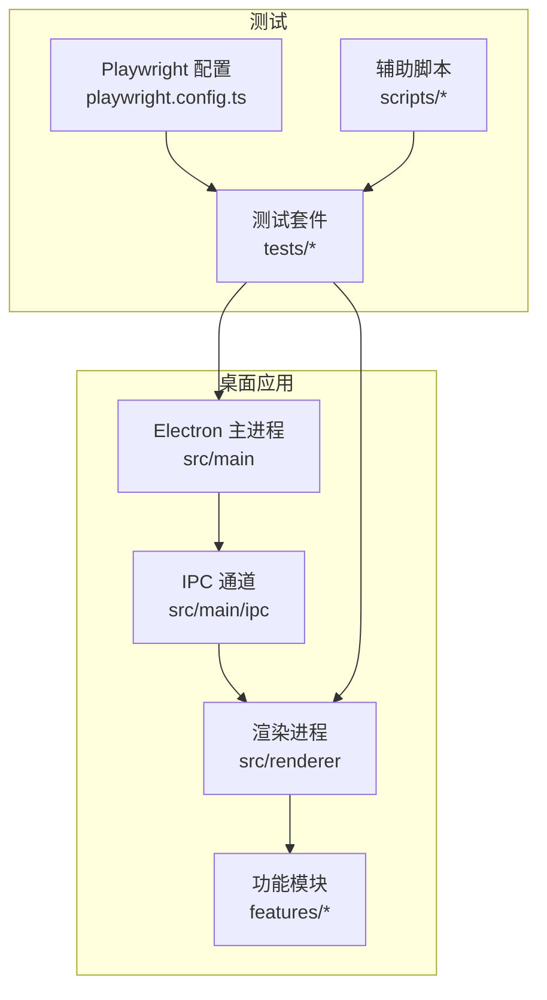
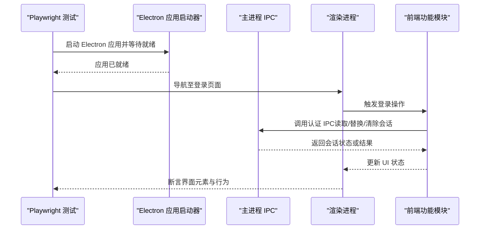
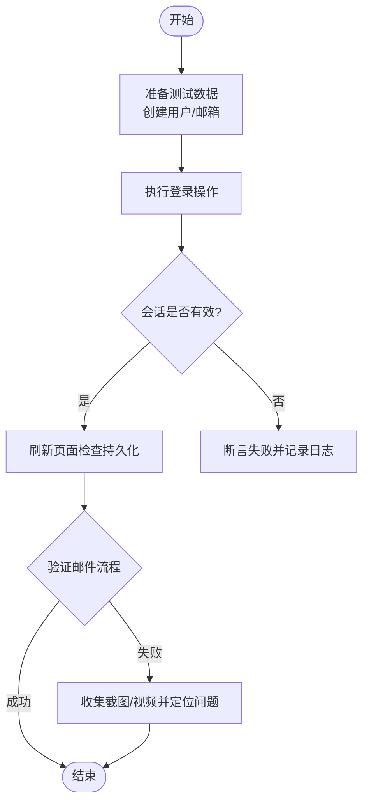
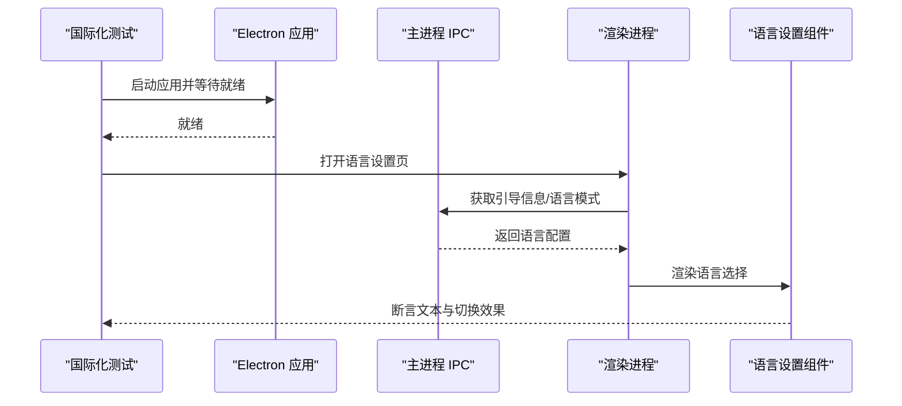
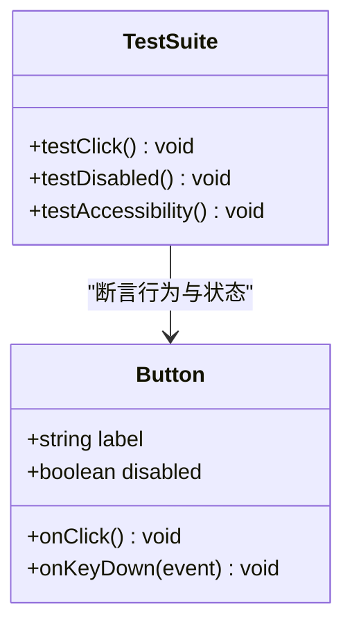
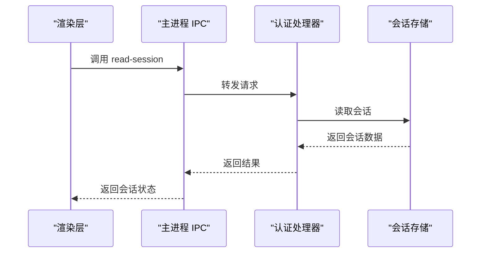
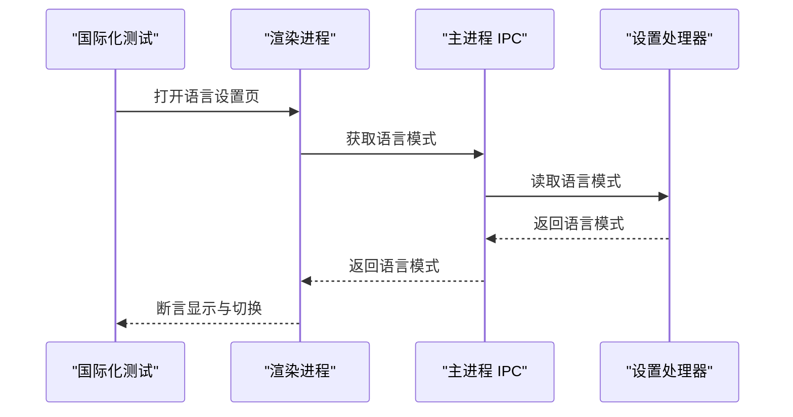
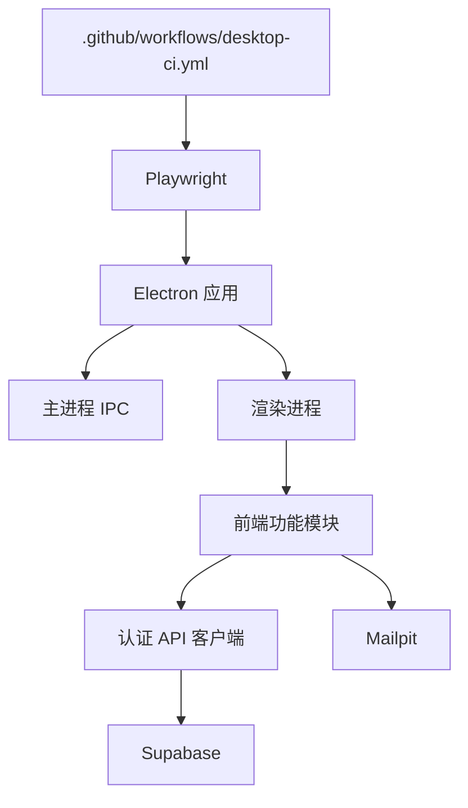

# 测试与调试

<cite>
**本文引用的文件**   
- [apps/desktop/playwright.config.ts](file://apps/desktop/playwright.config.ts)
- [apps/desktop/package.json](file://apps/desktop/package.json)
- [apps/desktop/electron.vite.config.ts](file://apps/desktop/electron.vite.config.ts)
- [apps/desktop/tests/helpers/electron-app.ts](file://apps/desktop/tests/helpers/electron-app.ts)
- [apps/desktop/tests/auth/login-boundary.spec.ts](file://apps/desktop/tests/auth/login-boundary.spec.ts)
- [apps/desktop/tests/auth/session-persistence.spec.ts](file://apps/desktop/tests/auth/session-persistence.spec.ts)
- [apps/desktop/tests/auth/signup-verification.spec.ts](file://apps/desktop/tests/auth/signup-verification.spec.ts)
- [apps/desktop/tests/auth/configuration.spec.ts](file://apps/desktop/tests/auth/configuration.spec.ts)
- [apps/desktop/tests/auth/public-config-policy.spec.ts](file://apps/desktop/tests/auth/public-config-policy.spec.ts)
- [apps/desktop/tests/auth/electron-security.spec.ts](file://apps/desktop/tests/auth/electron-security.spec.ts)
- [apps/desktop/tests/auth/helpers/supabase-auth.ts](file://apps/desktop/tests/auth/helpers/supabase-auth.ts)
- [apps/desktop/tests/auth/helpers/mailpit.ts](file://apps/desktop/tests/auth/helpers/mailpit.ts)
- [apps/desktop/tests/i18n/startup-language.spec.ts](file://apps/desktop/tests/i18n/startup-language.spec.ts)
- [apps/desktop/tests/i18n/language-mode-settings.spec.ts](file://apps/desktop/tests/i18n/language-mode-settings.spec.ts)
- [apps/desktop/tests/i18n/resource-contract.spec.ts](file://apps/desktop/tests/i18n/resource-contract.spec.ts)
- [apps/desktop/src/main/ipc/authentication/index.ts](file://apps/desktop/src/main/ipc/authentication/index.ts)
- [apps/desktop/src/main/ipc/authentication/handlers/read-session.ts](file://apps/desktop/src/main/ipc/authentication/handlers/read-session.ts)
- [apps/desktop/src/main/ipc/authentication/handlers/replace-session.ts](file://apps/desktop/src/main/ipc/authentication/handlers/replace-session.ts)
- [apps/desktop/src/main/ipc/authentication/clear-session.ts](file://apps/desktop/src/main/ipc/authentication/clear-session.ts)
- [apps/desktop/src/main/ipc/authentication/trusted-sender.ts](file://apps/desktop/src/main/ipc/authentication/trusted-sender.ts)
- [apps/desktop/src/main/ipc/i18n/index.ts](file://apps/desktop/src/main/ipc/i18n/index.ts)
- [apps/desktop/src/main/ipc/i18n/handlers/get-bootstrap.ts](file://apps/desktop/src/main/ipc/i18n/handlers/get-bootstrap.ts)
- [apps/desktop/src/main/ipc/settings/index.ts](file://apps/desktop/src/main/ipc/settings/index.ts)
- [apps/desktop/src/main/ipc/settings/handlers/get-language-mode.ts](file://apps/desktop/src/main/ipc/settings/handlers/get-language-mode.ts)
- [apps/desktop/src/main/ipc/settings/handlers/set-language-mode.ts](file://apps/desktop/src/main/ipc/settings/handlers/set-language-mode.ts)
- [apps/desktop/src/renderer/src/features/authentication/api/client.ts](file://apps/desktop/src/renderer/src/features/authentication/api/client.ts)
- [apps/desktop/src/renderer/src/features/authentication/components/authentication-screen.tsx](file://apps/desktop/src/renderer/src/features/authentication/components/authentication-screen.tsx)
- [apps/desktop/src/renderer/src/features/authentication/hooks/use-authentication.ts](file://apps/desktop/src/renderer/src/features/authentication/hooks/use-authentication.ts)
- [apps/desktop/src/renderer/src/features/language/settings/ui/language-mode-settings.tsx](file://apps/desktop/src/renderer/src/features/language/settings/ui/language-mode-settings.tsx)
- [apps/desktop/scripts/run-auth-e2e.sh](file://apps/desktop/scripts/run-auth-e2e.sh)
- [apps/desktop/scripts/verify-auth-artifacts.mjs](file://apps/desktop/scripts/verify-auth-artifacts.mjs)
- [.github/workflows/desktop-ci.yml](file://.github/workflows/desktop-ci.yml)
</cite>

## 目录
1. [简介](#简介)
2. [项目结构](#项目结构)
3. [核心组件](#核心组件)
4. [架构总览](#架构总览)
5. [详细组件分析](#详细组件分析)
6. [依赖分析](#依赖分析)
7. [性能考虑](#性能考虑)
8. [故障排查指南](#故障排查指南)
9. [结论](#结论)
10. [附录](#附录)

## 简介
本文件面向 nevix-ai 桌面应用程序的测试与调试，聚焦端到端（E2E）测试框架配置、测试用例编写与模拟策略。文档涵盖认证测试、国际化测试与 UI 组件测试，详细说明 Playwright 配置、测试数据管理、断言库使用、Mock 服务搭建与自动化流程，并提供调试技巧、日志分析与性能分析方法，以及常见问题与解决方案。

## 项目结构
桌面应用的 E2E 测试位于 apps/desktop 目录下，采用 Playwright 作为浏览器/应用自动化框架，结合 Electron 启动本地应用进程进行真实交互测试。关键目录与职责：
- playwright.config.ts：Playwright 全局配置（浏览器、超时、重试、报告、并行度等）。
- tests/：按功能域组织测试套件（auth、i18n、helpers）。
- scripts/：辅助脚本（运行认证 E2E、验证产物等）。
- src/main/ipc：主进程 IPC 通道与处理器（认证、国际化、设置）。
- src/renderer/src/features：渲染层功能模块（认证、语言设置、UI 组件）。

**图表来源** 
- [apps/desktop/playwright.config.ts](file://apps/desktop/playwright.config.ts)
- [apps/desktop/tests/helpers/electron-app.ts](file://apps/desktop/tests/helpers/electron-app.ts)
- [apps/desktop/src/main/ipc/authentication/index.ts](file://apps/desktop/src/main/ipc/authentication/index.ts)
- [apps/desktop/src/renderer/src/features/authentication/components/authentication-screen.tsx](file://apps/desktop/src/renderer/src/features/authentication/components/authentication-screen.tsx)

**章节来源**
- [apps/desktop/playwright.config.ts](file://apps/desktop/playwright.config.ts)
- [apps/desktop/tests/helpers/electron-app.ts](file://apps/desktop/tests/helpers/electron-app.ts)

## 核心组件
- Playwright 配置与 Runner：通过 playwright.config.ts 定义测试环境、浏览器选项、并行执行、报告输出等；配合 package.json 中的脚本命令统一入口。
- Electron 应用启动器：tests/helpers/electron-app.ts 封装了本地 Electron 进程的启动、等待就绪、关闭等生命周期管理。
- 认证测试套件：tests/auth/*.spec.ts 覆盖登录边界、会话持久化、注册校验、配置策略、安全策略等场景。
- 国际化测试套件：tests/i18n/*.spec.ts 覆盖启动语言、语言模式设置、资源契约一致性。
- Mock 服务：tests/auth/helpers/supabase-auth.ts 与 mailpit.ts 提供 Supabase 认证与邮件验证环境的辅助能力。
- 辅助脚本：scripts/run-auth-e2e.sh 与 verify-auth-artifacts.mjs 用于一键运行认证 E2E 与验证产物。

**章节来源**
- [apps/desktop/package.json](file://apps/desktop/package.json)
- [apps/desktop/tests/helpers/electron-app.ts](file://apps/desktop/tests/helpers/electron-app.ts)
- [apps/desktop/tests/auth/login-boundary.spec.ts](file://apps/desktop/tests/auth/login-boundary.spec.ts)
- [apps/desktop/tests/auth/session-persistence.spec.ts](file://apps/desktop/tests/auth/session-persistence.spec.ts)
- [apps/desktop/tests/auth/signup-verification.spec.ts](file://apps/desktop/tests/auth/signup-verification.spec.ts)
- [apps/desktop/tests/auth/configuration.spec.ts](file://apps/desktop/tests/auth/configuration.spec.ts)
- [apps/desktop/tests/auth/public-config-policy.spec.ts](file://apps/desktop/tests/auth/public-config-policy.spec.ts)
- [apps/desktop/tests/auth/electron-security.spec.ts](file://apps/desktop/tests/auth/electron-security.spec.ts)
- [apps/desktop/tests/auth/helpers/supabase-auth.ts](file://apps/desktop/tests/auth/helpers/supabase-auth.ts)
- [apps/desktop/tests/auth/helpers/mailpit.ts](file://apps/desktop/tests/auth/helpers/mailpit.ts)
- [apps/desktop/tests/i18n/startup-language.spec.ts](file://apps/desktop/tests/i18n/startup-language.spec.ts)
- [apps/desktop/tests/i18n/language-mode-settings.spec.ts](file://apps/desktop/tests/i18n/language-mode-settings.spec.ts)
- [apps/desktop/tests/i18n/resource-contract.spec.ts](file://apps/desktop/tests/i18n/resource-contract.spec.ts)
- [apps/desktop/scripts/run-auth-e2e.sh](file://apps/desktop/scripts/run-auth-e2e.sh)
- [apps/desktop/scripts/verify-auth-artifacts.mjs](file://apps/desktop/scripts/verify-auth-artifacts.mjs)

## 架构总览
下图展示 E2E 测试从 Playwright 到 Electron 应用、再到主进程 IPC 与渲染层功能的调用链，以及认证与国际化相关的关键路径。

**图表来源** 
- [apps/desktop/tests/helpers/electron-app.ts](file://apps/desktop/tests/helpers/electron-app.ts)
- [apps/desktop/src/main/ipc/authentication/index.ts](file://apps/desktop/src/main/ipc/authentication/index.ts)
- [apps/desktop/src/main/ipc/authentication/handlers/read-session.ts](file://apps/desktop/src/main/ipc/authentication/handlers/read-session.ts)
- [apps/desktop/src/main/ipc/authentication/handlers/replace-session.ts](file://apps/desktop/src/main/ipc/authentication/handlers/replace-session.ts)
- [apps/desktop/src/main/ipc/authentication/clear-session.ts](file://apps/desktop/src/main/ipc/authentication/clear-session.ts)
- [apps/desktop/src/renderer/src/features/authentication/components/authentication-screen.tsx](file://apps/desktop/src/renderer/src/features/authentication/components/authentication-screen.tsx)
- [apps/desktop/src/renderer/src/features/authentication/hooks/use-authentication.ts](file://apps/desktop/src/renderer/src/features/authentication/hooks/use-authentication.ts)

## 详细组件分析

### Playwright 配置与 Runner
- 配置文件：apps/desktop/playwright.config.ts 定义了测试环境、浏览器选项、超时、重试、报告、并行度等。
- 脚本入口：apps/desktop/package.json 中集成 Playwright 命令，便于在 CI 与本地快速运行。
- 建议：
  - 为不同环境（开发、CI）分离配置项（如超时、截图、视频录制）。
  - 合理设置并行度与重试次数，平衡稳定性与速度。
  - 启用 HTML 报告与失败截图/视频，提升可观测性。

**章节来源**
- [apps/desktop/playwright.config.ts](file://apps/desktop/playwright.config.ts)
- [apps/desktop/package.json](file://apps/desktop/package.json)

### Electron 应用启动器
- 位置：apps/desktop/tests/helpers/electron-app.ts
- 职责：封装 Electron 进程启动、等待窗口就绪、错误捕获、优雅关闭。
- 最佳实践：
  - 在测试 beforeAll/afterAll 钩子中集中管理生命周期。
  - 对启动失败进行重试与诊断（端口占用、依赖缺失）。
  - 确保测试隔离，避免跨用例状态污染。

**章节来源**
- [apps/desktop/tests/helpers/electron-app.ts](file://apps/desktop/tests/helpers/electron-app.ts)

### 认证测试套件
- 覆盖范围：
  - 登录边界条件：无效凭据、空输入、网络异常等。
  - 会话持久化：登录后刷新页面仍保持登录态。
  - 注册校验：邮箱格式、密码策略、验证码流程。
  - 公共配置策略：Supabase 公开配置的正确性与限制。
  - Electron 安全策略：上下文隔离、权限控制等。
- 关键实现要点：
  - 使用 supabase-auth.ts 与 mailpit.ts 构造测试数据与验证邮件。
  - 通过 IPC 调用 read-session/replace-session/clear-session 验证后端状态。
  - 断言 UI 元素与提示信息，确保用户体验一致。

**图表来源** 
- [apps/desktop/tests/auth/login-boundary.spec.ts](file://apps/desktop/tests/auth/login-boundary.spec.ts)
- [apps/desktop/tests/auth/session-persistence.spec.ts](file://apps/desktop/tests/auth/session-persistence.spec.ts)
- [apps/desktop/tests/auth/signup-verification.spec.ts](file://apps/desktop/tests/auth/signup-verification.spec.ts)
- [apps/desktop/tests/auth/helpers/supabase-auth.ts](file://apps/desktop/tests/auth/helpers/supabase-auth.ts)
- [apps/desktop/tests/auth/helpers/mailpit.ts](file://apps/desktop/tests/auth/helpers/mailpit.ts)

**章节来源**
- [apps/desktop/tests/auth/login-boundary.spec.ts](file://apps/desktop/tests/auth/login-boundary.spec.ts)
- [apps/desktop/tests/auth/session-persistence.spec.ts](file://apps/desktop/tests/auth/session-persistence.spec.ts)
- [apps/desktop/tests/auth/signup-verification.spec.ts](file://apps/desktop/tests/auth/signup-verification.spec.ts)
- [apps/desktop/tests/auth/configuration.spec.ts](file://apps/desktop/tests/auth/configuration.spec.ts)
- [apps/desktop/tests/auth/public-config-policy.spec.ts](file://apps/desktop/tests/auth/public-config-policy.spec.ts)
- [apps/desktop/tests/auth/electron-security.spec.ts](file://apps/desktop/tests/auth/electron-security.spec.ts)
- [apps/desktop/tests/auth/helpers/supabase-auth.ts](file://apps/desktop/tests/auth/helpers/supabase-auth.ts)
- [apps/desktop/tests/auth/helpers/mailpit.ts](file://apps/desktop/tests/auth/helpers/mailpit.ts)

### 国际化测试套件
- 覆盖范围：
  - 启动语言：应用启动时根据系统或配置加载正确语言。
  - 语言模式设置：切换语言后 UI 即时生效。
  - 资源契约：多语言资源键值一致性校验。
- 关键实现要点：
  - 通过 IPC 获取引导信息与语言模式，断言渲染文本。
  - 使用断言库验证 i18n 资源完整性与键名规范。

**图表来源** 
- [apps/desktop/tests/i18n/startup-language.spec.ts](file://apps/desktop/tests/i18n/startup-language.spec.ts)
- [apps/desktop/tests/i18n/language-mode-settings.spec.ts](file://apps/desktop/tests/i18n/language-mode-settings.spec.ts)
- [apps/desktop/tests/i18n/resource-contract.spec.ts](file://apps/desktop/tests/i18n/resource-contract.spec.ts)
- [apps/desktop/src/main/ipc/i18n/index.ts](file://apps/desktop/src/main/ipc/i18n/index.ts)
- [apps/desktop/src/main/ipc/i18n/handlers/get-bootstrap.ts](file://apps/desktop/src/main/ipc/i18n/handlers/get-bootstrap.ts)
- [apps/desktop/src/renderer/src/features/language/settings/ui/language-mode-settings.tsx](file://apps/desktop/src/renderer/src/features/language/settings/ui/language-mode-settings.tsx)

**章节来源**
- [apps/desktop/tests/i18n/startup-language.spec.ts](file://apps/desktop/tests/i18n/startup-language.spec.ts)
- [apps/desktop/tests/i18n/language-mode-settings.spec.ts](file://apps/desktop/tests/i18n/language-mode-settings.spec.ts)
- [apps/desktop/tests/i18n/resource-contract.spec.ts](file://apps/desktop/tests/i18n/resource-contract.spec.ts)
- [apps/desktop/src/main/ipc/i18n/index.ts](file://apps/desktop/src/main/ipc/i18n/index.ts)
- [apps/desktop/src/main/ipc/i18n/handlers/get-bootstrap.ts](file://apps/desktop/src/main/ipc/i18n/handlers/get-bootstrap.ts)
- [apps/desktop/src/renderer/src/features/language/settings/ui/language-mode-settings.tsx](file://apps/desktop/src/renderer/src/features/language/settings/ui/language-mode-settings.tsx)

### UI 组件测试（以按钮为例）
- 目标：验证 UI 组件的可访问性、交互行为与样式。
- 方法：
  - 使用 Playwright 定位元素并触发点击、键盘事件。
  - 断言组件状态变化（禁用、加载、提示消息）。
  - 结合 a11y 断言确保无障碍支持。

[此图为概念性类图，不直接映射具体源码文件]

**章节来源**
- [apps/desktop/src/renderer/src/components/ui/button.tsx](file://apps/desktop/src/renderer/src/components/ui/button.tsx)

### 认证 IPC 与处理逻辑
- 主进程 IPC：
  - authentication/index.ts：注册认证相关 IPC 通道。
  - handlers/read-session.ts：读取当前会话。
  - handlers/replace-session.ts：替换会话（例如刷新令牌）。
  - clear-session.ts：清除会话。
  - trusted-sender.ts：校验发送者可信性。
- 渲染层：
  - features/authentication/api/client.ts：封装认证 API 客户端。
  - components/authentication-screen.tsx：登录界面组件。
  - hooks/use-authentication.ts：认证状态管理与副作用。

**图表来源** 
- [apps/desktop/src/main/ipc/authentication/index.ts](file://apps/desktop/src/main/ipc/authentication/index.ts)
- [apps/desktop/src/main/ipc/authentication/handlers/read-session.ts](file://apps/desktop/src/main/ipc/authentication/handlers/read-session.ts)
- [apps/desktop/src/main/ipc/authentication/handlers/replace-session.ts](file://apps/desktop/src/main/ipc/authentication/handlers/replace-session.ts)
- [apps/desktop/src/main/ipc/authentication/clear-session.ts](file://apps/desktop/src/main/ipc/authentication/clear-session.ts)
- [apps/desktop/src/main/ipc/authentication/trusted-sender.ts](file://apps/desktop/src/main/ipc/authentication/trusted-sender.ts)
- [apps/desktop/src/renderer/src/features/authentication/api/client.ts](file://apps/desktop/src/renderer/src/features/authentication/api/client.ts)
- [apps/desktop/src/renderer/src/features/authentication/components/authentication-screen.tsx](file://apps/desktop/src/renderer/src/features/authentication/components/authentication-screen.tsx)
- [apps/desktop/src/renderer/src/features/authentication/hooks/use-authentication.ts](file://apps/desktop/src/renderer/src/features/authentication/hooks/use-authentication.ts)

**章节来源**
- [apps/desktop/src/main/ipc/authentication/index.ts](file://apps/desktop/src/main/ipc/authentication/index.ts)
- [apps/desktop/src/main/ipc/authentication/handlers/read-session.ts](file://apps/desktop/src/main/ipc/authentication/handlers/read-session.ts)
- [apps/desktop/src/main/ipc/authentication/handlers/replace-session.ts](file://apps/desktop/src/main/ipc/authentication/handlers/replace-session.ts)
- [apps/desktop/src/main/ipc/authentication/clear-session.ts](file://apps/desktop/src/main/ipc/authentication/clear-session.ts)
- [apps/desktop/src/main/ipc/authentication/trusted-sender.ts](file://apps/desktop/src/main/ipc/authentication/trusted-sender.ts)
- [apps/desktop/src/renderer/src/features/authentication/api/client.ts](file://apps/desktop/src/renderer/src/features/authentication/api/client.ts)
- [apps/desktop/src/renderer/src/features/authentication/components/authentication-screen.tsx](file://apps/desktop/src/renderer/src/features/authentication/components/authentication-screen.tsx)
- [apps/desktop/src/renderer/src/features/authentication/hooks/use-authentication.ts](file://apps/desktop/src/renderer/src/features/authentication/hooks/use-authentication.ts)

### 国际化 IPC 与设置
- 主进程 IPC：
  - i18n/index.ts：注册国际化相关通道。
  - get-bootstrap.ts：获取引导信息（含语言模式）。
  - settings/index.ts：注册设置相关通道。
  - get-language-mode.ts / set-language-mode.ts：读写语言模式。
- 渲染层：
  - language-mode-settings.tsx：语言模式设置 UI。

**图表来源** 
- [apps/desktop/src/main/ipc/i18n/index.ts](file://apps/desktop/src/main/ipc/i18n/index.ts)
- [apps/desktop/src/main/ipc/i18n/handlers/get-bootstrap.ts](file://apps/desktop/src/main/ipc/i18n/handlers/get-bootstrap.ts)
- [apps/desktop/src/main/ipc/settings/index.ts](file://apps/desktop/src/main/ipc/settings/index.ts)
- [apps/desktop/src/main/ipc/settings/handlers/get-language-mode.ts](file://apps/desktop/src/main/ipc/settings/handlers/get-language-mode.ts)
- [apps/desktop/src/main/ipc/settings/handlers/set-language-mode.ts](file://apps/desktop/src/main/ipc/settings/handlers/set-language-mode.ts)
- [apps/desktop/src/renderer/src/features/language/settings/ui/language-mode-settings.tsx](file://apps/desktop/src/renderer/src/features/language/settings/ui/language-mode-settings.tsx)

**章节来源**
- [apps/desktop/src/main/ipc/i18n/index.ts](file://apps/desktop/src/main/ipc/i18n/index.ts)
- [apps/desktop/src/main/ipc/i18n/handlers/get-bootstrap.ts](file://apps/desktop/src/main/ipc/i18n/handlers/get-bootstrap.ts)
- [apps/desktop/src/main/ipc/settings/index.ts](file://apps/desktop/src/main/ipc/settings/index.ts)
- [apps/desktop/src/main/ipc/settings/handlers/get-language-mode.ts](file://apps/desktop/src/main/ipc/settings/handlers/get-language-mode.ts)
- [apps/desktop/src/main/ipc/settings/handlers/set-language-mode.ts](file://apps/desktop/src/main/ipc/settings/handlers/set-language-mode.ts)
- [apps/desktop/src/renderer/src/features/language/settings/ui/language-mode-settings.tsx](file://apps/desktop/src/renderer/src/features/language/settings/ui/language-mode-settings.tsx)

### 构建与 Vite/Electron 配置
- electron.vite.config.ts：定义 Electron 与 Vite 的构建配置，影响测试环境下的资源加载与热更新。
- 建议：
  - 在测试环境中禁用不必要的插件以提升速度。
  - 明确区分开发与测试的构建产物路径。

**章节来源**
- [apps/desktop/electron.vite.config.ts](file://apps/desktop/electron.vite.config.ts)

## 依赖分析
- 测试框架依赖：Playwright、Electron、Vite。
- 外部服务依赖：Supabase（认证）、Mailpit（邮件验证）。
- CI 集成：GitHub Actions 工作流驱动桌面 CI。

**图表来源** 
- [apps/desktop/playwright.config.ts](file://apps/desktop/playwright.config.ts)
- [apps/desktop/tests/helpers/electron-app.ts](file://apps/desktop/tests/helpers/electron-app.ts)
- [apps/desktop/src/renderer/src/features/authentication/api/client.ts](file://apps/desktop/src/renderer/src/features/authentication/api/client.ts)
- [apps/desktop/tests/auth/helpers/supabase-auth.ts](file://apps/desktop/tests/auth/helpers/supabase-auth.ts)
- [apps/desktop/tests/auth/helpers/mailpit.ts](file://apps/desktop/tests/auth/helpers/mailpit.ts)
- [.github/workflows/desktop-ci.yml](file://.github/workflows/desktop-ci.yml)

**章节来源**
- [apps/desktop/playwright.config.ts](file://apps/desktop/playwright.config.ts)
- [apps/desktop/tests/helpers/electron-app.ts](file://apps/desktop/tests/helpers/electron-app.ts)
- [apps/desktop/src/renderer/src/features/authentication/api/client.ts](file://apps/desktop/src/renderer/src/features/authentication/api/client.ts)
- [apps/desktop/tests/auth/helpers/supabase-auth.ts](file://apps/desktop/tests/auth/helpers/supabase-auth.ts)
- [apps/desktop/tests/auth/helpers/mailpit.ts](file://apps/desktop/tests/auth/helpers/mailpit.ts)
- [.github/workflows/desktop-ci.yml](file://.github/workflows/desktop-ci.yml)

## 性能考虑
- 并行执行：合理设置 Playwright 并行度，避免资源竞争。
- 超时与重试：针对网络波动与 Electron 启动时间调整超时与重试策略。
- 截图与视频：仅在失败时录制，减少 I/O 开销。
- 缓存与预热：复用 Supabase/Mailpit 实例，减少初始化时间。
- 构建优化：测试环境禁用不必要插件，缩短构建时间。

[本节为通用指导，不直接分析具体文件]

## 故障排查指南
- 常见症状：
  - 应用启动失败：检查端口占用、依赖安装、环境变量。
  - 认证失败：确认 Supabase 配置、邮件服务可达性、用户状态。
  - 国际化不一致：核对资源键值、语言包加载顺序。
  - UI 断言不稳定：增加等待策略、避免硬编码延迟。
- 调试技巧：
  - 启用 Playwright 调试模式（headed、trace、截图、视频）。
  - 在主进程与渲染进程添加结构化日志，定位 IPC 调用链。
  - 使用辅助脚本 run-auth-e2e.sh 与 verify-auth-artifacts.mjs 快速复现与验证。
- 日志分析：
  - 查看 Playwright HTML 报告与附件。
  - 分析 Electron 控制台输出与 IPC 日志。
  - 检查 Supabase 与 Mailpit 的服务日志。

**章节来源**
- [apps/desktop/scripts/run-auth-e2e.sh](file://apps/desktop/scripts/run-auth-e2e.sh)
- [apps/desktop/scripts/verify-auth-artifacts.mjs](file://apps/desktop/scripts/verify-auth-artifacts.mjs)

## 结论
nevix-ai 桌面应用的测试体系以 Playwright 为核心，结合 Electron 启动器与丰富的测试套件，覆盖了认证、国际化与 UI 组件等关键路径。通过清晰的 IPC 设计与模块化测试结构，团队能够高效编写与维护测试用例。建议在持续集成中强化自动化与可观测性，进一步提升质量与交付效率。

[本节为总结性内容，不直接分析具体文件]

## 附录
- 常用命令：
  - 运行全部 E2E：参考 package.json 中的脚本。
  - 运行认证 E2E：使用 scripts/run-auth-e2e.sh。
  - 验证产物：使用 scripts/verify-auth-artifacts.mjs。
- 调试参数：
  - headed：可视化运行。
  - trace：生成追踪文件。
  - screenshot/video：失败时自动录制。

[本节为补充信息，不直接分析具体文件]