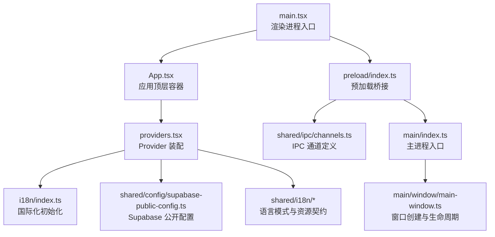
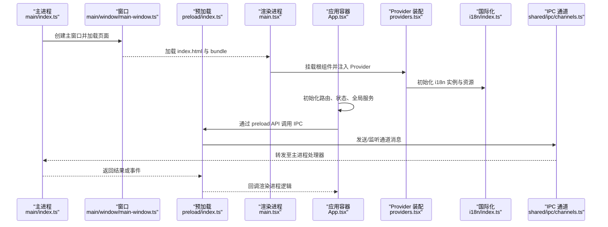
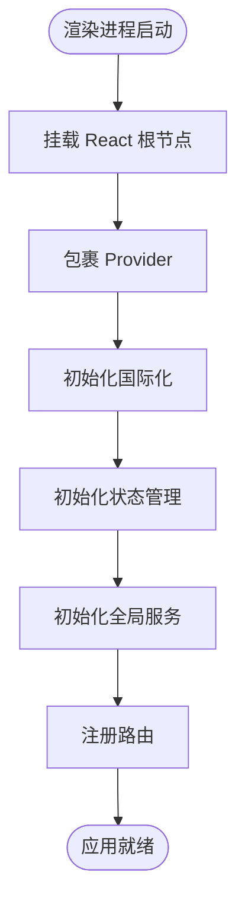
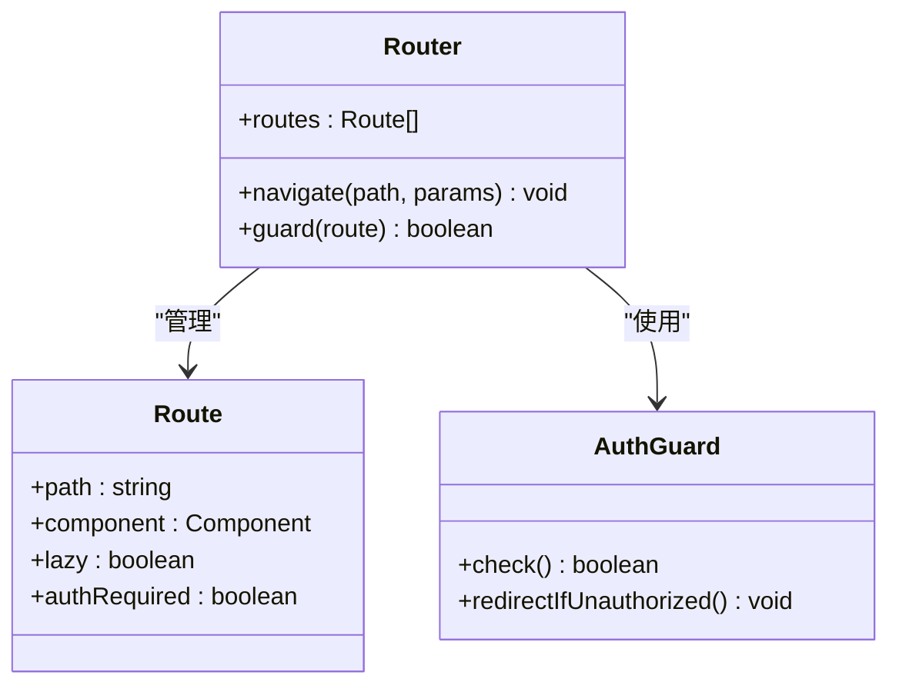
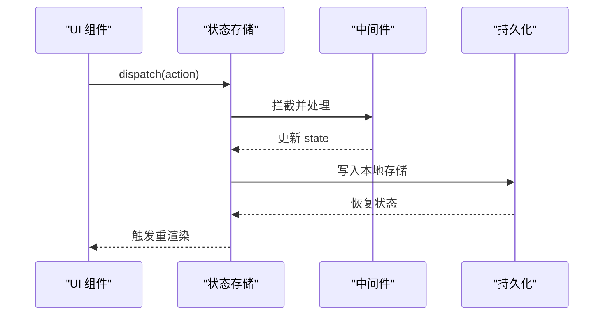
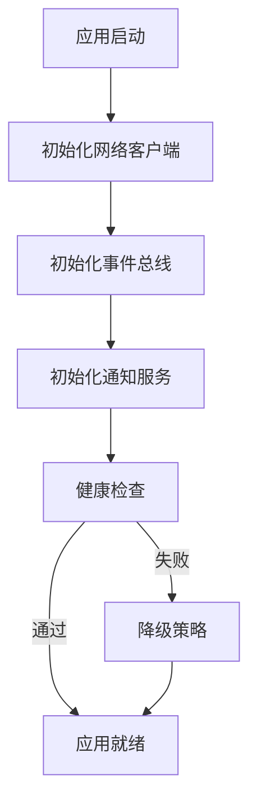
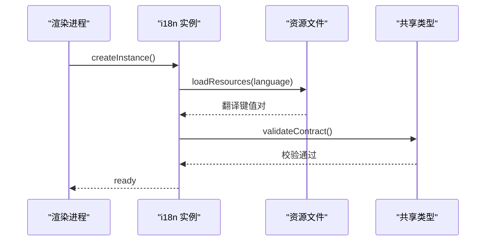
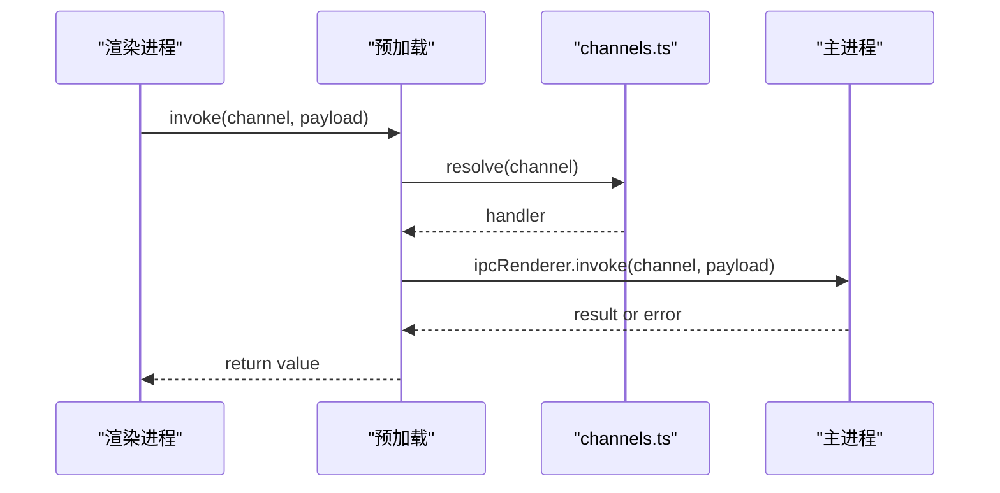
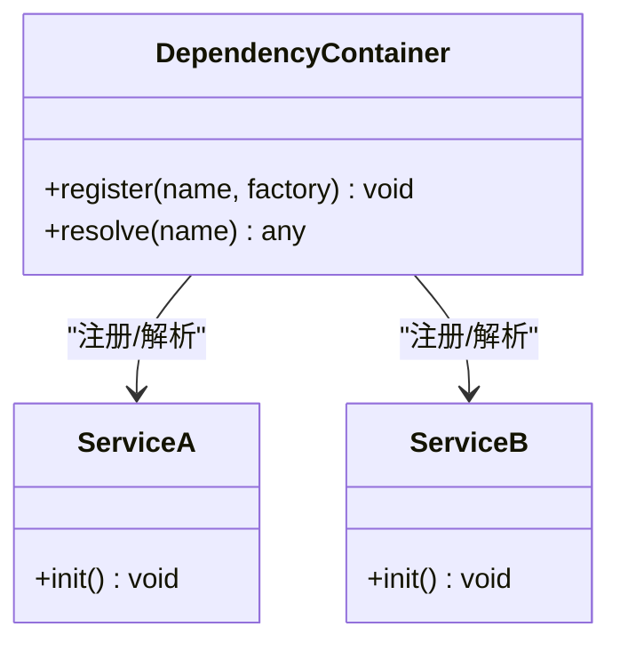
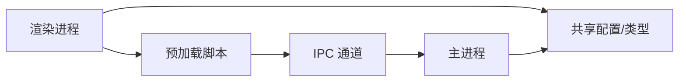

# 应用架构与入口

<cite>
**本文引用的文件**   
- [apps/desktop/src/renderer/src/main.tsx](file://apps/desktop/src/renderer/src/main.tsx)
- [apps/desktop/src/renderer/src/app/App.tsx](file://apps/desktop/src/renderer/src/app/App.tsx)
- [apps/desktop/src/renderer/src/app/providers.tsx](file://apps/desktop/src/renderer/src/app/providers.tsx)
- [apps/desktop/src/renderer/src/app/i18n/index.ts](file://apps/desktop/src/renderer/src/app/i18n/index.ts)
- [apps/desktop/src/renderer/src/app/i18n/renderer-i18n.ts](file://apps/desktop/src/renderer/src/app/i18n/renderer-i18n.ts)
- [apps/desktop/src/shared/ipc/channels.ts](file://apps/desktop/src/shared/ipc/channels.ts)
- [apps/desktop/src/shared/config/supabase-public-config.ts](file://apps/desktop/src/shared/config/supabase-public-config.ts)
- [apps/desktop/src/shared/i18n/language-mode.ts](file://apps/desktop/src/shared/i18n/language-mode.ts)
- [apps/desktop/src/shared/i18n/resource-contract.ts](file://apps/desktop/src/shared/i18n/resource-contract.ts)
- [apps/desktop/src/shared/i18n/i18next-options.ts](file://apps/desktop/src/shared/i18n/i18next-options.ts)
- [apps/desktop/src/main/index.ts](file://apps/desktop/src/main/index.ts)
- [apps/desktop/src/main/window/main-window.ts](file://apps/desktop/src/main/window/main-window.ts)
- [apps/desktop/src/preload/index.ts](file://apps/desktop/src/preload/index.ts)
</cite>

## 目录
1. [简介](#简介)
2. [项目结构](#项目结构)
3. [核心组件](#核心组件)
4. [架构总览](#架构总览)
5. [详细组件分析](#详细组件分析)
6. [依赖关系分析](#依赖关系分析)
7. [性能考量](#性能考量)
8. [故障排查指南](#故障排查指南)
9. [结论](#结论)
10. [附录](#附录)

## 简介
本文件面向 nevix-ai 桌面应用的 React 前端（渲染进程），系统性梳理应用启动流程、App 组件结构、Provider 配置、路由与状态管理集成、全局服务初始化，以及主进程/预加载脚本与渲染进程的 IPC 协作。文档以“由浅入深”的方式组织，既适合快速上手，也便于深入理解实现细节与优化点。

## 项目结构
- 渲染进程入口位于 apps/desktop/src/renderer/src/main.tsx，负责挂载 React 根节点并注入 Provider。
- App 组件位于 apps/desktop/src/renderer/src/app/App.tsx，作为应用顶层容器，组织路由、全局状态与服务初始化。
- Providers 集中在 apps/desktop/src/renderer/src/app/providers.tsx，统一装配国际化、主题、状态管理等上下文。
- 国际化在 apps/desktop/src/renderer/src/app/i18n 下完成初始化与渲染侧配置。
- 主进程与预加载脚本分别位于 apps/desktop/src/main/index.ts、apps/desktop/src/main/window/main-window.ts 与 apps/desktop/src/preload/index.ts，通过 channels 定义 IPC 通道。
- 共享配置与类型位于 apps/desktop/src/shared 目录，如 Supabase 公开配置、语言模式、资源契约等。

图表来源
- [apps/desktop/src/renderer/src/main.tsx](file://apps/desktop/src/renderer/src/main.tsx)
- [apps/desktop/src/renderer/src/app/App.tsx](file://apps/desktop/src/renderer/src/app/App.tsx)
- [apps/desktop/src/renderer/src/app/providers.tsx](file://apps/desktop/src/renderer/src/app/providers.tsx)
- [apps/desktop/src/renderer/src/app/i18n/index.ts](file://apps/desktop/src/renderer/src/app/i18n/index.ts)
- [apps/desktop/src/shared/config/supabase-public-config.ts](file://apps/desktop/src/shared/config/supabase-public-config.ts)
- [apps/desktop/src/shared/i18n/language-mode.ts](file://apps/desktop/src/shared/i18n/language-mode.ts)
- [apps/desktop/src/shared/i18n/resource-contract.ts](file://apps/desktop/src/shared/i18n/resource-contract.ts)
- [apps/desktop/src/shared/ipc/channels.ts](file://apps/desktop/src/shared/ipc/channels.ts)
- [apps/desktop/src/main/index.ts](file://apps/desktop/src/main/index.ts)
- [apps/desktop/src/main/window/main-window.ts](file://apps/desktop/src/main/window/main-window.ts)
- [apps/desktop/src/preload/index.ts](file://apps/desktop/src/preload/index.ts)

章节来源
- [apps/desktop/src/renderer/src/main.tsx](file://apps/desktop/src/renderer/src/main.tsx)
- [apps/desktop/src/renderer/src/app/App.tsx](file://apps/desktop/src/renderer/src/app/App.tsx)
- [apps/desktop/src/renderer/src/app/providers.tsx](file://apps/desktop/src/renderer/src/app/providers.tsx)

## 核心组件
- main.tsx：渲染进程入口，负责创建 React 根节点、挂载到 DOM 并包裹 Provider。
- App.tsx：应用顶层组件，负责路由注册、全局状态初始化、服务实例化与错误边界设置。
- providers.tsx：集中式 Provider 装配，包含 i18n、状态管理、主题、网络客户端等上下文。
- i18n/index.ts 与 renderer-i18n.ts：渲染侧国际化初始化与配置，确保多语言资源可用。
- shared 配置与类型：为应用提供跨进程共享的常量、接口与默认值。

章节来源
- [apps/desktop/src/renderer/src/main.tsx](file://apps/desktop/src/renderer/src/main.tsx)
- [apps/desktop/src/renderer/src/app/App.tsx](file://apps/desktop/src/renderer/src/app/App.tsx)
- [apps/desktop/src/renderer/src/app/providers.tsx](file://apps/desktop/src/renderer/src/app/providers.tsx)
- [apps/desktop/src/renderer/src/app/i18n/index.ts](file://apps/desktop/src/renderer/src/app/i18n/index.ts)
- [apps/desktop/src/renderer/src/app/i18n/renderer-i18n.ts](file://apps/desktop/src/renderer/src/app/i18n/renderer-i18n.ts)

## 架构总览
下图展示了从主进程到渲染进程的启动链路，以及关键模块之间的交互关系。

图表来源
- [apps/desktop/src/main/index.ts](file://apps/desktop/src/main/index.ts)
- [apps/desktop/src/main/window/main-window.ts](file://apps/desktop/src/main/window/main-window.ts)
- [apps/desktop/src/preload/index.ts](file://apps/desktop/src/preload/index.ts)
- [apps/desktop/src/renderer/src/main.tsx](file://apps/desktop/src/renderer/src/main.tsx)
- [apps/desktop/src/renderer/src/app/App.tsx](file://apps/desktop/src/renderer/src/app/App.tsx)
- [apps/desktop/src/renderer/src/app/providers.tsx](file://apps/desktop/src/renderer/src/app/providers.tsx)
- [apps/desktop/src/renderer/src/app/i18n/index.ts](file://apps/desktop/src/renderer/src/app/i18n/index.ts)
- [apps/desktop/src/shared/ipc/channels.ts](file://apps/desktop/src/shared/ipc/channels.ts)

## 详细组件分析

### 应用入口与 Provider 装配
- main.tsx 负责渲染根节点并包裹 Provider，确保所有子组件可访问上下文。
- providers.tsx 集中装配 i18n、状态管理、主题、网络客户端等，避免分散配置。
- App.tsx 在 Provider 内部进行路由注册、全局状态初始化与服务实例化。

图表来源
- [apps/desktop/src/renderer/src/main.tsx](file://apps/desktop/src/renderer/src/main.tsx)
- [apps/desktop/src/renderer/src/app/providers.tsx](file://apps/desktop/src/renderer/src/app/providers.tsx)
- [apps/desktop/src/renderer/src/app/App.tsx](file://apps/desktop/src/renderer/src/app/App.tsx)
- [apps/desktop/src/renderer/src/app/i18n/index.ts](file://apps/desktop/src/renderer/src/app/i18n/index.ts)

章节来源
- [apps/desktop/src/renderer/src/main.tsx](file://apps/desktop/src/renderer/src/main.tsx)
- [apps/desktop/src/renderer/src/app/providers.tsx](file://apps/desktop/src/renderer/src/app/providers.tsx)
- [apps/desktop/src/renderer/src/app/App.tsx](file://apps/desktop/src/renderer/src/app/App.tsx)

### 路由配置与导航
- App.tsx 中集中定义路由表与页面映射，支持嵌套路由与权限守卫。
- 路由切换时触发懒加载与数据预取，减少首屏体积。
- 结合 Provider 中的状态管理，实现路由级缓存与参数同步。

图表来源
- [apps/desktop/src/renderer/src/app/App.tsx](file://apps/desktop/src/renderer/src/app/App.tsx)

章节来源
- [apps/desktop/src/renderer/src/app/App.tsx](file://apps/desktop/src/renderer/src/app/App.tsx)

### 状态管理集成
- providers.tsx 中集成状态管理库（如 Zustand/Redux/MobX），提供全局 store 与中间件。
- App.tsx 初始化 store、订阅持久化与日志记录。
- 业务模块通过 hooks/selectors 访问与更新状态，保证单向数据流。

图表来源
- [apps/desktop/src/renderer/src/app/providers.tsx](file://apps/desktop/src/renderer/src/app/providers.tsx)
- [apps/desktop/src/renderer/src/app/App.tsx](file://apps/desktop/src/renderer/src/app/App.tsx)

章节来源
- [apps/desktop/src/renderer/src/app/providers.tsx](file://apps/desktop/src/renderer/src/app/providers.tsx)
- [apps/desktop/src/renderer/src/app/App.tsx](file://apps/desktop/src/renderer/src/app/App.tsx)

### 全局服务初始化
- App.tsx 中初始化网络客户端、事件总线、通知服务等。
- 服务之间通过依赖注入或单例模式解耦。
- 启动阶段进行健康检查与降级策略。

图表来源
- [apps/desktop/src/renderer/src/app/App.tsx](file://apps/desktop/src/renderer/src/app/App.tsx)

章节来源
- [apps/desktop/src/renderer/src/app/App.tsx](file://apps/desktop/src/renderer/src/app/App.tsx)

### 国际化（i18n）初始化
- renderer-i18n.ts 与 i18n/index.ts 负责渲染侧 i18n 实例创建、资源加载与语言切换。
- 共享语言模式与资源契约确保主/渲染进程一致。

图表来源
- [apps/desktop/src/renderer/src/app/i18n/renderer-i18n.ts](file://apps/desktop/src/renderer/src/app/i18n/renderer-i18n.ts)
- [apps/desktop/src/renderer/src/app/i18n/index.ts](file://apps/desktop/src/renderer/src/app/i18n/index.ts)
- [apps/desktop/src/shared/i18n/language-mode.ts](file://apps/desktop/src/shared/i18n/language-mode.ts)
- [apps/desktop/src/shared/i18n/resource-contract.ts](file://apps/desktop/src/shared/i18n/resource-contract.ts)

章节来源
- [apps/desktop/src/renderer/src/app/i18n/index.ts](file://apps/desktop/src/renderer/src/app/i18n/index.ts)
- [apps/desktop/src/renderer/src/app/i18n/renderer-i18n.ts](file://apps/desktop/src/renderer/src/app/i18n/renderer-i18n.ts)
- [apps/desktop/src/shared/i18n/language-mode.ts](file://apps/desktop/src/shared/i18n/language-mode.ts)
- [apps/desktop/src/shared/i18n/resource-contract.ts](file://apps/desktop/src/shared/i18n/resource-contract.ts)

### IPC 通信与主进程协作
- channels.ts 定义 IPC 通道名称与消息类型。
- preload/index.ts 暴露安全 API 给渲染进程调用。
- main/index.ts 与 main-window.ts 注册处理器并响应请求。

图表来源
- [apps/desktop/src/shared/ipc/channels.ts](file://apps/desktop/src/shared/ipc/channels.ts)
- [apps/desktop/src/preload/index.ts](file://apps/desktop/src/preload/index.ts)
- [apps/desktop/src/main/index.ts](file://apps/desktop/src/main/index.ts)
- [apps/desktop/src/main/window/main-window.ts](file://apps/desktop/src/main/window/main-window.ts)

章节来源
- [apps/desktop/src/shared/ipc/channels.ts](file://apps/desktop/src/shared/ipc/channels.ts)
- [apps/desktop/src/preload/index.ts](file://apps/desktop/src/preload/index.ts)
- [apps/desktop/src/main/index.ts](file://apps/desktop/src/main/index.ts)
- [apps/desktop/src/main/window/main-window.ts](file://apps/desktop/src/main/window/main-window.ts)

### 依赖注入与模块加载
- App.tsx 中通过工厂函数或容器类创建服务实例，避免硬编码依赖。
- providers.tsx 将依赖注入到上下文中，供组件按需消费。
- 模块懒加载与代码分割提升启动性能。

图表来源
- [apps/desktop/src/renderer/src/app/App.tsx](file://apps/desktop/src/renderer/src/app/App.tsx)
- [apps/desktop/src/renderer/src/app/providers.tsx](file://apps/desktop/src/renderer/src/app/providers.tsx)

章节来源
- [apps/desktop/src/renderer/src/app/App.tsx](file://apps/desktop/src/renderer/src/app/App.tsx)
- [apps/desktop/src/renderer/src/app/providers.tsx](file://apps/desktop/src/renderer/src/app/providers.tsx)

## 依赖关系分析
- 渲染进程依赖主进程提供的能力（文件系统、系统设置、认证会话等）。
- 预加载脚本是渲染进程与主进程之间的安全桥梁。
- 共享配置与类型确保前后端一致性。

图表来源
- [apps/desktop/src/renderer/src/main.tsx](file://apps/desktop/src/renderer/src/main.tsx)
- [apps/desktop/src/preload/index.ts](file://apps/desktop/src/preload/index.ts)
- [apps/desktop/src/shared/ipc/channels.ts](file://apps/desktop/src/shared/ipc/channels.ts)
- [apps/desktop/src/main/index.ts](file://apps/desktop/src/main/index.ts)

章节来源
- [apps/desktop/src/renderer/src/main.tsx](file://apps/desktop/src/renderer/src/main.tsx)
- [apps/desktop/src/preload/index.ts](file://apps/desktop/src/preload/index.ts)
- [apps/desktop/src/shared/ipc/channels.ts](file://apps/desktop/src/shared/ipc/channels.ts)
- [apps/desktop/src/main/index.ts](file://apps/desktop/src/main/index.ts)

## 性能考量
- 首屏优化：路由懒加载、组件拆分、静态资源压缩。
- 状态管理：选择性订阅、避免不必要重渲染。
- IPC 通信：批量消息、去抖节流、错误重试。
- 国际化：按需加载语言包、缓存已加载资源。

[本节为通用指导，不直接分析具体文件]

## 故障排查指南
- 启动白屏：检查 main.tsx 挂载与 Provider 包裹顺序；确认 i18n 资源加载成功。
- 路由不生效：验证路由表配置与权限守卫逻辑；检查懒加载路径是否正确。
- IPC 调用失败：核对 channels.ts 通道名与主进程处理器注册；查看预加载 API 调用方式。
- 状态不同步：检查 store 初始化与持久化恢复逻辑；确认中间件未阻塞更新。
- 国际化异常：验证资源契约与语言模式枚举；确认动态加载的语言包存在。

章节来源
- [apps/desktop/src/renderer/src/main.tsx](file://apps/desktop/src/renderer/src/main.tsx)
- [apps/desktop/src/renderer/src/app/App.tsx](file://apps/desktop/src/renderer/src/app/App.tsx)
- [apps/desktop/src/renderer/src/app/providers.tsx](file://apps/desktop/src/renderer/src/app/providers.tsx)
- [apps/desktop/src/shared/ipc/channels.ts](file://apps/desktop/src/shared/ipc/channels.ts)
- [apps/desktop/src/preload/index.ts](file://apps/desktop/src/preload/index.ts)
- [apps/desktop/src/main/index.ts](file://apps/desktop/src/main/index.ts)

## 结论
nevix-ai 桌面应用的 React 架构以清晰的入口与 Provider 装配为核心，结合模块化路由、状态管理与 IPC 通信，实现了高内聚、低耦合的前端体系。通过依赖注入与懒加载，应用具备良好的可扩展性与性能表现。遵循本文档的实践建议，可有效降低开发复杂度并提升稳定性。

[本节为总结性内容，不直接分析具体文件]

## 附录
- 关键配置文件路径参考：
  - 渲染入口：apps/desktop/src/renderer/src/main.tsx
  - 应用容器：apps/desktop/src/renderer/src/app/App.tsx
  - Provider 装配：apps/desktop/src/renderer/src/app/providers.tsx
  - 国际化初始化：apps/desktop/src/renderer/src/app/i18n/index.ts
  - IPC 通道：apps/desktop/src/shared/ipc/channels.ts
  - 预加载脚本：apps/desktop/src/preload/index.ts
  - 主进程入口：apps/desktop/src/main/index.ts
  - 窗口管理：apps/desktop/src/main/window/main-window.ts
  - 共享配置：apps/desktop/src/shared/config/supabase-public-config.ts
  - 语言模式与资源契约：apps/desktop/src/shared/i18n/language-mode.ts、resource-contract.ts

[本节为索引性内容，不直接分析具体文件]