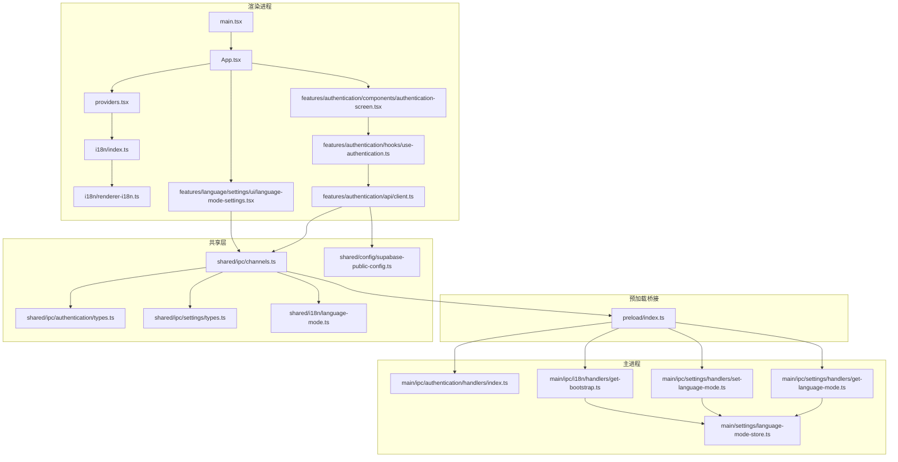
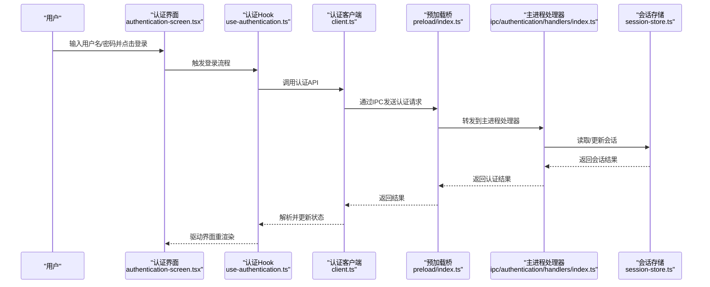
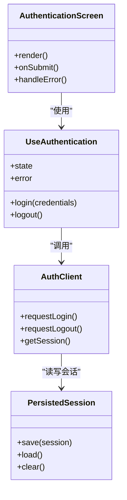
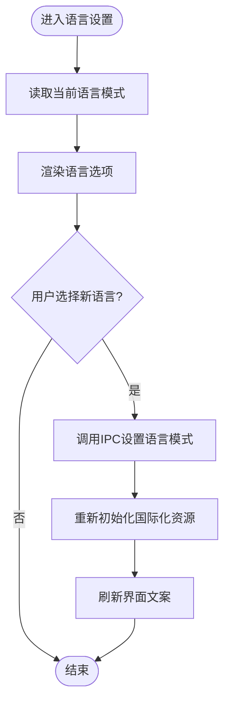
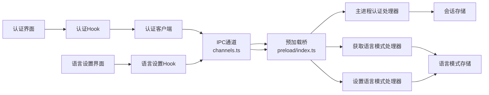

# 渲染进程与UI

<cite>
**本文引用的文件**   
- [apps/desktop/src/renderer/src/app/App.tsx](file://apps/desktop/src/renderer/src/app/App.tsx)
- [apps/desktop/src/renderer/src/app/providers.tsx](file://apps/desktop/src/renderer/src/app/providers.tsx)
- [apps/desktop/src/renderer/src/app/i18n/index.ts](file://apps/desktop/src/renderer/src/app/i18n/index.ts)
- [apps/desktop/src/renderer/src/app/i18n/renderer-i18n.ts](file://apps/desktop/src/renderer/src/app/i18n/renderer-i18n.ts)
- [apps/desktop/src/renderer/src/main.tsx](file://apps/desktop/src/renderer/src/main.tsx)
- [apps/desktop/src/renderer/src/features/authentication/components/authentication-screen.tsx](file://apps/desktop/src/renderer/src/features/authentication/components/authentication-screen.tsx)
- [apps/desktop/src/renderer/src/features/authentication/hooks/use-authentication.ts](file://apps/desktop/src/renderer/src/features/authentication/hooks/use-authentication.ts)
- [apps/desktop/src/renderer/src/features/authentication/api/client.ts](file://apps/desktop/src/renderer/src/features/authentication/api/client.ts)
- [apps/desktop/src/renderer/src/features/authentication/session/persisted-session.ts](file://apps/desktop/src/renderer/src/features/authentication/session/persisted-session.ts)
- [apps/desktop/src/renderer/src/features/language/settings/ui/language-mode-settings.tsx](file://apps/desktop/src/renderer/src/features/language/settings/ui/language-mode-settings.tsx)
- [apps/desktop/src/renderer/src/features/language/settings/i18n.ts](file://apps/desktop/src/renderer/src/features/language/settings/i18n.ts)
- [apps/desktop/src/shared/ipc/channels.ts](file://apps/desktop/src/shared/ipc/channels.ts)
- [apps/desktop/src/shared/ipc/authentication/types.ts](file://apps/desktop/src/shared/ipc/authentication/types.ts)
- [apps/desktop/src/shared/ipc/settings/types.ts](file://apps/desktop/src/shared/ipc/settings/types.ts)
- [apps/desktop/src/shared/i18n/language-mode.ts](file://apps/desktop/src/shared/i18n/language-mode.ts)
- [apps/desktop/src/shared/config/supabase-public-config.ts](file://apps/desktop/src/shared/config/supabase-public-config.ts)
- [apps/desktop/src/preload/index.ts](file://apps/desktop/src/preload/index.ts)
- [apps/desktop/src/main/ipc/authentication/handlers/index.ts](file://apps/desktop/src/main/ipc/authentication/handlers/index.ts)
- [apps/desktop/src/main/ipc/settings/handlers/get-language-mode.ts](file://apps/desktop/src/main/ipc/settings/handlers/get-language-mode.ts)
- [apps/desktop/src/main/ipc/settings/handlers/set-language-mode.ts](file://apps/desktop/src/main/ipc/settings/handlers/set-language-mode.ts)
- [apps/desktop/src/main/ipc/i18n/handlers/get-bootstrap.ts](file://apps/desktop/src/main/ipc/i18n/handlers/get-bootstrap.ts)
- [apps/desktop/src/main/settings/language-mode-store.ts](file://apps/desktop/src/main/settings/language-mode-store.ts)
- [apps/desktop/electron.vite.config.ts](file://apps/desktop/electron.vite.config.ts)
- [apps/desktop/vite.config.ts](file://apps/desktop/vite.config.ts)
</cite>

## 目录
1. [简介](#简介)
2. [项目结构](#项目结构)
3. [核心组件](#核心组件)
4. [架构总览](#架构总览)
5. [详细组件分析](#详细组件分析)
6. [依赖关系分析](#依赖关系分析)
7. [性能考量](#性能考量)
8. [故障排查指南](#故障排查指南)
9. [结论](#结论)

## 简介
本文件聚焦于 nevix-ai 桌面应用的渲染进程与 UI 层，系统性说明 React 应用结构、组件层次、状态管理、认证界面、语言设置界面及其他功能组件的实现方式。文档同时覆盖样式系统、主题定制与响应式设计策略，给出组件开发、事件处理与用户交互的实践示例路径，并总结性能优化（懒加载、代码分割）与常见 UI 问题的解决方案。

## 项目结构
渲染进程采用 Vite + Electron 的现代化构建方案，React 应用位于 apps/desktop/src/renderer，共享类型与 IPC 通道定义在 apps/desktop/src/shared，主进程能力通过 preload 暴露给渲染进程。

图表来源
- [apps/desktop/src/renderer/src/main.tsx](file://apps/desktop/src/renderer/src/main.tsx)
- [apps/desktop/src/renderer/src/app/App.tsx](file://apps/desktop/src/renderer/src/app/App.tsx)
- [apps/desktop/src/renderer/src/app/providers.tsx](file://apps/desktop/src/renderer/src/app/providers.tsx)
- [apps/desktop/src/renderer/src/app/i18n/index.ts](file://apps/desktop/src/renderer/src/app/i18n/index.ts)
- [apps/desktop/src/renderer/src/app/i18n/renderer-i18n.ts](file://apps/desktop/src/renderer/src/app/i18n/renderer-i18n.ts)
- [apps/desktop/src/renderer/src/features/authentication/components/authentication-screen.tsx](file://apps/desktop/src/renderer/src/features/authentication/components/authentication-screen.tsx)
- [apps/desktop/src/renderer/src/features/authentication/hooks/use-authentication.ts](file://apps/desktop/src/renderer/src/features/authentication/hooks/use-authentication.ts)
- [apps/desktop/src/renderer/src/features/authentication/api/client.ts](file://apps/desktop/src/renderer/src/features/authentication/api/client.ts)
- [apps/desktop/src/renderer/src/features/language/settings/ui/language-mode-settings.tsx](file://apps/desktop/src/renderer/src/features/language/settings/ui/language-mode-settings.tsx)
- [apps/desktop/src/shared/ipc/channels.ts](file://apps/desktop/src/shared/ipc/channels.ts)
- [apps/desktop/src/shared/ipc/authentication/types.ts](file://apps/desktop/src/shared/ipc/authentication/types.ts)
- [apps/desktop/src/shared/ipc/settings/types.ts](file://apps/desktop/src/shared/ipc/settings/types.ts)
- [apps/desktop/src/shared/i18n/language-mode.ts](file://apps/desktop/src/shared/i18n/language-mode.ts)
- [apps/desktop/src/shared/config/supabase-public-config.ts](file://apps/desktop/src/shared/config/supabase-public-config.ts)
- [apps/desktop/src/preload/index.ts](file://apps/desktop/src/preload/index.ts)
- [apps/desktop/src/main/ipc/authentication/handlers/index.ts](file://apps/desktop/src/main/ipc/authentication/handlers/index.ts)
- [apps/desktop/src/main/ipc/settings/handlers/get-language-mode.ts](file://apps/desktop/src/main/ipc/settings/handlers/get-language-mode.ts)
- [apps/desktop/src/main/ipc/settings/handlers/set-language-mode.ts](file://apps/desktop/src/main/ipc/settings/handlers/set-language-mode.ts)
- [apps/desktop/src/main/ipc/i18n/handlers/get-bootstrap.ts](file://apps/desktop/src/main/ipc/i18n/handlers/get-bootstrap.ts)
- [apps/desktop/src/main/settings/language-mode-store.ts](file://apps/desktop/src/main/settings/language-mode-store.ts)

章节来源
- [apps/desktop/src/renderer/src/main.tsx](file://apps/desktop/src/renderer/src/main.tsx)
- [apps/desktop/src/renderer/src/app/App.tsx](file://apps/desktop/src/renderer/src/app/App.tsx)
- [apps/desktop/src/renderer/src/app/providers.tsx](file://apps/desktop/src/renderer/src/app/providers.tsx)
- [apps/desktop/src/shared/ipc/channels.ts](file://apps/desktop/src/shared/ipc/channels.ts)
- [apps/desktop/electron.vite.config.ts](file://apps/desktop/electron.vite.config.ts)
- [apps/desktop/vite.config.ts](file://apps/desktop/vite.config.ts)

## 核心组件
- 应用入口与根组件：渲染进程以 main.tsx 启动，挂载 App.tsx 作为根组件，并通过 providers.tsx 注入全局上下文（如 i18n、主题等）。
- 国际化初始化：renderer-i18n.ts 负责根据主进程引导信息初始化 i18next，i18n/index.ts 提供统一的国际化 API。
- 认证模块：authentication-screen.tsx 为认证页面，use-authentication.ts 封装认证逻辑与状态，client.ts 调用后端或本地能力。
- 语言设置模块：language-mode-settings.tsx 提供语言模式切换 UI，i18n.ts 提供相关文案。
- 共享类型与通道：channels.ts 统一定义 IPC 频道名；auth/types.ts、settings/types.ts、i18n/language-mode.ts 提供跨进程类型契约。

章节来源
- [apps/desktop/src/renderer/src/app/App.tsx](file://apps/desktop/src/renderer/src/app/App.tsx)
- [apps/desktop/src/renderer/src/app/providers.tsx](file://apps/desktop/src/renderer/src/app/providers.tsx)
- [apps/desktop/src/renderer/src/app/i18n/index.ts](file://apps/desktop/src/renderer/src/app/i18n/index.ts)
- [apps/desktop/src/renderer/src/app/i18n/renderer-i18n.ts](file://apps/desktop/src/renderer/src/app/i18n/renderer-i18n.ts)
- [apps/desktop/src/renderer/src/features/authentication/components/authentication-screen.tsx](file://apps/desktop/src/renderer/src/features/authentication/components/authentication-screen.tsx)
- [apps/desktop/src/renderer/src/features/authentication/hooks/use-authentication.ts](file://apps/desktop/src/renderer/src/features/authentication/hooks/use-authentication.ts)
- [apps/desktop/src/renderer/src/features/authentication/api/client.ts](file://apps/desktop/src/renderer/src/features/authentication/api/client.ts)
- [apps/desktop/src/renderer/src/features/language/settings/ui/language-mode-settings.tsx](file://apps/desktop/src/renderer/src/features/language/settings/ui/language-mode-settings.tsx)
- [apps/desktop/src/renderer/src/features/language/settings/i18n.ts](file://apps/desktop/src/renderer/src/features/language/settings/i18n.ts)
- [apps/desktop/src/shared/ipc/channels.ts](file://apps/desktop/src/shared/ipc/channels.ts)
- [apps/desktop/src/shared/ipc/authentication/types.ts](file://apps/desktop/src/shared/ipc/authentication/types.ts)
- [apps/desktop/src/shared/ipc/settings/types.ts](file://apps/desktop/src/shared/ipc/settings/types.ts)
- [apps/desktop/src/shared/i18n/language-mode.ts](file://apps/desktop/src/shared/i18n/language-mode.ts)

## 架构总览
渲染进程通过预加载脚本安全地访问主进程能力。认证与语言设置均遵循“UI 层 -> Hook/服务 -> IPC -> 主处理器 -> 持久化/外部服务”的分层模型。

图表来源
- [apps/desktop/src/renderer/src/features/authentication/components/authentication-screen.tsx](file://apps/desktop/src/renderer/src/features/authentication/components/authentication-screen.tsx)
- [apps/desktop/src/renderer/src/features/authentication/hooks/use-authentication.ts](file://apps/desktop/src/renderer/src/features/authentication/hooks/use-authentication.ts)
- [apps/desktop/src/renderer/src/features/authentication/api/client.ts](file://apps/desktop/src/renderer/src/features/authentication/api/client.ts)
- [apps/desktop/src/preload/index.ts](file://apps/desktop/src/preload/index.ts)
- [apps/desktop/src/main/ipc/authentication/handlers/index.ts](file://apps/desktop/src/main/ipc/authentication/handlers/index.ts)
- [apps/desktop/src/main/authentication/session-store.ts](file://apps/desktop/src/main/authentication/session-store.ts)

章节来源
- [apps/desktop/src/preload/index.ts](file://apps/desktop/src/preload/index.ts)
- [apps/desktop/src/main/ipc/authentication/handlers/index.ts](file://apps/desktop/src/main/ipc/authentication/handlers/index.ts)

## 详细组件分析

### 认证界面与状态管理
- 界面层：authentication-screen.tsx 呈现登录表单、错误提示与成功跳转。
- 状态层：use-authentication.ts 封装登录、登出、状态订阅与错误处理。
- 数据层：client.ts 负责与后端或主进程能力交互，结合 shared 配置进行环境适配。
- 会话持久化：persisted-session.ts 负责本地会话存取，确保刷新后保持登录态。

图表来源
- [apps/desktop/src/renderer/src/features/authentication/components/authentication-screen.tsx](file://apps/desktop/src/renderer/src/features/authentication/components/authentication-screen.tsx)
- [apps/desktop/src/renderer/src/features/authentication/hooks/use-authentication.ts](file://apps/desktop/src/renderer/src/features/authentication/hooks/use-authentication.ts)
- [apps/desktop/src/renderer/src/features/authentication/api/client.ts](file://apps/desktop/src/renderer/src/features/authentication/api/client.ts)
- [apps/desktop/src/renderer/src/features/authentication/session/persisted-session.ts](file://apps/desktop/src/renderer/src/features/authentication/session/persisted-session.ts)

章节来源
- [apps/desktop/src/renderer/src/features/authentication/components/authentication-screen.tsx](file://apps/desktop/src/renderer/src/features/authentication/components/authentication-screen.tsx)
- [apps/desktop/src/renderer/src/features/authentication/hooks/use-authentication.ts](file://apps/desktop/src/renderer/src/features/authentication/hooks/use-authentication.ts)
- [apps/desktop/src/renderer/src/features/authentication/api/client.ts](file://apps/desktop/src/renderer/src/features/authentication/api/client.ts)
- [apps/desktop/src/renderer/src/features/authentication/session/persisted-session.ts](file://apps/desktop/src/renderer/src/features/authentication/session/persisted-session.ts)

### 语言设置界面与国际化
- 界面层：language-mode-settings.tsx 提供语言模式选择与切换操作。
- 文案层：i18n.ts 提供语言设置相关的多语言文案。
- 运行时初始化：renderer-i18n.ts 根据主进程引导信息初始化 i18next，i18n/index.ts 暴露统一接口。
- 主进程支持：get-language-mode.ts、set-language-mode.ts 与 language-mode-store.ts 协作完成语言模式的读取与持久化。

图表来源
- [apps/desktop/src/renderer/src/features/language/settings/ui/language-mode-settings.tsx](file://apps/desktop/src/renderer/src/features/language/settings/ui/language-mode-settings.tsx)
- [apps/desktop/src/renderer/src/features/language/settings/i18n.ts](file://apps/desktop/src/renderer/src/features/language/settings/i18n.ts)
- [apps/desktop/src/renderer/src/app/i18n/renderer-i18n.ts](file://apps/desktop/src/renderer/src/app/i18n/renderer-i18n.ts)
- [apps/desktop/src/renderer/src/app/i18n/index.ts](file://apps/desktop/src/renderer/src/app/i18n/index.ts)
- [apps/desktop/src/main/ipc/settings/handlers/get-language-mode.ts](file://apps/desktop/src/main/ipc/settings/handlers/get-language-mode.ts)
- [apps/desktop/src/main/ipc/settings/handlers/set-language-mode.ts](file://apps/desktop/src/main/ipc/settings/handlers/set-language-mode.ts)
- [apps/desktop/src/main/settings/language-mode-store.ts](file://apps/desktop/src/main/settings/language-mode-store.ts)

章节来源
- [apps/desktop/src/renderer/src/features/language/settings/ui/language-mode-settings.tsx](file://apps/desktop/src/renderer/src/features/language/settings/ui/language-mode-settings.tsx)
- [apps/desktop/src/renderer/src/features/language/settings/i18n.ts](file://apps/desktop/src/renderer/src/features/language/settings/i18n.ts)
- [apps/desktop/src/renderer/src/app/i18n/renderer-i18n.ts](file://apps/desktop/src/renderer/src/app/i18n/renderer-i18n.ts)
- [apps/desktop/src/renderer/src/app/i18n/index.ts](file://apps/desktop/src/renderer/src/app/i18n/index.ts)
- [apps/desktop/src/main/ipc/settings/handlers/get-language-mode.ts](file://apps/desktop/src/main/ipc/settings/handlers/get-language-mode.ts)
- [apps/desktop/src/main/ipc/settings/handlers/set-language-mode.ts](file://apps/desktop/src/main/ipc/settings/handlers/set-language-mode.ts)
- [apps/desktop/src/main/settings/language-mode-store.ts](file://apps/desktop/src/main/settings/language-mode-store.ts)

### 应用提供者与全局上下文
- providers.tsx 集中注入 i18n、主题、路由等全局上下文，确保子树组件可无障碍消费。
- App.tsx 组织页面路由与布局，按需加载功能模块。

章节来源
- [apps/desktop/src/renderer/src/app/providers.tsx](file://apps/desktop/src/renderer/src/app/providers.tsx)
- [apps/desktop/src/renderer/src/app/App.tsx](file://apps/desktop/src/renderer/src/app/App.tsx)

## 依赖关系分析
- 渲染进程依赖 shared 层的类型与通道定义，保证与主进程通信的一致性。
- 认证与语言设置均通过 channels.ts 定义的频道名进行 IPC 调用，避免硬编码字符串。
- 主进程 handlers 接收频道消息并调用对应的业务逻辑与持久化存储。

图表来源
- [apps/desktop/src/renderer/src/features/authentication/components/authentication-screen.tsx](file://apps/desktop/src/renderer/src/features/authentication/components/authentication-screen.tsx)
- [apps/desktop/src/renderer/src/features/authentication/hooks/use-authentication.ts](file://apps/desktop/src/renderer/src/features/authentication/hooks/use-authentication.ts)
- [apps/desktop/src/renderer/src/features/authentication/api/client.ts](file://apps/desktop/src/renderer/src/features/authentication/api/client.ts)
- [apps/desktop/src/shared/ipc/channels.ts](file://apps/desktop/src/shared/ipc/channels.ts)
- [apps/desktop/src/preload/index.ts](file://apps/desktop/src/preload/index.ts)
- [apps/desktop/src/main/ipc/authentication/handlers/index.ts](file://apps/desktop/src/main/ipc/authentication/handlers/index.ts)
- [apps/desktop/src/main/ipc/settings/handlers/get-language-mode.ts](file://apps/desktop/src/main/ipc/settings/handlers/get-language-mode.ts)
- [apps/desktop/src/main/ipc/settings/handlers/set-language-mode.ts](file://apps/desktop/src/main/ipc/settings/handlers/set-language-mode.ts)
- [apps/desktop/src/main/settings/language-mode-store.ts](file://apps/desktop/src/main/settings/language-mode-store.ts)

章节来源
- [apps/desktop/src/shared/ipc/channels.ts](file://apps/desktop/src/shared/ipc/channels.ts)
- [apps/desktop/src/preload/index.ts](file://apps/desktop/src/preload/index.ts)
- [apps/desktop/src/main/ipc/authentication/handlers/index.ts](file://apps/desktop/src/main/ipc/authentication/handlers/index.ts)
- [apps/desktop/src/main/ipc/settings/handlers/get-language-mode.ts](file://apps/desktop/src/main/ipc/settings/handlers/get-language-mode.ts)
- [apps/desktop/src/main/ipc/settings/handlers/set-language-mode.ts](file://apps/desktop/src/main/ipc/settings/handlers/set-language-mode.ts)

## 性能考量
- 代码分割与懒加载：通过 Vite 的动态导入将认证与语言设置模块按需加载，减少首屏体积。
- 资源预取：在路由进入前预取国际化资源与必要配置，降低切换卡顿。
- 状态最小化：仅保留必要的 UI 状态，复杂计算下沉至 Hook 或服务层，避免频繁重渲染。
- 缓存策略：会话与语言模式在本地持久化，避免重复请求与初始化开销。
- 构建优化：启用 tree-shaking、压缩与分包，提升打包效率与运行性能。

[本节为通用指导，不直接分析具体文件]

## 故障排查指南
- 认证失败
  - 检查 client.ts 的网络请求与错误码映射。
  - 确认主进程认证处理器是否正确转发与返回结果。
  - 查看 persisted-session.ts 的会话写入是否成功。
- 语言切换无效
  - 验证 channels.ts 频道名与主进程处理器一致。
  - 检查 get-language-mode.ts 与 set-language-mode.ts 的返回值与持久化逻辑。
  - 确认 renderer-i18n.ts 的初始化参数与资源加载路径正确。
- 界面未更新
  - 检查 Hook 的状态更新是否触发了组件重渲染。
  - 确认 providers.tsx 的全局上下文是否正确注入。
- 构建与运行问题
  - 核对 electron.vite.config.ts 与 vite.config.ts 的入口与输出配置。
  - 检查 preload/index.ts 的安全白名单与权限声明。

章节来源
- [apps/desktop/src/renderer/src/features/authentication/api/client.ts](file://apps/desktop/src/renderer/src/features/authentication/api/client.ts)
- [apps/desktop/src/main/ipc/authentication/handlers/index.ts](file://apps/desktop/src/main/ipc/authentication/handlers/index.ts)
- [apps/desktop/src/renderer/src/features/authentication/session/persisted-session.ts](file://apps/desktop/src/renderer/src/features/authentication/session/persisted-session.ts)
- [apps/desktop/src/shared/ipc/channels.ts](file://apps/desktop/src/shared/ipc/channels.ts)
- [apps/desktop/src/main/ipc/settings/handlers/get-language-mode.ts](file://apps/desktop/src/main/ipc/settings/handlers/get-language-mode.ts)
- [apps/desktop/src/main/ipc/settings/handlers/set-language-mode.ts](file://apps/desktop/src/main/ipc/settings/handlers/set-language-mode.ts)
- [apps/desktop/src/renderer/src/app/i18n/renderer-i18n.ts](file://apps/desktop/src/renderer/src/app/i18n/renderer-i18n.ts)
- [apps/desktop/src/renderer/src/app/providers.tsx](file://apps/desktop/src/renderer/src/app/providers.tsx)
- [apps/desktop/electron.vite.config.ts](file://apps/desktop/electron.vite.config.ts)
- [apps/desktop/vite.config.ts](file://apps/desktop/vite.config.ts)
- [apps/desktop/src/preload/index.ts](file://apps/desktop/src/preload/index.ts)

## 结论
本渲染进程与 UI 层采用清晰的模块化与分层设计，认证与语言设置功能通过统一的 IPC 通道与共享类型实现跨进程协作。通过合理的状态管理与性能优化策略，保证了良好的用户体验与可维护性。后续可在组件复用、错误边界与可观测性方面继续增强，以提升稳定性与可调试性。