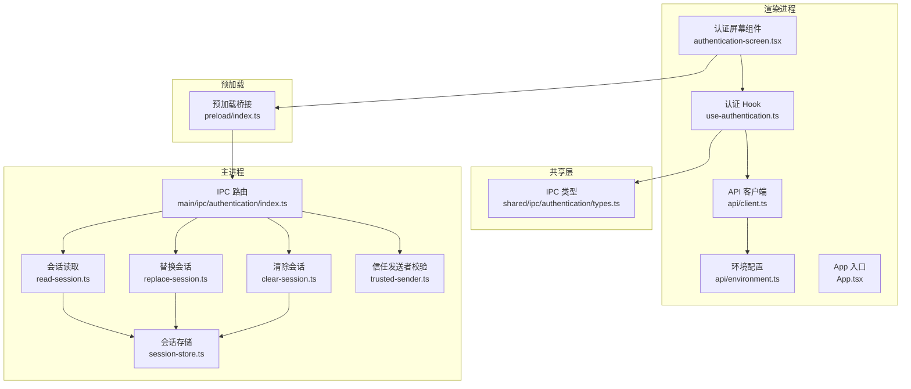
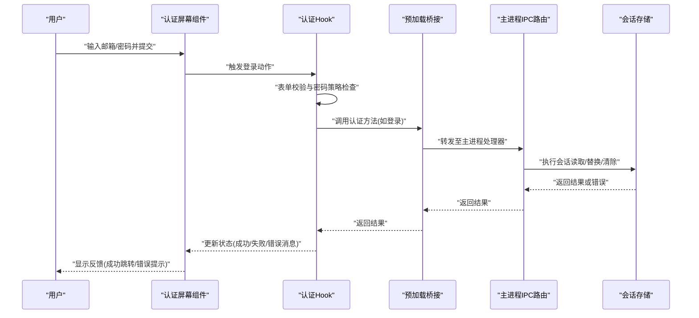
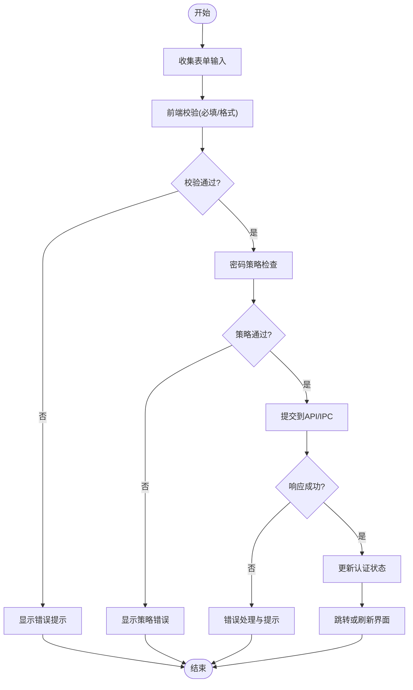
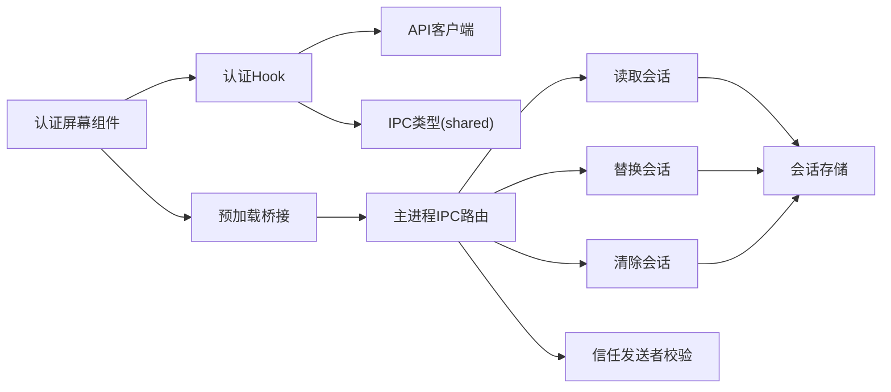

# 认证界面组件

<cite>
**本文引用的文件**   
- [apps/desktop/src/renderer/src/features/authentication/components/authentication-screen.tsx](file://apps/desktop/src/renderer/src/features/authentication/components/authentication-screen.tsx)
- [apps/desktop/src/renderer/src/features/authentication/hooks/use-authentication.ts](file://apps/desktop/src/renderer/src/features/authentication/hooks/use-authentication.ts)
- [apps/desktop/src/renderer/src/features/authentication/policy/password.ts](file://apps/desktop/src/renderer/src/features/authentication/policy/password.ts)
- [apps/desktop/src/renderer/src/features/authentication/session/persisted-session.ts](file://apps/desktop/src/renderer/src/features/authentication/session/persisted-session.ts)
- [apps/desktop/src/renderer/src/features/authentication/api/client.ts](file://apps/desktop/src/renderer/src/features/authentication/api/client.ts)
- [apps/desktop/src/renderer/src/features/authentication/api/environment.ts](file://apps/desktop/src/renderer/src/features/authentication/api/environment.ts)
- [apps/desktop/src/shared/ipc/authentication/types.ts](file://apps/desktop/src/shared/ipc/authentication/types.ts)
- [apps/desktop/src/main/ipc/authentication/index.ts](file://apps/desktop/src/main/ipc/authentication/index.ts)
- [apps/desktop/src/main/ipc/authentication/read-session.ts](file://apps/desktop/src/main/ipc/authentication/read-session.ts)
- [apps/desktop/src/main/ipc/authentication/replace-session.ts](file://apps/desktop/src/main/ipc/authentication/replace-session.ts)
- [apps/desktop/src/main/ipc/authentication/clear-session.ts](file://apps/desktop/src/main/ipc/authentication/clear-session.ts)
- [apps/desktop/src/main/ipc/authentication/handlers/index.ts](file://apps/desktop/src/main/ipc/authentication/handlers/index.ts)
- [apps/desktop/src/main/ipc/authentication/trusted-sender.ts](file://apps/desktop/src/main/ipc/authentication/trusted发送者.ts)
- [apps/desktop/src/main/authentication/session-store.ts](file://apps/desktop/src/main/authentication/session-store.ts)
- [apps/desktop/src/preload/index.ts](file://apps/desktop/src/preload/index.ts)
- [apps/desktop/src/renderer/src/app/App.tsx](file://apps/desktop/src/renderer/src/app/App.tsx)
</cite>

## 目录
1. [简介](#简介)
2. [项目结构](#项目结构)
3. [核心组件](#核心组件)
4. [架构总览](#架构总览)
5. [详细组件分析](#详细组件分析)
6. [依赖分析](#依赖分析)
7. [性能考虑](#性能考虑)
8. [故障排查指南](#故障排查指南)
9. [结论](#结论)
10. [附录](#附录)

## 简介
本文件面向 nevix-ai 桌面应用程序的“认证界面组件”，聚焦渲染进程中的认证屏幕、状态管理、表单与密码策略验证、错误处理与用户反馈，以及与主进程的 IPC 通信集成。文档通过分层说明与图示帮助读者快速理解从 UI 到主进程会话存储的完整数据流，并提供常见问题定位与修复建议。

## 项目结构
认证相关代码采用“功能切片”组织方式：渲染进程负责 UI 与交互，共享类型定义位于 shared 层，主进程提供 IPC 处理器与会话持久化能力，预加载脚本桥接两者。

图表来源
- [apps/desktop/src/renderer/src/features/authentication/components/authentication-screen.tsx](file://apps/desktop/src/renderer/src/features/authentication/components/authentication-screen.tsx)
- [apps/desktop/src/renderer/src/features/authentication/hooks/use-authentication.ts](file://apps/desktop/src/renderer/src/features/authentication/hooks/use-authentication.ts)
- [apps/desktop/src/renderer/src/features/authentication/api/client.ts](file://apps/desktop/src/renderer/src/features/authentication/api/client.ts)
- [apps/desktop/src/renderer/src/features/authentication/api/environment.ts](file://apps/desktop/src/renderer/src/features/authentication/api/environment.ts)
- [apps/desktop/src/shared/ipc/authentication/types.ts](file://apps/desktop/src/shared/ipc/authentication/types.ts)
- [apps/desktop/src/preload/index.ts](file://apps/desktop/src/preload/index.ts)
- [apps/desktop/src/main/ipc/authentication/index.ts](file://apps/desktop/src/main/ipc/authentication/index.ts)
- [apps/desktop/src/main/ipc/authentication/read-session.ts](file://apps/desktop/src/main/ipc/authentication/read-session.ts)
- [apps/desktop/src/main/ipc/authentication/replace-session.ts](file://apps/desktop/src/main/ipc/authentication/replace-session.ts)
- [apps/desktop/src/main/ipc/authentication/clear-session.ts](file://apps/desktop/src/main/ipc/authentication/clear-session.ts)
- [apps/desktop/src/main/ipc/authentication/trusted-sender.ts](file://apps/desktop/src/main/ipc/authentication/trusted-sender.ts)
- [apps/desktop/src/main/authentication/session-store.ts](file://apps/desktop/src/main/authentication/session-store.ts)

章节来源
- [apps/desktop/src/renderer/src/app/App.tsx](file://apps/desktop/src/renderer/src/app/App.tsx)
- [apps/desktop/src/preload/index.ts](file://apps/desktop/src/preload/index.ts)
- [apps/desktop/src/shared/ipc/authentication/types.ts](file://apps/desktop/src/shared/ipc/authentication/types.ts)

## 核心组件
- 认证屏幕组件：承载登录/注册/重置等界面与交互，驱动表单输入、提交与结果展示。
- 认证 Hook：封装认证状态（是否加载中、错误信息、会话存在性）、调用 API 与 IPC、更新本地状态。
- 密码策略模块：集中实现密码复杂度规则与提示文案生成。
- 会话持久化（渲染侧）：在渲染进程内缓存会话状态，提升响应速度并减少 IPC 开销。
- API 客户端与环境配置：统一封装网络请求与运行期环境变量注入。
- 主进程 IPC：安全地读写会话，限制可信来源，暴露最小权限接口。

章节来源
- [apps/desktop/src/renderer/src/features/authentication/components/authentication-screen.tsx](file://apps/desktop/src/renderer/src/features/authentication/components/authentication-screen.tsx)
- [apps/desktop/src/renderer/src/features/authentication/hooks/use-authentication.ts](file://apps/desktop/src/renderer/src/features/authentication/hooks/use-authentication.ts)
- [apps/desktop/src/renderer/src/features/authentication/policy/password.ts](file://apps/desktop/src/renderer/src/features/authentication/policy/password.ts)
- [apps/desktop/src/renderer/src/features/authentication/session/persisted-session.ts](file://apps/desktop/src/renderer/src/features/authentication/session/persisted-session.ts)
- [apps/desktop/src/renderer/src/features/authentication/api/client.ts](file://apps/desktop/src/renderer/src/features/authentication/api/client.ts)
- [apps/desktop/src/renderer/src/features/authentication/api/environment.ts](file://apps/desktop/src/renderer/src/features/authentication/api/environment.ts)

## 架构总览
认证流程贯穿渲染进程、预加载桥接与主进程，确保 UI 与敏感操作隔离，同时保持可测试性与可维护性。

图表来源
- [apps/desktop/src/renderer/src/features/authentication/components/authentication-screen.tsx](file://apps/desktop/src/renderer/src/features/authentication/components/authentication-screen.tsx)
- [apps/desktop/src/renderer/src/features/authentication/hooks/use-authentication.ts](file://apps/desktop/src/renderer/src/features/authentication/hooks/use-authentication.ts)
- [apps/desktop/src/preload/index.ts](file://apps/desktop/src/preload/index.ts)
- [apps/desktop/src/main/ipc/authentication/index.ts](file://apps/desktop/src/main/ipc/authentication/index.ts)
- [apps/desktop/src/main/authentication/session-store.ts](file://apps/desktop/src/main/authentication/session-store.ts)

## 详细组件分析

### 认证屏幕组件
- 职责：渲染登录/注册/重置等界面；收集表单输入；触发提交；展示错误与成功反馈；根据认证状态切换视图。
- 关键交互：
  - 输入变化时即时校验并给出提示。
  - 提交前进行前端校验（必填、格式、密码策略）。
  - 提交后禁用按钮并显示加载态，避免重复提交。
  - 成功后根据业务跳转到主界面或刷新页面。
- 错误处理：捕获网络错误、服务端错误与未知异常，转化为可读的用户提示。
- 可访问性：为输入框与按钮添加合适的标签与提示，支持键盘导航。

章节来源
- [apps/desktop/src/renderer/src/features/authentication/components/authentication-screen.tsx](file://apps/desktop/src/renderer/src/features/authentication/components/authentication-screen.tsx)

### 认证 Hook（状态管理与副作用）
- 职责：封装认证生命周期（初始化、登录、注册、登出、获取会话），管理加载与错误状态，协调 API 与 IPC 调用。
- 状态字段：
  - 加载状态：防止重复提交与优化用户体验。
  - 错误信息：区分网络错误、业务错误与系统错误。
  - 会话存在性：用于控制界面可见性与跳转逻辑。
- 副作用：
  - 首次挂载时尝试恢复会话。
  - 提交时调用 API 客户端与 IPC，处理成功与失败分支。
- 安全性：不在渲染进程直接持有敏感凭据，仅传递必要参数。

章节来源
- [apps/desktop/src/renderer/src/features/authentication/hooks/use-authentication.ts](file://apps/desktop/src/renderer/src/features/authentication/hooks/use-authentication.ts)

### 密码策略验证
- 规则维度：长度、字符集（大小写、数字、特殊字符）、常见弱口令检测、历史密码对比（可选）。
- 反馈机制：实时提示缺失项，提交时阻断不合规输入。
- 可扩展性：策略以函数形式组合，便于按环境或版本切换。

章节来源
- [apps/desktop/src/renderer/src/features/authentication/policy/password.ts](file://apps/desktop/src/renderer/src/features/authentication/policy/password.ts)

### 会话持久化（渲染侧）
- 目的：缓存认证结果，加速界面渲染与减少 IPC 调用。
- 行为：
  - 登录成功后写入内存缓存。
  - 应用重启后尝试从主进程恢复。
  - 登出或过期时清理缓存。
- 注意：仅作为 UI 体验优化，真实会话有效性由主进程与后端共同决定。

章节来源
- [apps/desktop/src/renderer/src/features/authentication/session/persisted-session.ts](file://apps/desktop/src/renderer/src/features/authentication/session/persisted-session.ts)

### API 客户端与环境配置
- API 客户端：封装 HTTP 请求、错误映射、重试策略（可选）、超时设置。
- 环境配置：集中管理后端地址、密钥开关、调试标志等，避免硬编码。

章节来源
- [apps/desktop/src/renderer/src/features/authentication/api/client.ts](file://apps/desktop/src/renderer/src/features/authentication/api/client.ts)
- [apps/desktop/src/renderer/src/features/authentication/api/environment.ts](file://apps/desktop/src/renderer/src/features/authentication/api/environment.ts)

### 主进程 IPC 集成
- 路由与处理器：
  - 读取会话：安全返回当前会话摘要。
  - 替换会话：在受控条件下更新会话。
  - 清除会话：安全销毁会话。
- 安全校验：
  - 信任发送者：限制仅来自可信渲染进程的消息。
  - 最小权限：仅暴露必要方法，避免泄露敏感细节。
- 错误处理：对非法调用返回明确错误码与消息，便于前端提示。

章节来源
- [apps/desktop/src/main/ipc/authentication/index.ts](file://apps/desktop/src/main/ipc/authentication/index.ts)
- [apps/desktop/src/main/ipc/authentication/read-session.ts](file://apps/desktop/src/main/ipc/authentication/read-session.ts)
- [apps/desktop/src/main/ipc/authentication/replace-session.ts](file://apps/desktop/src/main/ipc/authentication/replace-session.ts)
- [apps/desktop/src/main/ipc/authentication/clear-session.ts](file://apps/desktop/src/main/ipc/authentication/clear-session.ts)
- [apps/desktop/src/main/ipc/authentication/trusted-sender.ts](file://apps/desktop/src/main/ipc/authentication/trusted-sender.ts)
- [apps/desktop/src/main/authentication/session-store.ts](file://apps/desktop/src/main/authentication/session-store.ts)

### 预加载桥接
- 职责：将主进程能力安全暴露给渲染进程，屏蔽内部实现细节。
- 设计要点：
  - 白名单式暴露方法。
  - 参数校验与返回值规范化。
  - 错误透传与统一包装。

章节来源
- [apps/desktop/src/preload/index.ts](file://apps/desktop/src/preload/index.ts)

### 认证流程图（表单提交与策略校验）

图表来源
- [apps/desktop/src/renderer/src/features/authentication/components/authentication-screen.tsx](file://apps/desktop/src/renderer/src/features/authentication/components/authentication-screen.tsx)
- [apps/desktop/src/renderer/src/features/authentication/hooks/use-authentication.ts](file://apps/desktop/src/renderer/src/features/authentication/hooks/use-authentication.ts)
- [apps/desktop/src/renderer/src/features/authentication/policy/password.ts](file://apps/desktop/src/renderer/src/features/authentication/policy/password.ts)

## 依赖分析
认证模块依赖关系清晰，遵循“渲染进程只负责交互与状态，主进程负责安全与持久化”的原则。

图表来源
- [apps/desktop/src/renderer/src/features/authentication/components/authentication-screen.tsx](file://apps/desktop/src/renderer/src/features/authentication/components/authentication-screen.tsx)
- [apps/desktop/src/renderer/src/features/authentication/hooks/use-authentication.ts](file://apps/desktop/src/renderer/src/features/authentication/hooks/use-authentication.ts)
- [apps/desktop/src/renderer/src/features/authentication/api/client.ts](file://apps/desktop/src/renderer/src/features/authentication/api/client.ts)
- [apps/desktop/src/shared/ipc/authentication/types.ts](file://apps/desktop/src/shared/ipc/authentication/types.ts)
- [apps/desktop/src/preload/index.ts](file://apps/desktop/src/preload/index.ts)
- [apps/desktop/src/main/ipc/authentication/index.ts](file://apps/desktop/src/main/ipc/authentication/index.ts)
- [apps/desktop/src/main/ipc/authentication/read-session.ts](file://apps/desktop/src/main/ipc/authentication/read-session.ts)
- [apps/desktop/src/main/ipc/authentication/replace-session.ts](file://apps/desktop/src/main/ipc/authentication/replace-session.ts)
- [apps/desktop/src/main/ipc/authentication/clear-session.ts](file://apps/desktop/src/main/ipc/authentication/clear-session.ts)
- [apps/desktop/src/main/ipc/authentication/trusted-sender.ts](file://apps/desktop/src/main/ipc/authentication/trusted-sender.ts)
- [apps/desktop/src/main/authentication/session-store.ts](file://apps/desktop/src/main/authentication/session-store.ts)

章节来源
- [apps/desktop/src/shared/ipc/authentication/types.ts](file://apps/desktop/src/shared/ipc/authentication/types.ts)
- [apps/desktop/src/main/ipc/authentication/index.ts](file://apps/desktop/src/main/ipc/authentication/index.ts)

## 性能考虑
- 减少不必要的 IPC 调用：在渲染侧缓存会话摘要，仅在必要时同步主进程。
- 防抖与节流：对频繁输入（如搜索邮箱）进行防抖，降低校验与请求压力。
- 懒加载与按需渲染：认证相关资源按需加载，缩短首屏时间。
- 错误快速失败：在网络不可达或超时场景下尽快返回错误，避免长时间阻塞。

[本节为通用指导，无需引用具体文件]

## 故障排查指南
- 现象：登录后界面未跳转或状态未更新
  - 检查认证 Hook 是否正确更新状态与触发导航。
  - 确认主进程 IPC 处理器返回的数据结构与渲染侧期望一致。
  - 查看预加载桥接是否暴露了对应方法且参数正确。
- 现象：密码策略提示不生效
  - 核对策略函数的规则与提示文案是否匹配。
  - 检查表单提交前是否调用了策略校验。
- 现象：IPC 调用被拒绝或报错
  - 确认发送方是否为受信任来源。
  - 检查 IPC 路由是否注册了相应处理器。
- 现象：会话丢失或不同步
  - 检查主进程会话存储的读写逻辑。
  - 确认渲染侧缓存是否在登出或过期时被清理。

章节来源
- [apps/desktop/src/main/ipc/authentication/trusted-sender.ts](file://apps/desktop/src/main/ipc/authentication/trusted-sender.ts)
- [apps/desktop/src/main/ipc/authentication/index.ts](file://apps/desktop/src/main/ipc/authentication/index.ts)
- [apps/desktop/src/main/authentication/session-store.ts](file://apps/desktop/src/main/authentication/session-store.ts)
- [apps/desktop/src/renderer/src/features/authentication/hooks/use-authentication.ts](file://apps/desktop/src/renderer/src/features/authentication/hooks/use-authentication.ts)
- [apps/desktop/src/renderer/src/features/authentication/policy/password.ts](file://apps/desktop/src/renderer/src/features/authentication/policy/password.ts)

## 结论
认证界面组件通过清晰的职责划分与安全边界设计，实现了可靠的认证体验。渲染进程专注交互与状态，主进程保障安全与会话一致性，共享类型确保契约稳定。配合完善的策略校验、错误处理与用户反馈，整体方案具备良好的可维护性与扩展性。

[本节为总结性内容，无需引用具体文件]

## 附录
- 术语表
  - IPC：进程间通信（Inter-Process Communication）
  - 预加载：Electron 中用于安全桥接渲染与主进程的脚本
  - 会话：认证成功后产生的身份凭证与上下文
- 最佳实践
  - 始终在主进程处理敏感操作。
  - 使用最小权限原则暴露 IPC 方法。
  - 前端只做非安全相关的校验与体验优化。
  - 错误信息对用户友好，对开发者可追踪。

[本节为补充信息，无需引用具体文件]