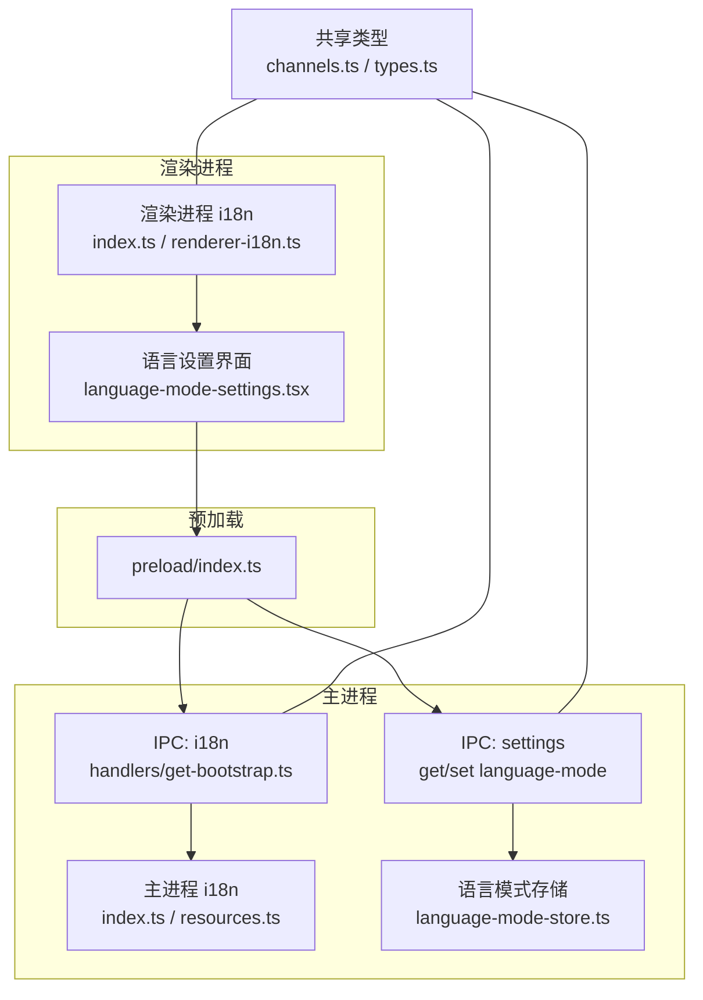
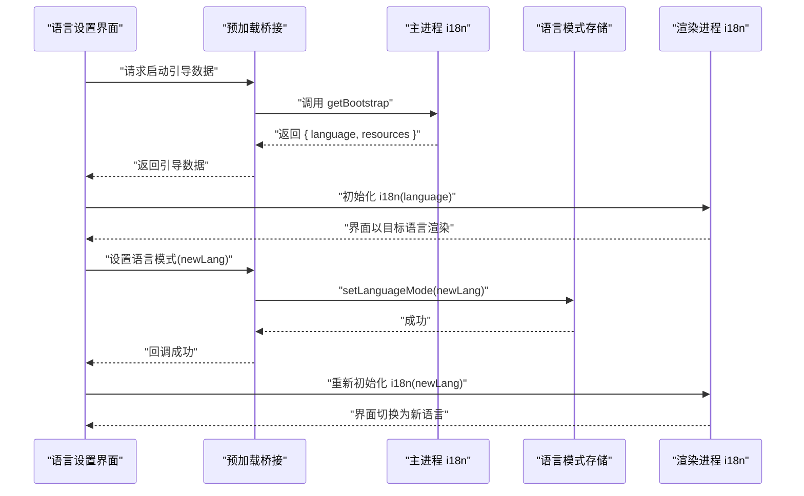
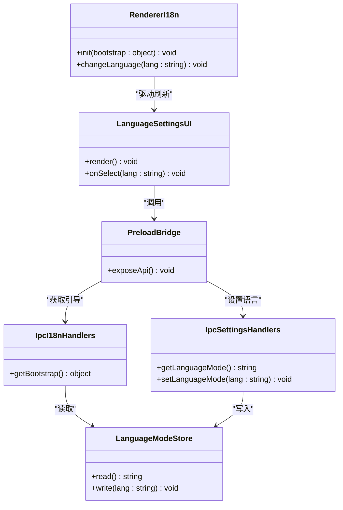

# 语言设置界面

<cite>
**本文引用的文件**   
- [apps/desktop/src/main/i18n/index.ts](file://apps/desktop/src/main/i18n/index.ts)
- [apps/desktop/src/main/i18n/resources.ts](file://apps/desktop/src/main/i18n/resources.ts)
- [apps/desktop/src/main/ipc/i18n/handlers/get-bootstrap.ts](file://apps/desktop/src/main/ipc/i18n/handlers/get-bootstrap.ts)
- [apps/desktop/src/main/ipc/i18n/index.ts](file://apps/desktop/src/main/ipc/i18n/index.ts)
- [apps/desktop/src/main/ipc/settings/handlers/get-language-mode.ts](file://apps/desktop/src/main/ipc/settings/handlers/get-language-mode.ts)
- [apps/desktop/src/main/ipc/settings/handlers/set-language-mode.ts](file://apps/desktop/src/main/ipc/settings/handlers/set-language-mode.ts)
- [apps/desktop/src/main/ipc/settings/index.ts](file://apps/desktop/src/main/ipc/settings/index.ts)
- [apps/desktop/src/main/settings/language-mode-store.ts](file://apps/desktop/src/main/settings/language-mode-store.ts)
- [apps/desktop/src/preload/index.ts](file://apps/desktop/src/preload/index.ts)
- [apps/desktop/src/renderer/src/app/i18n/index.ts](file://apps/desktop/src/renderer/src/app/i18n/index.ts)
- [apps/desktop/src/renderer/src/app/i18n/renderer-i18n.ts](file://apps/desktop/src/renderer/src/app/i18n/renderer-i18n.ts)
- [apps/desktop/src/shared/i18n/language-mode.ts](file://apps/desktop/src/shared/i18n/language-mode.ts)
- [apps/desktop/src/shared/i18n/resource-contract.ts](file://apps/desktop/src/shared/i18n/resource-contract.ts)
- [apps/desktop/src/shared/ipc/channels.ts](file://apps/desktop/src/shared/ipc/channels.ts)
- [apps/desktop/src/shared/ipc/settings/types.ts](file://apps/desktop/src/shared/ipc/settings/types.ts)
- [apps/desktop/src/shared/ipc/i18n/types.ts](file://apps/desktop/src/shared/ipc/i18n/types.ts)
- [apps/desktop/src/features/language/settings/ui/language-mode-settings.tsx](file://apps/desktop/src/features/language/settings/ui/language-mode-settings.tsx)
- [apps/desktop/docs/adr/0001-feature-owned-localization-resources.md](file://apps/desktop/docs/adr/0001-feature-owned-localization-resources.md)
- [apps/desktop/docs/adr/0002-main-process-owns-language-mode.md](file://apps/desktop/docs/adr/0002-main-process-owns-language-mode.md)
</cite>

## 目录
1. [简介](#简介)
2. [项目结构](#项目结构)
3. [核心组件](#核心组件)
4. [架构总览](#架构总览)
5. [详细组件分析](#详细组件分析)
6. [依赖关系分析](#依赖关系分析)
7. [性能考虑](#性能考虑)
8. [故障排查指南](#故障排查指南)
9. [结论](#结论)
10. [附录](#附录)

## 简介
本文件为 nevix-ai 桌面应用程序的语言设置界面提供完整文档，覆盖以下主题：
- 语言模式切换组件的实现与交互流程
- 主进程国际化配置、资源加载与多语言管理
- 渲染进程 i18n 集成、动态语言切换与用户偏好持久化
- 主进程与渲染进程的 IPC 通信（设置存储与同步）
- 常见问题与解决方案

## 项目结构
本项目采用 Electron 多进程架构，将国际化能力按职责拆分到主进程、预加载脚本与渲染进程，并通过共享类型定义确保契约一致性。

图表来源
- [apps/desktop/src/main/i18n/index.ts](file://apps/desktop/src/main/i18n/index.ts)
- [apps/desktop/src/main/i18n/resources.ts](file://apps/desktop/src/main/i18n/resources.ts)
- [apps/desktop/src/main/ipc/i18n/handlers/get-bootstrap.ts](file://apps/desktop/src/main/ipc/i18n/handlers/get-bootstrap.ts)
- [apps/desktop/src/main/ipc/settings/handlers/get-language-mode.ts](file://apps/desktop/src/main/ipc/settings/handlers/get-language-mode.ts)
- [apps/desktop/src/main/ipc/settings/handlers/set-language-mode.ts](file://apps/desktop/src/main/ipc/settings/handlers/set-language-mode.ts)
- [apps/desktop/src/main/settings/language-mode-store.ts](file://apps/desktop/src/main/settings/language-mode-store.ts)
- [apps/desktop/src/preload/index.ts](file://apps/desktop/src/preload/index.ts)
- [apps/desktop/src/renderer/src/app/i18n/index.ts](file://apps/desktop/src/renderer/src/app/i18n/index.ts)
- [apps/desktop/src/renderer/src/app/i18n/renderer-i18n.ts](file://apps/desktop/src/renderer/src/app/i18n/renderer-i18n.ts)
- [apps/desktop/src/shared/ipc/channels.ts](file://apps/desktop/src/shared/ipc/channels.ts)
- [apps/desktop/src/shared/ipc/settings/types.ts](file://apps/desktop/src/shared/ipc/settings/types.ts)
- [apps/desktop/src/shared/ipc/i18n/types.ts](file://apps/desktop/src/shared/ipc/i18n/types.ts)

章节来源
- [apps/desktop/docs/adr/0002-main-process-owns-language-mode.md](file://apps/desktop/docs/adr/0002-main-process-owns-language-mode.md)
- [apps/desktop/docs/adr/0001-feature-owned-localization-resources.md](file://apps/desktop/docs/adr/0001-feature-owned-localization-resources.md)

## 核心组件
- 主进程 i18n 初始化与资源管理：负责加载多语言资源、维护当前语言模式，并对外暴露引导数据。
- 设置存储（语言模式）：集中管理语言模式的读取与写入，保证跨进程一致性与持久化。
- IPC 通道与处理器：定义主进程与渲染进程之间的通信协议与处理逻辑。
- 预加载桥接：安全暴露必要的 API 给渲染进程使用。
- 渲染进程 i18n 集成：基于主进程引导数据初始化 i18n，支持运行时切换语言。
- 语言设置界面：提供用户选择语言并触发切换的 UI 组件。

章节来源
- [apps/desktop/src/main/i18n/index.ts](file://apps/desktop/src/main/i18n/index.ts)
- [apps/desktop/src/main/i18n/resources.ts](file://apps/desktop/src/main/i18n/resources.ts)
- [apps/desktop/src/main/settings/language-mode-store.ts](file://apps/desktop/src/main/settings/language-mode-store.ts)
- [apps/desktop/src/main/ipc/i18n/index.ts](file://apps/desktop/src/main/ipc/i18n/index.ts)
- [apps/desktop/src/main/ipc/settings/index.ts](file://apps/desktop/src/main/ipc/settings/index.ts)
- [apps/desktop/src/preload/index.ts](file://apps/desktop/src/preload/index.ts)
- [apps/desktop/src/renderer/src/app/i18n/index.ts](file://apps/desktop/src/renderer/src/app/i18n/index.ts)
- [apps/desktop/src/renderer/src/app/i18n/renderer-i18n.ts](file://apps/desktop/src/renderer/src/app/i18n/renderer-i18n.ts)
- [apps/desktop/src/features/language/settings/ui/language-mode-settings.tsx](file://apps/desktop/src/features/language/settings/ui/language-mode-settings.tsx)

## 架构总览
整体遵循“主进程拥有语言模式”的设计决策，渲染进程通过 IPC 获取引导数据并初始化 i18n；用户切换语言时，由渲染进程发起请求，主进程更新存储并返回新语言，渲染进程据此刷新界面。

图表来源
- [apps/desktop/src/main/ipc/i18n/handlers/get-bootstrap.ts](file://apps/desktop/src/main/ipc/i18n/handlers/get-bootstrap.ts)
- [apps/desktop/src/main/ipc/settings/handlers/set-language-mode.ts](file://apps/desktop/src/main/ipc/settings/handlers/set-language-mode.ts)
- [apps/desktop/src/main/settings/language-mode-store.ts](file://apps/desktop/src/main/settings/language-mode-store.ts)
- [apps/desktop/src/renderer/src/app/i18n/renderer-i18n.ts](file://apps/desktop/src/renderer/src/app/i18n/renderer-i18n.ts)
- [apps/desktop/src/features/language/settings/ui/language-mode-settings.tsx](file://apps/desktop/src/features/language/settings/ui/language-mode-settings.tsx)

## 详细组件分析

### 主进程 i18n 与资源管理
- 职责：
  - 加载多语言资源，构建可被渲染进程使用的引导数据。
  - 维护当前语言模式，供 IPC 查询。
- 关键点：
  - 资源组织遵循“功能域拥有本地化资源”的 ADR 约定，便于扩展与维护。
  - 引导接口仅返回必要信息，避免泄露内部实现细节。

章节来源
- [apps/desktop/src/main/i18n/index.ts](file://apps/desktop/src/main/i18n/index.ts)
- [apps/desktop/src/main/i18n/resources.ts](file://apps/desktop/src/main/i18n/resources.ts)
- [apps/desktop/docs/adr/0001-feature-owned-localization-resources.md](file://apps/desktop/docs/adr/0001-feature-owned-localization-resources.md)

### 语言模式存储（持久化）
- 职责：
  - 提供统一的读/写接口，确保语言模式在应用生命周期内一致并可持久化。
- 关键点：
  - 读写操作需保证线程安全与错误回退策略。
  - 默认值与校验逻辑应明确，防止非法值污染状态。

章节来源
- [apps/desktop/src/main/settings/language-mode-store.ts](file://apps/desktop/src/main/settings/language-mode-store.ts)

### IPC 通道与处理器（i18n 与设置）
- 职责：
  - 定义通道名称与消息类型，确保主进程与渲染进程契约一致。
  - 实现处理器，转发请求至对应服务或存储。
- 关键点：
  - 严格使用共享类型，避免类型漂移。
  - 对异常进行统一包装与返回，便于前端处理。

章节来源
- [apps/desktop/src/shared/ipc/channels.ts](file://apps/desktop/src/shared/ipc/channels.ts)
- [apps/desktop/src/shared/ipc/i18n/types.ts](file://apps/desktop/src/shared/ipc/i18n/types.ts)
- [apps/desktop/src/shared/ipc/settings/types.ts](file://apps/desktop/src/shared/ipc/settings/types.ts)
- [apps/desktop/src/main/ipc/i18n/index.ts](file://apps/desktop/src/main/ipc/i18n/index.ts)
- [apps/desktop/src/main/ipc/settings/index.ts](file://apps/desktop/src/main/ipc/settings/index.ts)
- [apps/desktop/src/main/ipc/i18n/handlers/get-bootstrap.ts](file://apps/desktop/src/main/ipc/i18n/handlers/get-bootstrap.ts)
- [apps/desktop/src/main/ipc/settings/handlers/get-language-mode.ts](file://apps/desktop/src/main/ipc/settings/handlers/get-language-mode.ts)
- [apps/desktop/src/main/ipc/settings/handlers/set-language-mode.ts](file://apps/desktop/src/main/ipc/settings/handlers/set-language-mode.ts)

### 预加载桥接
- 职责：
  - 安全暴露有限的 API 给渲染进程，屏蔽主进程细节。
- 关键点：
  - 最小权限原则，仅暴露必要方法。
  - 参数校验与错误透传。

章节来源
- [apps/desktop/src/preload/index.ts](file://apps/desktop/src/preload/index.ts)

### 渲染进程 i18n 集成
- 职责：
  - 接收主进程引导数据，初始化 i18n 实例。
  - 支持运行时切换语言，并在切换后刷新界面。
- 关键点：
  - 初始化顺序：先获取引导数据，再初始化 i18n。
  - 切换语言时需重新加载资源并更新所有已挂载组件。

章节来源
- [apps/desktop/src/renderer/src/app/i18n/index.ts](file://apps/desktop/src/renderer/src/app/i18n/index.ts)
- [apps/desktop/src/renderer/src/app/i18n/renderer-i18n.ts](file://apps/desktop/src/renderer/src/app/i18n/renderer-i18n.ts)

### 语言设置界面（UI）
- 职责：
  - 展示当前语言与可选语言列表。
  - 监听用户选择，调用预加载 API 更新语言模式并刷新界面。
- 关键点：
  - 切换前进行有效性校验。
  - 切换成功后提示用户并自动刷新。

章节来源
- [apps/desktop/src/features/language/settings/ui/language-mode-settings.tsx](file://apps/desktop/src/features/language/settings/ui/language-mode-settings.tsx)

### 共享类型与契约
- 职责：
  - 统一定义 IPC 通道名、消息结构与枚举值。
- 关键点：
  - 语言模式枚举需包含所有受支持的语言标识。
  - 资源契约确保主进程与渲染进程对资源结构的理解一致。

章节来源
- [apps/desktop/src/shared/i18n/language-mode.ts](file://apps/desktop/src/shared/i18n/language-mode.ts)
- [apps/desktop/src/shared/i18n/resource-contract.ts](file://apps/desktop/src/shared/i18n/resource-contract.ts)
- [apps/desktop/src/shared/ipc/channels.ts](file://apps/desktop/src/shared/ipc/channels.ts)
- [apps/desktop/src/shared/ipc/i18n/types.ts](file://apps/desktop/src/shared/ipc/i18n/types.ts)
- [apps/desktop/src/shared/ipc/settings/types.ts](file://apps/desktop/src/shared/ipc/settings/types.ts)

## 依赖关系分析

图表来源
- [apps/desktop/src/main/settings/language-mode-store.ts](file://apps/desktop/src/main/settings/language-mode-store.ts)
- [apps/desktop/src/main/ipc/i18n/handlers/get-bootstrap.ts](file://apps/desktop/src/main/ipc/i18n/handlers/get-bootstrap.ts)
- [apps/desktop/src/main/ipc/settings/handlers/get-language-mode.ts](file://apps/desktop/src/main/ipc/settings/handlers/get-language-mode.ts)
- [apps/desktop/src/main/ipc/settings/handlers/set-language-mode.ts](file://apps/desktop/src/main/ipc/settings/handlers/set-language-mode.ts)
- [apps/desktop/src/preload/index.ts](file://apps/desktop/src/preload/index.ts)
- [apps/desktop/src/renderer/src/app/i18n/renderer-i18n.ts](file://apps/desktop/src/renderer/src/app/i18n/renderer-i18n.ts)
- [apps/desktop/src/features/language/settings/ui/language-mode-settings.tsx](file://apps/desktop/src/features/language/settings/ui/language-mode-settings.tsx)

章节来源
- [apps/desktop/src/shared/ipc/channels.ts](file://apps/desktop/src/shared/ipc/channels.ts)
- [apps/desktop/src/shared/i18n/language-mode.ts](file://apps/desktop/src/shared/i18n/language-mode.ts)
- [apps/desktop/src/shared/i18n/resource-contract.ts](file://apps/desktop/src/shared/i18n/resource-contract.ts)

## 性能考虑
- 资源按需加载：仅在首次初始化或切换语言时加载所需资源，避免全量加载。
- 缓存策略：对引导数据与常用翻译键进行短期缓存，减少重复计算。
- 切换优化：批量更新 i18n 实例与 UI 组件，避免多次重排。
- 错误快速失败：当资源缺失或格式不正确时，快速回退到默认语言，保障可用性。

## 故障排查指南
- 现象：界面未随语言切换而刷新
  - 检查渲染进程 i18n 是否在收到新语言后重新初始化。
  - 确认 UI 组件是否订阅了语言变化事件。
- 现象：切换语言后部分文本仍为旧语言
  - 检查是否有组件未正确响应语言变更。
  - 验证资源是否包含新语言的对应键。
- 现象：启动时语言不正确
  - 检查主进程引导数据是否正确返回当前语言模式。
  - 确认预加载桥接是否正确传递引导数据。
- 现象：IPC 调用失败
  - 核对通道名称与消息类型是否与共享定义一致。
  - 查看主进程处理器是否抛出未捕获异常。

章节来源
- [apps/desktop/src/renderer/src/app/i18n/renderer-i18n.ts](file://apps/desktop/src/renderer/src/app/i18n/renderer-i18n.ts)
- [apps/desktop/src/main/ipc/i18n/handlers/get-bootstrap.ts](file://apps/desktop/src/main/ipc/i18n/handlers/get-bootstrap.ts)
- [apps/desktop/src/main/ipc/settings/handlers/set-language-mode.ts](file://apps/desktop/src/main/ipc/settings/handlers/set-language-mode.ts)
- [apps/desktop/src/shared/ipc/channels.ts](file://apps/desktop/src/shared/ipc/channels.ts)

## 结论
本方案通过主进程统一管理语言模式与资源，渲染进程按需初始化与切换，结合严格的 IPC 契约与共享类型，实现了稳定、可扩展的多语言支持。建议持续完善资源覆盖率与错误回退策略，以提升用户体验与系统健壮性。

## 附录
- 最佳实践
  - 新增语言时，优先更新共享枚举与资源契约，确保类型一致。
  - 在 UI 层提供明确的切换反馈与回退路径。
  - 对关键路径添加单元测试与端到端测试，覆盖正常与异常分支。
- 参考设计决策
  - “功能域拥有本地化资源”有助于模块化与协作开发。
  - “主进程拥有语言模式”确保状态单一真实源，避免竞态条件。

章节来源
- [apps/desktop/docs/adr/0001-feature-owned-localization-resources.md](file://apps/desktop/docs/adr/0001-feature-owned-localization-resources.md)
- [apps/desktop/docs/adr/0002-main-process-owns-language-mode.md](file://apps/desktop/docs/adr/0002-main-process-owns-language-mode.md)