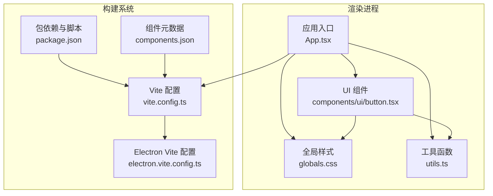
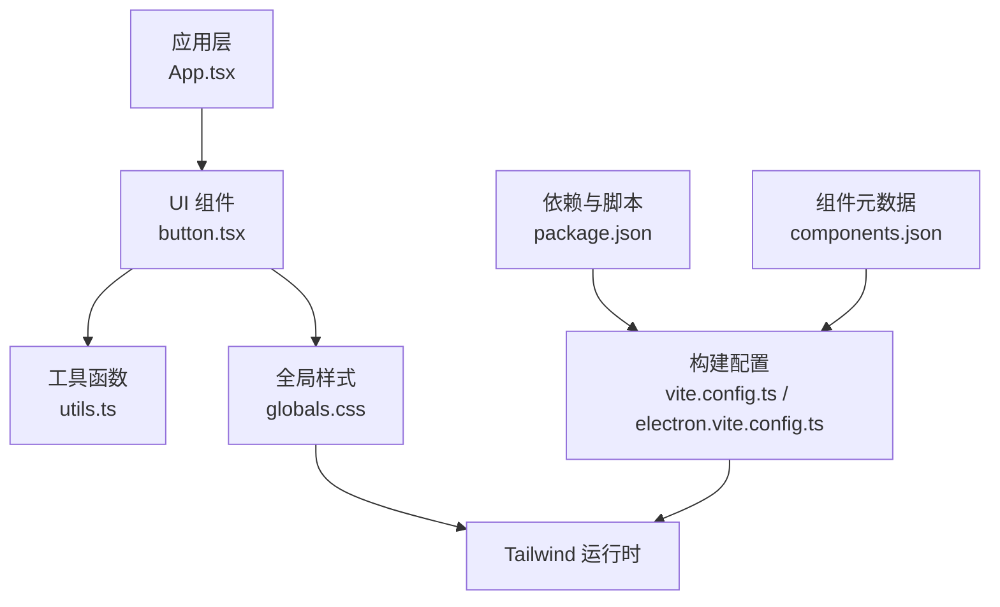
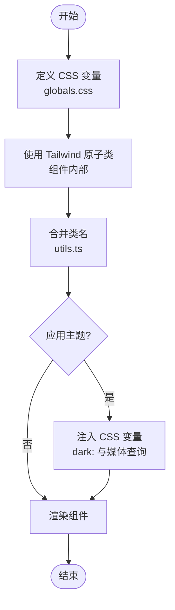
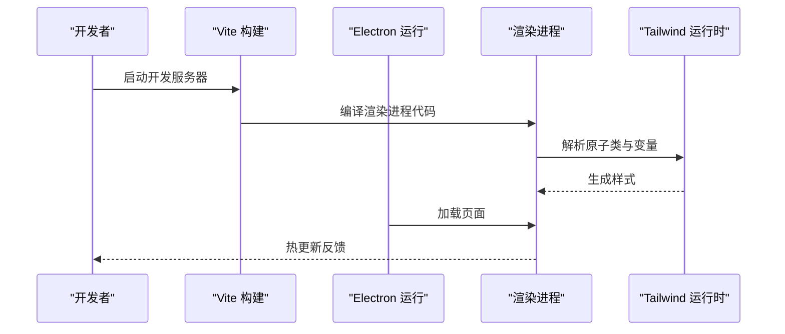
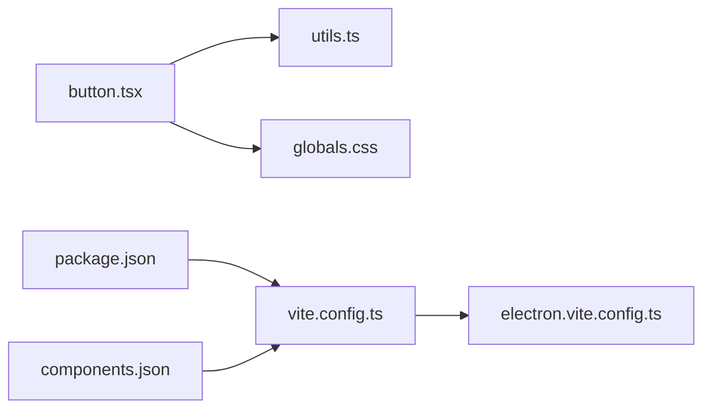

# 通用UI组件库

<cite>
**本文档引用的文件**   
- [apps/desktop/src/renderer/src/components/ui/button.tsx](file://apps/desktop/src/renderer/src/components/ui/button.tsx)
- [apps/desktop/src/renderer/src/app/globals.css](file://apps/desktop/src/renderer/src/app/globals.css)
- [apps/desktop/electron.vite.config.ts](file://apps/desktop/electron.vite.config.ts)
- [apps/desktop/vite.config.ts](file://apps/desktop/vite.config.ts)
- [apps/desktop/package.json](file://apps/desktop/package.json)
- [apps/desktop/components.json](file://apps/desktop/components.json)
- [apps/desktop/src/renderer/src/lib/utils.ts](file://apps/desktop/src/renderer/src/lib/utils.ts)
</cite>

## 目录
1. [简介](#简介)
2. [项目结构](#项目结构)
3. [核心组件](#核心组件)
4. [架构总览](#架构总览)
5. [详细组件分析](#详细组件分析)
6. [依赖关系分析](#依赖关系分析)
7. [性能考量](#性能考量)
8. [故障排查指南](#故障排查指南)
9. [结论](#结论)
10. [附录](#附录)

## 简介
本文件为 nevix-ai 桌面应用程序的通用 UI 组件库提供系统化文档，聚焦基础组件（以 Button 为代表）的实现、样式系统与主题定制。内容涵盖：
- 组件 API 设计、属性配置与事件处理
- CSS-in-JS 方案与 Tailwind CSS 集成方式
- 自定义主题策略与响应式设计实践
- 常见问题与解决方案
- 使用示例与最佳实践指引

## 项目结构
UI 组件位于渲染进程的前端代码中，采用 Vite + Electron 构建。Button 组件作为通用 UI 组件的代表，位于 components/ui 目录下；全局样式与主题变量集中在 globals.css；构建与打包通过 electron.vite.config.ts 和 vite.config.ts 管理；Tailwind 相关配置由 package.json 与 components.json 驱动。



图表来源
- [apps/desktop/src/renderer/src/components/ui/button.tsx](file://apps/desktop/src/renderer/src/components/ui/button.tsx)
- [apps/desktop/src/renderer/src/app/globals.css](file://apps/desktop/src/renderer/src/app/globals.css)
- [apps/desktop/src/renderer/src/lib/utils.ts](file://apps/desktop/src/renderer/src/lib/utils.ts)
- [apps/desktop/vite.config.ts](file://apps/desktop/vite.config.ts)
- [apps/desktop/electron.vite.config.ts](file://apps/desktop/electron.vite.config.ts)
- [apps/desktop/package.json](file://apps/desktop/package.json)
- [apps/desktop/components.json](file://apps/desktop/components.json)

章节来源
- [apps/desktop/src/renderer/src/components/ui/button.tsx](file://apps/desktop/src/renderer/src/components/ui/button.tsx)
- [apps/desktop/src/renderer/src/app/globals.css](file://apps/desktop/src/renderer/src/app/globals.css)
- [apps/desktop/src/renderer/src/lib/utils.ts](file://apps/desktop/src/renderer/src/lib/utils.ts)
- [apps/desktop/vite.config.ts](file://apps/desktop/vite.config.ts)
- [apps/desktop/electron.vite.config.ts](file://apps/desktop/electron.vite.config.ts)
- [apps/desktop/package.json](file://apps/desktop/package.json)
- [apps/desktop/components.json](file://apps/desktop/components.json)

## 核心组件
本节对 Button 组件进行系统性说明，包括其职责、API、样式策略与扩展点。

- 组件职责
  - 提供一致的按钮外观与交互行为
  - 支持多种变体（如主按钮、次按钮、危险按钮等）
  - 支持尺寸、禁用态、加载态与图标组合
  - 兼容键盘与无障碍访问

- API 设计要点
  - 基础属性：类型（variant）、尺寸（size）、是否禁用（disabled）、是否加载中（loading）、是否块级（block）
  - 事件回调：点击事件（onClick），支持合成事件与原生事件桥接
  - 样式覆盖：className 透传、CSS 变量注入、Tailwind 类名合并
  - 可访问性：aria-* 属性、role、tabIndex、键盘导航

- 样式系统
  - 基于 Tailwind CSS 的原子化样式，结合 CSS 变量实现主题
  - 通过 utils.ts 中的合并工具函数统一处理 className
  - 在 globals.css 中定义主题色板、圆角、阴影等设计令牌

- 响应式与主题
  - 使用 Tailwind 断点与状态修饰符实现响应式布局
  - 通过 CSS 变量与 dark: 前缀支持明暗主题切换
  - 组件内部根据 variant/size 动态生成类名集合

章节来源
- [apps/desktop/src/renderer/src/components/ui/button.tsx](file://apps/desktop/src/renderer/src/components/ui/button.tsx)
- [apps/desktop/src/renderer/src/lib/utils.ts](file://apps/desktop/src/renderer/src/lib/utils.ts)
- [apps/desktop/src/renderer/src/app/globals.css](file://apps/desktop/src/renderer/src/app/globals.css)

## 架构总览
下图展示 Button 组件在渲染进程中的位置及其与样式系统、构建配置的交互关系。



图表来源
- [apps/desktop/src/renderer/src/components/ui/button.tsx](file://apps/desktop/src/renderer/src/components/ui/button.tsx)
- [apps/desktop/src/renderer/src/lib/utils.ts](file://apps/desktop/src/renderer/src/lib/utils.ts)
- [apps/desktop/src/renderer/src/app/globals.css](file://apps/desktop/src/renderer/src/app/globals.css)
- [apps/desktop/vite.config.ts](file://apps/desktop/vite.config.ts)
- [apps/desktop/electron.vite.config.ts](file://apps/desktop/electron.vite.config.ts)
- [apps/desktop/package.json](file://apps/desktop/package.json)
- [apps/desktop/components.json](file://apps/desktop/components.json)

## 详细组件分析

### Button 组件分析
Button 是通用 UI 组件库的基础构件，负责封装常见的按钮形态与交互逻辑，并通过统一的样式系统输出一致的设计语言。

- 类结构与职责
  - 对外暴露 props 接口，包含类型、尺寸、状态与事件
  - 内部维护状态（如 loading、hover、focus）并映射到样式类
  - 通过工具函数合并类名，确保样式优先级与覆盖可控

- 关键方法与流程
  - 计算最终类名：根据 variant、size、disabled、loading 等条件生成类名集合
  - 事件处理：包装 onClick，支持阻止默认行为与冒泡控制
  - 可访问性：设置 role="button"、aria-disabled、aria-busy 等

- 样式与主题
  - 使用 Tailwind 原子类快速构建外观
  - 通过 CSS 变量集中管理颜色、间距、圆角等设计令牌
  - 支持 dark: 前缀与媒体查询实现主题与响应式

```mermaid
classDiagram
class Button {
+props : { variant, size, disabled, loading, block, onClick, className }
+render() JSX.Element
-mergeClasses(classes) string
-handleClick(event) void
-getAriaProps() object
}
class Utils {
+cn(...classes) string
+resolveThemeVars(theme) object
}
class Styles {
+variables : CSSVariables
+tailwindConfig : TailwindConfig
}
Button --> Utils : "调用"
Button --> Styles : "读取"
```

图表来源
- [apps/desktop/src/renderer/src/components/ui/button.tsx](file://apps/desktop/src/renderer/src/components/ui/button.tsx)
- [apps/desktop/src/renderer/src/lib/utils.ts](file://apps/desktop/src/renderer/src/lib/utils.ts)
- [apps/desktop/src/renderer/src/app/globals.css](file://apps/desktop/src/renderer/src/app/globals.css)

章节来源
- [apps/desktop/src/renderer/src/components/ui/button.tsx](file://apps/desktop/src/renderer/src/components/ui/button.tsx)
- [apps/desktop/src/renderer/src/lib/utils.ts](file://apps/desktop/src/renderer/src/lib/utils.ts)
- [apps/desktop/src/renderer/src/app/globals.css](file://apps/desktop/src/renderer/src/app/globals.css)

### 样式系统与主题定制
- CSS-in-JS 与 Tailwind 集成
  - 使用 Tailwind 原子类构建组件外观，保证一致性
  - 通过 utils.ts 的类名合并工具避免冲突与重复
  - 在 globals.css 中声明 CSS 变量，作为主题源

- 主题定制策略
  - 在 globals.css 中定义色板、字体、间距等变量
  - 使用 dark: 前缀与媒体查询切换明暗主题
  - 组件内通过 props 或上下文注入主题变量

- 响应式设计
  - 利用 Tailwind 断点（sm/md/lg/xl）适配不同屏幕
  - 组件内部按尺寸与布局需求动态调整样式



图表来源
- [apps/desktop/src/renderer/src/app/globals.css](file://apps/desktop/src/renderer/src/app/globals.css)
- [apps/desktop/src/renderer/src/lib/utils.ts](file://apps/desktop/src/renderer/src/lib/utils.ts)

章节来源
- [apps/desktop/src/renderer/src/app/globals.css](file://apps/desktop/src/renderer/src/app/globals.css)
- [apps/desktop/src/renderer/src/lib/utils.ts](file://apps/desktop/src/renderer/src/lib/utils.ts)

### 构建与集成
- Vite 与 Electron 集成
  - electron.vite.config.ts 配置主进程与渲染进程的构建选项
  - vite.config.ts 管理插件、别名与优化策略

- Tailwind 集成
  - package.json 中声明依赖与脚本
  - components.json 提供组件元数据与导出约定



图表来源
- [apps/desktop/electron.vite.config.ts](file://apps/desktop/electron.vite.config.ts)
- [apps/desktop/vite.config.ts](file://apps/desktop/vite.config.ts)
- [apps/desktop/package.json](file://apps/desktop/package.json)
- [apps/desktop/components.json](file://apps/desktop/components.json)

章节来源
- [apps/desktop/electron.vite.config.ts](file://apps/desktop/electron.vite.config.ts)
- [apps/desktop/vite.config.ts](file://apps/desktop/vite.config.ts)
- [apps/desktop/package.json](file://apps/desktop/package.json)
- [apps/desktop/components.json](file://apps/desktop/components.json)

## 依赖关系分析
- 组件依赖
  - Button 依赖 utils.ts 的类名合并与主题解析工具
  - 样式依赖 globals.css 中的变量与 Tailwind 运行时

- 构建依赖
  - Vite 与 Electron 插件链协同工作
  - Tailwind 通过 package.json 的依赖与脚本启用



图表来源
- [apps/desktop/src/renderer/src/components/ui/button.tsx](file://apps/desktop/src/renderer/src/components/ui/button.tsx)
- [apps/desktop/src/renderer/src/lib/utils.ts](file://apps/desktop/src/renderer/src/lib/utils.ts)
- [apps/desktop/src/renderer/src/app/globals.css](file://apps/desktop/src/renderer/src/app/globals.css)
- [apps/desktop/vite.config.ts](file://apps/desktop/vite.config.ts)
- [apps/desktop/electron.vite.config.ts](file://apps/desktop/electron.vite.config.ts)
- [apps/desktop/package.json](file://apps/desktop/package.json)
- [apps/desktop/components.json](file://apps/desktop/components.json)

章节来源
- [apps/desktop/src/renderer/src/components/ui/button.tsx](file://apps/desktop/src/renderer/src/components/ui/button.tsx)
- [apps/desktop/src/renderer/src/lib/utils.ts](file://apps/desktop/src/renderer/src/lib/utils.ts)
- [apps/desktop/src/renderer/src/app/globals.css](file://apps/desktop/src/renderer/src/app/globals.css)
- [apps/desktop/vite.config.ts](file://apps/desktop/vite.config.ts)
- [apps/desktop/electron.vite.config.ts](file://apps/desktop/electron.vite.config.ts)
- [apps/desktop/package.json](file://apps/desktop/package.json)
- [apps/desktop/components.json](file://apps/desktop/components.json)

## 性能考量
- 类名合并与重绘
  - 使用稳定的类名合并策略，减少不必要的 DOM 更新
  - 避免在高频事件中创建新对象或字符串拼接

- 样式体积与加载
  - 按需引入 Tailwind 原子类，避免全量样式
  - 将主题变量集中管理，减少重复计算

- 构建优化
  - 启用 Vite 的代码分割与缓存
  - 合理配置 Electron 的主/渲染进程资源隔离

[本节为通用指导，不直接分析具体文件]

## 故障排查指南
- 样式未生效
  - 检查 Tailwind 是否正确编译与注入
  - 确认 CSS 变量路径与命名空间
  - 验证类名合并顺序与优先级

- 主题切换无效
  - 检查 dark: 前缀与媒体查询配置
  - 确认全局样式中变量定义完整
  - 验证组件内变量注入逻辑

- 事件处理异常
  - 检查 onClick 包装与事件冒泡控制
  - 确认禁用态与加载态下的事件拦截
  - 验证可访问性属性设置

章节来源
- [apps/desktop/src/renderer/src/components/ui/button.tsx](file://apps/desktop/src/renderer/src/components/ui/button.tsx)
- [apps/desktop/src/renderer/src/app/globals.css](file://apps/desktop/src/renderer/src/app/globals.css)
- [apps/desktop/src/renderer/src/lib/utils.ts](file://apps/desktop/src/renderer/src/lib/utils.ts)

## 结论
本文件系统化梳理了 nevix-ai 桌面应用的通用 UI 组件库，重点围绕 Button 组件的实现、样式系统与主题定制展开。通过 Tailwind CSS 与 CSS 变量的结合，实现了高内聚、低耦合且易于扩展的组件体系。建议在实际使用中遵循统一的 API 设计与样式规范，确保跨模块的一致性与可维护性。

[本节为总结性内容，不直接分析具体文件]

## 附录
- 使用示例
  - 基础用法：引用 Button 组件并传入必要属性
  - 样式覆盖：通过 className 与 CSS 变量覆盖默认样式
  - 响应式：使用 Tailwind 断点与状态修饰符适配多设备

- 最佳实践
  - 保持组件 API 稳定与向后兼容
  - 将主题变量与设计令牌集中管理
  - 在组件内部封装可访问性与键盘交互

[本节为补充信息，不直接分析具体文件]