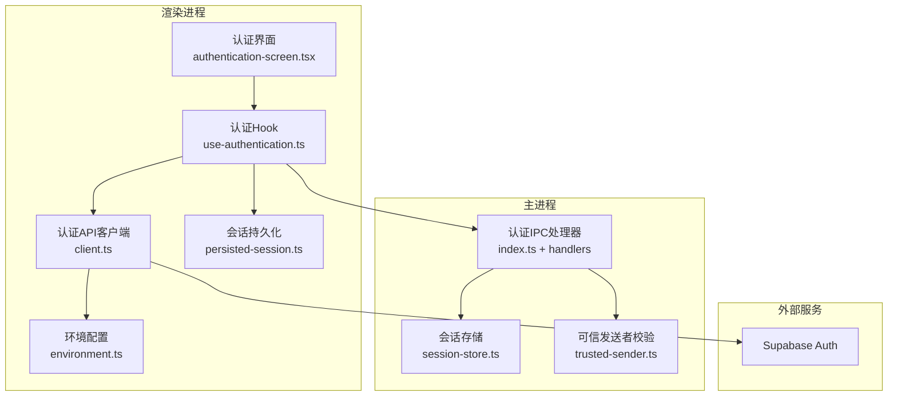
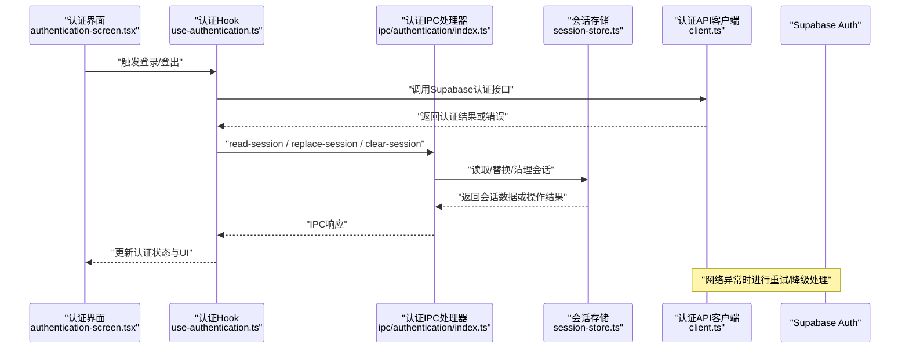
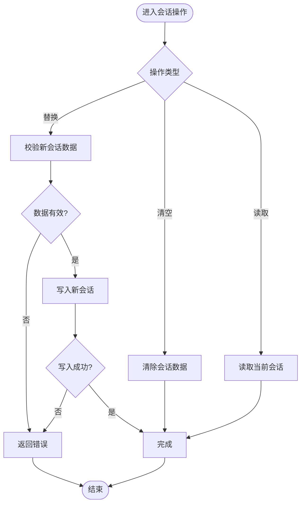
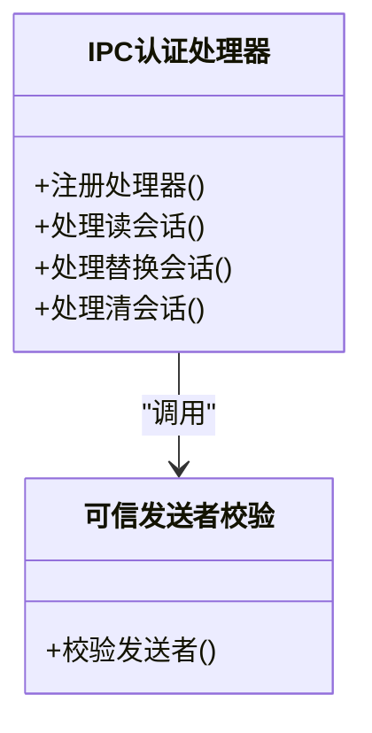
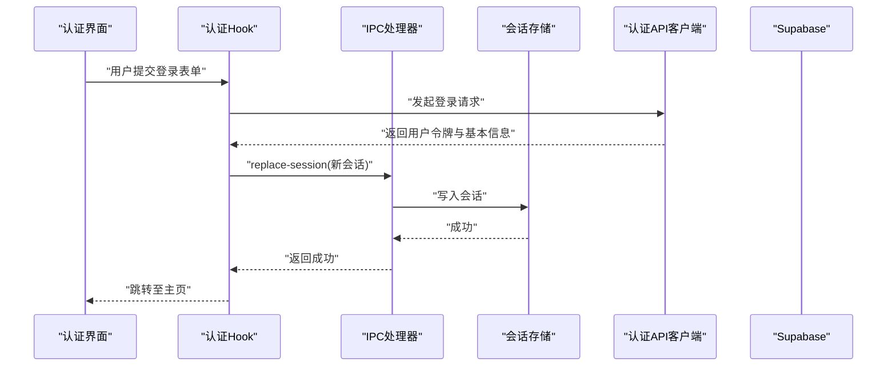
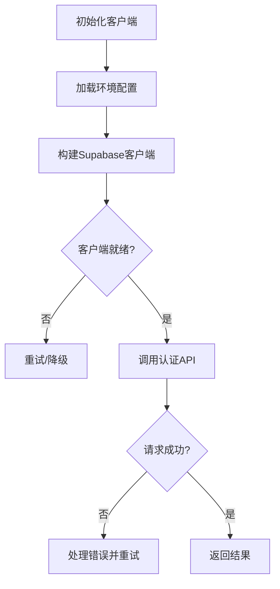
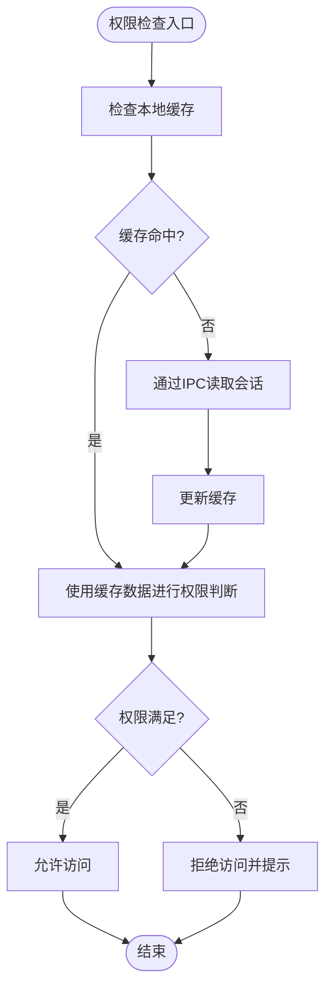
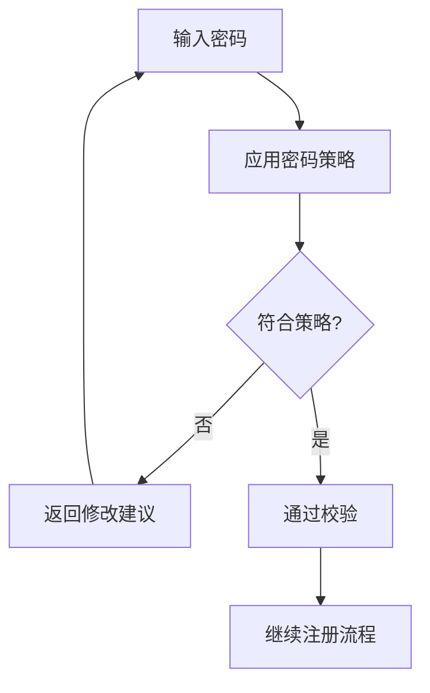
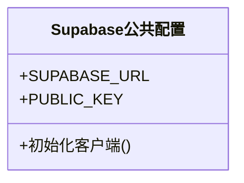
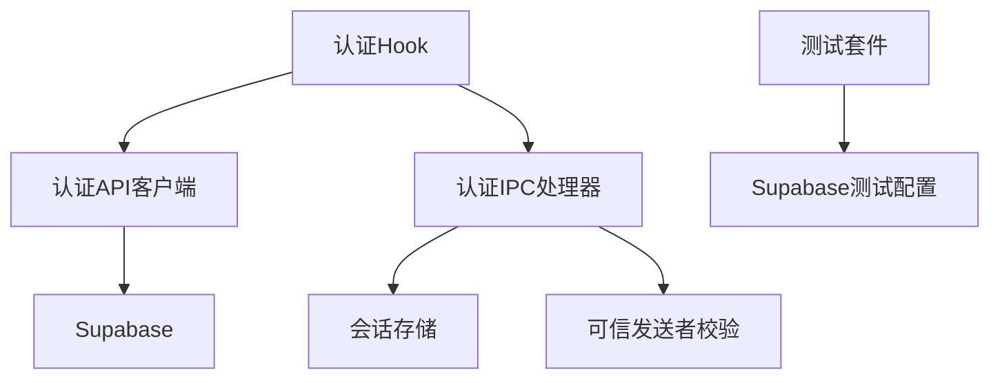

# 认证系统

<cite>
**本文引用的文件**   
- [apps/desktop/src/main/authentication/session-store.ts](file://apps/desktop/src/main/authentication/session-store.ts)
- [apps/desktop/src/main/ipc/authentication/index.ts](file://apps/desktop/src/main/ipc/authentication/index.ts)
- [apps/desktop/src/main/ipc/authentication/clear-session.ts](file://apps/desktop/src/main/ipc/authentication/clear-session.ts)
- [apps/desktop/src/main/ipc/authentication/read-session.ts](file://apps/desktop/src/main/ipc/authentication/read-session.ts)
- [apps/desktop/src/main/ipc/authentication/replace-session.ts](file://apps/desktop/src/main/ipc/authentication/replace-session.ts)
- [apps/desktop/src/main/ipc/authentication/trusted-sender.ts](file://apps/desktop/src/main/ipc/authentication/trusted-sender.ts)
- [apps/desktop/src/renderer/src/features/authentication/api/client.ts](file://apps/desktop/src/renderer/src/features/authentication/api/client.ts)
- [apps/desktop/src/renderer/src/features/authentication/api/environment.ts](file://apps/desktop/src/renderer/src/features/authentication/api/environment.ts)
- [apps/desktop/src/renderer/src/features/authentication/components/authentication-screen.tsx](file://apps/desktop/src/renderer/src/features/authentication/components/authentication-screen.tsx)
- [apps/desktop/src/renderer/src/features/authentication/hooks/use-authentication.ts](file://apps/desktop/src/renderer/src/features/authentication/hooks/use-authentication.ts)
- [apps/desktop/src/renderer/src/features/authentication/policy/password.ts](file://apps/desktop/src/renderer/src/features/authentication/policy/password.ts)
- [apps/desktop/src/renderer/src/features/authentication/session/persisted-session.ts](file://apps/desktop/src/renderer/src/features/authentication/session/persisted-session.ts)
- [apps/desktop/src/shared/config/supabase-public-config.ts](file://apps/desktop/src/shared/config/supabase-public-config.ts)
- [apps/desktop/src/shared/ipc/authentication/types.ts](file://apps/desktop/src/shared/ipc/authentication/types.ts)
- [apps/desktop/tests/auth/harness/supabase/config.toml](file://apps/desktop/tests/auth/harness/supabase/config.toml)
- [apps/desktop/tests/auth/signup-verification.spec.ts](file://apps/desktop/tests/auth/signup-verification.spec.ts)
- [apps/desktop/tests/auth/session-persistence.spec.ts](file://apps/desktop/tests/auth/session-persistence.spec.ts)
</cite>

## 目录
1. [简介](#简介)
2. [项目结构](#项目结构)
3. [核心组件](#核心组件)
4. [架构总览](#架构总览)
5. [详细组件分析](#详细组件分析)
6. [依赖关系分析](#依赖关系分析)
7. [性能考虑](#性能考虑)
8. [故障排查指南](#故障排查指南)
9. [结论](#结论)
10. [附录](#附录)

## 简介
本文件为 nevix-ai 桌面应用程序的认证系统提供系统化文档，重点覆盖以下方面：
- Supabase 集成与公共配置
- 会话管理与令牌存储机制（主进程持久化、渲染进程访问）
- 登录流程、注册验证与密码策略
- 认证状态管理、自动重连与错误恢复
- 认证 API 调用、会话持久化与权限检查示例路径
- 安全最佳实践、数据加密与隐私保护
- 常见问题与解决方案

## 项目结构
认证相关代码按“主进程/预加载/渲染进程”分层组织，并通过 IPC 通道进行跨进程通信。关键目录与职责如下：
- 主进程（main）
  - authentication：会话存储与生命周期管理
  - ipc/authentication：IPC 处理器与发送者校验
- 渲染进程（renderer）
  - features/authentication：UI、Hook、API 客户端、策略与持久化
- 共享层（shared）
  - config/supabase-public-config：Supabase 公开配置
  - ipc/authentication/types：IPC 类型定义

图表来源
- [apps/desktop/src/renderer/src/features/authentication/components/authentication-screen.tsx](file://apps/desktop/src/renderer/src/features/authentication/components/authentication-screen.tsx)
- [apps/desktop/src/renderer/src/features/authentication/hooks/use-authentication.ts](file://apps/desktop/src/renderer/src/features/authentication/hooks/use-authentication.ts)
- [apps/desktop/src/renderer/src/features/authentication/api/client.ts](file://apps/desktop/src/renderer/src/features/authentication/api/client.ts)
- [apps/desktop/src/renderer/src/features/authentication/api/environment.ts](file://apps/desktop/src/renderer/src/features/authentication/api/environment.ts)
- [apps/desktop/src/renderer/src/features/authentication/session/persisted-session.ts](file://apps/desktop/src/renderer/src/features/authentication/session/persisted-session.ts)
- [apps/desktop/src/main/authentication/session-store.ts](file://apps/desktop/src/main/authentication/session-store.ts)
- [apps/desktop/src/main/ipc/authentication/index.ts](file://apps/desktop/src/main/ipc/authentication/index.ts)
- [apps/desktop/src/main/ipc/authentication/trusted-sender.ts](file://apps/desktop/src/main/ipc/authentication/trusted-sender.ts)

章节来源
- [apps/desktop/src/main/authentication/session-store.ts](file://apps/desktop/src/main/authentication/session-store.ts)
- [apps/desktop/src/main/ipc/authentication/index.ts](file://apps/desktop/src/main/ipc/authentication/index.ts)
- [apps/desktop/src/renderer/src/features/authentication/api/client.ts](file://apps/desktop/src/renderer/src/features/authentication/api/client.ts)
- [apps/desktop/src/renderer/src/features/authentication/api/environment.ts](file://apps/desktop/src/renderer/src/features/authentication/api/environment.ts)
- [apps/desktop/src/renderer/src/features/authentication/components/authentication-screen.tsx](file://apps/desktop/src/renderer/src/features/authentication/components/authentication-screen.tsx)
- [apps/desktop/src/renderer/src/features/authentication/hooks/use-authentication.ts](file://apps/desktop/src/renderer/src/features/authentication/hooks/use-authentication.ts)
- [apps/desktop/src/renderer/src/features/authentication/session/persisted-session.ts](file://apps/desktop/src/renderer/src/features/authentication/session/persisted-session.ts)
- [apps/desktop/src/shared/config/supabase-public-config.ts](file://apps/desktop/src/shared/config/supabase-public-config.ts)

## 核心组件
- 会话存储（主进程）
  - 负责会话数据的读写、替换与清理，确保令牌在主进程中集中管理，渲染进程通过 IPC 访问。
- IPC 认证处理器
  - 暴露 read-session、replace-session、clear-session 等能力，并在处理前执行可信发送者校验。
- 认证 Hook（渲染进程）
  - 封装登录、登出、会话读取与更新逻辑，协调 UI 状态与主进程 IPC 调用。
- 认证 API 客户端
  - 基于 Supabase 客户端发起认证请求，使用环境变量配置 Supabase 端点与密钥。
- 会话持久化（渲染进程）
  - 在渲染进程侧缓存会话信息，提升响应速度并减少 IPC 开销。
- 密码策略
  - 定义密码强度规则与前端校验提示。
- Supabase 公共配置
  - 仅暴露非敏感配置（如 URL），避免泄露服务端密钥。

章节来源
- [apps/desktop/src/main/authentication/session-store.ts](file://apps/desktop/src/main/authentication/session-store.ts)
- [apps/desktop/src/main/ipc/authentication/index.ts](file://apps/desktop/src/main/ipc/authentication/index.ts)
- [apps/desktop/src/main/ipc/authentication/read-session.ts](file://apps/desktop/src/main/ipc/authentication/read-session.ts)
- [apps/desktop/src/main/ipc/authentication/replace-session.ts](file://apps/desktop/src/main/ipc/authentication/replace-session.ts)
- [apps/desktop/src/main/ipc/authentication/clear-session.ts](file://apps/desktop/src/main/ipc/authentication/clear-session.ts)
- [apps/desktop/src/main/ipc/authentication/trusted-sender.ts](file://apps/desktop/src/main/ipc/authentication/trusted-sender.ts)
- [apps/desktop/src/renderer/src/features/authentication/hooks/use-authentication.ts](file://apps/desktop/src/renderer/src/features/authentication/hooks/use-authentication.ts)
- [apps/desktop/src/renderer/src/features/authentication/api/client.ts](file://apps/desktop/src/renderer/src/features/authentication/api/client.ts)
- [apps/desktop/src/renderer/src/features/authentication/api/environment.ts](file://apps/desktop/src/renderer/src/features/authentication/api/environment.ts)
- [apps/desktop/src/renderer/src/features/authentication/session/persisted-session.ts](file://apps/desktop/src/renderer/src/features/authentication/session/persisted-session.ts)
- [apps/desktop/src/renderer/src/features/authentication/policy/password.ts](file://apps/desktop/src/renderer/src/features/authentication/policy/password.ts)
- [apps/desktop/src/shared/config/supabase-public-config.ts](file://apps/desktop/src/shared/config/supabase-public-config.ts)

## 架构总览
下图展示了从渲染进程到主进程再到 Supabase 的认证交互流程，包括登录、会话读取与替换、以及错误处理路径。

图表来源
- [apps/desktop/src/renderer/src/features/authentication/components/authentication-screen.tsx](file://apps/desktop/src/renderer/src/features/authentication/components/authentication-screen.tsx)
- [apps/desktop/src/renderer/src/features/authentication/hooks/use-authentication.ts](file://apps/desktop/src/renderer/src/features/authentication/hooks/use-authentication.ts)
- [apps/desktop/src/main/ipc/authentication/index.ts](file://apps/desktop/src/main/ipc/authentication/index.ts)
- [apps/desktop/src/main/authentication/session-store.ts](file://apps/desktop/src/main/authentication/session-store.ts)
- [apps/desktop/src/renderer/src/features/authentication/api/client.ts](file://apps/desktop/src/renderer/src/features/authentication/api/client.ts)

## 详细组件分析

### 主进程：会话存储与会话生命周期
- 职责
  - 维护当前会话对象（包含用户信息与令牌）
  - 提供读取、替换、清空会话的能力
  - 保证主进程内会话一致性
- 关键行为
  - 读取会话：返回当前会话快照
  - 替换会话：原子性更新会话，失败回滚
  - 清空会话：移除所有敏感数据
- 错误处理
  - 非法输入校验
  - 写入失败时的异常捕获与日志记录

图表来源
- [apps/desktop/src/main/authentication/session-store.ts](file://apps/desktop/src/main/authentication/session-store.ts)
- [apps/desktop/src/main/ipc/authentication/read-session.ts](file://apps/desktop/src/main/ipc/authentication/read-session.ts)
- [apps/desktop/src/main/ipc/authentication/replace-session.ts](file://apps/desktop/src/main/ipc/authentication/replace-session.ts)
- [apps/desktop/src/main/ipc/authentication/clear-session.ts](file://apps/desktop/src/main/ipc/authentication/clear-session.ts)

章节来源
- [apps/desktop/src/main/authentication/session-store.ts](file://apps/desktop/src/main/authentication/session-store.ts)
- [apps/desktop/src/main/ipc/authentication/read-session.ts](file://apps/desktop/src/main/ipc/authentication/read-session.ts)
- [apps/desktop/src/main/ipc/authentication/replace-session.ts](file://apps/desktop/src/main/ipc/authentication/replace-session.ts)
- [apps/desktop/src/main/ipc/authentication/clear-session.ts](file://apps/desktop/src/main/ipc/authentication/clear-session.ts)

### 主进程：IPC 认证处理器与可信发送者校验
- 职责
  - 统一注册认证相关 IPC 处理器
  - 在执行敏感操作前校验发送者是否可信
- 关键行为
  - 注册 read-session、replace-session、clear-session 处理器
  - 对每个请求执行 trusted-sender 校验
- 错误处理
  - 未授权发送者直接拒绝
  - 处理器内部异常向上抛出并由 Electron 安全机制处理

图表来源
- [apps/desktop/src/main/ipc/authentication/index.ts](file://apps/desktop/src/main/ipc/authentication/index.ts)
- [apps/desktop/src/main/ipc/authentication/trusted-sender.ts](file://apps/desktop/src/main/ipc/authentication/trusted-sender.ts)

章节来源
- [apps/desktop/src/main/ipc/authentication/index.ts](file://apps/desktop/src/main/ipc/authentication/index.ts)
- [apps/desktop/src/main/ipc/authentication/trusted-sender.ts](file://apps/desktop/src/main/ipc/authentication/trusted-sender.ts)

### 渲染进程：认证 Hook 与 UI 集成
- 职责
  - 封装登录、登出、刷新会话等业务流程
  - 协调 UI 状态与主进程 IPC 调用
  - 管理本地会话缓存与错误提示
- 关键行为
  - 调用认证 API 客户端进行网络请求
  - 通过 IPC 读取/替换/清空会话
  - 根据结果更新 UI 与路由
- 错误处理
  - 网络错误重试与降级
  - 会话无效时引导重新登录

图表来源
- [apps/desktop/src/renderer/src/features/authentication/components/authentication-screen.tsx](file://apps/desktop/src/renderer/src/features/authentication/components/authentication-screen.tsx)
- [apps/desktop/src/renderer/src/features/authentication/hooks/use-authentication.ts](file://apps/desktop/src/renderer/src/features/authentication/hooks/use-authentication.ts)
- [apps/desktop/src/main/ipc/authentication/index.ts](file://apps/desktop/src/main/ipc/authentication/index.ts)
- [apps/desktop/src/main/authentication/session-store.ts](file://apps/desktop/src/main/authentication/session-store.ts)
- [apps/desktop/src/renderer/src/features/authentication/api/client.ts](file://apps/desktop/src/renderer/src/features/authentication/api/client.ts)

章节来源
- [apps/desktop/src/renderer/src/features/authentication/components/authentication-screen.tsx](file://apps/desktop/src/renderer/src/features/authentication/components/authentication-screen.tsx)
- [apps/desktop/src/renderer/src/features/authentication/hooks/use-authentication.ts](file://apps/desktop/src/renderer/src/features/authentication/hooks/use-authentication.ts)

### 渲染进程：认证 API 客户端与环境配置
- 职责
  - 初始化 Supabase 客户端并设置端点与密钥
  - 封装常用认证方法（登录、注册、刷新令牌等）
- 关键行为
  - 从 environment.ts 读取 Supabase URL 与公开密钥
  - 构建客户端实例并复用连接
- 错误处理
  - 网络超时与断网检测
  - 返回结构化错误码便于上层处理

图表来源
- [apps/desktop/src/renderer/src/features/authentication/api/client.ts](file://apps/desktop/src/renderer/src/features/authentication/api/client.ts)
- [apps/desktop/src/renderer/src/features/authentication/api/environment.ts](file://apps/desktop/src/renderer/src/features/authentication/api/environment.ts)

章节来源
- [apps/desktop/src/renderer/src/features/authentication/api/client.ts](file://apps/desktop/src/renderer/src/features/authentication/api/client.ts)
- [apps/desktop/src/renderer/src/features/authentication/api/environment.ts](file://apps/desktop/src/renderer/src/features/authentication/api/environment.ts)

### 渲染进程：会话持久化与权限检查
- 职责
  - 在渲染进程侧缓存会话信息，减少 IPC 开销
  - 提供权限检查辅助方法（如角色、作用域）
- 关键行为
  - 读取主进程会话后缓存到内存
  - 在需要时校验用户权限与资源访问范围
- 错误处理
  - 缓存失效时回退到 IPC 读取
  - 权限不足时提示并限制功能

图表来源
- [apps/desktop/src/renderer/src/features/authentication/session/persisted-session.ts](file://apps/desktop/src/renderer/src/features/authentication/session/persisted-session.ts)

章节来源
- [apps/desktop/src/renderer/src/features/authentication/session/persisted-session.ts](file://apps/desktop/src/renderer/src/features/authentication/session/persisted-session.ts)

### 密码策略与注册验证
- 职责
  - 定义密码强度规则（长度、字符集、复杂度）
  - 在前端进行实时校验与友好提示
- 关键行为
  - 校验密码是否符合策略
  - 注册时对邮箱格式与可用性进行检查
- 错误处理
  - 不合规密码给出明确修改建议
  - 邮箱冲突时提示更换

图表来源
- [apps/desktop/src/renderer/src/features/authentication/policy/password.ts](file://apps/desktop/src/renderer/src/features/authentication/policy/password.ts)

章节来源
- [apps/desktop/src/renderer/src/features/authentication/policy/password.ts](file://apps/desktop/src/renderer/src/features/authentication/policy/password.ts)

### Supabase 集成与公共配置
- 职责
  - 提供非敏感配置（URL、公开密钥）
  - 确保服务端密钥不被打包进渲染进程
- 关键行为
  - 从环境变量注入配置
  - 客户端初始化时使用最小权限原则

图表来源
- [apps/desktop/src/shared/config/supabase-public-config.ts](file://apps/desktop/src/shared/config/supabase-public-config.ts)

章节来源
- [apps/desktop/src/shared/config/supabase-public-config.ts](file://apps/desktop/src/shared/config/supabase-public-config.ts)

## 依赖关系分析
认证子系统依赖关系如下：
- 渲染进程依赖 IPC 处理器进行会话操作
- IPC 处理器依赖会话存储与可信发送者校验
- 认证 API 客户端依赖 Supabase 服务与环境配置
- 测试套件依赖 Supabase 测试配置与辅助工具

图表来源
- [apps/desktop/src/renderer/src/features/authentication/hooks/use-authentication.ts](file://apps/desktop/src/renderer/src/features/authentication/hooks/use-authentication.ts)
- [apps/desktop/src/renderer/src/features/authentication/api/client.ts](file://apps/desktop/src/renderer/src/features/authentication/api/client.ts)
- [apps/desktop/src/main/ipc/authentication/index.ts](file://apps/desktop/src/main/ipc/authentication/index.ts)
- [apps/desktop/src/main/authentication/session-store.ts](file://apps/desktop/src/main/authentication/session-store.ts)
- [apps/desktop/src/main/ipc/authentication/trusted-sender.ts](file://apps/desktop/src/main/ipc/authentication/trusted-sender.ts)
- [apps/desktop/tests/auth/harness/supabase/config.toml](file://apps/desktop/tests/auth/harness/supabase/config.toml)

章节来源
- [apps/desktop/src/renderer/src/features/authentication/hooks/use-authentication.ts](file://apps/desktop/src/renderer/src/features/authentication/hooks/use-authentication.ts)
- [apps/desktop/src/renderer/src/features/authentication/api/client.ts](file://apps/desktop/src/renderer/src/features/authentication/api/client.ts)
- [apps/desktop/src/main/ipc/authentication/index.ts](file://apps/desktop/src/main/ipc/authentication/index.ts)
- [apps/desktop/src/main/authentication/session-store.ts](file://apps/desktop/src/main/authentication/session-store.ts)
- [apps/desktop/src/main/ipc/authentication/trusted-sender.ts](file://apps/desktop/src/main/ipc/authentication/trusted-sender.ts)
- [apps/desktop/tests/auth/harness/supabase/config.toml](file://apps/desktop/tests/auth/harness/supabase/config.toml)

## 性能考虑
- 减少 IPC 调用频率：在渲染进程缓存会话，仅在必要时同步主进程状态
- 连接复用：Supabase 客户端单例化，避免重复建立连接
- 异步与重试：网络请求采用指数退避重试，避免雪崩
- 内存管理：会话对象及时释放，避免长期驻留导致内存泄漏

## 故障排查指南
- 登录失败
  - 检查网络连通性与 Supabase 端点配置
  - 查看认证 API 客户端的错误码与日志
  - 确认密码策略与邮箱格式正确
- 会话丢失
  - 验证主进程会话存储是否被意外清空
  - 检查 IPC 处理器是否被拦截或权限不足
  - 确认渲染进程缓存是否过期
- 自动重连
  - 观察客户端重试策略是否生效
  - 检查 Supabase 服务状态与限流策略
- 常见错误
  - 未授权发送者：确认 trusted-sender 校验逻辑
  - 令牌过期：触发刷新令牌或重新登录流程

章节来源
- [apps/desktop/tests/auth/signup-verification.spec.ts](file://apps/desktop/tests/auth/signup-verification.spec.ts)
- [apps/desktop/tests/auth/session-persistence.spec.ts](file://apps/desktop/tests/auth/session-persistence.spec.ts)

## 结论
nevix-ai 桌面应用的认证系统通过主进程集中管理会话、渲染进程轻量缓存与 IPC 安全通信，结合 Supabase 提供的身份服务，实现了安全、可靠且易用的认证体验。遵循最小权限原则、严格的前端校验与完善的错误处理，确保了系统的健壮性与用户体验。

## 附录
- 认证 API 调用示例路径
  - 登录/注册：[apps/desktop/src/renderer/src/features/authentication/api/client.ts](file://apps/desktop/src/renderer/src/features/authentication/api/client.ts)
  - 环境配置：[apps/desktop/src/renderer/src/features/authentication/api/environment.ts](file://apps/desktop/src/renderer/src/features/authentication/api/environment.ts)
- 会话持久化示例路径
  - 渲染进程缓存：[apps/desktop/src/renderer/src/features/authentication/session/persisted-session.ts](file://apps/desktop/src/renderer/src/features/authentication/session/persisted-session.ts)
  - 主进程存储：[apps/desktop/src/main/authentication/session-store.ts](file://apps/desktop/src/main/authentication/session-store.ts)
- 权限检查示例路径
  - 钩子中的权限判断：[apps/desktop/src/renderer/src/features/authentication/hooks/use-authentication.ts](file://apps/desktop/src/renderer/src/features/authentication/hooks/use-authentication.ts)
- 密码策略示例路径
  - 策略定义与校验：[apps/desktop/src/renderer/src/features/authentication/policy/password.ts](file://apps/desktop/src/renderer/src/features/authentication/policy/password.ts)
- Supabase 公共配置示例路径
  - 非敏感配置：[apps/desktop/src/shared/config/supabase-public-config.ts](file://apps/desktop/src/shared/config/supabase-public-config.ts)
- 测试用例参考
  - 注册验证：[apps/desktop/tests/auth/signup-verification.spec.ts](file://apps/desktop/tests/auth/signup-verification.spec.ts)
  - 会话持久化：[apps/desktop/tests/auth/session-persistence.spec.ts](file://apps/desktop/tests/auth/session-persistence.spec.ts)
  - Supabase 测试配置：[apps/desktop/tests/auth/harness/supabase/config.toml](file://apps/desktop/tests/auth/harness/supabase/config.toml)