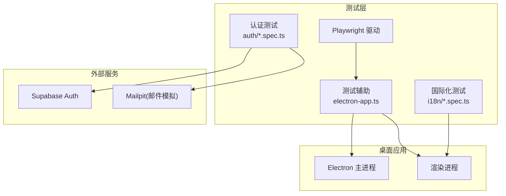
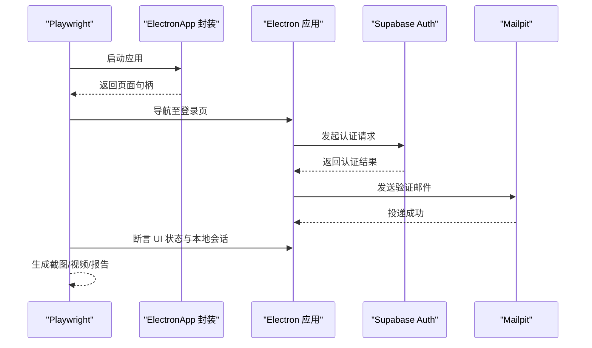
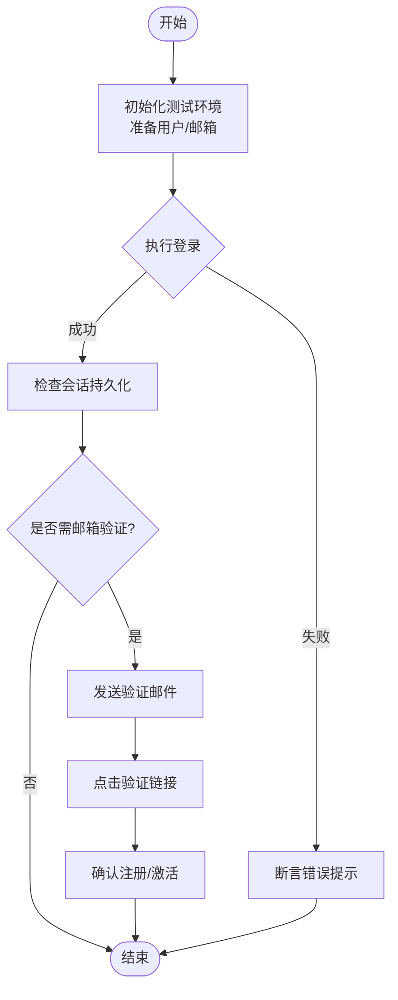
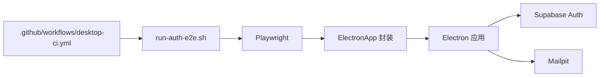

# 测试框架

<cite>
**本文引用的文件**   
- [apps/desktop/playwright.config.ts](file://apps/desktop/playwright.config.ts)
- [apps/desktop/package.json](file://apps/desktop/package.json)
- [apps/desktop/tests/auth/login-boundary.spec.ts](file://apps/desktop/tests/auth/login-boundary.spec.ts)
- [apps/desktop/tests/auth/session-persistence.spec.ts](file://apps/desktop/tests/auth/session-persistence.spec.ts)
- [apps/desktop/tests/auth/signup-verification.spec.ts](file://apps/desktop/tests/auth/signup-verification.spec.ts)
- [apps/desktop/tests/auth/configuration.spec.ts](file://apps/desktop/tests/auth/configuration.spec.ts)
- [apps/desktop/tests/auth/electron-security.spec.ts](file://apps/desktop/tests/auth/electron-security.spec.ts)
- [apps/desktop/tests/auth/public-config-policy.spec.ts](file://apps/desktop/tests/auth/public-config-policy.spec.ts)
- [apps/desktop/tests/auth/helpers/supabase-auth.ts](file://apps/desktop/tests/auth/helpers/supabase-auth.ts)
- [apps/desktop/tests/auth/helpers/mailpit.ts](file://apps/desktop/tests/auth/helpers/mailpit.ts)
- [apps/desktop/tests/i18n/startup-language.spec.ts](file://apps/desktop/tests/i18n/startup-language.spec.ts)
- [apps/desktop/tests/i18n/language-mode-settings.spec.ts](file://apps/desktop/tests/i18n/language模式设置.spec.ts)
- [apps/desktop/tests/i18n/resource-contract.spec.ts](file://apps/desktop/tests/i18n/resource-contract.spec.ts)
- [apps/desktop/tests/helpers/electron-app.ts](file://apps/desktop/tests/helpers/electron-app.ts)
- [apps/desktop/scripts/run-auth-e2e.sh](file://apps/desktop/scripts/run-auth-e2e.sh)
- [apps/desktop/scripts/verify-auth-artifacts.mjs](file://apps/desktop/scripts/verify-auth-artifacts.mjs)
- [.github/workflows/desktop-ci.yml](file://.github/workflows/desktop-ci.yml)
</cite>

## 目录
1. [简介](#简介)
2. [项目结构](#项目结构)
3. [核心组件](#核心组件)
4. [架构总览](#架构总览)
5. [详细组件分析](#详细组件分析)
6. [依赖分析](#依赖分析)
7. [性能考虑](#性能考虑)
8. [故障排查指南](#故障排查指南)
9. [结论](#结论)
10. [附录](#附录)

## 简介
本文件为 nevix-ai 桌面应用的测试框架文档，聚焦于 Playwright E2E 测试、Electron 应用集成、认证与国际化测试、安全性测试、测试数据管理、断言库使用、并行执行策略以及 CI/CD 集成与报告生成。文档面向测试新手与专家，既提供入门指引，也包含高级配置与优化建议。

## 项目结构
测试代码位于 apps/desktop/tests 目录下，按功能域组织：
- tests/auth：认证相关 E2E（登录、注册验证、会话持久化、安全策略等）
- tests/i18n：国际化相关 E2E（启动语言、语言模式设置、资源契约校验）
- tests/helpers：通用辅助（Electron 应用启动封装）
- scripts：E2E 运行脚本与产物校验脚本
- playwright.config.ts：Playwright 全局配置（浏览器、环境、并行、报告等）
- package.json：测试脚本入口与依赖声明
- .github/workflows/desktop-ci.yml：CI 流水线定义

图表来源
- [apps/desktop/playwright.config.ts](file://apps/desktop/playwright.config.ts)
- [apps/desktop/tests/helpers/electron-app.ts](file://apps/desktop/tests/helpers/electron-app.ts)
- [apps/desktop/tests/auth/login-boundary.spec.ts](file://apps/desktop/tests/auth/login-boundary.spec.ts)
- [apps/desktop/tests/i18n/startup-language.spec.ts](file://apps/desktop/tests/i18n/startup-language.spec.ts)

章节来源
- [apps/desktop/playwright.config.ts](file://apps/desktop/playwright.config.ts)
- [apps/desktop/package.json](file://apps/desktop/package.json)
- [apps/desktop/tests/helpers/electron-app.ts](file://apps/desktop/tests/helpers/electron-app.ts)

## 核心组件
- Playwright 配置：集中管理浏览器实例、超时、重试、并行度、截图/视频、报告输出等。
- Electron 应用封装：统一启动/关闭 Electron 应用，暴露页面句柄与 IPC 通道。
- 认证测试套件：覆盖登录边界、会话持久化、注册验证、公开配置策略、Electron 安全策略。
- 国际化测试套件：覆盖启动语言、语言模式设置、资源契约一致性。
- 外部服务模拟：Supabase Auth 与 Mailpit 用于端到端认证流程验证。
- 脚本与 CI：run-auth-e2e.sh 编排 E2E 运行；desktop-ci.yml 在 CI 中执行测试并生成报告。

章节来源
- [apps/desktop/playwright.config.ts](file://apps/desktop/playwright.config.ts)
- [apps/desktop/tests/helpers/electron-app.ts](file://apps/desktop/tests/helpers/electron-app.ts)
- [apps/desktop/tests/auth/login-boundary.spec.ts](file://apps/desktop/tests/auth/login-boundary.spec.ts)
- [apps/desktop/tests/i18n/startup-language.spec.ts](file://apps/desktop/tests/i18n/startup-language.spec.ts)
- [apps/desktop/scripts/run-auth-e2e.sh](file://apps/desktop/scripts/run-auth-e2e.sh)
- [.github/workflows/desktop-ci.yml](file://.github/workflows/desktop-ci.yml)

## 架构总览
下图展示 E2E 测试从 Playwright 到 Electron 应用，再到 Supabase/Mailpit 的调用链路与数据流。

图表来源
- [apps/desktop/playwright.config.ts](file://apps/desktop/playwright.config.ts)
- [apps/desktop/tests/helpers/electron-app.ts](file://apps/desktop/tests/helpers/electron-app.ts)
- [apps/desktop/tests/auth/login-boundary.spec.ts](file://apps/desktop/tests/auth/login-boundary.spec.ts)
- [apps/desktop/tests/auth/helpers/supabase-auth.ts](file://apps/desktop/tests/auth/helpers/supabase-auth.ts)
- [apps/desktop/tests/auth/helpers/mailpit.ts](file://apps/desktop/tests/auth/helpers/mailpit.ts)

## 详细组件分析

### Playwright E2E 配置与环境
- 浏览器与上下文：可配置 Chromium/Firefox/WebKit 及并发数、超时、重试策略。
- 环境与变量：通过环境变量注入 Supabase、Mailpit、调试开关等。
- 报告与产物：HTML 报告、截图、视频、追踪文件路径与保留策略。
- 钩子与生命周期：beforeAll/afterAll 用于启动/停止外部服务或清理数据。

章节来源
- [apps/desktop/playwright.config.ts](file://apps/desktop/playwright.config.ts)
- [apps/desktop/package.json](file://apps/desktop/package.json)

### Electron 应用封装
- 启动与关闭：封装 Electron 二进制启动、端口监听、进程退出处理。
- 页面交互：提供等待加载、元素可见性、键盘/鼠标操作封装。
- IPC 通道：便于在测试中触发主进程能力（如读取/写入会话）。

章节来源
- [apps/desktop/tests/helpers/electron-app.ts](file://apps/desktop/tests/helpers/electron-app.ts)

### 认证测试套件
- 登录边界测试：覆盖正常登录、错误密码、空输入、网络异常等场景。
- 会话持久化：验证登录后本地存储与会话恢复。
- 注册验证：结合 Mailpit 检查验证邮件与链接点击流程。
- 公开配置策略：校验客户端公开配置的安全性与默认值。
- Electron 安全策略：检查 CSP、节点禁用、协议白名单等。

图表来源
- [apps/desktop/tests/auth/login-boundary.spec.ts](file://apps/desktop/tests/auth/login-boundary.spec.ts)
- [apps/desktop/tests/auth/session-persistence.spec.ts](file://apps/desktop/tests/auth/session-persistence.spec.ts)
- [apps/desktop/tests/auth/signup-verification.spec.ts](file://apps/desktop/tests/auth/signup-verification.spec.ts)
- [apps/desktop/tests/auth/helpers/supabase-auth.ts](file://apps/desktop/tests/auth/helpers/supabase-auth.ts)
- [apps/desktop/tests/auth/helpers/mailpit.ts](file://apps/desktop/tests/auth/helpers/mailpit.ts)

章节来源
- [apps/desktop/tests/auth/login-boundary.spec.ts](file://apps/desktop/tests/auth/login-boundary.spec.ts)
- [apps/desktop/tests/auth/session-persistence.spec.ts](file://apps/desktop/tests/auth/session-persistence.spec.ts)
- [apps/desktop/tests/auth/signup-verification.spec.ts](file://apps/desktop/tests/auth/signup-verification.spec.ts)
- [apps/desktop/tests/auth/configuration.spec.ts](file://apps/desktop/tests/auth/configuration.spec.ts)
- [apps/desktop/tests/auth/public-config-policy.spec.ts](file://apps/desktop/tests/auth/public-config-policy.spec.ts)
- [apps/desktop/tests/auth/electron-security.spec.ts](file://apps/desktop/tests/auth/electron-security.spec.ts)
- [apps/desktop/tests/auth/helpers/supabase-auth.ts](file://apps/desktop/tests/auth/helpers/supabase-auth.ts)
- [apps/desktop/tests/auth/helpers/mailpit.ts](file://apps/desktop/tests/auth/helpers/mailpit.ts)

### 国际化测试套件
- 启动语言：验证应用首次启动时根据系统/配置选择语言。
- 语言模式设置：切换语言后界面文案与资源加载正确。
- 资源契约：确保 i18n 资源键一致，避免缺失或错位。

章节来源
- [apps/desktop/tests/i18n/startup-language.spec.ts](file://apps/desktop/tests/i18n/startup-language.spec.ts)
- [apps/desktop/tests/i18n/language-mode-settings.spec.ts](file://apps/desktop/tests/i18n/language模式设置.spec.ts)
- [apps/desktop/tests/i18n/resource-contract.spec.ts](file://apps/desktop/tests/i18n/resource-contract.spec.ts)

### 测试数据管理与断言库
- 测试数据：通过 Supabase 辅助创建/清理用户与邮箱；使用 Mailpit API 获取验证码。
- 断言库：基于 Playwright 内置断言（expect），结合自定义匹配器进行 UI 与状态断言。
- 数据隔离：每个用例独立数据，避免交叉污染；必要时使用事务或回滚。

章节来源
- [apps/desktop/tests/auth/helpers/supabase-auth.ts](file://apps/desktop/tests/auth/helpers/supabase-auth.ts)
- [apps/desktop/tests/auth/helpers/mailpit.ts](file://apps/desktop/tests/auth/helpers/mailpit.ts)
- [apps/desktop/tests/auth/login-boundary.spec.ts](file://apps/desktop/tests/auth/login-boundary.spec.ts)

### 并行执行策略
- 用例级并行：按 spec 文件并行执行，提升整体速度。
- 用例内串行：同一用例内的步骤保持顺序，避免竞态。
- 资源隔离：数据库与邮件服务使用独立租户/邮箱前缀，避免冲突。
- 资源限制：合理设置 workers 数量与超时，避免 CI 资源耗尽。

章节来源
- [apps/desktop/playwright.config.ts](file://apps/desktop/playwright.config.ts)
- [apps/desktop/package.json](file://apps/desktop/package.json)

### CI/CD 集成与报告
- 流水线：在 GitHub Actions 中安装依赖、启动外部服务、运行 E2E、收集报告。
- 报告：生成 HTML 报告与覆盖率（如需），上传为构建产物。
- 缓存：缓存 node_modules 与浏览器二进制，加速构建。

章节来源
- [.github/workflows/desktop-ci.yml](file://.github/workflows/desktop-ci.yml)
- [apps/desktop/scripts/run-auth-e2e.sh](file://apps/desktop/scripts/run-auth-e2e.sh)
- [apps/desktop/scripts/verify-auth-artifacts.mjs](file://apps/desktop/scripts/verify-auth-artifacts.mjs)

## 依赖分析
- 测试对 Playwright 的依赖：浏览器自动化、网络拦截、截图/视频、报告。
- 测试对 Electron 的依赖：应用启动、页面句柄、IPC 通道。
- 测试对外部服务的依赖：Supabase Auth、Mailpit。
- 脚本依赖：Shell 与 Node.js 模块用于编排与校验。

图表来源
- [apps/desktop/playwright.config.ts](file://apps/desktop/playwright.config.ts)
- [apps/desktop/tests/helpers/electron-app.ts](file://apps/desktop/tests/helpers/electron-app.ts)
- [apps/desktop/tests/auth/helpers/supabase-auth.ts](file://apps/desktop/tests/auth/helpers/supabase-auth.ts)
- [apps/desktop/tests/auth/helpers/mailpit.ts](file://apps/desktop/tests/auth/helpers/mailpit.ts)
- [.github/workflows/desktop-ci.yml](file://.github/workflows/desktop-ci.yml)
- [apps/desktop/scripts/run-auth-e2e.sh](file://apps/desktop/scripts/run-auth-e2e.sh)

章节来源
- [apps/desktop/playwright.config.ts](file://apps/desktop/playwright.config.ts)
- [apps/desktop/tests/helpers/electron-app.ts](file://apps/desktop/tests/helpers/electron-app.ts)
- [apps/desktop/tests/auth/helpers/supabase-auth.ts](file://apps/desktop/tests/auth/helpers/supabase-auth.ts)
- [apps/desktop/tests/auth/helpers/mailpit.ts](file://apps/desktop/tests/auth/helpers/mailpit.ts)
- [.github/workflows/desktop-ci.yml](file://.github/workflows/desktop-ci.yml)
- [apps/desktop/scripts/run-auth-e2e.sh](file://apps/desktop/scripts/run-auth-e2e.sh)

## 性能考虑
- 合理设置 workers：根据 CI 机器核数与任务类型调整并行度。
- 减少不必要等待：使用显式等待与条件断言替代固定 sleep。
- 复用会话：在安全前提下复用登录态以减少认证开销。
- 控制产物大小：仅保留失败用例的截图/视频，避免磁盘压力。
- 网络优化：启用 HTTP 缓存与连接复用，减少外部服务延迟影响。

[本节为通用指导，不直接分析具体文件]

## 故障排查指南
- 应用无法启动：检查 Electron 二进制路径、权限与环境变量；查看控制台日志。
- 认证失败：确认 Supabase 配置、网络可达与凭据有效性；检查 Mailpit 是否收到邮件。
- 断言不稳定：增加重试与显式等待；避免依赖时间敏感逻辑。
- 并行冲突：隔离测试数据（用户/邮箱前缀）；确保外部服务支持多租户。
- 报告缺失：确认 Playwright 报告插件已启用；检查 CI 产物上传步骤。

章节来源
- [apps/desktop/tests/helpers/electron-app.ts](file://apps/desktop/tests/helpers/electron-app.ts)
- [apps/desktop/tests/auth/helpers/supabase-auth.ts](file://apps/desktop/tests/auth/helpers/supabase-auth.ts)
- [apps/desktop/tests/auth/helpers/mailpit.ts](file://apps/desktop/tests/auth/helpers/mailpit.ts)
- [apps/desktop/playwright.config.ts](file://apps/desktop/playwright.config.ts)
- [.github/workflows/desktop-ci.yml](file://.github/workflows/desktop-ci.yml)

## 结论
本测试框架以 Playwright 为核心，结合 Electron 应用封装与外部服务模拟，构建了覆盖认证、国际化与安全性的完整 E2E 体系。通过合理的并行策略、数据隔离与 CI/CD 集成，实现了稳定高效的回归保障。建议在持续演进中完善覆盖率统计、增强断言语义化与优化外部服务稳定性，进一步提升测试质量与效率。

[本节为总结性内容，不直接分析具体文件]

## 附录
- 编写测试最佳实践
  - 用例命名清晰，描述行为而非实现细节。
  - 使用 Page Object/Screen Object 抽象页面交互。
  - 优先断言用户可见状态，避免脆弱选择器。
  - 将共享逻辑抽取到 helpers，保持用例简洁。
  - 为关键路径添加截图/视频，便于失败定位。
- 常见问题与解决
  - 网络超时：增大超时阈值或降级重试次数。
  - 元素不可见：检查布局与动画，使用更稳定的定位策略。
  - 数据污染：每次用例前后清理数据，确保幂等。
  - 报告过大：按需保留产物，定期清理历史。

[本节为通用指导，不直接分析具体文件]