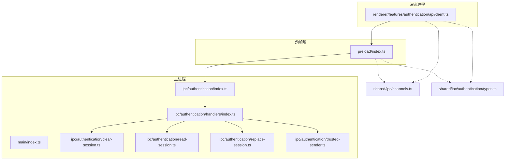
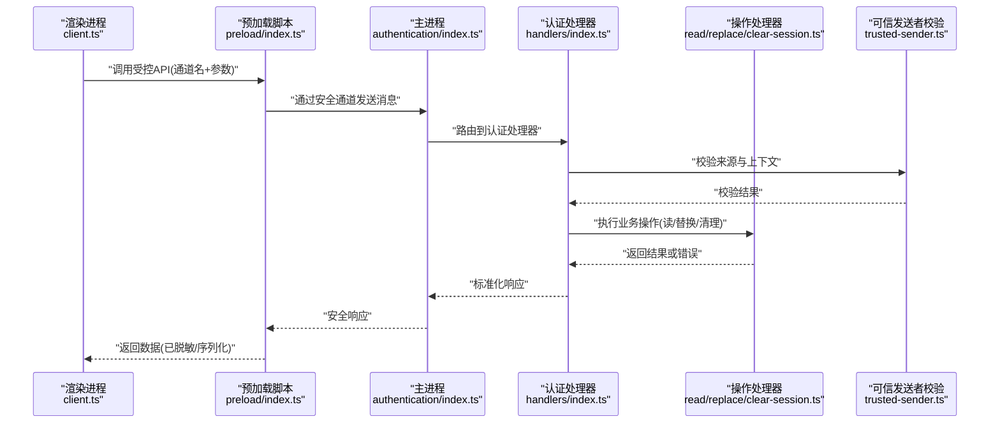
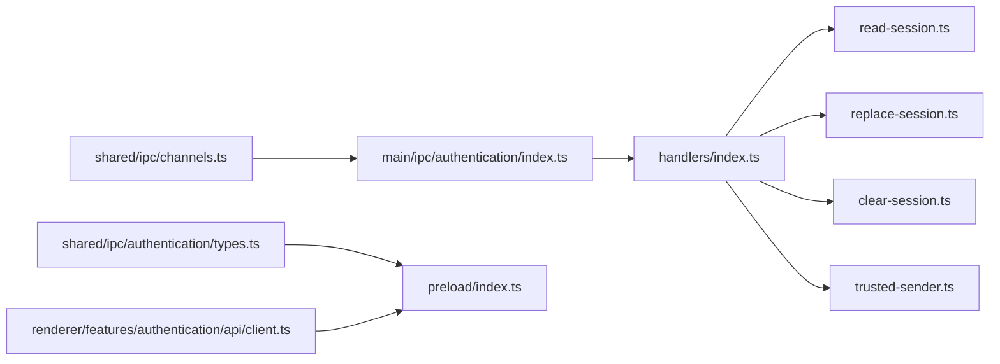

# IPC安全通信

<cite>
**本文引用的文件**
- [apps/desktop/src/main/index.ts](file://apps/desktop/src/main/index.ts)
- [apps/desktop/src/main/ipc/authentication/index.ts](file://apps/desktop/src/main/ipc/authentication/index.ts)
- [apps/desktop/src/main/ipc/authentication/handlers/index.ts](file://apps/desktop/src/main/ipc/authentication/handlers/index.ts)
- [apps/desktop/src/main/ipc/authentication/clear-session.ts](file://apps/desktop/src/main/ipc/authentication/clear-session.ts)
- [apps/desktop/src/main/ipc/authentication/read-session.ts](file://apps/desktop/src/main/ipc/authentication/read-session.ts)
- [apps/desktop/src/main/ipc/authentication/replace-session.ts](file://apps/desktop/src/main/ipc/authentication/replace-session.ts)
- [apps/desktop/src/main/ipc/authentication/trusted-sender.ts](file://apps/desktop/src/main/ipc/authentication/trusted-sender.ts)
- [apps/desktop/src/preload/index.ts](file://apps/desktop/src/preload/index.ts)
- [apps/desktop/src/shared/ipc/channels.ts](file://apps/desktop/src/shared/ipc/channels.ts)
- [apps/desktop/src/shared/ipc/authentication/types.ts](file://apps/desktop/src/shared/ipc/authentication/types.ts)
- [apps/desktop/src/renderer/src/features/authentication/api/client.ts](file://apps/desktop/src/renderer/src/features/authentication/api/client.ts)
- [apps/desktop/tests/auth/electron-security.spec.ts](file://apps/desktop/tests/auth/electron-security.spec.ts)
</cite>

## 目录
1. [简介](#简介)
2. [项目结构](#项目结构)
3. [核心组件](#核心组件)
4. [架构总览](#架构总览)
5. [详细组件分析](#详细组件分析)
6. [依赖关系分析](#依赖关系分析)
7. [性能考虑](#性能考虑)
8. [故障排查指南](#故障排查指南)
9. [结论](#结论)
10. [附录](#附录)

## 简介
本文件面向nevix-ai桌面应用（Electron）的IPC安全通信，系统性阐述主进程与渲染进程之间的安全通道设计、认证相关处理器实现、权限校验与数据序列化策略、CSP与沙箱隔离等安全配置，以及消息路由、错误传播与异常处理机制。文档同时提供安全审计清单、漏洞扫描建议与渗透测试指引，帮助团队识别并缓解常见的IPC劫持、信息泄露与权限提升风险。

## 项目结构
本项目采用“主进程-预加载-渲染进程”的分层架构，IPC能力集中在主进程的ipc模块中，通过预加载脚本向渲染进程暴露最小化API。共享类型定义位于shared/ipc，确保两端契约一致。

图表来源
- [apps/desktop/src/main/index.ts](file://apps/desktop/src/main/index.ts)
- [apps/desktop/src/main/ipc/authentication/index.ts](file://apps/desktop/src/main/ipc/authentication/index.ts)
- [apps/desktop/src/main/ipc/authentication/handlers/index.ts](file://apps/desktop/src/main/ipc/authentication/handlers/index.ts)
- [apps/desktop/src/main/ipc/authentication/clear-session.ts](file://apps/desktop/src/main/ipc/authentication/clear-session.ts)
- [apps/desktop/src/main/ipc/authentication/read-session.ts](file://apps/desktop/src/main/ipc/authentication/read-session.ts)
- [apps/desktop/src/main/ipc/authentication/replace-session.ts](file://apps/desktop/src/main/ipc/authentication/replace-session.ts)
- [apps/desktop/src/main/ipc/authentication/trusted-sender.ts](file://apps/desktop/src/main/ipc/authentication/trusted-sender.ts)
- [apps/desktop/src/preload/index.ts](file://apps/desktop/src/preload/index.ts)
- [apps/desktop/src/shared/ipc/channels.ts](file://apps/desktop/src/shared/ipc/channels.ts)
- [apps/desktop/src/shared/ipc/authentication/types.ts](file://apps/desktop/src/shared/ipc/authentication/types.ts)
- [apps/desktop/src/renderer/src/features/authentication/api/client.ts](file://apps/desktop/src/renderer/src/features/authentication/api/client.ts)

章节来源
- [apps/desktop/src/main/index.ts](file://apps/desktop/src/main/index.ts)
- [apps/desktop/src/preload/index.ts](file://apps/desktop/src/preload/index.ts)
- [apps/desktop/src/shared/ipc/channels.ts](file://apps/desktop/src/shared/ipc/channels.ts)

## 核心组件
- 主进程入口与IPC注册：负责初始化应用、启用安全选项、注册IPC通道与处理器。
- 认证IPC模块：集中管理认证相关的IPC通道，统一路由到具体处理器。
- 认证处理器：实现会话读取、替换、清理等操作，包含来源验证、参数白名单与敏感数据处理。
- 可信发送者校验：对调用方进行严格校验，防止跨上下文或恶意注入调用。
- 预加载桥接：仅暴露受控API，屏蔽底层IPC细节，限制渲染进程直接访问Node/原生能力。
- 共享契约：channels与types保证主/渲染端对通道名与数据结构的一致性。

章节来源
- [apps/desktop/src/main/ipc/authentication/index.ts](file://apps/desktop/src/main/ipc/authentication/index.ts)
- [apps/desktop/src/main/ipc/authentication/handlers/index.ts](file://apps/desktop/src/main/ipc/authentication/handlers/index.ts)
- [apps/desktop/src/main/ipc/authentication/trusted-sender.ts](file://apps/desktop/src/main/ipc/authentication/trusted-sender.ts)
- [apps/desktop/src/preload/index.ts](file://apps/desktop/src/preload/index.ts)
- [apps/desktop/src/shared/ipc/channels.ts](file://apps/desktop/src/shared/ipc/channels.ts)
- [apps/desktop/src/shared/ipc/authentication/types.ts](file://apps/desktop/src/shared/ipc/authentication/types.ts)

## 架构总览
下图展示了从渲染进程发起认证请求到主进程处理器执行并返回结果的完整流程，强调信任边界与数据流向。

图表来源
- [apps/desktop/src/renderer/src/features/authentication/api/client.ts](file://apps/desktop/src/renderer/src/features/authentication/api/client.ts)
- [apps/desktop/src/preload/index.ts](file://apps/desktop/src/preload/index.ts)
- [apps/desktop/src/main/ipc/authentication/index.ts](file://apps/desktop/src/main/ipc/authentication/index.ts)
- [apps/desktop/src/main/ipc/authentication/handlers/index.ts](file://apps/desktop/src/main/ipc/authentication/handlers/index.ts)
- [apps/desktop/src/main/ipc/authentication/read-session.ts](file://apps/desktop/src/main/ipc/authentication/read-session.ts)
- [apps/desktop/src/main/ipc/authentication/replace-session.ts](file://apps/desktop/src/main/ipc/authentication/replace-session.ts)
- [apps/desktop/src/main/ipc/authentication/clear-session.ts](file://apps/desktop/src/main/ipc/authentication/clear-session.ts)
- [apps/desktop/src/main/ipc/authentication/trusted-sender.ts](file://apps/desktop/src/main/ipc/authentication/trusted-sender.ts)

## 详细组件分析

### 认证IPC模块与路由
- 职责：集中注册认证相关通道，统一将消息分发至对应处理器；维护通道名常量与版本控制。
- 关键点：
  - 通道命名规范与版本前缀，避免歧义与兼容问题。
  - 处理器注册顺序与优先级，确保关键路径优先处理。
  - 错误码与消息体结构标准化，便于前端解析与展示。

章节来源
- [apps/desktop/src/main/ipc/authentication/index.ts](file://apps/desktop/src/main/ipc/authentication/index.ts)
- [apps/desktop/src/shared/ipc/channels.ts](file://apps/desktop/src/shared/ipc/channels.ts)

### 认证处理器集合
- 职责：接收认证IPC消息，进行参数校验、权限检查后委派给具体操作处理器。
- 关键点：
  - 参数白名单：严格限定允许字段与类型，拒绝未知字段。
  - 敏感数据保护：禁止在日志中输出令牌、密钥等；必要时进行脱敏。
  - 异步处理：使用Promise/事件总线确保非阻塞与可观测性。

章节来源
- [apps/desktop/src/main/ipc/authentication/handlers/index.ts](file://apps/desktop/src/main/ipc/authentication/handlers/index.ts)

### 会话读取处理器
- 职责：读取当前会话状态，返回最小必要信息。
- 关键点：
  - 数据来源：内存缓存或持久化存储，需考虑并发与一致性。
  - 输出过滤：仅返回业务必需字段，剔除敏感内容。
  - 错误处理：未登录、存储不可用等场景的明确错误码。

章节来源
- [apps/desktop/src/main/ipc/authentication/read-session.ts](file://apps/desktop/src/main/ipc/authentication/read-session.ts)

### 会话替换处理器
- 职责：更新或替换会话数据，支持幂等与回滚。
- 关键点：
  - 输入校验：令牌格式、过期时间、签名校验等。
  - 原子写入：确保替换操作的原子性与一致性。
  - 审计记录：记录变更上下文，便于追踪与审计。

章节来源
- [apps/desktop/src/main/ipc/authentication/replace-session.ts](file://apps/desktop/src/main/ipc/authentication/replace-session.ts)

### 会话清理处理器
- 职责：清理当前会话，包括内存与持久化数据。
- 关键点：
  - 彻底清理：确保令牌、刷新令牌等敏感数据被清除。
  - 状态同步：通知其他模块会话失效，触发UI重定向。
  - 失败恢复：清理失败时的降级策略与重试机制。

章节来源
- [apps/desktop/src/main/ipc/authentication/clear-session.ts](file://apps/desktop/src/main/ipc/authentication/clear-session.ts)

### 可信发送者校验
- 职责：验证IPC调用来源是否来自受信任的预加载上下文，防止跨上下文注入。
- 关键点：
  - 来源检查：校验sender.origin、frameId、processType等。
  - 上下文隔离：确保渲染进程无法直接访问主进程对象。
  - 白名单策略：仅允许特定频道与方法的调用。

章节来源
- [apps/desktop/src/main/ipc/authentication/trusted-sender.ts](file://apps/desktop/src/main/ipc/authentication/trusted-sender.ts)

### 预加载桥接
- 职责：向渲染进程暴露最小化API，封装IPC调用细节。
- 关键点：
  - API最小化：仅暴露必要方法，隐藏内部通道名与实现。
  - 错误映射：将主进程错误转换为前端友好错误对象。
  - 类型安全：基于共享类型定义，确保前后端契约一致。

章节来源
- [apps/desktop/src/preload/index.ts](file://apps/desktop/src/preload/index.ts)
- [apps/desktop/src/shared/ipc/authentication/types.ts](file://apps/desktop/src/shared/ipc/authentication/types.ts)

### 渲染进程客户端
- 职责：调用预加载暴露的API，发起认证相关请求。
- 关键点：
  - 请求构造：组装参数、附加必要元数据（如用户代理）。
  - 响应处理：解析成功/失败分支，处理超时与重试。
  - 状态管理：本地缓存会话状态，减少重复请求。

章节来源
- [apps/desktop/src/renderer/src/features/authentication/api/client.ts](file://apps/desktop/src/renderer/src/features/authentication/api/client.ts)

## 依赖关系分析
- 耦合度：认证模块内聚性强，处理器之间松耦合，通过统一路由解耦。
- 外部依赖：Electron IPC、会话存储、i18n等。
- 循环依赖：通过分层与接口抽象避免循环引用。
- 接口契约：channels与types确保主/渲染端一致性。

图表来源
- [apps/desktop/src/shared/ipc/channels.ts](file://apps/desktop/src/shared/ipc/channels.ts)
- [apps/desktop/src/shared/ipc/authentication/types.ts](file://apps/desktop/src/shared/ipc/authentication/types.ts)
- [apps/desktop/src/main/ipc/authentication/index.ts](file://apps/desktop/src/main/ipc/authentication/index.ts)
- [apps/desktop/src/main/ipc/authentication/handlers/index.ts](file://apps/desktop/src/main/ipc/authentication/handlers/index.ts)
- [apps/desktop/src/main/ipc/authentication/read-session.ts](file://apps/desktop/src/main/ipc/authentication/read-session.ts)
- [apps/desktop/src/main/ipc/authentication/replace-session.ts](file://apps/desktop/src/main/ipc/authentication/replace-session.ts)
- [apps/desktop/src/main/ipc/authentication/clear-session.ts](file://apps/desktop/src/main/ipc/authentication/clear-session.ts)
- [apps/desktop/src/main/ipc/authentication/trusted-sender.ts](file://apps/desktop/src/main/ipc/authentication/trusted-sender.ts)
- [apps/desktop/src/preload/index.ts](file://apps/desktop/src/preload/index.ts)
- [apps/desktop/src/renderer/src/features/authentication/api/client.ts](file://apps/desktop/src/renderer/src/features/authentication/api/client.ts)

章节来源
- [apps/desktop/src/shared/ipc/channels.ts](file://apps/desktop/src/shared/ipc/channels.ts)
- [apps/desktop/src/shared/ipc/authentication/types.ts](file://apps/desktop/src/shared/ipc/authentication/types.ts)

## 性能考虑
- 批量操作：合并频繁的小请求，减少IPC开销。
- 懒加载：按需加载处理器与资源，缩短启动时间。
- 缓存策略：合理缓存会话状态，避免重复计算与IO。
- 异步优化：使用事件驱动与流式处理，提升吞吐。

[本节为通用指导，不直接分析具体文件]

## 故障排查指南
- 常见问题：
  - 通道未注册：检查主进程入口是否正确注册IPC处理器。
  - 来源校验失败：确认预加载上下文与sender校验逻辑。
  - 参数校验失败：核对白名单与类型定义。
  - 敏感数据泄露：审查日志与响应体，确保脱敏。
- 调试技巧：
  - 启用IPC日志，记录请求/响应元数据。
  - 使用单元测试模拟IPC调用，验证边界条件。
  - 借助浏览器开发者工具与Electron DevTools定位问题。

章节来源
- [apps/desktop/tests/auth/electron-security.spec.ts](file://apps/desktop/tests/auth/electron-security.spec.ts)

## 结论
本方案通过严格的来源校验、参数白名单、最小化API暴露与标准化错误处理，构建了安全的Electron IPC通信体系。结合CSP、沙箱隔离与跨域限制，有效降低了IPC劫持、信息泄露与权限提升风险。建议持续进行安全审计与渗透测试，确保系统长期安全。

[本节为总结性内容，不直接分析具体文件]

## 附录

### 安全策略配置要点
- CSP设置：限制脚本来源、禁用内联脚本、严格模式。
- 沙箱隔离：禁用Node集成，限制渲染进程能力。
- 跨域限制：仅允许受信任域名，禁用危险协议。

[本节为通用指导，不直接分析具体文件]

### 代码示例路径（无代码内容）
- 安全暴露API：参见预加载脚本中的方法封装。
- 处理异步操作：参见认证处理器中的异步实现。
- 双向通信：参见IPC通道的请求-响应模式。

章节来源
- [apps/desktop/src/preload/index.ts](file://apps/desktop/src/preload/index.ts)
- [apps/desktop/src/main/ipc/authentication/handlers/index.ts](file://apps/desktop/src/main/ipc/authentication/handlers/index.ts)

### 安全审计清单
- 来源校验是否严格？
- 参数白名单是否完备？
- 敏感数据是否脱敏？
- 错误信息是否泄露内部细节？
- CSP与沙箱是否启用？
- 日志是否包含敏感信息？

[本节为通用指导，不直接分析具体文件]

### 漏洞扫描与渗透测试指南
- 静态扫描：使用ESLint、TypeScript检查器发现潜在问题。
- 动态扫描：使用SAST/DAST工具检测运行时漏洞。
- 渗透测试：模拟IPC劫持、XSS、CSRF等攻击场景。
- 持续集成：将安全检查纳入CI流水线，自动化回归。

[本节为通用指导，不直接分析具体文件]