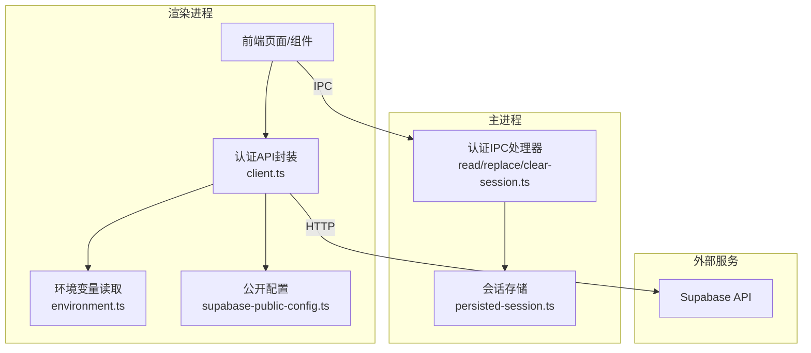
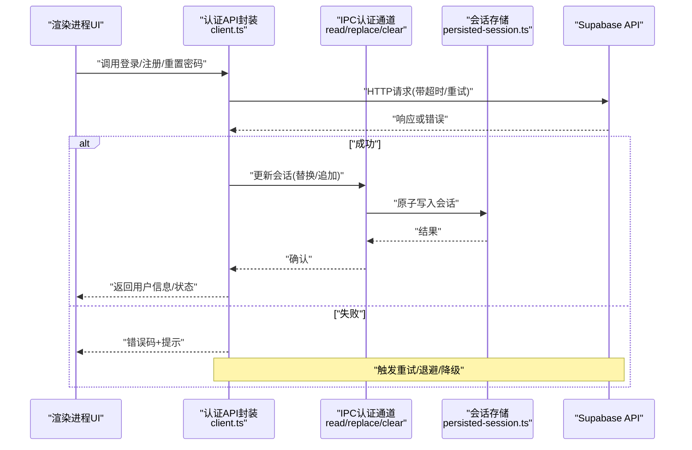
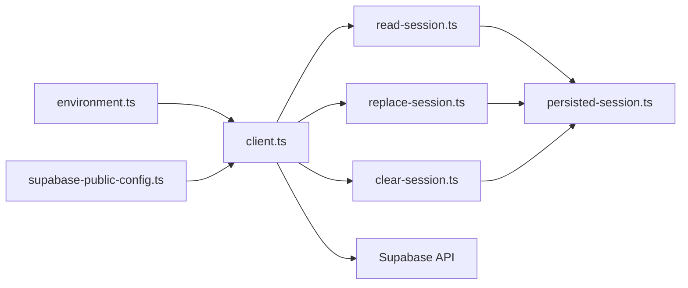

# Supabase集成

<cite>
**本文引用的文件**   
- [apps/desktop/src/shared/config/supabase-public-config.ts](file://apps/desktop/src/shared/config/supabase-public-config.ts)
- [apps/desktop/src/features/authentication/api/client.ts](file://apps/desktop/src/features/authentication/api/client.ts)
- [apps/desktop/src/features/authentication/api/environment.ts](file://apps/desktop/src/features/authentication/api/environment.ts)
- [apps/desktop/src/features/authentication/session/persisted-session.ts](file://apps/desktop/src/features/authentication/session/persisted-session.ts)
- [apps/desktop/src/main/ipc/authentication/clear-session.ts](file://apps/desktop/src/main/ipc/authentication/clear-session.ts)
- [apps/desktop/src/main/ipc/authentication/read-session.ts](file://apps/desktop/src/main/ipc/authentication/read-session.ts)
- [apps/desktop/src/main/ipc/authentication/replace-session.ts](file://apps/desktop/src/main/ipc/authentication/replace-session.ts)
- [apps/desktop/tests/auth/configuration.spec.ts](file://apps/desktop/tests/auth/configuration.spec.ts)
- [apps/desktop/tests/auth/public-config-policy.spec.ts](file://apps/desktop/tests/auth/public-config-policy.spec.ts)
- [apps/desktop/tests/auth/session-persistence.spec.ts](file://apps/desktop/tests/auth/session-persistence.spec.ts)
</cite>

## 目录
1. [简介](#简介)
2. [项目结构](#项目结构)
3. [核心组件](#核心组件)
4. [架构总览](#架构总览)
5. [详细组件分析](#详细组件分析)
6. [依赖分析](#依赖分析)
7. [性能考虑](#性能考虑)
8. [故障排查指南](#故障排查指南)
9. [结论](#结论)
10. [附录](#附录)

## 简介
本文件面向nevix-ai的Supabase集成模块，聚焦于客户端配置与环境变量管理、认证API封装、错误处理与重试策略、安全注入与生产环境最佳实践，以及性能监控、日志与调试。文档以“渐进式复杂度”组织，既适合初学者快速上手，也便于资深开发者深入定位问题与优化性能。

## 项目结构
Supabase相关代码主要位于桌面端应用内：
- 共享配置层：提供公共可暴露的配置项（如SUPABASE_URL）与读取逻辑
- 认证API层：封装HTTP请求（注册、登录、密码重置、会话管理）
- 会话持久化层：在Electron主进程侧读写会话状态
- IPC通道：渲染进程通过IPC调用主进程能力，完成会话读取、替换与清理
- 测试用例：覆盖配置校验、公开配置策略与会话持久化行为

图表来源
- [apps/desktop/src/features/authentication/api/client.ts](file://apps/desktop/src/features/authentication/api/client.ts)
- [apps/desktop/src/features/authentication/api/environment.ts](file://apps/desktop/src/features/authentication/api/environment.ts)
- [apps/desktop/src/shared/config/supabase-public-config.ts](file://apps/desktop/src/shared/config/supabase-public-config.ts)
- [apps/desktop/src/main/ipc/authentication/read-session.ts](file://apps/desktop/src/main/ipc/authentication/read-session.ts)
- [apps/desktop/src/main/ipc/authentication/replace-session.ts](file://apps/desktop/src/main/ipc/authentication/replace-session.ts)
- [apps/desktop/src/main/ipc/authentication/clear-session.ts](file://apps/desktop/src/main/ipc/authentication/clear-session.ts)
- [apps/desktop/src/features/authentication/session/persisted-session.ts](file://apps/desktop/src/features/authentication/session/persisted-session.ts)

章节来源
- [apps/desktop/src/shared/config/supabase-public-config.ts](file://apps/desktop/src/shared/config/supabase-public-config.ts)
- [apps/desktop/src/features/authentication/api/client.ts](file://apps/desktop/src/features/authentication/api/client.ts)
- [apps/desktop/src/features/authentication/api/environment.ts](file://apps/desktop/src/features/authentication/api/environment.ts)
- [apps/desktop/src/main/ipc/authentication/read-session.ts](file://apps/desktop/src/main/ipc/authentication/read-session.ts)
- [apps/desktop/src/main/ipc/authentication/replace-session.ts](file://apps/desktop/src/main/ipc/authentication/replace-session.ts)
- [apps/desktop/src/main/ipc/authentication/clear-session.ts](file://apps/desktop/src/main/ipc/authentication/clear-session.ts)
- [apps/desktop/src/features/authentication/session/persisted-session.ts](file://apps/desktop/src/features/authentication/session/persisted-session.ts)

## 核心组件
- 公开配置（Public Config）
  - 职责：仅暴露非敏感参数（如SUPABASE_URL），避免将密钥泄露到渲染进程
  - 关键点：严格白名单过滤、类型校验、缺失时给出明确错误
- 环境变量读取（Environment）
  - 职责：集中读取构建期或运行期环境变量，区分开发/测试/生产环境
  - 关键点：默认值、类型转换、缺失保护、不可变导出
- 认证API封装（Client）
  - 职责：封装用户注册、登录、密码重置、会话管理等HTTP调用
  - 关键点：统一请求头、错误映射、重试退避、超时控制、取消令牌
- 会话持久化（Persisted Session）
  - 职责：在主进程侧安全地读写会话数据（如access_token、refresh_token、过期时间）
  - 关键点：原子写入、权限最小化、序列化安全、清理策略
- IPC认证通道
  - 职责：为渲染进程提供安全的会话读取、替换与清理接口
  - 关键点：发送者校验、最小权限、错误回传、审计日志

章节来源
- [apps/desktop/src/shared/config/supabase-public-config.ts](file://apps/desktop/src/shared/config/supabase-public-config.ts)
- [apps/desktop/src/features/authentication/api/environment.ts](file://apps/desktop/src/features/authentication/api/environment.ts)
- [apps/desktop/src/features/authentication/api/client.ts](file://apps/desktop/src/features/authentication/api/client.ts)
- [apps/desktop/src/features/authentication/session/persisted-session.ts](file://apps/desktop/src/features/authentication/session/persisted-session.ts)
- [apps/desktop/src/main/ipc/authentication/read-session.ts](file://apps/desktop/src/main/ipc/authentication/read-session.ts)
- [apps/desktop/src/main/ipc/authentication/replace-session.ts](file://apps/desktop/src/main/ipc/authentication/replace-session.ts)
- [apps/desktop/src/main/ipc/authentication/clear-session.ts](file://apps/desktop/src/main/ipc/authentication/clear-session.ts)

## 架构总览
下图展示了从渲染进程发起认证操作到Supabase服务的完整流程，包括IPC桥接、主进程会话管理与网络异常恢复。

图表来源
- [apps/desktop/src/features/authentication/api/client.ts](file://apps/desktop/src/features/authentication/api/client.ts)
- [apps/desktop/src/main/ipc/authentication/read-session.ts](file://apps/desktop/src/main/ipc/authentication/read-session.ts)
- [apps/desktop/src/main/ipc/authentication/replace-session.ts](file://apps/desktop/src/main/ipc/authentication/replace-session.ts)
- [apps/desktop/src/main/ipc/authentication/clear-session.ts](file://apps/desktop/src/main/ipc/authentication/clear-session.ts)
- [apps/desktop/src/features/authentication/session/persisted-session.ts](file://apps/desktop/src/features/authentication/session/persisted-session.ts)

## 详细组件分析

### 公开配置（Public Config）
- 设计要点
  - 仅暴露非敏感字段（例如SUPABASE_URL），禁止暴露任何密钥
  - 对每个字段进行存在性与格式校验，缺失时抛出明确错误
  - 使用只读对象导出，防止运行时篡改
- 典型用法
  - 在认证API初始化前加载，确保所有必需参数可用
  - 结合环境变量读取器，实现多环境切换
- 安全建议
  - 永远不要将SUPABASE_ANON_KEY等密钥放入公开配置
  - 在打包产物中检查是否包含敏感键

章节来源
- [apps/desktop/src/shared/config/supabase-public-config.ts](file://apps/desktop/src/shared/config/supabase-public-config.ts)
- [apps/desktop/tests/auth/public-config-policy.spec.ts](file://apps/desktop/tests/auth/public-config-policy.spec.ts)

### 环境变量读取（Environment）
- 设计要点
  - 集中管理不同环境的变量（开发、测试、生产）
  - 提供类型安全的访问器与默认值
  - 支持构建期注入与运行期覆盖
- 关键行为
  - 缺失必要变量时立即失败，避免静默错误
  - 对URL、端口、超时等数值型字段进行范围校验
- 最佳实践
  - 使用.env.*文件配合构建工具注入
  - 在生产环境中通过安全渠道（如密钥管理服务）注入

章节来源
- [apps/desktop/src/features/authentication/api/environment.ts](file://apps/desktop/src/features/authentication/api/environment.ts)
- [apps/desktop/tests/auth/configuration.spec.ts](file://apps/desktop/tests/auth/configuration.spec.ts)

### 认证API封装（Client）
- 功能范围
  - 用户注册、邮箱登录、密码重置、会话获取与刷新
  - 统一的请求拦截器（添加鉴权头、追踪ID、超时控制）
  - 错误映射（网络错误、业务错误、限流错误）
- 重试与退避
  - 针对瞬时错误（网络抖动、5xx）实施指数退避重试
  - 对限流（429）采用随机抖动避免雪崩
  - 最大重试次数与退避上限可配置
- 超时与取消
  - 每个请求设置合理超时，避免资源泄漏
  - 组件卸载时取消未完成的请求
- 示例路径（不含代码内容）
  - 初始化客户端与基础URL
  - 登录/注册/重置密码函数
  - 会话刷新与自动重连逻辑

章节来源
- [apps/desktop/src/features/authentication/api/client.ts](file://apps/desktop/src/features/authentication/api/client.ts)

### 会话持久化（Persisted Session）
- 设计要点
  - 在主进程侧维护会话状态，避免渲染进程直接访问敏感数据
  - 原子写入与幂等更新，保证一致性
  - 支持过期时间判断与自动清理
- 数据结构
  - access_token、refresh_token、expires_at、user_id等
  - 序列化为安全格式并限制访问权限
- 生命周期
  - 登录成功后写入
  - 刷新成功后更新
  - 登出或过期后清理

章节来源
- [apps/desktop/src/features/authentication/session/persisted-session.ts](file://apps/desktop/src/features/authentication/session/persisted-session.ts)
- [apps/desktop/tests/auth/session-persistence.spec.ts](file://apps/desktop/tests/auth/session-persistence.spec.ts)

### IPC认证通道（Read/Replace/Clear）
- 职责划分
  - read-session：安全读取当前会话摘要（不含敏感明文）
  - replace-session：原子替换会话（用于刷新或登录）
  - clear-session：清理会话并释放资源
- 安全机制
  - 发送者身份校验（trusted-sender）
  - 最小权限原则（仅暴露必要方法）
  - 错误回传与审计日志
- 调用流程
  - 渲染进程通过IPC调用主进程方法
  - 主进程验证后执行会话操作并返回结果

章节来源
- [apps/desktop/src/main/ipc/authentication/read-session.ts](file://apps/desktop/src/main/ipc/authentication/read-session.ts)
- [apps/desktop/src/main/ipc/authentication/replace-session.ts](file://apps/desktop/src/main/ipc/authentication/replace-session.ts)
- [apps/desktop/src/main/ipc/authentication/clear-session.ts](file://apps/desktop/src/main/ipc/authentication/clear-session.ts)

## 依赖分析
Supabase集成模块的依赖关系如下：
- 认证API封装依赖环境变量读取与公开配置
- IPC通道依赖会话持久化
- 渲染进程通过IPC与主进程交互，不直接访问会话存储
- 所有HTTP请求最终指向Supabase API

图表来源
- [apps/desktop/src/features/authentication/api/environment.ts](file://apps/desktop/src/features/authentication/api/environment.ts)
- [apps/desktop/src/shared/config/supabase-public-config.ts](file://apps/desktop/src/shared/config/supabase-public-config.ts)
- [apps/desktop/src/features/authentication/api/client.ts](file://apps/desktop/src/features/authentication/api/client.ts)
- [apps/desktop/src/main/ipc/authentication/read-session.ts](file://apps/desktop/src/main/ipc/authentication/read-session.ts)
- [apps/desktop/src/main/ipc/authentication/replace-session.ts](file://apps/desktop/src/main/ipc/authentication/replace-session.ts)
- [apps/desktop/src/main/ipc/authentication/clear-session.ts](file://apps/desktop/src/main/ipc/authentication/clear-session.ts)
- [apps/desktop/src/features/authentication/session/persisted-session.ts](file://apps/desktop/src/features/authentication/session/persisted-session.ts)

## 性能考虑
- 连接池与复用
  - 复用HTTP客户端实例，减少握手开销
  - 合理设置连接超时与空闲超时
- 重试与退避
  - 对瞬时错误启用指数退避，避免加重服务器压力
  - 对限流错误加入随机抖动，分散峰值
- 缓存策略
  - 对非敏感元数据（如用户基本信息）进行短期缓存
  - 会话刷新前检查过期时间，避免无效请求
- 监控与指标
  - 记录请求耗时、成功率、错误分类
  - 上报关键事件（登录成功、失败原因、重试次数）

[本节为通用指导，无需特定文件引用]

## 故障排查指南
- 连接超时
  - 检查网络连通性与代理设置
  - 调整超时阈值与重试策略
  - 查看Supabase服务状态
- 权限错误
  - 核对公开配置是否包含必要字段
  - 检查Supabase项目的RLS策略与API密钥权限
  - 确认用户角色与资源访问规则
- API限流
  - 观察429错误频率与模式
  - 降低请求速率，增加退避间隔
  - 启用批量请求与缓存减少重复调用
- 会话异常
  - 检查会话过期时间与刷新逻辑
  - 验证IPC通道的权限与错误回传
  - 清理损坏的会话文件并重试登录

章节来源
- [apps/desktop/tests/auth/configuration.spec.ts](file://apps/desktop/tests/auth/configuration.spec.ts)
- [apps/desktop/tests/auth/public-config-policy.spec.ts](file://apps/desktop/tests/auth/public-config-policy.spec.ts)
- [apps/desktop/tests/auth/session-persistence.spec.ts](file://apps/desktop/tests/auth/session-persistence.spec.ts)

## 结论
本模块通过分层设计与严格的安全边界，实现了可靠的Supabase集成。公开配置与环境变量管理确保了多环境适配与安全性；认证API封装提供了健壮的网络交互与错误恢复；IPC与会话持久化保障了敏感数据的主进程隔离。结合性能优化与监控手段，可在生产环境中稳定运行。

[本节为总结性内容，无需特定文件引用]

## 附录
- 初始化Supabase客户端步骤
  - 加载环境变量与公开配置
  - 创建认证API客户端实例
  - 订阅会话变化事件
- 处理认证回调
  - 监听登录/注册/重置密码结果
  - 更新UI状态与导航
  - 处理错误与重试
- 实现自动重连
  - 检测网络状态变化
  - 触发会话刷新与请求重试
  - 记录重连统计与告警

[本节为概念性说明，无需特定文件引用]