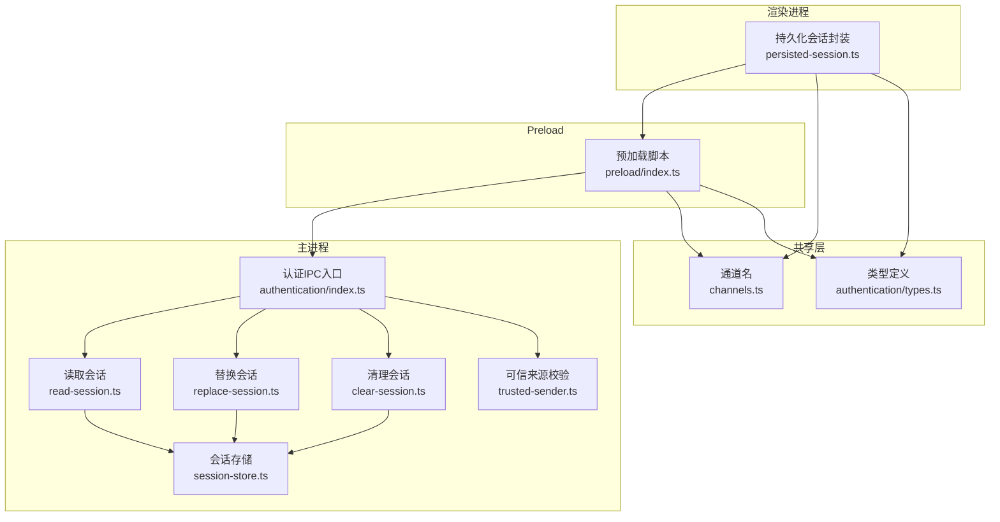
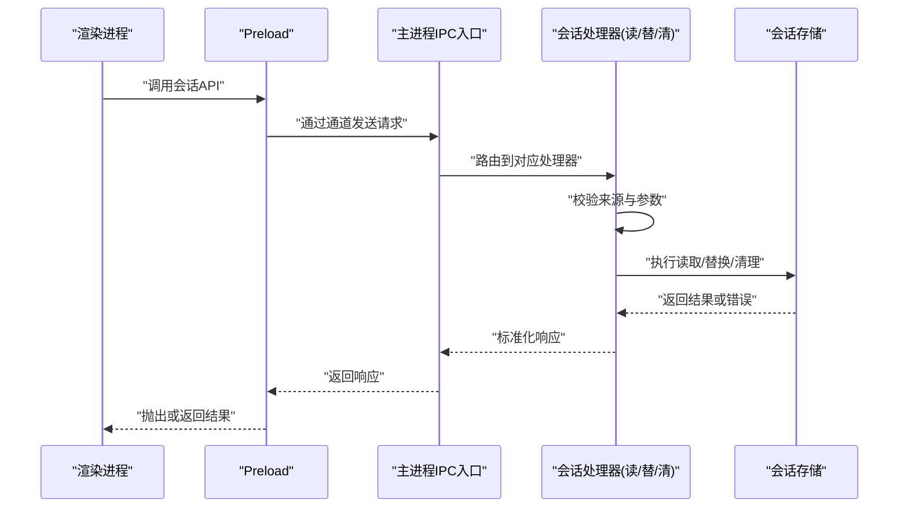
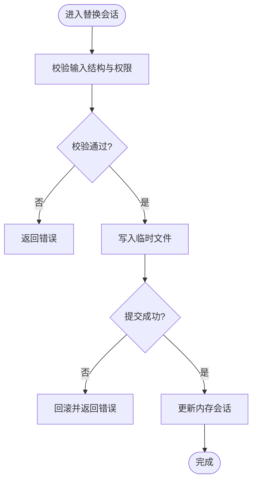
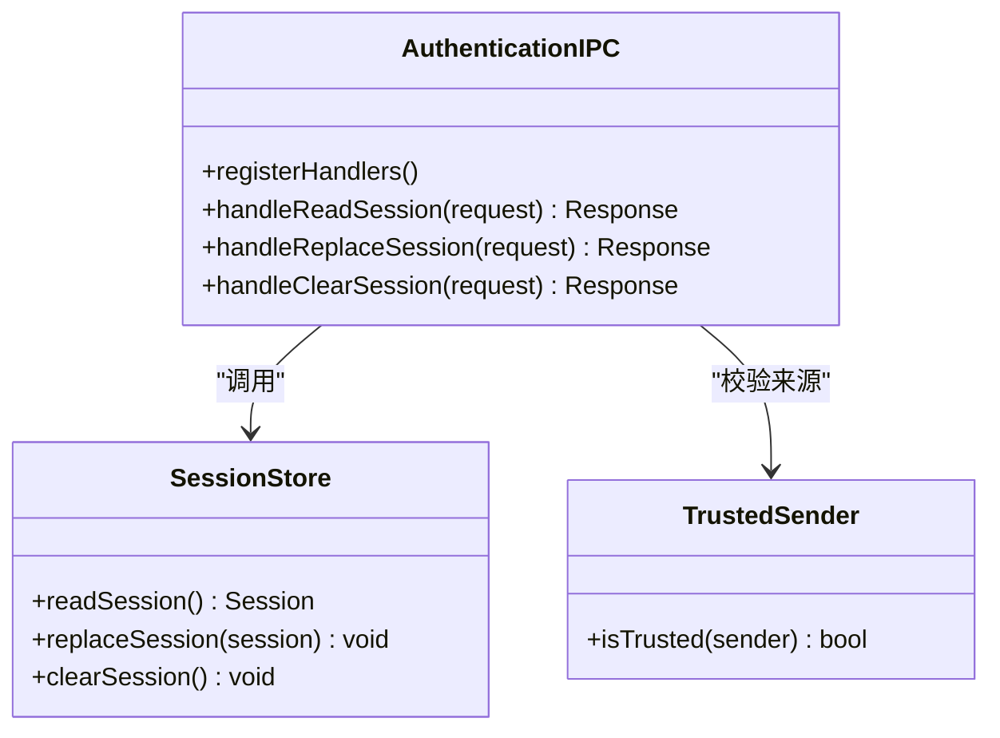
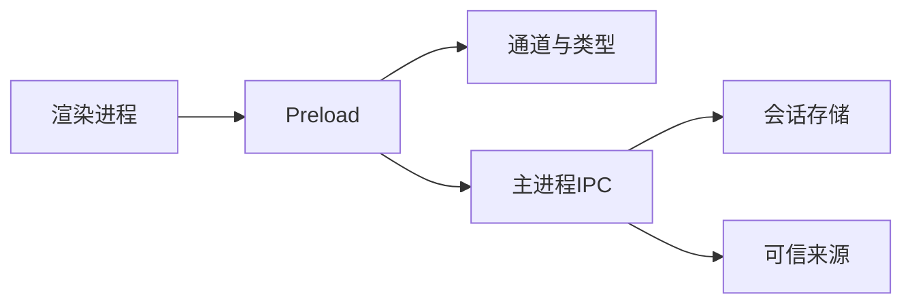

# 会话管理

<cite>
**本文引用的文件**   
- [apps/desktop/src/main/authentication/session-store.ts](file://apps/desktop/src/main/authentication/session-store.ts)
- [apps/desktop/src/main/ipc/authentication/index.ts](file://apps/desktop/src/main/ipc/authentication/index.ts)
- [apps/desktop/src/main/ipc/authentication/clear-session.ts](file://apps/desktop/src/main/ipc/authentication/clear-session.ts)
- [apps/desktop/src/main/ipc/authentication/read-session.ts](file://apps/desktop/src/main/ipc/authentication/read-session.ts)
- [apps/desktop/src/main/ipc/authentication/replace-session.ts](file://apps/desktop/src/main/ipc/authentication/replace-session.ts)
- [apps/desktop/src/main/ipc/authentication/trusted-sender.ts](file://apps/desktop/src/main/ipc/authentication/trusted-sender.ts)
- [apps/desktop/src/preload/index.ts](file://apps/desktop/src/preload/index.ts)
- [apps/desktop/src/shared/ipc/channels.ts](file://apps/desktop/src/shared/ipc/channels.ts)
- [apps/desktop/src/shared/ipc/authentication/types.ts](file://apps/desktop/src/shared/ipc/authentication/types.ts)
- [apps/desktop/src/renderer/src/features/authentication/session/persisted-session.ts](file://apps/desktop/src/renderer/src/features/authentication/session/persisted-session.ts)
- [apps/desktop/tests/auth/session-persistence.spec.ts](file://apps/desktop/tests/auth/session-persistence.spec.ts)
</cite>

## 目录
1. [简介](#简介)
2. [项目结构](#项目结构)
3. [核心组件](#核心组件)
4. [架构总览](#架构总览)
5. [详细组件分析](#详细组件分析)
6. [依赖关系分析](#依赖关系分析)
7. [性能考虑](#性能考虑)
8. [故障排查指南](#故障排查指南)
9. [结论](#结论)
10. [附录](#附录)

## 简介
本文件面向 nevix-ai 桌面端（Electron）的会话管理系统，聚焦主进程与渲染进程之间的会话存储、持久化、内存管理与安全机制。文档覆盖：
- 会话数据的持久化策略与存储位置
- 会话生命周期管理（创建、更新、验证、销毁）
- IPC 协议定义、数据传输格式与安全校验
- 跨进程状态同步、冲突解决与一致性保证
- 实际使用示例路径（初始化、过期处理、错误恢复）
- 调试工具与性能优化建议
- 常见问题与内存泄漏风险规避

## 项目结构
本项目采用 Electron 多进程架构，会话相关代码主要分布在以下模块：
- 主进程：会话存储实现、IPC 处理器、可信来源校验
- Preload：暴露安全的 API 给渲染进程
- 共享层：IPC 通道名与类型定义
- 渲染进程：会话持久化封装与业务调用
- 测试：会话持久化与边界行为验证

图表来源
- [apps/desktop/src/main/authentication/session-store.ts](file://apps/desktop/src/main/authentication/session-store.ts)
- [apps/desktop/src/main/ipc/authentication/index.ts](file://apps/desktop/src/main/ipc/authentication/index.ts)
- [apps/desktop/src/main/ipc/authentication/read-session.ts](file://apps/desktop/src/main/ipc/authentication/read-session.ts)
- [apps/desktop/src/main/ipc/authentication/replace-session.ts](file://apps/desktop/src/main/ipc/authentication/replace-session.ts)
- [apps/desktop/src/main/ipc/authentication/clear-session.ts](file://apps/desktop/src/main/ipc/authentication/clear-session.ts)
- [apps/desktop/src/main/ipc/authentication/trusted-sender.ts](file://apps/desktop/src/main/ipc/authentication/trusted-sender.ts)
- [apps/desktop/src/preload/index.ts](file://apps/desktop/src/preload/index.ts)
- [apps/desktop/src/shared/ipc/channels.ts](file://apps/desktop/src/shared/ipc/channels.ts)
- [apps/desktop/src/shared/ipc/authentication/types.ts](file://apps/desktop/src/shared/ipc/authentication/types.ts)
- [apps/desktop/src/renderer/src/features/authentication/session/persisted-session.ts](file://apps/desktop/src/renderer/src/features/authentication/session/persisted-session.ts)

章节来源
- [apps/desktop/src/main/authentication/session-store.ts](file://apps/desktop/src/main/authentication/session-store.ts)
- [apps/desktop/src/main/ipc/authentication/index.ts](file://apps/desktop/src/main/ipc/authentication/index.ts)
- [apps/desktop/src/shared/ipc/channels.ts](file://apps/desktop/src/shared/ipc/channels.ts)
- [apps/desktop/src/shared/ipc/authentication/types.ts](file://apps/desktop/src/shared/ipc/authentication/types.ts)
- [apps/desktop/src/preload/index.ts](file://apps/desktop/src/preload/index.ts)
- [apps/desktop/src/renderer/src/features/authentication/session/persisted-session.ts](file://apps/desktop/src/renderer/src/features/authentication/session/persisted-session.ts)

## 核心组件
- 会话存储（主进程）
  - 职责：维护当前会话对象、提供读写接口、负责持久化与内存管理
  - 关键点：线程安全访问、序列化/反序列化、失败回滚、版本兼容
- IPC 处理器（主进程）
  - 职责：注册并处理来自渲染进程的会话操作请求，执行权限校验与参数校验
  - 关键点：严格白名单通道、可信来源校验、错误码规范
- Preload 桥接（预加载）
  - 职责：将受限的 Node/Electron API 暴露为安全方法，屏蔽危险能力
  - 关键点：最小权限原则、方法签名稳定、错误透传
- 共享类型与通道（共享层）
  - 职责：统一定义 IPC 通道名、请求/响应数据结构
  - 关键点：前后端一致、向后兼容、严格类型约束
- 渲染进程会话封装（渲染进程）
  - 职责：封装会话生命周期调用、本地缓存、重试与降级
  - 关键点：幂等性、超时控制、异常捕获与用户提示

章节来源
- [apps/desktop/src/main/authentication/session-store.ts](file://apps/desktop/src/main/authentication/session-store.ts)
- [apps/desktop/src/main/ipc/authentication/index.ts](file://apps/desktop/src/main/ipc/authentication/index.ts)
- [apps/desktop/src/preload/index.ts](file://apps/desktop/src/preload/index.ts)
- [apps/desktop/src/shared/ipc/channels.ts](file://apps/desktop/src/shared/ipc/channels.ts)
- [apps/desktop/src/shared/ipc/authentication/types.ts](file://apps/desktop/src/shared/ipc/authentication/types.ts)
- [apps/desktop/src/renderer/src/features/authentication/session/persisted-session.ts](file://apps/desktop/src/renderer/src/features/authentication/session/persisted-session.ts)

## 架构总览
下图展示了从渲染进程发起会话操作到主进程存储的完整流程，包括安全校验、数据持久化与返回结果。

图表来源
- [apps/desktop/src/main/ipc/authentication/index.ts](file://apps/desktop/src/main/ipc/authentication/index.ts)
- [apps/desktop/src/main/ipc/authentication/read-session.ts](file://apps/desktop/src/main/ipc/authentication/read-session.ts)
- [apps/desktop/src/main/ipc/authentication/replace-session.ts](file://apps/desktop/src/main/ipc/authentication/replace-session.ts)
- [apps/desktop/src/main/ipc/authentication/clear-session.ts](file://apps/desktop/src/main/ipc/authentication/clear-session.ts)
- [apps/desktop/src/main/authentication/session-store.ts](file://apps/desktop/src/main/authentication/session-store.ts)
- [apps/desktop/src/preload/index.ts](file://apps/desktop/src/preload/index.ts)
- [apps/desktop/src/shared/ipc/channels.ts](file://apps/desktop/src/shared/ipc/channels.ts)

## 详细组件分析

### 会话存储（主进程）
- 设计要点
  - 单例模式：确保全局唯一会话实例，避免多副本不一致
  - 持久化策略：写入磁盘时采用原子写入（临时文件+重命名），失败回滚
  - 内存管理：会话对象在内存中保持最新；必要时惰性加载
  - 并发安全：读写加锁或队列化，防止竞态条件
  - 版本兼容：存储结构包含版本号，升级时进行迁移
- 关键接口
  - 读取会话：返回当前会话快照或空值
  - 替换会话：全量替换，带事务语义（成功或全部失败）
  - 清理会话：清空内存与磁盘，释放资源
- 错误处理
  - I/O 异常：记录日志、返回标准错误码
  - 数据损坏：尝试修复或回滚到上次有效快照
  - 权限不足：拒绝操作并上报审计事件

图表来源
- [apps/desktop/src/main/authentication/session-store.ts](file://apps/desktop/src/main/authentication/session-store.ts)

章节来源
- [apps/desktop/src/main/authentication/session-store.ts](file://apps/desktop/src/main/authentication/session-store.ts)

### IPC 认证入口与处理器
- 通道与类型
  - 通道名集中定义，避免硬编码
  - 请求/响应结构统一，便于校验与扩展
- 处理器职责
  - read-session：读取当前会话，支持可选字段过滤
  - replace-session：全量替换会话，要求强校验与幂等
  - clear-session：清理会话，触发资源回收
- 安全校验
  - trusted-sender：仅允许受信任的来源（如特定窗口/上下文）
  - 参数白名单：严格限制字段与类型，拒绝未知键
- 错误模型
  - 统一错误码与消息，便于前端展示与监控

图表来源
- [apps/desktop/src/main/ipc/authentication/index.ts](file://apps/desktop/src/main/ipc/authentication/index.ts)
- [apps/desktop/src/main/ipc/authentication/read-session.ts](file://apps/desktop/src/main/ipc/authentication/read-session.ts)
- [apps/desktop/src/main/ipc/authentication/replace-session.ts](file://apps/desktop/src/main/ipc/authentication/replace-session.ts)
- [apps/desktop/src/main/ipc/authentication/clear-session.ts](file://apps/desktop/src/main/ipc/authentication/clear-session.ts)
- [apps/desktop/src/main/ipc/authentication/trusted-sender.ts](file://apps/desktop/src/main/ipc/authentication/trusted-sender.ts)
- [apps/desktop/src/main/authentication/session-store.ts](file://apps/desktop/src/main/authentication/session-store.ts)

章节来源
- [apps/desktop/src/main/ipc/authentication/index.ts](file://apps/desktop/src/main/ipc/authentication/index.ts)
- [apps/desktop/src/main/ipc/authentication/read-session.ts](file://apps/desktop/src/main/ipc/authentication/read-session.ts)
- [apps/desktop/src/main/ipc/authentication/replace-session.ts](file://apps/desktop/src/main/ipc/authentication/replace-session.ts)
- [apps/desktop/src/main/ipc/authentication/clear-session.ts](file://apps/desktop/src/main/ipc/authentication/clear-session.ts)
- [apps/desktop/src/main/ipc/authentication/trusted-sender.ts](file://apps/desktop/src/main/ipc/authentication/trusted-sender.ts)

### Preload 桥接
- 职责
  - 暴露最小化的会话操作方法给渲染进程
  - 屏蔽 Node/Electron 敏感 API
  - 统一错误包装与重试策略
- 安全策略
  - 仅开放必要方法
  - 对传入参数进行二次校验
  - 限制调用频率与上下文

章节来源
- [apps/desktop/src/preload/index.ts](file://apps/desktop/src/preload/index.ts)
- [apps/desktop/src/shared/ipc/channels.ts](file://apps/desktop/src/shared/ipc/channels.ts)
- [apps/desktop/src/shared/ipc/authentication/types.ts](file://apps/desktop/src/shared/ipc/authentication/types.ts)

### 渲染进程会话封装
- 职责
  - 封装会话生命周期：初始化、刷新、过期检测、清理
  - 本地缓存与会话同步：优先内存，必要时落盘
  - 错误恢复：重试、降级、用户提示
- 最佳实践
  - 幂等调用：重复请求不产生副作用
  - 超时与取消：避免阻塞 UI
  - 可观测性：埋点与日志

章节来源
- [apps/desktop/src/renderer/src/features/authentication/session/persisted-session.ts](file://apps/desktop/src/renderer/src/features/authentication/session/persisted-session.ts)
- [apps/desktop/src/shared/ipc/channels.ts](file://apps/desktop/src/shared/ipc/channels.ts)
- [apps/desktop/src/shared/ipc/authentication/types.ts](file://apps/desktop/src/shared/ipc/authentication/types.ts)

### 测试与验收
- 会话持久化测试
  - 覆盖正常写入、读取、清理流程
  - 模拟 I/O 失败与数据损坏场景
  - 验证原子性与回滚行为

章节来源
- [apps/desktop/tests/auth/session-persistence.spec.ts](file://apps/desktop/tests/auth/session-persistence.spec.ts)

## 依赖关系分析
- 组件耦合
  - 渲染进程依赖 Preload 暴露的 API
  - Preload 依赖共享通道与类型定义
  - 主进程 IPC 处理器依赖会话存储与可信来源校验
- 外部依赖
  - 文件系统：用于持久化会话
  - 加密库（可选）：用于敏感字段加密
- 潜在循环依赖
  - 通过接口抽象与分层避免循环引用

图表来源
- [apps/desktop/src/shared/ipc/channels.ts](file://apps/desktop/src/shared/ipc/channels.ts)
- [apps/desktop/src/shared/ipc/authentication/types.ts](file://apps/desktop/src/shared/ipc/authentication/types.ts)
- [apps/desktop/src/preload/index.ts](file://apps/desktop/src/preload/index.ts)
- [apps/desktop/src/main/ipc/authentication/index.ts](file://apps/desktop/src/main/ipc/authentication/index.ts)
- [apps/desktop/src/main/authentication/session-store.ts](file://apps/desktop/src/main/authentication/session-store.ts)
- [apps/desktop/src/main/ipc/authentication/trusted-sender.ts](file://apps/desktop/src/main/ipc/authentication/trusted-sender.ts)

章节来源
- [apps/desktop/src/shared/ipc/channels.ts](file://apps/desktop/src/shared/ipc/channels.ts)
- [apps/desktop/src/shared/ipc/authentication/types.ts](file://apps/desktop/src/shared/ipc/authentication/types.ts)
- [apps/desktop/src/preload/index.ts](file://apps/desktop/src/preload/index.ts)
- [apps/desktop/src/main/ipc/authentication/index.ts](file://apps/desktop/src/main/ipc/authentication/index.ts)
- [apps/desktop/src/main/authentication/session-store.ts](file://apps/desktop/src/main/authentication/session-store.ts)
- [apps/desktop/src/main/ipc/authentication/trusted-sender.ts](file://apps/desktop/src/main/ipc/authentication/trusted-sender.ts)

## 性能考虑
- 减少 IPC 调用频率
  - 批量操作：合并多次会话更新
  - 本地缓存：短期命中内存，降低磁盘 IO
- 异步与非阻塞
  - 所有 I/O 操作异步化，避免阻塞主线程
  - 使用队列限流，防止突发流量
- 序列化优化
  - 仅传输必要字段
  - 压缩大对象（可选）
- 资源回收
  - 会话清理时释放句柄与监听器
  - 及时断开无用连接

[本节为通用指导，无需具体文件引用]

## 故障排查指南
- 常见问题
  - 会话不同步：检查 IPC 通道是否正确、Preload 是否被篡改
  - 持久化失败：确认磁盘权限、可用空间与原子写入逻辑
  - 内存泄漏：排查未释放的事件监听与定时器
- 调试建议
  - 启用详细日志：记录请求/响应与错误堆栈
  - 单元测试覆盖：模拟异常路径与边界条件
  - 性能剖析：定位慢调用与热点路径
- 恢复策略
  - 自动重试与退避
  - 回滚到上一版本会话
  - 用户引导重新登录

章节来源
- [apps/desktop/tests/auth/session-persistence.spec.ts](file://apps/desktop/tests/auth/session-persistence.spec.ts)
- [apps/desktop/src/main/ipc/authentication/trusted-sender.ts](file://apps/desktop/src/main/ipc/authentication/trusted-sender.ts)

## 结论
nevix-ai 的会话管理通过清晰的分层与严格的 IPC 安全策略，实现了跨进程会话的一致性与安全性。建议在后续迭代中持续完善错误恢复、可观测性与性能监控，确保在高负载与异常场景下的稳定性。

[本节为总结，无需具体文件引用]

## 附录
- 使用示例路径
  - 初始化会话：参考渲染进程封装中的初始化流程
  - 处理过期：在渲染侧监听过期事件并触发刷新
  - 错误恢复：捕获 IPC 错误并执行重试或降级
- 最佳实践清单
  - 始终通过 Preload 暴露的方法访问会话
  - 对敏感字段进行加密存储
  - 使用幂等接口避免重复副作用
  - 定期清理不再使用的监听器与缓存

[本节为补充信息，无需具体文件引用]