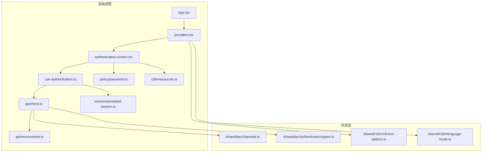
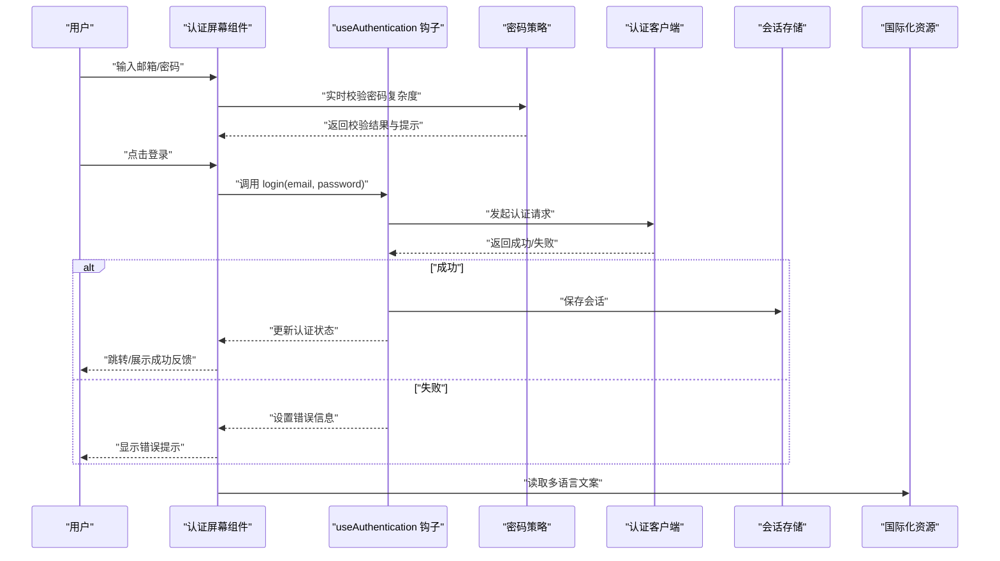
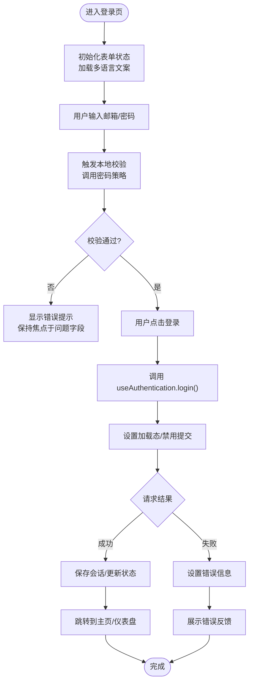
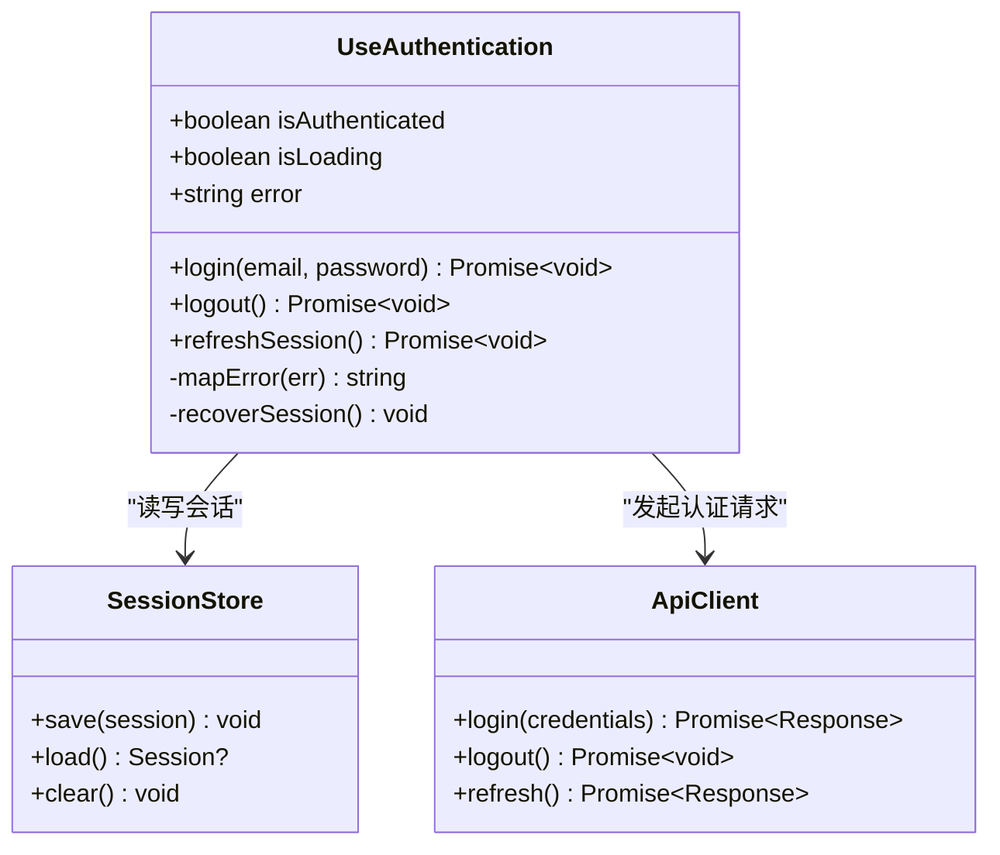
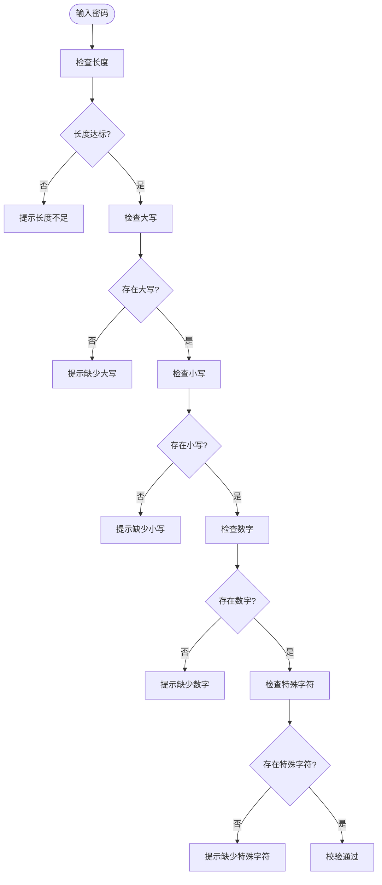
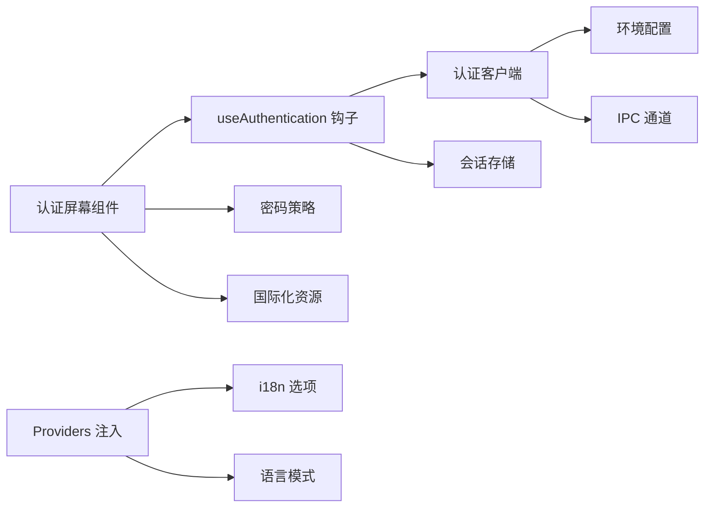

# 认证界面组件

<cite>
**本文档引用的文件**   
- [authentication-screen.tsx](file://apps/desktop/src/renderer/src/features/authentication/components/authentication-screen.tsx)
- [use-authentication.ts](file://apps/desktop/src/renderer/src/features/authentication/hooks/use-authentication.ts)
- [password.ts](file://apps/desktop/src/renderer/src/features/authentication/policy/password.ts)
- [client.ts](file://apps/desktop/src/renderer/src/features/authentication/api/client.ts)
- [environment.ts](file://apps/desktop/src/renderer/src/features/authentication/api/environment.ts)
- [persisted-session.ts](file://apps/desktop/src/renderer/src/features/authentication/session/persisted-session.ts)
- [resources.ts](file://apps/desktop/src/renderer/src/features/authentication/i18n/resources.ts)
- [providers.tsx](file://apps/desktop/src/renderer/src/app/providers.tsx)
- [App.tsx](file://apps/desktop/src/renderer/src/app/App.tsx)
- [i18next-options.ts](file://apps/desktop/src/shared/i18n/i18next-options.ts)
- [language-mode.ts](file://apps/desktop/src/shared/i18n/language-mode.ts)
- [channels.ts](file://apps/desktop/src/shared/ipc/channels.ts)
- [types.ts](file://apps/desktop/src/shared/ipc/authentication/types.ts)
- [electron-security.spec.ts](file://apps/desktop/tests/auth/electron-security.spec.ts)
- [login-boundary.spec.ts](file://apps/desktop/tests/auth/login-boundary.spec.ts)
- [session-persistence.spec.ts](file://apps/desktop/tests/auth/session-persistence.spec.ts)
</cite>

## 目录
1. [简介](#简介)
2. [项目结构](#项目结构)
3. [核心组件](#核心组件)
4. [架构总览](#架构总览)
5. [详细组件分析](#详细组件分析)
6. [依赖关系分析](#依赖关系分析)
7. [性能考虑](#性能考虑)
8. [故障排查指南](#故障排查指南)
9. [结论](#结论)
10. [附录](#附录)

## 简介
本文件为 nevix-ai 桌面应用中的“认证界面组件”提供系统化文档。重点覆盖登录界面的 React 组件架构、表单验证与用户交互、状态管理、密码策略验证规则（复杂度检查、安全性要求、实时反馈）、useAuthentication 钩子的使用方式（认证状态监听、错误处理、异步操作管理），以及可访问性、国际化集成与响应式设计。同时给出自定义认证流程、第三方登录扩展和用户反馈处理的实践建议，并附带 UI 测试指南与用户体验优化建议，帮助团队快速定位和解决界面卡顿、表单验证错误与输入安全问题。

## 项目结构
认证功能位于 apps/desktop/src/renderer/src/features/authentication 下，采用“特性切片”组织：
- components: 认证屏幕组件（登录/注册等）
- hooks: useAuthentication 钩子，封装认证状态与动作
- policy: 密码策略校验逻辑
- api: 认证客户端与环境配置
- session: 会话持久化
- i18n: 认证相关文案资源

渲染入口通过 App 与 providers 注入 i18n 与上下文，认证界面作为页面级组件挂载。

图表来源
- [App.tsx](file://apps/desktop/src/renderer/src/app/App.tsx)
- [providers.tsx](file://apps/desktop/src/renderer/src/app/providers.tsx)
- [authentication-screen.tsx](file://apps/desktop/src/renderer/src/features/authentication/components/authentication-screen.tsx)
- [use-authentication.ts](file://apps/desktop/src/renderer/src/features/authentication/hooks/use-authentication.ts)
- [client.ts](file://apps/desktop/src/renderer/src/features/authentication/api/client.ts)
- [environment.ts](file://apps/desktop/src/renderer/src/features/authentication/api/environment.ts)
- [persisted-session.ts](file://apps/desktop/src/renderer/src/features/authentication/session/persisted-session.ts)
- [password.ts](file://apps/desktop/src/renderer/src/features/authentication/policy/password.ts)
- [resources.ts](file://apps/desktop/src/renderer/src/features/authentication/i18n/resources.ts)
- [i18next-options.ts](file://apps/desktop/src/shared/i18n/i18next-options.ts)
- [language-mode.ts](file://apps/desktop/src/shared/i18n/language-mode.ts)
- [channels.ts](file://apps/desktop/src/shared/ipc/channels.ts)
- [types.ts](file://apps/desktop/src/shared/ipc/authentication/types.ts)

章节来源
- [App.tsx](file://apps/desktop/src/renderer/src/app/App.tsx)
- [providers.tsx](file://apps/desktop/src/renderer/src/app/providers.tsx)
- [authentication-screen.tsx](file://apps/desktop/src/renderer/src/features/authentication/components/authentication-screen.tsx)
- [use-authentication.ts](file://apps/desktop/src/renderer/src/features/authentication/hooks/use-authentication.ts)
- [client.ts](file://apps/desktop/src/renderer/src/features/authentication/api/client.ts)
- [environment.ts](file://apps/desktop/src/renderer/src/features/authentication/api/environment.ts)
- [persisted-session.ts](file://apps/desktop/src/renderer/src/features/authentication/session/persisted-session.ts)
- [password.ts](file://apps/desktop/src/renderer/src/features/authentication/policy/password.ts)
- [resources.ts](file://apps/desktop/src/renderer/src/features/authentication/i18n/resources.ts)
- [i18next-options.ts](file://apps/desktop/src/shared/i18n/i18next-options.ts)
- [language-mode.ts](file://apps/desktop/src/shared/i18n/language-mode.ts)
- [channels.ts](file://apps/desktop/src/shared/ipc/channels.ts)
- [types.ts](file://apps/desktop/src/shared/ipc/authentication/types.ts)

## 核心组件
- 认证屏幕组件（登录/注册）：负责表单渲染、用户交互、本地校验与错误提示、调用 useAuthentication 执行认证流程。
- useAuthentication 钩子：集中管理认证状态（是否已认证、加载态、错误信息）、封装登录/登出/刷新等异步操作，并与 IPC 或 API 客户端交互。
- 密码策略模块：定义密码复杂度与安全规则，提供同步校验函数供表单实时反馈。
- 认证客户端与环境：封装网络请求、错误映射、环境变量注入。
- 会话持久化：在渲染进程侧缓存会话令牌与元数据，支持自动恢复。
- 国际化资源：按语言键值组织认证相关文案，配合 i18n 选项与语言模式切换。

章节来源
- [authentication-screen.tsx](file://apps/desktop/src/renderer/src/features/authentication/components/authentication-screen.tsx)
- [use-authentication.ts](file://apps/desktop/src/renderer/src/features/authentication/hooks/use-authentication.ts)
- [password.ts](file://apps/desktop/src/renderer/src/features/authentication/policy/password.ts)
- [client.ts](file://apps/desktop/src/renderer/src/features/authentication/api/client.ts)
- [environment.ts](file://apps/desktop/src/renderer/src/features/authentication/api/environment.ts)
- [persisted-session.ts](file://apps/desktop/src/renderer/src/features/authentication/session/persisted-session.ts)
- [resources.ts](file://apps/desktop/src/renderer/src/features/authentication/i18n/resources.ts)

## 架构总览
认证界面采用分层设计：UI 层（React 组件）→ 状态层（useAuthentication 钩子）→ 业务策略层（密码策略）→ 数据层（API 客户端/IPC → 主进程/后端）。会话在渲染进程持久化，i18n 贯穿全链路。

图表来源
- [authentication-screen.tsx](file://apps/desktop/src/renderer/src/features/authentication/components/authentication-screen.tsx)
- [use-authentication.ts](file://apps/desktop/src/renderer/src/features/authentication/hooks/use-authentication.ts)
- [password.ts](file://apps/desktop/src/renderer/src/features/authentication/policy/password.ts)
- [client.ts](file://apps/desktop/src/renderer/src/features/authentication/api/client.ts)
- [persisted-session.ts](file://apps/desktop/src/renderer/src/features/authentication/session/persisted-session.ts)
- [resources.ts](file://apps/desktop/src/renderer/src/features/authentication/i18n/resources.ts)

## 详细组件分析

### 认证屏幕组件（登录/注册）
- 职责：渲染表单、绑定输入、触发本地校验、调用 useAuthentication 执行认证、展示错误与成功反馈、支持多语言文案与无障碍属性。
- 关键实现要点：
  - 表单字段：邮箱、密码（可选：验证码/二次验证）
  - 本地校验：必填、格式、长度、特殊字符限制
  - 实时反馈：基于密码策略的即时提示
  - 交互：提交防抖/节流、禁用按钮在加载中
  - 可访问性：aria-label、role、键盘导航、焦点管理
  - 国际化：通过 i18n 资源键获取文案
  - 响应式：移动端适配布局与触控友好

图表来源
- [authentication-screen.tsx](file://apps/desktop/src/renderer/src/features/authentication/components/authentication-screen.tsx)
- [password.ts](file://apps/desktop/src/renderer/src/features/authentication/policy/password.ts)
- [use-authentication.ts](file://apps/desktop/src/renderer/src/features/authentication/hooks/use-authentication.ts)

章节来源
- [authentication-screen.tsx](file://apps/desktop/src/renderer/src/features/authentication/components/authentication-screen.tsx)
- [password.ts](file://apps/desktop/src/renderer/src/features/authentication/policy/password.ts)

### useAuthentication 钩子
- 职责：管理认证状态（isAuthenticated、isLoading、error）、封装登录/登出/刷新等操作、处理错误映射与重试策略、维护会话生命周期。
- 关键能力：
  - 状态监听：订阅认证状态变化，驱动 UI 重渲染
  - 错误处理：统一错误类型映射、用户可读消息
  - 异步管理：请求去抖、取消、超时控制
  - 会话管理：从持久化存储恢复、失效清理
  - IPC/API 集成：调用认证客户端，处理网络异常

图表来源
- [use-authentication.ts](file://apps/desktop/src/renderer/src/features/authentication/hooks/use-authentication.ts)
- [persisted-session.ts](file://apps/desktop/src/renderer/src/features/authentication/session/persisted-session.ts)
- [client.ts](file://apps/desktop/src/renderer/src/features/authentication/api/client.ts)

章节来源
- [use-authentication.ts](file://apps/desktop/src/renderer/src/features/authentication/hooks/use-authentication.ts)
- [persisted-session.ts](file://apps/desktop/src/renderer/src/features/authentication/session/persisted-session.ts)
- [client.ts](file://apps/desktop/src/renderer/src/features/authentication/api/client.ts)

### 密码策略验证规则
- 目标：确保密码满足复杂度与安全性要求，并提供实时反馈。
- 常见规则：
  - 最小长度（如 ≥8）
  - 包含大写字母、小写字母、数字、特殊字符
  - 禁止常见弱口令或字典词
  - 历史密码重复检测（可选）
- 实现要点：
  - 纯函数校验，避免副作用
  - 返回结构化结果（isValid、rules、messages）
  - 与表单联动，逐条提示未通过的规则
  - 可扩展：动态策略配置、服务端策略回退

图表来源
- [password.ts](file://apps/desktop/src/renderer/src/features/authentication/policy/password.ts)

章节来源
- [password.ts](file://apps/desktop/src/renderer/src/features/authentication/policy/password.ts)

### 认证客户端与环境配置
- 职责：封装认证相关的 HTTP/IPC 调用、错误映射、环境参数注入。
- 关键点：
  - 环境变量：基础 URL、超时、重试次数
  - 错误映射：将后端错误码转换为前端可读消息
  - 安全：敏感信息不暴露、请求头签名（可选）

章节来源
- [client.ts](file://apps/desktop/src/renderer/src/features/authentication/api/client.ts)
- [environment.ts](file://apps/desktop/src/renderer/src/features/authentication/api/environment.ts)

### 会话持久化
- 职责：在渲染进程侧保存/读取/清除会话数据，支持应用重启后自动恢复登录态。
- 关键点：
  - 存储介质：内存/本地存储（根据安全策略选择）
  - 过期策略：Token 有效期与刷新机制
  - 安全：敏感字段加密或脱敏

章节来源
- [persisted-session.ts](file://apps/desktop/src/renderer/src/features/authentication/session/persisted-session.ts)

### 国际化集成
- 职责：为认证界面提供多语言文案，支持运行时切换语言。
- 关键点：
  - 资源文件：按命名空间组织认证文案
  - i18n 选项：默认语言、回退语言、插值
  - 语言模式：与系统/用户偏好同步

章节来源
- [resources.ts](file://apps/desktop/src/renderer/src/features/authentication/i18n/resources.ts)
- [i18next-options.ts](file://apps/desktop/src/shared/i18n/i18next-options.ts)
- [language-mode.ts](file://apps/desktop/src/shared/i18n/language-mode.ts)

## 依赖关系分析
认证界面依赖以下模块：
- UI 层：认证屏幕组件依赖 useAuthentication、密码策略、国际化资源
- 状态层：useAuthentication 依赖认证客户端与会话存储
- 数据层：认证客户端依赖环境与 IPC 通道
- 共享层：i18n 选项与语言模式影响全局体验

图表来源
- [authentication-screen.tsx](file://apps/desktop/src/renderer/src/features/authentication/components/authentication-screen.tsx)
- [use-authentication.ts](file://apps/desktop/src/renderer/src/features/authentication/hooks/use-authentication.ts)
- [password.ts](file://apps/desktop/src/renderer/src/features/authentication/policy/password.ts)
- [client.ts](file://apps/desktop/src/renderer/src/features/authentication/api/client.ts)
- [environment.ts](file://apps/desktop/src/renderer/src/features/authentication/api/environment.ts)
- [persisted-session.ts](file://apps/desktop/src/renderer/src/features/authentication/session/persisted-session.ts)
- [resources.ts](file://apps/desktop/src/renderer/src/features/authentication/i18n/resources.ts)
- [i18next-options.ts](file://apps/desktop/src/shared/i18n/i18next-options.ts)
- [language-mode.ts](file://apps/desktop/src/shared/i18n/language-mode.ts)
- [channels.ts](file://apps/desktop/src/shared/ipc/channels.ts)

章节来源
- [authentication-screen.tsx](file://apps/desktop/src/renderer/src/features/authentication/components/authentication-screen.tsx)
- [use-authentication.ts](file://apps/desktop/src/renderer/src/features/authentication/hooks/use-authentication.ts)
- [client.ts](file://apps/desktop/src/renderer/src/features/authentication/api/client.ts)
- [environment.ts](file://apps/desktop/src/renderer/src/features/authentication/api/environment.ts)
- [persisted-session.ts](file://apps/desktop/src/renderer/src/features/authentication/session/persisted-session.ts)
- [resources.ts](file://apps/desktop/src/renderer/src/features/authentication/i18n/resources.ts)
- [i18next-options.ts](file://apps/desktop/src/shared/i18n/i18next-options.ts)
- [language-mode.ts](file://apps/desktop/src/shared/i18n/language-mode.ts)
- [channels.ts](file://apps/desktop/src/shared/ipc/channels.ts)

## 性能考虑
- 表单校验优化：
  - 使用防抖减少频繁校验
  - 增量校验：仅对变更字段重新计算
- 网络请求优化：
  - 请求合并与去重
  - 合理超时与重试策略
- 渲染优化：
  - 局部状态提升，避免整页重渲染
  - 懒加载认证相关资源
- 会话恢复：
  - 启动时异步恢复，避免阻塞首屏

[本节为通用指导，无需特定文件引用]

## 故障排查指南
- 界面卡顿：
  - 检查表单校验是否过于频繁，增加防抖
  - 确认网络请求未阻塞主线程
- 表单验证错误：
  - 核对密码策略规则与用户输入
  - 查看错误映射是否正确转换后端错误
- 用户输入安全问题：
  - 防止 XSS：对用户输入进行转义
  - 防止暴力破解：限制尝试次数与锁定策略
  - 传输安全：强制 HTTPS/TLS
- 会话问题：
  - 检查持久化存储是否可用
  - 确认 Token 过期与刷新逻辑

章节来源
- [electron-security.spec.ts](file://apps/desktop/tests/auth/electron-security.spec.ts)
- [login-boundary.spec.ts](file://apps/desktop/tests/auth/login-boundary.spec.ts)
- [session-persistence.spec.ts](file://apps/desktop/tests/auth/session-persistence.spec.ts)

## 结论
nevix-ai 认证界面组件通过清晰的层次划分与模块化设计，实现了安全的密码策略、稳定的认证流程与良好的用户体验。useAuthentication 钩子统一管理认证状态与异步操作，结合会话持久化与国际化支持，为后续扩展（如第三方登录、多因素认证）提供了坚实基础。遵循本文的性能与可访问性建议，可进一步提升稳定性与易用性。

[本节为总结，无需特定文件引用]

## 附录
- 自定义认证流程：
  - 在 useAuthentication 中新增认证方法，对接新后端接口
  - 在认证屏幕组件中接入新的表单字段与校验逻辑
- 添加第三方登录：
  - 扩展认证客户端以支持 OAuth 授权码流
  - 在 UI 层增加第三方登录按钮与回调处理
- 用户反馈：
  - 统一错误提示组件，支持成功/警告/错误样式
  - 记录关键日志用于问题追踪
- UI 测试指南：
  - 使用 Playwright/Electron 测试框架模拟用户输入与点击
  - 断言表单校验、错误提示、跳转行为
  - 覆盖边界条件（空输入、非法字符、网络异常）

[本节为实践建议，无需特定文件引用]