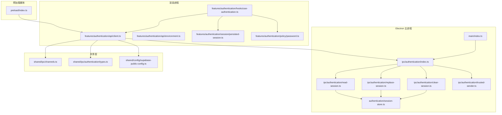
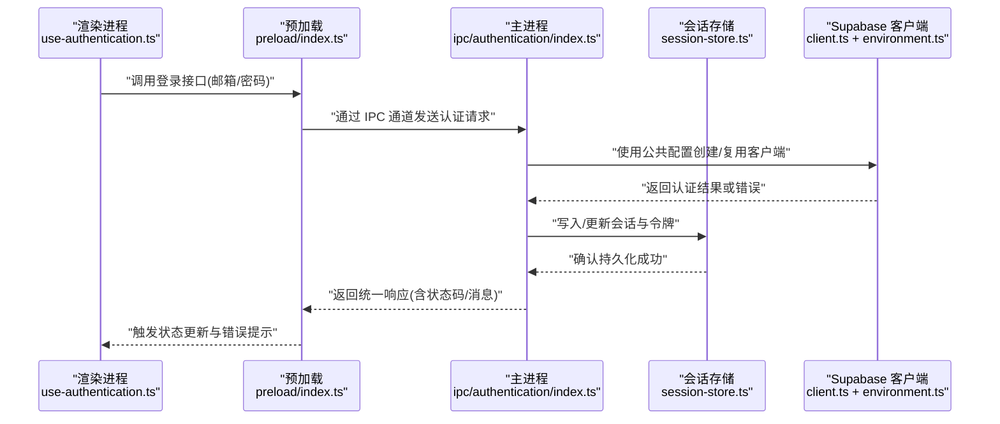
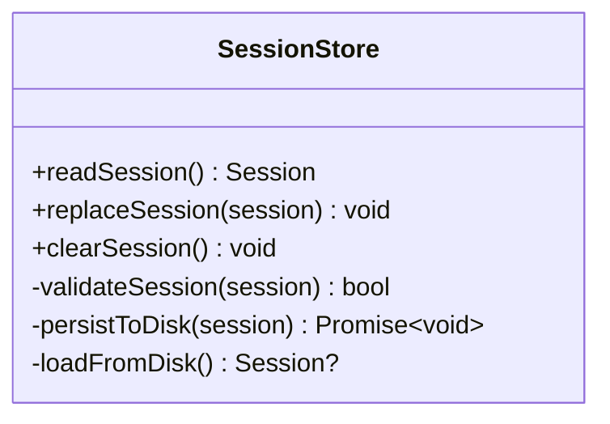
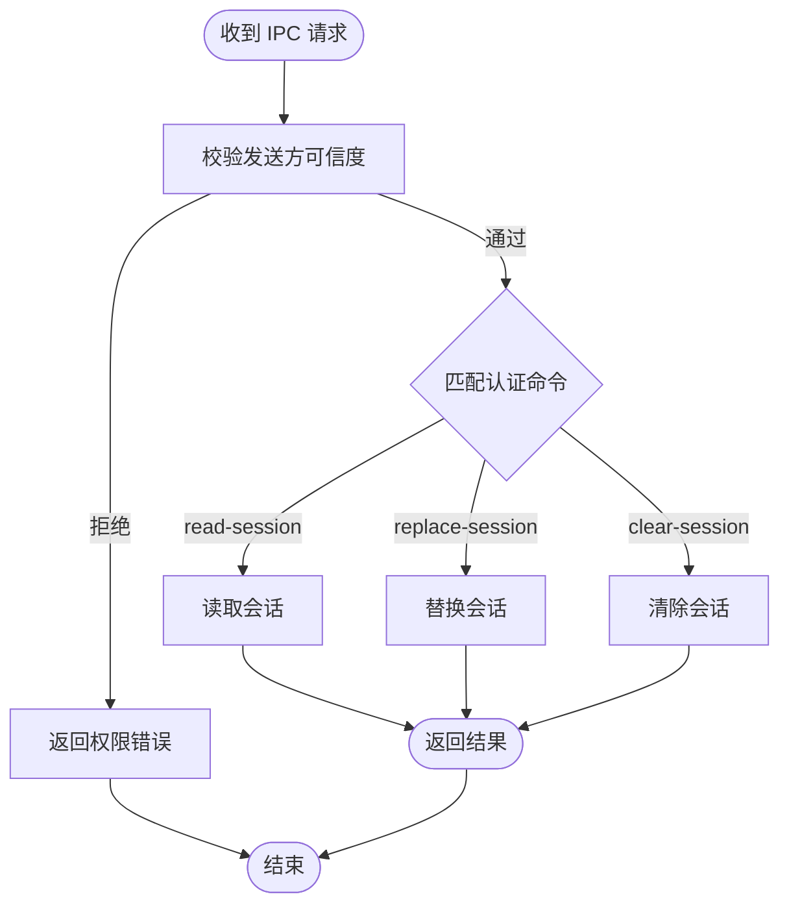
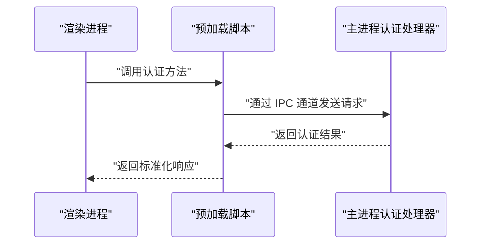
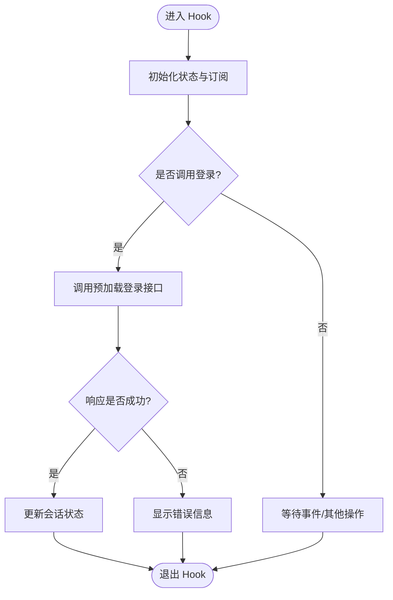
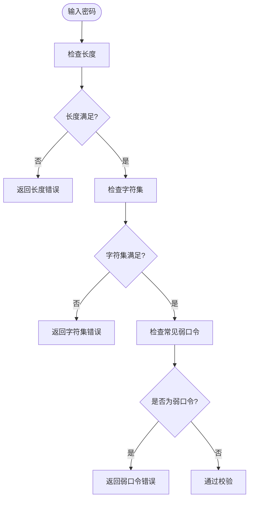
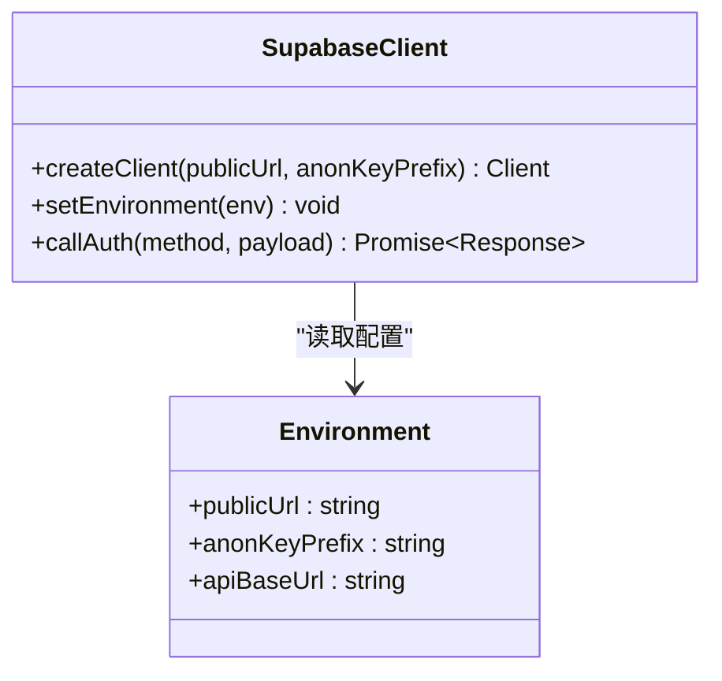
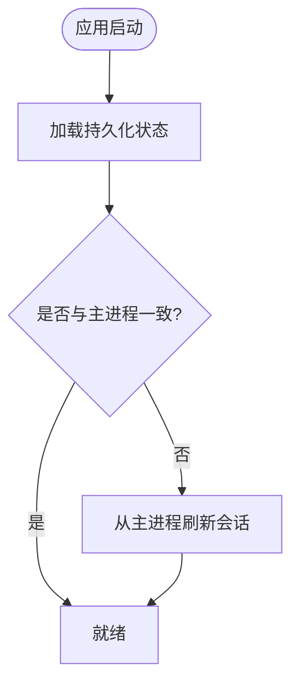
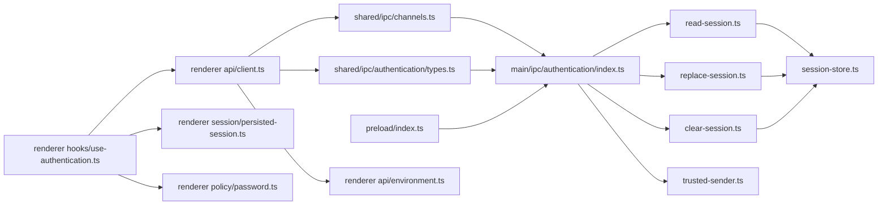

# 认证系统

<cite>
**本文引用的文件**   
- [apps/desktop/src/main/index.ts](file://apps/desktop/src/main/index.ts)
- [apps/desktop/src/main/authentication/session-store.ts](file://apps/desktop/src/main/authentication/session-store.ts)
- [apps/desktop/src/main/ipc/authentication/index.ts](file://apps/desktop/src/main/ipc/authentication/index.ts)
- [apps/desktop/src/main/ipc/authentication/read-session.ts](file://apps/desktop/src/main/ipc/authentication/read-session.ts)
- [apps/desktop/src/main/ipc/authentication/replace-session.ts](file://apps/desktop/src/main/ipc/authentication/replace-session.ts)
- [apps/desktop/src/main/ipc/authentication/clear-session.ts](file://apps/desktop/src/main/ipc/authentication/clear-session.ts)
- [apps/desktop/src/main/ipc/authentication/trusted-sender.ts](file://apps/desktop/src/main/ipc/authentication/trusted-sender.ts)
- [apps/desktop/src/preload/index.ts](file://apps/desktop/src/preload/index.ts)
- [apps/desktop/src/renderer/src/features/authentication/api/client.ts](file://apps/desktop/src/renderer/src/features/authentication/api/client.ts)
- [apps/desktop/src/renderer/src/features/authentication/api/environment.ts](file://apps/desktop/src/renderer/src/features/authentication/api/environment.ts)
- [apps/desktop/src/renderer/src/features/authentication/hooks/use-authentication.ts](file://apps/desktop/src/renderer/src/features/authentication/hooks/use-authentication.ts)
- [apps/desktop/src/renderer/src/features/authentication/policy/password.ts](file://apps/desktop/src/renderer/src/features/authentication/policy/password.ts)
- [apps/desktop/src/renderer/src/features/authentication/session/persisted-session.ts](file://apps/desktop/src/renderer/src/features/authentication/session/persisted-session.ts)
- [apps/desktop/src/shared/config/supabase-public-config.ts](file://apps/desktop/src/shared/config/supabase-public-config.ts)
- [apps/desktop/src/shared/ipc/channels.ts](file://apps/desktop/src/shared/ipc/channels.ts)
- [apps/desktop/src/shared/ipc/authentication/types.ts](file://apps/desktop/src/shared/ipc/authentication/types.ts)
- [apps/desktop/tests/auth/harness/supabase/config.toml](file://apps/desktop/tests/auth/harness/supabase/config.toml)
- [apps/desktop/tests/auth/helpers/supabase-auth.ts](file://apps/desktop/tests/auth/helpers/supabase-auth.ts)
- [apps/desktop/tests/auth/login-boundary.spec.ts](file://apps/desktop/tests/auth/login-boundary.spec.ts)
- [apps/desktop/tests/auth/session-persistence.spec.ts](file://apps/desktop/tests/auth/session-persistence.spec.ts)
- [apps/desktop/electron.vite.config.ts](file://apps/desktop/electron.vite.config.ts)
</cite>

## 目录
1. [简介](#简介)
2. [项目结构](#项目结构)
3. [核心组件](#核心组件)
4. [架构总览](#架构总览)
5. [详细组件分析](#详细组件分析)
6. [依赖关系分析](#依赖关系分析)
7. [性能考虑](#性能考虑)
8. [故障排查指南](#故障排查指南)
9. [结论](#结论)
10. [附录](#附录)

## 简介
本文件为 nevix-ai 桌面应用的认证系统提供系统化文档，覆盖多环境配置（本地开发、测试、生产）、会话管理与令牌存储、密码策略与注册登录流程、Supabase 集成、跨进程安全通信、权限控制与会话持久化。内容兼顾初学者友好与安全专家深度需求，并提供可操作的集成指南与常见问题解决方案。

## 项目结构
认证相关代码主要位于 apps/desktop 子应用中，采用 Electron 的三进程模型：
- main 进程：持有敏感能力（IPC 处理器、会话存储）
- preload 脚本：暴露最小 API 给渲染进程
- renderer 进程：业务逻辑与 UI（调用 IPC 与 Supabase 客户端）

图表来源
- [apps/desktop/src/main/index.ts](file://apps/desktop/src/main/index.ts)
- [apps/desktop/src/main/ipc/authentication/index.ts](file://apps/desktop/src/main/ipc/authentication/index.ts)
- [apps/desktop/src/main/ipc/authentication/read-session.ts](file://apps/desktop/src/main/ipc/authentication/read-session.ts)
- [apps/desktop/src/main/ipc/authentication/replace-session.ts](file://apps/desktop/src/main/ipc/authentication/replace-session.ts)
- [apps/desktop/src/main/ipc/authentication/clear-session.ts](file://apps/desktop/src/main/ipc/authentication/clear-session.ts)
- [apps/desktop/src/main/ipc/authentication/trusted-sender.ts](file://apps/desktop/src/main/ipc/authentication/trusted-sender.ts)
- [apps/desktop/src/main/authentication/session-store.ts](file://apps/desktop/src/main/authentication/session-store.ts)
- [apps/desktop/src/preload/index.ts](file://apps/desktop/src/preload/index.ts)
- [apps/desktop/src/renderer/src/features/authentication/api/client.ts](file://apps/desktop/src/renderer/src/features/authentication/api/client.ts)
- [apps/desktop/src/renderer/src/features/authentication/api/environment.ts](file://apps/desktop/src/renderer/src/features/authentication/api/environment.ts)
- [apps/desktop/src/renderer/src/features/authentication/hooks/use-authentication.ts](file://apps/desktop/src/renderer/src/features/authentication/hooks/use-authentication.ts)
- [apps/desktop/src/renderer/src/features/authentication/policy/password.ts](file://apps/desktop/src/renderer/src/features/authentication/policy/password.ts)
- [apps/desktop/src/renderer/src/features/authentication/session/persisted-session.ts](file://apps/desktop/src/renderer/src/features/authentication/session/persisted-session.ts)
- [apps/desktop/src/shared/ipc/channels.ts](file://apps/desktop/src/shared/ipc/channels.ts)
- [apps/desktop/src/shared/ipc/authentication/types.ts](file://apps/desktop/src/shared/ipc/authentication/types.ts)
- [apps/desktop/src/shared/config/supabase-public-config.ts](file://apps/desktop/src/shared/config/supabase-public-config.ts)

章节来源
- [apps/desktop/src/main/index.ts](file://apps/desktop/src/main/index.ts)
- [apps/desktop/src/main/ipc/authentication/index.ts](file://apps/desktop/src/main/ipc/authentication/index.ts)
- [apps/desktop/src/shared/ipc/channels.ts](file://apps/desktop/src/shared/ipc/channels.ts)

## 核心组件
- 主进程会话存储：集中管理用户会话与令牌，提供读取、替换、清除等原子操作，确保敏感数据不泄露到渲染进程。
- IPC 通道与处理器：定义安全的消息通道，严格校验发送方身份，仅允许受信任的渲染上下文访问。
- 预加载桥接：向渲染进程暴露最小化的认证 API，避免直接访问 Node/Electron 能力。
- 渲染侧认证 Hook：封装登录、登出、状态订阅与错误处理，统一业务调用入口。
- 密码策略：集中定义密码复杂度规则与校验流程。
- Supabase 公共配置：仅暴露非敏感客户端配置，服务端凭据不出渲染进程。
- 会话持久化：在渲染侧维护短期可见状态，实际令牌由主进程保管。

章节来源
- [apps/desktop/src/main/authentication/session-store.ts](file://apps/desktop/src/main/authentication/session-store.ts)
- [apps/desktop/src/main/ipc/authentication/index.ts](file://apps/desktop/src/main/ipc/authentication/index.ts)
- [apps/desktop/src/preload/index.ts](file://apps/desktop/src/preload/index.ts)
- [apps/desktop/src/renderer/src/features/authentication/hooks/use-authentication.ts](file://apps/desktop/src/renderer/src/features/authentication/hooks/use-authentication.ts)
- [apps/desktop/src/renderer/src/features/authentication/policy/password.ts](file://apps/desktop/src/renderer/src/features/authentication/policy/password.ts)
- [apps/desktop/src/shared/config/supabase-public-config.ts](file://apps/desktop/src/shared/config/supabase-public-config.ts)

## 架构总览
下图展示从渲染进程发起登录请求到主进程执行并返回结果的关键调用链，以及 Supabase 客户端的使用位置。

图表来源
- [apps/desktop/src/renderer/src/features/authentication/hooks/use-authentication.ts](file://apps/desktop/src/renderer/src/features/authentication/hooks/use-authentication.ts)
- [apps/desktop/src/preload/index.ts](file://apps/desktop/src/preload/index.ts)
- [apps/desktop/src/main/ipc/authentication/index.ts](file://apps/desktop/src/main/ipc/authentication/index.ts)
- [apps/desktop/src/main/authentication/session-store.ts](file://apps/desktop/src/main/authentication/session-store.ts)
- [apps/desktop/src/renderer/src/features/authentication/api/client.ts](file://apps/desktop/src/renderer/src/features/authentication/api/client.ts)
- [apps/desktop/src/renderer/src/features/authentication/api/environment.ts](file://apps/desktop/src/renderer/src/features/authentication/api/environment.ts)

## 详细组件分析

### 主进程会话存储（Session Store）
职责
- 提供会话数据的读写、替换与清理能力
- 保证对令牌的原子性操作与一致性
- 对外暴露最小接口，避免泄露内部实现

关键行为
- 读取会话：返回当前有效会话快照
- 替换会话：以新会话覆盖旧会话，失败时回滚
- 清除会话：清空所有敏感数据并释放资源

图表来源
- [apps/desktop/src/main/authentication/session-store.ts](file://apps/desktop/src/main/authentication/session-store.ts)

章节来源
- [apps/desktop/src/main/authentication/session-store.ts](file://apps/desktop/src/main/authentication/session-store.ts)

### IPC 认证通道与处理器
职责
- 定义统一的认证 IPC 通道与类型契约
- 校验发送方可信度，防止跨上下文滥用
- 路由认证相关命令到具体处理器

关键行为
- 通道注册：绑定认证命令与处理器
- 发送方校验：仅允许来自受信任上下文的请求
- 处理器实现：读/写/清会话的具体逻辑

图表来源
- [apps/desktop/src/main/ipc/authentication/index.ts](file://apps/desktop/src/main/ipc/authentication/index.ts)
- [apps/desktop/src/main/ipc/authentication/read-session.ts](file://apps/desktop/src/main/ipc/authentication/read-session.ts)
- [apps/desktop/src/main/ipc/authentication/replace-session.ts](file://apps/desktop/src/main/ipc/authentication/replace-session.ts)
- [apps/desktop/src/main/ipc/authentication/clear-session.ts](file://apps/desktop/src/main/ipc/authentication/clear-session.ts)
- [apps/desktop/src/main/ipc/authentication/trusted-sender.ts](file://apps/desktop/src/main/ipc/authentication/trusted-sender.ts)
- [apps/desktop/src/shared/ipc/channels.ts](file://apps/desktop/src/shared/ipc/channels.ts)
- [apps/desktop/src/shared/ipc/authentication/types.ts](file://apps/desktop/src/shared/ipc/authentication/types.ts)

章节来源
- [apps/desktop/src/main/ipc/authentication/index.ts](file://apps/desktop/src/main/ipc/authentication/index.ts)
- [apps/desktop/src/main/ipc/authentication/trusted-sender.ts](file://apps/desktop/src/main/ipc/authentication/trusted-sender.ts)
- [apps/desktop/src/shared/ipc/channels.ts](file://apps/desktop/src/shared/ipc/channels.ts)
- [apps/desktop/src/shared/ipc/authentication/types.ts](file://apps/desktop/src/shared/ipc/authentication/types.ts)

### 预加载桥接（Preload）
职责
- 将主进程的认证能力以最小 API 暴露给渲染进程
- 屏蔽底层 IPC 细节，统一错误与返回值格式

关键行为
- 暴露登录、登出、获取会话等方法
- 转发请求至主进程并处理响应

图表来源
- [apps/desktop/src/preload/index.ts](file://apps/desktop/src/preload/index.ts)
- [apps/desktop/src/main/ipc/authentication/index.ts](file://apps/desktop/src/main/ipc/authentication/index.ts)

章节来源
- [apps/desktop/src/preload/index.ts](file://apps/desktop/src/preload/index.ts)

### 渲染侧认证 Hook（use-authentication）
职责
- 封装登录、登出、刷新会话等业务流程
- 订阅会话状态变化，驱动 UI 更新
- 聚合错误处理与重试策略

关键行为
- 登录：调用预加载 API，处理成功/失败分支
- 登出：触发主进程清除会话并更新本地状态
- 状态订阅：监听会话变更事件，同步 UI

图表来源
- [apps/desktop/src/renderer/src/features/authentication/hooks/use-authentication.ts](file://apps/desktop/src/renderer/src/features/authentication/hooks/use-authentication.ts)

章节来源
- [apps/desktop/src/renderer/src/features/authentication/hooks/use-authentication.ts](file://apps/desktop/src/renderer/src/features/authentication/hooks/use-authentication.ts)

### 密码策略（Password Policy）
职责
- 集中定义密码复杂度规则（长度、字符集、常见弱口令检测等）
- 提供校验函数供注册与修改密码流程使用

关键行为
- 校验输入是否符合策略
- 返回明确的错误原因以便前端提示

图表来源
- [apps/desktop/src/renderer/src/features/authentication/policy/password.ts](file://apps/desktop/src/renderer/src/features/authentication/policy/password.ts)

章节来源
- [apps/desktop/src/renderer/src/features/authentication/policy/password.ts](file://apps/desktop/src/renderer/src/features/authentication/policy/password.ts)

### Supabase 集成（客户端与环境）
职责
- 在渲染进程使用公共配置创建 Supabase 客户端
- 区分不同环境的端点与密钥前缀，避免泄露完整密钥

关键行为
- 根据环境变量选择正确的 Supabase URL 与键前缀
- 封装网络请求与错误映射

图表来源
- [apps/desktop/src/renderer/src/features/authentication/api/client.ts](file://apps/desktop/src/renderer/src/features/authentication/api/client.ts)
- [apps/desktop/src/renderer/src/features/authentication/api/environment.ts](file://apps/desktop/src/renderer/src/features/authentication/api/environment.ts)
- [apps/desktop/src/shared/config/supabase-public-config.ts](file://apps/desktop/src/shared/config/supabase-public-config.ts)

章节来源
- [apps/desktop/src/renderer/src/features/authentication/api/client.ts](file://apps/desktop/src/renderer/src/features/authentication/api/client.ts)
- [apps/desktop/src/renderer/src/features/authentication/api/environment.ts](file://apps/desktop/src/renderer/src/features/authentication/api/environment.ts)
- [apps/desktop/src/shared/config/supabase-public-config.ts](file://apps/desktop/src/shared/config/supabase-public-config.ts)

### 会话持久化（渲染侧）
职责
- 在渲染进程维护短期可见的会话状态，用于 UI 展示
- 与主进程会话保持同步，避免不一致

关键行为
- 读取主进程会话快照
- 在登录/登出后更新本地状态

图表来源
- [apps/desktop/src/renderer/src/features/authentication/session/persisted-session.ts](file://apps/desktop/src/renderer/src/features/authentication/session/persisted-session.ts)

章节来源
- [apps/desktop/src/renderer/src/features/authentication/session/persisted-session.ts](file://apps/desktop/src/renderer/src/features/authentication/session/persisted-session.ts)

## 依赖关系分析
认证子系统依赖以下模块：
- 共享 IPC 通道与类型定义
- 主进程会话存储
- 预加载桥接
- 渲染侧认证 Hook、密码策略与 Supabase 客户端
- 测试辅助与配置

图表来源
- [apps/desktop/src/shared/ipc/channels.ts](file://apps/desktop/src/shared/ipc/channels.ts)
- [apps/desktop/src/shared/ipc/authentication/types.ts](file://apps/desktop/src/shared/ipc/authentication/types.ts)
- [apps/desktop/src/main/ipc/authentication/index.ts](file://apps/desktop/src/main/ipc/authentication/index.ts)
- [apps/desktop/src/main/ipc/authentication/read-session.ts](file://apps/desktop/src/main/ipc/authentication/read-session.ts)
- [apps/desktop/src/main/ipc/authentication/replace-session.ts](file://apps/desktop/src/main/ipc/authentication/replace-session.ts)
- [apps/desktop/src/main/ipc/authentication/clear-session.ts](file://apps/desktop/src/main/ipc/authentication/clear-session.ts)
- [apps/desktop/src/main/ipc/authentication/trusted-sender.ts](file://apps/desktop/src/main/ipc/authentication/trusted-sender.ts)
- [apps/desktop/src/main/authentication/session-store.ts](file://apps/desktop/src/main/authentication/session-store.ts)
- [apps/desktop/src/preload/index.ts](file://apps/desktop/src/preload/index.ts)
- [apps/desktop/src/renderer/src/features/authentication/api/client.ts](file://apps/desktop/src/renderer/src/features/authentication/api/client.ts)
- [apps/desktop/src/renderer/src/features/authentication/api/environment.ts](file://apps/desktop/src/renderer/src/features/authentication/api/environment.ts)
- [apps/desktop/src/renderer/src/features/authentication/hooks/use-authentication.ts](file://apps/desktop/src/renderer/src/features/authentication/hooks/use-authentication.ts)
- [apps/desktop/src/renderer/src/features/authentication/session/persisted-session.ts](file://apps/desktop/src/renderer/src/features/authentication/session/persisted-session.ts)
- [apps/desktop/src/renderer/src/features/authentication/policy/password.ts](file://apps/desktop/src/renderer/src/features/authentication/policy/password.ts)

章节来源
- [apps/desktop/src/shared/ipc/channels.ts](file://apps/desktop/src/shared/ipc/channels.ts)
- [apps/desktop/src/main/ipc/authentication/index.ts](file://apps/desktop/src/main/ipc/authentication/index.ts)
- [apps/desktop/src/renderer/src/features/authentication/hooks/use-authentication.ts](file://apps/desktop/src/renderer/src/features/authentication/hooks/use-authentication.ts)

## 性能考虑
- 会话读取应尽量避免频繁磁盘 I/O，必要时在主进程内缓存最近一次会话快照。
- IPC 调用需去抖与节流，避免 UI 高频触发导致主进程压力过大。
- Supabase 客户端连接池与超时设置应根据环境合理配置，减少网络抖动影响。
- 渲染侧状态更新应采用批量更新策略，降低重渲染开销。

[本节为通用指导，无需特定文件引用]

## 故障排查指南
常见问题与定位步骤
- 登录失败但无明确错误
  - 检查预加载是否正确转发请求与响应
  - 查看主进程 IPC 处理器日志与发送方校验结果
  - 验证 Supabase 公共配置的环境变量是否正确
- 会话未持久化或丢失
  - 确认主进程会话存储的写入与读取路径
  - 检查替换会话的原子性与异常回滚
  - 验证渲染侧持久化状态与主进程同步逻辑
- 跨进程权限错误
  - 核对 trusted-sender 的白名单与上下文标识
  - 确认 IPC 通道名称与类型契约一致

章节来源
- [apps/desktop/src/main/ipc/authentication/trusted-sender.ts](file://apps/desktop/src/main/ipc/authentication/trusted-sender.ts)
- [apps/desktop/src/main/ipc/authentication/index.ts](file://apps/desktop/src/main/ipc/authentication/index.ts)
- [apps/desktop/src/main/authentication/session-store.ts](file://apps/desktop/src/main/authentication/session-store.ts)
- [apps/desktop/src/renderer/src/features/authentication/session/persisted-session.ts](file://apps/desktop/src/renderer/src/features/authentication/session/persisted-session.ts)

## 结论
nevix-ai 认证系统通过主进程集中管理敏感数据、预加载最小化暴露、渲染侧专注业务与 UI，形成清晰的安全边界。配合严格的 IPC 校验、一致的会话持久化与合理的 Supabase 客户端配置，可在多环境下稳定运行。建议持续完善错误分类、重试策略与监控埋点，以提升可观测性与用户体验。

[本节为总结性内容，无需特定文件引用]

## 附录

### 多环境配置差异（本地、测试、生产）
- 本地开发
  - Supabase 公共 URL 指向本地或沙箱实例
  - 调试开关开启，日志级别提高
  - 可选启用模拟邮件服务（如 Mailpit）
- 测试环境
  - 使用隔离数据库与专用密钥前缀
  - 自动化测试用例覆盖登录边界、会话持久化与公开配置策略
- 生产环境
  - 关闭调试输出，限制日志粒度
  - 启用更严格的超时与重试策略
  - 强制 HTTPS 与最小权限原则

章节来源
- [apps/desktop/tests/auth/harness/supabase/config.toml](file://apps/desktop/tests/auth/harness/supabase/config.toml)
- [apps/desktop/tests/auth/helpers/supabase-auth.ts](file://apps/desktop/tests/auth/helpers/supabase-auth.ts)
- [apps/desktop/tests/auth/login-boundary.spec.ts](file://apps/desktop/tests/auth/login-boundary.spec.ts)
- [apps/desktop/tests/auth/session-persistence.spec.ts](file://apps/desktop/tests/auth/session-persistence.spec.ts)
- [apps/desktop/electron.vite.config.ts](file://apps/desktop/electron.vite.config.ts)

### 集成指南（快速上手）
- 安装与构建
  - 使用包管理器安装依赖并构建应用
  - 配置环境变量（Supabase 公共 URL、匿名键前缀等）
- 运行与调试
  - 启动主进程与渲染进程
  - 打开开发者工具观察 IPC 调用与网络请求
- 接入认证功能
  - 在渲染侧引入 use-authentication Hook
  - 调用登录/登出方法并处理状态变化
  - 使用密码策略进行输入校验

章节来源
- [apps/desktop/src/renderer/src/features/authentication/hooks/use-authentication.ts](file://apps/desktop/src/renderer/src/features/authentication/hooks/use-authentication.ts)
- [apps/desktop/src/renderer/src/features/authentication/policy/password.ts](file://apps/desktop/src/renderer/src/features/authentication/policy/password.ts)
- [apps/desktop/src/renderer/src/features/authentication/api/environment.ts](file://apps/desktop/src/renderer/src/features/authentication/api/environment.ts)

### 安全最佳实践
- 不在渲染进程保存完整密钥，仅使用公共配置
- 对所有 IPC 请求进行发送方校验与参数白名单
- 会话令牌仅在主进程持久化，渲染侧仅保留必要快照
- 定期轮换密钥与令牌，限制有效期与权限范围

[本节为通用指导，无需特定文件引用]