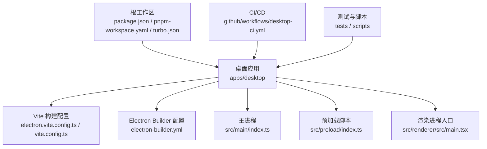
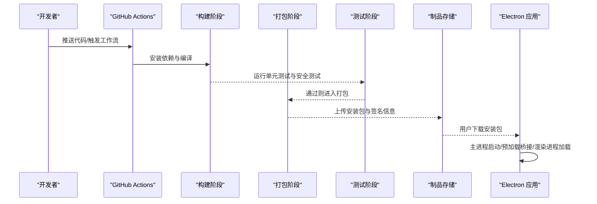
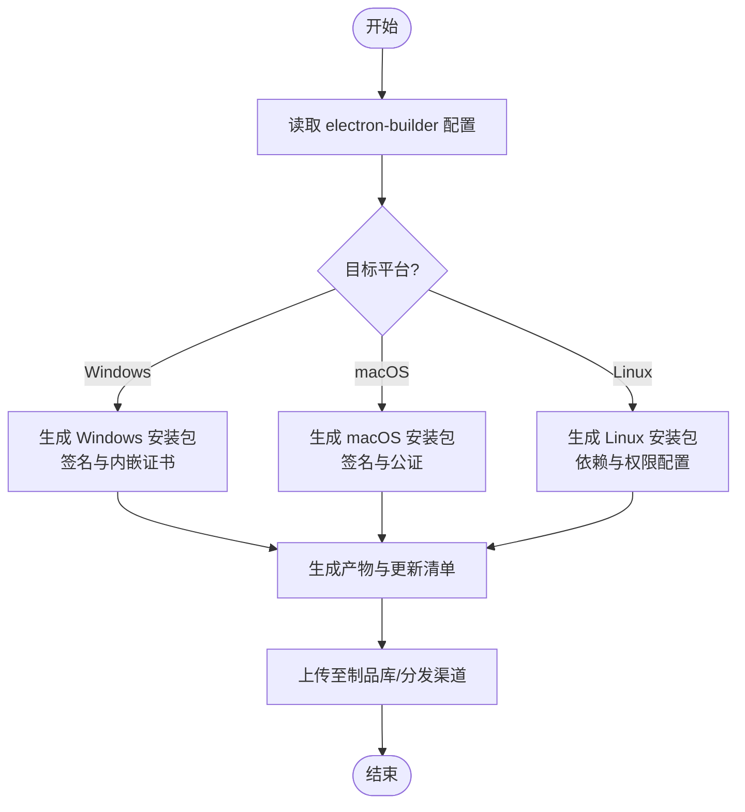
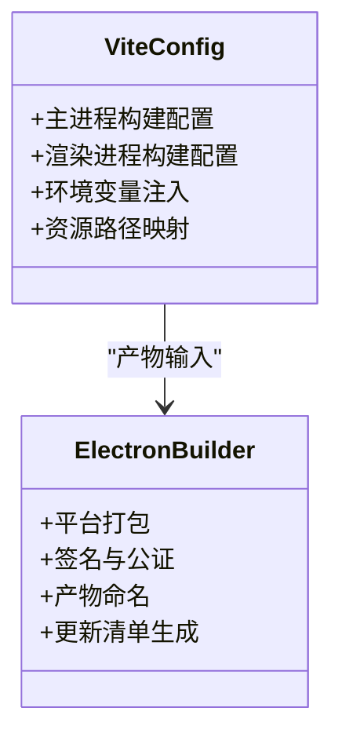
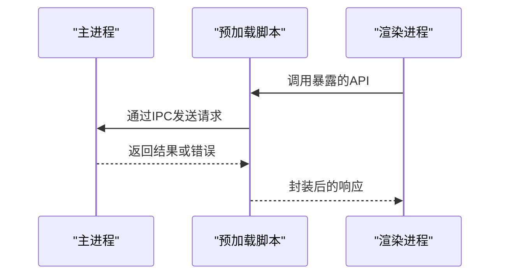
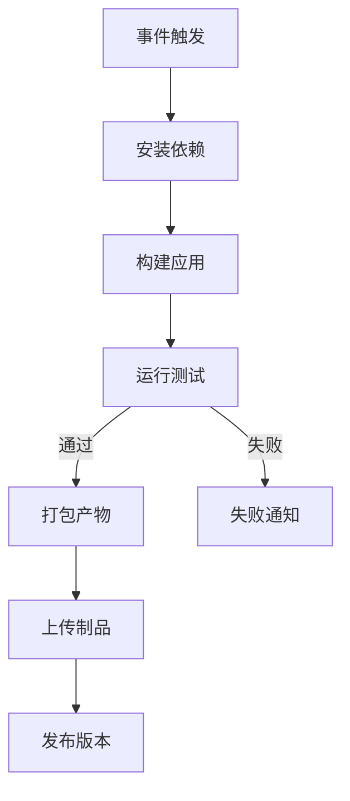
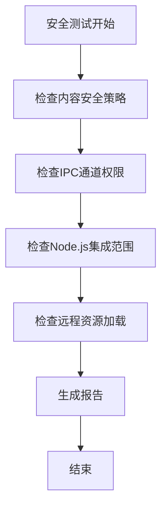
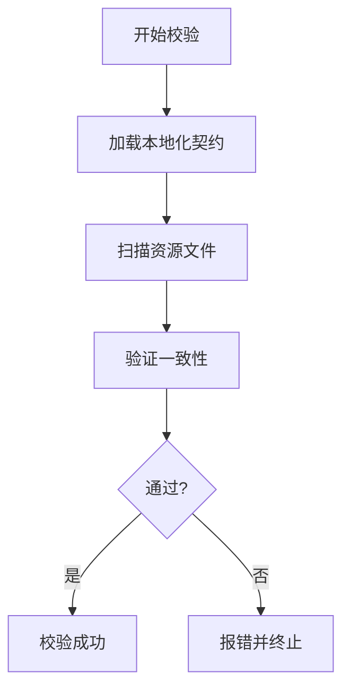
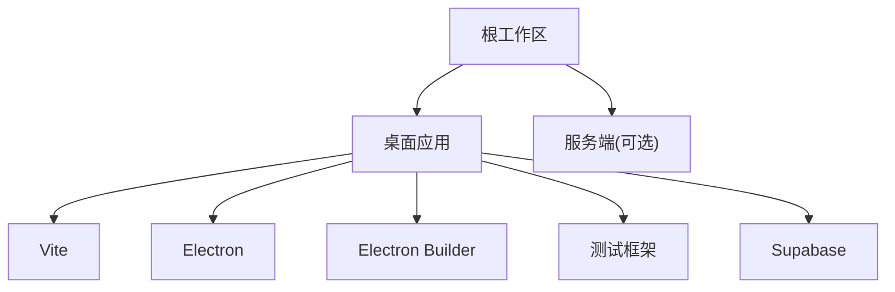

# 部署与生产

<cite>
**本文引用的文件**   
- [package.json](file://package.json)
- [pnpm-workspace.yaml](file://pnpm-workspace.yaml)
- [turbo.json](file://turbo.json)
- [Makefile](file://Makefile)
- [.github/workflows/desktop-ci.yml](file://.github/workflows/desktop-ci.yml)
- [apps/desktop/package.json](file://apps/desktop/package.json)
- [apps/desktop/electron-builder.yml](file://apps/desktop/electron-builder.yml)
- [apps/desktop/electron.vite.config.ts](file://apps/desktop/electron.vite.config.ts)
- [apps/desktop/vite.config.ts](file://apps/desktop/vite.config.ts)
- [apps/desktop/src/main/index.ts](file://apps/desktop/src/main/index.ts)
- [apps/desktop/src/preload/index.ts](file://apps/desktop/src/preload/index.ts)
- [apps/desktop/src/renderer/src/main.tsx](file://apps/desktop/src/renderer/src/main.tsx)
- [apps/desktop/tests/auth/electron-security.spec.ts](file://apps/desktop/tests/auth/electron-security.spec.ts)
- [apps/desktop/scripts/run-auth-e2e.sh](file://apps/desktop/scripts/run-auth-e2e.sh)
- [apps/desktop/scripts/verify-packaged-localized-surfaces.mjs](file://apps/desktop/scripts/verify-packaged-localized-surfaces.mjs)
</cite>

## 目录
1. [简介](#简介)
2. [项目结构](#项目结构)
3. [核心组件](#核心组件)
4. [架构总览](#架构总览)
5. [详细组件分析](#详细组件分析)
6. [依赖分析](#依赖分析)
7. [性能考虑](#性能考虑)
8. [故障排查指南](#故障排查指南)
9. [结论](#结论)
10. [附录](#附录)

## 简介
本文件面向运维与DevOps工程师，系统化阐述 nevix-ai 桌面端（Electron）在打包、签名、分发、CI/CD、测试、发布、更新机制、版本控制与回滚策略等方面的实践。文档同时覆盖生产环境配置、环境变量管理、日志收集、安全加固、性能优化与故障恢复方案，并提供可操作的脚本示例与监控告警建议，帮助团队构建稳定、可观测、可回滚的生产交付流水线。

## 项目结构
nevix-ai 采用多包工作区（pnpm workspace + Turbo），桌面端位于 apps/desktop。关键构建与发布相关配置集中在以下位置：
- 根级工作区与任务编排：package.json、pnpm-workspace.yaml、turbo.json、Makefile
- Electron 应用构建与打包：apps/desktop/package.json、apps/desktop/electron-builder.yml、apps/desktop/electron.vite.config.ts、apps/desktop/vite.config.ts
- CI/CD 流水线：.github/workflows/desktop-ci.yml
- 主进程与预加载脚本：apps/desktop/src/main/index.ts、apps/desktop/src/preload/index.ts
- 渲染进程入口：apps/desktop/src/renderer/src/main.tsx
- 安全与E2E测试：apps/desktop/tests/auth/electron-security.spec.ts、apps/desktop/scripts/run-auth-e2e.sh
- 打包产物校验脚本：apps/desktop/scripts/verify-packaged-localized-surfaces.mjs

**图表来源** 
- [package.json](file://package.json)
- [pnpm-workspace.yaml](file://pnpm-workspace.yaml)
- [turbo.json](file://turbo.json)
- [apps/desktop/package.json](file://apps/desktop/package.json)
- [apps/desktop/electron.vite.config.ts](file://apps/desktop/electron.vite.config.ts)
- [apps/desktop/vite.config.ts](file://apps/desktop/vite.config.ts)
- [apps/desktop/electron-builder.yml](file://apps/desktop/electron-builder.yml)
- [.github/workflows/desktop-ci.yml](file://.github/workflows/desktop-ci.yml)

**章节来源**
- [package.json](file://package.json)
- [pnpm-workspace.yaml](file://pnpm-workspace.yaml)
- [turbo.json](file://turbo.json)
- [apps/desktop/package.json](file://apps/desktop/package.json)

## 核心组件
- 构建系统
  - Vite：负责渲染进程与主进程的模块化构建与资源处理
  - Electron Builder：将应用打包为各平台安装包（如 .exe/.dmg/.AppImage）并支持代码签名与自动更新元数据生成
- 进程模型
  - 主进程：初始化窗口、IPC 通道、国际化、设置等
  - 预加载脚本：桥接主进程能力到渲染进程，最小化暴露 API
  - 渲染进程：React 应用入口与业务逻辑
- CI/CD
  - GitHub Actions 定义桌面端构建、测试、打包与产物上传流程
- 测试与验证
  - 安全规范测试、认证端到端测试、本地化产物校验脚本

**章节来源**
- [apps/desktop/electron.vite.config.ts](file://apps/desktop/electron.vite.config.ts)
- [apps/desktop/vite.config.ts](file://apps/desktop/vite.config.ts)
- [apps/desktop/electron-builder.yml](file://apps/desktop/electron-builder.yml)
- [apps/desktop/src/main/index.ts](file://apps/desktop/src/main/index.ts)
- [apps/desktop/src/preload/index.ts](file://apps/desktop/src/preload/index.ts)
- [apps/desktop/src/renderer/src/main.tsx](file://apps/desktop/src/renderer/src/main.tsx)
- [.github/workflows/desktop-ci.yml](file://.github/workflows/desktop-ci.yml)

## 架构总览
下图展示了从代码提交到产物的完整流水线，以及 Electron 应用的运行时交互关系。

**图表来源** 
- [.github/workflows/desktop-ci.yml](file://.github/workflows/desktop-ci.yml)
- [apps/desktop/electron-builder.yml](file://apps/desktop/electron-builder.yml)
- [apps/desktop/src/main/index.ts](file://apps/desktop/src/main/index.ts)
- [apps/desktop/src/preload/index.ts](file://apps/desktop/src/preload/index.ts)
- [apps/desktop/src/renderer/src/main.tsx](file://apps/desktop/src/renderer/src/main.tsx)

## 详细组件分析

### Electron Builder 配置与平台定制
- 目标平台与产物类型：根据操作系统生成对应安装包格式（Windows 的 .exe/.msi，macOS 的 .dmg/.app，Linux 的 .AppImage/.deb/.rpm）
- 代码签名：
  - Windows：使用证书进行签名，确保下载与安装可信
  - macOS：使用开发者证书与公证流程，提升信任度
- 自动更新元数据：生成 update 所需的 manifest 与签名信息，供客户端检查更新
- 资源与图标：注入应用图标、许可证、版权信息与平台特定资源
- 输出目录与产物命名：统一产物命名规则，便于 CI 归档与分发

**图表来源** 
- [apps/desktop/electron-builder.yml](file://apps/desktop/electron-builder.yml)

**章节来源**
- [apps/desktop/electron-builder.yml](file://apps/desktop/electron-builder.yml)

### Vite 构建配置（主进程与渲染进程）
- 主进程构建：独立于渲染进程，避免浏览器 API 污染，启用 Node.js 集成
- 渲染进程构建：基于 React/Vite 的标准前端构建流程，支持热重载与资源优化
- 环境变量注入：通过构建时变量注入运行时配置（如后端地址、功能开关）
- 资源路径与公共目录：统一管理静态资源与字体、图片等

**图表来源** 
- [apps/desktop/electron.vite.config.ts](file://apps/desktop/electron.vite.config.ts)
- [apps/desktop/vite.config.ts](file://apps/desktop/vite.config.ts)
- [apps/desktop/electron-builder.yml](file://apps/desktop/electron-builder.yml)

**章节来源**
- [apps/desktop/electron.vite.config.ts](file://apps/desktop/electron.vite.config.ts)
- [apps/desktop/vite.config.ts](file://apps/desktop/vite.config.ts)

### 主进程、预加载与渲染进程协作
- 主进程：初始化窗口、注册 IPC 通道、加载国际化与设置
- 预加载脚本：仅暴露必要 API，限制渲染进程直接访问敏感能力
- 渲染进程：React 应用入口，通过预加载桥接调用主进程能力

**图表来源** 
- [apps/desktop/src/main/index.ts](file://apps/desktop/src/main/index.ts)
- [apps/desktop/src/preload/index.ts](file://apps/desktop/src/preload/index.ts)
- [apps/desktop/src/renderer/src/main.tsx](file://apps/desktop/src/renderer/src/main.tsx)

**章节来源**
- [apps/desktop/src/main/index.ts](file://apps/desktop/src/main/index.ts)
- [apps/desktop/src/preload/index.ts](file://apps/desktop/src/preload/index.ts)
- [apps/desktop/src/renderer/src/main.tsx](file://apps/desktop/src/renderer/src/main.tsx)

### CI/CD 流水线与自动化测试
- 触发条件：推送代码或创建标签时触发桌面端构建
- 步骤：
  - 安装依赖（pnpm）
  - 构建（Vite）
  - 测试（安全测试、认证E2E）
  - 打包（Electron Builder）
  - 上传产物（GitHub Releases/对象存储）
- 缓存与并行：利用 pnpm/Turbo 缓存依赖与中间产物，加速构建

**图表来源** 
- [.github/workflows/desktop-ci.yml](file://.github/workflows/desktop-ci.yml)
- [apps/desktop/scripts/run-auth-e2e.sh](file://apps/desktop/scripts/run-auth-e2e.sh)

**章节来源**
- [.github/workflows/desktop-ci.yml](file://.github/workflows/desktop-ci.yml)
- [apps/desktop/scripts/run-auth-e2e.sh](file://apps/desktop/scripts/run-auth-e2e.sh)

### 安全加固与测试
- 最小权限原则：预加载脚本仅暴露必要 API
- CSP 与上下文隔离：禁用不必要的 Node.js 集成，限制远程内容加载
- 安全测试：针对 Electron 安全最佳实践编写用例，覆盖权限、通信、资源加载等

**图表来源** 
- [apps/desktop/tests/auth/electron-security.spec.ts](file://apps/desktop/tests/auth/electron-security.spec.ts)

**章节来源**
- [apps/desktop/tests/auth/electron-security.spec.ts](file://apps/desktop/tests/auth/electron-security.spec.ts)

### 本地化与产物校验
- 本地化资源：在打包前校验语言包完整性与契约一致性
- 产物验证：确保安装包包含正确的资源与元数据

**图表来源** 
- [apps/desktop/scripts/verify-packaged-localized-surfaces.mjs](file://apps/desktop/scripts/verify-packaged-localized-surfaces.mjs)

**章节来源**
- [apps/desktop/scripts/verify-packaged-localized-surfaces.mjs](file://apps/desktop/scripts/verify-packaged-localized-surfaces.mjs)

## 依赖分析
- 工作区依赖：pnpm workspace 管理多包依赖，Turbo 提供任务编排与缓存
- 构建依赖：Vite、Electron、Electron Builder、TypeScript、ESLint/Prettier
- 测试依赖：Playwright、Jest/Vitest（根据实际配置）
- 外部服务：Supabase（认证与会话）、邮件服务（E2E 测试）

**图表来源** 
- [package.json](file://package.json)
- [pnpm-workspace.yaml](file://pnpm-workspace.yaml)
- [turbo.json](file://turbo.json)
- [apps/desktop/package.json](file://apps/desktop/package.json)

**章节来源**
- [package.json](file://package.json)
- [pnpm-workspace.yaml](file://pnpm-workspace.yaml)
- [turbo.json](file://turbo.json)
- [apps/desktop/package.json](file://apps/desktop/package.json)

## 性能考虑
- 构建优化：
  - 启用增量构建与缓存（Turbo/pnpm cache）
  - 按需引入与代码分割（Vite 默认支持）
- 运行时优化：
  - 主进程与渲染进程职责分离，避免阻塞
  - 预加载脚本最小化，减少内存占用
  - 资源懒加载与压缩（图片、字体）
- 打包优化：
  - 排除不必要依赖（node_modules 精简）
  - 使用平台特定优化（如 macOS 的 Notarization）

[本节为通用指导，无需具体文件引用]

## 故障排查指南
- 构建失败：
  - 检查依赖安装与版本兼容性
  - 查看 Vite/Electron Builder 日志定位错误
- 签名问题：
  - 确保证书有效且权限正确
  - macOS 公证失败需检查开发者账号与Bundle ID
- 测试失败：
  - 检查环境变量与外部服务可用性（Supabase、邮件服务）
  - 使用 Playwright 调试模式定位 UI 问题
- 运行时崩溃：
  - 启用主进程日志与崩溃转储
  - 检查 IPC 通信与权限配置

**章节来源**
- [.github/workflows/desktop-ci.yml](file://.github/workflows/desktop-ci.yml)
- [apps/desktop/tests/auth/electron-security.spec.ts](file://apps/desktop/tests/auth/electron-security.spec.ts)
- [apps/desktop/scripts/run-auth-e2e.sh](file://apps/desktop/scripts/run-auth-e2e.sh)

## 结论
通过系统化的构建配置、严格的测试与安全加固、完善的 CI/CD 流水线与产物管理，nevix-ai 桌面端能够实现高效、可靠的生产交付。建议持续优化性能指标、完善监控告警与回滚策略，以应对复杂生产环境的挑战。

[本节为总结性内容，无需具体文件引用]

## 附录
- 环境变量管理：建议使用 .env 模板与 CI 密钥管理，避免硬编码敏感信息
- 日志收集：集成集中式日志系统（如 ELK/Sentry），捕获主进程与渲染进程异常
- 更新机制：基于 Electron Updater 实现自动更新，支持差量更新与灰度发布
- 版本控制：遵循语义化版本（SemVer），结合 Git Tag 触发发布流水线
- 回滚策略：保留历史版本产物，支持快速回滚至稳定版本

[本节为补充说明，无需具体文件引用]