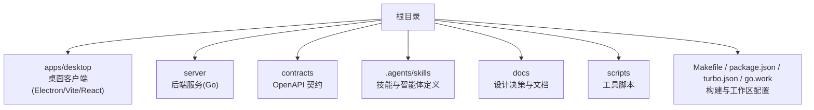
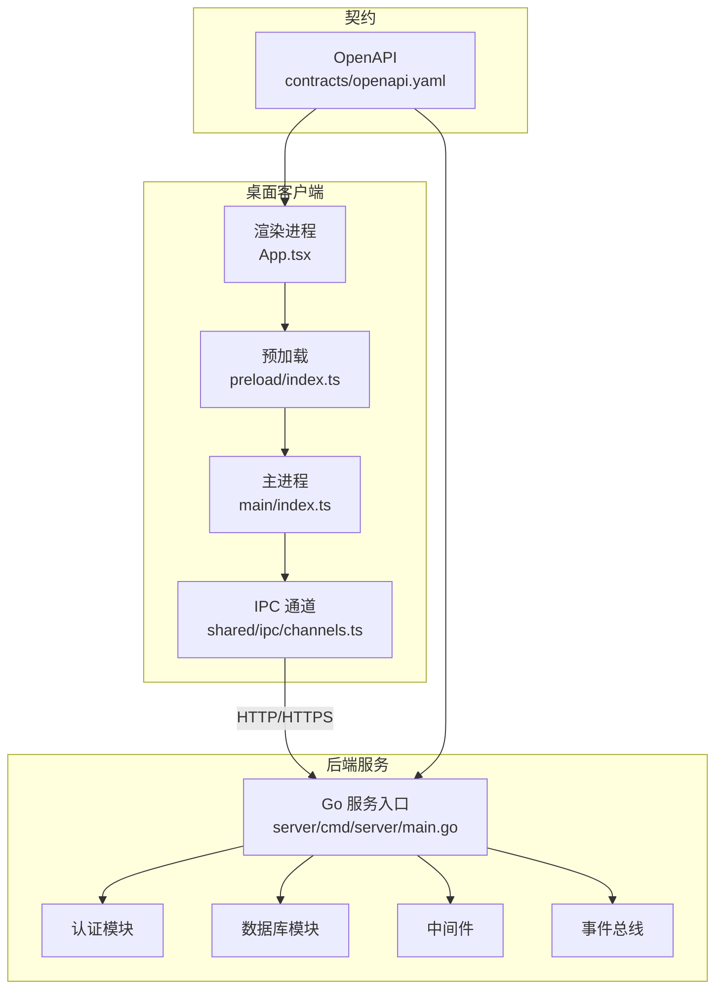
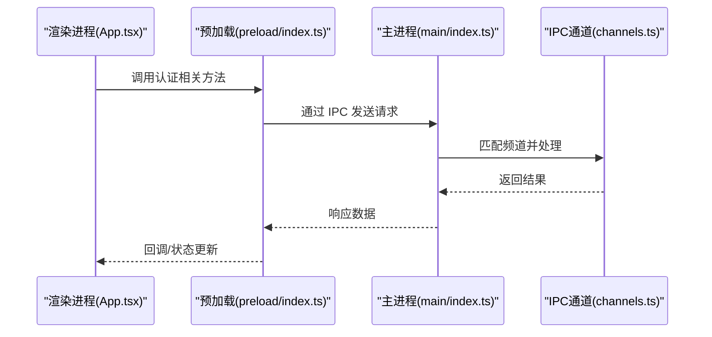
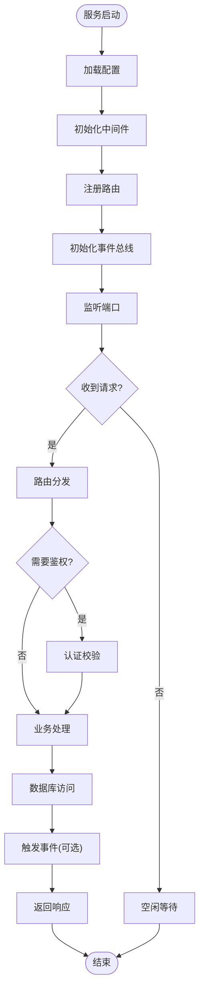
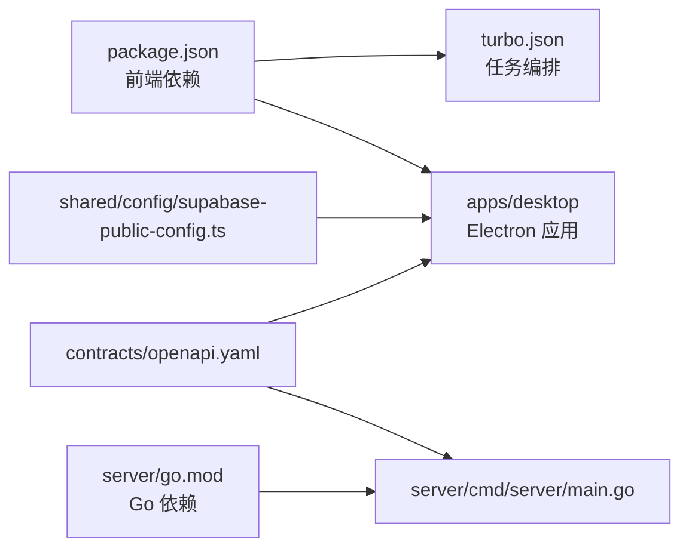

# 项目概览

<cite>
**本文引用的文件**   
- [README.md](file://README.md)
- [CONTEXT-MAP.md](file://CONTEXT-MAP.md)
- [AGENTS.md](file://AGENTS.md)
- [Makefile](file://Makefile)
- [package.json](file://package.json)
- [turbo.json](file://turbo.json)
- [go.work](file://go.work)
- [server/cmd/server/main.go](file://server/cmd/server/main.go)
- [server/go.mod](file://server/go.mod)
- [apps/desktop/package.json](file://apps/desktop/package.json)
- [apps/desktop/electron.vite.config.ts](file://apps/desktop/electron.vite.config.ts)
- [apps/desktop/src/main/index.ts](file://apps/desktop/src/main/index.ts)
- [apps/desktop/src/preload/index.ts](file://apps/desktop/src/preload/index.ts)
- [apps/desktop/src/renderer/src/app/App.tsx](file://apps/desktop/src/renderer/src/app/App.tsx)
- [apps/desktop/src/shared/ipc/channels.ts](file://apps/desktop/src/shared/ipc/channels.ts)
- [apps/desktop/src/shared/config/supabase-public-config.ts](file://apps/desktop/src/shared/config/supabase-public-config.ts)
- [contracts/openapi.yaml](file://contracts/openapi.yaml)
</cite>

## 目录
1. [简介](#简介)
2. [项目结构](#项目结构)
3. [核心组件](#核心组件)
4. [架构总览](#架构总览)
5. [详细组件分析](#详细组件分析)
6. [依赖关系分析](#依赖关系分析)
7. [性能考虑](#性能考虑)
8. [故障排查指南](#故障排查指南)
9. [结论](#结论)
10. [附录](#附录)

## 简介
本文件为 nevix-ai 项目的全面概览，面向初学者与经验丰富的开发者。内容涵盖项目目标、整体架构、关键组件及其交互、配置选项与使用模式，并提供常见用例的演示思路。文档严格基于仓库中的实际结构与文件进行说明，确保术语与实现一致。

## 项目结构
nevix-ai 采用多包工作区（Monorepo）组织，包含桌面客户端（Electron + Vite/React）、后端服务（Go）、共享契约（OpenAPI）以及技能与智能体定义等。顶层通过 Makefile、pnpm 工作区与 Turborepo 协调构建与任务；Go 工作区管理服务端模块。

图表来源
- [Makefile](file://Makefile)
- [package.json](file://package.json)
- [turbo.json](file://turbo.json)
- [go.work](file://go.work)

章节来源
- [README.md](file://README.md)
- [CONTEXT-MAP.md](file://CONTEXT-MAP.md)
- [AGENTS.md](file://AGENTS.md)
- [Makefile](file://Makefile)
- [package.json](file://package.json)
- [turbo.json](file://turbo.json)
- [go.work](file://go.work)

## 核心组件
- 桌面客户端（Electron + Vite + React）
  - 主进程：窗口管理、IPC 通道、国际化、设置存储、认证会话持久化。
  - Preload：安全暴露 IPC API 给渲染进程。
  - 渲染进程：应用入口、功能特性（认证、语言设置等）、UI 组件。
- 后端服务（Go）
  - 入口：cmd/server/main.go 启动 HTTP 服务与中间件、路由、事件总线等。
  - 内部包：auth、database、event、middleware 等。
- 契约层（OpenAPI）
  - contracts/openapi.yaml 定义前后端接口契约，保障一致性。
- 技能与智能体（.agents/skills）
  - 以 SKILL.md 与 agents/openai.yaml 描述能力边界与模型配置。

章节来源
- [apps/desktop/src/main/index.ts](file://apps/desktop/src/main/index.ts)
- [apps/desktop/src/preload/index.ts](file://apps/desktop/src/preload/index.ts)
- [apps/desktop/src/renderer/src/app/App.tsx](file://apps/desktop/src/renderer/src/app/App.tsx)
- [apps/desktop/src/shared/ipc/channels.ts](file://apps/desktop/src/shared/ipc/channels.ts)
- [server/cmd/server/main.go](file://server/cmd/server/main.go)
- [server/go.mod](file://server/go.mod)
- [contracts/openapi.yaml](file://contracts/openapi.yaml)

## 架构总览
nevix-ai 采用“前端桌面应用 + 后端服务 + 契约驱动”的分层架构。Electron 主进程负责系统级能力与 IPC，渲染进程专注 UI 与业务逻辑；Go 服务提供 REST 接口与领域能力；OpenAPI 契约贯穿前后端，保证接口稳定演进。

图表来源
- [apps/desktop/src/main/index.ts](file://apps/desktop/src/main/index.ts)
- [apps/desktop/src/preload/index.ts](file://apps/desktop/src/preload/index.ts)
- [apps/desktop/src/renderer/src/app/App.tsx](file://apps/desktop/src/renderer/src/app/App.tsx)
- [apps/desktop/src/shared/ipc/channels.ts](file://apps/desktop/src/shared/ipc/channels.ts)
- [server/cmd/server/main.go](file://server/cmd/server/main.go)
- [contracts/openapi.yaml](file://contracts/openapi.yaml)

## 详细组件分析

### 桌面客户端（Electron + Vite + React）
- 主进程职责
  - 创建与管理窗口、注册 IPC 处理器、初始化国际化、读取/写入设置、管理认证会话。
- 预加载职责
  - 最小权限暴露 IPC 方法，隔离渲染进程与 Node/Electron 原生能力。
- 渲染进程职责
  - 应用初始化、路由与页面组合、调用 IPC 完成认证、语言模式切换等功能。
- IPC 通道
  - 集中定义频道名称与类型，确保主/渲染进程通信的一致性。

图表来源
- [apps/desktop/src/renderer/src/app/App.tsx](file://apps/desktop/src/renderer/src/app/App.tsx)
- [apps/desktop/src/preload/index.ts](file://apps/desktop/src/preload/index.ts)
- [apps/desktop/src/main/index.ts](file://apps/desktop/src/main/index.ts)
- [apps/desktop/src/shared/ipc/channels.ts](file://apps/desktop/src/shared/ipc/channels.ts)

章节来源
- [apps/desktop/src/main/index.ts](file://apps/desktop/src/main/index.ts)
- [apps/desktop/src/preload/index.ts](file://apps/desktop/src/preload/index.ts)
- [apps/desktop/src/renderer/src/app/App.tsx](file://apps/desktop/src/renderer/src/app/App.tsx)
- [apps/desktop/src/shared/ipc/channels.ts](file://apps/desktop/src/shared/ipc/channels.ts)

### 后端服务（Go）
- 入口与启动
  - server/cmd/server/main.go 负责初始化配置、中间件、路由、事件总线与服务器监听。
- 模块化设计
  - internal/pkg 下划分 auth、database、event、middleware 等子包，职责清晰、可复用。
- 事件驱动
  - event 包提供事件总线与类型定义，便于解耦异步流程。

图表来源
- [server/cmd/server/main.go](file://server/cmd/server/main.go)
- [server/go.mod](file://server/go.mod)

章节来源
- [server/cmd/server/main.go](file://server/cmd/server/main.go)
- [server/go.mod](file://server/go.mod)

### 契约层（OpenAPI）
- 作用
  - 统一前后端接口定义，作为代码生成、测试与联调的依据。
- 使用方式
  - 在 contracts/openapi.yaml 中维护路径、方法、参数、响应与错误码，随版本演进保持向后兼容。

章节来源
- [contracts/openapi.yaml](file://contracts/openapi.yaml)

### 技能与智能体（.agents/skills）
- 结构
  - 每个技能包含 SKILL.md（能力说明）与 agents/openai.yaml（模型配置）。
- 用途
  - 描述 AI 能力边界、输入输出格式、约束与最佳实践，供上层编排或 CLI 工具消费。

章节来源
- [.agents/skills/.../SKILL.md](file://AGENTS.md)
- [.agents/skills/.../agents/openai.yaml](file://AGENTS.md)

## 依赖关系分析
- 工作区与构建
  - pnpm-workspace 与 package.json 管理前端包依赖与脚本；turbo.json 协调并行构建与缓存。
  - go.work 管理 Go 模块与服务端依赖。
- 运行时依赖
  - Electron 主/渲染/预加载三进程协作；Go 服务依赖数据库、认证与中间件。
- 外部集成
  - OpenAPI 契约驱动前后端一致性；Supabase 公共配置用于客户端侧初始化。

图表来源
- [package.json](file://package.json)
- [turbo.json](file://turbo.json)
- [server/go.mod](file://server/go.mod)
- [server/cmd/server/main.go](file://server/cmd/server/main.go)
- [contracts/openapi.yaml](file://contracts/openapi.yaml)
- [apps/desktop/src/shared/config/supabase-public-config.ts](file://apps/desktop/src/shared/config/supabase-public-config.ts)

章节来源
- [package.json](file://package.json)
- [turbo.json](file://turbo.json)
- [go.work](file://go.work)
- [server/go.mod](file://server/go.mod)
- [contracts/openapi.yaml](file://contracts/openapi.yaml)
- [apps/desktop/src/shared/config/supabase-public-config.ts](file://apps/desktop/src/shared/config/supabase-public-config.ts)

## 性能考虑
- 前端
  - 使用 Vite 加速开发与构建；合理拆分路由与组件懒加载；避免在主进程中执行重计算。
  - IPC 调用批量合并与去抖，减少频繁跨进程通信。
- 后端
  - 连接池与查询优化；中间件链尽量轻量；事件总线异步化处理耗时操作。
- 通用
  - 利用 Turborepo 缓存与并行构建；按需启用 Go 模块缓存。

[本节为通用指导，不直接分析具体文件]

## 故障排查指南
- 常见问题定位
  - 主进程崩溃：检查窗口初始化与 IPC 处理器注册顺序。
  - 预加载权限不足：确认 preload 仅暴露必要 API。
  - 认证失败：核对 Supabase 公共配置与后端鉴权中间件。
  - 接口不一致：对比 OpenAPI 契约与实际实现差异。
- 调试建议
  - 启用开发日志与错误上报；使用浏览器 DevTools 与 Electron 调试器；对 Go 服务开启结构化日志。

章节来源
- [apps/desktop/src/main/index.ts](file://apps/desktop/src/main/index.ts)
- [apps/desktop/src/preload/index.ts](file://apps/desktop/src/preload/index.ts)
- [apps/desktop/src/shared/config/supabase-public-config.ts](file://apps/desktop/src/shared/config/supabase-public-config.ts)
- [contracts/openapi.yaml](file://contracts/openapi.yaml)
- [server/cmd/server/main.go](file://server/cmd/server/main.go)

## 结论
nevix-ai 通过清晰的职责分层与契约驱动，实现了可扩展的桌面客户端与后端服务。Electron 主/渲染/预加载分工明确，Go 服务模块化良好，OpenAPI 保障接口稳定性。遵循本文档的使用模式与最佳实践，可快速上手并高效迭代。

[本节为总结性内容，不直接分析具体文件]

## 附录

### 快速开始（示例步骤）
- 安装依赖
  - 使用 pnpm 安装前端依赖；确保 Go 环境可用。
- 本地运行
  - 启动后端服务；启动桌面应用；根据 OpenAPI 契约进行联调。
- 常用命令
  - 参考 Makefile 与 package.json 中的脚本定义。

章节来源
- [Makefile](file://Makefile)
- [package.json](file://package.json)
- [apps/desktop/package.json](file://apps/desktop/package.json)
- [apps/desktop/electron.vite.config.ts](file://apps/desktop/electron.vite.config.ts)
- [contracts/openapi.yaml](file://contracts/openapi.yaml)