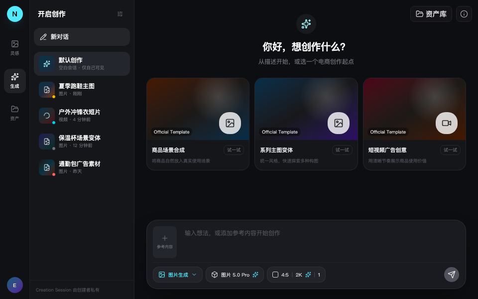
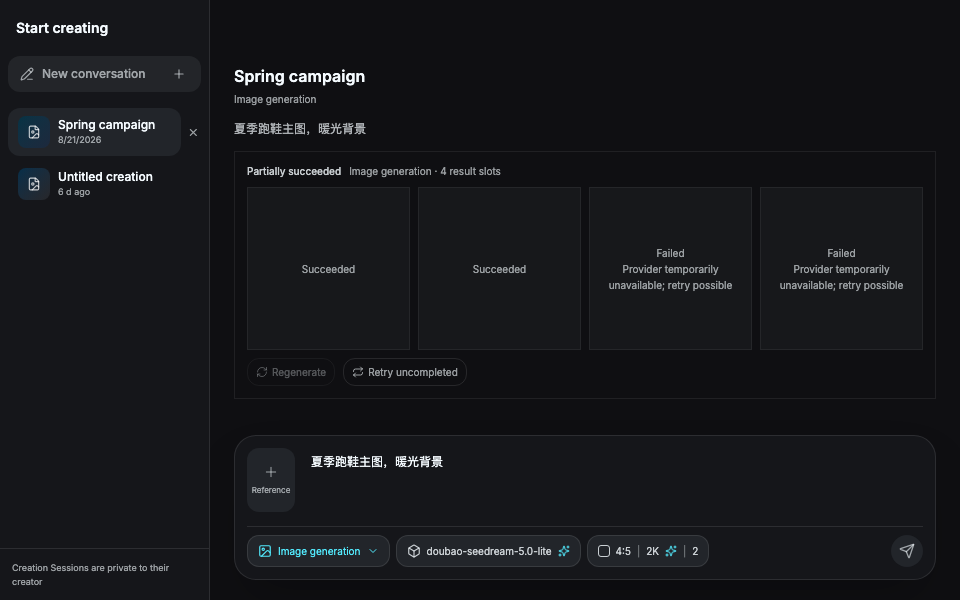
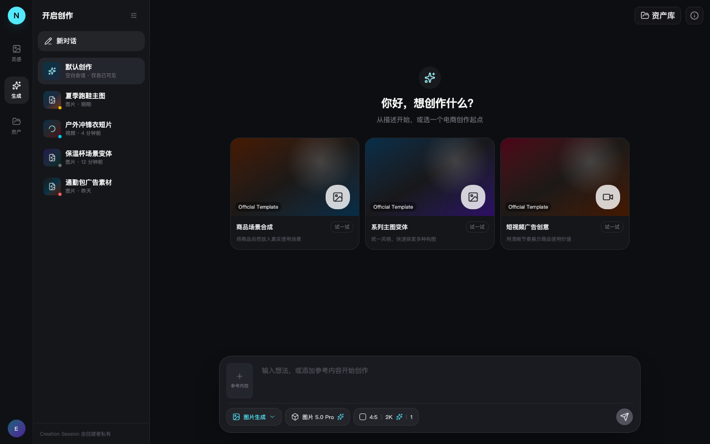
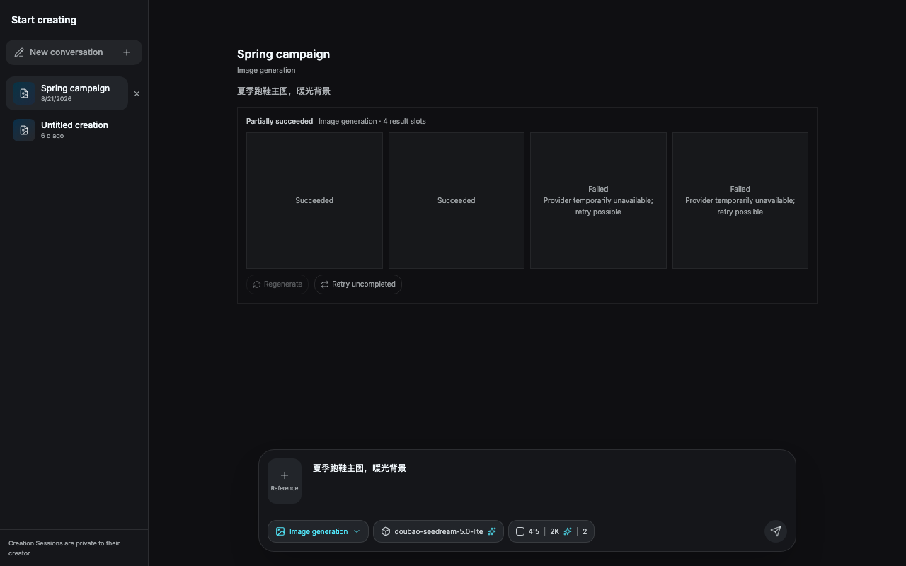

# Workbench 原型对比（issue #159 vs pinned snapshot 6e465e8）

对比基线：[原型验证创作工作台的信息架构与核心状态](https://github.com/wsgbwps/nevix-ai/issues/92)
pinned snapshot [6e465e8](https://github.com/wsgbwps/nevix-ai/commit/6e465e8d1f865d6c0e21b0e14b2e69bbab9e776a)
（分支 `codex/prototype-creation-workbench-redesign`，`prototype.creation-workbench.vite.config.ts` 独立入口）。

本切片的 shell、Task 状态、result slots 与 actions 在 960×600 与 1280×800 两个尺寸下与基线核对：

| 尺寸 | 原型（基线） | 本切片生产实现 |
| --- | --- | --- |
| 960×600 |  |  |
| 1280×800 |  |  |

## 保持一致的结构

- 左侧私有 Session 列表（含相对时间、删除入口、"Creation Session 由创建者私有" 页脚）、右侧连续工作区、底部固定 Composer。
- Composer：参考素材牌堆 + prompt 输入 + 媒体/模型/参数向上菜单 + 右侧圆形提交按钮；提交在无能力上下文时保持禁用（原型为常禁占位，见下方偏差 1）。
- Result Slot：连续四列直角画廊（`grid-cols-2 md:grid-cols-4`），slot 为正方形卡片，状态文字直接嵌入 slot 内 —— 与原型的 queued/生成中/成功/失败 状态落点一致，没有独立告示条。

## 有意偏差（均已在实现中说明理由）

1. **提交按钮从常禁占位变为可用的真实命令**：本切片交付 Generation Task 内核，提交按钮在完整草稿 + 当前 manifest 可用 + 无 stale 字段时激活，点击幂等提交；原型的禁用态保留为"能力上下文缺失/草稿 stale/保存中"时的降级形态。这是规格 #150「底部 composer 成为唯一提交入口」的直接要求。
2. **状态文案走产品 i18n 与稳定 machine vocabulary**（`gallery.status.*` / `gallery.reasons.*`），而非原型的硬编码中文演示词；英文界面语言同样成立。
3. **成功 slot 的内容来自已验证的转存输出**（经 Go 可信数据面取回的 blob），原型使用静态渐变占位图；空结果在输出未取回前显示状态文字而非伪造图像（模板真实性要求）。
4. **任务级 actions（取消/再次生成/只重试未完成项/indeterminate 风险确认）** 为本切片新增的真实命令表面；原型仅有视觉占位。indeterminate 重做前弹出显式风险确认（规格：重复生成/计费风险确认）。
5. 对比截图的生产侧通过真实组件（`CreationWorkbenchPage`）+ 脚本化 ports 渲染（组件测试同款 seam），不含 App Shell 侧栏 —— shell 布局由 #177 已验收的组装负责，本切片改动不触及。
