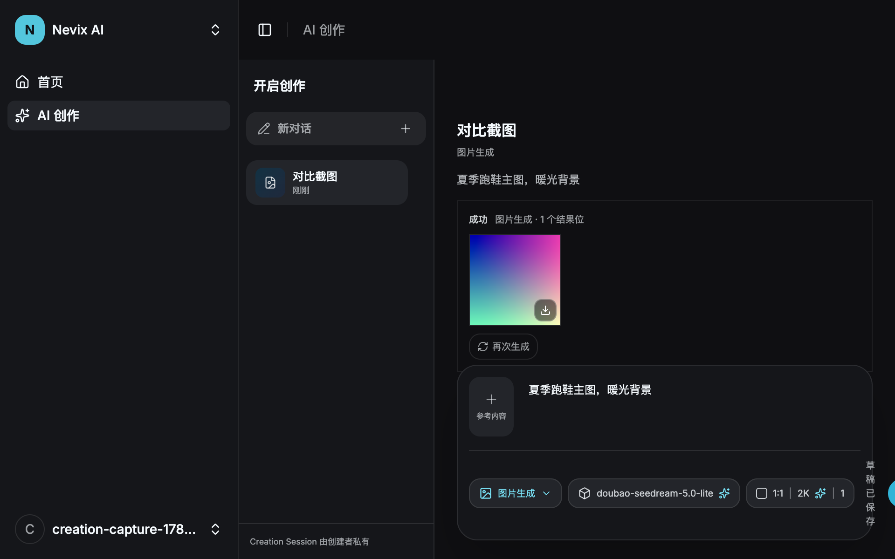
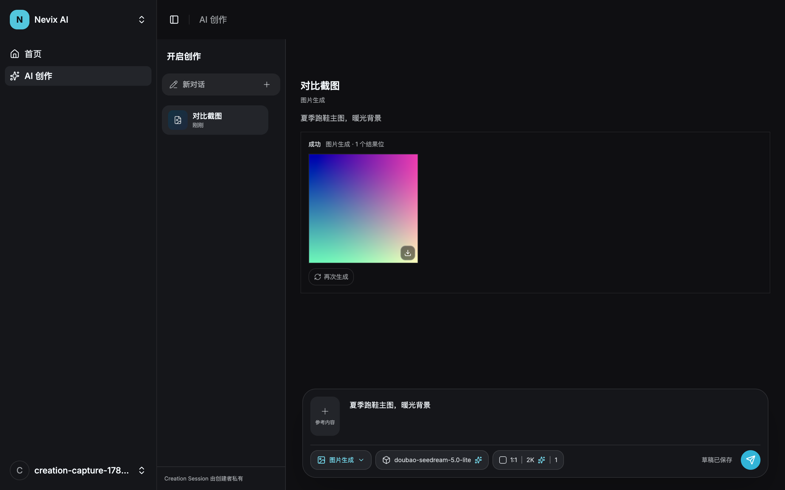

# Workbench 图片生成对比(issue #160 vs pinned snapshot 6e465e8)

对比基线:[原型验证创作工作台的信息架构与核心状态](https://github.com/wsgbwps/nevix-ai/issues/92)
pinned snapshot [6e465e8](https://github.com/wsgbwps/nevix-ai/commit/6e465e8d1f865d6c0e21b0e14b2e69bbab9e776a)
(分支 `codex/prototype-creation-workbench-redesign`)。原型侧截图沿用 #159 对同一 pinned
snapshot 的捕获(`../159-prototype-comparison/prototype-*.png`),本切片未改动该基线。

生产侧截图来自真实 Desktop app(真实 Go Server + fake Kapon 生成路由 + 真实图片任务收敛到
succeeded slot),见本目录 `production-960x600.png` 与 `production-1280x800.png`。

## 保持一致的结构(与 #92/#177 已验收基线逐项核对)

- 左侧私有 Session 列表 + 右侧连续工作区 + 底部固定 Composer 的三段结构。
- Composer:参考素材牌堆折叠入口 + prompt 输入 + 媒体/模型/模式/参数向上菜单 + 右侧圆形提交按钮。
- 图片参数菜单:比例网格(1:1/4:3/4:5/16:9/9:16)、三列分辨率(1K/2K/4K)、四列数量(1–4),
  默认 2K/1 张 —— 与 #150 图片合同一致,候选只来自当前 Capability Manifest。
- 结果区:连续四列直角 slot 画廊(`grid-cols-2 md:grid-cols-4`),状态文字嵌在 slot 内,
  无独立告示条。

## 有意偏差(相对原型)

1. **成功 slot 新增下载入口(右下角图标按钮)**:原型结果卡没有下载;本切片验收标准明确要求
   "下载……在 960×600 下可完成且具有键盘等价路径"。按钮可聚焦、Enter 触发,命名
   `nevix-<task>-<n>.png`,字节来自已验证的转存输出。
2. **部分成功/失败 slot 的 reason 与行动建议走稳定 machine vocabulary**
   (`gallery.reasons.*`,i18n 双语),原型为演示性硬编码文案。
3. **"只重试未完成项"在有 input/output_policy_rejected slot 时隐藏**(规格 #150 安全拒绝:
   不提供原样快捷 retry);原型无此语义。
4. slot 图像内容来自 Go 可信数据面取回的已验证 blob(原型为静态渐变占位)。

## 尺寸核对

| 尺寸 | 原型(基线) | 本切片生产实现 |
| --- | --- | --- |
| 960×600 | ../159-prototype-comparison/prototype-960x600.png |  |
| 1280×800 | ../159-prototype-comparison/prototype-1280x800.png |  |

两个尺寸下 composer 全要素可见、四列画廊完整呈现、菜单向上展开不被裁切。
